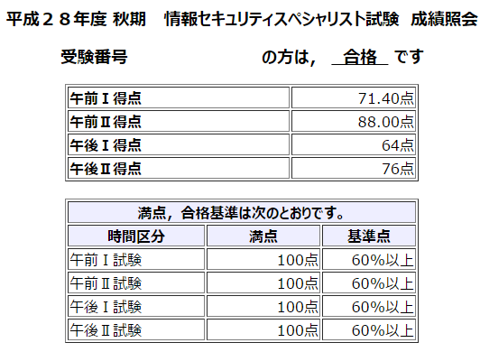

情報セキュリティスペシャリスト試験は今年度で廃止され、来年度から情報処理安全確保支援士試験が開始されます。

支援士は趣味で取るには費用面で厳しいため、廃止前に取っておきたいと思い、10 月 16 日に最後の情報セキュリティスペシャリスト試験を受験してきました。

## 準備
午前 I は、以前に応用情報技術者試験を受験したときに使った参考書を読みました。また、午前 II は適当に参考書を購入して読みました。

午後 I, II は過去問を少し読んで対策のしようがないなあと思い、特に何もせず本番に挑みました。本番では記述式の書き方に苦しみ、過去問を読み込んでおけばよかったと後悔しました…。

## 結果
12 月 16 日に試験の合否が発表されました。

合格しました。午後 I が 64 点となかなか危ない点数でした。

今後はデータベーススペシャリストやネットワークスペシャリストを受けてみたいと考えています。どちらもあまり知らない分野なので、試験の勉強を通じて知識や技術を身につけることができれば嬉しいですね。
