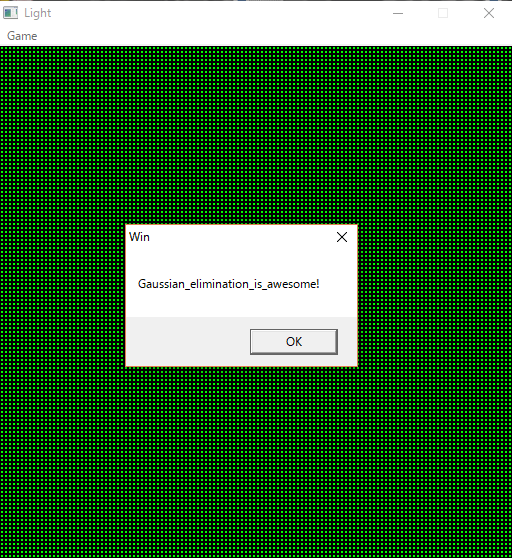

チーム Harekaze で [RCTF 2017](http://rctf.xctf.org.cn) に参加しました。最終的にチームで 2060 点を獲得し、順位は得点 620 チーム中 33 位でした。うち、私は 7 問を解いて 1626 点を入れました。

以下、解いた問題の write-up です。

## [Misc 32] Sign In

IRC のチャンネルに入ると、トピックにフラグが設定されていました。

```
RCTF{Welcome_To_RCTF_2017}
```

## [Misc 82] intoU

wav ファイルが与えられました。Audacity でスペクトログラムを見てみるとフラグがありました。

[](../images/2017-05-28_1.png)

```
RCTF{bmp_file_in_wav}
```

## [Misc 434] light

`Light.exe` という PE ファイルと `data` というファイルが与えられました。

`Light.exe` を実行し、メニューの Game -> Beginner を選択すると 5x5 のライツアウトの盤面が表示されました。

ただ、反転するライトは、クリックしたライト自身と上下左右 4 マスではなく、Tokyo Westerns/MMA CTF 2nd 2016 で出題された [Lights Out! という問題](https://github.com/TokyoWesterns/twctf-2016-problems/tree/master/Lights%20Out!)と同じルールになっています。

メニューの Game -> Load から添付の `data` を読み込んでみると、以下のような盤面がロードされました。

[](../images/2017-05-28_3.png)

人間には解けなさそうです。[うさぎさんの write-up のソルバ](https://kimiyuki.net/blog/2016/09/05/twctf-2016-lights-out/)をお借りして、出力された解答を SendMessage で `Light.exe` に送りましょう。

```c
#include <Windows.h>
#include <stdio.h>
#include <stdlib.h>
#include <unistd.h>

#define WINDOW_W 510
#define WINDOW_H 510

int main(int argc, char **argv) {
  HWND hWnd;
  int x, y, w, h;
  double tmpx, tmpy;
  char c;
  FILE *fp;

  if (argc != 4) {
    puts("usage: send <map> <w> <h>");
    return 1;
  }

  hWnd = FindWindow(NULL, "Light");
  w = atoi(argv[2]);
  h = atoi(argv[3]);

  if ((fp = fopen(argv[1], "r")) == NULL) {
    puts("[-] fopen");
    return 1;
  }

  for (y = 0; y < h; y++) {
    for (x = 0; x < w; x++) {
      c = fgetc(fp);
      if (c == '1') {
        tmpx = ((double) WINDOW_W / w) * x;
        tmpy = ((double) WINDOW_H / h) * y;
        SendMessage(hWnd, WM_LBUTTONDOWN, MK_LBUTTON, MAKELPARAM((int) tmpx + 2, (int) tmpy + 2));
      }
    }
  }

  fclose(fp);
  return 0;
}
```

`solve.exe 00060D36 data.txt 128 128` を実行するとフラグが表示されました。

[](../images/2017-05-28_2.png)

```
RCTF{Gaussian_elimination_is_awesome!}
```

## [Misc 238] mysql

`mysql_33b57617298bf5d1c9317fc7c8a11ef8.zip` という zip ファイルが与えられます。展開して ibdata1 を strings に投げるとフラグが得られました。

```
$ strings ibdata1 | grep flag
.flag71e55075163d5c6410c0d9eae499c977
.flag71e55075163d5c6410c0d9eae499c977
```

```
RCTF{71e55075163d5c6410c0d9eae499c977}
```

## [Misc 465] message

以下のような文字列が与えられます。

```
7fffffffffffffffffffffffffffffffbffff0e10419dff07fdc3ffdaeab6deffdbfff6ffed7f7aef3febfffb7ff1bfbc675931e33c79fadfdebbae7aeddedb7dafef7dc37df7ef6dbed777beedbedb77b6de24718f260e0e71879fffffffffffffffffffffffffffffffffffffffffff07f87fc7f9ffffffffdbfbbfdbfeffffffffebfdffdfff7ffffff871c33e6fe7bffffffd5aefeed62dcffffffeadf9fb8bb0efffffff56df5db6dbf7ffffffaa0c21e19e3bffffe07ffffffffff9fffffffffffffffffffffffffffffffffffffff
```

16 進数から 2 進数に変換すると 1679 ケタになります。`1679=23*73` なので 73 ビット区切りで出力するとフラグが出てきました。

```python
import re
s = open('msg.txt', 'r').read()
s = bin(int(s, 16))[2:].replace('0', '#').replace('1', ' ')
print '\n'.join(re.findall(r'.{73}', s))
```

```
$ python2 solve.py

                                                       #
 ####   #### ##### #####  ##   #         #####         #   ####
  #  # #   # # # #  #  #  #    #          #  #              #  #
  #  # #       #    # #   #    ##         # #               #  #
  ###  #       #    ###  ##   # #  ## ##  ###    ###  ##    ###    ##
  # #  #       #    # #   #   # #   ##    # #   #  #   #    #  #  #  #
  #  # #       #    #     #   ####  #     #     #      #    #  #  #  #
  #  # #   #   #    #     #   #  #  #     #  #  #  #   #    #  #  #  #
 ### ## ###   ###  ###    ## ##  #####   #####   ##   ###  ####    ##


                       #####        ####         ###        ##
                        #  #       #   #        #  #         #
                        # #        #           #             #
                 ####   ###   ####  ##     ##  #       ##    #
                 # # #  # #   #       #   #  # #  ### #  #   ##
                 # # #  #      ##      #   ### #   #  ####   #
                 # # #  #  #     # #   #  #  #  #  #  #      #
                 # # # #####  #### ####    ####  ##    ###   #
          ######                                            ##


```

```
RCTF{ArEciBo_mEsSaGe}
```

## [Reverse 111] easyre

easy_re という 32 ビットの ELF ファイルが与えられます。

バイナリエディタで眺めていると、ファイルの最後の方に `UPX!` とあり UPX でパックされていることが分かります。アンパックしましょう。

```
$ upx -d easy_re
                       Ultimate Packer for eXecutables
                          Copyright (C) 1996 - 2013
UPX 3.91        Markus Oberhumer, Laszlo Molnar & John Reiser   Sep 30th 2013

        File size         Ratio      Format      Name
   --------------------   ------   -----------   -----------
      7540 <-      4352   57.72%    linux/386    easy_re

Unpacked 1 file.
```

実行してみます。

```
$ ./bin 

OMG!!!! I forgot kid's id
Ready to exit     
hoge
```

何か入力を求められました。デコンパイルしてみると以下のようになりました。

```c
#include <stdio.h>
#include <stdlib.h>
#include <unistd.h>

void lol(char *arg) {
 // ...
}

int main(void) {
  int var_38[2]; // ebp-0x38
  int pid; // ebp-0x30
  int var_2c; // ebp-0x2c
  char var_22[...]; // ebp-0x22
  pipe(var_38);
  if ((pid = fork()) != 0) {
    read(var_38[0], var_22, 29);
    scanf("%d", &var_2c);
    if (var_2c != pid) {
      wait(0);
    } else {
      if (*(char *)(lol + 3) & 0xff != 0xcc) {
        printf("\nYou got the key\n ");
        lol(var_22);
      } else {
        puts(":D");
        exit(1);
      }
    }
  } else {
    puts("\nOMG!!!! I forgot kid's id");
    write(var_38[1], "69800876143568214356928753", 29);
    puts("Ready to exit     ");
    exit(0);
  }
  return 0;
}
```

入力をチェックしている処理を抜き出してみます。

```c
  if ((pid = fork()) != 0) {
    read(var_38[0], var_22, 29);
    scanf("%d", &var_2c);
    if (var_2c != pid) {
      wait(0);
    } else {
      if (*(char *)(lol + 3) & 0xff != 0xcc) {
        printf("\nYou got the key\n ");
        lol(var_22);
      } else {
        puts(":D");
        exit(1);
      }
    }
  }
```

fork された子プロセスのプロセス ID を入力すると `lol(var_22)` が実行されるようです。やってみましょう。

```
$ ./easy_re

OMG!!!! I forgot kid's id
Ready to exit
8453

You got the key
 flag_is_not_here
```

flag_is_not_here と言われてしまいました。`lol` を objdump で見てみましょう。

```
080485f4 <lol>:
 80485f4:       55                      push   ebp
 80485f5:       89 e5                   mov    ebp,esp
 80485f7:       83 ec 28                sub    esp,0x28
...
 80486b0:       c7 45 f4 00 00 00 00    mov    DWORD PTR [ebp-0xc],0x0
 80486b7:       83 7d f4 01             cmp    DWORD PTR [ebp-0xc],0x1
 80486bb:       75 16                   jne    80486d3 <lol+0xdf>
 80486bd:       b8 c0 88 04 08          mov    eax,0x80488c0
 80486c2:       8d 55 ed                lea    edx,[ebp-0x13]
 80486c5:       89 54 24 04             mov    DWORD PTR [esp+0x4],edx
 80486c9:       89 04 24                mov    DWORD PTR [esp],eax
 80486cc:       e8 ff fd ff ff          call   80484d0 <printf@plt>
 80486d1:       eb 0d                   jmp    80486e0 <lol+0xec>
 80486d3:       b8 c3 88 04 08          mov    eax,0x80488c3
 80486d8:       89 04 24                mov    DWORD PTR [esp],eax
 80486db:       e8 f0 fd ff ff          call   80484d0 <printf@plt>
 80486e0:       c9                      leave  
 80486e1:       c3                      ret 
```

```
mov    DWORD PTR [ebp-0xc],0x0
cmp    DWORD PTR [ebp-0xc],0x1
jne    80486d3 <lol+0xdf>
```

と、どのような条件でも必ず `0x80486d3` に飛ばされてしまうようになっています。`mov DWORD PTR [ebp-0xc],0x0` を `mov DWORD PTR [ebp-0xc],0x1` に変えてしまいましょう。

```
$ ./easy_re
OMG!!!! I forgot kid's id
Ready to exit
8636  

You got the key
 rhelheg
```

フラグが得られました。

```
RCTF{rhelheg}
```

### [Reverse 222] baby flash

`baby_flash.swf` という swf ファイルが与えられました。

JPEXS Free Flash Decompiler でデコンパイルできました。scripts/MyCPP/check の内容を見てみると以下のようになっていました。

```actionscript
package MyCPP
{
   import C_Run.*;
   import C_Run_D_3A__2F_software_2F_Tools_2F_CrossBridge_2F_cygwin_2F_tmp_2F_cc9QAEpL_2E_o_3A_d1fd6bd0_2D_036b_2D_49da_2D_bcfb_2D_b5dce5104397.L__2E_str4;
   import C_Run_D_3A__2F_software_2F_Tools_2F_CrossBridge_2F_cygwin_2F_tmp_2F_cc9QAEpL_2E_o_3A_d1fd6bd0_2D_036b_2D_49da_2D_bcfb_2D_b5dce5104397.L__2E_str5;
   import C_Run_D_3A__2F_software_2F_Tools_2F_CrossBridge_2F_cygwin_2F_tmp_2F_cc9QAEpL_2E_o_3A_d1fd6bd0_2D_036b_2D_49da_2D_bcfb_2D_b5dce5104397.L__2E_str6;
   import avm2.intrinsics.memory.li32;
   import avm2.intrinsics.memory.si32;
   import com.adobe.flascc.CModule;
   
   public function check(src:String) : void
   {
      var _as3ReturnValue:* = undefined;
      var ebp:* = 0;
      var i0:int = 0;
      var esp:* = int(ESP);
      ebp = esp;
      esp = int(esp - 16);
      si32(0,ebp - 4);
      ESP = esp & -16;
      i0 = CModule.mallocString(src);
      si32(i0,ebp - 4);
      i0 = li32(ebp - 4);
      esp = int(esp - 16);
      si32(i0,esp);
      ESP = esp;
      F_puts();
      esp = int(esp + 16);
      int(eax);
      i0 = li32(ebp - 4);
      esp = int(esp - 16);
      si32(i0,esp + 4);
      si32(L__2E_str4,esp);
      ESP = esp;
      F_strcmp();
      esp = int(esp + 16);
      i0 = eax;
      if(i0 != 0)
      {
         esp = int(esp - 16);
         si32(L__2E_str6,esp);
         ESP = esp;
         F_puts();
         esp = int(esp + 16);
         int(eax);
      }
      else
      {
         esp = int(esp - 16);
         si32(L__2E_str5,esp);
         ESP = esp;
         F_puts();
         esp = int(esp + 16);
         int(eax);
      }
      esp = ebp;
      ESP = esp;
      return _as3ReturnValue;
   }
}
```

ebp - 4 (ユーザ入力) と L__2E_str4 を F_strcmp で比較し、この返り値が 0 でなければ L__2E_str6 を、0 であれば L__2E_str5 を puts で出力するようです。

L__2E_str4 の内容は `RCTF{_Dyiin9__F1ash__1ike5_CPP}` のようですが、これを入力しても `Try again!` と表示されてしまいます。

F_strcmp の実装がどのようになっているか scripts/C_Run/F_strcmp を確認すると、以下のようになっていました。

```actionscript
package C_Run
{
   import avm2.intrinsics.memory.li32;
   import avm2.intrinsics.memory.li8;
   import avm2.intrinsics.memory.si32;
   import avm2.intrinsics.memory.si8;
   import avm2.intrinsics.memory.sxi8;
   
   [GlobalMethod]
   public function F_strcmp() : void
   {
      var ebp:* = 0;
      var i2:int = 0;
      var esp:* = int(ESP);
      ebp = esp;
      esp = int(esp - 44);
      si32(int(li32(ebp)),ebp - 4);
      si32(int(li32(ebp + 4)),ebp - 8);
      si32(int(li32(ebp - 4)),ebp - 24);
      si32(int(li32(ebp - 8)),ebp - 28);
      si32(2,ebp - 32);
      si32(3,ebp - 36);
      si32(0,ebp - 40);
      si32(0,ebp - 44);
      while(int(li8(int(li32(ebp - 24)))) != 0)
      {
         if(int(li8(int(li32(ebp - 28)))) == 0)
         {
            break;
         }
         var i1:int = li8(int(li32(ebp - 28)));
         if(int(li8(int(li32(ebp - 24)))) == i1)
         {
            var i0:int = li32(ebp - 40);
            i2 = 1;
            if(i0 != int(int(li32(ebp - 32)) << 1))
            {
               i2 = 0;
            }
            i0 = i2 & 1;
            si8(i0,ebp - 17);
            i0 = li32(ebp - 40);
            i0 = i0 + 1;
            si32(i0,ebp - 40);
            i0 = li8(ebp - 17);
            if(i0 != 0)
            {
               si32(int(int(li32(ebp - 24)) + 1),ebp - 24);
               si32(int(int(li32(ebp - 32)) + int(li32(ebp - 36))),ebp - 44);
               si32(int(li32(ebp - 36)),ebp - 32);
               si32(int(li32(ebp - 44)),ebp - 36);
            }
            si32(int(int(li32(ebp - 24)) + 1),ebp - 24);
            si32(int(int(li32(ebp - 28)) + 1),ebp - 28);
            continue;
         }
         break;
      }
      i0 = si8(li8(int(li32(ebp - 28))));
      si32(int(int(si8(li8(int(li32(ebp - 24))))) - i0),ebp - 16);
      si32(int(li32(ebp - 16)),ebp - 12);
      eax = int(li32(ebp - 12));
      esp = ebp;
      ESP = esp;
   }
}
```

`if(int(li8(int(li32(ebp - 24)))) == i1)` の直前に以下のコードを挿入して、比較されている 2 つの文字列を表示するようにしてみましょう。

```
getlocal_2
pushbyte 44
subtract
convert_i
setlocal_2
getlocal_1
pushbyte 24
subtract
li32
convert_i
getlocal_2
si32
getlocal_2
findproperty Qname(PackageNamespace("C_Run"),"ESP")
swap
setproperty Qname(PackageNamespace("C_Run"),"ESP")
findpropstrict Multiname("F_puts",[PackageNamespace("C_Run"),PackageNamespace("C_Run_D_3A__2F_software_2F_Tools_2F_CrossBridge_2F_cygwin_2F_tmp_2F_cc9QAEpL_2E_o_3A_d1fd6bd0_2D_036b_2D_49da_2D_bcfb_2D_b5dce5104397"),PackageNamespace("avm2.intrinsics.memory"),PackageNamespace("MyCPP"),PackageInternalNs("MyCPP"),PrivateNamespace("FilePrivateNS:alctmp-EPlkMJ"),PackageNamespace(""),Namespace("http://adobe.com/AS3/2006/builtin")])
callpropvoid Multiname("F_puts",[PackageNamespace("C_Run"),PackageNamespace("C_Run_D_3A__2F_software_2F_Tools_2F_CrossBridge_2F_cygwin_2F_tmp_2F_cc9QAEpL_2E_o_3A_d1fd6bd0_2D_036b_2D_49da_2D_bcfb_2D_b5dce5104397"),PackageNamespace("avm2.intrinsics.memory"),PackageNamespace("MyCPP"),PackageInternalNs("MyCPP"),PrivateNamespace("FilePrivateNS:alctmp-EPlkMJ"),PackageNamespace(""),Namespace("http://adobe.com/AS3/2006/builtin")]) 0
getlocal_2
pushbyte 44
add
convert_i
setlocal_2
getlocal_2
pushbyte 44
subtract
convert_i
setlocal_2
getlocal_1
pushbyte 28
subtract
li32
convert_i
getlocal_2
si32
getlocal_2
findproperty Qname(PackageNamespace("C_Run"),"ESP")
swap
setproperty Qname(PackageNamespace("C_Run"),"ESP")
findpropstrict Multiname("F_puts",[PackageNamespace("C_Run"),PackageNamespace("C_Run_D_3A__2F_software_2F_Tools_2F_CrossBridge_2F_cygwin_2F_tmp_2F_cc9QAEpL_2E_o_3A_d1fd6bd0_2D_036b_2D_49da_2D_bcfb_2D_b5dce5104397"),PackageNamespace("avm2.intrinsics.memory"),PackageNamespace("MyCPP"),PackageInternalNs("MyCPP"),PrivateNamespace("FilePrivateNS:alctmp-EPlkMJ"),PackageNamespace(""),Namespace("http://adobe.com/AS3/2006/builtin")])
callpropvoid Multiname("F_puts",[PackageNamespace("C_Run"),PackageNamespace("C_Run_D_3A__2F_software_2F_Tools_2F_CrossBridge_2F_cygwin_2F_tmp_2F_cc9QAEpL_2E_o_3A_d1fd6bd0_2D_036b_2D_49da_2D_bcfb_2D_b5dce5104397"),PackageNamespace("avm2.intrinsics.memory"),PackageNamespace("MyCPP"),PackageInternalNs("MyCPP"),PrivateNamespace("FilePrivateNS:alctmp-EPlkMJ"),PackageNamespace(""),Namespace("http://adobe.com/AS3/2006/builtin")]) 0
getlocal_2
pushbyte 44
add
convert_i
setlocal_2
```

`RCTF{_Dyiin9__F1ash__1ike5_CPP}` を入力してみます。先に出力されるのが L__2E_str4、その次に出力されるのがユーザ入力です。

[](../images/2017-05-28_4.png)

L__2E_str4 の 6 文字目が飛ばされて比較されています。`RCTF{Dyiin9__F1ash__1ike5_CPP}` を入力してみます。

[](../images/2017-05-28_5.png)

今度は L__2E_str4 の 9 文字目が飛ばされて比較されています。これを続けていくとフラグが得られました。

```
RCTF{Dyin9_F1ash_1ike5_CPP}
```