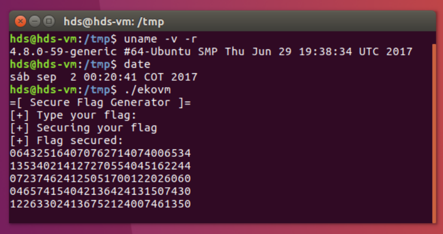

チーム Harekaze で [EKOPARTY CTF 2017](https://ctf.ekoparty.org/) に参加しました。最終的にチームで 5719 点を獲得し、順位は得点 184 チーム中 17 位でした。うち、私は 13 問を解いて 5391 点を入れました。

## [PWNING 359] Shopping

サーバ情報が与えられました。指定されたサーバに接続してみましょう。

```
$ nc shopping.ctf.site 21111
...
Welcome to Ekoparty shopping Center
Feel free to buy up to 5 items that you may like
Use wisely your coins, have fun!


You have 50 coins
What do you wanna buy today?
1. t-shirt              10
2. short                20
3. stickers             1
4. flag                 ?
```

`flag` を購入してみましょう。

```
4
How many?
1
You dont have enough coins
```

所持金が足りないようです。個数の入力で負数を指定できないか試してみましょう。

```
1
How many?
-100000
You dont have enough coins
You have 1000050 coins
```

できました。所持金が増えたので `flag` を購入できないか試してみましょう。

```
4
How many?
1
Congratulations, flag is EKO{d0_y0u_even_m4th?}
```

```
EKO{d0_y0u_even_m4th?}
```

## [PWNING 379] Shopwn

Shopping の続きのようです。指定されたサーバに接続してみましょう。

```
$ nc shopping.ctf.site 22222
...
Welcome to Ekoparty shopping Center
Feel free to buy up to 5 items that you may like
Use wisely your coins, have fun!


You have 50 coins
What do you wanna buy today?
1. t-shirt              10
2. short                20
3. stickers             1
4. flag                 ?
```

個数の入力で負数を指定できないか試してみましょう。

```
1
How many?
-1
You cant use negative values!
```

怒られてしまいました。今度は適当に大きな数値を入力してみましょう。

```
2
How many?
2147383648
You have 2000050 coins
```

所持金が増えたので `flag` を購入しましょう。

```
4
How many?
1
Congratulations, flag is EKO{dude_where_is_my_leak?}
```

```
EKO{dude_where_is_my_leak?}
```

## [VM 466] EKOVM

`ekovm` というファイルと以下のようなスクリーンショットが与えられました。



`ekovm` がどのようなファイルか `file` で調べてみましょう。

```
$ file ./ekovm
./ekovm: ELF 64-bit LSB shared object, x86-64, version 1 (SYSV), dynamically linked, interpreter /lib64/ld-linux-x86-64.so.2, for GNU/Linux 2.6.32, BuildID[sha1]=b1794c23c269bde857a4fa30f07817877690dc0a, stripped
```

実行してみます。

```
$ date && echo -en "aaaaa" | ./ekovm 
Sun Sep 17 07:11:08 JST 2017
=[ Secure Flag Generator ]=
[+] Type your flag: 
[+] Securing your flag
[+] Flag secured:
137102704137102704137102704
137102704137102704
$ date && echo -en "aaaaa" | ./ekovm 
Sun Sep 17 07:11:08 JST 2017
=[ Secure Flag Generator ]=
[+] Type your flag: 
[+] Securing your flag
[+] Flag secured:
137102704137102704137102704
137102704137102704
$ date && echo -en "aaaaa" | ./ekovm 
Sun Sep 17 07:11:09 JST 2017
=[ Secure Flag Generator ]=
[+] Type your flag: 
[+] Securing your flag
[+] Flag secured:
100405204100405204100405204
100405204100405204
$ date && echo -en "aaaaa" | ./ekovm 
Sun Sep 17 07:11:11 JST 2017
=[ Secure Flag Generator ]=
[+] Type your flag: 
[+] Securing your flag
[+] Flag secured:
103602304103602304103602304
103602304103602304
```

入力された文字列を 1 文字ずつ 9 ケタの数値に変換しています。また、この変換のされ方は 1 秒ごとに変わっているようです。

どこかで `time(NULL)` が使われていそうなので、以下のような感じで差し替えてしまいましょう。

```
$ cat a.c
int time(int t) {
  return 1500000000;
}
$ gcc -o a.so a.c -shared -fPIC
$ date && echo -en "aaaaa" | LD_PRELOAD=./a.so ./ekovm
Sun Sep 17 09:25:32 JST 2017
=[ Secure Flag Generator ]=
[+] Type your flag: 
[+] Securing your flag
[+] Flag secured:
113634100113634100113634100
113634100113634100
$ date && echo -en "aaaaa" | LD_PRELOAD=./a.so ./ekovm
Sun Sep 17 09:25:45 JST 2017
=[ Secure Flag Generator ]=
[+] Type your flag: 
[+] Securing your flag
[+] Flag secured:
113634100113634100113634100
113634100113634100
```

結果を固定化できました。

スクリーンショットから `ekovm` が実行される何秒か前の日時が分かるので、これを元に入力を `EKO{` に固定して `time()` の返り値を少しずつ変えていくと UNIX 時間で `1504329734` に `ekovm` が実行されたと分かりました。

あとは雑に総当たりするとフラグが得られました。

```python
import re
import string
from pwn import *

m = re.compile(r'\d{9}')
encrypted = '064325164070762714074006534135340214127270554045162244072374624125051700122026060046574154042136424131507430122633024136752124007461350'
table = {}

for c in string.printable:
  s = process('./ekovm', env={'LD_PRELOAD': './a.so'})
  s.recvuntil('Type your flag:')
  s.send(c)
  s.recvuntil('Flag secured:')
  table[m.findall(s.recvall())[0]] = c

flag = ''
for c in m.findall(encrypted):
  flag += table[c]
print flag
```

```
$ python solve.py
...
EKO{s1Mpl3-vm}
```

```
EKO{s1Mpl3-vm}
```

## [Web 400] FirstAPP

与えられた URL にアクセスすると、`/getflag` へのリンクがありました。`/getflag` にアクセスすると認証が要求されましたが、ユーザ名もパスワードも分かりません。

CSS と `/license.txt` の内容から CodeIgniter が使われていることが分かりました。`/index.php/getflag` にアクセスするとフラグが得られました。

```
EKO{fucking_m0d_r3wr1t3}
```

## [MISC 410] Special

スコアボードの背景画像を見ると、以下のようなコードが表示されていました。

```
...
if flag[4:-1][::-1].encode('hex') == '\x37\x39\x37\x33\x36\x31\x36\x35\x37\x30\x35\x66\x37\x39\x37\x33\x36\x31\x36\x35':
    passed = True
...
```

`print 'EKO{' + '\x37\x39\x37\x33\x36\x31\x36\x35\x37\x30\x35\x66\x37\x39\x37\x33\x36\x31\x36\x35'.decode('hex')[::-1] + '}'` でフラグが得られました。

```
EKO{easy_peasy}
```

## [MISC 422] LateRecon

公式の IRC チャンネルに接続すると、トピックにフラグが設定されていました。

```
EKO{C4tch_M3_If_Y0u_C4n?}
```

## [MISC 256] Malbolge

サーバ情報が与えられました。サーバでは Malbolge の処理系が動いており、`Welcome to EKOPARTY!` と出力させるコードを入力すればよいようです。[Malbolge Tools](http://zb3.me/malbolge-tools/) でコードを生成しましょう。

```
EKO{0nly4nother3soteric1anguage}
```

## [MISC 480] OldPC

`misc-oldpc.hex` というテキストファイルが与えられました。

先頭の `9D E3 BF 90` で検索すると SPARC で `save %sp, -112, %sp` という命令を意味すると分かりました。

[Index of /~aurel32/qemu/sparc](https://people.debian.org/~aurel32/qemu/sparc/) から `debian_etch_sparc_small.qcow2` をダウンロードして `qemu-system-sparc -hda debian_etch_sparc_small.qcow2` を実行し、gcc をインストールしましょう。

```c
char main[] = "\x9D\xE3\xBF\x90\x90\x10\x20\x01\x03\x00\x00\x41\x92\x10\x62\x1C\x94\x10\x20\x04\x82\x10\x20\x04\x91\xD0\x20\x10\x01\x00\x00\x00\x92\x10\x20\x83\x94\x10\x20\x7F\x96\x10\x20\x71\x98\x10\x20\x6D\x1B\x2B\x90\x8A\x9A\x03\x62\x3E\x40\x00\x00\x43\x01\x00\x00\x00\x92\x10\x20\x6B\x94\x10\x20\x67\x96\x10\x20\x65\x98\x10\x20\x61\x1B\x07\x85\xC0\x9A\x13\x60\x13\x40\x00\x00\x3B\x01\x00\x00\x00\x92\x10\x20\x59\x94\x10\x20\x53\x96\x10\x20\x4F\x98\x10\x20\x49\x1B\x01\x81\x88\x9A\x03\x63\x3D\x40\x00\x00\x33\x01\x00\x00\x00\x92\x10\x20\x47\x94\x10\x20\x43\x96\x10\x20\x3D\x98\x10\x20\x3B\x1B\x0D\x48\x98\x9A\x13\x62\x76\x40\x00\x00\x2B\x01\x00\x00\x00\x92\x10\x20\x35\x94\x10\x20\x2F\x96\x10\x20\x2B\x98\x10\x20\x29\x1B\x01\x92\x07\x9A\x03\x63\x76\x40\x00\x00\x23\x01\x00\x00\x00\x92\x10\x20\x25\x94\x10\x20\x1F\x96\x10\x20\x1D\x98\x10\x20\x17\x1B\x19\x57\xD3\x9A\x13\x62\x47\x40\x00\x00\x1B\x01\x00\x00\x00\x92\x10\x20\x13\x94\x10\x20\x11\x96\x10\x20\x0D\x98\x10\x20\x0B\x1B\x14\x90\xD3\x9A\x03\x62\x4B\x40\x00\x00\x13\x01\x00\x00\x00\x92\x10\x20\x07\x94\x10\x20\x05\x96\x10\x20\x03\x98\x10\x20\x02\x1B\x11\xD6\x0F\x9A\x13\x62\x2F\x40\x00\x00\x0B\x01\x00\x00\x00\x90\x10\x20\x01\x03\x00\x00\x41\x92\x10\x62\x21\x94\x10\x20\x02\x82\x10\x20\x04\x91\xD0\x20\x10\x90\x10\x20\x00\x82\x10\x20\x01\x91\xD0\x20\x10\x9D\xE3\xBF\xC0\xFA\x23\x80\x00\xFA\x0B\x80\x00\xBA\x1F\x40\x19\xFA\x2B\x80\x00\xFA\x0B\xA0\x01\xBA\x1F\x40\x1A\xFA\x2B\xA0\x01\xFA\x0B\xA0\x02\xBA\x1F\x40\x1B\xFA\x2B\xA0\x02\xFA\x0B\xA0\x03\xBA\x1F\x40\x1C\xFA\x2B\xA0\x03\x90\x10\x20\x01\x92\x10\x00\x0E\x94\x10\x20\x04\x82\x10\x20\x04\x91\xD0\x20\x10\x81\xC7\xE0\x08\x81\xE8\x00\x00\x45\x4B\x4F\x7B\x00\x7D\x0A\x00";
```

をコンパイルして実行するとフラグが得られました。

```
EKO{-=[Super_Ultra_M3g4_@@SPARC@@]=-}
```

## [REVERSING 399] WarmUp

`warmup` というファイルが与えられました。`file` に投げてみましょう。

```
$ file ./warmup
./warmup: ELF 64-bit LSB executable, x86-64, version 1 (GNU/Linux), statically linked, for GNU/Linux 2.6.32, BuildID[sha1]=b9e93849cf9889813b7f88f5b7a0609df69bbf48, stripped
```

stripped な x86_64 の ELF のようです。

`Enter your values: ` という文字列が 0xa1704 に存在しています。objdump で逆アセンブルしてこの文字列を参照している箇所を探しましょう。

```
  4009ae:	55                   	push   rbp
  4009af:	48 89 e5             	mov    rbp,rsp
  4009b2:	bf 04 17 4a 00       	mov    edi,0x4a1704       # "Enter your values: "
  4009b7:	b8 00 00 00 00       	mov    eax,0x0
  4009bc:	e8 ef ed 00 00       	call   0x40f7b0           # printf
  4009c1:	be 60 cd 6c 00       	mov    esi,0x6ccd60
  4009c6:	bf 18 17 4a 00       	mov    edi,0x4a1718       # "%s"
  4009cb:	b8 00 00 00 00       	mov    eax,0x0
  4009d0:	e8 0b ef 00 00       	call   0x40f8e0           # scanf
  4009d5:	90                   	nop
  4009d6:	5d                   	pop    rbp
  4009d7:	c3                   	ret    
```

`Enter your values: ` を出力した後、`scanf("%s", 0x6ccd60)` で文字列の入力を行っています。続いて 0x6ccd60 を参照している箇所を探しましょう。

```
  4009d8:	55                   	push   rbp
  4009d9:	48 89 e5             	mov    rbp,rsp
  4009dc:	b8 62 cd 6c 00       	mov    eax,0x6ccd62
  4009e1:	0f b6 10             	movzx  edx,BYTE PTR [rax]
  4009e4:	b8 1b 17 4a 00       	mov    eax,0x4a171b
  4009e9:	0f b6 00             	movzx  eax,BYTE PTR [rax]
  4009ec:	38 c2                	cmp    dl,al
  4009ee:	0f 85 64 03 00 00    	jne    0x400d58
  4009f4:	b8 72 cd 6c 00       	mov    eax,0x6ccd72
  4009f9:	0f b6 10             	movzx  edx,BYTE PTR [rax]
  4009fc:	b8 1d 17 4a 00       	mov    eax,0x4a171d
  400a01:	0f b6 00             	movzx  eax,BYTE PTR [rax]
  400a04:	38 c2                	cmp    dl,al
  400a06:	0f 85 45 03 00 00    	jne    0x400d51
  400a0c:	b8 6d cd 6c 00       	mov    eax,0x6ccd6d
  400a11:	0f b6 10             	movzx  edx,BYTE PTR [rax]
  400a14:	b8 1f 17 4a 00       	mov    eax,0x4a171f
  400a19:	0f b6 00             	movzx  eax,BYTE PTR [rax]
  400a1c:	38 c2                	cmp    dl,al
  400a1e:	0f 85 26 03 00 00    	jne    0x400d4a
  400a24:	b8 67 cd 6c 00       	mov    eax,0x6ccd67
  400a29:	0f b6 10             	movzx  edx,BYTE PTR [rax]
  400a2c:	b8 21 17 4a 00       	mov    eax,0x4a1721
  400a31:	0f b6 00             	movzx  eax,BYTE PTR [rax]
  400a34:	38 c2                	cmp    dl,al
  400a36:	0f 85 07 03 00 00    	jne    0x400d43
...
```

1 文字ずつバラバラに参照して、バイナリ上にあるフラグと比較しています。0x4009d8 ~ 0x400c6a を `mov eax` で grep して `memo.txt` に保存し、以下のスクリプトを実行するとファイルが得られました。

```python
with open('memo.txt', 'r') as f:
  s = f.read().splitlines()

with open('warmup', 'rb') as f:
  binary = f.read()

flag = [None] * 28
for a, b in zip(s[::2], s[1::2]):
  a = int(a, 16) - 0x6ccd60
  b = int(b, 16) - 0x400000
  flag[a] = binary[b]
print ''.join(flag)
```

```
EKO{1s_th1s_ju5t_4_w4rm_up?}
```

## [REVERSING 417] Rhapsody

`rhapsody` というファイルが与えられました。`file` に投げてみましょう。

```
$ file ./rhapsody
./rhapsody: ELF 64-bit LSB executable, x86-64, version 1 (GNU/Linux), statically linked, for GNU/Linux 2.6.32, BuildID[sha1]=bd7e71ed6beb1391aef45a3d00584cbcc202150d, stripped
```

stripped な x86_64 の ELF のようです。

`Enter your values` という文字列が 0xa2724 に存在しています。objdump で逆アセンブルしてこの文字列を参照している箇所を探しましょう。

```
4009ae:	55                   	push   rbp
4009af:	48 89 e5             	mov    rbp,rsp
4009b2:	bf 24 27 4a 00       	mov    edi,0x4a2724       # "Enter your values"
4009b7:	e8 14 08 01 00       	call   0x4111d0           # printf
4009bc:	be 40 ee 6c 00       	mov    esi,0x6cee40
4009c1:	bf 36 27 4a 00       	mov    edi,0x4a2736       # "%s"
4009c6:	b8 00 00 00 00       	mov    eax,0x0
4009cb:	e8 30 ff 00 00       	call   0x410900           # scanf
4009d0:	90                   	nop
4009d1:	5d                   	pop    rbp
4009d2:	c3                   	ret    
```

`Enter your values` を出力した後、`scanf("%s", 0x6cee40)` で文字列の入力を行っています。続いて 0x6cee40 を参照している箇所を探しましょう。

```
  400a59:	55                   	push   rbp
  400a5a:	48 89 e5             	mov    rbp,rsp
  400a5d:	b8 00 00 00 00       	mov    eax,0x0
  400a62:	e8 6c ff ff ff       	call   0x4009d3
  400a67:	88 05 b3 e3 2c 00    	mov    BYTE PTR [rip+0x2ce3b3],al        # 0x6cee20
  400a6d:	b8 5d ee 6c 00       	mov    eax,0x6cee5d
  400a72:	0f b6 10             	movzx  edx,BYTE PTR [rax]
  400a75:	b8 39 27 4a 00       	mov    eax,0x4a2739
  400a7a:	0f b6 00             	movzx  eax,BYTE PTR [rax]
  400a7d:	38 c2                	cmp    dl,al
  400a7f:	75 17                	jne    0x400a98
  400a81:	8b 05 e9 d1 2c 00    	mov    eax,DWORD PTR [rip+0x2cd1e9]        # 0x6cdc70
  400a87:	83 f0 07             	xor    eax,0x7
  400a8a:	89 05 e0 d1 2c 00    	mov    DWORD PTR [rip+0x2cd1e0],eax        # 0x6cdc70
  400a90:	8b 05 da d1 2c 00    	mov    eax,DWORD PTR [rip+0x2cd1da]        # 0x6cdc70
  400a96:	eb 05                	jmp    0x400a9d
  400a98:	b8 00 00 00 00       	mov    eax,0x0
  400a9d:	5d                   	pop    rbp
  400a9e:	c3                   	ret

  400a9f:	55                   	push   rbp
  400aa0:	48 89 e5             	mov    rbp,rsp
  400aa3:	b8 00 00 00 00       	mov    eax,0x0
  400aa8:	e8 26 ff ff ff       	call   0x4009d3
  400aad:	88 05 6d e3 2c 00    	mov    BYTE PTR [rip+0x2ce36d],al        # 0x6cee20
  400ab3:	b8 48 ee 6c 00       	mov    eax,0x6cee48
  400ab8:	0f b6 10             	movzx  edx,BYTE PTR [rax]
  400abb:	b8 3b 27 4a 00       	mov    eax,0x4a273b
  400ac0:	0f b6 00             	movzx  eax,BYTE PTR [rax]
  400ac3:	38 c2                	cmp    dl,al
  400ac5:	75 17                	jne    0x400ade
  400ac7:	8b 05 a3 d1 2c 00    	mov    eax,DWORD PTR [rip+0x2cd1a3]        # 0x6cdc70
  400acd:	83 f0 04             	xor    eax,0x4
  400ad0:	89 05 9a d1 2c 00    	mov    DWORD PTR [rip+0x2cd19a],eax        # 0x6cdc70
  400ad6:	8b 05 94 d1 2c 00    	mov    eax,DWORD PTR [rip+0x2cd194]        # 0x6cdc70
  400adc:	eb 05                	jmp    0x400ae3
  400ade:	b8 00 00 00 00       	mov    eax,0x0
  400ae3:	5d                   	pop    rbp
  400ae4:	c3                   	ret
  400ae5:	55                   	push   rbp
  400ae6:	48 89 e5             	mov    rbp,rsp
  400ae9:	b8 00 00 00 00       	mov    eax,0x0
  400aee:	e8 e0 fe ff ff       	call   0x4009d3
  400af3:	88 05 27 e3 2c 00    	mov    BYTE PTR [rip+0x2ce327],al        # 0x6cee20
  400af9:	b8 4c ee 6c 00       	mov    eax,0x6cee4c
  400afe:	0f b6 10             	movzx  edx,BYTE PTR [rax]
  400b01:	b8 3d 27 4a 00       	mov    eax,0x4a273d
  400b06:	0f b6 00             	movzx  eax,BYTE PTR [rax]
  400b09:	38 c2                	cmp    dl,al
  400b0b:	75 17                	jne    0x400b24
  400b0d:	8b 05 5d d1 2c 00    	mov    eax,DWORD PTR [rip+0x2cd15d]        # 0x6cdc70
  400b13:	83 f0 06             	xor    eax,0x6
  400b16:	89 05 54 d1 2c 00    	mov    DWORD PTR [rip+0x2cd154],eax        # 0x6cdc70
  400b1c:	8b 05 4e d1 2c 00    	mov    eax,DWORD PTR [rip+0x2cd14e]        # 0x6cdc70
  400b22:	eb 05                	jmp    0x400b29
  400b24:	b8 00 00 00 00       	mov    eax,0x0
  400b29:	5d                   	pop    rbp
  400b2a:	c3                   	ret
```

1 文字ずつバラバラに参照して、バイナリ上にあるフラグと比較しています。gdb で `cmp    dl,al` で grep して出てきたアドレスにブレークポイントを設置し、`al` レジスタに入っている値を集めるとフラグが得られました。

```
EKO{1sth1sr34lfl4g0rjus7f4n74s34}
```

## [REVERSING 473] Angel

`angel` というファイルが与えられました。`file` に投げてみましょう。

```
$ file ./angel
angel: ELF 32-bit LSB executable, Intel 80386, version 1 (SYSV), dynamically linked, interpreter /lib/ld-linux.so.2, for GNU/Linux 2.6.32, BuildID[sha1]=04bda8fc3bea5b2b1698589bd0cd115769d1061a, stripped
```

x86 の ELF のようです。

objdump で逆アセンブルすると以下のような処理がありました。

```
 8048609:	0f b6 45 eb          	movzx  eax,BYTE PTR [ebp-0x15]
 804860d:	c1 e0 04             	shl    eax,0x4
 8048610:	8d 90 40 c1 04 08    	lea    edx,[eax+0x804c140]
 8048616:	a1 48 d1 04 08       	mov    eax,ds:0x804d148
 804861b:	83 ec 08             	sub    esp,0x8
 804861e:	52                   	push   edx
 804861f:	50                   	push   eax
 8048620:	e8 26 ff ff ff       	call   804854b
 8048625:	83 c4 10             	add    esp,0x10
 8048628:	a1 48 d1 04 08       	mov    eax,ds:0x804d148
 804862d:	89 c1                	mov    ecx,eax
 804862f:	8b 55 f0             	mov    edx,DWORD PTR [ebp-0x10]
 8048632:	8b 45 08             	mov    eax,DWORD PTR [ebp+0x8]
 8048635:	01 d0                	add    eax,edx
 8048637:	0f b6 00             	movzx  eax,BYTE PTR [eax]
 804863a:	0f b6 c0             	movzx  eax,al
 804863d:	83 ec 0c             	sub    esp,0xc
 8048640:	50                   	push   eax
 8048641:	ff d1                	call   ecx
 8048643:	83 c4 10             	add    esp,0x10
 8048646:	89 45 f4             	mov    DWORD PTR [ebp-0xc],eax
 8048649:	8b 45 ec             	mov    eax,DWORD PTR [ebp-0x14]
 804864c:	8b 14 85 60 c0 04 08 	mov    edx,DWORD PTR [eax*4+0x804c060]
 8048653:	8b 45 f4             	mov    eax,DWORD PTR [ebp-0xc]
 8048656:	39 c2                	cmp    edx,eax
 8048658:	74 12                	je     804866c
```

`ebp+0x8` にはユーザ入力、`ebp-0x15` には 1 つ前の文字、`ebp-0x14` には 1 つ前のインデックス、`ebp-0x10` には現在のインデックス、0x804c060 には暗号化された文字列が入っています。

gdb で 0x8048641 (`call eax`) と 0x8048656 (`edx, eax`) にブレークポイントを設置し、入力した文字がどのように変換されてどのような数値と比較されるかを調べましょう。

```
$ gdb ./angel
gdb-peda$ b *0x8048641
Breakpoint 1 at 0x8048641
gdb-peda$ b *0x8048656
Breakpoint 2 at 0x8048656
gdb-peda$ r
[EKOPARTY 2017] MESSAGE: hoge
gdb-peda$ pdisas $ecx
Dump of assembler code from 0xf7fd7000 to 0xf7fd7020::  Dump of assembler code from 0xf7fd7000 to 0xf7fd7020:
   0xf7fd7000:  push   ebp
   0xf7fd7001:  mov    ebp,esp
   0xf7fd7003:  sub    esp,0x10
   0xf7fd7006:  mov    eax,DWORD PTR [ebp+0x8]
   0xf7fd7009:  xor    ecx,ecx
   0xf7fd700b:  mov    cl,0x22
   0xf7fd700d:  mul    ecx
   0xf7fd700f:  sub    eax,0xc
   0xf7fd7012:  add    eax,0x3b
   0xf7fd7015:  add    eax,0x54
   0xf7fd7018:  leave  
   0xf7fd7019:  ret
gdb-peda$ c
gdb-peda$ p/x $edx
$2 = 0xcb
```

```
gdb-peda$ r
[EKOPARTY 2017] MESSAGE: fuga
gdb-peda$ pdisas $ecx
Dump of assembler code from 0xf7fd7000 to 0xf7fd7020::  Dump of assembler code from 0xf7fd7000 to 0xf7fd7020:
   0xf7fd7000:  push   ebp
   0xf7fd7001:  mov    ebp,esp
   0xf7fd7003:  sub    esp,0x10
   0xf7fd7006:  mov    eax,DWORD PTR [ebp+0x8]
   0xf7fd7009:  xor    ecx,ecx
   0xf7fd700b:  sub    eax,0x27
   0xf7fd700e:  mov    cl,0x74
   0xf7fd7010:  mul    ecx
   0xf7fd7012:  add    eax,0xd8
   0xf7fd7017:  sub    eax,0x76
   0xf7fd701a:  sub    eax,0x7e
   0xf7fd701d:  leave  
   0xf7fd701e:  ret
gdb-peda$ c
gdb-peda$ p/x $edx
$4 = 0xcb
```

2 文字目の変換に使われる関数は 1 文字目が何であるかによって決まるようです。変換の結果が 0xcb になる 2 文字の文字列を探すと `8t` や `yo` などが見つかりました。

`yo` から始まると考えてこの次にどの文字が続くか変換を逆算すると `u` が当てはまると分かりました。これを何度か続けると `you are looking for this EKO{4ngr_d1dn't_like_th1s}` が元の文字列であると分かりました。

```
EKO{4ngr_d1dn't_like_th1s}
```

## [REVERSING 475] IA64

`IA64EXE` というファイルが与えられました。`file` に投げてみましょう。

```
$ file ./IA64EXE
./IA64EXE: ELF 64-bit MSB relocatable, IA-64, version 1, not stripped
```

IA-64 の ELF のようです。objdump で逆アセンブルしましょう。

```
$ ia64-linux-gnu-objdump -d -m ia64-elf64 ./IA64EXE
IA64EXE:     file format elf64-big


Disassembly of section .text0:

0000000000000000 <SHOW_FLAG>:
   0:   09 00 19 06 80 05       [MMI]       alloc r32=ar.pfs,6,3,0
   6:   c0 00 33 7e 46 40                   adds r12=-32,r12
   c:   04 08 00 84                         mov r34=r1;;
  10:   00 00 00 00 01 00       [MII]       nop.m 0x0
  16:   10 02 00 62 00 00                   mov r33=b0
  1c:   01 61 00 84                         adds r8=16,r12
  20:   0a 18 00 02 00 24       [MMI]       addl r3=0,r1;;
  26:   20 00 0c 30 20 a0                   ld8 r2=[r3]
  2c:   83 01 00 90                         mov r29=24
  30:   09 20 00 1a 80 15       [MMI]       st1 [r13]=r0,4
  36:   00 00 00 02 00 60                   nop.m 0x0
  3c:   04 40 00 84                         mov r35=r8;;
  40:   11 20 01 04 00 21       [MIB]       mov r36=r2
  46:   50 02 74 00 42 00                   mov r37=r29
  4c:   08 00 00 50                         br.call.sptk.many b0=40 <SHOW_FLAG+0x40>;;
  50:   01 08 00 44 00 21       [MII]       mov r1=r34
  56:   c0 01 00 00 48 00                   mov r28=0
  5c:   00 00 04 00                         nop.i 0x0;;
  60:   01 20 00 1a 80 15       [MII]       st1 [r13]=r0,4
  66:   b0 01 70 2a 00 00                   sxt2 r27=r28
  6c:   00 00 04 00                         nop.i 0x0;;
  70:   11 38 5c 36 80 31       [MIB]       cmp4.lt p7,p0=23,r27
  76:   00 00 00 02 80 03                   nop.i 0x0
  7c:   d0 00 00 43                   (p07) br.cond.dpnt.few 140 <SHOW_FLAG+0x140>;;
  80:   02 d0 fc 01 ff 25       [MII]       mov r26=65535
  86:   00 00 00 02 00 20                   nop.i 0x0;;
  8c:   03 d0 48 00                         zxt4 r25=r26
  90:   0b c0 30 36 00 20       [MMI]       add r24=r12,r27;;
  96:   40 81 60 00 42 00                   adds r20=16,r24
  9c:   00 00 04 00                         nop.i 0x0;;
  a0:   02 98 00 28 00 10       [MII]       ld1 r19=[r20]
  a6:   00 00 00 02 00 40                   nop.i 0x0;;
  ac:   02 98 40 00                         zxt1 r18=r19
  b0:   0b 88 68 01 01 24       [MMI]       mov r17=218;;
  b6:   00 91 44 1e 40 00                   xor r16=r18,r17
  bc:   00 00 04 00                         nop.i 0x0;;
  c0:   01 00 00 00 01 00       [MII]       nop.m 0x0
  c6:   f0 00 40 22 00 c0                   zxt2 r15=r16
  cc:   01 e0 44 00                         zxt2 r14=r28;;
  d0:   0b 58 3c 1c 05 20       [MMI]       sub r11=r15,r14;;
  d6:   a0 58 64 18 40 00                   and r10=r11,r25
  dc:   00 00 04 00                         nop.i 0x0;;
  e0:   03 00 00 00 01 00       [MII]       nop.m 0x0
  e6:   90 00 28 22 00 00                   zxt2 r9=r10;;
  ec:   01 48 54 00                         sxt2 r8=r9;;
  f0:   11 00 20 00 06 38       [MIB]       cmp.eq p0,p6=r8,r0
  f6:   00 00 00 02 00 03                   nop.i 0x0
  fc:   20 00 00 42                   (p06) br.cond.dptk.few 110 <SHOW_FLAG+0x110>;;
 100:   11 18 00 00 00 24       [MIB]       mov r3=0
 106:   00 00 00 02 00 00                   nop.i 0x0
 10c:   20 00 00 40                         br.few 120 <SHOW_FLAG+0x120>;;
 110:   01 18 fc f9 ff 27       [MII]       mov r3=-1
 116:   00 00 00 02 00 00                   nop.i 0x0
 11c:   00 00 04 00                         nop.i 0x0;;
 120:   01 00 00 00 01 00       [MII]       nop.m 0x0
 126:   20 00 0c 20 00 00                   zxt1 r2=r3
 12c:   00 00 04 00                         nop.i 0x0;;
 130:   11 00 08 28 80 11       [MIB]       st1 [r20]=r2
 136:   c0 09 6c 00 42 00                   adds r28=1,r27
 13c:   38 ff ff 48                         br.many 60 <SHOW_FLAG+0x60>;;
 140:   02 00 00 00 01 00       [MII]       nop.m 0x0
 146:   00 08 05 80 03 00                   mov b0=r33;;
 14c:   00 02 aa 00                         mov.i ar.pfs=r32
 150:   11 60 80 18 00 21       [MIB]       adds r12=32,r12
 156:   00 00 00 02 00 80                   nop.i 0x0
 15c:   08 00 84 00                         br.ret.sptk.many b0;;
        ...

Disassembly of section .text1:

0000000000000000 <MAIN_PROC>:
   0:   09 00 2d 06 80 05       [MMI]       alloc r32=ar.pfs,11,3,0
   6:   c0 80 32 7e 46 40                   adds r12=-48,r12
   c:   04 08 00 84                         mov r34=r1;;
  10:   11 20 00 1a 80 15       [MIB]       st1 [r13]=r0,4
  16:   10 02 00 62 00 00                   mov r33=b0
  1c:   08 00 00 50                         br.call.sptk.many b0=10 <MAIN_PROC+0x10>;;
  20:   00 18 01 00 00 24       [MII]       mov r35=0
  26:   40 02 00 00 48 00                   mov r36=0
  2c:   00 00 04 00                         nop.i 0x0
  30:   19 28 01 00 00 24       [MMB]       mov r37=0
  36:   60 02 00 00 48 00                   mov r38=0
  3c:   00 00 00 20                         nop.b 0x0;;
  40:   00 38 01 00 00 24       [MII]       mov r39=0
  46:   80 02 00 00 48 00                   mov r40=0
  4c:   00 00 04 00                         nop.i 0x0
  50:   19 48 01 00 00 24       [MMB]       mov r41=0
  56:   a0 02 00 00 48 00                   mov r42=0
  5c:   00 00 00 20                         nop.b 0x0;;
  60:   0b 50 40 18 00 21       [MMI]       adds r10=16,r12;;
  66:   00 00 28 30 23 20                   st8 [r10]=r0
  6c:   81 61 00 84                         adds r9=24,r12;;
  70:   01 00 00 12 98 11       [MII]       st8 [r9]=r0
  76:   80 00 31 00 42 00                   adds r8=32,r12
  7c:   00 00 04 00                         nop.i 0x0;;
  80:   01 00 00 10 98 11       [MII]       st8 [r8]=r0
  86:   30 40 31 00 42 00                   adds r3=40,r12
  8c:   00 00 04 00                         nop.i 0x0;;
  90:   01 00 00 06 98 11       [MII]       st8 [r3]=r0
  96:   20 80 31 00 42 00                   adds r2=48,r12
  9c:   00 00 04 00                         nop.i 0x0;;
  a0:   11 00 00 04 98 11       [MIB]       st8 [r2]=r0
  a6:   00 00 00 02 00 00                   nop.i 0x0
  ac:   08 00 00 50                         br.call.sptk.many b0=a0 <MAIN_PROC+0xa0>;;
  b0:   0b 08 00 44 00 21       [MMI]       mov r1=r34;;
  b6:   40 00 34 00 2b 00                   st1 [r13]=r0,4
  bc:   10 0a 00 07                         mov b0=r33;;
  c0:   00 00 00 00 01 00       [MII]       nop.m 0x0
  c6:   00 00 00 02 00 00                   nop.i 0x0
  cc:   00 02 aa 00                         mov.i ar.pfs=r32
  d0:   11 60 c0 18 00 21       [MIB]       adds r12=48,r12
  d6:   00 00 00 02 00 80                   nop.i 0x0
  dc:   08 00 84 00                         br.ret.sptk.many b0;;
```

`SHOW_FLAG` では、文字列を 1 文字ずつ 218 と xor してからインデックスを引いています。0x6d9 辺りにそれっぽいものがあったのでデコードしましょう。

```python
with open('IA64EXE', 'rb') as f:
  s = f.read()

print ''.join(chr((ord(c) ^ 218) - i) for i, c in enumerate(s[0x6d9:0x6d9+24]))
```

```
$ python2 solve.py
EKO{1ntel_1T4N1UM+RUl3z}
```

```
EKO{1ntel_1T4N1UM+RUl3z}
```

## [REVERSING 455] MobCipher

`rev-mobcipher.apk` という apk ファイルが与えられました。

zip として展開してみると、`assets/www/` 下に `cordova.js` や `index.html` といったファイルが存在していました。どうやら `rev-mobcipher.apk` は Apache Cordova で作られた Android アプリケーションのようです。

`assets/www/index.html` は以下のような内容でした。

```html
<!DOCTYPE html>
<html lang="en" dir="ltr">
<head>
  <script data-ionic="inject">
    (function(w){var i=w.Ionic=w.Ionic||{};i.version='3.5.3';i.angular='4.1.3';i.staticDir='build/';})(window);
  </script>
  <meta charset="UTF-8">
  <title>Ionic App</title>
  <meta name="viewport" content="width=device-width, initial-scale=1.0, minimum-scale=1.0, maximum-scale=1.0, user-scalable=no">
  <meta name="format-detection" content="telephone=no">
  <meta name="msapplication-tap-highlight" content="no">

  <link rel="icon" type="image/x-icon" href="assets/icon/favicon.ico">
  <link rel="manifest" href="manifest.json">
  <meta name="theme-color" content="#4e8ef7">

  <!-- cordova.js required for cordova apps -->
  <script src="cordova.js"></script>

  <!-- un-comment this code to enable service worker
  <script>
    if ('serviceWorker' in navigator) {
      navigator.serviceWorker.register('service-worker.js')
        .then(() => console.log('service worker installed'))
        .catch(err => console.error('Error', err));
    }
  </script>-->

  <link href="build/main.css" rel="stylesheet">

</head>
<body>

  <!-- Ionic's root component and where the app will load -->
  <ion-app></ion-app>

  <!-- The polyfills js is generated during the build process -->
  <script src="build/polyfills.js"></script>

  <!-- The vendor js is generated during the build process
       It contains all of the dependencies in node_modules -->
  <script src="build/vendor.js"></script>

  <!-- The main bundle js is generated during the build process -->
  <script src="build/main.js"></script>

</body>
</html>
```

`assets/www/build/main.js` で `EKO{` を検索してみると以下のような処理が見つかりました。

```javascript
var HomePage = (function () {
    function HomePage(navCtrl, params) {
        this.navCtrl = navCtrl;
        this.params = params;
        this.cipherflag = 'sdvejusrskmgmwpzwyznsrhbcivhhtkski';
        this.falseflag = 'EKO{this is not the flag}';
        this.key = this.params.get('p1');
        this.doCrypt();
    }
    HomePage.prototype.doCrypt = function () {
        var result;
        var key = this.filterKey(this.key);
        for (var i = 0; i < key.length; i++)
            key[i] = (26 - key[i]) % 26;
        result = this.crypt(this.cipherflag, key);
        this.plainflag = 'EKO{' + result + '}';
    };
    HomePage.prototype.crypt = function (input, key) {
        var output = "";
        for (var i = 0, j = 0; i < input.length; i++) {
            var c = input.charCodeAt(i);
            if (this.isUppercase(c)) {
                output += String.fromCharCode((c - 65 + key[j % key.length]) % 26 + 65);
                j++;
            }
            else if (this.isLowercase(c)) {
                output += String.fromCharCode((c - 97 + key[j % key.length]) % 26 + 97);
                j++;
            }
            else {
                output += input.charAt(i);
            }
        }
        return output;
    };
    HomePage.prototype.filterKey = function (key) {
        var result = [];
        for (var i = 0; i < key.length; i++) {
            var c = key.charCodeAt(i);
            if (this.isLetter(c) && ((c - 65) % 32) != 15)
                result.push((c - 65) % 32);
        }
        return result;
    };
    HomePage.prototype.isLetter = function (c) {
        return this.isUppercase(c) || this.isLowercase(c);
    };
    HomePage.prototype.isUppercase = function (c) {
        return 65 <= c && c <= 90; // 65 is character code for 'A'. 90 is 'Z'.
    };
    // Tests whether the specified character code is a lowercase letter.
    HomePage.prototype.isLowercase = function (c) {
        return 97 <= c && c <= 122; // 97 is character code for 'a'. 122 is 'z'.
    };
    return HomePage;
}());
```

シーザー暗号を使っているようです。

`p1` を検索してみると `'<ion-nav [root]="rootPage" [rootParams]="{\'p1\': \'Eko2017Passphrase\'}"></ion-nav>\n'` という文字列が見つかりました。`Eko2017Passphrase` をパスフレーズとして `sdvejusrskmgmwpzwyznsrhbcivhhtkski` を復号してみましょう。

```python
import itertools

def caesar(c, n):
  if c.isupper():
    return chr((ord(c) - 0x41 - n + 26) % 26 + 0x41)
  if c.islower():
    return chr((ord(c) - 0x61 - n + 26) % 26 + 0x61)
  return c

def pattern(k):
  return itertools.cycle((ord(c) - 0x41) % 32 for c in k if c.isalpha() and (ord(c) - 0x41) % 32 != 15)

def decrypt(c, k):
  res = ''
  for c, n in zip(c, pattern(k)):
    res += caesar(c, n)
  return res

print 'EKO{' + decrypt('sdvejusrskmgmwpzwyznsrhbcivhhtkski', 'Eko2017Passphrase') + '}'
```

```
$ python2 solve.py
EKO{otherclassiccipherinandroidpackage}
```

```
EKO{otherclassiccipherinandroidpackage}
```