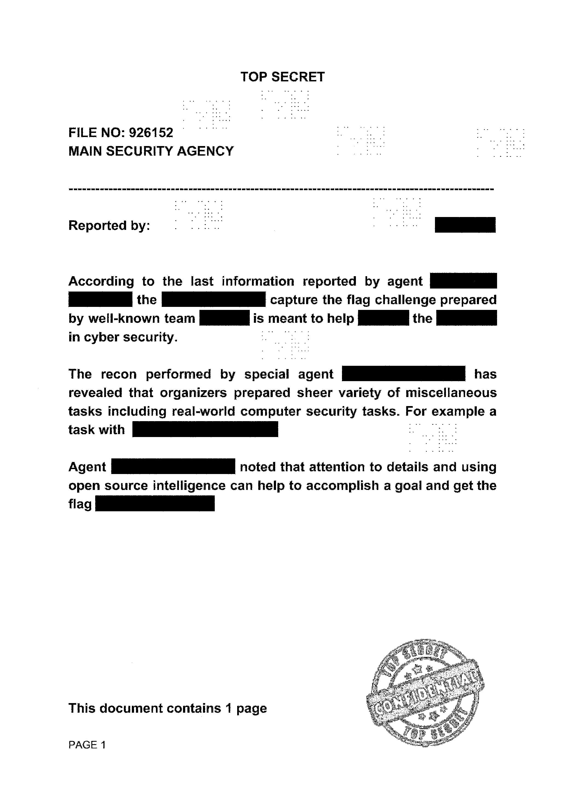

チーム Harekaze で [School CTF 2017](https://school-ctf.org/) に参加しました。最終的にチームで 3800 点を獲得し、順位は得点 130 チーム中 7 位でした。うち、私は 13 問を解いて 3400 点を入れました。

以下、解いた問題の write-up です。

## [Joy 500] RFC 1149

`traffic_330cbb585cd1f661d7c375bfe559b2a91cb6afda.pcap` という pcap ファイルと、`task_03a4e8338119dffb6f9e927003d7ea21c5d3bedf.jpg` という以下のような内容の画像が与えられました。

```
0000 0800 4500 0058 7e49 4000 4011 a839 0a08 0001 0a08 0002 a598 270f 0044 876c 442b 6874
4a61 7578 754c 7358 5a52 5453 6555 5453 5831 4f78 524b 4652 516c 6376 5755 4e58 4a4b 744a
7538 6579 7856 4652 326e 466d 6f36 5a7a 6741 3d3d
```

pcap ファイルを NetworkMiner に投げると `chat` という gzip ファイルが抽出できました。これを展開すると `chat.pyc` と `tun.pyc` という pyc ファイルが出てきました。

`chat.pyc` を uncompyle6 でデコンパイルすると以下のような結果になりました。

```python
# uncompyle6 version 2.11.3
# Python bytecode 3.5 (3350)
# Decompiled from: Python 2.7.9 (default, Mar  1 2015, 12:57:24) 
# [GCC 4.9.2]
# Embedded file name: /chat.py
# Compiled at: 2017-08-03 08:00:51
# Size of source mod 2**32: 3227 bytes
import asyncio
import threading
import sys
import zlib
import base64
import itertools
PORT = 9999
VERSIONS = ('v1', 'v2')
CURRENT_VERSION = sys.argv[2] if len(sys.argv) == 3 and sys.argv[2] in VERSIONS else VERSIONS[0]

class Message:

    def __init__(self, message):
        self.text = message

    def encode(self):
        if CURRENT_VERSION == VERSIONS[0]:
            return self.text.encode()
        return base64.b64encode(bytearray([a ^ b for a, b in zip(zlib.compress(self.text.encode()), itertools.cycle('wtfkey'))]))

    @staticmethod
    def decode(data):
        if CURRENT_VERSION == VERSIONS[0]:
            return Message(data.decode())
        return zlib.decompress(bytearray([a ^ b for a, b in zip(base64.b64decode(data), itertools.cycle('wtfkey'))])).decode()

    def __str__(self):
        return self.text


class Console:

    @staticmethod
    def write(message):
        print('\r< {}\n> '.format(message), end='')

    @staticmethod
    def read():
        return Message(input('\r> '))


class ChatProtocol:

    def __init__(self, message, loop):
        self.message = message
        self.loop = loop
        self.transport = None

    def connection_made(self, transport):
        self.transport = transport
        if self.message:
            self.transport.sendto(self.message.encode())

    def datagram_received(self, data, addr):
        Console.write(Message.decode(data))

    def error_received(self, exc):
        pass

    def connection_lost(self, exc):
        pass


class Sender(threading.Thread):

    def __init__(self, ip, port, loop):
        super().__init__(daemon=True)
        self.ip = ip
        self.port = port
        self.loop = loop

    def run(self):
        while True:
            message = Console.read()
            protocol = lambda : ChatProtocol(message, self.loop)
            connection = self.loop.create_datagram_endpoint(protocol, remote_addr=(self.ip, self.port))
            asyncio.run_coroutine_threadsafe(connection, self.loop)


class Receiver:

    def __init__(self, ip, port, loop):
        self.ip = ip
        self.port = port
        self.loop = loop

    def start(self):
        protocol = lambda : ChatProtocol(None, self.loop)
        coro = self.loop.create_datagram_endpoint(protocol, local_addr=(self.ip, self.port))
        self.task = self.loop.create_task(coro)


def main():
    if len(sys.argv) not in (2, 3):
        print('Usage: {} <user_ip> <version>'.format(sys.argv[0]))
        print('Available versions: {}'.format(', '.join(VERSIONS)))
        exit(1)
    print('Your are using chat {}'.format(CURRENT_VERSION))
    loop = asyncio.get_event_loop()
    Receiver('0.0.0.0', PORT, loop).start()
    Sender(sys.argv[1], PORT, loop).start()
    try:
        try:
            loop.run_forever()
        except:
            pass

    finally:
        loop.close()


if __name__ == '__main__':
    main()
# okay decompiling chat.pyc
```

画像ファイルの内容を展開してみましょう。

```python
import zlib
from pwn import *
s = '442b68744a617578754c73585a5254536555545358314f78524b4652516c637657554e584a4b744a7538657978564652326e466d6f365a7a67413d3d'
print zlib.decompress(xor(s.decode('hex').decode('base64'), 'wtfkey'))
```

```
$ python solve.py
SchoolCTF{P1930n5/4r3#w47ch1n9+y0u}
```

フラグが得られました。

```
SchoolCTF{P1930n5/4r3#w47ch1n9+y0u}
```

## [PPC 100] StRiNgMuTaToR 1.0

問題サーバに接続してみると、以下のようなメッセージが表示されました。

```
$ nc nc.task.school-ctf.org 41447
Welcome in the StRiNgMuTaToR, stranger!
Type 'start' to start the challenge and 'help' to show language reference.
> help
LyaStRiNgMuTaToR v 0.2a:
====================================================================================
StRiNgMuTaToR internal language has 16 opcodes ranging from '0' to 'f'. Every opcode
maps to the certain operation over the input string. Opcodes executed from the left
to the right
====================================================================================
Opcodes Reference:
        - '0'     - Reverse the string
        - '1'     - Swap the halves of the string
        - '2'-'3' - Reverse halves of the string
        - '4'-'7' - Reverse quoters of the string
        - '8'-'b' - Cyclically shift the quoters to the left
        - 'c'-'f' - Cyclically shift the quoters to the right
```

実装してみましょう。

```python
import re
from pwn import *

def interpret(s, prog):
  l = len(s)
  h, q = l // 2, l // 4
  for c in prog:
    c = int(c, 16)
    if c == 0:
      s = s[::-1]
    elif c == 1:
      s = s[h:] + s[:h]
    elif 2 <= c <= 3:
      i = c - 2
      m = re.findall(r'.{' + str(h) + '}', s)
      m[i] = m[i][::-1]
      s = ''.join(m)
    elif 4 <= c <= 7:
      i = c - 4
      m = re.findall(r'.{' + str(q) + '}', s)
      m[i] = m[i][::-1]
      s = ''.join(m)
    elif 8 <= c <= 0xb:
      i = c - 8
      m = re.findall(r'.{' + str(q) + '}', s)
      m[i] = m[i][1:] + m[i][:1]
      s = ''.join(m)
    elif 0xc <= c <= 0xf:
      i = c - 0xc
      m = re.findall(r'.{' + str(q) + '}', s)
      m[i] = m[i][-1:] + m[i][:-1]
      s = ''.join(m)
  return s

s = remote('nc.task.school-ctf.org', 41447)
s.recvuntil('> ')
s.sendline('start')

for _ in range(100):
  log.info(s.recvuntil("program '"))
  prog = s.recvuntil("'")[:-1]
  s.recvuntil("sequence '")
  seq = s.recvuntil("'")[:-1]
  log.info('program : %r' % prog)
  log.info('sequence : %r' % seq)

  s.recvuntil('> ')
  res = interpret(seq, prog)
  log.info('result : %r' % res)
  s.sendline(res)
  log.info(s.recvline())

s.interactive()
```

```
$ python solve.py
[+] Opening connection to nc.task.school-ctf.org on port 41447: Done
[*] Now apply the program '
[*] program : '08a5b'
[*] sequence : 'RfBXKysWBoZlKUnsWSVZYhQzFOQodEVgqibDmFEAlxFQVXNTMAEHEMkGjAPfMnFB'
[*] result : 'FnMfPAjGkMEHEAMBqibDmFEAlxFQVXNTVEdoQOFzQhYZVSWgnUKlZoBWsyKXBfRs'
[*] Great!
[*] Now apply the program '
[*] program : '9fcdf14'
[*] sequence : 'lRfUpaTgxBzfagVqMYUOsSZgnikzbRhxJYzhOBRlUaKUVLnEigZtAFNuiWwkPooj'
[*] result : 'EnLVUKaUlRBOhzYJojigZtAFNuiWwkPoqlRfUpaTgxBzfagVMYUOsSZgnikzbRhx'
[*] Great!
[*] Now apply the program '
[*] program : 'acd90aef9'
[*] sequence : 'PjFLrFtoHDGECmVYqtfDFKzmqxpXwfVGBuhNIQioQRATQMOlXCwFtoBMZocEoZCn'
[*] result : 'nCZoEcoZMBotFwCXlOMQTARQoiQINhuBGVfwXpxqmzKFDftqYVmCEGDHotFrLFjP'
[*] Great!
[*] Now apply the program '
[*] program : 'a2760c9afd1'
[*] sequence : 'TNBvVcMBCQNglGYfeWvuOsfCMAmhgjayxsKLnjjmBKOCRqonaMXVEkgrIUWFUHgS'
[*] result : 'NBvVcMBCQNglGYfTyeWvuOsfCMAmhgjaSaMXVEkgrIUWFUHgsKLnjjmBKOCRqonx'
[*] Great!
[*] Now apply the program '
[*] program : 'cf3bfbb2d26b8'
[*] sequence : 'EuJtphPtfcjAxsCSycFmdBjrKuOzIUApRPmAACeRDhESmTOjENTGOitMbzamUgjZ'
[*] result : 'uJtphPtfcjAxsCSEycFmdBjrKuOzIUApZENTGOitMbzamUgjmSEhDReCAAmPRjOT'
...
[*] Switching to interactive mode
Awesome! Here is your flag, m8: 'SchoolCTF{U/c@n-n3v3r_0wN_M3}'
[*] Got EOF while reading in interactive
```

フラグが得られました。

```
SchoolCTF{U/c@n-n3v3r_0wN_M3}
```

## [PPC 200] Paranoid Passwords

与えられた URL にアクセスすると、ユーザの登録フォームが表示されました。

…が、パスワードの制限が厳しく、以下の条件を全て満たす必要がありました。

```
Password must be more than 16 characters
Password length must be odd
Password length must not be prime
Password must contains 23 capital letters
Password length must be fibonacci
Password can't contain multiple capital letters in a row
Capital letters in the password should form a nondecreasing sequence
Password must contain symbol '@'
Password must contain symbol ']'
Password must contain substring '666' or '13'
```

`AhBoCgDeEhFoGgHeIhJoKgLeMhNoOgPeQhRoSgTeUhVoW666ogeho]@` をパスワードに登録するとフラグが得られました。

```
SchoolCTF{d0n!t_7h1nk_th@t!$_m0r3_s3cUr3_7h@n_qw3rty}
```

## [Reverse 200] Properly Decorated

以下のような Python のソースコードと、これによって変換された `MeW_^sto?👈🏼_v0r_qexq/ONEpto\MeW_^op\iiv_🎓🏴👉🏼@^_MeW_^qefkh` という文字列が与えられました。

```python
#!/usr/bin/env python3
# -*- coding: utf-8 -*-
import sys
import random
import string
from functools import wraps
from base64 import b32decode as b32


FLAG = "XXX"


def emojified(f):
    @wraps(f)
    def decorated_function(arg, *args, **kwargs):
        arg = arg.replace('{', '👉🏼')
        arg = arg.replace('}', '👈🏼')
        arg = arg.replace('School', '🎓')
        arg = arg.replace('CTF', '🏴')
        return f(arg, *args, **kwargs)
    return decorated_function


def reversed(f):
    @wraps(f)
    def decorated_function(arg, *args, **kwargs):
        arg = arg[:-1]
        return f(arg, *args, **kwargs)
    return decorated_function


def splitted(sep='_'):
    def real_decorator(f):
        @wraps(f)
        def decorated_function(arg, *args, **kwargs):
            arg = arg.split(sep)
            return f(arg, *args, **kwargs)
        return decorated_function
    return real_decorator


def mixed(seed=0):
    def real_decorator(f):
        @wraps(f)
        def decorated_function(arg, *args, **kwargs):
            random.seed(seed)
            random.shuffle(arg)
            return f(arg, *args, **kwargs)
        return decorated_function
    return real_decorator


def joined(sep='_'):
    def real_decorator(f):
        @wraps(f)
        def decorated_function(arg, *args, **kwargs):
            arg = sep.join(arg)
            return f(arg, *args, **kwargs)
        return decorated_function
    return real_decorator


def verbosed(f):
    @wraps(f)
    def decorated_function(arg, *args, **kwargs):
        num2words = {1: 'One', 2: 'Two', 3: 'Three', 4: 'Four', 5: 'Five',
                     6: 'Six', 7: 'Seven', 8: 'Eight', 9: 'Nine', 10: 'Ten'}
        for k, v in num2words.items():
            arg = arg.replace(str(k), v.upper())
        return f(arg, *args, **kwargs)
    return decorated_function


def caesared(key):
    def real_decorator(f):
        @wraps(f)
        def decorated_function(arg, *args, **kwargs):
            arg = ''.join(
                chr((ord(c) - 0x61 + key) % len(string.ascii_lowercase) + 0x61)
                if c in string.ascii_lowercase else c for c in arg
            )
            return f(arg, *args, **kwargs)
        return decorated_function
    return real_decorator


def shuffled(from_, to):
    def real_decorator(f):
        @splitted(from_)
        @mixed(len(from_))
        @joined(to)
        @wraps(f)
        def decorated_function(arg, *args, **kwargs):
            return f(arg, *args, **kwargs)
        return decorated_function
    return real_decorator


def kittyfied(mew):
    def real_decorator(f):
        @wraps(f)
        def decorated_function(arg, *args, **kwargs):
            arg=arg.replace(mew, '^_MeW_^')
            return f(arg, *args, **kwargs)
        return decorated_function
    return real_decorator


@emojified
@splitted()
@mixed(int.from_bytes(mixed.__name__.encode(), 'big'))
@joined()
@verbosed
@caesared(random.randint(10,100))
@shuffled((297515763796).to_bytes(5, 'little').decode(), 'to')
@kittyfied(b32(b'N52G6===').decode())
@splitted('_^_')
@mixed(sys.version_info[0])
@joined('\\')
def print_flag(flag):
    print(flag)


if __name__ == "__main__":
    print_flag(FLAG)
```

いろいろめんどくさい変換が行われていますが、ランダム性があるのは `@caesared(random.randint(10,100))` のみです。[適当なツール](https://st98.github.io/sandbox/caesar/index.html)で試していると、右に 3 シフトしたときに `y0u` や `that` など意味の通る単語が現れました。

あとは 1 個ずつ戻していくとフラグが得られました。

```python
# coding; utf-8
import random

def deshuffle(s, seed=0):
  random.seed(seed)
  t = list(range(len(s)))
  random.shuffle(t)
  res = []
  for x in range(len(s)):
    res.append(s[t.index(x)])
  return res

def caesar(s, n):
  return ''.join(chr((ord(c) - 0x61 + n) % 26 + 0x61) if 'a' <= c <= 'z' else c for c in s)

num2words = {1: 'One', 2: 'Two', 3: 'Three', 4: 'Four', 5: 'Five',
             6: 'Six', 7: 'Seven', 8: 'Eight', 9: 'Nine', 10: 'Ten'}

s = 'MeW_^sto?👈🏼_v0r_qexq/ONEpto\MeW_^op\iiv_🎓🏴👉🏼@^_MeW_^qefkh'
s = s.split('\\')
s = deshuffle(s, 3)
s = '_^_'.join(s)
s = s.replace('^_MeW_^', 'oto')
s = s.split('to')
s = 'THREE'.join(deshuffle(s, len('THREE')))
s = caesar(s, 3)
for k, v in num2words.items():
  s = s.replace(v.upper(), str(k))
s = s.split('_')
s = deshuffle(s, 469920933220)
s = '_'.join(s)
s = s.replace('👉🏼', '{')
s = s.replace('👈🏼', '}')
s = s.replace('🎓', 'School')
s = s.replace('🏴', 'CTF')

print(s)
```

```
$ python solve.py
SchoolCTF{@r3_y0u_r3lly_think_that/1s_r3v3rs3?}
```

```
SchoolCTF{@r3_y0u_r3lly_think_that/1s_r3v3rs3?}
```

## [Reverse 300] Brute me all night long

`bruteme_75b59ed0692fe72c69b31c633fdb06c10c0d4b85.exe` というファイルが与えられました。file に投げてどのようなファイルか確認しましょう。

```
$ file ./bruteme_75b59ed0692fe72c69b31c633fdb06c10c0d4b85.exe
./bruteme_75b59ed0692fe72c69b31c633fdb06c10c0d4b85.exe: PE32 executable (console) Intel 80386 Mono/.Net assembly, for MS Windows
```

.NET のアプリケーションのようです。[dnSpy](https://github.com/0xd4d/dnSpy) でデコンパイルしてみましょう。

```csharp
		public static void Main()
		{
			Process notepadWindow = SchoolCTF.GetNotepadWindow("Why'd");
			if (notepadWindow != null)
			{
				string text = SchoolCTF.GetText(notepadWindow);
				if (SchoolCTF.GetMd5Hash(text) != "16c222aa19898e5058938167c8ab6c57")
				{
					SchoolCTF.Fail();
				}
				else
				{
					notepadWindow = SchoolCTF.GetNotepadWindow("Y0u");
					if (notepadWindow != null)
					{
						string text2 = SchoolCTF.GetText(notepadWindow);
						if (SchoolCTF.GetSha384Hash(text2) != "71036b1049de3e6627aa06ef7af933cc460996fdd7ffa9872bf4881e8d10a9c3153c8413ca4cd300a04e81e38d55d327")
						{
							SchoolCTF.Fail();
						}
						else
						{
							notepadWindow = SchoolCTF.GetNotepadWindow("0nly");
							if (notepadWindow != null)
							{
								string text3 = SchoolCTF.GetText(notepadWindow);
								if (SchoolCTF.GetMd5Hash("Ooooh so" + text3 + "salty") != "d0061dcf056a06713d5a757e0288d1b3")
								{
									SchoolCTF.Fail();
								}
								else
								{
...
								}
							}
							else
							{
								SchoolCTF.Fail();
							}
						}
					}
					else
					{
						SchoolCTF.Fail();
					}
				}
			}
			else
			{
				SchoolCTF.Fail();
			}
		}
...
		public static void Success(string p1, string p2, string p3, string p4, string p5, string p6, string p7, string p8)
		{
			StringBuilder stringBuilder = new StringBuilder("Please stop it, noooooo");
			stringBuilder[0] = p8[1];
			stringBuilder[1] = p8[0];
			stringBuilder[2] = p6[1];
			stringBuilder[3] = p6[0];
			stringBuilder[4] = p2[3];
			stringBuilder[5] = p7[1];
			stringBuilder[6] = p1[1];
			stringBuilder[7] = p1[0];
			stringBuilder[8] = p7[0];
			stringBuilder[9] = p2[1];
			stringBuilder[10] = p1[2];
			stringBuilder[11] = p6[2];
			stringBuilder[12] = p2[2];
			stringBuilder[13] = p3[0];
			stringBuilder[14] = 'y';
			stringBuilder[15] = p2[0];
			stringBuilder[16] = p3[1];
			stringBuilder[17] = p3[2];
			stringBuilder[18] = 'r';
			stringBuilder[19] = p4[0];
			stringBuilder[20] = p5[0];
			stringBuilder[21] = 'n';
			stringBuilder[22] = p5[1];
			MessageBox.Show("SchoolCTF{" + stringBuilder.ToString() + "}");
			Console.WriteLine("{0}", stringBuilder);
			Process process = Process.Start(new ProcessStartInfo("notepad.exe")
			{
				WindowStyle = ProcessWindowStyle.Maximized
			});
			process.WaitForInputIdle();
			SchoolCTF.SendText(process, SchoolCTF.succeeded);
		}
```

いろいろハッシュ化して比較されています。`Success` からそれぞれの入力の文字数が分かるので総当たりしてみると以下のような結果が得られました。

```
text : 541
text2 : ____
text3 : md4
text4 : l
text5 : 19
text6 : 757
text7 : hh
text8 : uJ
```

フラグが得られました。

```
SchoolCTF{Ju57_h45h_17_my_d4rl1n9}
```

## [Reverse 400] Come a little closer

`task_75b711504cb8e8ae026c7edfb803b53e1244dc39.tar.gz` というファイルが与えられました。展開して出てきた `task.html` というファイルを開くと、パスワードを入力するフォームが表示されました。

ソースを見ると、パスワードのチェック処理は以下のようになっていました。

```javascript
       var _ = {0x451d2bed:parseInt, 0xee777c28:'match', 0x64e8edd3:'e12bcc814c22d982ce2d15d48a9b1ab8', 0x8d38354f:'toString', 0xc87d1117:'cz', 0x6646699f:'slice', 0x71f33554:'charCodeAt', 0x66663d38:32, 0xa33763d9:'Rm',0x977394c0:function(j){return (~--j)**2-249*j+12278+1+1+1+1+1+~1}, 0x387b08ac:'split', 0xb0a6457d:'Mw==',0x7a6752c7:'join'};
      var $ = [0x977394c0,0xa33763d9,0x451d2bed,0x71f33554, 0xee777c28, 0x64e8edd3, 0x387b08ac, 0x7a6752c7, 0x6646699f, 0xc87d1117,0x8d38354f,0xb0a6457d,0x66663d38];
      function check() {
        try{var a,b,c,d,e,f,g,h,i,j,k,l,m,n,o,p,q,r,s,t,u,v,w,x,y,z;n=0==md5("https://youtu.be/RQCt3afJCzg").length,w=/[s0_y0u_w@nn@_crack_m3??771??]/g,z=document.getElementById("key").value,f=6,a=new LFSR(26,_[$[2]](z[_[$[8]]](0,10),32)),f--,l=/[W311 Y0U c4N TRY 4t l34st]/g,x=(q=z[_[$[8]]](a.seq(f),-1)[_[$[6]]]("_"))[1][_[$[4]]](w)[_[$[7]]](""),i=(y=q[1][_[$[4]]](l)[_[$[7]]](""))!=x,g=(b=(b=q[1][_[$[6]]]("s"))[_[$[7]]](""))[_[$[3]]](0),f=b[_[$[3]]](3),p=b[_[$[3]]](2),h=b[_[$[3]]](1),t=g!=f+~~~~p||82!=(~~h^g),s=md5(q[0])!=_[$[5]],p=a.seq(111),c=a.seq(104),d=a.seq(95),j=a.seq(104),u=1337==(v=p/((m=a.seq(105))-d)*~j+m*~~(k=a.seq(33))*(c/d)),r=atob(_[$[9]]+_[$[1]]+_[$[11]])!=q[4],o=z.length!=_[$[12]],e=_[$[0]](_[$[2]](q[2])),e+=_[$[0]](_[$[2]](q[3],16)),i||s||i||t||t||r||u||e||o||r||n||o||t?alert("n@n@n@!"):alert("Y0u 60d d@mn r1gh7!")}catch(e){alert("N07 3v3n c10s3!")};}
```

読みにくいので少し整形してみましょう。

```javascript
            function func(j) {
                return (~--j) ** 2 - 249 * j + 12278 + 1 + 1 + 1 + 1 + 1 + ~1
            }
            function check() {
                try {
                    var a, b, c, d, e, f, g, h, i, j, k, l, m, n, o, p, q, r, s, t, u, v, w, x, y, key;
                    n = 0 == md5("https://youtu.be/RQCt3afJCzg").length;
                    w = /[s0_y0u_w@nn@_crack_m3??771??]/g;
                    key = document.getElementById("key").value;
                    f = 6;
                    a = new LFSR(26,parseInt(key.slice(0, 10), 32));
                    f--;
                    l = /[W311 Y0U c4N TRY 4t l34st]/g;
                    q = key.slice(a.seq(f), -1).split("_");
                    x = q[1].match(w).join("");
                    y = q[1].match(l).join("");
                    i = y != x;
                    g = (b = (b = q[1].split("s")).join("")).charCodeAt(0);
                    f = b.charCodeAt(3);
                    p = b.charCodeAt(2);
                    h = b.charCodeAt(1);
                    t = g != f + ~~~~p || 82 != (~~h ^ g);
                    s = md5(q[0]) != 'e12bcc814c22d982ce2d15d48a9b1ab8';
                    p = a.seq(111);
                    c = a.seq(104);
                    d = a.seq(95);
                    j = a.seq(104);
                    u = 1337 == (v = p / ((m = a.seq(105)) - d) * ~j + m * ~~(k = a.seq(33)) * (c / d));
                    r = atob('cz' + 'Rm' + 'Mw==') != q[4];
                    o = key.length != 32;
                    e = func(parseInt(q[2]));
                    e += func(parseInt(q[3], 16));
                    i || s || i || t || t || r || u || e || o || r || n || o || t ? alert("n@n@n@!") : alert("Y0u 60d d@mn r1gh7!")
                } catch (e) {
                    alert("N07 3v3n c10s3!")
                }
                ;
            }
```

...

まず `SchoolCTF{` から `}` の間を `_` で分割して `q` に代入しています。その後のコードで参照されている一番大きな添字は 4 なので、`q` のサイズは 5 でしょう。

`q[0]` は `s = md5(q[0]) != 'e12bcc814c22d982ce2d15d48a9b1ab8'` で比較されています。[CrackStation](https://crackstation.net) に投げると `t00o` であると分かりました。

`q[4]` は `r = atob('cz' + 'Rm' + 'Mw==') != q[4];` から `s4f3` であると分かりました。

`q[1]` は

```javascript
                    w = /[s0_y0u_w@nn@_crack_m3??771??]/g; // => /[0137?@_ackmnrsuwy]/
...
                    l = /[W311 Y0U c4N TRY 4t l34st]/g; // => /[ 0134NRTUWYclst]/
...
                    x = q[1].match(w).join("");
                    y = q[1].match(l).join("");
                    i = y != x;
                    g = (b = (b = q[1].split("s")).join("")).charCodeAt(0);
```

から `013cs` のみが使われていることが分かります。以下のスクリプトを実行すると、`q[1]` は `c103` か `c130` のどちらかの中に `s` が入るような文字列であることが分かりました。

```javascript
const t = '013cs';
for (const a of t) for (const b of t) for (const c of t) for (const d of t) {
  const s = a + b + c + d;
  const g = s.charCodeAt(0);
  const f = s.charCodeAt(3);
  const p = s.charCodeAt(2);
  const h = s.charCodeAt(1);
  if (g == f + ~~~~p && 82 == (~~h ^ g)) {
    console.log(s);
  }
}
```

それっぽい単語にすると `c10s3` であると分かります。

`q[2]` と `q[3]` はそれぞれ 10 進数と 16 進数で `func` に通して、この返り値が 0 になればよいようです。総当たりでそれぞれ `70` と `b3` であることが分かりました。

これらを `_` で繋げるとフラグが得られました。

```
SchoolCTF{t00o_c10s3_70_b3_s4f3}
```

## [Stego 100] Numbers

以下のような問題文が与えられました。

```
1998 1952 2018 1992
1976 1998 1998 1952
1968 1992 1976 1998
```

それぞれオリンピックの開催年として開催地の頭文字を繋げると `NOPAINNOGAIN` というメッセージが出てきました。

```
SchoolCTF{NOPAINNOGAIN}
```

## [Stego 200] Tetris

テトリスのゲームオーバー画面が与えられました。

ブロックが存在していれば `0`、存在していなければ `1` というルールで 1 ブロック 1 ビット、1 段 8 ビットとして読んでいくとフラグが得られました。

```python
from PIL import Image
im = Image.open('tetris_1c50d9c8075e0467079dd7c079b7742f46241d8a.png')
w, h = im.size
res = ''
for y in range(65, 1560, 65):
  t = ''
  for x in range(130, 585, 65):
    t += '1' if im.getpixel((x, y)) == (0, 0, 0, 255) else '0'
  res += chr(int(t, 2))
print res
```

```
$ python2 solve.py
SchoolCTF{T3TRI$_L0VER}
```

```
SchoolCTF{T3TRI$_L0VER}
```

## [Stego 300] Anisible

`task_042886809ae2da0eafdc930a8298d83ad6fe2408.ani` という ANI ファイルが与えられました。

適当なツールで 1 フレームずつ分割していくと、一見真っ白に見えるフレームに `rgb(254, 254, 254)` でうっすらと文字が書かれていました。繋げるとフラグが得られました。

```
SchoolCTF{1NV1S1BL3_AN1MAT10N}
```

## [Stego 400] Top Secret

`topsecret_9a9ddd6a2055b04b1b726b03476c0e214a9a8663.jpg` というところどころ黒塗りになっている機密文書の画像と、その元の PDF ファイルが入っている `topsecret_91b47eb57c22cc3dd60cd75160562594d5e02b1e.zip` というパスワード付きの zip ファイルが与えられました。

画像を stegsolve.jar に投げてみると、Blue plane 3 などで見た際に以下のように 15 * 8 のドットが見つけられます。



これで思い出されるのが [NSAのリーク文書、プリンタを特定する極小ドットが印刷されていた--逮捕の鍵に - CNET Japan](https://japan.cnet.com/article/35102382/) という記事です。

[EFF: DocuColor Tracking Dot Decoding Guide](https://w2.eff.org/Privacy/printers/docucolor/) でデコードしてみると以下のような情報が得られました。

```
Row and column parity verified correctly.
Printer serial number: 052857 [or 21052857]
Date: August 21, 2017
Time: 16:32
Column 15 value: 108
```

パスワードは `yyyy-MM-dd HH-mm XX-XX-XX-XX` というフォーマットのようなので、これに合わせて `2017-08-21 16-32 21-05-28-57` を入力すると zip ファイルが展開できました。

展開された PDF ファイルを全選択して適当なところにコピペすると、黒塗りの下にあるフラグが得られました。

```
SchoolCTF{p@le_y3llow_d0ts}
```

## [Web 100] Self Signed

与えられた URL にアクセスすると、どうやら HTTPS ではあるものの自己署名証明書を使っているようで `この接続ではプライバシーが保護されません` というエラーが表示されました。

証明書の詳細を見てみると、サーバや所有者の情報は以下のようになっていました。

```
CN = secure.task.school-ctf.org
OU = SchoolCTF{n0t_so+$eCur3}
O = SiBears
L = Tomsk
S = Siberia
C = RU
```

フラグが得られました。

```
SchoolCTF{n0t_so+$eCur3}
```

## [Web 200] PortScan

与えられた URL にアクセスすると、任意のホストを入力するとポートスキャンを行って開いているポートの一覧を表示してくれるフォームと、任意のホストとポート (80、443、22 のいずれかが選択可能) を入力すると、そのポートで何のサービスが動いているかレスポンスを見せてくれるフォームが表示されました。

まず 1 つ目のフォームで `localhost` を入力すると、以下のような結果が得られました。

| Port  | State            | Possible Service      |
|-------|------------------|-----------------------|
| 80    | PortState.OPENED | HTTP Web Server       |
| 31337 | PortState.OPENED | SchoolCTF Flag Server |
| 443   | PortState.CLOSED | HTTPS Web Server      |
| 22    | PortState.CLOSED | OpenSSH Server        |

2 つ目のフォームでホストに `localhost`、ポートに `80` を入力すると `Identifying ports of internal hosts is prohibited` と怒られてしまいました。

ホストを `lvh.me` (`127.0.0.1`)、ソースを見ると `<input type="hidden" id="port-input" name="port">` とあるのでこの value を `31337` に変更すると以下のような結果が得られました。

```
user@host:~$ portinfo lvh.me 31337

b"Hey mate! I'm SchoolCTF Flag server and that is your flag: 'SchoolCTF{$c@N-^^3_@11_@r0unD}'!"
```

フラグが得られました。

```
SchoolCTF{$c@N-^^3_@11_@r0unD}
```

## [Web 400] Pin Code

与えられた URL にアクセスすると、4 ケタの数字のパスワードの入力が求められました。

ソースを見てみると以下のようなコードがありました。

```javascript
    (function () {

        var input = '';
        var alert = $('#alert'); alert.hide();
        var dots = document.getElementsByClassName('dot'),
            numbers = document.getElementsByClassName('number');
        dots = Array.from(dots);
        numbers = Array.from(numbers);

        function resetColors() {
            setTimeout(function () {
                dots.forEach(function (dot) {
                    return dot.className = 'dot';
                });
            }, 900);
            setTimeout(function () {
                document.body.className = '';
            }, 1000);
            input = '';
        }

        function showError(msg) {
            alert.text(msg)
            alert.show()
            setTimeout(function () {
                alert.hide();
            }, 1000);
        }

        function displayAnswer(data) {
            if ('error' in data || data.body == 'wrong') {
                dots.forEach(function (dot) {
                    return $(dot).addClass('wrong');
                });
                $(document.body).addClass('wrong');
            } else {
                dots.forEach(function (dot) {
                    return $(dot).addClass('correct');
                });
                $(document.body).addClass('correct');
                setTimeout(function () {
                    document.location = data.body;
                }, 1000);
            }
            resetColors();
        }

        function isValid(code) {
            var d0 = parseInt(code[0]),
                d1 = parseInt(code[1]),
                d2 = parseInt(code[2]),
                d3 = parseInt(code[3]);
            return (d0+d1+d2)%10 == d3
        }

        var numbersBox = document.getElementsByClassName('numbers')[0];
        $(numbersBox).on('click', '.number', function (evt) {
            var number = $(this);

            number.addClass('grow');
            input += number.index() + 1;
            $(dots[input.length - 1]).addClass('active');

            if (input.length >= 4) {
                var captcha = grecaptcha.getResponse();
                if (captcha.length > 0) {
                    if (isValid(input)) {
                        $.ajax({
                            type: "POST",
                            url: '/api/check',
                            data: {'key': input, 'captcha': captcha},
                            success: function(data){displayAnswer(data)},
                        });
                    } else {
                        displayAnswer({'body': 'wrong'})
                    }
                } else {
                    showError("Please pass the CAPTCHA challenge")
                }
                resetColors();
            }
            setTimeout(function () {
                number.className = 'number';
            }, 1000);
        });
    })();
```

`isValid` を読むと 1 ケタはチェックディジットに用いられており、パスワードは実質 3 ケタであることが分かります。1 回の試行ごとに reCAPTCHA をやり直す必要はないので、雑に総当たりすると `6444` がパスワードであると分かりました。

パスワードを入力すると `/flag/uneverguessme/#SchoolCTF{n0_6rut3f0rc3_0n_CTF//mkey?}` に遷移しました。

```
SchoolCTF{n0_6rut3f0rc3_0n_CTF//mkey?}
```

