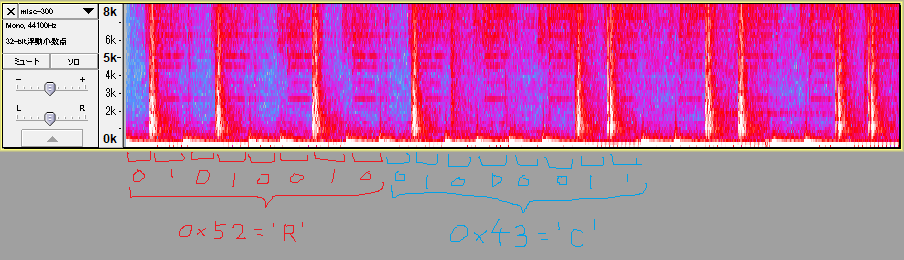
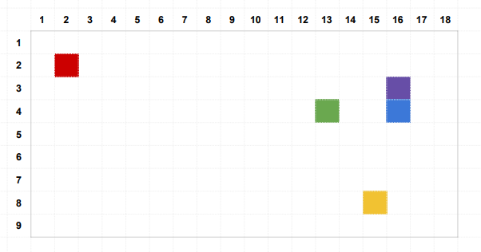
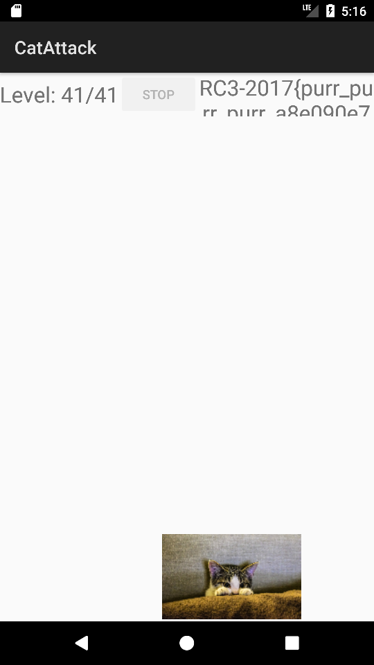

チーム Harekaze で [RC3 CTF 2017](https://rc3ctf.rc3.club) に参加しました。最終的にチームで 1850 点を獲得し、順位は得点 302 チーム中 13 位でした。うち、私は 9 問を解いて 1650 点を入れました。

以下、解いた問題の write-up です。

## [Web 100] This is where I'd put my Home page.. IF I HAD ONE

与えられた URL にアクセスすると、以下のように `C.html` -> `3.html` -> `W.html` … という感じでどんどんページが遷移されていきました。

```
$ curl http://13.59.6.98
<meta http-equiv="refresh" content="0; url=C.html" /> <p hidden>R</p>
$ curl http://13.59.6.98/C.html
<meta http-equiv="refresh" content="0; url=3.html" /> <p hidden>C</p>
$ curl http://13.59.6.98/3.html
<meta http-equiv="refresh" content="0; url=W.html" /> <p hidden>3</p>
...
```

`wget -r 13.59.6.98 -l 100` で再帰的にダウンロードし、以下のスクリプトで `<p hidden>` `</p>` に囲まれた文字を集めるとフラグが得られました。

```python
import re

m = re.compile(r'url=(.+\.html)" /> <p hidden>(.+)</p>')
p = 'index.html'
res = ''

while True:
  with open(p) as f:
    s = f.read()
  p, c = m.findall(s)[0]
  res += c

  i = res.find('RC3', 1)
  if i != -1:
    print res[:i]
    break
```

```
$ python2 solve.py
RC3W3MUS7G0D33P3RR3D1R3C777
```

```
RC3W3MUS7G0D33P3RR3D1R3C777
```

## [Misc 100] OMG U R SO BASIC

以下のように 2 段に分かれて絵文字が書かれた画像が与えられました。

```
😃😂😛😩😐😱😨😭🤢💩👻💀🌲👽👾🤖🎃🖕🐶😺🐭🐹🐰🦊🐻🐼🐨🐯🦁🐮🐷🐔🐧🐦🐤🍏🍎🍐🍊🍋🍌🍉🍇🍓🍈🍒🍑🍍🥝🥑🍅🌕💯🚲🚀🌋⛩📱🔫💣🔪📯🌎🔥🍆

🐹😨🐦🍉🦁🍅😂🍉🦁🍅😂💯🐨😨🐭🐧🐯🐰🐹🌕🦁🚀😱🍋🐼🎃🍆🍆
```

上段は 65 文字であること、下段は最後に `🍆` が 2 回連続して出現することから、上段が Base64 の変換表 + パディングの文字で下段がこの変換表で Base64 エンコードを行った文字列であることが推測できます。

```python
# coding: utf-8
import base64
s = '🐹😨🐦🍉🦁🍅😂🍉🦁🍅😂💯🐨😨🐭🐧🐯🐰🐹🌕🦁🚀😱🍋🐼🎃🍆🍆'
t = str.maketrans(
  '😃😂😛😩😐😱😨😭🤢💩👻💀🌲👽👾🤖🎃🖕🐶😺🐭🐹🐰🦊🐻🐼🐨🐯🦁🐮🐷🐔🐧🐦🐤🍏🍎🍐🍊🍋🍌🍉🍇🍓🍈🍒🍑🍍🥝🥑🍅🌕💯🚲🚀🌋⛩📱🔫💣🔪📯🌎🔥🍆',
  'ABCDEFGHIJKLMNOPQRSTUVWXYZabcdefghijklmnopqrstuvwxyz0123456789+/='
)
print(base64.b64decode(s.translate(t)))
print(s.translate(t))
```

```
$ python3 solve.py
This is the message
```

デコードができました。

```
RC3-2017{This is the message}
```

## [Misc 250] knocker

指定されたサーバに `nc` で接続すると、以下のように表示されました。

```
$ nc 18.216.59.235 7747
Welcome to the third annual short python challenge.
You'll get one letter at a time and a new problem to solve each time. Left vague on purpose. You'll figure it out. Hit enter when you're ready...
R
floor((((-170 * 6) + -63) | 106) - -56) % 65535
```

問題名的に、出題された問題を解いてポート番号として繋げばよさそうです。

出題される問題にはこの他にも以下のようなパターンがありました。

```
59941
```

```
fifteen thousand, three hundred and nine
```

```
nineteen thousand, three hundred and eighty-two
```

```
round(((((-103 & -223) & 89) ^ 250) % 159) ^ -42) % 65535
```

ソルバを書きましょう。

```python
from __future__ import division
from pwn import *
from math import ceil, floor, trunc

table = {
  'one': 1, 'two': 2, 'three': 3, 'four': 4, 'five': 5,
  'six': 6, 'seven': 7, 'eight': 8, 'nine': 9, 'ten': 10,
  'eleven': 11, 'twelve': 12, 'thirteen': 13, 'fourteen': 14, 'fifteen': 15,
  'sixteen': 16, 'seventeen': 17, 'eighteen': 18, 'nineteen': 19,
  'twenty': 20, 'thirty': 30, 'forty': 40, 'fifty': 50, 'sixty': 60,
  'seventy': 70, 'eighty': 80, 'ninety': 90
}
_m = re.compile(r'(.+) thousand(?:, (.+) hundred)? and (.+)')
def str2int(s):
  res = 0
  for a, b in zip(_m.findall(s)[0], (1000, 100, 1)):
    t = 0
    if a == '':
      continue
    for x in a.split('-'):
      t += table[x]
    res += t * b
  return res

def solve(r):
  if r.isdigit():
    return int(r)
  elif 'thousand' in r:
    return str2int(r)
  else:
    return eval(r)

res = ''

s = remote('18.216.59.235', 7747)
s.recvuntil('Hit enter when you\'re ready...')
s.sendline('')
res += s.recvline().strip()
log.info(res)
r = s.recvline().strip()
port = solve(r)
log.info("%s : %s" % (r, port))
s.close()

while True:
  s = remote('18.216.59.235', port)
  res += s.recvline().strip()
  log.info(res)
  r = s.recvline().strip()
  port = solve(r)
  log.info("%s : %s" % (r, port))
  s.close()
```

`RC3-2017{i-am-the-0ne-wh0-kn0ckz}`

## [Misc 300] Sick Beats, Man

`misc-300.mp3` という MP3 ファイルが与えられました。

Audacity に投げてスペクトログラムを表示し、以下のように対応付けるとフラグが得られました。



```
>>> s = '01010010010000110011001100101101001100100011000000110001001101110111101101100110001100010111001000110011001011010110001000110011001100110111010011010010011001100110000101101101001011010110001100110010010101100110100001100010011010010100001001110101010110100101100001100100011101000101100101010111001101000011110101111101'
>>> ''.join(chr(int(c, 2)) for c in re.findall(r'.{8}', s))
'RC3-2017{f1r3-b33t\xd2\xe6am-c2VhbiBuZXdtYW4=}'
```

```
RC3-2017{f1r3-b33t-fam-c2VhbiBuZXdtYW4=}
```

## [Crypto 100] An affinity for Caesar Salad

`RC3-2017{GUPNCH_AITIL}` という暗号文が与えられました。

後半の 5 文字は [@ykm_kn](https://twitter.com/ykm_kn) さんによって、シーザー暗号として右に 18 文字ずらすと `SALAD` になることが分かっていました。

が、前半の 6 文字は同様に変換しても `YMHFUZ` と意味の通らない単語になっています。問題名からアフィン暗号として総当りすると、`a=15,b=20` のちきに `GARDEN` という単語が出てきました。

```
RC3-2017{GARDEN_SALAD}
```

## [Crypto 200] Science Class (Part 2/5)

`Science_Class_200.pdf` という以下のような内容の PDF ファイルが与えられました。



周期表として読むと以下のようになっています。

```
赤 : Be
紫 : S
緑 : Ga
青 : Se
黄 : Er
```

虹の色順でソートするとフラグが得られました。

```
RC3-2017{BEERGASES}
```

## [Reversing 200] CatAttack

`CatAttack.apk` という Android の apk ファイルが与えられました。

これは、猫の画像がランダムな位置に表示され、何度かタップするごとにレベルが上がり、フラグが 1 文字ずつ得られるというアプリケーションのようです。

最初の数レベルは数回タップするだけで上げられますが、レベルを上げていくうちに何十回とタップする必要が出てきます。

1 回タップするだけでレベルが上げられるようにいじってしまいましょう。`apktool` で apk ファイルを展開し、`smali/club/rc3/catattack/GameActivity.smali` を以下のように編集します。

```
.method static synthetic access$608(Lclub/rc3/catattack/GameActivity;)J
    .locals 4
    .param p0, "x0"    # Lclub/rc3/catattack/GameActivity;

    .prologue
    .line 21
    #iget-wide v0, p0, Lclub/rc3/catattack/GameActivity;->currPoints:J
    iget-wide v0, p0, Lclub/rc3/catattack/GameActivity;->targetPoints:J#

    #const-wide/16 v2, 0x1
    const-wide/16 v2, 0x0

    add-long/2addr v2, v0

    iput-wide v2, p0, Lclub/rc3/catattack/GameActivity;->currPoints:J

    return-wide v0
.end method
```

続いて、以下のような手順で apk の再構築と再インストールを行います。

```
$ apktool b CatAttack -o CatAttack-modified.apk
$ jarsigner -verbose -signedjar CatAttack-signed.apk -keystore ~/.android/debug.keystore -storepass android -keypass android CatAttack-modified.apk androiddebugkey
$ adb install -r CatAttack-signed.apk
```

これでフラグが得られるはず…でしたが、フォントのサイズが大きいために読むことができません。



`res/layout/game_activity.xml` を以下のように編集するとフラグが読めるようになりました。

```
<TextView n1:textSize="12.0sp" n1:gravity="center_vertical" n1:id="@id/flagText" n1:layout_width="wrap_content" n1:layout_height="fill_parent" n1:layout_weight="1.0" n1:textAlignment="center" />
```


## [Reversing 300] Debbie

`debbie` というファイルが与えられました。`file` でどのようなファイルか調べてみましょう。

```
$ file ./debbie
debbie: ELF 64-bit LSB executable, x86-64, version 1 (SYSV), dynamically linked, interpreter /lib64/ld-linux-x86-64.so.2, for GNU/Linux 2.4.0, not strippe
```

x86_64 の ELF のようです。実行してみましょう。

```
$ ./debbie
./debbie: error while loading shared libraries: deb-req.so: cannot open shared object file: No such file or directory
```

`deb-req.so` が存在しないと怒られてしまいました。このファイル名でググっても何もヒットしないので、どうやら自作の共有ライブラリのようです。`readelf` で調べてみましょう。

```
$ readelf -Ws ./debbie

Symbol table '.dynsym' contains 15 entries:
   Num:    Value          Size Type    Bind   Vis      Ndx Name
     0: 0000000000000000     0 NOTYPE  LOCAL  DEFAULT  UND
     1: 0000000000000000     0 NOTYPE  WEAK   DEFAULT  UND _ITM_deregisterTMCloneTable
     2: 0000000000000000     0 FUNC    GLOBAL DEFAULT  UND puts@GLIBC_2.2.5 (2)
     3: 0000000000000000     0 FUNC    GLOBAL DEFAULT  UND giveMeDeath
     4: 0000000000602e18     0 NOTYPE  GLOBAL DEFAULT   23 _edata
     5: 0000000000402ae8     0 FUNC    GLOBAL DEFAULT   13 _fini
     6: 0000000000000000     0 FUNC    GLOBAL DEFAULT  UND giveMeLiberty
     7: 0000000000000000     0 FUNC    GLOBAL DEFAULT  UND __libc_start_main@GLIBC_2.2.5 (2)
     8: 0000000000000000     0 NOTYPE  WEAK   DEFAULT  UND __gmon_start__
     9: 0000000000602e18     4 OBJECT  GLOBAL DEFAULT   24 liberty
    10: 0000000000602e30     0 NOTYPE  GLOBAL DEFAULT   24 _end
    11: 0000000000602e18     0 NOTYPE  GLOBAL DEFAULT   24 __bss_start
    12: 0000000000000000     0 NOTYPE  WEAK   DEFAULT  UND _Jv_RegisterClasses
    13: 0000000000000000     0 NOTYPE  WEAK   DEFAULT  UND _ITM_registerTMCloneTable
    14: 00000000004005a0     0 FUNC    GLOBAL DEFAULT   10 _init
...
```

どうやら `giveMeDeath` と `giveMeLiberty` という関数と `liberty` という変数が必要なようです。

`objdump` で逆アセンブルしてみましょう。

```
$ objdump -d -M intel ./debbie
...
0000000000400770 <main>:
  400770:	55                   	push   rbp
  400771:	48 89 e5             	mov    rbp,rsp
  400774:	53                   	push   rbx
  400775:	48 83 ec 28          	sub    rsp,0x28
  400779:	89 7d dc             	mov    DWORD PTR [rbp-0x24],edi
  40077c:	48 89 75 d0          	mov    QWORD PTR [rbp-0x30],rsi
  400780:	b8 00 00 00 00       	mov    eax,0x0
  400785:	e8 66 fe ff ff       	call   4005f0 <giveMeLiberty@plt>
  40078a:	48 89 45 e8          	mov    QWORD PTR [rbp-0x18],rax
  40078e:	8b 05 84 26 20 00    	mov    eax,DWORD PTR [rip+0x202684]        # 602e18 <__TMC_END__>
  400794:	85 c0                	test   eax,eax
  400796:	0f 84 60 22 00 00    	je     4029fc <main+0x228c>
  40079c:	bf 00 2b 40 00       	mov    edi,0x402b00
  4007a1:	e8 2a fe ff ff       	call   4005d0 <puts@plt>
  4007a6:	48 8b 45 e8          	mov    rax,QWORD PTR [rbp-0x18]
  4007aa:	48 05 a8 02 00 00    	add    rax,0x2a8
  4007b0:	48 bb 00 00 00 00 11 	movabs rbx,0x1111100000000
  4007b7:	11 01 00 
  4007ba:	48 89 18             	mov    QWORD PTR [rax],rbx
  4007bd:	48 8b 45 e8          	mov    rax,QWORD PTR [rbp-0x18]
  4007c1:	48 83 c0 70          	add    rax,0x70
  4007c5:	48 8b 55 e8          	mov    rdx,QWORD PTR [rbp-0x18]
  4007c9:	48 81 c2 a8 02 00 00 	add    rdx,0x2a8
  4007d0:	48 8b 0a             	mov    rcx,QWORD PTR [rdx]
  4007d3:	48 ba 00 10 11 01 11 	movabs rdx,0x10001101111000
  4007da:	00 10 00 
  4007dd:	48 31 ca             	xor    rdx,rcx
  4007e0:	48 89 10             	mov    QWORD PTR [rax],rdx
...
  4029e4:	48 8b 45 e8          	mov    rax,QWORD PTR [rbp-0x18]
  4029e8:	48 89 c7             	mov    rdi,rax
  4029eb:	b8 00 00 00 00       	mov    eax,0x0
  4029f0:	e8 eb db ff ff       	call   4005e0 <giveMeDeath@plt>
  4029f5:	b8 00 00 00 00       	mov    eax,0x0
  4029fa:	eb 05                	jmp    402a01 <main+0x2291>
  4029fc:	b8 bb ff ff ff       	mov    eax,0xffffffbb
  402a01:	48 83 c4 28          	add    rsp,0x28
  402a05:	5b                   	pop    rbx
  402a06:	5d                   	pop    rbp
  402a07:	c3                   	ret    
...
```

`deb-req.so` を用意してしまいましょう。以下の手順でフラグが得られました。

```
$ cat deb-req.c
#include <stdlib.h>
void liberty(void) {}
char *giveMeLiberty(int argc, char **argv) {
  return malloc(0x1000);
}
void giveMeDeath(char *s) {}
$ gcc -o deb-req.so deb-req.c -shared -fPIC
$ gdb ./debbie 
Reading symbols from ./debbie...done.
gdb-peda$ b *0x00000000004029f0
Breakpoint 1 at 0x4029f0
gdb-peda$ r
...
gdb-peda$ x/286gx $rdi
0x603010:       0x0000111111100000      0x0000000000000000
0x603020:       0x0001111111111000      0x0000000000000000
0x603030:       0x0011110000111100      0x0000111111110000
0x603040:       0x0011100000011100      0x0001111111111000
0x603050:       0x0011110000111100      0x0011100000111100
0x603060:       0x0011111111100000      0x0111100000000000
0x603070:       0x0011110011110000      0x1111000000000000
0x603080:       0x0011110001111000      0x0111100000111100
0x603090:       0x0011110000111100      0x0011111111110000
0x6030a0:       0x0011110000011110      0x0001111111100000
0x6030b0:       0x0011110000001111      0x0000000000000000
0x6030c0:       0x0000011111000000      0x0000000000000000
0x6030d0:       0x0000111111100000      0x0000000000000000
0x6030e0:       0x0001110001110000      0x0000000000000000
0x6030f0:       0x0000000001110000      0x0000000000000000
0x603100:       0x0000000111100000      0x0001111111110000
0x603110:       0x0000011110000000      0x0001111111110000
0x603120:       0x0000000111000000      0x0000000000000000
0x603130:       0x0000000011100000      0x0000000000000000
0x603140:       0x0001110001110000      0x0000000000000000
0x603150:       0x0000111111100000      0x0000000000000000
0x603160:       0x0000011111000000      0x0000000000000000
0x603170:       0x0000111110000000      0x0000000000000000
0x603180:       0x0111111111100000      0x0000000000000000
0x603190:       0x1111000001111000      0x0000111111100000
0x6031a0:       0x0000000011110000      0x0001111111110000
0x6031b0:       0x0000000111100000      0x0011110001111000
0x6031c0:       0x0000001111000000      0x0111100000111100
0x6031d0:       0x0000011110000000      0x0111100000011110
0x6031e0:       0x0000111100000000      0x0011110000111100
0x6031f0:       0x0001111100000000      0x0001111001111000
0x603200:       0x0011111111111100      0x0000111111110000
0x603210:       0x0011111111111100      0x0000000000000000
0x603220:       0x0001111111000000      0x1111111111111111
0x603230:       0x0011111111000000      0x1111111111111111
0x603240:       0x0111001111000000      0x0000000000111110
0x603250:       0x1110001111000000      0x0000000001111100
0x603260:       0x0000001111000000      0x0000000011111000
0x603270:       0x0000001111000000      0x0000000111110000
0x603280:       0x0000001111000000      0x0000001111100000
0x603290:       0x0000001111000000      0x0000011111000000
0x6032a0:       0x0000001111000000      0x0000111110000000
0x6032b0:       0x0111111111111110      0x0001111100000000
0x6032c0:       0x0111111111111110      0x0011111000000000
0x6032d0:       0x0000000000000000      0x1111111111111000
0x6032e0:       0x0000000000000000      0x1111111111111000
0x6032f0:       0x0000000000000000      0x1111000000000000
0x603300:       0x0000000000000000      0x1111000000000000
0x603310:       0x0001111111110000      0x1111111110000000
0x603320:       0x0001111111110000      0x1111111110000000
0x603330:       0x0000000000000000      0x1111000000000000
0x603340:       0x0000000000000000      0x1111000000000000
0x603350:       0x0000000000000000      0x1111000000000000
0x603360:       0x0000000000000000      0x1111000000000000
0x603370:       0x0000000000000000      0x1111000000000000
0x603380:       0x1111100000011111      0x0000000000000000
0x603390:       0x1111100000011111      0x0000000000000000
0x6033a0:       0x1111100000011111      0x0000111111110000
0x6033b0:       0x1111100000011111      0x0001111111111000
0x6033c0:       0x1111100000011111      0x0011100000111100
0x6033d0:       0x1111100000011111      0x0111100000000000
0x6033e0:       0x1111100000011111      0x1111000000000000
0x6033f0:       0x1111100000011111      0x0111100000111100
0x603400:       0x0111110000111110      0x0011111111110000
0x603410:       0x0011111111111100      0x0001111111100000
0x603420:       0x0001111111111000      0x0000000000000000
0x603430:       0x1111000111110000      0x0000000000000000
0x603440:       0x1111001111100000      0x0000000000000000
0x603450:       0x1111011110000000      0x0000000000000000
0x603460:       0x1111011100000000      0x0000000000000000
0x603470:       0x1111110000000000      0x0001111111110000
0x603480:       0x1111110000000000      0x0001111111110000
0x603490:       0x1111011100000000      0x0000000000000000
0x6034a0:       0x1111001111000000      0x0000000000000000
0x6034b0:       0x1111000111110000      0x0000000000000000
0x6034c0:       0x1111000011111000      0x0000000000000000
0x6034d0:       0x1111000001111100      0x0000000000000000
0x6034e0:       0x0000000000000000      0x0000000000000000
0x6034f0:       0x0000000000000000      0x1111000000011110
0x603500:       0x0000000000000000      0x1111000000011110
0x603510:       0x0000111001110000      0x1111100000111110
0x603520:       0x0001111111111100      0x0111110011111100
0x603530:       0x0011100110011100      0x0001111111110000
0x603540:       0x0111000000001110      0x0000011111000000
0x603550:       0x1110000000000111      0x0000011111000000
0x603560:       0x0000000000000000      0x0000011111000000
0x603570:       0x0000000000000000      0x0000011111000000
0x603580:       0x0000000000000000      0x0000011111000000
0x603590:       0x0000000000000000      0x1111111111110000
0x6035a0:       0x0000000000000000      0x1111111111110000
0x6035b0:       0x0000000000000000      0x1111000000000000
0x6035c0:       0x0000000000000000      0x1111000000000000
0x6035d0:       0x0001111111110000      0x1111111100000000
0x6035e0:       0x0001111111110000      0x1111111100000000
0x6035f0:       0x0000000000000000      0x1111000000000000
0x603600:       0x0000000000000000      0x1111000000000000
0x603610:       0x0000000000000000      0x1111000000000000
0x603620:       0x0000000000000000      0x1111111111110000
0x603630:       0x0000000000000000      0x1111111111110000
0x603640:       0x0000000000000000      0x1111111111110000
0x603650:       0x1111000000011110      0x1111111111110000
0x603660:       0x1111000000011110      0x1111000000000000
0x603670:       0x1111100000111110      0x1111000000000000
0x603680:       0x0111110011111100      0x1111111100000000
0x603690:       0x0001111111110000      0x1111111100000000
0x6036a0:       0x0000011111000000      0x1111000000000000
0x6036b0:       0x0000011111000000      0x1111000000000000
0x6036c0:       0x0000011111000000      0x1111000000000000
0x6036d0:       0x0000011111000000      0x1111111111110000
0x6036e0:       0x0000011111000000      0x1111111111110000
0x6036f0:       0x0000011111111000      0x0000000000000000
0x603700:       0x0001111111111110      0x0000000000000000
0x603710:       0x0000111100000111      0x0000000000000000
0x603720:       0x0000011110000000      0x0000000000000000
0x603730:       0x0000001111000000      0x0001111111110000
0x603740:       0x0000000111110000      0x0001111111110000
0x603750:       0x0000000011110000      0x0000000000000000
0x603760:       0x0000000111110000      0x0000000000000000
0x603770:       0x1111001111110000      0x0000000000000000
0x603780:       0x0111111111100000      0x0000000000000000
0x603790:       0x0011111111000000      0x0000000000000000
0x6037a0:       0x1111000000001111      0x1111100000011111
0x6037b0:       0x1111000000001111      0x1111100000011111
0x6037c0:       0x1111000000001111      0x1111100000011111
0x6037d0:       0x1111000000001111      0x1111100000011111
0x6037e0:       0x1111111111111111      0x1111100000011111
0x6037f0:       0x1111111111111111      0x1111100000011111
0x603800:       0x1111000000001111      0x1111100000011111
0x603810:       0x1111000000001111      0x1111100000011111
0x603820:       0x1111000000001111      0x0111110000111110
0x603830:       0x1111000000001111      0x0011111111111100
0x603840:       0x1111000000001111      0x0001111111111000
0x603850:       0x0000111111100000      0x1111111111111111
0x603860:       0x0001111111111000      0x1111111111111111
0x603870:       0x0011110000111100      0x0000011110000000
0x603880:       0x0011100000011100      0x0000011110000000
0x603890:       0x0011110000111100      0x0000011110000000
0x6038a0:       0x0011111111100000      0x0000011110000000
0x6038b0:       0x0011110011110000      0x0000011110000000
0x6038c0:       0x0011110001111000      0x0000011110000000
0x6038d0:       0x0011110000111100      0x0000011110000000
0x6038e0:       0x0011110000011110      0x0000011110000000
0x6038f0:       0x0011110000001111      0x0000011110000000
```

```
RC3-2017-FUCK-MY-EYES-HURT
```