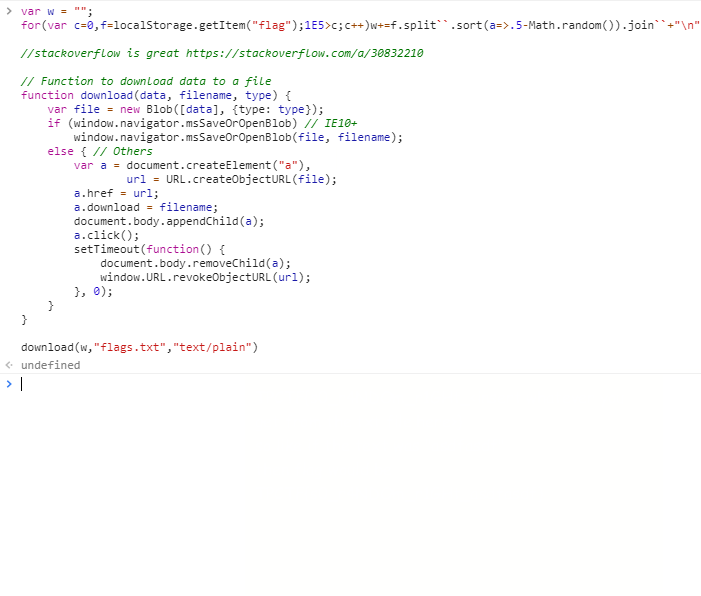
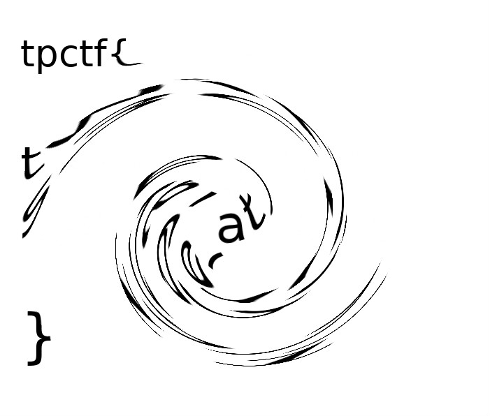
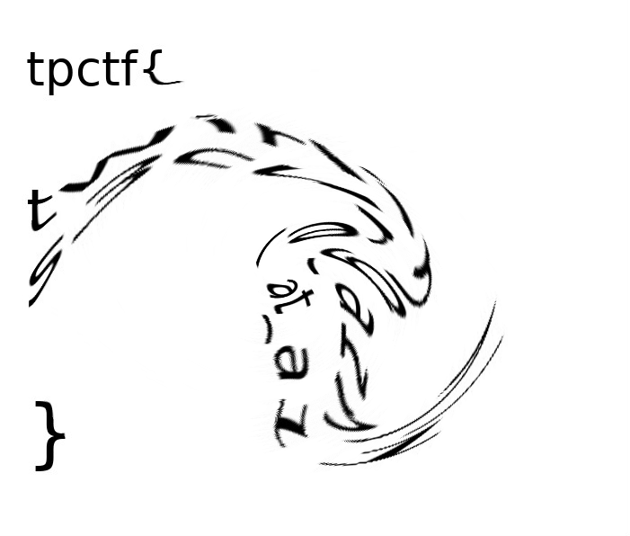

この記事は [Harekaze Advent Calendar 2017](https://adventar.org/calendars/2292) の 7 日目の記事です。

---

チーム Harekaze で 12 月 3 日から 12 月 4 日にかけて開催された [Takoma Park CTF](https://tpctf.com) に参加しました。最終的にチームで 895 点を獲得し、順位は得点 484 チーム中 9 位でした。うち、私は 15 問を解いて 801 点を入れました。

以下、解いた問題の write-up です。

## [Web 20] Ads

以下のような問題文が与えられました。

> I hid a flag somewhere on this site. Find it.

スコアボードのどこかにフラグがあるようです。読み込まれているファイルをひとつずつチェックしていくと、`/static/user.css` でフラグが見つかりました。

```
.logo {
	max-width: 750px;
}
.heading {
	text-align: center;
}
#chat-window {
	display:block;
	margin:auto;
}
#ad:after {
	content:"tpctf{thx_4_n0_adb1ock}";
}
```

```
tpctf{thx_4_n0_adb1ock}
```

## [Web 50] Methods

与えられた URL にアクセスすると、`/description` で以下のような文章が表示されました。

> Just a reminder --
> 
> Description: Make the server give you the flag. Use the problems page here.
> 
> Hint(s): I don't think you get it.

`Use the problems page here` の `here` は `/problem` へのリンクになっていました。

`GET` `POST` `PUT` などいろいろな HTTP メソッドでアクセスしてみると、`DELETE` のときにフラグが得られました。

```
$ curl -X DELETE http://methods.tpctf.com/problem
Flag: tpctf{so_post_and_get_are_not_the_only_http_methods}
```

```
tpctf{so_post_and_get_are_not_the_only_http_methods}
```

## [Web 50] IRC

以下のような問題文が与えられました。

> The bot flagbotbot on #tpctf-chal has a flag, but has only a 3% chance of giving it out. The other 97% of the time, it gives out flegs. Flegs look like flags. Don't get fooled by flegs. You can get flagbotbot talking by waiting 30 seconds.

freenode で #tpctf-chal チャンネルに入り、しばらく待っていると以下のようなメッセージが流れてきました。

```
00:48 (flagbotbot) the flag is TPCTF{|l|I1lII|11I} that's a fleg btw
00:48 (flagbotbot) the flag is TPCTF{llI1|IIII|1I} that's a fleg btw
00:49 (flagbotbot) the flag is TPCTF{l|ll!III!|I|} that's a fleg btw
00:49 (flagbotbot) the flag is TPCTF{!1l|I!I|l1!I} that's a fleg btw
00:50 (flagbotbot) the flag is TPCTF{1lI|1Il|1I1l} that's a flag btw
```

```
TPCTF{1lI|1Il|1I1l}
```

## [Web 60] Management

与えられた URL にアクセスするとログインフォームが表示されました。適当なユーザ名を入力するとログインでき、以下のように番号と文字列を入力できるフォームが表示されました。

```
Please select your number: <br><form method='post'><select name='number'><option value='1'>1</option><option value='2'>2</option><option value='3'>3</option><option value='4'>4</option>
    <option value='5'>5</option><option value='6'>6</option><option value='7'>7</option><option value='8'>8</option><option value='9'>9</option></select><br>
    Value (if creating): <input type='text' name='value'></input><br>
    <input type='submit' value='Read' name='action'></input><input type='submit' value='Create' name='action'></input>
```

`1` を選択して `Read` を押すと、以下のように表示されました。

```
SELECT `1` FROM users WHERE name = 'custom-a';Result: a
```

SQLi ができそうな雰囲気です。`<option value='1'>1</option>` を

```
<option value='1` from users where 0 union select group_concat(name) from users;#'>1</option>
```

に書き換えて `Read` を押すとフラグが得られました。

```
flag{aLW4ys_ESC4PE_3v3rYTH1NG!!!!!}
```

```
flag{aLW4ys_ESC4PE_3v3rYTH1NG!!!!!}
```

## [Web 100] It's Common Sense

与えられた URL にアクセスすると、製品のレビューができるサイトが表示されました。

レビューにはアカウントの登録が必要なようで、好きなユーザ名とメールアドレスで登録すると、そのメールアドレスにパスワードが届きました。

ログイン後、アカウントの管理ページにアクセスすると、製品のレビューのフォームとパスワードリセットのリクエストを送るフォームが表示されました。

パスワードリセットのフォームでいろいろ試していると、どうやら登録時のメールアドレス以外を入力してもパスワードが届くらしいと分かりました。admin のパスワードがフラグらしいので、このフォームは使えそうです。

レビューのフォームで何ができるか調べてみましょう。admin によってレビューがチェックされるようなので、XSS ができないか `` を送ってみると、`https://requestb.in/xxxxxxxx` にアクセスが来ました。

では、パスワードリセットのフォームを使って admin のパスワードを手に入れることができないか試してみましょう。

```html
<form action="/account" method="POST" id="newpwd">
  <input type="hidden" name="email" value="(メールアドレス)">
  <input type="hidden" value="Send Request" name="formbtn">
</form>
<script>document.getElementById('newpwd').submit();</script>
```

を送ってみると、指定したメールアドレスに以下のようなメールが届きました。

```
Reset Your Password
Congratulations! Normally, you would've reset the administrators password. For the purposes of this challenge, the flag is tpctf{D1D_Y0U_N0t1c3_Common_Sense_Reviews_1s_P4R7_0F_CSRF_19210jka010920aff}
```

フラグが得られました。

```
tpctf{D1D_Y0U_N0t1c3_Common_Sense_Reviews_1s_P4R7_0F_CSRF_19210jka010920aff}
```

## [Reverse Engineering 60] Super Encryption!

`superencrypt` というファイルと、これを使ってフラグをエンコードした結果の `dufhyuc>bi{{f0|;vwh<~b5p5thjq6goj}` という文字列が与えられました。`file` でどのようなファイルか調べてみましょう。

```
$ file ./superencrypt
./superencrypt: ELF 64-bit LSB executable, x86-64, version 1 (SYSV), dynamically linked, interpreter /lib64/ld-linux-x86-64.so.2, for GNU/Linux 2.6.32, BuildID[sha1]=bbe7fab9052c139ccdb8456081d8b28ab6bf6b2b, not stripped
```

x86_64 の ELF のようです。実行してみましょう。

```
$ ./superencrypt 
Welcome to my super-encryption program!
Please enter 0 to encrypt or 1 to decrypt: 0
Enter the string you want to encrypt: aaaaaaaaaaaaaaaaaaaaaaaaaaaaaaaaaa
bbajffkkjkjaaakieebjidccccdbddabba
$ ./superencrypt
Welcome to my super-encryption program!
Please enter 0 to encrypt or 1 to decrypt: 0
Enter the string you want to encrypt: 0000000000000000000000000000000000
110955::9:9000:8441983222231330110
$ ./superencrypt
Welcome to my super-encryption program!
Please enter 0 to encrypt or 1 to decrypt: 1
Enter the string you want to decrypt: dufhyuc>bi{{f0|;vwh<~b5p5thjq6goj}
TODO: Implement decryption
$ ./superencrypt 
Welcome to my super-encryption program!
Please enter 0 to encrypt or 1 to decrypt: 0
Enter the string you want to encrypt: aaaaaaaaaaaaaaaa
bbajffkkjkjaaakj
```

文字列をシャッフルして、xor かなにかをしているようです。エンコード前の文字列とエンコードされた後の文字列を比較してみます。

```
$ python
Python 2.7.9 (default, Mar  1 2015, 12:57:24) 
[GCC 4.9.2] on linux2
Type "help", "copyright", "credits" or "license" for more information.
>>> def sub(s, t): return [ord(c) - ord(d) for c, d in zip(s, t)]
... 
>>> sub('bbajffkkjkjaaakj', 'aaaaaaaaaaaaaaaa')
[1, 1, 0, 9, 5, 5, 10, 10, 9, 10, 9, 0, 0, 0, 10, 9]
>>> sub('bbajffkkjkjaaakieebjidccccdbddabba', 'aaaaaaaaaaaaaaaaaaaaaaaaaaaaaaaaaa')
[1, 1, 0, 9, 5, 5, 10, 10, 9, 10, 9, 0, 0, 0, 10, 8, 4, 4, 1, 9, 8, 3, 2, 2, 2, 2, 3, 1, 3, 3, 0, 1, 1, 0]
>>> sub('110955::9:9000:8441983222231330110', '0000000000000000000000000000000000')
[1, 1, 0, 9, 5, 5, 10, 10, 9, 10, 9, 0, 0, 0, 10, 8, 4, 4, 1, 9, 8, 3, 2, 2, 2, 2, 3, 1, 3, 3, 0, 1, 1, 0]
```

元の文字は分かりそうですが、これだけではその文字の位置までは分かりません。文字の位置を特定するスクリプトを書いてデコードしましょう。

```python
import string
from pwn import *

def encrypt(s):
  p = process('./superencrypt')
  p.recvuntil('decrypt: ')
  p.sendline('0')
  p.recvuntil('encrypt: ')
  p.sendline(s)
  res = p.recvline()[:len(s)]
  p.close()
  return res

def find(s):
  for i, c in enumerate(s):
    if c in string.ascii_uppercase:
      return i

encrypted = 'dufhyuc>bi{{f0|;vwh<~b5p5thjq6goj}'
l = len(encrypted)
s = encrypt('A' * l)
flag = [None] * l
for i in range(l):
  j = find(encrypt('a' * i + 'A' + 'a' * (l - i - 1)))
  flag[i] = chr(ord(encrypted[j]) - ord(s[j]) + ord('A'))

print ''.join(flag)
```

```
$ python2 solve.py
...
tpctf{Y4Y_f0r_r3v3rse_3ngin33ring}
```

フラグが得られました。

```
tpctf{Y4Y_f0r_r3v3rse_3ngin33ring}
```

## [Reverse Engineering 100] Bad Encryption

`encode.py` という Python スクリプトと、これを使ってフラグをエンコードした結果の `out{1..100}.png` という 100 枚の画像が与えられました。

```python
for i in range(1,101):
    tel1l1l1l1l1l1l1lt = "REDACTED"
    import builtins, random
    l1l1l1l1l1l1l1l = getattr(builtins, "__import__")
    l1l1l1l1l1l1l1l = l1l1l1l1l1l1l1l("PIL.Image")
    l1l1l1l1l1l1l1ll1l1l1l1l1l1l1l = l1l1l1l1l1l1l1l.Image
    l1l1l1l1l1l1l1ll1l1l1l1l1l1l1ll1l1l1l1l1l1l1l = l1l1l1l1l1l1l1ll1l1l1l1l1l1l1l.new("RGB", (len(tel1l1l1l1l1l1l1lt), 1), "white")
    l1l1l1l1l1l1l1ll1l1l1l1l1l1l1ll1l1l1l1l1l1l1ll1l1l1l1l1l1l1l = l1l1l1l1l1l1l1ll1l1l1l1l1l1l1ll1l1l1l1l1l1l1l.load()
    l1l1l1l1l1l1l1ll1l1l1l111l1l11 = 0
    for l1l1l1l1l1l1l1ll1l1l1l1l1l1l11 in tel1l1l1l1l1l1l1lt:
        l1l1l1l1l1l1l1ll1l1l1l1l1l1l11 = ord(l1l1l1l1l1l1l1ll1l1l1l1l1l1l11)
        l1l1l1l1l1l1l1ll1l1l1l1lll1l111 = random.randint(1,256)
        l1l1l1l1l1l1l1ll1l1l1l1lll1l112 = random.randint(1,256)
        l1l1l1l1l1l1l1ll1l1l1l1lll1l113 = random.randint(1,256)
        l1l1l1l1l1l1l11ll1l1l1l1lll1l111 = (l1l1l1l1l1l1l1ll1l1l1l1lll1l111/256)
        l1l1l1l1l1l1l11ll1l1l1l1lll1l112 = (l1l1l1l1l1l1l1ll1l1l1l1lll1l112/256)
        l1l1l1l1l1l1l11ll1l1l1l1lll1l113 = (l1l1l1l1l1l1l1ll1l1l1l1lll1l113/256)
        l1l121l1l1l1l11ll1l1l1l1lll1l111 = l1l1l1l1l1l1l1ll1l1l1l1l1l1l11*l1l1l1l1l1l1l11ll1l1l1l1lll1l111
        l1l121l1l1l1l11ll1l1l1l1lll1l112 = l1l121l1l1l1l11ll1l1l1l1lll1l111*l1l1l1l1l1l1l11ll1l1l1l1lll1l112
        l1l1l1l1l1l1l1ll1l1l1l1l1l1l1ll1l1l1l1l1l1l1ll1l1l1l1l1l1l1l[l1l1l1l1l1l1l1ll1l1l1l111l1l11,0] = (l1l1l1l1l1l1l1ll1l1l1l1lll1l111, l1l1l1l1l1l1l1ll1l1l1l1lll1l112, round(l1l121l1l1l1l11ll1l1l1l1lll1l112*10))
        l1l1l1l1l1l1l1ll1l1l1l111l1l11 += 1
    l1l1l1l1l1l1l1ll1l1l1l1l1l1l1ll1l1l1l1l1l1l1l.save("out"+str(i)+".png")
```

難読化されているので、変数名をリネームして読みやすくしてみましょう。

```python
for i in range(1,101):
    flag = "REDACTED"
    import builtins, random
    __import__ = getattr(builtins, "__import__")
    Image = __import__("PIL.Image")
    Image = Image.Image
    im = Image.new("RGB", (len(flag), 1), "white")
    pix = im.load()
    x = 0
    for c in flag:
        c = ord(c)
        r = random.randint(1,256)
        g = random.randint(1,256)
        b = random.randint(1,256)
        rr = (r/256)
        gg = (g/256)
        bb = (b/256)
        xx = c*rr
        yy = xx*gg
        pix[x,0] = (r, g, round(yy*10))
        x += 1
    im.save("out"+str(i)+".png")
```

デコードしてみましょう。

```python
import string
from PIL import Image

h = []

for i in range(1, 101):
  im = Image.open('encoded/out{}.png'.format(i))
  pix = im.load()
  w, _ = im.size
  h.append([pix[x, 0] for x in range(w)])

flag = ''
f = lambda pix: min(round(ord(c) * (pix[x][0] / 256) * (pix[x][1] / 256) * 10), 255) == pix[x][2]
for x in range(38):
  for c in string.printable:
    if len(list(filter(f, h))) > 90:
      flag += c
      break
  else:
    flag += '?'

print(flag)
```

```
$ python3 solve.py
tpctf{i_c4nt_7h1nk_0f_a_fUnny_f14g_:(}
```

フラグが得られました。

```
tpctf{i_c4nt_7h1nk_0f_a_fUnny_f14g_:(}
```

## [Reverse Engineering 110] I need better friends

`encrypt.py` という Python スクリプトと、これを使ってフラグをエンコードした結果の `out.txt` が与えられました。

```python
from decimal import *
from binascii import hexlify as h
from binascii import unhexlify as u
from math import ceil as e
from sys import argv as y
D,w,O,z,j,b,X,v,o,U=Decimal,getcontext,chr,len,str,int,long,str,len,hex
def q():
    w().prec+=5;L,t,s,n,k,d,K=0,D(3),3,1,0,0,24
    while s!=L:L=s;n,k=n+k,k+8;d,K=d+K,K+32;t=(t*n)/d;s+=t
    w().prec-=5
    return +s
Q=q()
def s(x):
    w().prec+=5;i,L,s,f,n,S=1,0,x,1,x,1;
    while s!=L:L=s;i+=2;f*=i*(i-1);n*=x*x;S*=-1;s+=n/f*S
    w().prec-=5
    return +s
def E(S):
    w().prec=b(e(o(S)*2.40823996531))+1;a=(lambda:[D(O(48)+O(46)+j((lambda:X(h(S),4+4*4-4))()))*Q-Q/D(2),j(v(D(5.2))+S)+v(U(z(j(e(2.71)))))][0])()
    return j((lambda P:U(X(v((D(1)-s(a)*s(a+D(1)-D(7-5)+D(3)-D(6-4))).sqrt())[2:])))(lambda:[-2,X(j(v(1)),13)][1]))[2:-1]
A=h("Usage: "+y[0]+" <string>") if o(y)!=2 else E(y[1])
f=open("out.txt",O(b('7'+'7',(4**4)/4/4)))
f.write(u(A[:-1] if z(A)%2==1 else A))
f.close()
```

難読化されているので、少しずつ読める形にしていきましょう。

返り値を確認すると `q` はその時点の精度の `PI` を計算する関数、`s` は `sin` であることが分かりました。冗長な部分を削ったり、`;` を改行に置き換えていくと以下のようになりました。

```python
from decimal import *
from binascii import hexlify
from binascii import unhexlify
from math import ceil
from sys import argv

def pi():
  getcontext().prec += 5
  L, t, s, n, k, d, K = 0, Decimal(3), 3, 1, 0, 0, 24
  while s != L:
    L = s
    n, k = n + k, k + 8
    d, K = d + K, K + 32
    t = (t * n) / d
    s += t
  getcontext().prec -= 5
  return +s

PI = pi()

def sin(x):
  getcontext().prec += 5
  i, L, s, f, n, S = 1, 0, x, 1, x, 1;
  while s != L:
    L = s
    i += 2
    f *= i * (i - 1)
    n *= x * x
    S *= -1
    s += n / f * S
  getcontext().prec -= 5
  return +s

def cos(x):
  return (Decimal(1) - sin(x) * sin(x)).sqrt().copy_abs()

def encode(S):
  getcontext().prec = int(ceil(len(S) * 2.40823996531)) + 1
  a = Decimal('0.' + str(long(hexlify(S), 16))) * PI - PI / Decimal(2)
  d = str(cos(a))[2:]
  return str(hex(long(d)))[2:-1]

A = hexlify("Usage: " + argv[0] + " <string>") if len(argv) != 2 else encode(argv[1])
with open("out.txt", "w") as f:
  f.write(unhexlify(A[:-1] if len(A) % 2 == 1 else A))
```

デコードしてみましょう。

```python
import sys
from decimal import *
from dmath import *
from math import ceil

s = 'out.txt' if len(sys.argv) < 2 else sys.argv[1]
with open(s, 'rb') as f:
  x = f.read()

l = len(x)
p = int(ceil(l * 2.40823996531))
getcontext().prec = p + 1
D = Decimal
PI = pi()

x = D('0.' + str(long(x.encode('hex') + 'f', 16)))
print hex(long(str((-acos(x) + PI / D(2)) / PI)[2:2 + p]))[2:-1].decode('hex')
```

```
$ python2 solve.py
tpctf{tr1g_1d3n7i7i3s_4r3_s1neful}
```

フラグが得られました。

```
tpctf{tr1g_1d3n7i7i3s_4r3_s1neful}
```

## [Forensics 70] Sorta

`image.PNG` という以下のような画像と、`flags.txt` が与えられました。



画像の下部を黒色で塗りつぶしてみると、以下のような文章が出てきました。

```
TPCTF{s0_r4NDOm_r1GHt_<insert whatever you get from the txt file here>}
so like if the text was "asdfasdf"
then flag would be
TPCTF{s0_r4NDOm_r1GHt_asdfasdf}
```

JavaScript のコード部分を文字に起こしてみます。

```javascript
var w = "";
for(var c=0,f=localStorage.getItem("flag");1E5>c;c++)w+=f.split``.sort(a=>.5-Math.random()).join``+"\n"

//stackoverflow is great https://stackoverflow.com/a/30832210

// Function to download data to a file
function download(data, filename, type) {
    var file = new Blob([data], {type: type});
    if (window.navigator.msSaveOrOpenBlob) // IE10+
        window.navigator.msSaveOrOpenBlob(file, filename);
    else { // Others
        var a = document.createElement("a"),
                url = URL.createObjectURL(file);
        a.href = url;
        a.download = filename;
        document.body.appendChild(a);
        a.click();
        setTimeout(function() {
            document.body.removeChild(a);
            window.URL.revokeObjectURL(url);  
        }, 0); 
    }
}

download(w,"flags.txt","text/plain")
```

フラグをシャッフルした結果を 10 万回出力しているようです。…が、`f.split``.sort(a=>.5-Math.random())` のようにシャッフルしているため、偏りが出ていそうです。

以下のスクリプトを実行するとフラグが得られました。

```python
import re
from collections import Counter

with open('flags.txt') as f:
  s = f.read().splitlines()

t = ''.join(line[0] for line in s)
x = Counter({k: t.count(k) for k in s[0]})
print ''.join(c for c, _ in x.most_common())
```

```
$ python2 solve.py
focezxhjwg
```

```
TPCTF{s0_r4NDOm_r1GHt_focezxhjwg}
```

## [Forensics 90] Demo File

`demo.docx` という Office 用のドキュメントファイルが与えられました。

含まれるテキストをググると、calibre のデモ用の docx ファイルを改変したものであると分かりました。

問題のファイルとオリジナルのファイルを zip として展開して含まれるファイルを比較すると、`word/media/image4.png` という画像のみが異なっていることが分かりました。

`image4.png` は 94.6 MB と非常に大きなサイズです。バイナリエディタで開いて眺めていると、本来何もない IEND チャンクの後ろに以下のような文字列が含まれていました。

```
TPCTF stands for Teaching Primary Care Trust Flag. The flag isn't TPCTF{qyiwpgcdhproeexhuh}. Clarence Lam is a TPCTF organizer. He is also a TPCTF disorganizer. TPCTF stands for Title Page Capture The Flag, and it was made by current and former Title Page students. TPCTF stands for Takoma Park Cat The Flag.txt, where participants around the world attempt to 'cat flag.txt' and get something like TPCTF{cjgrokitwngrrrlqyc}. Of course, that isn't the flag. TPCTF{bhifqdppfkagwayipl} is not the flag. TPCTF stands for Tissue Paper Capture The Flag, and it was made by current and former Tissue Paper students. TPCTF{thexebedwbgqmrlaud} is not the flag. Some of Clarence Lam's nicknames are Calvin, clam, clam~, c-lam, and TPCTF{qgdcttfihdiylcfoya}. Actually, the last one isn't true. The flag isn't TPCTF{fskvetskoyvrwdtasi}. TPCTF{tdrzifxebkijbapzwq} is not the flag. TPCTF{elyezfxtclamqegtjj} is not the flag. ...
```

`TPCTF{qyiwpgcdhproeexhuh}` `TPCTF{cjgrokitwngrrrlqyc}` `TPCTF{bhifqdppfkagwayipl}` … と様々な偽物のフラグがあります。

文章にはある程度パターンがあるようなので、何度も出現するパターンの文章を削除してみましょう。

IEND チャンク以降の文字列を `image4.txt` として保存し、以下のスクリプトを実行するとフラグが得られました。

```python
import re

with open('image4.txt') as f:
  s = f.read()

p = re.compile(r"""
It's\ not\ TPCTF{.+}\ though|
TPCTF{.+}\ is\ not\ the\ flag|
The\ flag\ isn't\ TPCTF{.+}|
Fun\ fact:\ TPCTF{.+}\ is\ a\ fake\ flag|
Fun\ fact:\ TPCTF{.+}\ starts\ with\ TPCTF|
Fun\ fact:\ TPCTF{.+}\ has\ 18\ letters\ in\ between\ the\ braces|
Fun\ fact:\ All\ the\ letters\ in\ TPCTF{.+}\ are\ lowercase\ except\ for\ the\ TPCTF\ at\ the\ start|
Clarence\ Lam\ is\ a\ TPCTF\ organizer\ and\ he\ thinks\ the\ flag\ is\ TPCTF{.+}\ but\ it\ isn't|
Clarence\ Lam\ is\ a\ TPCTF\ organizer\ and\ favorite\ string\ is\ TPCTF{.+}|
Clarence\ Lam\ is\ a\ TPCTF\ organizer\ and\ he\ doesn't\ like\ strings\ of\ text\ like\ TPCTF{.+}|
Clarence\ Lam\ is\ a\ TPCTF\ organizer\ and\ his\ least\ favorite\ string\ is\ TPCTF{.+}|
Clarence\ Lam\ is\ a\ TPCTF\ organizer\ and\ the\ flag\ isn't\ TPCTF{.+}|
Clarence\ Lam\ is\ part\ of\ a\ group\ that\ organized\ TPCTF\ and\ the\ flag\ is\ not\ quite\ TPCTF{.+}|
Clarence\ Lam\ writes\ TPCTF\ problems,\ some\ of\ which\ contain\ flags,\ such\ as\ TPCTF{.+}|
Clarence\ Lam\ wrote\ a\ few\ problems\ for\ TPCTF\ and\ his\ least\ favorite\ string\ of\ text\ isn't\ not\ TPCTF{.+}|
Did\ you\ know\ that\ Clarence\ Lam's\ favorite\ command\ is\ TPCTF{.+}';\ DROP\ TABLE\ flags;\ --\ \?\ Of\ course\ you\ didn't|
""", re.X)
s = s.split('. ')
s = filter(lambda x: 'TPCTF{' in x, s)
s = filter(lambda x: not p.search(x), s)
print '\n'.join(sorted(list(s))[:10])
```

```
TPCTF{ohnoivebeendocxxed}
```

## [Misc 10] That's not latin...

以下のような問題文が与えられました。

> tpctf{nеv3r_7h15_3z}

このまま提出してみたものの、正しくないようでした。バイナリエディタに貼り付けてみると、最初の `e` がよく見ると `е` (キリル文字) であることが分かりました。

```
tpctf{nev3r_7h15_3z}
```

## [Steganography 35] Twirl

`twirl.jpg` という以下のような JPEG ファイルが与えられました。



読めません。GIMP でフィルター -> 変形 -> 渦巻きと吸い込みから変形前の形に近づけてみると、以下のように頑張れば読めるように加工できました。



```
tpctf{twirling_a1n7_s3cure_at_a11}
```

## [Steganography 40] Woah!

`meme.png` という PNG ファイルが与えられました。

stegsolve.jar を使って RGB の最下位ビットを抽出すると、以下のような文字列が得られました。

```
n=117528486827789400165355036597757499772267701336144528618362083257361513763806238831790113655715882881718725332491830831528846581852724863384001329225122149955762187282660943708267841791772849325196822992527135907390322474087022656372336737574135803454741012331637124409253565628911728336882317184586299251643
```

また、バイナリエディタで `meme.png` を開くと、IEND チャンクの後ろに以下のような文字列が隠されていました。

```
c=23273044714507614583919107642780731232409437015529456693716961465133831310123918470882082327335507219289041144186168765420579209702030715438341449893348841695639896994241125
```

RSA のようですが、`n` に対して `c` が小さく見えます。`c` の立方根をとるとフラグが得られました。

```
tpctf{rs4_and_st3g0_w0w}
```