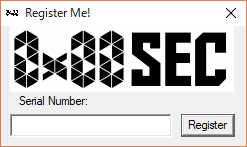
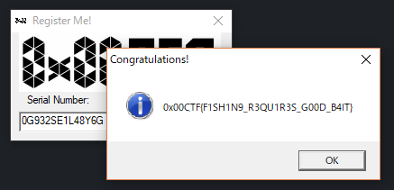

チーム Harekaze で 12 月 16 日から 12 月 17 日にかけて開催された [0x00ctf-2017](https://ctf.0x00sec.org/) に参加しました。最終的にチームで 800 点を獲得し、順位は得点 196 チーム中 3 位でした。うち、私は 3 問を解いて 150 点を入れました。

以下、解いた問題の write-up です。

## [Reverse Engineering 50] challenge-000 (guessme)

`guessme` というファイルが与えられました。`file` でどのようなファイルか調べてみましょう。

```
$ file ./guessme
./guessme: ELF 64-bit LSB executable, x86-64, version 1 (SYSV), dynamically linked, interpreter /lib64/ld-linux-x86-64.so.2, for GNU/Linux 2.6.32, BuildID[sha1]=92b1d84ee22b7c92dc80fac971bdc7f6cd0e3672, stripped
```

x86_64 の ELF のようです。実行してみましょう。

```
$ ./guessme 
Enter a key: hoge
FAIL
```

`objdump` で逆アセンブルして解析していきましょう。

しばらく眺めていると、以下のような処理が見つかりました。

```
  400f8f:	c7 85 7c ff ff ff 00 	mov    DWORD PTR [rbp-0x84],0x0
  400f96:	00 00 00 
  400f99:	8b 85 7c ff ff ff    	mov    eax,DWORD PTR [rbp-0x84]
  400f9f:	48 63 d8             	movsxd rbx,eax
  400fa2:	48 8d 45 c0          	lea    rax,[rbp-0x40]
  400fa6:	48 89 c7             	mov    rdi,rax
  400fa9:	e8 22 fc ff ff       	call   400bd0 <_ZNKSt7__cxx1112basic_stringIcSt11char_traitsIcESaIcEE6lengthEv@plt>
  400fae:	48 39 c3             	cmp    rbx,rax
  400fb1:	0f 92 c0             	setb   al
  400fb4:	84 c0                	test   al,al
  400fb6:	74 66                	je     40101e <_ZNSt7__cxx1112basic_stringIcSt11char_traitsIcESaIcEEaSEPKc@plt+0x34e>
  400fb8:	8b 85 7c ff ff ff    	mov    eax,DWORD PTR [rbp-0x84]
  400fbe:	48 63 d0             	movsxd rdx,eax
  400fc1:	48 8d 45 c0          	lea    rax,[rbp-0x40]
  400fc5:	48 89 d6             	mov    rsi,rdx
  400fc8:	48 89 c7             	mov    rdi,rax
  400fcb:	e8 f0 fc ff ff       	call   400cc0 <_ZNSt7__cxx1112basic_stringIcSt11char_traitsIcESaIcEEixEm@plt>
  400fd0:	0f b6 00             	movzx  eax,BYTE PTR [rax]
  400fd3:	0f be c0             	movsx  eax,al
  400fd6:	8d 58 9f             	lea    ebx,[rax-0x61]
  400fd9:	8b 85 7c ff ff ff    	mov    eax,DWORD PTR [rbp-0x84]
  400fdf:	48 63 d0             	movsxd rdx,eax
  400fe2:	48 8d 45 a0          	lea    rax,[rbp-0x60]
  400fe6:	48 89 d6             	mov    rsi,rdx
  400fe9:	48 89 c7             	mov    rdi,rax
  400fec:	e8 e7 02 00 00       	call   4012d8 <_ZNSt7__cxx1112basic_stringIcSt11char_traitsIcESaIcEEaSEPKc@plt+0x608>
  400ff1:	8b 00                	mov    eax,DWORD PTR [rax]
  400ff3:	39 c3                	cmp    ebx,eax
  400ff5:	0f 95 c0             	setne  al
  400ff8:	84 c0                	test   al,al
  400ffa:	74 16                	je     401012 <_ZNSt7__cxx1112basic_stringIcSt11char_traitsIcESaIcEEaSEPKc@plt+0x342>
  400ffc:	be 2e 1c 40 00       	mov    esi,0x401c2e                        # "FAIL\n"
  401001:	bf e0 31 60 00       	mov    edi,0x6031e0
  401006:	e8 15 fc ff ff       	call   400c20 <_ZStlsISt11char_traitsIcEERSt13basic_ostreamIcT_ES5_PKc@plt>
  40100b:	bb 02 00 00 00       	mov    ebx,0x2
  401010:	eb 4e                	jmp    401060 <_ZNSt7__cxx1112basic_stringIcSt11char_traitsIcESaIcEEaSEPKc@plt+0x390>
  401012:	83 85 7c ff ff ff 01 	add    DWORD PTR [rbp-0x84],0x1
  401019:	e9 7b ff ff ff       	jmp    400f99 <_ZNSt7__cxx1112basic_stringIcSt11char_traitsIcESaIcEEaSEPKc@plt+0x2c9>
  40101e:	be 34 1c 40 00       	mov    esi,0x401c34                        # "Good key!\n"
  401023:	bf e0 31 60 00       	mov    edi,0x6031e0
  401028:	e8 f3 fb ff ff       	call   400c20 <_ZStlsISt11char_traitsIcEERSt13basic_ostreamIcT_ES5_PKc@plt>
  40102d:	be 3f 1c 40 00       	mov    esi,0x401c3f                        # The flag is: 0x00CTF{
  401032:	bf e0 31 60 00       	mov    edi,0x6031e0
  401037:	e8 e4 fb ff ff       	call   400c20 <_ZStlsISt11char_traitsIcEERSt13basic_ostreamIcT_ES5_PKc@plt>
```

入力した文字列を 1 文字ずつ 0x61 を引いて (`lea    ebx,[rax-0x61]`)、その後別の文字と比較しています (`cmp    ebx,eax`)。

gdb でファイルを開いて `cmp    ebx,eax` にブレークポイントを設定し、比較されている文字を調べていくとフラグが得られました。

```
$ ./guessme 
Enter a key: abbcdfinvidloz
Good key!
The flag is: 0x00CTF{abbcdfinvidloz}
```

```
0x00CTF{abbcdfinvidloz}
```

## [Reverse Engineering 50] challenge-001 (Gone Fishing)

`challenge-001.exe` というファイルが与えられました。`file` でどのようなファイルか調べてみましょう。

```
$ file challenge-001.exe
challenge-001.exe: PE32 executable (GUI) Intel 80386, for MS Windows
```

x86 の PE のようです。実行してみましょう。



シリアルナンバーの入力が求められました。

IDA Pro Free で入力したシリアルナンバーの取得をしている部分を探すと、以下のような処理が見つかりました。

```
.text:004013AF                             loc_4013AF:                             ; CODE XREF: .text:004013AB
.text:004013AF 33 C0                                       xor     eax, eax
.text:004013B1 51                                          push    ecx
.text:004013B2 33 C9                                       xor     ecx, ecx
.text:004013B4 83 C0 5F                                    add     eax, 5Fh
.text:004013B7 41                                          inc     ecx
.text:004013B8 83 D9 00                                    sbb     ecx, 0
.text:004013BB 59                                          pop     ecx
.text:004013BC 68 04 01 00 00                              push    104h
.text:004013C1 8D 8D F4 FD FF FF                           lea     ecx, [ebp-20Ch]
.text:004013C7 51                                          push    ecx
.text:004013C8 68 EB 03 00 00                              push    1003
.text:004013CD 8B 55 08                                    mov     edx, [ebp+8]
.text:004013D0 52                                          push    edx
.text:004013D1 FF 15 6C 01 47 00                           call    ds:GetDlgItemTextW
.text:004013D7 33 C0                                       xor     eax, eax
.text:004013D9 75 07                                       jnz     short loc_4013E2
.text:004013DB 74 06                                       jz      short near ptr loc_4013E2+1
.text:004013DD E9 05 00 00 00                              jmp     near ptr byte_4013E7
.text:004013E2
.text:004013E2                             loc_4013E2:                             ; CODE XREF: .text:004013D9
.text:004013E2                                                                     ; .text:004013DB
.text:004013E2 6A 8D                                       push    0FFFFFF8Dh
.text:004013E4 85 F4                                       test    esi, esp
.text:004013E6 FD                                          std
.text:004013E7 FF                          byte_4013E7     db 0FFh                 ; CODE XREF: .text:004013DD
.text:004013E8 FF 50 E8 71 01 00 00 83+                    dd 71E850FFh, 83000001h, 0B60F04C4h, 74C985C8h, 0F48D8D0Dh
.text:004013E8 C4 04 0F B6 C8 85 C9 74+                    dd 0E8FFFFFDh, 0FFFFFD5Ch, 5E805EBh, 0B8FFFFFCh, 1
```

[`GetDlgItemTextW`](https://msdn.microsoft.com/ja-jp/library/cc364625.aspx) でテキストを取得しています。…が、その後の処理がとても読みにくい状態になっています。

まず 0x4013e2 をデータに直し、0x4013e3 からをコードとして読むと以下のような処理であると分かりました。

```
.text:004013E3                             loc_4013E3:                             ; CODE XREF: .text:004013DB
.text:004013E3                                                                     ; .text:004013DD
.text:004013E3 8D 85 F4 FD FF FF                           lea     eax, [ebp-20Ch]
.text:004013E9 50                                          push    eax
.text:004013EA E8 71 01 00 00                              call    loc_401560
.text:004013EF 83 C4 04                                    add     esp, 4
.text:004013F2 0F B6 C8                                    movzx   ecx, al
.text:004013F5 85 C9                                       test    ecx, ecx
.text:004013F7 74 0D                                       jz      short loc_401406
.text:004013F9 8D 8D F4 FD FF FF                           lea     ecx, [ebp-20Ch]
.text:004013FF E8 5C FD FF FF                              call    loc_401160
.text:00401404 EB 05                                       jmp     short loc_40140B
```

0x401560 でシリアルナンバーのチェックを行っていそうです。処理を眺めていると、まず以下のようにしてシリアルナンバーの文字数を確認し、

```
.text:0040158C 83 F8 0D                                    cmp     eax, 0Dh
.text:0040158F 73 04                                       jnb     short loc_401595
.text:00401591 32 C0                                       xor     al, al
.text:00401593 EB 5E                                       jmp     short loc_4015F3
```

0x401450 という関数を呼んで以下のようにその内容の確認をしていることが分かりました。

```
.text:00401450                         sub_401450      proc near               ; CODE XREF: sub_401450+20
.text:00401450                                                                 ; .text:004015D5
.text:00401450 66 8B 01                                mov     ax, [ecx]
.text:00401453 66 3B 02                                cmp     ax, [edx]
.text:00401456 75 22                                   jnz     short loc_40147A
.text:00401458 66 85 C0                                test    ax, ax
.text:0040145B 74 15                                   jz      short loc_401472
.text:0040145D 66 8B 41 02                             mov     ax, [ecx+2]
.text:00401461 66 3B 42 02                             cmp     ax, [edx+2]
.text:00401465 75 13                                   jnz     short loc_40147A
.text:00401467 83 C1 04                                add     ecx, 4
.text:0040146A 83 C2 04                                add     edx, 4
.text:0040146D 66 85 C0                                test    ax, ax
.text:00401470 75 DE                                   jnz     short sub_401450
.text:00401472
.text:00401472                         loc_401472:                             ; CODE XREF: sub_401450+B
.text:00401472 33 C0                                   xor     eax, eax
.text:00401474 85 C0                                   test    eax, eax
.text:00401476 0F 94 C0                                setz    al
.text:00401479 C3                                      retn
.text:0040147A
.text:0040147A                         loc_40147A:                             ; CODE XREF: sub_401450+6
.text:0040147A                                                                 ; sub_401450+15
.text:0040147A 1B C0                                   sbb     eax, eax
.text:0040147C 83 C8 01                                or      eax, 1
.text:0040147F 85 C0                                   test    eax, eax
.text:00401481 0F 94 C0                                setz    al
.text:00401484 C3                                      retn
.text:00401484                         sub_401450      endp
```

OllyDbg でファイルを開いて `cmp     ax, [edx]` にブレークポイントを設定し、適当なシリアルナンバーを入力すると `edx` に実際のシリアルナンバー (`0G932SE1L48Y6G`) のアドレスが入っていました。

`0G932SE1L48Y6G` を入力するとフラグが得られました。



```
0x00CTF{F1SH1N9_R3QU1R3S_G00D_B4IT}
```

## [Reverse Engineering 50] challenge-004

`hello` というファイルが与えられました。`file` でどのようなファイルか調べてみましょう。

```
$ file ./hello
hello: ERROR: ELF 64-bit LSB executable, x86-64, version 1 (SYSV), dynamically linked, interpreter /lib64/ld-linux-x86-64.so.2, for GNU/Linux 2.6.24, BuildID[sha1]=b8ccefeffb8978b2289ec31802396333def9dfad error reading (Inappropriate file type or format)
```

x86_64 の ELF のようです。実行してみましょう。

```
$ ./hello 
Welcome to the Twinlight Zone!!!
Password: hoge
Keep Trying!
```

`objdump` で逆アセンブルして解析していきましょう。

```
$ objdump -d ./hello 
objdump: ./hello: File truncated
```

🤔

試しに `r2` で開いて `pd` を入力してみると、今度は無事に逆アセンブルすることができました。

```
[0x004006f0]> pd
            ;-- entry0:
            0x004006f0      31ed           xor ebp, ebp
            0x004006f2      4989d1         mov r9, rdx
            0x004006f5      5e             pop rsi
            0x004006f6      4889e2         mov rdx, rsp
            0x004006f9      4883e4f0       and rsp, 0xfffffffffffffff0
            0x004006fd      50             push rax
            0x004006fe      54             push rsp
            0x004006ff      49c7c0000c40.  mov r8, 0x400c00
            0x00400706      48c7c1900b40.  mov rcx, 0x400b90           ; "AWA\x89\xffAVI\x89\xf6AUI\x89\xd5ATL\x8d%`\x12 "
            0x0040070d      48c7c7620b40.  mov rdi, 0x400b62           ; main
            0x00400714      e897ffffff     call sym.imp.__libc_start_main
            0x00400719      f4             hlt
...
```

しばらく眺めていると、以下のような関数を見つけました。

```
[0x004006f0]> pd @ 0x40084e
            0x0040084e      55             push rbp
            0x0040084f      4889e5         mov rbp, rsp
            0x00400852      4883ec20       sub rsp, 0x20
            0x00400856      48897de8       mov qword [rbp - 0x18], rdi
            0x0040085a      488b05271820.  mov rax, qword [0x00602088] ; [0x602088:8]=0x400c18 "..yD.d.Z../!rS`..*.$3b`{..C"
            0x00400861      0fb610         movzx edx, byte [rax]
            0x00400864      488b45e8       mov rax, qword [rbp - 0x18]
            0x00400868      0fb600         movzx eax, byte [rax]
            0x0040086b      31d0           xor eax, edx
            0x0040086d      3c30           cmp al, 0x30                ; '0' ; '0'
        ,=< 0x0040086f      740a           je 0x40087b
        |   0x00400871      b8ffffffff     mov eax, 0xffffffff         ; -1
       ,==< 0x00400876      e986010000     jmp 0x400a01
       |`-> 0x0040087b      488b05061820.  mov rax, qword [0x00602088] ; [0x602088:8]=0x400c18 "..yD.d.Z../!rS`..*.$3b`{..C"
       |    0x00400882      4883c001       add rax, 1
       |    0x00400886      0fb610         movzx edx, byte [rax]
       |    0x00400889      488b45e8       mov rax, qword [rbp - 0x18]
       |    0x0040088d      4883c001       add rax, 1
       |    0x00400891      0fb600         movzx eax, byte [rax]
       |    0x00400894      31d0           xor eax, edx
       |    0x00400896      3c78           cmp al, 0x78                ; 'x' ; 'x'
       |,=< 0x00400898      740a           je 0x4008a4
       ||   0x0040089a      b8ffffffff     mov eax, 0xffffffff         ; -1
      ,===< 0x0040089f      e95d010000     jmp 0x400a01
      ||`-> 0x004008a4      488b05dd1720.  mov rax, qword [0x00602088] ; [0x602088:8]=0x400c18 "..yD.d.Z../!rS`..*.$3b`{..C"
      ||    0x004008ab      4883c002       add rax, 2
      ||    0x004008af      0fb610         movzx edx, byte [rax]
      ||    0x004008b2      488b45e8       mov rax, qword [rbp - 0x18]
      ||    0x004008b6      4883c002       add rax, 2
      ||    0x004008ba      0fb600         movzx eax, byte [rax]
      ||    0x004008bd      31d0           xor eax, edx
      ||    0x004008bf      3c30           cmp al, 0x30                ; '0' ; '0'
      ||,=< 0x004008c1      740a           je 0x4008cd
      |||   0x004008c3      b8ffffffff     mov eax, 0xffffffff         ; -1
     ,====< 0x004008c8      e934010000     jmp 0x400a01
     |||`-> 0x004008cd      488b05b41720.  mov rax, qword [0x00602088] ; [0x602088:8]=0x400c18 "..yD.d.Z../!rS`..*.$3b`{..C"
     |||    0x004008d4      4883c003       add rax, 3
     |||    0x004008d8      0fb610         movzx edx, byte [rax]
     |||    0x004008db      488b45e8       mov rax, qword [rbp - 0x18]
     |||    0x004008df      4883c003       add rax, 3
     |||    0x004008e3      0fb600         movzx eax, byte [rax]
     |||    0x004008e6      31d0           xor eax, edx
     |||    0x004008e8      3c30           cmp al, 0x30                ; '0' ; '0'
     |||,=< 0x004008ea      740a           je 0x4008f6
     ||||   0x004008ec      b8ffffffff     mov eax, 0xffffffff         ; -1
    ,=====< 0x004008f1      e90b010000     jmp 0x400a01
    ||||`-> 0x004008f6      488b058b1720.  mov rax, qword [0x00602088] ; [0x602088:8]=0x400c18 "..yD.d.Z../!rS`..*.$3b`{..C"
    ||||    0x004008fd      4883c004       add rax, 4
    ||||    0x00400901      0fb610         movzx edx, byte [rax]
    ||||    0x00400904      488b45e8       mov rax, qword [rbp - 0x18]
    ||||    0x00400908      4883c004       add rax, 4
    ||||    0x0040090c      0fb600         movzx eax, byte [rax]
    ||||    0x0040090f      31d0           xor eax, edx
    ||||    0x00400911      3c43           cmp al, 0x43                ; 'C' ; 'C'
    ||||,=< 0x00400913      740a           je 0x40091f
    |||||   0x00400915      b8ffffffff     mov eax, 0xffffffff         ; -1
   ,======< 0x0040091a      e9e2000000     jmp 0x400a01
   |||||`-> 0x0040091f      488b05621720.  mov rax, qword [0x00602088] ; [0x602088:8]=0x400c18 "..yD.d.Z../!rS`..*.$3b`{..C"
   |||||    0x00400926      4883c005       add rax, 5
   |||||    0x0040092a      0fb610         movzx edx, byte [rax]
   |||||    0x0040092d      488b45e8       mov rax, qword [rbp - 0x18]
   |||||    0x00400931      4883c005       add rax, 5
   |||||    0x00400935      0fb600         movzx eax, byte [rax]
   |||||    0x00400938      31d0           xor eax, edx
   |||||    0x0040093a      3c54           cmp al, 0x54                ; 'T' ; 'T'
   |||||,=< 0x0040093c      740a           je 0x400948
   ||||||   0x0040093e      b8ffffffff     mov eax, 0xffffffff         ; -1
  ,=======< 0x00400943      e9b9000000     jmp 0x400a01
  ||||||`-> 0x00400948      488b05391720.  mov rax, qword [0x00602088] ; [0x602088:8]=0x400c18 "..yD.d.Z../!rS`..*.$3b`{..C"
  ||||||    0x0040094f      4883c006       add rax, 6
  ||||||    0x00400953      0fb610         movzx edx, byte [rax]
  ||||||    0x00400956      488b45e8       mov rax, qword [rbp - 0x18]
  ||||||    0x0040095a      4883c006       add rax, 6
  ||||||    0x0040095e      0fb600         movzx eax, byte [rax]
  ||||||    0x00400961      31d0           xor eax, edx
  ||||||    0x00400963      3c46           cmp al, 0x46                ; 'F' ; 'F'
  ||||||,=< 0x00400965      740a           je 0x400971
  |||||||   0x00400967      b8ffffffff     mov eax, 0xffffffff         ; -1
  ========< 0x0040096c      e990000000     jmp 0x400a01
  ||||||`-> 0x00400971      488b05101720.  mov rax, qword [0x00602088] ; [0x602088:8]=0x400c18 "..yD.d.Z../!rS`..*.$3b`{..C"
  ||||||    0x00400978      4883c007       add rax, 7
  ||||||    0x0040097c      0fb610         movzx edx, byte [rax]
  ||||||    0x0040097f      488b45e8       mov rax, qword [rbp - 0x18]
  ||||||    0x00400983      4883c007       add rax, 7
  ||||||    0x00400987      0fb600         movzx eax, byte [rax]
  ||||||    0x0040098a      31d0           xor eax, edx
  ||||||    0x0040098c      3c7b           cmp al, 0x7b                ; '{' ; '{'
  ||||||,=< 0x0040098e      7407           je 0x400997
  |||||||   0x00400990      b8ffffffff     mov eax, 0xffffffff         ; -1
  ========< 0x00400995      eb6a           jmp 0x400a01
  ||||||`-> 0x00400997      c745fc000000.  mov dword [rbp - 4], 0
  ||||||,=< 0x0040099e      eb4c           jmp 0x4009ec
  --------> 0x004009a0      8b45fc         mov eax, dword [rbp - 4]
  |||||||   0x004009a3      99             cdq
  |||||||   0x004009a4      c1ea1d         shr edx, 0x1d
  |||||||   0x004009a7      01d0           add eax, edx
  |||||||   0x004009a9      83e007         and eax, 7
  |||||||   0x004009ac      29d0           sub eax, edx
  |||||||   0x004009ae      4863d0         movsxd rdx, eax
  |||||||   0x004009b1      488b45e8       mov rax, qword [rbp - 0x18]
  |||||||   0x004009b5      4801d0         add rax, rdx                ; '('
  |||||||   0x004009b8      0fb610         movzx edx, byte [rax]
  |||||||   0x004009bb      488b0dc61620.  mov rcx, qword [0x00602088] ; [0x602088:8]=0x400c18 "..yD.d.Z../!rS`..*.$3b`{..C"
  |||||||   0x004009c2      8b45fc         mov eax, dword [rbp - 4]
  |||||||   0x004009c5      4898           cdqe
  |||||||   0x004009c7      4801c8         add rax, rcx                ; '&'
  |||||||   0x004009ca      0fb600         movzx eax, byte [rax]
  |||||||   0x004009cd      31d0           xor eax, edx
  |||||||   0x004009cf      8845fb         mov byte [rbp - 5], al
  |||||||   0x004009d2      488d45fb       lea rax, [rbp - 5]
  |||||||   0x004009d6      ba01000000     mov edx, 1
  |||||||   0x004009db      4889c6         mov rsi, rax
  |||||||   0x004009de      bf01000000     mov edi, 1
  |||||||   0x004009e3      e878fcffff     call sym.imp.write
  |||||||   0x004009e8      8345fc01       add dword [rbp - 4], 1
  ||||||`-> 0x004009ec      8b058e162000   mov eax, dword [0x00602080] ; [0x602080:4]=27
  ||||||    0x004009f2      3945fc         cmp dword [rbp - 4], eax    ; [0x13:4]=256
  ========< 0x004009f5      7ca9           jl 0x4009a0
  ||||||    0x004009f7      bf01000000     mov edi, 1
  ||||||    0x004009fc      e8dffcffff     call sym.imp.exit
  ``````--> 0x00400a01      c9             leave
            0x00400a02      c3             ret
```

ユーザ入力と 0x400c18 の内容を xor し、この結果が `0x00CTF{` になるかどうかをチェックしています。パスワードを手に入れましょう。

```
[0x004006f0]> pcp 8 @ 0x400c18
import struct
buf = struct.pack ("8B", *[
0x01,0x16,0x79,0x44,0x04,0x64,0x12,0x5a])
```

```
$ python
Python 2.7.9 (default, Mar  1 2015, 12:57:24) 
[GCC 4.9.2] on linux2
Type "help", "copyright", "credits" or "license" for more information.
>>> import struct
>>> buf = struct.pack ("8B", *[
... 0x01,0x16,0x79,0x44,0x04,0x64,0x12,0x5a])
>>> from pwn import *
>>> xor(buf, '0x00CTF{')
'1nItG0T!'
```

`1nItG0T!` がパスワードであると分かりました。入力してみましょう。

```
$ ./hello 
Welcome to the Twinlight Zone!!!
Password: 1nItG0T!
0x00CTF{0bfU5c473D_PtR4Z3}
```

フラグが得られました。

```
0x00CTF{0bfU5c473D_PtR4Z3}
```