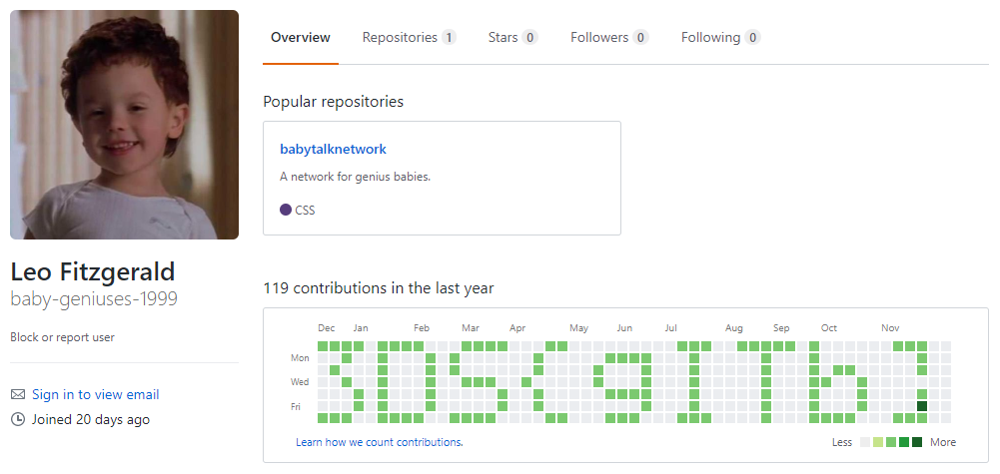

チーム Harekaze で 12 月 15 日から 12 月 18 日にかけて開催された [The 318br, DESEC and SucuriHC Capture The Flag (3DSCTF)](https://3dsctf.org/) に参加しました。最終的にチームで 4293 点を獲得し、順位は得点 435 チーム中 27 位でした。うち、私は 5 問を解いて 2307 点を入れました。

以下、解いた問題の write-up です。

## [Web 453] Baby Geniuses

与えられた URL にアクセスすると、メールアドレスとパスワードを入力するログインフォームが表示されました。…が、いろいろ試しても脆弱性は見つかりません。

[m---/webf**k](https://github.com/m---/webfuck) を回してみると `/.git/` が存在するということが分かりました。

[kost/dvcs-ripper](https://github.com/kost/dvcs-ripper) を使って `rip-git.pl -v -u http://baby01.3dsctf.org:8004/.git/` でダウンロードすることができました。

リポジトリの情報を調べてみます。

```
~/ctf/3dsctf2017/Baby Geniuses$ git config --list
...
core.repositoryformatversion=0
core.filemode=true
core.bare=false
core.logallrefupdates=true
remote.origin.url=https://github.com/baby-geniuses-1999/babytalknetwork.git
remote.origin.fetch=+refs/heads/*:refs/remotes/origin/*
branch.master.remote=origin
branch.master.merge=refs/heads/master
```

[baby-geniuses-1999/babytalknetwor](https://github.com/baby-geniuses-1999/babytalknetwork) がリモートのリポジトリのようです。このユーザのページを見てみるとフラグが得られました。



```
3DS{gITb}
```

## [Forensics 426] Bit Map

以下のような内容の HTML ファイルが与えられました。

```html
<!DOCTYPE html>
<html xmlns="http://www.w3.org/1999/xhtml">
<head>
	<meta charset="utf-8" />
	<title>Take a look at this bit map</title>
</head>
<body>
	<table style="border:none !important; border-spacing:0px !important">
		  <tr><td bgcolor="#7f454c" height="25" width="25"></td> <td bgcolor="#460201" height="25" width="25"></td> <td bgcolor="#010000" height="25" width="25"></td> <td bgcolor="#000000" height="25" width="25"></td> <td bgcolor="#000000" height="25" width="25"></td> <td bgcolor="#000300" height="25" width="25"></td> <td bgcolor="#3e0001" height="25" width="25"></td> <td bgcolor="#000000" height="25" width="25"></td> <td bgcolor="#300500" height="25" width="25"></td> <td bgcolor="#000000" height="25" width="25"></td> <td bgcolor="#000040" height="25" width="25"></td> <td bgcolor="#000000" height="25" width="25"></td> <td bgcolor="#000000" height="25" width="25"></td> <td bgcolor="#006019" height="25" width="25"></td> <td bgcolor="#000000" height="25" width="25"></td> <td bgcolor="#000000" height="25" width="25"></td> <td bgcolor="#000000" height="25" width="25"></td> <td bgcolor="#004000" height="25" width="25"></td> <td bgcolor="#380009" height="25" width="25"></td> <td bgcolor="#004000" height="25" width="25"></td> <td bgcolor="#1e001d" height="25" width="25"></td> <td bgcolor="#000600" height="25" width="25"></td> <td bgcolor="#000005" height="25" width="25"></td></tr>
...
	</table>
</body>
</html>
```

`<td bgcolor="#7f454c" height="25" width="25"></td>` というように、色情報に ELF が埋め込まれているようです。抽出してみましょう。

```python
import re
m = re.compile(r'#([0-9a-f]{6})')
with open('index.html', 'r') as f:
  s = f.read()
with open('result.bin', 'wb') as f:
  f.write(''.join(m.findall(s)).decode('hex'))
```

```
$ python solve.py
$ chmod +x ./result.bin
$ ./result.bin
3DS{H1dd3n_1n_7ru3_C0l0r5}
```

フラグが得られました。

```
3DS{H1dd3n_1n_7ru3_C0l0r5}
```

## [Forensics 472] Wargames

`16eb529c67dac665dc8cfda6a185ab85.ppm` という画像ファイルが与えられました。開いてみると、よくわからない白黒の模様が表示されました。

バイナリエディタで開いてみると、ファイルは `P4` (2 値、バイナリ形式) から始まっていることが分かります。`P6` (フルカラー、バイナリ形式) に書き換えるとフラグが得られました。

```
3DS{d0nT_LaUnCH_PpMs}
```

## [Malware 464] Ransomware

`mocoh_decrypter.exe` という PE ファイルと、これを使ってフラグを暗号化した `flag.mocoh` というファイルが与えられました。

```
$ xxd flag.mocoh
00000000: 9ceb fcd4 9bdc fc9c c2cd c3d6 f0dd 9fcc  ................
00000010: c4dc 8e8e d2                             .....
```

フラグの形式は `3DS{...}` であることが分かっています。とりあえず xor してみましょう。

```
$ python2
Python 2.7.9 (default, Mar  1 2015, 12:57:24) 
[GCC 4.9.2] on linux2
Type "help", "copyright", "credits" or "license" for more information.
>>> from pwn import *
>>> xor('\x9c\xeb\xfc\xd4', '3DS{')
'\xaf\xaf\xaf\xaf'
```

0xaf と xor されているようです。フラグ全体を 0xaf と xor するとフラグが得られました。

```
3DS{4sS3mbly_r0cks!!}
```

## [Crypto 492] Optimus Prime

私が問題を確認した時点で、[@ykm_kn](https://twitter.com/ykm_kn) さんによって与えられた公開鍵が以下のように素因数分解できることが分かっていました。

```
p = 13
q = 16858949699431715733595385952657111638372915698247917850286772590308134144070129702442888077634740090470194663892924465575104221651662631854053254899107021178686661128511936632702742163687696418159146968595656196557522714801252828347539948366111057072812697143372875040036848248435428280091706038902841827637387143171010129141427534225398504710602790138790124015900565367742562578412302566453766208845151786407545074335756400810980162488442003731816858209698405023217173261826849210207923195305170208559417
```

`q` を 16 進数で表してみましょう。

```
>>> hex(16858949699431715733595385952657111638372915698247917850286772590308134144070129702442888077634740090470194663892924465575104221651662631854053254899107021178686661128511936632702742163687696418159146968595656196557522714801252828347539948366111057072812697143372875040036848248435428280091706038902841827637387143171010129141427534225398504710602790138790124015900565367742562578412302566453766208845151786407545074335756400810980162488442003731816858209698405023217173261826849210207923195305170208559417)
'0x504b03041400090008000069774a01f66d602c0000001e00000008000000466c61672e747874b350735b19307a407375e1af7c08c1ceec2149842dce5267809fe3323fd6c268a23f51e58f395ff4bacc52f4504b070801f66d602c0000001e000000504b01021f001400090008000069774a01f66d602c0000001e000000080024000000000000002000000000000000466c61672e7478740a00200000000000010018000e0a43a5efa3d20100301c32c9a2d2012dd3b766e1a3d201504b050600000000010001005a000000620000001139L'
```

ZIP ファイルのようです。`res.zip` として保存しましょう。

`res.zip` を展開しようとすると、パスワードを要求されました。

```
$ unzip res.zip
Archive:  res.zip

caution:  zipfile comment truncated
[res.zip] Flag.txt password:
```

John the Ripper に投げてみましょう。

```
$ zip2john res.zip > res.john
ver 14  res.zip->Flag.txt PKZIP Encr: cmplen=44, decmplen=30, crc=606DF601
$ john res.john 
Using default input encoding: UTF-8
Loaded 1 password hash (PKZIP [32/64])
Warning: OpenMP is disabled; a non-OpenMP build may be faster
Press 'q' or Ctrl-C to abort, almost any other key for status
123123           (res.zip)
1g 0:00:00:00 DONE 2/3 (2017-12-18 16:44) 33.33g/s 533166p/s 533166c/s 533166C/s 123456..Peter
Use the "--show" option to display all of the cracked passwords reliably
Session completed
```

`123123` がパスワードであると分かりました。このパスワードを使って `res.zip` を展開するとフラグが得られました。

```
3DS{Pr1m3_numb3rs_4re_c00l!!!}
```