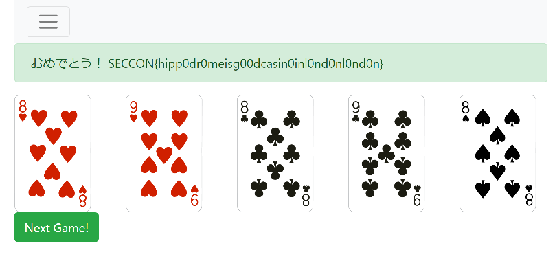

[SECCON 2018 x CEDEC CHALLENGE](2018-09-01-seccon-2018-x-cedec-challenge.html) で優勝したことから、チーム Harekaze として [@_ak1t0](https://twitter.com/_ak1t0) さん ([write-up](https://ak1t0.hatenablog.com/entry/2018/12/24/133723))、[@hiww](https://twitter.com/hiww) さんと[SECCON 2018 国内決勝大会](https://2018.seccon.jp/2018/12/seccon-ctf-2018-team-list-international-domestic.html)に参加しました。最終的にチームで 1076 点 (攻撃 950 点 + 防御 126 点) を獲得し、順位は参加 15 チーム中 11 位でした。

競技形式は King of the Hill で、チームのスコアは Jeopardy 的な攻撃ポイントと、チームごとに与えられるディフェンスキーワードをサーバに書き込み続けることによって得られる防御ポイントの合計によって決まるというものでした。

今回出題された松島、天橋立、宮島の 3 問について write-up を書いてみます。

## 松島
> オンラインカジノ松島にようこそ！ビデオポーカーがあるよ、ゆっくりしていってね！！！ 
> http://matsushima.pwn.ja.seccon/

オンラインで 5 秒に 1 回だけポーカーができるサービスでした。以下の条件でフラグが得られる/書き込めるというルールでした。

- 攻撃フラグ 1 (100 点) : フルハウス以上の役が揃った場合に得られる
- 攻撃フラグ 2 (300 点) : フォーカード以上の役が揃った場合に得られる
- 防御 : 攻撃フラグ 2 を入手した際に得られる URL からディフェンスキーワードを書き込める

プレイヤーに与えられるカードは、同時に配布されていた `generate_random_hands` という x86_64 の ELF を使ってランダムに生成されていました。

### 攻撃フラグ 1 (100 点)
宮島の待ち時間で遊んでいたところ、偶然引き当てることができました。



```
SECCON{hipp0dr0meisg00dcasin0inl0nd0nl0nd0n}
```

### 攻撃フラグ 2 (300 点)
#### バイナリの解析
フルハウスなら根性さえあれば何とかなりそうですが、フォーカードであればイカサマをしないとダメそうです。`generate_random_hands` を逆アセンブルしてみると、カードを生成する擬似乱数生成器は以下のようにして初期化されていることが分かりました。

```
mov edi, 0
call _time
mov [rbp+var_128], rax
mov rax, [rbp+var_128]
sub eax, 1EA23D65h
mov edi, eax
call _srand
```

C に直すと `srand(time(NULL) - 0x1ea23d65)` のようになり、現在時刻をシードに利用していることが分かります。Web インタフェースではヘッダ部分にサーバ側の日時が表示されており、これを UNIX 時間に変換してシードとすることでどのような乱数が生成されるか予測できそうです。つまり、カードを交換した際に何のカードが配られるか推測できそうです!

まず、試しに `time()` の返り値を自由に変更できるようにしてみましょう。

```c
#include <stdlib.h>
int time(int t) {
  return atoi(getenv("TIMEEE"));
}
```

`gcc -shared -fPIC -o time.so time.c` でコンパイルすると、`TIMEEE=(表示時刻) LD_PRELOAD=./time.so ./generate_random_hands` のようにして `time()` の返り値を変更できるようになります。

```
root@d492e604707f:/ctf# TIMEEE=12345 LD_PRELOAD=./time.so ./generate_random_hands
{"game_id":(null),"deck":[20,5,45,21,6,0,48,10,47,17],"max_score":2699}
root@d492e604707f:/ctf# sleep 5
root@d492e604707f:/ctf# TIMEEE=12345 LD_PRELOAD=./time.so ./generate_random_hands
{"game_id":(null),"deck":[20,5,45,21,6,0,48,10,47,17],"max_score":2699}
```

`generate_random_hands` が利用しているライブラリである [HenryRLee/PokerHandEvaluator](https://github.com/HenryRLee/PokerHandEvaluator/) を見ると、数値とカードは以下のように対応付けられていることが分かります。

```python
def get_card(x):
  return 'CDHS'[x % 4] + '23456789TJQKA'[x // 4].replace('T', '10')
```

`generate_random_hands` が返した `deck` をこの関数でカードに直してみると、Web インタフェース上で表示されているカードと一致していることがわかります。

#### クライアント
クライアントを書いてみます。

```python
# coding: utf-8
import json
import re
import requests
import subprocess
import time
from datetime import datetime

def get_card(x):
  return 'CDHS'[x % 4] + '23456789TJQKA'[x // 4].replace('T', '10')

PLAY = 'http://matsushima.pwn.ja.seccon/play'
DRAW = 'http://matsushima.pwn.ja.seccon/draw'

while True:
    sess = requests.Session()
    r = sess.get(PLAY)
    c = r.content.decode('utf-8')

    # 出てきたカード
    cards = re.findall(r'/static/images/deck/(\d+)\.png', c)
    cards = [get_card(int(x)) for x in cards]
    print('cards:', cards)

    game_id = int(re.search(r'value=(\d+) name="game_id"', c).groups()[0])
    print('game_id:', game_id)

    # 時間をパース
    time_ = re.search(r'Time: (\d{4}/\d{2}/\d{2} \d{2}:\d{2}:\d{2})', c).groups()[0]
    time_ = datetime.strptime(time_, '%Y/%m/%d %H:%M:%S')
    time_ = int((time_ - datetime(1970,1,1)).total_seconds())
    print('time:', time_)

    # カードを予測
    output = subprocess.check_output('TIMEEE={} LD_PRELOAD=./time.so ./generate_random_hands'.format(time_), shell=True)
    print('result:', output)
    output = output.decode('utf-8').strip().replace('(null)', '0')
    j = json.loads(output)

    deck = j['deck'][5:]
    deck = [get_card(int(x)) for x in deck]
    print('deck:', deck)

    # カードを交換 (手動)
    option = input('kaeru yatsu:')
    option = option.split(',')

    payload = '&'.join('change={}'.format(c) for c in option) + '&game_id=' + str(game_id)
    print('payload:', payload)
    r = sess.post(DRAW, data=payload.encode('utf-8'), headers={
      'Content-Type': 'application/x-www-form-urlencoded'
    })

    c = r.content.decode('utf-8')

    cards = re.findall(r'/static/images/deck/(\d+)\.png', c)
    cards = [get_card(int(x)) for x in cards]
    print('cards:', cards)

    print(r.content)

    if b'SECCON' in r.content:
        print('yatta!')

    time.sleep(5)
```

#### 根性
しばらく試しているとフォーカードを出すことができました。

```
cards: ['D10', 'H10', 'C3', 'S10', 'D2']
game_id: 445113023906494
time: 1545544743
result: b'{"game_id":(null),"deck":[33,34,4,35,1,32,0,44,39,49],"max_score":226}\n'
deck: ['C10', 'C2', 'CK', 'SJ', 'DA']
kaeru yatsu: 2
payload: change=2&game_id=445113023906494
cards: []
b'<!DOCTYPE html>\n<html lang="en">\n  <head>\n    <meta charset="utf-8">\n    <meta http-equiv="X-UA-Compatible" content="IE=edge">\n    <meta name="viewport" content="width=device-width, initial-scale=1">\n    <link rel="stylesheet" href="/static/css/bootstrap.min.css" id="bootstrap-css">\n    <script src="/static/js/jquery-3.3.1.min.js"></script>\n    <script src="/static/js/bootstrap.min.js"></script>\n    <link rel="stylesheet" href="/static/css/matsushima.css">\n    \n    <script src="/static/js/matsushima.js"></script>\n  </head>\n  <body>\n\n    <div class="container">\n      <header class="sticky-top">\n        <div class="page-header">\n          <nav class="navbar navbar-expand-lg navbar-light bg-light">\n            <button type="button" class="navbar-toggler" data-toggle="collapse" data-target="#Navbar" aria-controls="Navbar" aria-expanded="false" aria-label="\xe3\x83\x8a\xe3\x83\x93\xe3\x82\xb2\xe3\x83\xbc\xe3\x82\xb7\xe3\x83\xa7\xe3\x83\xb3\xe3\x81\xae\xe5\x88\x87\xe6\x9b\xbf">\n              <span class="navbar-toggler-icon"></span>\n            </button>\n            <div class="collapse navbar-collapse" id="Navbar">\n              \n                <ul class="navbar-nav mr-auto">\n                <li class="nav-item">\n                  <a class="nav-link" href="/">Home</a>\n                </li>\n                <li class="nav-item">\n                  <a class="nav-link" href="/rules">Rules</a>\n                </li>\n                <li class="nav-item">\n                  <a class="nav-link" href="/download">Download</a>\n                </li>\n                <li class="nav-item">\n                  <a class="nav-link" href="/play">Play</a>\n                </li>\n              </ul>\n              <ul class="navbar-nav">\n              <li class="nav-item">\n              <span class="navbar-text">\n                <b>Time: 2018/12/23 05:59:09</b>\n              </span>\n              </li>\n            </ul>\n            </div><!-- /.collapse -->\n          </nav>\n        </div>\n      </header>\n      <main>\n      <div class="row">\n        <div class="col-xs-8 col-lg-8">\n          \n    <p> \xe6\x9c\xac\xe5\xbd\x93\xe3\x81\xab\xe3\x81\x8a\xe3\x82\x81\xe3\x81\xa7\xe3\x81\xa8\xe3\x81\x86\xef\xbc\x81 \xe3\x81\x93\xe3\x81\xae\xe3\x83\x95\xe3\x83\xa9\xe3\x82\xb0\xe3\x81\xafSECCON{iw4ntt0h0114ndc4sin0isn04g4in}\xe3\x81\xa7\xe3\x81\x99\xef\xbc\x81 </p>\n    <form action=\'/MarinaBaySandsNo1Fhaimakaisoutyudayo\' method=\'POST\'>\n    <input type=\'text\' maxlength=\'32\' name=\'defense_flag\' placeholder=\'input your defense flag\'/>\n    <input type=\'submit\' name=\'submit\'/>\n    </form>\n    <p><a href="MarinaBaySandsZettaiYurusanai"> \xe3\x83\x87\xe3\x82\xa3\xe3\x83\x95\xe3\x82\xa7\xe3\x83\xb3\xe3\x82\xb9\xe3\x83\x95\xe3\x83\xa9\xe3\x82\xb0\xe3\x81\xae\xe7\xa2\xba\xe8\xaa\x8d\xe3\x81\xaf\xe3\x81\x93\xe3\x81\xa1\xe3\x82\x89</a></p>\n\n        </div>\n      </div>\n    </main>\n    </div>\n\n  </body>\n</html>'
yatta!
```

```
SECCON{iw4ntt0h0114ndc4sin0isn04g4in}
```

---

わざわざサーバにカードを確認しに行かなくても、ローカルで 1 秒ごとに出てくるカードの推測ができたのでは。

### 防御
攻撃フラグ 2 が表示されると同時に、以下のようにディフェンスキーワードを書き込むフォームが表示されていることが分かります。

```html
<form action='/MarinaBaySandsNo1Fhaimakaisoutyudayo' method='POST'>
  <input type='text' maxlength='32' name='defense_flag' placeholder='input your defense flag'/>
  <input type='submit' name='submit'/>
</form>
```

スクリプトを書き、自動化しました。

```python
import re
import requests
import time
from defence import get_keyword

URL = 'http://matsushima.pwn.ja.seccon/MarinaBaySandsNo1Fhaimakaisoutyudayo'

while True:
  s = requests.Session()
  keyword = get_keyword()
  print(keyword)
  r = s.post(URL, data={
    'defense_flag': keyword
  })
  
  time.sleep(30)
```

## 天橋立
> http://amanohashidate.pwn.ja.seccon/login

各チーム 1 つずつ XSS の問題を出題することができ、問題のタイトルにディフェンスキーワードを書き込むことで、他チームに解かれない限り問題が消えず防御ポイントが得られるというものでした。攻撃フラグは設定されていない…のですが、競技開始後しばらく勘違いしていていろいろ試していました (つらい)。

出題できる問題のレギュレーションは

- `alert('XSS')` あるいはこれに相当するコードが実行できる
- payload は `location.search` (GET パラメータ) 経由で渡される

というもので、投稿時には問題となる HTML と同時に、その問題が解けることを証明する payload を提出する必要がありました。他チームは出題された問題で `alert('XSS')` あるいはこれに相当するコードを実行できる payload を提出することで、その問題を消す (= そのチームのディフェンスキーワードを消す) ことができました。

### 防御
コンセプトは面白そうですが、しばらくすると他チームが以下のようにハッシュ関数を使った問題を出し始めました。

```html
<script>
// ハッシュ関数
function hash(str) {
  return /* ... */;
}

if (hash(decodeURIComponent(location.search.substring(1))) === '60d9a0bab58877ca6db1208a59ed9d61') {
  alert('XSS');
}
</script>
```

これでは出題したチームにしか解けません。ということで Harekaze はこれをパクって他チームには解けない問題を作ることができました。すみません。

#### 自動化
30 秒ごとにディフェンスキーワードを取得し、タイトルを更新するスクリプトを書きました。

```python
import re
import requests
import time
from defence import get_keyword

URL = 'http://amanohashidate.pwn.ja.seccon/challenge/468f9210-0655-11e9-95c6-dfc0645e8100/update'
COOKIE = {
  'xss_hell_session': '...'
}

while True:
  s = requests.Session()

  # CSRF トークンの取得
  r = s.get(URL, cookies=COOKIE)
  print(r, r.headers)
  token = re.search(r'_token" value="([^"]+)"', r.content.decode('utf-8')).groups()[0]

  # ディフェンスキーワードの取得
  keyword = get_keyword().decode('utf-8')
  print('keyword:', keyword)

  # タイトルの更新
  r = s.post(URL, data={
    'title': keyword,
    'model_answer': 'aisdkqidwqdwq',
    '_token': token
  }, cookies=COOKIE)
  print(r, r.headers)

  time.sleep(30)
```

## 宮島
> http://miyajima.pwn.ja.seccon/

30 分ごとに問題が変わる x86_64 のコードゴルフ場でした。以下の条件でフラグが得られる/書き込めるというルールでした。

- 攻撃フラグ 1 ~ 12 (各 50 点) : 指定されたバイト数以下の命令列を提出し、AC した場合に得られる
- 防御 : 最短の命令列でもっとも早く AC したチームがディフェンスキーワードを書き込める (1 チームが総取り?)

### 攻撃フラグ 1 ~ 12
> int型の引数aを受け取って奇数なら1を、偶数なら0を返す関数を実装してください。

というような問題が 12 問出題されました。はじめは以下のように真面目にアセンブリを書いていました…

```
bits 64
xchg edi, eax
and eax, 1
ret
```

が、最短の命令列を狙わないのであればコンパイラの出力をそのまま投げればよいことに気づき、まずこの方法で攻撃フラグを入手し、それからアセンブリを手書きする方針に切り替えました。最終的に 12 問中 11 問が解け、550 点を手に入れることができました。解けなかった 1 問は最初に出題されたもので、インクリメントをする関数を実装するという簡単なものではあったものの、攻撃フラグが表示される場所が分からないという状況でした。かなしい。

## 感想とか
- Harekaze は学生チームですが、連携大会からの参加ということで交通費の支給はありませんでした。つらい。
- 今回もうひとりがメンバーとして参加される予定でしたが、当日音信不通となり結局参加されませんでした。つらい。

> 文部科学大臣賞の授与対象
> ※国内大会に出場した一番優秀な日本の学生チームと日本の学生個人には文部科学大臣賞が授与されます。
> [https://2018.seccon.jp/seccon/2018akihabara/#scd01](https://2018.seccon.jp/seccon/2018akihabara/#scd01)

- ということで、この「一番優秀な日本の学生個人」ということで文部科学大臣賞をいただきました。ありがとうございます!
- 来年以降も決勝大会に参加できるよう精進したいなと思います。
