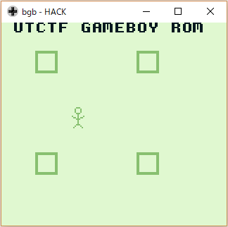

3 月 9 日から 3 月 11 日にかけて開催された [UTCTF](https://www.isss.io/utctf/) に、チーム Harekaze で参加しました。最終的にチームで 8050 点を獲得し、順位は得点 581 チーム中 19 位でした。うち、私は 13 問を解いて 8050 点を入れました。

以下、解いた問題の write-up です。

## Cryptography
### [basics] crypto (200)
> Can you make sense of this file?
> 添付ファイル: binary.txt

`binary.txt` は以下のような内容でした。

```
01010101 01101000 00101101 01101111 01101000 00101100 …
```

2 進数として文字列に戻してみましょう。

```
$ python2
>>> s = open('binary.txt').read()
>>> s = ''.join(chr(int(c, 2)) for c in s.split())
>>> s
"Uh-oh, looks like we have another block of text, with some sort of special encoding. Can you figure out what this encoding is? (hint: if you look carefully, you'll notice that there only characters present are A-Z, a-z, 0-9, and sometimes / and +. See if you can find an encoding that looks like this one.)\nTmV3IGNoYWxsZW5nZSEgQ2FuIHlvdSBmaWd1cmUgb3V0IHdoYXQncyBnb2luZyBvbiBoZXJlPyBJdCBsb29rcyBsaWtlIHRoZSBsZXR0ZXJzIGFyZSBzaGlmdGVkIGJ5IHNvbWUgY29uc3RhbnQuIChoaW50OiB5b3UgbWlnaHQgd2FudCB0byBzdGFydCBsb29raW5nIHVwIFJvbWFuIHBlb3BsZSkuCmt2YnNxcmQsIGl5ZSdibyBrdnd5Y2QgZHJvYm8hIFh5ZyBweWIgZHJvIHBzeGt2IChreG4gd2tpbG8gZHJvIHJrYm5vY2QuLi4pIHprYmQ6IGsgY2VsY2RzZGVkc3l4IG1zenJvYi4gU3ggZHJvIHB5dnZ5Z3N4cSBkb2hkLCBTJ2ZvIGRrdW94IHdpIHdvY2NrcW8ga3huIGJvenZrbW9uIG9mb2JpIGt2enJrbG9kc20gbXJrYmttZG9iIGdzZHIgayBteWJib2N6eXhub3htbyBkeSBrIG5zcHBvYm94ZCBtcmtia21kb2IgLSB1eHlneCBrYyBrIGNlbGNkc2RlZHN5eCBtc3pyb2IuIE1reCBpeWUgcHN4biBkcm8gcHN4a3YgcHZrcT8gcnN4ZDogR28gdXh5ZyBkcmtkIGRybyBwdmtxIHNjIHF5c3hxIGR5IGxvIHlwIGRybyBweWJ3a2QgZWRwdmtxey4uLn0gLSBncnNtciB3b2t4YyBkcmtkIHNwIGl5ZSBjb28gZHJrZCB6a2Rkb2J4LCBpeWUgdXh5ZyBncmtkIGRybyBteWJib2N6eXhub3htb2MgcHliIGUsIGQsIHAsIHYgaywga3huIHEga2JvLiBJeWUgbWt4IHpieWxrbHZpIGd5YnUgeWVkIGRybyBib3drc3hzeHEgbXJrYmttZG9iYyBsaSBib3p2a21zeHEgZHJvdyBreG4gc3hwb2Jic3hxIG15d3d5eCBneWJuYyBzeCBkcm8gT3hxdnNjciB2a3hxZWtxby4gS3h5ZHJvYiBxYm9rZCB3b2RyeW4gc2MgZHkgZWNvIHBib2Flb3htaSBreGt2aWNzYzogZ28gdXh5ZyBkcmtkICdvJyBjcnlnYyBleiB3eWNkIHlwZG94IHN4IGRybyBrdnpya2xvZCwgY3kgZHJrZCdjIHpieWxrbHZpIGRybyB3eWNkIG15d3d5eCBtcmtia21kb2Igc3ggZHJvIGRvaGQsIHB5dnZ5Z29uIGxpICdkJywga3huIGN5IHl4LiBZeG1vIGl5ZSB1eHlnIGsgcG9nIG1ya2JrbWRvYmMsIGl5ZSBta3ggc3hwb2IgZHJvIGJvY2QgeXAgZHJvIGd5Ym5jIGxrY29uIHl4IG15d3d5eCBneWJuYyBkcmtkIGNyeWcgZXogc3ggZHJvIE94cXZzY3Igdmt4cWVrcW8uCnJnaG54c2RmeXNkdGdodSEgcWdmIGlzYWsgY3RodHVpa2UgZGlrIHprbnRoaGt4IHJ4cWxkZ254c2xpcSByaXN5eWtobmsuIGlreGsgdHUgcyBjeXNuIGNneCBzeXkgcWdmeCBpc3hlIGtjY2d4ZHU6IGZkY3lzbnszaHJ4cWxkMTBoXzE1X3IwMHl9LiBxZ2YgdnR5eSBjdGhlIGRpc2QgcyB5Z2QgZ2MgcnhxbGRnbnhzbGlxIHR1IHBmdWQgemZ0eWV0aG4gZ2NjIGRpdHUgdWd4ZCBnYyB6c3V0ciBiaGd2eWtlbmssIHNoZSB0ZCB4a3N5eXEgdHUgaGdkIHVnIHpzZSBzY2RreCBzeXkuIGlnbGsgcWdmIGtocGdxa2UgZGlrIHJpc3l5a2huayE="
```

`A-Z` `a-z` `0-9` `/` `+` で表現され、最後に `=` が出現することがあるエンコーディング方式といえば Base64 です。

```
>>> s = s.splitlines()[1].decode('base64')
>>> s
"New challenge! Can you figure out what's going on here? It looks like the letters are shifted by some constant. (hint: you might want to start looking up Roman people).\nkvbsqrd, iye'bo kvwycd drobo! Xyg pyb dro psxkv (kxn wkilo dro rkbnocd...) zkbd: k celcdsdedsyx mszrob. Sx dro pyvvygsxq dohd, S'fo dkuox wi wocckqo kxn bozvkmon ofobi kvzrklodsm mrkbkmdob gsdr k mybboczyxnoxmo dy k nsppoboxd mrkbkmdob - uxygx kc k celcdsdedsyx mszrob. Mkx iye psxn dro psxkv pvkq? rsxd: Go uxyg drkd dro pvkq sc qysxq dy lo yp dro pybwkd edpvkq{...} - grsmr wokxc drkd sp iye coo drkd zkddobx, iye uxyg grkd dro mybboczyxnoxmoc pyb e, d, p, v k, kxn q kbo. Iye mkx zbylklvi gybu yed dro bowksxsxq mrkbkmdobc li bozvkmsxq drow kxn sxpobbsxq mywwyx gybnc sx dro Oxqvscr vkxqekqo. Kxydrob qbokd wodryn sc dy eco pboaeoxmi kxkvicsc: go uxyg drkd 'o' crygc ez wycd ypdox sx dro kvzrklod, cy drkd'c zbylklvi dro wycd mywwyx mrkbkmdob sx dro dohd, pyvvygon li 'd', kxn cy yx. Yxmo iye uxyg k pog mrkbkmdobc, iye mkx sxpob dro bocd yp dro gybnc lkcon yx mywwyx gybnc drkd cryg ez sx dro Oxqvscr vkxqekqo.\nrghnxsdfysdtghu! qgf isak cthtuike dik zknthhkx rxqldgnxsliq risyykhnk. ikxk tu s cysn cgx syy qgfx isxe kccgxdu: fdcysn{3hrxqld10h_15_r00y}. qgf vtyy cthe disd s ygd gc rxqldgnxsliq tu pfud zftyethn gcc ditu ugxd gc zsutr bhgvykenk, she td xksyyq tu hgd ug zse scdkx syy. iglk qgf khpgqke dik risyykhnk!"
```

シーザー暗号っぽい雰囲気があります。右に 16 シフトしてみましょう。

```
alright, you're almost there! Now for the final (and maybe the hardest...) part: a substitution cipher. In the following text, I've taken my message and replaced every alphabetic character with a correspondence to a different character - known as a substitution cipher. Can you find the final flag? hint: We know that the flag is going to be of the format utflag{...} - which means that if you see that pattern, you know what the correspondences for u, t, f, l a, and g are. You can probably work out the remaining characters by replacing them and inferring common words in the English language. Another great method is to use frequency analysis: we know that 'e' shows up most often in the alphabet, so that's probably the most common character in the text, followed by 't', and so on. Once you know a few characters, you can infer the rest of the words based on common words that show up in the English language.
hwxdnitvoitjwxk! gwv yiqa sjxjkyau tya padjxxan hngbtwdnibyg hyiooaxda. yana jk i soid swn ioo gwvn yinu asswntk: vtsoid{3xhngbt10x_15_h00o}. gwv ljoo sjxu tyit i owt ws hngbtwdnibyg jk fvkt pvjoujxd wss tyjk kwnt ws pikjh rxwloauda, ixu jt naioog jk xwt kw piu istan ioo. ywba gwv axfwgau tya hyiooaxda!
```

単一換字式暗号です。`vtsoid=utflag` というヒントを与えて [quipqiup](https://www.quipqiup.com/) で解いてもらいましょう。

```
congratulations! you have finished the beginner cryptography challenge. here is a flag for all your hard efforts: utflag{3ncrypt10n_15_c00l}. you will find that a lot of cryptography is just building off this sort of basic knowledge, and it really is not so bad after all. hope you en?oyed the challenge!
```

フラグが得られました。

```
utflag{3ncrypt10n_15_c00l}
```

### Jacobi's Chance Encryption (750)
> Public Key 569581432115411077780908947843367646738369018797567841
> 
> Can you decrypt Jacobi's encryption?
> 
>   def encrypt(m, pub_key):
> 
>       bin_m = ''.join(format(ord(x), '08b') for x in m)
>       n, y = pub_key
> 
>       def encrypt_bit(bit):
>           x = randint(0, n)
>           if bit == '1':
>               return (y * pow(x, 2, n)) % n
>           return pow(x, 2, n)
> 
>       return map(encrypt_bit, bin_m)
> 
> 添付ファイル: flag.enc (暗号化されたファイル)

`569581432115411077780908947843367646738369018797567841` を [factordb](http://www.factordb.com) に投げると `734957260793116165505496343 * 774985788290270540426902087` に素因数分解できました。

記事中のコードの一部でググってみると [https://gist.github.com/brunoro/5893701/](https://gist.github.com/brunoro/5893701/) がヒットしました。このコードを利用して

```python
p, q =  734957260793116165505496343, 774985788290270540426902087
n = p * q

enc = [352150743274184139568642408429864302307004426519117704, 0, 0, 0, 348848063681803224042392721144096776668607294345691134, 0, 253820499224768536333192288077122213344988651778009349, 0, 548409625757285761070763423357132491898877074666097464, 0, 0, 0, 340581158667644578609349353166936136767685362835649190, 0, 321703954281971266402724413246104050241895445514163082, 5524476081243984726567346713711471201936810223457689, 199267273946187977714982999412063444255289301440053021, 0, 0, 276900992913739477377897494415422531376480921684493914, 487076310641065040368857494836873055985223489215306103, 0, 0, 561529363654937567389648584431680963882656253121171477, 358673135407268913258845476268609649160471049175723452, 0, 0, 301242742726793777716140374379983095893379101868477214, 0, 0, 258484565643328749423604227770745541287535434142077798, 52088736766209022929196489386753829735770864325403038, 145395072700409928878462827944724072516393248180327831, 0, 0, 144655566941435495863415611084362461905855530329694109, 428029817507952689898995815803602654642760765033104414, 564269220473525805415041765312376250339461615073601598, 72841701015763399074106258995335394239829898165871774, 0, 116692319299887000639029633159438321654040040741536379, 0, 0, 41933390614445444209073285911156511250647216427387079, 195310433482791814218167916008181955655740103865075152, 0, 0, 0, 337648984473742017629170208724165389908833734139232765, 0, 0, 0, 0, 441706451411540991609707806657229251416403024623668328, 0, 0, 390116113983452685301918329269213077106100231151056249, 0, 0, 202704019229770673209639718893919930034378288491417664, 218566351519542401147038570559515527394243291865769184, 0, 37603303132492020927173108475419822895042258382398572, 480582323821758015576231090875423900250653700696953373, 67640535593199520167792728334858439385048122760084823, 0, 0, 19183583345770226809154430416052723934247478646032011, 0, 444223555942651329764681716774426130871887669715333686, 456791551424000144521876962030429395552511709900958210, 0, 195672357582290687176260317600923291821116829971920518, 0, 0, 170674131950179711007392529698268094240689091777954838, 243566197243126879153988458634769153607600588692482121, 0, 89279840654446765257439685707215358493235876290554856, 317581103003822662953064140279583958966902798607149047, 480445729726763510615302479930341432881739573905234463, 0, 460851483339458136322476674107867199986733756963374119, 0, 0, 0, 0, 0, 439352366371473953075498103856923572370983659445114694, 0, 0, 0, 126795362681287873853505318194683580877791440381922496, 0, 430303358444794409214233037378259752214178914148410761, 0, 217170969223820349846919623897860519463700318683537643, 0, 202603189970079132981330274433874102237669512188240988, 0, 0, 0, 0, 0, 318420038166128466648262857537381043301348807897917604, 0, 0, 0, 551318573136800895868519491372566937544825765020046750, 392071121893785923044337924418134439586992955404669639, 80984051101180577600204843860818808503563181191602533, 6107915764824005996179881394173512271815597166591466, 291269337853102597614324700960451961205022919225839705, 0, 0, 155918219426776850574390912874276680045371974713012810, 267140248273044515436994284349863931573187527824440948, 27346761129054137074794740379914105738154849453344210, 405814641152968612231540174050381812508875853307807521, 0, 369173891614218386394419681333139373251746947116779880, 0, 0, 0, 0, 48064106163159163703600939330170931833830092579245404, 50193011996675395534442735436731138017115262481377878, 0, 368500369099918336665363465172652180141387131907821254, 0, 156050635583915782362368907357532891046084723866744238, 0, 0, 0, 0, 0, 185242158159335271946031316884855625996041714224135843, 0, 0, 396905091842335450642284132178768903645366020809442735, 395986732810990953535261211231028418340902501827542702, 533668277163835546477872841662817813346757999826944180, 201669637626024138731392852397954025669518638510026264, 0, 256269662229022954881845785692914031196874341235846202, 0, 0, 0, 229419724635458197715690238867356394992758231521148969, 0, 161666523813371319652427079675398983943367879551450313, 297523973427475251188035709013874154946105125638119367, 268607652607898540572289880291719446349023780839434581, 0, 0, 0, 536883275069552264017303971398384526119747431579200437, 0, 379050588739204800393548472416282426446879220649219712, 519055251256284219529817283367469779689340638894595759, 180051083460073832396215084507779830804265344550889670, 0, 0, 178114050866981247624630898622579437042593591522117420, 440501306350280017092770582356655756071342459276757219, 0, 540570805562376491652801428094164486131261123087416174, 0, 523427121534121172479013474403806906434818335292178874, 0, 0, 39386541416310862050201439322764388862014378573490622, 0, 0, 0, 201586032487581010055468450454220699607657822318523086, 50527327205283396348240039384252834813993611458240595, 0, 0, 0, 495106437665855458843349927421155586195360066096125772, 0, 324843698597816665626636192754462471484396034460584947, 484496008355992926344332708480884228104547776111308361, 97801410718700399730569697890136816112635461215903749, 0, 0, 206003007041124674879653516148969582367583870674938772, 0, 233341300896199703294203952364149727826524074220319314, 187704454580331744369516386643803479572546256568987628, 0, 453109742684291930326088795544321093289151277623777138, 0, 0, 462509680431199281760925732528062472133182191899935988, 0, 0, 0, 0, 294218481299076867525184604279762775223981617609420542, 0, 0, 23714416296668219140894245852448312495921269886798262, 0, 0, 0, 214319390452517298077367806528713106830040263099593416, 239132270244091503660396785615913692771417663335316465, 0, 236485203749838938916694644967973926515262999219427252, 0, 0, 0, 0, 0, 72799517221545533815774647167392747218472595711536304, 0, 0, 156489365150500493173754555241402116737029835093426572, 0, 419087481883828420330204695294020697928090213562889850, 268685807462245206463654868278422754996008991361283143, 0, 143530531538833430820128282260879188050510783818230808, 0, 0, 421961064602627725160819701576494551721125536249266963, 0, 0, 0, 55044889796579671399895729198216225021226606885154576, 289753624082870223183220624435529264537326385145492067, 0, 180941972975310360890649688514473943113001118608050457, 0, 0, 0, 0, 0, 93930172870014252667639500200824445096875587977741586, 0, 0, 36457955107757427762533706378499924991816302473843840, 0, 0, 0, 539571284545652153966590081539464686116471532352471148, 110891011868435545112724624701014364627044002370746756, 0, 0, 0, 194152978000431760153236037090731274009165762361199525, 0, 431509150003630194202873547923139000070117018029418381, 0, 461174093784276871334649481963966514348555066420844605, 0, 0, 417639954571892671753534404148166768964466678754774894, 0, 0, 442085067297433858978417359935946149251248667567096559, 0, 251507014227796904113106601776355536204531748615280097, 0, 0, 263779249013683681893368962644712517151030250595777291, 433536185915600766181404822698622471363383206208082488, 170118291825877918214830594146065858529287506462034494, 0, 194568304016632182545287215591184091450533819112981779, 24088659927375350981846523085188220292961168834786145, 0, 0, 567185738066154763900865000395018788911942146099462933, 163577140048725332216746143033445364952000447981117214, 0, 14675948377706805089099117831585871082838823712895892, 0, 37448049298395662926687279834048379632266123419732478, 0, 0, 0, 373286228392711671493948204758235286975326795503647475, 310648276802256277110535762417517882012915041528883124, 0, 103889611370910796730601410816502436908470141091688972, 226359011517468228552093066743678630725171613458110358, 0, 397313751499341533015720034638727385973534074718363962, 0, 0, 0, 0, 0, 57121650046575847117838029399508214531479440611806861, 0, 0, 0, 123700853108719583923200993861149177409055694378379368, 0, 286821296721700020547871930570242768598053367541532719, 422261024616680294872234541741176155019240460672763618, 50875094504041143813575687097334607095518043886311642, 0, 0, 318338661652922077313982157241413931571816749600002820, 0, 324971976247104785592518162368829259719036800642594471, 83346829865955578807141246175821794646637947334391932, 217397214435788322229568509603275086873399995623549562, 70338786834042296340227247876560525412852638145870558, 0, 0, 183929147676205098844539224104461118545854801646951389, 399198390431358090644011266784727432647750142158906788, 0, 33170224536883210110397454954802011575077290139904396, 0, 215087812907333967842709645079752145811931056163893934, 0, 0, 8861144876939607226152787937610148403864256055539929, 0, 0, 0, 0, 353372979864768048841978157665968962965119734423223570, 0, 0, 0, 200013600987211131684607802177239516161780257249396096, 536817344991421025752093210330823763970423002056396548, 0, 556476214090627580916651184424368851420786613402682029, 91739236755656203883166587450770559588776429603138545, 0, 0, 0, 0, 469014806001801213451579372112391946067090767973463894, 83694459090756586621091470694586829257888288753416534, 0, 223012761865794387565185682963407395324832930273929909, 0, 0, 0, 0, 0, 368821655068892908151359881346839478973399414085751733, 0]

dec = decrypt(enc, (p, q))
print dec
```

でフラグが得られました。

```
utflag{did_u_pay_attention_in_number_theory}
```

## Web
### HabbyDabby's Secret Stash (650)
> HabbyDabby's hidden some stuff away on his web server that he created and wrote from scratch on his Mac. See if you can find out what he's hidden and where he's hidden it!
> 
> http://a.goodsecurity.fail/

Mac といえば `.DS_Store` です。`/.DS_Store` にアクセスし [gehaxelt/Python-dsstore](https://github.com/gehaxelt/Python-dsstore) のようなツールでパースすると `a` `e` というディレクトリの存在が確認できました。

サーバは Apache で autoindex が有効化されているため、`/a` や `/e` にアクセスするとそれぞれのディレクトリ下に存在しているファイルやディレクトリの一覧が表示されました。ディレクトリを掘っていくと、`/e/d/e/flag.txt` でフラグが得られました。

```
utflag{mac_os_hidden_files_are_stupid}
```

## Forensics
### [basics] forensics (100)
> My friend said they hid a flag in this picture, but it's broken!
> 添付ファイル: secret.jpg

適当なテキストエディタで `secret.jpg` を開くとフラグが得られました。

```
utflag{d0nt_tru5t_f1l3_3xt3ns10n5}
```

### Low Sodium Bagel (300)
> I brought you a bagel, see if you can find the secret ingredient.
> 添付ファイル: low-sodium-bagel.jpg

`low-sodium-bagel.jpg` は一見普通の、美味しそうなベーグルの画像です。JPEG + ステガノグラフィといえば [Steghide](http://steghide.sourceforge.net/) です。パスワードなしで `steghide` に投げるとフラグが得られました。

```
utflag{b1u3b3rry_b4g3ls_4r3_th3_b3st}
```

### Regular Zips (600)
> ^	7	y	RU[A-Z]KKx2 R4\d[a-z]B	N$
> https://storage.googleapis.com/utctf/RegularZips.zip
> 添付ファイル: problem.txt

`problem.txt` は問題文の正規表現らしき文字列と同じ内容でした。`RegularZips.zip` にはパスワードがかかっており、おそらくこの正規表現にマッチする文字列なのでしょう。総当たりしてみましょう。

```python
import itertools
import zipfile
zf = zipfile.ZipFile('RegularZips.zip', 'r')
for a, b, c in itertools.product('ABCDEFGHIJKLMNOPQRSTUVWXYZ', '0123456789', 'abcdefghijklmnopqrstuvwxyz'):
  password = f'\t7\ty\tRU{a}KKx2 R4{b}{c}B\tN'
  zf.setpassword(password.encode())
  try:
    s = zf.read('hint.txt')
    t = zf.read('archive.zip')
    with open('RegularZips/hint.txt', 'wb') as f:
      f.write(s)
    with open('RegularZips/archive.zip', 'wb') as f:
      f.write(t)
    print(repr(password))
  except:
    pass
zf.close()
```

これで展開できました…が、出てきた `archive.zip` と `hint.txt` はまた同じようにパスワード付きの ZIP ファイルとパスワードのヒントの文字列でした。さらにこの `archive.zip` の中に新たな `archive.zip` と `hint.txt` が存在しているのも確認できます。いちいちスクリプトを書き換えて実行するのは面倒なので、自動化してしまいましょう。

```python
import itertools
import re
import shutil
import string
import zipfile

shutil.copyfile('archive.zip', 'tmp.zip')
hint = open('hint.txt').read()[1:-1]

table = {
  '\s': string.whitespace,
  '\d': string.digits,
  '[A-Z]': string.ascii_uppercase,
  '[a-z]': string.ascii_lowercase
}

i = 0
while True:
  print(i)

  zf = zipfile.ZipFile('tmp.zip', 'r')
  pats = re.findall(r'(\\.|\[.+?\])', hint)

  for cs in itertools.product(*[table[x] for x in pats]):
    password = hint
    for pat, new in zip(pats, cs):
      password = password.replace(pat, new, 1)
    zf.setpassword(password.encode())
    try:
      tmp = zf.read('hint.txt')
    except:
      pass
    else:
      hint = zf.read('hint.txt')[1:-1].decode()
      print(repr(hint))
      tmp = zf.read('archive.zip')
      with open('tmp.zip', 'wb') as f:
        f.write(tmp)
      break
  else:
    print('What!?')
    break

  i += 1
  zf.close()
```

最後の ZIP を展開すると `flag.txt` が出てきました。

```
utflag{bean_pure_omission_production_rally}
```

### Scrambled (1250)
> B2 R U F' R' L' B B2 L F D D' R' F2 D' R R D2 B' L R
> L' L B F2 R2 F2 R' L F' B' R D' D' F U2 B' U U D' U2 F'
> L F' F2 R B R R F2 F' R2 D F' U L U' U' U F D F2 U R U' F U B2 B U2 D B F2 D2 L2 L2 B' F' D' L2 D U2 U2 D2 U B' F D R2 U2 R' B' F2 D' D B' U B' D B' F' U' R U U' L' L' U2 F2 R R F L2 B2 L2 B B' D R R' U L
> Have fun!
> ヒント: rubikstega

ヒントの `rubikstega` でググると [Rubikstega: A Novel Noiseless Steganography Method in Rubik's Cube](https://papers.ssrn.com/sol3/papers.cfm?abstract_id=3248118) がヒットしました。

とりあえずそのまま実装するとフラグが得られました。

```python
import binascii

table = {
  'L': 0, 'F': 0, 'R': 1, 'B': 1, 'U': 2, 'L2': 2, 'D': 3, 'R2': 3, 'F2': 4, 'U2': 4,
  'B2': 5, 'D2': 5, "L'": 6, "F'": 6, "R'": 7, "U'": 7, "B'": 8, "D'": 8
}

cs = [
  "B2 R U F' R' L' B B2 L F D D' R' F2 D' R R D2 B' L R ",
  "L' L B F2 R2 F2 R' L F' B' R D' D' F U2 B' U U D' U2 F' ",
  "L F' F2 R B R R F2 F' R2 D F' U L U' U' U F D F2 U R U' F U B2 B U2 D B F2 D2 L2 L2 B' F' D' L2 D U2 U2 D2 U B' F D R2 U2 R' B' F2 D' D B' U B' D B' F' U' R U U' L' L' U2 F2 R R F L2 B2 L2 B B' D R R' U L"
]

def decode(c, rep='012345678'):
  res = ''.join(str(table[x]) for x in c.strip().split())
  res = res.translate(str.maketrans(rep, '012345678'))
  return res

# permutation information
tmp = str(int(decode(cs[0]), 9))
i = int(tmp[0])
p = tmp[i+1:i+10]

# length information
tmp = str(int(decode(cs[1], p), 9))
j, k = int(tmp[0]), int(tmp[1])
l = int(tmp[j+2:j+k+2])

# extract messages
tmp = int(decode(cs[2], p)[:l], 9)
print(binascii.unhexlify(hex(tmp)[2:]).decode())
```

```
>python solver2.py
utflag{my_bra1n_1s_scrambl3d}
```

```
utflag{my_bra1n_1s_scrambl3d}
```

## Reverse Engineering
### [basics] re (100)
> I know there's a string in this binary somewhere.... Now where did I leave it?
> 添付ファイル: calculator

`calculator` がどのようなファイルか `file` で確認してみましょう。

```
>file calculator
calculator: ELF 64-bit LSB executable, x86-64, version 1 (SYSV), dynamically linked, interpreter /lib64/ld-linux-x86-64.so.2, for GNU/Linux 2.6.32, BuildID[sha1]=12d2c94aa02e2ebaca1b262031791914ebae7936, not stripped
```
x86_64 の ELF のようです。`strings` に投げてみましょう。

```
>strings -a calculator | grep utflag
utflag{str1ng5_15_4_h4ndy_t00l}
```

フラグが得られました。

```
utflag{str1ng5_15_4_h4ndy_t00l}
```

### Domain Generation Algorithm (400)
> This executable calculates a new domain depending on the system time. See if you can predict what the new domain will be on Tue, 20 Apr 2021 13:25:03 GMT.
> Note: the flag is utflag{domain_name.tld}
> 添付ファイル: dga

`dga` がどのようなファイルか `file` で確認してみましょう。

```
>file dga
dga: ELF 64-bit LSB executable, x86-64, version 1 (SYSV), statically linked, stripped
```

x86_64 の ELF のようです。バイナリエディタで開くと `UPX!` というバイト列が確認でき、[UPX](https://upx.github.io/) でパックされていることが分かります。`upx -d dga` でアンパックし、`strings` に投げてみましょう。

```
$ strings -a ./dga -n 10 | tail -n 20
xbase_library.zip
xcertifi/cacert.pem
xcryptography-2.1.4-py3.6.egg-info/PKG-INFO
xcryptography-2.1.4-py3.6.egg-info/dependency_links.txt
xcryptography-2.1.4-py3.6.egg-info/not-zip-safe
xcryptography-2.1.4-py3.6.egg-info/requires.txt
xcryptography-2.1.4-py3.6.egg-info/top_level.txt
xinclude/python3.6m/pyconfig.h
xlib/python3.6/config-3.6m-x86_64-linux-gnu/Makefile
xlib2to3/Grammar.txt
xlib2to3/PatternGrammar.txt
zPYZ-00.pyz
$libpython3.6m.so.1.0
.note.ABI-tag
.note.gnu.build-id
.gnu.version
.gnu.version_r
.eh_frame_hdr
.init_array
.fini_array
```

Python 関連の何かが埋め込まれていると推測できます。`binwalk` で確認してみましょう。

```
$ binwalk ./dga 

DECIMAL       HEXADECIMAL     DESCRIPTION
--------------------------------------------------------------------------------
0             0x0             ELF, 64-bit LSB executable, AMD x86-64, version 1 (SYSV)
31304         0x7A48          Zlib compressed data, best compression
31549         0x7B3D          Zlib compressed data, best compression
32660         0x7F94          Zlib compressed data, best compression
37023         0x909F          Zlib compressed data, best compression
44409         0xAD79          Zlib compressed data, best compression
︙
```

`zlib` で圧縮されたデータが大量に存在しています。[ASIS CTF Quals 2017 で出題された King Dobra](2017-04-10-asis-ctf-quals-2017.html#reverse-128-king-cobra) と同じ要領で全て展開してみましょう。

```python
import zlib

offsets = []
with open('zlib.txt') as f:
  s = f.read()
for line in s.splitlines():
  offsets.append(int(line.split()[0]))

with open('dga', 'rb') as f:
  s = f.read()

for k, v in enumerate(offsets[:-1]):
  with open('bins/{:03d}.bin'.format(k), 'wb') as f:
    f.write(zlib.decompress(s[v:offsets[k+1]]))
```

```
$ binwalk dga | grep Zlib > zlib.txt
$ python extract.py
```

出力されたファイルの中に有用なもの (`dga` の実装部分とか…) がないか `strings` で確認してみましょう。

```
$ strings -f * | grep dga
007.bin: dga.py
```

`007.bin` が怪しげです。バイナリエディタで開くと `<module>` や `hashlib` のようなバイト列が存在しており pyc ファイルと推測できますが、ヘッダが存在していません。`touch hoge.py` `python -c "__import__('hoge')"` で pyc ファイルを生成しヘッダを追加してやると、[uncompyle6](https://github.com/rocky/python-uncompyle6) でデコンパイルできるようになりました。

```python
from nistbeacon import NistBeacon
import time, hashlib

def gen_domain():
    now = int(time.time())
    now -= 100000000
    record = NistBeacon.get_previous(now)
    val = record.output_value
    h = hashlib.md5()
    h.update(str(val).encode('utf-8'))
    res = h.digest()
    domain = ''
    for ch in res:
        tmp = (ch & 15) + (ch >> 4) + ord('a')
        if tmp <= ord('z'):
            domain += chr(tmp)

    domain += '.org'


if __name__ == '__main__':
    gen_domain()
```

あとは `Tue, 20 Apr 2021 13:25:03 GMT` (UNIX 時間で `1618925103`) のときに生成されるドメインを取得すればよいだけです。`gen_domain` の最初を `now = 1618925103` に変え、最後に `return domain` を追加し、返り値を出力させるとフラグが得られました。

```
utflag{yervwuusmmiis.org}
```

### Super Secure Authentication (750)
> Lord Farquaad from Shrek decided that his castle needs better security, so he wrote a custom-made program to verify a given password. He used many layers of encoding and is very confident that you cannot figure out the password.
> To run the program, unzip the zip file and run java Authenticator [password].
> https://storage.googleapis.com/utctf/JavaFlagChecker.zip

`JavaFlagChecker.zip` を展開すると `Verifier[0-7].class` と `Authenticator.class`、`jBaseZ85.class` が出てきました。`file` でどのようなファイルか確認します。

```
>file *.class
Authenticator.class: compiled Java class data, version 52.0 (Java 1.8)
Verifier0.class:     compiled Java class data, version 52.0 (Java 1.8)
Verifier1.class:     compiled Java class data, version 52.0 (Java 1.8)
Verifier2.class:     compiled Java class data, version 52.0 (Java 1.8)
Verifier3.class:     compiled Java class data, version 52.0 (Java 1.8)
Verifier4.class:     compiled Java class data, version 52.0 (Java 1.8)
Verifier5.class:     compiled Java class data, version 52.0 (Java 1.8)
Verifier6.class:     compiled Java class data, version 52.0 (Java 1.8)
Verifier7.class:     compiled Java class data, version 52.0 (Java 1.8)
jBaseZ85.class:      compiled Java class data, version 52.0 (Java 1.8)
```

Java の class ファイルのようです。

`jBaseZ85.class` は　[thesimj/jBaseZ85](https://github.com/thesimj/jBaseZ85) でしょう。

`Authenticator.class` を [CFR](https://www.benf.org/other/cfr/) でデコンパイルしてみます。

```java
/*
 * Decompiled with CFR 0.140.
 */
import java.io.PrintStream;
import java.util.StringTokenizer;

public class Authenticator {
    private static boolean checkFlag(String candidate) {
        try {
            if (!candidate.substring(0, 7).equals("utflag{")) {
                return false;
            }
            if (candidate.charAt(candidate.length() - 1) != '}') {
                return false;
            }
            StringTokenizer st = new StringTokenizer(candidate.substring(7, candidate.length() - 1), "_");
            if (!Verifier0.verifyFlag(st.nextToken())) {
                return false;
            }
            if (!Verifier1.verifyFlag(st.nextToken())) {
                return false;
            }
            if (!Verifier2.verifyFlag(st.nextToken())) {
                return false;
            }
            if (!Verifier3.verifyFlag(st.nextToken())) {
                return false;
            }
            if (!Verifier4.verifyFlag(st.nextToken())) {
                return false;
            }
            if (!Verifier5.verifyFlag(st.nextToken())) {
                return false;
            }
            if (!Verifier6.verifyFlag(st.nextToken())) {
                return false;
            }
            return Verifier7.verifyFlag(st.nextToken());
        }
        catch (Exception e) {
            return false;
        }
    }

    public static void main(String[] args) throws Exception {
        if (args.length != 1) {
            System.out.println("usage: java Authenticator [password]");
            return;
        }
        String candidate = args[0];
        if (Authenticator.checkFlag(candidate)) {
            System.out.println("You got it! The flag is: " + candidate);
        } else {
            System.out.println("Oops, try again!");
        }
    }
}
```

`Verifier0.class` も同様にデコンパイルします。

```java
/*
 * Decompiled with CFR 0.140.
 */
import java.lang.reflect.Method;

public class Verifier0
extends ClassLoader {
    private static byte[] arr = jBaseZ85.decode(new String("…"));

    public static boolean verifyFlag(String string) throws Exception {
        Verifier0 verifier0 = new Verifier0();
        Class<?> class_ = verifier0.defineClass("Verifier0", arr, 0, arr.length);
        Object object = class_.getMethod("verifyFlag", String.class).invoke(null, string);
        return (Boolean)object;
    }
}
```

`jBaseZ85.decode` に与えられている文字列を [pyzmq/z85.py at 15af7b16dcd50c31639e576f3732fca7dc104144 · zeromq/pyzmq](https://github.com/zeromq/pyzmq/blob/15af7b16dcd50c31639e576f3732fca7dc104144/zmq/utils/z85.py) でデコードしてみると、同じような処理を行っている class ファイルが出てきました。

`jBaseZ85.decode` が含まれている限りデコードし続けるスクリプトを書きましょう。

```python
import os
import re
import z85

for x in range(8):
  with open('decompiled/Verifier{}.java'.format(x), 'r') as f:
    s = f.read()

  while True:
    t = [line for line in s.splitlines() if 'jBaseZ85.decode' in line]
    if len(t) < 1:
      with open('result/{}.java'.format(x), 'w') as f:
        f.write(s)
      break

    t = t[0]
    m = ''.join(re.findall(r'"(.+?)"', t))
    m += '0' * (5 - len(m) % 5)

    with open('tmp.class', 'wb') as f:
      f.write(z85.decode(m))

    os.system('java -jar cfr-0.140.jar tmp.class > tmp.java')

    with open('tmp.java', 'r') as f:
      s = f.read()
```

最終的に以下のようなファイルが 8 個出力されました。

```java
// 0.java
/*
 * Decompiled with CFR 0.140.
 * 
 * Could not load the following classes:
 *  Verifier0
 */
public class Verifier0 {
    private static byte[] encrypted = new byte[]{50, 48, 45, 50, 42, 39, 54, 49};

    public static boolean verifyFlag(String string) {
        if (string.length() != encrypted.length) {
            return false;
        }
        for (int i = 0; i < encrypted.length; ++i) {
            if (encrypted[i] == (string.charAt(i) ^ 66)) continue;
            return false;
        }
        return true;
    }
}
```

これらをデコードし `_` で結合するとフラグが得られました。

```
utflag{prophets_anxious_demolition_animatronic_herald_fizz_stop_goodbye}
```

### simple python script (750)
> simple python script I wrote while not paying attention in graphics
> 添付ファイル: wtf.py

`wtf.py` は以下のような内容でした。

```python
flag = input("> ")
for i in range(0, len(flag), int((544+5j).imag)):
    inputs = []
    ︙
    temp = getattr(__import__("ha"+"".__class__.__name__[0]+"hl"+(3).__class__.__name__[0]+b'44'.__class__.__name__[0]), "n"+(3j).__class__.__name__[-2]+"w")((lambda _, __, ___, ____, _____, ネコ, q, k:  …, ネコ, q, k: _  )  )))
    getattr(temp, "update")(getattr(flag[i:i + 5], "encode")("utf-8"))
    if getattr(__import__("difflib"), "SequenceMatcher")(None, getattr(getattr(temp, "hexdigest")(), "lower")(), getattr(inputs[i // 5], "decode")("utf-8").lower()).ratio() != 1.0:
        exit()

print("correct")
```

ねこ。どうやらユーザ入力である `flag` と `inputs` を比較しているようです。`if getattr(__import__("difflib"), "SequenceMatcher") …` の行の直前に `print(inputs)`  を追加して内容を確認してみましょう。

```
>python wtf.py
> hoge
[b'26d33687bdb491480087ce1096c80329aaacbec7', b'1C3BCF656687CD31A3B486F6D5936C4B76A5D749', b'11A3E059C6F9C223CE20EF98290F0109F10B2AC6', b'6301CB033554BF0E424F7862EFCC9D644DF8678D', b'95d79f53b52da1408cc79d83f445224a58355b13']
```

ググってみると、それぞれ `puppy` `pizza` `anime` `torus` `kitty` の SHA-1 ハッシュであることがわかりました。

```
utflag{puppyp1zzaanimetoruskitty}
```

### UTCTF adventure ROM (1000)
> D-Pad to move
> A to select
> See if you can win!
> Be careful, there are invisible lines that kill you
> 添付ファイル: hack.gb

`hack.gb` がどのようなファイルか `file` で確認してみましょう。

```
>file hack.gb
hack.gb: Gameboy ROM: "HACK", [ROM ONLY], ROM: 256Kbit
```

ゲームボーイの ROM のようです。ゲームボーイエミュレータの [BGB](http://bgb.bircd.org/) で実行してみると以下のような画面が表示されました。



四角の上で A ボタンを押すともし正解であればそのままゲームが続き、間違っていればそこでゲームが終了します。4 つの四角を正しい順番で押すゲームのようです。

ステートセーブ機能を利用して総当たりしていくと、`AABDCACBBDBCDCAD` の順番で押したときに `WIN!!` と表示されました。

```
utflag{AABDCACBBDBCDCAD}
```