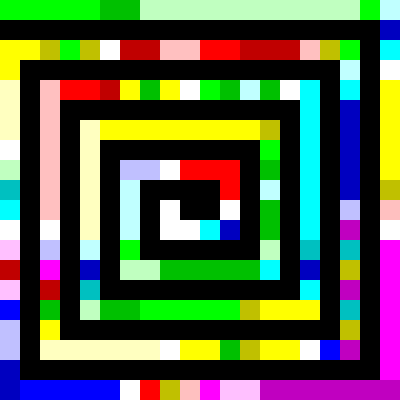

9 月 7 日から 9 月 8 日にかけて開催された [nkhrlab CTF 2019 Summer](https://n5b.moe) に、ひとりチーム st98 として参加しました。最終的に 36 点を獲得し、順位は得点 44 チーム中 9 位でした。

以下、解いた問題の write-up です。

## Misc
### Welcome (1)
> Welcome to nkhrlab CTF 2019 Summer. The answer for this challenge is here:
> 
> n5b2019summer{welcome}

問題文のフラグがそのまま通りました。

```
n5b2019summer{welcome}
```

### Frustrating (4)
> Wait.
> 
> 添付ファイル: frustrating

`frustrating` がどのようなファイルか確認しましょう。

```
$ file frustrating
frustrating: ASCII text, with very long lines, with CRLF line terminators

$ head -c 100 frustrating
data:image/gif;base64,R0lGODlhLAEyAPcAAAAAAAAAAAAAAAAAAAAAAAAAAAAAAAAAAAAAAAAAAAAAAAAAAAAAAAAAAAAAAA
```

Data URI Scheme で書かれた GIF ファイルのようです。`R0lG` 以降を Base64 としてデコードし、`f.gif` として保存します。ブラウザで開いてみると、どうやらこれはフラグを 1 文字ずつ、大変ゆっくりと表示するアニメーション GIF であることがわかりました。

stegsolve.jar を使って各フレームを確認するとフラグが得られました。

```
n5b2019summer{Are_you_patient?}
```

### Sakura (4)
> Listen.
> 
> 添付ファイル: sakura.mid

MIDI ファイルが与えられました。適当な MIDI のビュワーで開いてみると、以下のようにノートでフラグが表現されていました。


```
n5b2019summer{someiyoshino}
```

### Nasty Regexp (9)
> Find a string that matches this regular expression.
> 
> ^n5b2019summer\{(?=...{11}[hurt])(?=..{14}[bill])(?=..{16}[player])(?=..{7}[deed])(?=.{10}.[luck])(?=.(..).\1)(?=.{13}[while])(?=.{7}[inch])(?=[tomb])(?=.{15}[butcher])(?=..(.).{8}\2)(?=.{17}[robust])(?=.{11}[kidney])(?=.{12}[inference])(?=.{6}(.)..\3\3...\3.\3.\3)(?=...[yarn])(?=.{3}[yield])(?=.{7}[knot])(?=.{8}[and])(?=.{12}[aim])[a-z]{19}\}$

与えられた正規表現にマッチする文字列を探せばよいようです。Z3Py に丸投げしましょう。

```python
from z3 import *
solver = Solver()

flag = [Int('flag_%d' % i) for i in range(19)]
for c in flag:
  solver.add(ord('a') <= c, c <= ord('z'))

def f(s, solver, t):
  solver.add(Or(*[t == ord(c) for c in s]))

f('hurt', solver, flag[13])
f('bill', solver, flag[15])
f('player', solver, flag[17])
f('deed', solver, flag[8])
f('luck', solver, flag[11])
f('while', solver, flag[13])
f('inch', solver, flag[7])
f('tomb', solver, flag[0])
f('butcher', solver, flag[15])
f('robust', solver, flag[17])
f('kidney', solver, flag[11])
f('inference', solver, flag[12])
f('yarn', solver, flag[3])
f('yield', solver, flag[3])
f('knot', solver, flag[7])
f('and', solver, flag[8])
f('aim', solver, flag[12])

solver.add(flag[1] == flag[4], flag[2] == flag[5])
solver.add(flag[2] == flag[11])
solver.add(flag[6] == flag[9], flag[6] == flag[10], flag[6] == flag[14], flag[6] == flag[16], flag[6] == flag[18])

r = solver.check()
m = solver.model()
res = ''
for c in flag:
  res += chr(m[c].as_long())

print(res)
```

```
$ python2 solve.py
bakyakandaakihabara
```

フラグが得られました。

```
n5b2019summer{bakyakandaakihabara}
```

### Spiral (9)
> What is this?
> 
> 添付ファイル: spiral.png

以下のようなカラフルな画像が与えられました。



どう見ても Piet のコードです。Piet の処理系である [npiet](https://www.bertnase.de/npiet/) で実行するとフラグが出力されました。

```
>npiet.exe 2019-09-14_spiral_piet.png
n5b2019summer{355/113}
```

```
n5b2019summer{355/113}
```

### Translation (9)
> y/.../.../ is cool.
> 
> 添付ファイル: translation.zip

`translation.zip` を展開すると、`translation.pl` という Perl スクリプトと `translation.txt` というテキストファイルが出てきました。

`translation.pl` を見てみましょう。

```perl
$flag = "n5b2019summer{******************************}";
$a = "ABCDEFGHIJKLMNOPQRSTUVWXYZabcdefghijklmnopqrstuvwxyz0123456789";
$b = "VOxbkTqczsedDBv8PoN0JGny4Q1tAr35XKC6Y7pHFMWLajfR2EmhiZgl9uSIUw";

for($i = 0; $i < 50; $i++)
{
  $r = rand 50;
  $b = substr($b, $r) . substr($b, 0, $r);
}


eval "\$flag =~ y/$a/$b/";
print "$flag\n";
```

シャッフルしたテーブルを使って文字を置換したフラグを出力するスクリプトのようです。

`translation.txt` を見てみましょう。

```
$ perl translation.pl
Yg4hEmSML66tF{e7W W7 4t Q7YALMt1 j5W3 DOIvz.}
$ 
```

`translation.pl` を使ってフラグを変換した結果のようです。どうにかして元に戻せないでしょうか。

変換テーブルがどのようにシャッフルされているか確認します。`$a` と `$b` を入れ替えた上で `eval` の前に `print "$b\n";` を挿入して実行してみましょう。

```
$ perl translation.pl
defghijklmnopqrstuvwxyz0123456789ABCDEFGHIJKLMNOPQRSTUVWXYZabc
z8gPw3XmYRRn6{******************************}

$ perl translation.pl
3456789ABCDEFGHIJKLMNOPQRSTUVWXYZabcdefghijklmnopqrstuvwxyz012
PY6pMTxCyrrDW{******************************}

$ perl translation.pl
uvwxyz0123456789ABCDEFGHIJKLMNOPQRSTUVWXYZabcdefghijklmnopqrst
GPxgDKo3pii4N{******************************}
```

文字列をローテーションしているだけのようです。

総当たりで `Yg4hEmSML66tF{e7W W7 4t Q7YALMt1 j5W3 DOIvz.}` が `n5b2019summer` から始まるような文字列に変換されるテーブルを探しましょう。

```perl
$flag = "Yg4hEmSML66tF{e7W W7 4t Q7YALMt1 j5W3 DOIvz.}";
$a = "ABCDEFGHIJKLMNOPQRSTUVWXYZabcdefghijklmnopqrstuvwxyz0123456789";
$b = "VOxbkTqczsedDBv8PoN0JGny4Q1tAr35XKC6Y7pHFMWLajfR2EmhiZgl9uSIUw";

for($i = 0; $i < 62; $i++)
{
  $b = substr($b, 1) . substr($b, 0, 1);
  $f = $flag;
  eval "\$f =~ y/$b/$a/";
  print "$f\n";
}
```

```
$ perl solve.pl | grep n5b2019summer
n5b2019summer{Not to be confused with PEARL.}
```

フラグが得られました。

```
n5b2019summer{Not to be confused with PEARL.}
```