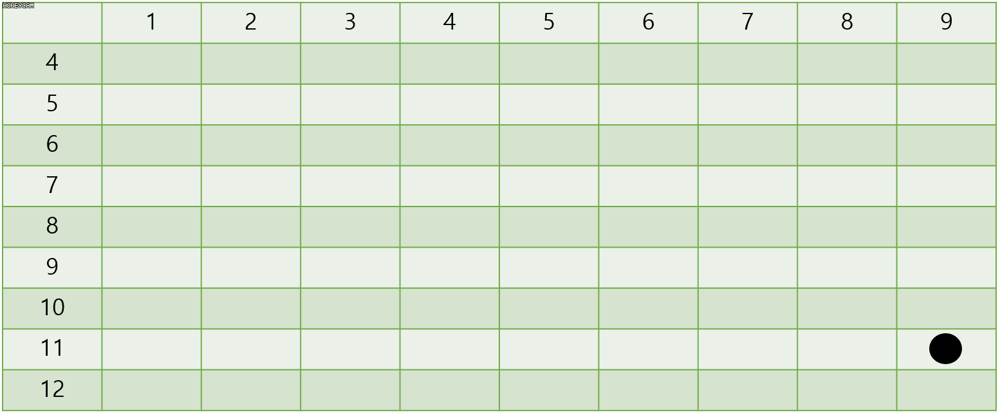
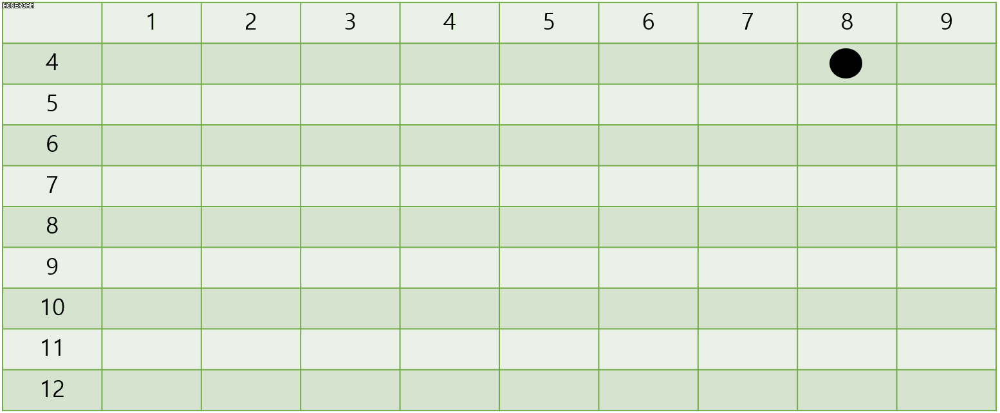

11 月 2 日から 11 月 3 日にかけて開催された [Newbie CTF](https://nctf.vulnerable.kr/) に、チーム zer0pts として参加しました。最終的にチームで 15849 点を獲得し、順位は得点 565 チーム中 1 位でした。うち、私は 7 問を解いて 5388 点を入れました。

以下、私が解いた問題の write-up です。

## Webhacking
### Normal_Host (572)
> This is Just a Normal Host! Can you hack?
> 
> https://internal.iwinv.net/
> 
> Author: Y311J(신재욱)

与えられた URL にアクセスすると次のような HTML が返ってきました。

```html
︙
  <!-- Masthead -->
  <header class="masthead text-white text-center">
    <div class="overlay"></div>
    <div class="container">
      <div class="row">
        <div class="col-xl-9 mx-auto">
          <h1 class="mb-5">This is just normal-host!</h1>
          <h4 class="mb-5">You can get flag in "normalflag.iwinv.net"</h4>
          <p>This already includes http://, so just enter the domain.</p>
          <br><br>
          <h4>http://</h4>
        </div>
        <div class="col-md-10 col-lg-8 col-xl-7 mx-auto">
          <form action="connect.php" method="post">
            <div class="form-row">
              <div class="col-12 col-md-9 mb-2 mb-md-0">
                <input type="text" name="url" class="form-control form-control-lg" placeholder="normalflag.iwinv.net">
              </div>
              <div class="col-12 col-md-3">
                <button type="submit" class="btn btn-block btn-lg btn-primary">Connect!</button>
              </div>
            </div>
          </form>
        </div>
      </div>
    </div>
  </header>
︙
```

ドメイン名を入力するフォームのようです。

`normalflag.iwinv.net` にフラグがあるようですが、自分で直接アクセスしても `Do not connect flag page directly!! Use http://internal.iwinv.net!!` と言われてしまいます。先程のフォームに `normalflag.iwinv.net` を入力しても `That host is banned! You can not go to that page!` とアラートが表示されてしまいました。

RFC 3490 (IDNA) には 

> 1) Whenever dots are used as label separators, the following  
>    characters MUST be recognized as dots: U+002E (full stop), U+3002  
>    (ideographic full stop), U+FF0E (fullwidth full stop), U+FF61  
>    (halfwidth ideographic full stop).  
>
> [https://tools.ietf.org/html/rfc3490](https://tools.ietf.org/html/rfc3490)

という記述があります。これを参考に `.` (U+002E) を `。` (U+3002) に置き換えた `normalflag。iwinv。net` を入力してみたところ、フラグが表示されました。

```
KorNewbie{H0$7_$P1it_A774cK_U$3s_N0RM^liZ47ioN&##$%%!}
```

## Forensic
### Find The Plain (838)
> == KR == 알파팀의 내부고발자가 팀 내부 기밀자료를 ftp를 이용하여 외부로 내부의 정보를 유출시키는 패킷을 캡쳐하였다.
>
> 패킷을 분석하여 ftp접속에 사용된 비밀번호와 획득한 정보를 플래그로 제출하라!
>
> 플래그 형식 : KorNewbie{비밀번호_발견한정보}
>
> ※ 혹시라도 해시값이 있다면 그것은 md5이다.
>
> == EN == Alpha team's whistleblower captured a packet that leaked internal information to the outside using ftp internal confidential data.
> 
> Analyze the packet and flag the password and information obtained for the ftp connection!
>
> flag format : KorNewbie{password_yougetinformation}
> 
> ※ If there is a hash value, it will be md5.
> 
> Author : Ez1o
> 
> 添付ファイル: vithim.pcapng

Wireshark で `vithim.pcapng` を開き、`ftp` というフィルターを適用して問題文で言及されている FTP の通信を見てみましょう。

```
220 (vsFTPd 3.0.2)
OPTS UTF8 ON
200 Always in UTF8 mode.
USER ftpdir
331 Please specify the password.
PASS root
230 Login successful.
PORT 192,168,219,160,199,194
200 PORT command successful. Consider using PASV.
STOR badguy.txt
150 Ok to send data.
226 Transfer complete.
QUIT
221 Goodbye.
```

`root` というパスワードでログインしている様子が記録されています。これでフラグの前半部分がわかりました。

やりとりされている `badguy.txt` を手に入れるために `ftp-data` というフィルターを適用すると、以下のような内容のパケットが見つかりました。

```
7J2067O06rKMIOyVjO2MjO2MgOydmCDsi6Dsg4HsoJXrs7TripQg67CR7J2YIOyjvOyGjOyXkCDrqqjrkZAg64u07JWE64aT7JWY64SkLiDqsbTtiKzrpbwg67mM7KeA7JuM7YSwLi4gDQpodHRwczovL3Bhc3RlYmluLmNvbS83MHlER2lSUw==
```

これを Base64 デコードし、UTF-8 としてデコードすると以下のようなメッセージが出てきました。

> 이보게 알파팀의 신상정보는 밑의 주소에 모두 담아놓았네. 건투를 빌지워터..  
> https://pastebin.com/70yDGiRS

Pastebin のリンクにアクセスすると `k459iki6m5j094m2lmkhjmi9527l81ml` という謎の文字列が返ってきました。

ここで一度詰まり、この他に何か変なファイルがないか調べようと NetworkMiner に投げるために pcapng を pcap に変換しようとしてみたところ、このまま保存するとコメントが失われてしまう旨のメッセージが表示されました。どうやらどこかにコメントがあるようです。探してみると、FTP で `STOR badguy.txt` を送信しているパケットに `maybe encryped by caesar? (key value=7)` というコメントが設定されていました。

`k459iki6m5j094m2lmkhjmi9527l81ml` をシーザー暗号として左に 7 シフトすると `d459bdb6f5c094f2efdacfb9527e81fe` という文字列が出てきました。これが問題文で言及されている MD5 ハッシュでしょう。

`md5 crack` でググって出てくる Web サービスに片っ端から投げていくと、これは `The new boss is IronDragon` のハッシュ値であるとわかりました。

```
KorNewbie{root_IronDragon}
```

### Chat (980)
> 채팅을 통해 기밀정보가 오갔다. 해당 채팅을 사용한 사용자의 이메일을 찾으시오.
> 
> Confidential information came and went through chat. Find the email of the user who used the chat.
> 
> Flag: KorNewbie{email_address}
> 
> Author: 신재욱(Y311J)
> 
> 添付ファイル: VM.zip

`VM.zip` (なんと 8.8 GB!) を展開すると `NewbieCTF2019_KakaoTalk.vmdk` や `vmware.log` などの VMWare 関連のファイルが出てきました。

`NewbieCTF2019_KakaoTalk.vmdk` というファイル名からカカオトークのデータを探せばよいのではと推測し、FTK Imager で開いて `%APPDATA%` や `%LOCALAPPDATA%` を探していくと、`C:\Users\NewbieCTF2019\AppData\Local\Kakao\KakaoTalk\users\login_list.dat` に以下のようなデータが見つかりました。

```
login_list|renek@it-simple.net
```

```
KorNewbie{renek@it-simple.net}
```

## Reversing
### S_@_X (992)
> What is sgx?
> 
> Author: BabyREV
> 
> 添付ファイル: app, enclave.signed.so

添付ファイルがどのようなファイルか確認しましょう。

```
$ file *
app:                ELF 64-bit LSB shared object, x86-64, version 1 (SYSV), dynamically linked, interpreter /lib64/ld-linux-x86-64.so.2, BuildID[sha1]=fb10c93f82a3dc7a84fd2713311466b990a4b60a, for GNU/Linux 3.2.0, not stripped
enclave.signed.so:  ELF 64-bit LSB shared object, x86-64, version 1 (SYSV), dynamically linked, interpreter /lib64/ld-linux-x86-64.so.2, BuildID[sha1]=ec8ed4495507210dac46ccbdee2f5aa57741b4b2, not stripped
```

`app` は x86-64 の ELF、`enclave.signed.so` は x86-64 の共有ライブラリのようです。

`app` を Ghidra に投げると、次のような処理が見つかりました。

```c
void add(undefined8 uParm1,undefined4 *puParm2,undefined8 uParm3,undefined8 uParm4)

{
  int iVar1;
  undefined4 local_28 [2];
  undefined8 local_20;
  undefined8 local_18;
  
  local_20 = uParm3;
  local_18 = uParm4;
  iVar1 = sgx_ecall(uParm1,0,ocall_table_enclave,local_28);
  if ((iVar1 == 0) && (puParm2 != (undefined4 *)0x0)) {
    *puParm2 = local_28[0];
  }
  return;
}

int main(int argc,char **argv)

{
  char cVar1;
  int iVar2;
  uint uVar3;
  ulong uVar4;
  char *pcVar5;
  byte bVar6;
  int local_1c [3];
  
  bVar6 = 0;
  if (argc != 2) {
    printf("./app flag");
  }
  iVar2 = do_init();
  if (iVar2 == 0) {
    uVar4 = 0xffffffffffffffff;
    pcVar5 = argv[1];
    do {
      if (uVar4 == 0) break;
      uVar4 = uVar4 - 1;
      cVar1 = *pcVar5;
      pcVar5 = pcVar5 + (ulong)bVar6 * -2 + 1;
    } while (cVar1 != 0);
    uVar3 = add(enclave_id,local_1c,argv[1],~uVar4 - 1);
    if (uVar3 == 0) {
      if (local_1c[0] == 1) {
        printf("Succeed");
      }
      else {
        printf("fail");
      }
    }
    else {
      printf("SGX error code: 0x%x\n",(ulong)uVar3);
    }
    uVar3 = sgx_destroy_enclave(enclave_id);
    if (uVar3 != 0) {
      printf("SGX error code: 0x%x\n",(ulong)uVar3);
    }
  }
  else {
    iVar2 = 1;
  }
  return iVar2;
}
```

1 つ目のコマンドライン引数 (ユーザ入力) とその文字数を `enclave.signed.so` で定義されている `add` に投げ、その返り値によって成功か失敗か確認しているようです。

`enclave.signed.so` を `objdump` に投げると、`add` は次のような処理であることがわかりました。

```
0000000000001170 <add>:
    1170:	31 c0                	xor    eax,eax
    1172:	48 83 fe 24          	cmp    rsi,0x24
    1176:	0f 85 93 00 00 00    	jne    120f <add+0x9f>
    117c:	66 81 3f 4b 6f       	cmp    WORD PTR [rdi],0x6f4b
    1181:	0f 84 89 00 00 00    	je     1210 <add+0xa0>
    1187:	66 81 7f 03 4e 65    	cmp    WORD PTR [rdi+0x3],0x654e
    118d:	0f 84 9d 00 00 00    	je     1230 <add+0xc0>
    1193:	66 81 7f 06 62 69    	cmp    WORD PTR [rdi+0x6],0x6962
    1199:	0f 84 81 00 00 00    	je     1220 <add+0xb0>
    119f:	66 81 7f 09 7b 61    	cmp    WORD PTR [rdi+0x9],0x617b
    11a5:	0f 84 a5 00 00 00    	je     1250 <add+0xe0>
    11ab:	66 81 7f 0c 64 5f    	cmp    WORD PTR [rdi+0xc],0x5f64
    11b1:	0f 84 a9 00 00 00    	je     1260 <add+0xf0>
    11b7:	66 81 7f 0f 24 5f    	cmp    WORD PTR [rdi+0xf],0x5f24
    11bd:	0f 84 ad 00 00 00    	je     1270 <add+0x100>
    11c3:	66 81 7f 12 45 74    	cmp    WORD PTR [rdi+0x12],0x7445
    11c9:	74 75                	je     1240 <add+0xd0>
    11cb:	66 81 7f 15 45 72    	cmp    WORD PTR [rdi+0x15],0x7245
    11d1:	0f 84 a9 00 00 00    	je     1280 <add+0x110>
    11d7:	66 81 7f 18 74 68    	cmp    WORD PTR [rdi+0x18],0x6874
    11dd:	0f 84 a9 00 00 00    	je     128c <add+0x11c>
    11e3:	66 81 7f 1b 4e 5f    	cmp    WORD PTR [rdi+0x1b],0x5f4e
    11e9:	0f 84 a9 00 00 00    	je     1298 <add+0x128>
    11ef:	66 81 7f 1e 4e 74    	cmp    WORD PTR [rdi+0x1e],0x744e
    11f5:	0f 84 ac 00 00 00    	je     12a7 <add+0x137>
    11fb:	66 81 7f 21 6c 21    	cmp    WORD PTR [rdi+0x21],0x216c
    1201:	0f 84 af 00 00 00    	je     12b6 <add+0x146>
    1207:	b8 01 00 00 00       	mov    eax,0x1
    120c:	83 f0 01             	xor    eax,0x1
    120f:	c3                   	ret    
    1210:	80 7f 02 72          	cmp    BYTE PTR [rdi+0x2],0x72
    1214:	0f 85 6d ff ff ff    	jne    1187 <add+0x17>
    121a:	b8 01 00 00 00       	mov    eax,0x1
    121f:	c3                   	ret    
    1220:	80 7f 08 65          	cmp    BYTE PTR [rdi+0x8],0x65
    1224:	0f 85 75 ff ff ff    	jne    119f <add+0x2f>
    122a:	eb ee                	jmp    121a <add+0xaa>
    122c:	0f 1f 40 00          	nop    DWORD PTR [rax+0x0]
    1230:	80 7f 05 77          	cmp    BYTE PTR [rdi+0x5],0x77
    1234:	0f 85 59 ff ff ff    	jne    1193 <add+0x23>
    123a:	eb de                	jmp    121a <add+0xaa>
    123c:	0f 1f 40 00          	nop    DWORD PTR [rax+0x0]
    1240:	80 7f 14 74          	cmp    BYTE PTR [rdi+0x14],0x74
    1244:	0f 85 81 ff ff ff    	jne    11cb <add+0x5b>
    124a:	eb ce                	jmp    121a <add+0xaa>
    124c:	0f 1f 40 00          	nop    DWORD PTR [rax+0x0]
    1250:	80 7f 0b 4d          	cmp    BYTE PTR [rdi+0xb],0x4d
    1254:	0f 85 51 ff ff ff    	jne    11ab <add+0x3b>
    125a:	eb be                	jmp    121a <add+0xaa>
    125c:	0f 1f 40 00          	nop    DWORD PTR [rax+0x0]
    1260:	80 7f 0e 69          	cmp    BYTE PTR [rdi+0xe],0x69
    1264:	0f 85 4d ff ff ff    	jne    11b7 <add+0x47>
    126a:	eb ae                	jmp    121a <add+0xaa>
    126c:	0f 1f 40 00          	nop    DWORD PTR [rax+0x0]
    1270:	80 7f 11 62          	cmp    BYTE PTR [rdi+0x11],0x62
    1274:	0f 85 49 ff ff ff    	jne    11c3 <add+0x53>
    127a:	eb 9e                	jmp    121a <add+0xaa>
    127c:	0f 1f 40 00          	nop    DWORD PTR [rax+0x0]
    1280:	80 7f 17 5f          	cmp    BYTE PTR [rdi+0x17],0x5f
    1284:	0f 85 4d ff ff ff    	jne    11d7 <add+0x67>
    128a:	eb 8e                	jmp    121a <add+0xaa>
    128c:	80 7f 1a 61          	cmp    BYTE PTR [rdi+0x1a],0x61
    1290:	0f 85 4d ff ff ff    	jne    11e3 <add+0x73>
    1296:	eb 82                	jmp    121a <add+0xaa>
    1298:	80 7f 1d 69          	cmp    BYTE PTR [rdi+0x1d],0x69
    129c:	0f 85 4d ff ff ff    	jne    11ef <add+0x7f>
    12a2:	e9 73 ff ff ff       	jmp    121a <add+0xaa>
    12a7:	80 7f 20 65          	cmp    BYTE PTR [rdi+0x20],0x65
    12ab:	0f 85 4a ff ff ff    	jne    11fb <add+0x8b>
    12b1:	e9 64 ff ff ff       	jmp    121a <add+0xaa>
    12b6:	31 c0                	xor    eax,eax
    12b8:	80 7f 23 7d          	cmp    BYTE PTR [rdi+0x23],0x7d
    12bc:	0f 85 45 ff ff ff    	jne    1207 <add+0x97>
    12c2:	e9 45 ff ff ff       	jmp    120c <add+0x9c>
    12c7:	66 0f 1f 84 00 00 00 	nop    WORD PTR [rax+rax*1+0x0]
    12ce:	00 00 
```

ユーザ入力を 1 文字ずつまたは 2 文字ずつ即値と比較しています。Python で雑に即値を抜き出しましょう。

```python
import binascii
import re

s = """0000000000001170 <add>:
    1170:	31 c0                	xor    eax,eax
    1172:	48 83 fe 24          	cmp    rsi,0x24
︙
    12b8:	80 7f 23 7d          	cmp    BYTE PTR [rdi+0x23],0x7d
    12bc:	0f 85 45 ff ff ff    	jne    1207 <add+0x97>
    12c2:	e9 45 ff ff ff       	jmp    120c <add+0x9c>
    12c7:	66 0f 1f 84 00 00 00 	nop    WORD PTR [rax+rax*1+0x0]
    12ce:	00 00 """

def sort(x):
  m = re.findall(r'\+0x([0-9a-f]+)', x[0])
  if len(m) == 0:
    return 0
  return int(m[0], 16)

m = re.findall(r'\[(rdi(?:\+0x.+)?)\],0x([0-9a-f]+)', s)
m.sort(key=sort)
print(''.join(binascii.unhexlify(c[1]).decode()[::-1] for c in m))
```

```
$ python3 solve.py
KorNewbie{aMd_i$_bEttEr_thaN_iNtel!}
```

フラグが得られました。

```
KorNewbie{aMd_i$_bEttEr_thaN_iNtel!}
```

## Misc
### Catch Me (205)
> Haha you can't see the string
> 
> Author : Ez1o
> 
> 添付ファイル: Prob.gif

`Prob.gif` を開いてみると、以下のようなフレームが一瞬で流れていきました。





黒い円の位置を `x,y` のようにテキストとして表現し、以下のようなスクリプトで処理するとフラグが得られました。

```python
s = '''9,11
8,4
9,11
5,9
1,10
2,5
3,10
9,4
1,10
5,9
1,5
1,12
1,5'''
res = ''
for line in s.splitlines():
  a, b = line.split(',')
  res += chr(int(b + a))
print(res)
```

```
$ python3 solve.py
w0w_e4g1e_3y3
```

```
KorNewbie{w0w_e4g1e_3y3}
```

### BiMilCode (822)
> Good Luck  
> nc (接続情報)
> 
> Author : Ez1o

とりあえず問題サーバに接続してみましょう。

```
$ nc prob.vulnerable.kr 20034
==================================================
This is BiMilCode
I'll give you a chance to type 3 times.
Good Luck
# if you got it how to solve this problem type 0 .
==================================================
You can encode me? :  c8 51 7e a0 58 a3 b1 d3 
Input : aaaa
ab 6f 89 a3 
you have 2 chance left.
Input : bbbb
ac 70 8a a4 
you have 1 chance left.
Input : aaaaaaaa
ab 6f 89 a3 61 8d aa bc 
you have 0 chance left.
Think more about it.
```

なるほど? 私が問題を確認した時点で [ptr-yudai](https://twitter.com/ptrYudai) さんによって、エンコード方式は接続ごとに作られる特定の値を足しているだけということがわかっていました。

`You can encode me?` の後に表示される文字数分だけ `A` を入力し、返ってきたエンコード結果から `A` の文字コードを引くことでその接続での足される数値を特定し、これを利用して最初に表示された文字列をデコードするスクリプトを書きましょう。

```python
from pwn import *

u = lambda s: s.strip().replace(' ', '').decode('hex')

sock = remote('prob.vulnerable.kr', 20034)
sock.recvuntil('You can encode me? :  ')
a = u(sock.recvline())
sock.recvuntil('Input : ')
sock.sendline('A' * len(a))
b = u(sock.recvline())
key = [ord(c) - ord('A') for c in b]
ans = ''.join(chr(ord(c) - d) for c, d in zip(a, key))

sock.sendline('0')
sock.sendline(ans)
sock.interactive()
```

```
$ python2 solve.py 
︙
you have 2 chance left.
Input : Oh really? come on ! : You did it!
KorNewbie{Nace_I_believed_it}
︙
```

フラグが得られました。

```
KorNewbie{Nace_I_believed_it}
```

### Elecduino (979)
> 과제로 만들어놓은 아두이노 회로도가 잠시 자리를 비운 사이 누군가 망쳐놓았다! 회로도를 복구하고 결과값을 얻어내라. circuits의 My work 가 문제파일이다.
> 
> Problem URL : https://www.tinkercad.com/users/dNMUsC3jcEB-?category=circuits&sort=likes&view_mode=default
> 
> 결과값에 플래그 포멧은 존재하지 않는다.
> 
> While the homework Aduino circuit diagram is gone for a while, Someone ruined it! Restore the circuit diagram and get the result. problem file is My work
> 
> There is no flag format in the result
> 
> Good Luck !
> 
> Author : Ez1o

与えられた URL にアクセスすると、以下のような ino ファイルが得られました。

```
void setup()
{
  pinMode(13, OUTPUT);
}

void prob1(){
  digitalWrite(12, HIGH);
  delay(400); // Wait for 1000 millisecond(s)
  digitalWrite(12, LOW);
  delay(400); // Wait for 1000 millisecond(s)
}

︙

void prob19(){
  digitalWrite(10, HIGH);
  delay(400); // Wait for 1000 millisecond(s)
  digitalWrite(10, LOW);
  delay(400); // Wait for 1000 millisecond(s)
}


void one(){
  prob6();
  prob5();
  prob2();
  prob12();
  prob14();
  prob18();
  prob15();
  prob7();
  prob3();
}

︙

void eight(){
  prob6();
  prob1();
  prob7();
  prob2();
  prob16();
  prob18();
  prob13();
  prob2();
}

void loop()
{
  one();
  two();
  three();
  four();
  five();
  six();
  seven();
  eight();
  delay(100000);
}
```

`prob1` から `prob19` の `digitalWrite(12, …)` は `0`、`digitalWrite(10, …)` は `1` として 1 ビットを、`one` から `eight` は 8 ビットを表現していると推測して、これをデコードするスクリプトを書きましょう。

```python
import re

with open('my_works1.ino') as f:
  s = f.read()

m = {}
for i in range(1, 20):
  x = re.findall(r'void prob{}.+?\n  digitalWrite\((\d+)'.format(i), s)[0]
  m[i] = {'12': '0', '10': '1', '4': ''}[x]

res = ''
for func in ['one', 'two', 'three', 'four', 'five', 'six', 'seven', 'eight']:
  block = re.findall(r'void ' + func +  r'\(\)\{(.+?)\}', s, re.DOTALL)[0]
  res += chr(int(''.join(m[int(x)] for x in re.findall(r'\d+', block)), 2))

print(res)
```

```
$ python3 solve.py
cr34t1v3
```

フラグが得られました。

```
KorNewbie{cr34t1v3}
```