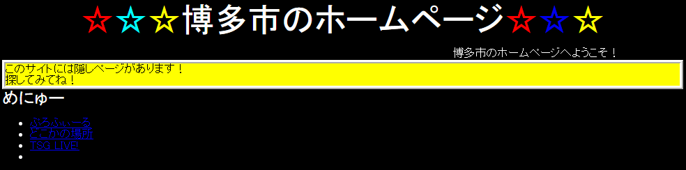
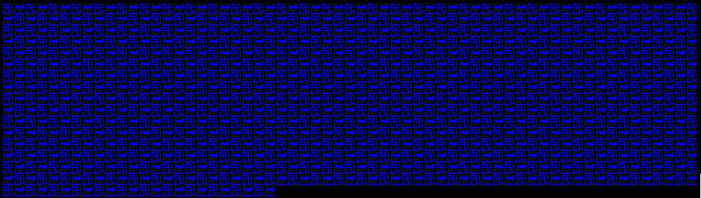

11 月 24 日に 75 分間開催された [TSG LIVE! CTF 4](https://live-ctf.tsg.ne.jp/) に (外部の人間でも参加できるということで) チーム zer0pts として参加しました。最終的にチームで 700 点を獲得し、順位は 1 位でした。うち、私は 3 問を解いて 400 点を入れました。

他のメンバーの write-up はこちら。

- [TSG LIVE! CTF 4のwriteup - CTFするぞ](https://ptr-yudai.hatenablog.com/entry/2019/11/24/154730)

以下、私が解いた問題の write-up です。

## [Web 100] Is the order a flag?
> うさぎ座ってないんですか?
> 
> (URL)

与えられた URL にアクセスすると、以下のようにいいねボタンと、これを押すことによって得られるポイントと交換できる賞品の一覧が表示されました。

```html
<!DOCTYPE html>
<html>

<head>
	<meta charset="utf-8">
	<meta name="viewport" content="width=device-width, initial-scale=1">
	<link rel="stylesheet" href="https://unpkg.com/bulma@0.7.4/css/bulma.min.css" />
	<style>
		body {
			padding: 3rem;
		}
		.content {
			text-align: center;
		}
		button {
			vertical-align: middle;
		}
	</style>
			</head>

<body>
<div class="content">
	<h1>現在の残高: 0ポイント</h1>
		<p>ただいまキャンペーン実施中! いいね!して1000ポイント分の残高をGET!</p>
	<form method="POST">
		<input type="hidden" name="mode" value="iine">
					<button type="submit" class="button">いいね!する</button>
			</form>
		<h2>商品一覧</h2>
	<h3>オプション：赤背景</h3>
	<p>背景が赤くなります。かに座のあなたにぴったり!</p>
	<form method="POST">
		<input type="hidden" name="mode" value="buy">
		<input type="hidden" name="item" value="background-red">
		<strong style="vertical-align: middle">100ポイント</strong>
					<button type="submit" class="button" disabled>購入する</button>
			<p><small class="has-text-danger">※残高が足りません。</small></p>
			</form>
	<h3>オプション：青背景</h3>
	<p>背景が青くなります。うお座のあなたにぴったり!</p>
	<form method="POST">
		<input type="hidden" name="mode" value="buy">
		<input type="hidden" name="item" value="background-blue">
		<strong style="vertical-align: middle">100ポイント</strong>
					<button type="submit" class="button" disabled>購入する</button>
			<p><small class="has-text-danger">※残高が足りません。</small></p>
			</form>
	<h3>オプション：黄背景</h3>
	<p>背景が黄色くなります。てんびん座のあなたにぴったり!</p>
	<form method="POST">
		<input type="hidden" name="mode" value="buy">
		<input type="hidden" name="item" value="background-yellow">
		<strong style="vertical-align: middle">100ポイント</strong>
					<button type="submit" class="button" disabled>購入する</button>
			<p><small class="has-text-danger">※残高が足りません。</small></p>
			</form>
	<h3>オプション：フラグ</h3>
	<p>フラグが表示されます。オリオン座のあなたにぴったり!</p>
	<form method="POST">
		<input type="hidden" name="mode" value="buy">
		<input type="hidden" name="item" value="flag">
		<strong style="vertical-align: middle">10000ポイント</strong>
					<button type="submit" class="button" disabled>購入する</button>
			<p><small class="has-text-danger">※残高が足りません。</small></p>
			</form>
</div>

</body>

</html>
```

いいねボタンを 1 回押すごとに 1000 ポイントが得られるようです。押してみると残高が 1000 ポイントに増えましたが、`※いいね!できるのは1日に1回までです。` と表示されていいねボタンが押せなくなってしまいました。フラグを得るには 10000 ポイントを得る必要があるようですが、素直に待っていたら CTF が終わってしまいます。

HTML を見てみると、いいねボタンは `<button type="submit" class="button" disabled="">いいね!する</button>` のように `disabled` 属性を使って無効化されていることがわかります。いいねボタンが押せなくなっているのは見かけだけなのではと考え、DevTools でこれを消してもう一度いいねボタンを押してみると残高が 2000 ポイントに増えました。

これを 10000 ポイントが貯まるまで続けるとフラグを購入することができました。

```
TSGCTF{kanikani_crab_life}
```

## [Reversing 100] Hidden Page
> 探しものはナンですか?
> 
> https://hakatashi.github.io/tsg-live-ctf-4-hidden/

与えられた URL にアクセスすると、以下のような (古めかしいデザインの) ページが表示されました。



HTML を見てみると、`<meta data-n-head="1" data-hid="description" name="description" content="My geometric Nuxt.js project">` などの記述から Nuxt.js 製の SPA であることが推測できます。

`どこかの場所` をクリックしてみると、以下のようなページが表示されました。



この中にフラグへのリンクがあるのでしょうか。DevTools のコンソールを開いて `new Set([...document.getElementsByTagName('a')].map(e => e.href))` を実行してみたところ、`/secret_s407QMYNAB7ub4gH` と `/secret_0Gk0DH7OBf4ghZDY` の 2 通りしかリンク先がないことが確認できました。いずれも `残念、はずれ!` と表示されるだけのページで、どうやら他のページを探す必要があるようです。

読み込まれている JavaScript ファイルで `secret_0Gk0DH7OBf4ghZDY` を検索してみると `/_nuxt/a635acd7047ee7cb582c.js` に以下のようなコードが含まれていることが確認できました。このファイルは圧縮されており、そのままでは読みにくいため整形して掲載します。

```javascript
[{
    path: "/ebKlQAJJM6FN1X7I",
    component: function() {
        return Object(v.j)(n.e(2).then(n.bind(null, 154)))
    },
    name: "ebKlQAJJM6FN1X7I"
}, {
    path: "/profile",
    component: function() {
        return Object(v.j)(n.e(4).then(n.bind(null, 155)))
    },
    name: "profile"
}, {
    path: "/rooms",
    component: function() {
        return Object(v.j)(n.e(5).then(n.bind(null, 156)))
    },
    name: "rooms"
}, {
    path: "/secret_0Gk0DH7OBf4ghZDY",
    component: function() {
        return Object(v.j)(n.e(6).then(n.bind(null, 157)))
    },
    name: "secret_0Gk0DH7OBf4ghZDY"
}, {
    path: "/secret_lC9yBxhT6TvuqKft",
    component: function() {
        return Object(v.j)(n.e(8).then(n.bind(null, 158)))
    },
    name: "secret_lC9yBxhT6TvuqKft"
}, {
    path: "/secret_myiFz9MBp8nykzuH",
    component: function() {
        return Object(v.j)(n.e(9).then(n.bind(null, 159)))
    },
    name: "secret_myiFz9MBp8nykzuH"
}, {
    path: "/secret_s407QMYNAB7ub4gH",
    component: function() {
        return Object(v.j)(n.e(10).then(n.bind(null, 160)))
    },
    name: "secret_s407QMYNAB7ub4gH"
}, {
    path: "/secret_TSnYMQslOkTS3Xt7",
    component: function() {
        return Object(v.j)(n.e(7).then(n.bind(null, 161)))
    },
    name: "secret_TSnYMQslOkTS3Xt7"
}, {
    path: "/",
    component: function() {
        return Object(v.j)(n.e(3).then(n.bind(null, 162)))
    },
    name: "index"
}]
```

ルーティングの情報のようです。`/ebKlQAJJM6FN1X7I` を開いてみるとフラグが表示されました。

```
TSGCTF{how_can_i_do_right+click_with_my_smartphone?}
```

## [Misc 200] Furuikeya
> 見たことがないものを探すのはむずかしい。
> 
> **注意点**  
> この問題はSlack上で動作します。招待リンクからワークスペースに参加することができます。 ソースコードは一部が公開されます。
> 
> 添付ファイル: index.js

`index.js` は以下のような内容でした。

```javascript
const {RTMClient, WebClient} = require('@slack/client');
const rtm = new RTMClient(process.env.SLACK_TOKEN);
const slack = new WebClient(process.env.SLACK_TOKEN);
const postFlag = require('./postFlag');

const pond = {
    'その辺で売ってる普通の斧': (channel) => {slack.chat.postMessage({channel, text:'普通の斧がありましたよ！'})},
    'ギラギラと輝く白銀色の斧': (channel) => {slack.chat.postMessage({channel, text:'銀の斧がありましたよ！'})},
    'ピカピカに光る黄金色の斧': (channel) => {slack.chat.postMessage({channel, text:'金の斧がありましたよ！'})},
    'f': (channel) => {postFlag(slack, {channel})},
}

rtm.on('message', async (message) => {
    if (!message.channel.startsWith('D')) {
        // not available in public channels
        return;
    }
    const match = message.text.match(/^(?<obj>.+)が池に落ちちゃった$/);
    if (match) {
        await slack.chat.postMessage({channel: message.channel, text:':statue_of_liberty:「あらあら，かわいそうに。わたしが探してあげましょう。」'});
        for (kind of ['その辺で売ってる普通の', 'ギラギラと輝く白銀色の', 'ピカピカに光る黄金色の']) {
            const text = [
                ':statue_of_liberty:「どのようなものかわからないけれど，試しに',
                kind,
                match.groups.obj,
                'を探してみますわ。どこかにあればいいのだけれど。」'
            ];
            const reply = await slack.chat.postMessage({channel: message.channel, text:text.join('')});

            const obj = reply.message.text.slice(text[0].length, -text[3].length);
            if (pond[obj]) {
                pond[obj](message.channel);
            } else {
                slack.chat.postMessage({channel: message.channel, text:':statue_of_liberty:「見つからなかったわ……ごめんなさい。」'});
            }
        }
    }
});

rtm.start();
```

`(A)が池に落ちちゃった` のような形式のメッセージを送ると、`pond` に `その辺で売ってる普通の(A)` や `ギラギラと輝く白銀色の(A)` のようなプロパティが存在している場合にはそれぞれに用意されたメッセージを送信し、それ以外の場合には見つからなかった旨のメッセージを送信する Slack 用の bot のようです。

フラグを得るには `pond[obj](message.channel)` が呼び出される箇所で `obj` に `'f'` が入っていればよさそうですが、`obj` には `kind` とユーザが入力した落とし物の名前を結合した文字列が入るはずなので厳しそうです。

一見脆弱性はなさそうですが、`pond` に `obj` が存在しているかの確認で怪しげな処理をしていることに注目します。

```javascript
            const text = [
                ':statue_of_liberty:「どのようなものかわからないけれど，試しに',
                kind,
                match.groups.obj,
                'を探してみますわ。どこかにあればいいのだけれど。」'
            ];
            const reply = await slack.chat.postMessage({channel: message.channel, text:text.join('')});

            const obj = reply.message.text.slice(text[0].length, -text[3].length);
            if (pond[obj]) {
                pond[obj](message.channel);
            }
```

なぜ `kind + match.groups.obj` ではなく、わざわざ自身が送信したメッセージから切り出してプロパティ名を作っているのでしょうか🤔

ここで `reply` を好きなものに操作できる可能性を考えました。もし凄まじい文字数のメッセージを送信すれば分割されて複数のメッセージとして処理されるのではないかと考え、`(A * 4000)が池に落ちちゃった` というメッセージを投げてみると、`🗽「どのようなものかわからないけれど，試しにピカピカに光る黄金色の(A*3949)` `(A*51)を探してみますわ。どこかにあればいいのだけれど。」` という 2 つのメッセージに分割されて投稿されていることが確認できました。

このとき `reply` には後者のメッセージが入っているはずなので、`obj` には `slice` によって `AAAAAAAAAAA`　(`を探してみますわ` の前の 11 文字分) が入っているはずです。

これを調整して `(A*3989)fが池に落ちちゃった` というメッセージを投げてみるとフラグが得られました。

```
TSGCTF{sometimes_problems_get_easier_when_you_discard_atama}
```