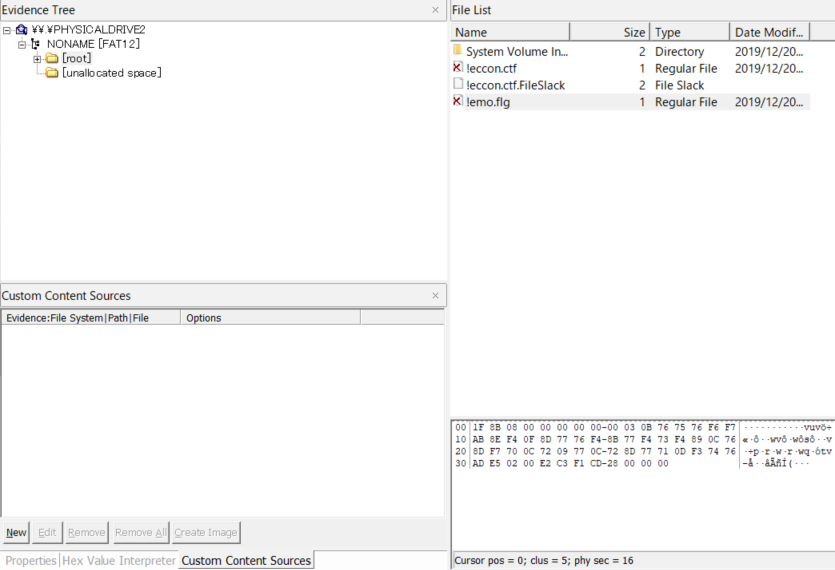

チーム Harekaze として [hikalium さん](https://twitter.com/hikalium)、[hiww さん](https://twitter.com/hiww)、[h_noson さん](https://twitter.com/h_noson)と 12 月 21 日から 22 日にかけて開催された [SECCON 2019 国際決勝大会](https://www.seccon.jp/2019/seccon2019/secconctf2019team.html) (リンク先激重注意) に参加しました。最終的にチームで 1273 点 (攻撃ポイント 1100 点 + 防御ポイント 173 点) を獲得し、順位は参加 14 チーム中 11 位でした。

他のメンバーの write-up はこちら。

- [SECCON CTF 2019 Final competition Q4 "box" write-up - /var/log/hikalium](https://hikalium.hatenablog.jp/entry/2019/12/22/232138)
- [SECCON 2019 国際決勝 Writeup - h_nosonの日記](http://h-noson.hatenablog.jp/entry/2019/12/23/155403)

この大会では King of the Hill 形式で壱、弐、参、四、伍の 5 問、Jeopardy 形式で 5+1 問が出題されました。このうち私が挑戦した問題について write-up を書いてみます。

## 伍(5)
> http://10.5.100.1/

防御ポイントのみの問題でした。

最初はアクセスすると `HELLO WORLD!` とだけ表示され、他のコンテンツはありませんでした。`/neko` のように適当なパスにアクセスすると返ってくるエラー画面の HTML でググって、HTTP レスポンスヘッダの情報と合わせて Apache 2.4.29 の裏で [Bottle](https://bottlepy.org/docs/dev/) で書かれたアプリが動いているものと推測できました。待ち望んだ Web 問だ! Apache か Bottle の 1-day の脆弱性を使うのかな? 最近話題の脆弱性があったりするのかな? と喜んでいましたが、CTF 開始後 20 分ほどでサーバに修正があり、以下のようなコンテンツを返すようになりました。

```
Please execute game-server.py.

$ python3 game-server.py 1_eater 0.0.0.0 9999

source: http://10.5.100.1/file/snakesrc.zip
flag: http://10.5.100.1/flag
```

`snakesrc.zip` は対戦型の[ヘビゲーム](https://ja.wikipedia.org/wiki/%E3%83%98%E3%83%93%E3%82%B2%E3%83%BC%E3%83%A0)のソースコードでした。各自で以下のような AI (サンプルとして与えられた `1_eater.py`) を書いてデプロイしろということでしょうか。

```python
#!/usr/bin/env python3

import math
import copy
import random

class AI:
	
	def __init__(self):
		self.DIRECTION = { "UP": 0, "DOWN": 1, "RIGHT": 2, "LEFT": 3 }
		self.route = []
	
	def search_apples(self, _map, me):
		r = []
		for y in range(len(_map)):
			for x in range(len(_map[0])):
				if _map[y][x] == "APPLE":
					d = math.sqrt((abs(me[0] - x) ** 2) + (abs(me[1] - y) ** 2))
					r.append( (y, x, d) )
		return r
	
	def check_route(self, a, b, _map, me, _route):
		if self.route != []:
			return
		if a[0] == me[0] and a[1] == me[1]:
			pass
		else:
			if _map[a[1]][a[0]] != "EMPTY" and _map[a[1]][a[0]] != "APPLE":
				return
		if a[0] == b[0] and a[1] == b[1]:
			self.route = copy.deepcopy(_route)
			return
		if a[0] < b[0]:
			_route.append("RIGHT")
			self.check_route([a[0]+1, a[1]], b, _map, me, _route)
			_route.pop()
		if a[0] > b[0]:
			_route.append("LEFT")
			self.check_route([a[0]-1, a[1]], b, _map, me, _route)
			_route.pop()
		if a[1] < b[1]:
			_route.append("DOWN")
			self.check_route([a[0], a[1]+1], b, _map, me, _route)
			_route.pop()
		if a[1] > b[1]:
			_route.append("UP")
			self.check_route([a[0], a[1]-1], b, _map, me, _route)
			_route.pop()
		return
	
	def one_step(self, _map, _x, _y):
		if _map[_y][_x+1] == "EMPTY" or _map[_y][_x+1] == "APPLE":
			return self.DIRECTION["RIGHT"]
		if _map[_y][_x-1] == "EMPTY" or _map[_y][_x-1] == "APPLE":
			return self.DIRECTION["LEFT"]
		if _map[_y+1][_x] == "EMPTY" or _map[_y+1][_x] == "APPLE":
			return self.DIRECTION["DOWN"]
		if _map[_y-1][_x] == "EMPTY" or _map[_y-1][_x] == "APPLE":
			return self.DIRECTION["UP"]
		return random.randint(0, 3)

	def move(self, _map, snakes):
		_x, _y = snakes[0][0] #head pos
		r = self.search_apples(_map, [_x, _y])
		for (apple_y, apple_x, apple_d) in sorted(r, key=lambda x:x[2]):
			self.route = []
			self.check_route([_x, _y], [apple_x, apple_y], _map, [_x, _y], [])
			if self.route != []:
				return self.DIRECTION[self.route[0]]
		return self.one_step(_map, _x, _y)

ai = AI()
def main(d):
	return ai.move(d["map"], d["snakes"])
```

`/flag` にアクセスすると以下のような内容が返ってきました。

```
{
    "score": {
        "10.5.1.4:9999": 1500, 
        "10.5.1.14:9999": 1500, 
        "10.5.1.12:9999": 1500, 
        "10.5.1.15:9999": 1500, 
        "10.5.1.10:9999": 1500, 
        "10.5.1.13:9999": 1500, 
        "10.5.1.3:9999": 1500, 
        "10.5.1.5:9999": 1500, 
        "10.5.1.2:9999": 1500, 
        "10.5.1.1:9999": 1500, 
        "10.5.1.16:9999": 1500, 
        "10.5.1.7:9999": 1500, 
        "10.5.1.9:9999": 1500, 
        "10.5.1.6:9999": 1500, 
        "10.5.1.11:9999": 1500, 
        "10.5.1.8:9999": 1500
    }, 
    "result": {
        "1st": [
            "10.5.1.4:9999", 
            "e31f2f1879e2376949a8213635a58221"
        ]
    }
}
```

その時点で最も得点の高いチームが防御ポイントを得られるようです。…が、AI をデプロイしようにも我々のサーバである `10.5.1.11` への接続方法が全くわかりません。SSH の 22 番ポートが使えることはわかりましたが、パスワードがわかりませんでした。

先程の修正から 2 時間ほど経ってまたサーバに修正があり、各チームごとに用意された AI のデプロイ用サーバの認証情報が与えられました。

とりあえず `1_eater.py` を眺めていたところ、周囲にりんごと何もないマスがあったときに同じ優先順位で扱っていることが気になり、以下のような修正を加えました。

```diff
ubuntu@snake-team-int-11:~$ diff -u 1_eater.py 2_test.py
--- 1_eater.py  2019-12-20 02:01:19.976000000 +0900
+++ 2_test.py   2019-12-21 15:34:01.378756860 +0900
@@ -49,14 +49,24 @@
                return
        def one_step(self, _map, _x, _y):
-               if _map[_y][_x+1] == "EMPTY" or _map[_y][_x+1] == "APPLE":
+               if _map[_y][_x+1] == "APPLE":
                        return self.DIRECTION["RIGHT"]
-               if _map[_y][_x-1] == "EMPTY" or _map[_y][_x-1] == "APPLE":
+               if _map[_y][_x-1] == "APPLE":
                        return self.DIRECTION["LEFT"]
-               if _map[_y+1][_x] == "EMPTY" or _map[_y+1][_x] == "APPLE":
+               if _map[_y+1][_x] == "APPLE":
                        return self.DIRECTION["DOWN"]
-               if _map[_y-1][_x] == "EMPTY" or _map[_y-1][_x] == "APPLE":
+               if _map[_y-1][_x] == "APPLE":
                        return self.DIRECTION["UP"]
+
+               if _map[_y][_x+1] == "EMPTY":
+                       return self.DIRECTION["RIGHT"]
+               if _map[_y][_x-1] == "EMPTY":
+                       return self.DIRECTION["LEFT"]
+               if _map[_y+1][_x] == "EMPTY":
+                       return self.DIRECTION["DOWN"]
+               if _map[_y-1][_x] == "EMPTY":
+                       return self.DIRECTION["UP"]
+
                return random.randint(0, 3)
        def move(self, _map, snakes):
```

これでしばらく防御ポイントを稼ぐことができましたが、こんな小手先の修正がいつまでも通用するわけがなく、1 時間と経たないうちに他のチームが防御ポイントを取り始めました。これ以降 Harekaze がサーバ伍の防御ポイントを取ることはありませんでした (すみません…)。

## 六(6) (Jeopardy)
### [Crypto] Factor the flag
> I hid the SECCON{} flag in a big prime number.
> 
> 1401111111111111111111111111111111111111111111111111111111111111111111111111111
> 1111111111111111111111111111111111111111111111111111111112220791111111111111111
> 1111111111111111111111111111122207911223089031988903088023088023088920012001200
> 2319889030879222080230880230890319887911122318879211992120012999912120013000013
> 0000131008920012001199121200120022089200130000119912119911121200120011992119912
> 1199121199121199121200130101000012001199121200120930009200130000119921199111121
> 2001200119921199121199121199121199121200130010208012002318879112120929999112120
> 9299991212103188892001200119912230890318889199121199121200130000131007911112119
> 9212092091991211992119912120013010111188791222079112129999121199121199121200130
> 0001200119911121200120012091992119921299992120013010099991112119911112129999121
> 1991211991212001300001200120012001209199223198889199212001209199213010099991112
> 1199212001299991212001300001300001300001200120012001299991111212091991212001209
> 1992130100999911121199122308903198890308802308802308892001200119922308903198879
> 2121031988903088011992130100999911121199111111111111111111111111111111111111111
> 2220791111111111111111111111111111111111111111111112220791111111111111111111111
> 1111111111111111111111111111111111111111111111111111111111111111111111111239593

`flag in a big prime number.` ということなので、とりあえずこの数値が素数かどうか [factordb.com](http://www.factordb.com/) に投げて確認してみると、どうやらこれは `13 * 97 * 1111111111...13(1261 ケタ)` の合成数であることがわかりました。1261 ケタの数値はほとんどが `1` と `9` で構成されています。`1261` は `13 * 97` ということなので、この数値を 97 ケタごとに改行させてみましょう。

```
1111111111111111111111111111111111111111111111111111111111111111111111111111111111111111111111111
1111111111111111111111111111111111111111991111111111111111111111111111111111111111111111111991111
1199911999991199911199911199911911191119111999991199911119911199911199911999991111111999911119111
1911191911111911191911191911191991191119111911111911191119911911191911191111191111111911191119111
1911111911111911111911111911191919191119111911111911191191911911191911191111911111111911191119111
1911111911111911111911111911191911991119111999911111191191911111191191911111911999911911191119111
1199911999911911111911111911191911191991111111191111911911911111911119111119111919191999911111991
1111191911111911111911111911191911191119111111191119111911911119111191911119111919191911111119111
1111191911111911111911111911191911191119111911191191111999991191111911191191111919191911111119111
1911191911111911191911191911191911191119111911191911111111911911111911191191111919191911111119111
1199911999991199911199911199911911191119111199911999991111911999991199911191111919191911111119111
1111111111111111111111111111111111111111991111111111111111111111111111111111111111111111111991111
1111111111111111111111111111111111111111111111111111111111111111111111111111111111111111111111213
```

おっ、なにかがうっすらと見えますね。`1` を半角スペースに置換してみましょう。

```
                                                                                                 
                                        99                                                 99    
  999  99999  999   999   999  9   9   9   99999  999    99   999   999  99999       9999    9   
 9   9 9     9   9 9   9 9   9 99  9   9   9     9   9   99  9   9 9   9     9       9   9   9   
 9     9     9     9     9   9 9 9 9   9   9     9   9  9 9  9   9 9   9    9        9   9   9   
 9     9     9     9     9   9 9  99   9   9999      9  9 9      9  9 9     9  9999  9   9   9   
  999  9999  9     9     9   9 9   9 99        9    9  9  9     9    9     9   9 9 9 9999     99 
     9 9     9     9     9   9 9   9   9       9   9   9  9    9    9 9    9   9 9 9 9       9   
     9 9     9     9     9   9 9   9   9   9   9  9    99999  9    9   9  9    9 9 9 9       9   
 9   9 9     9   9 9   9 9   9 9   9   9   9   9 9        9  9     9   9  9    9 9 9 9       9   
  999  99999  999   999   999  9   9   9    999  99999    9  99999  999   9    9 9 9 9       9   
                                        99                                                 99    
                                                                                              2 3
```

フラグが得られました。

```
SECCON{524287mP}
```

### [QR,Rev,Pwn] QR Decoder
> http://10.2.5.1:8182/

この問題には攻撃フラグが 2 つありました。

与えられた URL にアクセスすると、`qrdecoder` という x86_64 の ELF へのリンクと、QR コードをアップロードできるフォームが表示されました。

`qrdecoder` を Ghidra でデコンパイルすると、以下のような結果になりました。

```c
int main(int argc,char **argv)

{
  int iVar1;
  char *__file;
  FILE *__stream;
  char str [256];
  stat sStack200;
  int fd;
  FILE *file;
  
  __file = __xpg_basename(*argv);
  if (argc == 2) {
    __file = argv[1];
    iVar1 = stat(__file,&sStack200);
    if (iVar1 == 0) {
      sprintf(str,"zbarimg %s",__file);
      __stream = popen(str,"r");
      if (__stream == (FILE *)0x0) {
        perror(str);
        iVar1 = 1;
      }
      else {
        str[0] = 0;
        fread(str,1,sStack200.st_size & 0xffffffff,__stream);
        fclose(__stream);
        printf("The decoded string is: %s\n",str + 8);
        iVar1 = strcmp(str,"QR-Code:Hello, world!\n");
        if (iVar1 == 0) {
          fd = open("./flag1.html",0);
          if (fd < 0) {
            iVar1 = 1;
          }
          else {
            read(fd,str,0x100);
            close(fd);
            printf("%s",str);
            iVar1 = 0;
          }
        }
        else {
          iVar1 = 0;
        }
      }
    }
    else {
      perror(__file);
      iVar1 = 1;
    }
  }
  else {
    fprintf(stderr,"Usage: %s <filename>\n",__file);
    iVar1 = 1;
  }
  return iVar1;
}
```

`zbarimg` (QR コードなどを読み込んでくれるツール) にアップロードした画像を投げて、これの出力した結果が `QR-Code:Hello, world!` であれば 1 つ目のフラグを出力してくれるようです。`Hello, world!` という内容の QR コードを生成して投げるとフラグが得られました。

```
SECCON{8182 means decimal ASCII code of Q and R}
```

---

2 つ目のフラグについてはこの問題を Pwn すればよかったようですが、解けませんでした。OS コマンドインジェクションかと思いきや、コマンドライン引数として与えられるファイル名は `/tmp/php…` (`str` が使い回されていることから `A` のように適当に短い内容の QR コードを投げると確認できる) のように `index.php` の `$_FILES['qrimage']['tmp_name']` がそのまま渡されており操作できないことがわかります。また、スタックバッファオーバーフローについても h_noson さんによれば難しいとのことでした。想定解法が気になります。

### [Binary] Bad Mouse
> (Digispark の画像)
> 
> No claim no return. Firmware dump list is as follows:
> 
> [chall.hex](../files/chall.hex)

この問題文に加え、各チームに 1 つずつこの Intel HEX 形式で記述されたバイナリが書き込まれた Digispark が配布されました。私がこの問題に取り組み始めたのは 1 日目の夜で、問題サーバに接続する必要がない問題だろうと考え、ホテルに持ち帰って頑張っていました。

とりあえずこれを USB ポートに (本来は素直に挿し込むべきではありませんが、作問者だと推測していた [takesako さん](http://takesako.hatenablog.com/entry/2019/12/23/033935)を信じて) 挿し込んでみると、Digispark に載っている LED を点滅させながらマウスカーソルが動き始めました。ペイントソフトを起動してもう一度挿し直してみると `flag…` と書いている様子が確認できました…が、動きがどんどん遅くなっていきます。一昨年の国際大会で出題された [BadUSB](2018-02-27-seccon-2017-international-finals.html#binary-100-badusb) のマウス版でしょうか。

もう一度挿し直して観察していると、明滅の切り替わる間隔がほぼなし → 100ms → 500ms → 1000ms と変わっていることに気づきました。

では [Ghidra](https://ghidra-sre.org/) を使って静的解析を頑張っていきましょう。`chall.hex` を `AVR8 for an Atmega 256` という Language でインポートしておきます。

どこから手をつけてよいかわからず関数を片っ端から眺めていると、以下のような怪しい関数が見つかりました。

```c
void FUN_code_0004b2(uint uParm1,undefined2 uParm2,undefined2 uParm3,undefined2 uParm4,
                    undefined2 uParm5,undefined2 uParm6)

{
  byte bVar1;
  byte bVar2;
  byte bVar3;
  char cVar4;
  undefined2 uVar5;
  undefined2 uVar6;
  undefined2 uVar7;
  undefined2 uVar8;
  undefined2 uVar9;
  undefined2 uVar10;
  
  cVar4 = read_volatile_1(DAT_mem_0067);
  write_volatile_1(DAT_mem_0067,cVar4 + 1U);
  uParm1 = uParm1 & 0xff00 | (uint)(byte)(cVar4 + 1U) & 0xff01;
  FUN_code_00063f();
  uVar10 = uParm3;
  uVar9 = uParm4;
  uVar8 = uParm5;
  uVar7 = uParm6;
  uVar6 = R7R6;
  uVar5 = R5R4;
  bVar1 = read_volatile_1(PRR1);
  bVar2 = read_volatile_1(OSCCAL);
  if ((byte)(R1 + (bVar1 < 0xd)) <= bVar2) {
    Z = DAT_code_00000f & 0xff;
    if ((char)Z == '=') {
      if (bVar2 < (byte)(R1 + (bVar1 < 100))) {
        uParm2 = 100;
      }
      else {
        uParm2 = 500;
        if ((byte)(R1 + (bVar1 < 0x96)) <= bVar2) {
          uParm2 = 1000;
          if ((byte)(R1 + (bVar1 < 200)) <= bVar2) {
            uParm2 = 5000;
            if ((byte)(R1 + (bVar1 < 0xfa)) <= bVar2) {
              uParm2 = 10000;
              bVar1 = (bVar1 < 0x2c) + 1;
              if (bVar1 <= (byte)(bVar2 - bVar1)) {
                uParm2 = 20000;
              }
            }
          }
        }
      }
      goto LAB_code_00041a;
    }
  }
  uParm2 = 10;
LAB_code_00041a:
  uParm1 = 0;
  uParm4 = uParm2;
  uParm3 = 0;
  W = FUN_code_0005e0();
  uParm6 = uParm1;
  uParm5 = W;
  while( true ) {
    if ((char)(R15R14._1_1_ +
              (R1 < (byte)((char)R15R14 + (R1 < (byte)(R13R12._1_1_ + (R1 < (byte)R13R12)))))) <=
        (char)R1) break;
    W = FUN_code_0005e0();
    R5R4 = uParm1;
    R7R6 = W;
    R5R4._0_1_ = (byte)uParm1;
    R13R12._0_1_ = (byte)R13R12 - (byte)R5R4;
    R5R4._1_1_ = (char)(uParm1 >> 8);
    bVar2 = R5R4._1_1_ + ((byte)R13R12 < (byte)R5R4);
    bVar1 = (char)((uint)uParm4 >> 8) - bVar2;
    R7R6._0_1_ = (char)W;
    bVar3 = (char)R7R6 + (bVar1 < bVar2);
    bVar2 = (char)R15R14 - bVar3;
    R7R6._1_1_ = (char)((uint)W >> 8);
    uParm4 = CONCAT11(bVar1 + R9R8._1_1_ + CARRY1((byte)R13R12,(byte)R9R8),(byte)R13R12 +(byte)R9R8
                     );
    uParm3 = CONCAT11(((char)((uint)uParm3 >> 8) - (R7R6._1_1_ + (bVar2 < bVar3))) + R11R10._1_1_+
                      CARRY1(bVar2,(byte)R11R10),bVar2 + (byte)R11R10 + CARRY1(bVar1,R9R8._1_1_));
    W = FUN_code_0003c0();
    uParm5 = R7R6;
    uParm6 = R5R4;
  }
  R5R4 = uVar5;
  R7R6 = uVar6;
  uParm6 = uVar7;
  uParm5 = uVar8;
  uParm4 = uVar9;
  uParm3 = uVar10;
  return;
}
```

`100`、`500`、`1000` とまさに明滅の切り替わる間隔の数値が、なんらかのカウントが大きくなるごとに順番に `uParm2` へ代入されています。これを小さな数値に変えればフラグが書かれる速度が遅くなることはなくなるのではないでしょうか。

例えば、`uParm2 = 500;` に相当する命令列は以下のようになっています。

```
     code:0004d5 44  ef           ldi        R20 ,0xf4
     code:0004d6 51  e0           ldi        R21 ,0x1
     code:0004d7 60  e0           ldi        R22 ,0x0
     code:0004d8 70  e0           ldi        R23 ,0x0
```

冒頭 4 バイトを `uParm2 = 100;` に相当する `44 e6 50 e0` (`ldi R20,0x64; ldi R21, 0x0`) に書き換えます。これを繰り返した結果、以下のような diff が出来上がりました。

```diff
$ diff -u chall.hex modified.hex 
--- chall.hex   2019-12-21 20:33:06.589007891 +0900
+++ modified.hex        2019-12-21 20:33:09.701092417 +0900
@@ -152,11 +152,11 @@
 :1009700081E085D180916500909166008D30910570
 :1009800068F0EEE1F0E0E491ED3341F48436910556
 :1009900060F444E650E060E070E004C04AE050E0FB
-:1009A00060E070E088E690E045CF44EF51E060E021
-:1009B00070E086399105B0F348EE53E060E070E0F6
-:1009C000883C910578F348E853E160E070E08A3FA5
-:1009D000910540F340E157E260E070E08C329140D5
-:1009E00008F340E25EE460E070E0DCCFCF93DF9399
+:1009A00060E070E088E690E045CF44E650E060E021
+:1009B00070E086399105B0F344E650E060E070E0F6
+:1009C000883C910578F344E650E060E070E08A3FA5
+:1009D000910540F344E650E060E070E08C329140D5
+:1009E00008F344E650E060E070E0DCCFCF93DF9399
 :1009F0008091640066E0B4D2492F20916500309167
 :100A00006600B901680F711D87FD7A95FB01E05EF4
 :100A1000FF4FE49121EC3FEF261B370BE20FF32F42
```

変更を加えた後のバイナリを書き込もうとしましたが、環境構築で詰まってしまいました。Digispark を持っていればこれを書き込んで試してもらいたいとチームメンバーに助けを求めたところ、hikalium さんが持っているとのことで試してもらいました。1 時間ほどすると (本当に申し訳ないです、ありがとうございました!)、フラグの全体 (画像は [hikalium さんの write-up](https://hikalium.hatenablog.jp/entry/2019/12/22/232138) を参照ください) が得られたとのことでした。

```
SECCON{379eaX85bTa99c695b36855i4Ycfa5b5}
```

### [Hardware] mimura
> It's a hardware challenge.

この大変シンプルな問題文に加え、各チームに 1 つずつ STM32 の載ったボード (たぶん[これ](https://robotdyn.com/stm32f103-stm32-arm-mini-system-dev-board-stm-firmware.html)) 等が配布されました。私がこの問題に取り組み始めたのは 2 日目で、その時点で hikalium さんが既にファームウェアをダンプしており、後は頑張ってバイナリを読むだけという状態でした。

これがどのような挙動をするかについても hikalium さんによって確認されており、MicroUSB のケーブルで接続するとシリアル通信で以下のようにパスワードを聞かれることがわかっていました。

```
Unlock Pass:*******
Checking..
Invalid.
Unlock Pass:****
Checking..
Invalid.
This Device was frozen due to prevent to steal information by attacker.
```

何度もパスワードを間違えてしまうと `This Device was frozen due to prevent to steal information by attacker.` と怒られ、一度接続し直さないと再度パスワードを入力することができなくなってしまいます。

では objdump と Ghidra を使って静的解析を頑張っていきましょう。objdump ([全部入り](http://7shi.hateblo.jp/entry/2013/07/30/011348)) では `all-objdump firmware2.bin -D -b binary -m arm -M force-thumb > firmware2.dis` で逆アセンブルした結果を適当なファイルに出力しておきます。Ghidra ではバイナリをインポートする際に Language として `ARM Cortex / Thumb little endian` を選んでおきます。

どこから静的解析を始めるかの手がかりとして、先程シリアル通信で送られたメッセージを使いましょう。バイナリで `This Device was frozen …` を探すと 0x8492 にこの文字列が配置されていることがわかりました。`firmware2.dis` でこれを参照している命令がないか雑に探してみましたが見つかりません。それならばとさらにバイナリで `92 84` を探すと、0x4a8 に一箇所見つかりました。これを参照している命令がないか探してみると、以下のような命令列が見つかりました。

```
     42a:	491f      	ldr	r1, [pc, #124]	; (0x4a8)
     42c:	4817      	ldr	r0, [pc, #92]	; (0x48c)
     42e:	f001 ff80 	bl	0x2332
```

0x2332 はなにか出力周りの関数でしょうか。とりあえずこの命令列が含まれる関数を Ghidra でデコンパイルし、出力関数っぽい部分の引数が参照している文字列を注釈として加えると以下のようになりました。

```c
void FUN_00000378(void)

{
  int *piVar1;
  int *piVar2;
  int iVar3;
  int iVar4;
  int iVar5;
  uint uVar6;
  
  thunk_FUN_0000169c(DAT_00000488);
  iVar3 = thunk_FUN_00000cc4(DAT_0000048c);
  if (iVar3 != 0) {
    uVar6 = (uint)*DAT_00000490;
    if (*DAT_00000490 == 0) {
      iVar4 = FUN_000006c2(DAT_0000048c);
      piVar2 = DAT_0000049c;
      iVar3 = DAT_00000498;
      piVar1 = DAT_00000494;
      if (*DAT_00000494 < 1) {
        FUN_00002332(DAT_0000048c,DAT_000004a8); /* 0x4a8: "This Device was frozen due to prevent to steal information by attacker." */
        FUN_0000448c(0x20,uVar6);
        FUN_000044ec(10);
        FUN_0000448c(0x20,1);
        FUN_000044ec(0x28);
        FUN_0000448c(0x20,uVar6);
        FUN_000044ec(10);
        FUN_0000448c(0x20,1);
        FUN_000044ec(0x28);
        FUN_0000448c(0x20,uVar6);
        FUN_000044ec(10);
        FUN_0000448c(0x20,1);
        return;
      }
      if ((iVar4 == 0xd) || (iVar4 == 10)) {
        FUN_0000448c(0x20,0);
        FUN_000044ec(10);
        FUN_0000448c(0x20,1);
        iVar4 = DAT_00000498;
        *(undefined *)(iVar3 + *piVar2) = 0;
        iVar3 = FUN_000001a8(iVar4);
        if (iVar3 == 0) {
          FUN_00002332(DAT_0000048c,DAT_000004a0); /* 0x4a0: "Invalid." */
          FUN_000044ec(3000);
          iVar3 = *piVar1 + -1;
          *piVar1 = iVar3;
          if (0 < iVar3) {
            FUN_00002310(DAT_0000048c,DAT_000004a4); /* 0x4a4: "Unlock Pass:" */
          }
        }
        else {
          FUN_00000200();
        }
        *piVar2 = 0;
      }
      else {
        FUN_00000878(DAT_0000048c,0x2a);
        iVar5 = *piVar2 + 1;
        *(undefined *)(iVar3 + *piVar2) = (char)iVar4;
        *piVar2 = iVar5;
        *(undefined *)(iVar3 + iVar5) = 0;
      }
      if (0x1d < *piVar2) {
        *DAT_0000049c = 0x1e;
        return;
      }
    }
  }
  return;
}
```

`FUN_000001a8(iVar4)` の返り値が `0` であれば `Invalid.` と出力し、そうでない場合には `FUN_00000200` を呼び出しています。恐らく `FUN_000001a8` で入力されたパスワードが正しいかどうかチェックしているのでしょう。デコンパイルします。

```c
uint FUN_000001a8(char *pcParm1)

{
  FUN_0000231a(DAT_000001f8);
  FUN_00002332(DAT_000001f8,DAT_000001fc);
  if ((((pcParm1[8] == 'a') && (pcParm1[9] == 'm')) &&
      ((uint)(byte)pcParm1[6] == (uint)(byte)pcParm1[2])) &&
     ((((uint)(byte)pcParm1[10] == (uint)(byte)pcParm1[6] && ((uint)(byte)pcParm1[10] * 10 ==0x3f2)
       ) && (pcParm1[0xb] == '!')))) {
    return (uint)(*pcParm1 == 'O');
  }
  return 0;
}
```

それっぽい関数が出てきました。この条件に当てはまる文字列は `O?e???e?ame!` のような形式ですが、アンロック用のパスワードであるという状況から考えるに `Open Sesame!` でしょう。

このパスワードが正しいか実際にシリアル通信で入力して確認します。開けゴマ!

```
************
Checking..
Unlocking..Okay.
```

正しかったようです! …が、フラグは出力されず Windows のエクスプローラなどで USB メモリとしてアクセスしてみても空のままでした。

---

競技中はここで時間切れでした。パスワードを特定してから静的解析を続け、なんとかしてフラグを復号できないか試行していました。以下のように `1f 8b …` と gzip を書き込んでいることから `FUN_00000200` がフラグの復号処理と判断していました。

```c
void FUN_00000200(void)

{
  int iVar1;
  undefined4 uVar2;
  undefined4 uVar3;
  undefined4 *puVar4;
  undefined4 *puVar5;
  undefined4 *puVar6;
  undefined4 *puVar7;
  undefined4 local_3c [10];
  undefined4 uStack20;
  
  uVar3 = DAT_000002d8;
  uVar2 = DAT_000002d4;
  *DAT_000002d0 = 1;
  FUN_00002310(uVar3,uVar2);
  iVar1 = DAT_000002dc;
  *(undefined *)(DAT_000002dc + 0x2003) = 0;
  *(undefined *)(iVar1 + 0x2004) = 0;
  *(undefined *)(iVar1 + 0x2005) = 0;
  *(undefined *)(iVar1 + 0x2006) = 0;
  *(undefined *)(iVar1 + 0x2007) = 0;
  *(undefined *)(iVar1 + 0x2008) = 0;
  *(undefined *)(iVar1 + 0x200e) = 0xf6;
  *(undefined *)(iVar1 + 0x200b) = 0x76;
  *(undefined *)(iVar1 + 0x2009) = 3;
  *(undefined *)(iVar1 + 0x2001) = 0x8b;
  *(undefined *)(iVar1 + 0x2000) = 0x1f;
  *(undefined *)(iVar1 + 0x2002) = 8;
  *(undefined *)(iVar1 + 0x200a) = 0xb;
  *(undefined *)(iVar1 + 0x200c) = 0x75;
  *(undefined *)(iVar1 + 0x200d) = 0x76;
  *(undefined *)(iVar1 + 0x200f) = 0xf7;
  puVar6 = local_3c;
  puVar7 = DAT_000002e0 + 10;
  puVar4 = puVar6;
  puVar5 = DAT_000002e0;
  do {
    uVar2 = puVar5[1];
    *puVar4 = *puVar5;
    puVar4[1] = uVar2;
    puVar4 = puVar4 + 2;
    puVar5 = puVar5 + 2;
  } while (puVar5 != puVar7);
  *(undefined *)puVar4 = *(undefined *)puVar5;
  puVar4 = DAT_000002e4;
  do {
    uVar2 = *puVar6;
    uVar3 = puVar6[1];
    puVar6 = puVar6 + 2;
    *puVar4 = uVar2;
    puVar4[1] = uVar3;
    uVar3 = DAT_000002e8;
    uVar2 = DAT_000002d8;
    puVar4 = puVar4 + 2;
  } while (puVar6 != &uStack20);
  *(undefined *)puVar4 = *(undefined *)puVar6;
  FUN_00002332(uVar2,uVar3);
  return;
}
```

これを Python に移植して実行してみましたが、どこかで間違えているようで出力された gzip ファイルを展開してみても `SECCON{YOU_CAN_` とフラグのごく一部しか得られませんでした。

```python
# coding: utf-8
import struct

u16 = lambda x: struct.unpack('<H', x)[0]
u32 = lambda x: struct.unpack('<I', x)[0]

with open('firmware2.bin', 'rb') as f:
    s = list(f.read())

for i, c in enumerate(b'\x1f\x8b\x08\0\0\0\0\0\0\3\x0b\x76\x75\x76\xf6\xf7'):
    s[8 + 0x2000 + i] = c

local_3c = [None for _ in range(11)]

puVar6 = 0
puVar7 = u16(bytes(s[0x2e0:0x2e0+2])) + 10
puVar4 = 0
puVar5 = u16(bytes(s[0x2e0:0x2e0+2]))

while puVar5 != puVar7:
    uVar2 = s[puVar5 + 1]
    local_3c[puVar4] = s[puVar5]
    local_3c[puVar4 + 1] = uVar2
    puVar4 += 2
    puVar5 += 2

local_3c[puVar4] = s[puVar5]
puVar4 = u16(bytes(s[0x2e4:0x2e4+2]))

while puVar6 != 10:
    uVar2 = local_3c[puVar6]
    uVar3 = local_3c[puVar6 + 1]
    puVar6 += 2
    s[puVar4] = uVar2
    s[puVar4 + 1] = uVar3
    uVar3 = u16(bytes(s[0x2e8:0x2e8+2]))
    uVar2 = u16(bytes(s[0x2d8:0x2d8+2]))
    puVar4 += 2

s[puVar4] = local_3c[puVar6]

with open('result.gz', 'wb') as f:
    f.write(bytes(s[0x2008:puVar4+1]))
```

CTF の終了後に行われた懇親会で[作問者のみむらさん](https://twitter.com/mimura1133/status/1208708726980403202)にお話を伺ったところ、パスワードが特定できれば本当にあと少しで、パスワードの入力後 (フラグの復号処理後) に FTK Imager などで開けばよいだけとのことでした。実際にやってみると、確かに以下のように gzip ファイルが書き出されていることが確認できました。



これを展開するとフラグが得られました。

```
SECCON{YOU_CAN_ANALYSE_HARDWARE_DEVICE}
```

## いろいろ
- 国際決勝への参加は[おととし](2018-02-27-seccon-2017-international-finals.html)以来で、オンライン予選での上位チームから 2 チーム (?) が辞退されたために繰り上がりで Harekaze に回ってきたという形ではありますが、うれしく思います。
- Jeopardy で出題された Bad Mouse と mimura が面白かったです。ハードウェア解析はオンサイトでチーム数が限られているからこそ実機を配布し出題できる問題ですし、来年もこのようなオンサイトならではの問題があればいいなと思います。
- 「連続で間違ったフラグを提出すると一定時間提出ができません」「フラグのブルートフォースを行わないでください」とアナウンスしておきながら、5 問のクイズの答えをつなげるとフラグになるというような問題を出すのはどうかと思います。
> QRコードを投げるとデコードした結果を読んで出力するバイナリが渡されます。 webインターフェースの**URLにflag1.htmlとかflag2.htmlとか入れるとフラグが全部手に入りました**。 終盤に確認したら同じ手法では取られなくなっていました。
>   
> [SECCON CTF 2019 FinalのWriteup - CTFするぞ](https://ptr-yudai.hatenablog.com/entry/2019/12/23/001203)
- QR Decoder の 2 つ目のフラグについて、私もこれをどこかのタイミングで試していたのですがその時点で既に修正されていたようでした。作問ミスが起こるのは仕方がないとして、これではあまりにアンフェアですから、気づいたのであれば例えば修正した時点でフラグを変更してそれまでの提出を無効にするとか、あるいは昨年の国内決勝で出題された XSS HELL のように修正しないといった対応を取っていただきたかったと思います。
- オンライン予選の問題と毛色が違いすぎませんか。今年は Jeopardy ですら Web 問がありませんでした。Web 問をください。
- 競技日の前後で上野動物園に行きたかったのですが、前日の金曜日は授業日、翌日の月曜日は授業日かつ休園日ということで諦めました。