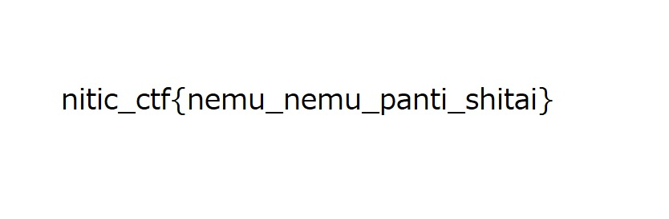

7 月 20 日に開催された [NITIC CTF](https://ctf.waku-waku-club.com/) に、チーム zer0pts として参加しました。最終的にチームで 2100 点を獲得し、順位は 100 点以上得点した 194 チーム中 1 位でした。うち、私は 5 問を解いて 800 点を入れました。

以下、私が解いた問題の write-up です。

## [Recon 100] Dangerous Twitter
> フレキ君はパスワードの管理がなってないようです。  
> どうやらフレキ君はあるサイトへのログインパスワードを漏らしてしまったみたい。  
> フレキ君のTwitterアカウントからそのパスワードを特定しましょう。  
> フラグはnitic_ctf{特定したパスワード}になります。  
> https://twitter.com/FPC_COMMUNITY

与えられた Twitter アカウントのメディア欄を眺めていると、以下のような写真が見つかりました。

<blockquote class="twitter-tweet"><p lang="ja" dir="ltr">デスク環境！ <a href="https://t.co/n51hOzO6re">pic.twitter.com/n51hOzO6re</a></p>&mdash; フレキシブル基板@課題消化中 (@FPC_COMMUNITY) <a href="https://twitter.com/FPC_COMMUNITY/status/1284684386361724928?ref_src=twsrc%5Etfw">July 19, 2020</a></blockquote> <script async src="https://platform.twitter.com/widgets.js" charset="utf-8"></script>

よく見ると右下に `Password abaE33F5` と書かれた紙があります。

```
nitic_ctf{abaE33F5}
```

## [Web 100] 8^2
> https://drive.google.com/file/d/1qW1NMxIwfe1OYUa5f1oLg2Cj8J07HfGK/view?usp=sharing

与えられた URL を開くと、`data:image/jpeg;base64,/9j/...` と書かれたテキストファイルが表示されました。データ URI スキームの URL でしょう。テキスト全体をコピーし、Web ブラウザの URL バーに貼り付けて開くと、以下のような画像が表示されました。



フラグが得られました。

```
nitic_ctf{nemu_nemu_panti_shitai}
```

## [PPC 200] prime_factorization
> 合成数Cが与えられる。素因数分解してa_0^b_0 * a_1^b_1 * … * a_n^b_nの形にして、nitic_ctf{a_0_b_0_a_1_b_1…a_n_b_n}のがフラグとなる。この時a_iは素数、b_iは1以上の整数、aは昇順に並んでいる。
> 
> 例えばC=48の時、48=2^4*3^1より、フラグはnitic_ctf{2_4_3_1}である。
> 
> https://www.dropbox.com/s/ry54l4dp15g17v8/prime_factorization_1.zip?dl=0

与えられた URL を開いて得られた `prime_factorization_1.zip` を展開すると、以下のような内容のテキストファイルが出てきました。

```
408410100000
```

これを素因数分解すればよいようです。[factordb.com](http://www.factordb.com/) という数値を与えると素因数分解してくれる便利な Web サイトに投げると、`408410100000 = (210)^5 = (2 · 3 · 5 · 7)^5` であるとわかりました。

```
nitic_ctf{2_5_3_5_5_5_7_5}
```

## [Misc 200] cha1n
> https://www.dropbox.com/s/4dnnxalaszkvrwj/cha1n.zip?dl=0

与えられた URL を開いて得られた `cha1n.zip` を展開すると、`c.sh` `h.sh` `a.sh` `1.sh` `n.sh` と、それぞれ Windows のバッチファイルに変換して拡張子が `bat` に変えられたファイルが出てきました。

`c.sh` は以下のような内容でした。

```sh
str="njtjxpxtfwx()s1Kpx()s1Kpx()s1Kpx()s1Kpx()s1Kp5x8mb83"
str=${str//()/h}
str=${str//p/_}
echo ${str//w/oo}
```

`njtjxpxtfwx()s1Kpx()s1Kpx()s1Kpx()s1Kpx()s1Kp5x8mb83` という文字列に置換を施して出力しています。`h.sh` は以下のような内容でした。

```sh
str=$(cat -)
str=${str//j/i}
str=${str//K/n}
echo ${str//oo/ww}
```

`str` という変数は決め打ちの文字列ではなく、標準入力から読み込まれているようです。`c.sh` が出力した内容をパイプでつなげということでしょうか。

`a.sh` `1.sh` `n.sh` も確認してみたところ、いずれも同じように `str` に置換を施して出力するという処理がされており、さらに `str` は標準入力から読み込まれていました。

問題名の `cha1n` という順番でパイプでつなげてみましょう。

```
$ ./c.sh | ./h.sh | ./a.sh | ./1.sh | ./n.sh
nitic_ctf{cha1n_cha1n_cha1n_cha1n_cha1n_5combo}
```

フラグが得られました。

```
nitic_ctf{cha1n_cha1n_cha1n_cha1n_cha1n_5combo}
```

## [Reversing 200] Fortran
> https://www.dropbox.com/s/jc1gqk0rvmv94d3/fortran.zip?dl=0

与えられた URL を開いて得られた `fortran.zip` を展開すると、`problem` という ELF ファイルと `problem.exe` という PE ファイルが出てきました。

とりあえず両方のファイルに含まれる文字列を `strings` で抽出し、フラグが含まれていないか確認しましょう。

```
$ strings * | grep nitic
replacenitictf{Fortran}
nitic_ctf{No_FORTRAN_Yes_Fortran}
```

フラグが得られました。

```
nitic_ctf{No_FORTRAN_Yes_Fortran}
```