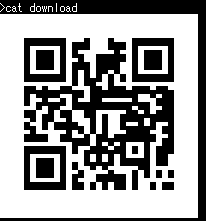

7 月 12 日から 7 月 14 日にかけて開催された [rgbCTF 2020](https://ctf.rgbsec.xyz/home) に、チーム zer0pts として参加しました。最終的にチームで 11602 点を獲得し、順位は 1 点以上得点した 1047 チーム中 20 位でした。うち、私は 23 問を解いて 7783 点を入れました。

以下、私が解いた問題の write-up です。

## [Cryptography 374] Shakespeare Play, Lost (and found!) (106 solves)
> Did you know RGBsec was founded in the 16th century? Our top notch team of RGBsec archaeologists has uncovered this ancient manuscript to prove it. There also were some numbers inscribed beside this manuscript, they might help you. Unfortunately, flag formats hadn't been invented yet, so you will need to enclose the flag in the flag format.
> 
> 添付ファイル: play, some_numbers.txt

`play` は以下のような内容でした。

```
A long lost play about trees, written exclusively by Shakespeare for RGBSec.

Romeo, apparently a rapidly changing multicolored tree.
Hamlet, a person who can't make up his mind.


                    Act I: Colorful Tree.

                    Scene I: Fast-changing Tree.

[Enter Hamlet and Romeo]

Hamlet: You are nothing! You are a red green blue red green blue tree! You are as lovely as the sum of a red green blue red tree and thyself! You are as lovely as the sum of a red green tree and thyself! You are as lovely as the sum of a red tree and thyself! Speak your mind!
Hamlet: You are nothing! You are a red green blue red green blue tree! You are as lovely as the sum of a red green blue red green tree and thyself! You are as lovely as the sum of a red green blue tree and thyself! You are as lovely as the sum of a red green tree and thyself! You are as lovely as the sum of a  tree and thyself! Speak your mind!
︙
```

こんな感じの文章が延々続いています。`Act I` や `Scene I` といった文字列や文章の構成から、[Shakespeare](http://shakespearelang.sourceforge.net/) という esolang であることがわかります。

CPAN で [`Lingua::Shakespeare`](https://metacpan.org/pod/distribution/Lingua-Shakespeare/lib/Lingua/Shakespeare.pod) というモジュールをインストールします。`play` の先頭行の前に `use Lingua::Shakespeare;` を挿入して適当なファイル名で保存し、実行してみましょう。

```
$ perl nyan.pl
VmxSQ2EyTXlVbGhWYTFacFRXMVNVMWxzVW5OTmJHeFpZa1ZPYUdKVldscFZWekExV1Zaa1JtRjZhejA9
```

これをデコードすると `Hint: Book cipher` とヒントが得られました。

`some_numbers.txt` は以下のような内容でした。

```
33, 20
71, 5
43, 142
60, 150
73, 312
78, 66
15, 22
12, 115
29, 18
51, 147
45, 68
34, 14
54, 126
15, 48
3, 4
60, 126
45, 77
13, 69
```

`33, 20` なら `play` の 33 行目の 20 文字目、`71, 5` なら 71 行目の 5 文字目…といったように Book cipher としてデコードしてみましょう。

```
>>> s = open('play').readlines()
>>> a = [x.strip().split(', ') for x in open('some_numbers.txt').readlines()]
>>> a = [(int(x), int(y)) for x, y in a]
>>> ''.join(s[i][j] for i, j in a)
'itsanrgbtreeeeeee!'
```

フラグが得られました。

```
rgbCTF{itsanrgbtreeeeeee!}
```

## [Cryptography 495] RubikCBC (22 solves)
> I implemented this really cool Rubiks CBC encryption algorithm and tested it on a document with my flag in it, but my dog ate my hard drive so I couldn't decrypt the file :(
> 
> Luckily I backed up the encrypted file. Can you recover my data?
> 
> 添付ファイル: rubiksCBC.zip

`rubiksCBC.zip` を展開すると `README.txt` と `enc_` というファイルが出てきました。`enc_` は RubikCBC という謎の暗号化方式でフラグを暗号化した結果で、`README.txt` はその暗号化方式の説明のようです。`README.txt` を見てみましょう。

```
scramble("F", "OOOOOOOOOYYYWWWGGGBBBYYYWWWGGGBBBYYYWWWGGGBBBRRRRRRRRR") => "OOOOOOYYYYYRWWWOGGBBBYYRWWWOGGBBBYYRWWWOGGBBBGGGRRRRRR"

==============================================================

IV = "ABCDEFGHIJKLMNOPQRSTUVWXYZ[\\]^_`abcdefghijklmnopqrstuv"
SCRAMBLE = D R2 F2 D B2 D2 R2 B2 D L2 D' R D B L2 B' L' R' B' F2 R2 D R2 B2 R2 D L2 D2 F2 R2 F' D' B2 D' B U B' L R' D'

==============================================================
```

`scramble` は、第一引数にルービックキューブの回転記号を、第二引数にルービックキューブの 54 個のマスを 1 次元に変換した文字列を与えると、第二引数で指定したルービックキューブを第一引数で指定したように回転させ、その結果を文字列として返す関数のようです。

どのように 54 個のマスを文字列に変換しているかわからず悩みましたが、なんとなく `OOOOOOOOOYYYWWWGGGBBBYYYWWWGGGBBBYYYWWWGGGBBBRRRRRRRRR` でググってみたところ [pglass/cube](https://github.com/pglass/cube) という Python 向けのルービックキューブ関連のライブラリがヒットしました。サンプルコードを参考に、文字列がどのようにして 54 個のマスに割り当てられるか確認してみましょう。

```python
>>> from rubik.cube import Cube
>>> c = Cube('0123456789ABCDEFGHIJKLMNOPQRSTUVWXYZabcdefghijklmnopqr')
>>> print(c)
    012
    345
    678
9AB CDE FGH IJK
LMN OPQ RST UVW
XYZ abc def ghi
    jkl
    mno
    pqr
```

なるほど。文字の位置とマスの位置が対応付けられているようです。

`SCRAMBLE` という変数はおそらくこのルービックキューブ暗号の鍵となる回転記号の列でしょう。54 文字の文字列を平文として上記のようにマッピングしたルービックキューブを、`SCRAMBLE` の順番・方法で回転させて、文字列に変換したものを暗号文としているのでしょう。

まずは `SCRAMBLE` と逆の操作をする回転記号の列を生成する方法を考えましょう。`SCRAMBLE` で使われている回転記号は、

- 回転させる面を意味するアルファベット
  - `U` (上の面)
  - `D` (下の面)
  - `F` (手前の面)
  - `B` (奥の面)
  - `R` (右の面)
  - `L` (左の面)
- 回転する回数を意味する記号
  - 記号なし (時計回りに 1 回)
  - `2` (時計回りに 2 回)
  - `'` (時計回りに 3 回)

の 2 つのパーツから構成されています。例えば `U` だと上の面を 1 回だけ時計回りに回転、`R'` だと右の面を 3 回時計回りに回転 (1 回だけ反時計回りに回転)、`F2` だと手前の面を 2 回時計回りに回転を意味します。これらの操作をした状態からもとに戻す逆の操作は、それぞれ `U'`、`R`、`F2` でしょう。

`SCRAMBLE` の各回転記号をそれぞれ逆の操作に変換した上で操作の順番を逆にすれば、暗号文を復号できる回転記号の列が作れそうです。

あとは `RubikCBC` という問題名の意味ですが、おそらく平文を 54 バイトごとに区切って上記の方法で暗号化し、[CBC モード](https://ja.wikipedia.org/wiki/%E6%9A%97%E5%8F%B7%E5%88%A9%E7%94%A8%E3%83%A2%E3%83%BC%E3%83%89#Cipher_Block_Chaining_(CBC)) で暗号化しているということでしょう。`IV` という変数は最初のブロックの暗号化に使われる初期化ベクトルでしょう。

あとは実装するだけです。

```python
# coding: utf-8
import re
from rubik.cube import Cube # https://github.com/pglass/cube

# "R2 F'" → "F R2"
def inverse_sequence(seq):
  return ' '.join(re.sub(r"([RLUDFB])([2']?)", lambda m: m.group(1) + {'2': '2', "'": '', '': "'"}[m.group(2)], seq).split(' ')[::-1])

# 'R' → 'R'
# 'R2' → 'R R'
# "R'" → 'R R R'
def normalize(seq):
  seq = re.sub(r'(.)2', r'\1 \1', seq)
  seq = re.sub(r"(.)'", r'\1 \1 \1', seq)
  return seq

def scramble(seq, cube):
  c = Cube(cube)
  c.sequence(normalize(seq))
  return str(c).replace(' ', '').replace('\n', '')

def xor(s, t):
  return bytes(c ^ d for c, d in zip(s, t))

iv = b"ABCDEFGHIJKLMNOPQRSTUVWXYZ[\\]^_`abcdefghijklmnopqrstuv"
table = "ABCDEFGHIJKLMNOPQRSTUVWXYZ[\\]^_`abcdefghijklmnopqrstuv" # 被りなし & 54文字なら何でもOK

seq = "D R2 F2 D B2 D2 R2 B2 D L2 D' R D B L2 B' L' R' B' F2 R2 D R2 B2 R2 D L2 D2 F2 R2 F' D' B2 D' B U B' L R' D'"
inv_seq = inverse_sequence(seq)

decrypted = b''
prev_block = iv
with open('enc_', 'rb') as f:
  block = f.read(54)
  while len(block) != 0:
    decrypted_block = bytes(block[table.index(c)] for c in scramble(inv_seq, table))
    decrypted_block = xor(decrypted_block, prev_block)
    decrypted += decrypted_block
    prev_block = block
    block = f.read(54)

with open('decrypted.pdf', 'wb') as f:
  f.write(decrypted)
```

出力された `decrypted.pdf` に含まれている QR コードを読み取るとフラグが得られました。

```
rgbCTF{!IP_over_Avian_Carriers_with_QoS!}
```

## [Forensics/OSINT 219] Alien Transmission 1 (158 solves)
> I was listening to my radio the other day and received this strange message... I think it came from an alien?
> 
> 添付ファイル: squeakymusic.wav

与えられた音声ファイルを再生すると、ﾋﾟﾛﾋﾟﾛﾋﾟﾛﾋﾟﾛﾋﾟｰﾋﾟｰﾋﾟｮﾛﾋﾟｮﾛﾋﾟｰﾋﾟｰﾋﾟｰﾋﾟｰ…というような高い音が流れてきました。

ダイヤルアップ接続の音ほどノイズ音がせず、ずっと高音が続いているあたりから SSTV だと推測できます。[`RX-SSTV`](http://rxsstv.cqsstv.com/) に聞かせると以下のような画像が得られました。


フラグが得られました。

```
rgbCTF{s10w_2c4n_1s_7h3_W4V3}
```

## [Forensics/OSINT 470] PI 1: Magic in the air (52 solves)
> We are investigating an individual we believe is connected to a group smuggling drugs into the country and selling them on social media. You have been posted on a stake out in the apartment above theirs and with the help of space-age eavesdropping technology have managed to extract some data from their computer. What is the phone number of the suspect's criminal contact?
> 
> flag format includes country code so it should be in the format: rgbCTF{+00000000000}
> 
> 添付ファイル: magic_in_the_air.7z

`magic_in_the_air.7z` を展開すると `data` というファイルが出てきました。バイナリエディタで開くと先頭の 7 バイトが `btsnoop` であることがわかり、Bluetooth のパケットのログであることが推測できます。[Wireshark](https://www.wireshark.org/) に投げるとパケットを見ることができました。

パケットを眺めていると、キャプチャが始まってから 100 秒を過ぎたあたりで、ATT プロトコルで以下のようなデータが送られていることが確認できました。

```
00000000000000
001c0000000000
00000000000000
00120000000000
00000000000000
00120000000000
00000000000000
002c0000000000
00000000000000
00100000000000
00000000000000
00040000000000
```

キーボードのスキャンコードっぽい雰囲気があります。`tshark -r data -Y 'btatt.handle == 0x2c && btatt.value' -T fields -e btatt.value > cap.txt` でこの部分だけを抽出して `cap.txt` に出力した上で、デコードしてみましょう。

```python
###
# https://github.com/1r0dm480/CTF-Wr1T3uPs/blob/master/b00t2root19/Forensics/key_me_baby/bkeymap20.py
mappings = {
︙
}
###
s = open('cap.txt').readlines()
res = ''

for line in s:
  line = line.strip()
  k = line[2:4]
  k2 = line[4:6]
  if k == '00' or k2 != '00':
    continue
  res += mappings.get(k.upper(), '??')[0]

print(res)
```

```
$ python decode.py
yoo man
sorry for the delay lol

trying to get tyiBBBthis keyboard workinn

yea its new. wireless mangB.

been moving product

speakin of you needed to contact my boy right/

ye

should be fine just say johnny h sent you

alright lemme get you the number

hold up i,m looking for it

its his burner, got it written down somewhere


yeah got it

(ここに電話番号が入る)

mind it is a swwedish number. he got it on holiday there few months back

yeah you can buy burners super easily there

alright g

yeah its  donny l

remember to tell him i sent you

peace

x
```

問題文で要求されている電話番号が得られました。`swedish number` と言っているのでスウェーデンの国コードである `+46` を頭につけるとフラグが得られました。

```
rgbCTF{+46(省略)}
```

## [Pwn/Rev 50] Too Slow (203 solves)
> I've made this flag decryptor! It's super secure, but it runs a little slow.
> 
> 添付ファイル: a.out

`file` コマンドで `a.out` がどのようなファイルか確認しましょう。

```
$ file a.out
a.out: ELF 64-bit LSB shared object, x86-64, version 1 (SYSV), dynamically linked, interpreter /lib64/ld-linux-x86-64.so.2, BuildID[sha1]=462dfe207acdfe1da2133cac6b69b45de5169ee2, for GNU/Linux 3.2.0, not stripped
```

x86_64 の ELF のようです。[Ghidra](https://ghidra-sre.org/) に投げてデコンパイルしてみましょう。

```c
int main(void)

{
  uint uVar1;
  
  puts("Flag Decryptor v1.0");
  puts("Generating key...");
  uVar1 = getKey();
  win((ulong)uVar1);
  return 0;
}
```

`getKey` という関数の返り値を `win` という関数に投げるとフラグが得られるようです。`getKey` を見てみましょう。

```c
ulong getKey(void)

{
  uint local_10;
  uint local_c;
  
  local_10 = 0;
  while (local_10 < 0x265d1d23) {
    local_c = local_10;
    while (local_c != 1) {
      if ((local_c & 1) == 0) {
        local_c = (int)local_c / 2;
      }
      else {
        local_c = local_c * 3 + 1;
      }
    }
    local_10 = local_10 + 1;
  }
  return (ulong)local_10;
}
```

重そうな処理をしていますが、結局返しているのは `local_10` というループ変数です。`getKey` の返り値は `0x265d1d23` でしょう。

`getKey` の返り値が渡されている `win` を見てみましょう。

```c
void win(uint param_1)

{
  long lVar1;
  long in_FS_OFFSET;
  uint i;
  char encrypted [40];
  
  lVar1 = *(long *)(in_FS_OFFSET + 0x28);
  encrypted._0_8_ = 0x12297e12426e6f53;
  encrypted._8_8_ = 0x79242e48796e7141;
  encrypted._16_8_ = 0x49334216426e2e4d;
  encrypted._24_8_ = 0x473e425717696a7c;
  encrypted._32_4_ = 0x42642a41;
  encrypted[36] = '\0';
  i = 0;
  while (i < 9) {
    *(uint *)(encrypted + (ulong)i * 4) = *(uint *)(encrypted + (ulong)i * 4) ^ param_1;
    i = i + 1;
  }
  // …
  if (lVar1 != *(long *)(in_FS_OFFSET + 0x28)) {
                    /* WARNING: Subroutine does not return */
    __stack_chk_fail();
  }
  return;
}
```

暗号化されたフラグを 4 バイトずつ引数と XOR しているようです。Python で再現しましょう。

```python
KEY = 0x265d1d23
encrypted = [0x426e6f53, 0x12297e12, 0x796e7141, 0x79242e48, 0x426e2e4d, 0x49334216, 0x17696a7c, 0x473e4257, 0x42642a41]
print 'rgbCTF{' + ''.join(hex(x ^ KEY)[2:].zfill(8).decode('hex')[::-1] for x in encrypted) + '}'
```

```
$ python2 solve.py
rgbCTF{pr3d1ct4bl3_k3y_n33d5_no_w41t_cab79d}
```

フラグが得られました。

## [Pwn/Rev 216] Advanced Reversing Mechanics 1 (159 solves)
> Very very advanced trust me
> 
> `71, 66, 61, 42, 53, 45, 7A, 40, 51, 4C, 5E, 30, 79, 5E, 31, 5E, 64, 59, 5E, 38, 61, 36, 65, 37, 63, 7C,`
> 
> 添付ファイル: arm_easy.o

問題文にあるバイト列が暗号化されたフラグでしょう。`rgbCTF{` というフラグフォーマットと比較してみましょう。

```
>>> s = '71, 66, 61, 42, 53, 45, 7A, 40, 51, 4C, 5E, 30, 79, 5E, 31, 5E, 64, 59, 5E, 38, 61, 36, 65, 37, 63, 7C,'.replace(',', '').replace(' ', '').decode('hex')
>>> [ord(c) - ord(d) for c, d in zip(s, 'rgbCTF{')]
[-1, -1, -1, -1, -1, -1, -1]
```

なるほど、各文字の文字コードが 1 引かれているようです。復号しましょう。

```
>>> ''.join(chr(ord(c) + 1) for c in s)
'rgbCTF{ARM_1z_2_eZ_9b7f8d}'
```

フラグが得られました。

```
rgbCTF{ARM_1z_2_eZ_9b7f8d}
```

## [Pwn/Rev 413] Object Oriented Programming (88 solves)
> There's this small up and coming language called java I want to tell you about
> 
> 添付ファイル: src.zip

`src.zip` を展開すると `Main.java` と `bv.java` `cd.java` `fg.java` といった 2 文字の名前のファイルが大量に出てきました。

`Main.java` は以下のような内容でした。

```java
//I heard Java 11 is good, let's use that
import java.io.*;
import java.math.*;
import java.util.*;
import java.lang.reflect.*;//think of this as #include <stdio.h>, basically every program needs it for IO

public class Main {
	//it's always good practice to declare constants for unclear magic values
	public static final int ZERO = BigInteger.valueOf(0).intValue();//BigInteger for precision
	public static final int ONE = BigInteger.valueOf(1).intValue();
	public static final int TWO = BigInteger.valueOf(2).intValue();
	public static final int THREE = BigInteger.valueOf(3).intValue();
	public static final int FOUR = BigInteger.valueOf(4).intValue();
	public static final int SEVEN = BigInteger.valueOf(7).intValue();
	public static final int SIXTEEN = BigInteger.valueOf(16).intValue();
	
	public static void main(String[] args) throws Exception { //running Java is dangerous, that's why everything throws an Exception
		InputStream standardInputStream = new StandardInputStreamInstantiator().getStandardInputStreamFactory().getStandardInputStream();
		//i'm going to take a shortcut here, behold the power of java libraries - so many lines saved!
		Scanner scanner = Scanner.class.getConstructor(standardInputStream.getClass().getSuperclass().getSuperclass()).newInstance(standardInputStream);
		
		PrintStream outputPrintStream = new OutputPrintStreamInstantiator().getOutputPrintStreamFactory().getOutputPrintStream();
		Method printLineMethod = getPrintLineMethodForOutputPrintStream(outputPrintStream);
		invokePrintLineMethodForOutputPrintStream(outputPrintStream, printLineMethod, "IO is online.");
		//IO Setup
		
		String userInput = getUserInputMethodFromScannerAndInvokeAndReturnOutput(scanner);
		if (userInput.length() != SIXTEEN)
			System.exit(0);
		
		
		if (executeCodeThatDoesSomethingThatYouProbablyNeedToFigureOut(userInput).equals(scanner.getClass().getPackageName().replace(".", ""))) {
			invokePrintLineMethodForOutputPrintStream(outputPrintStream, printLineMethod, "Nice. Flag: rgbCTF{" + userInput + "}");
		} else {
			invokePrintLineMethodForOutputPrintStream(outputPrintStream, printLineMethod, "Try again.");
		}
	}
	
	public static String executeCodeThatDoesSomethingThatYouProbablyNeedToFigureOut(String stringToExecuteAforementionedCodeOn) throws Exception {
		String encryptedString = reallyBasicQuoteUnquoteEncryptionFunctionThatWillOnlyTakeTimeToFigureOutIfYouKeepReadingTheseRidiculouslyLongMethodNames(stringToExecuteAforementionedCodeOn);
		String returnValueOfThisFunction = new String();
		String[] chunksOfEncryptedStringOfLengthFour = splitStringIntoChunksOfLength(encryptedString, FOUR);
		for (String chunkOfEncryptedStringOfLengthFour : chunksOfEncryptedStringOfLengthFour) {
			String[] chunksOfChunkOfEncryptedStringOfLengthFourOfLengthTwo = splitStringIntoChunksOfLength(chunkOfEncryptedStringOfLengthFour, TWO);
			String firstChunkOfChunkOfEncryptedStringOfLengthFourOfLengthTwo = chunksOfChunkOfEncryptedStringOfLengthFourOfLengthTwo[0];
			String secondChunkOfChunkOfEncryptedStringOfLengthFourOfLengthTwo = chunksOfChunkOfEncryptedStringOfLengthFourOfLengthTwo[1];
			Class<?> classAndExtraCharactersSoItsNotAKeyword = Class.forName(firstChunkOfChunkOfEncryptedStringOfLengthFourOfLengthTwo);
			Object object = classAndExtraCharactersSoItsNotAKeyword.getConstructors()[ZERO].newInstance();
			for (int loopArbitraryCounterIterator = 0; loopArbitraryCounterIterator < THREE; loopArbitraryCounterIterator++) {
				Method method = classAndExtraCharactersSoItsNotAKeyword.getMethod(secondChunkOfChunkOfEncryptedStringOfLengthFourOfLengthTwo);
				secondChunkOfChunkOfEncryptedStringOfLengthFourOfLengthTwo = (String)method.invoke(object);
			}
			returnValueOfThisFunction = new String(returnValueOfThisFunction + secondChunkOfChunkOfEncryptedStringOfLengthFourOfLengthTwo);
		}
		return returnValueOfThisFunction;
	}
	
	protected static char secureEncryptionKey; //it's protected, how you gonna crack it now?
	
	public static String reallyBasicQuoteUnquoteEncryptionFunctionThatWillOnlyTakeTimeToFigureOutIfYouKeepReadingTheseRidiculouslyLongMethodNames(String stringToQuoteUnquoteEncrypt) throws Exception {
		secureEncryptionKey = new EncryptionKeyInstantiator().getEncryptionKeyFactory().getEncryptionKey();
		Integer[] encryptedArrayToBeCalledByStringConstructor = new Integer[stringToQuoteUnquoteEncrypt.length()];
		for (int loopIndexIterator = ZERO; loopIndexIterator < stringToQuoteUnquoteEncrypt.length(); loopIndexIterator++) {
			encryptedArrayToBeCalledByStringConstructor[loopIndexIterator] = stringToQuoteUnquoteEncrypt.charAt(loopIndexIterator)^secureEncryptionKey;
		}
		
		return Arrays.toString(Arrays.asList(encryptedArrayToBeCalledByStringConstructor).stream().map((currentIntegerToBeMapped) -> (char)(currentIntegerToBeMapped.intValue())).toArray(Character[]::new)).replaceAll(", ", "").substring(1, stringToQuoteUnquoteEncrypt.length() + ONE);
	}
	
	public static String[] splitStringIntoChunksOfLength(String stringToSplit, int lengthOfChunk) {
		String[] returnValueOfThisFunction = new String[stringToSplit.length() / lengthOfChunk];
		for (int loopChunkNumberIterator = ZERO; loopChunkNumberIterator < stringToSplit.length() / lengthOfChunk; loopChunkNumberIterator++) {
			returnValueOfThisFunction[loopChunkNumberIterator] = stringToSplit.substring(loopChunkNumberIterator * lengthOfChunk, loopChunkNumberIterator * lengthOfChunk + lengthOfChunk);
		}
		return returnValueOfThisFunction;
	}
	
	private static class EncryptionKeyInstantiator {
		public EncryptionKeyFactory getEncryptionKeyFactory() {
			return new EncryptionKeyFactory();
		}
		
		private class EncryptionKeyFactory {
			public char getEncryptionKey() {
				return (char)(this.getClass().getCanonicalName().charAt(SEVEN) - this.getClass().getCanonicalName().charAt(ONE));
			}																																																																																		
		}
	}
	
	//IO Setup Setup
	
	public static String getUserInputMethodFromScannerAndInvokeAndReturnOutput(Scanner scanner) throws Exception {
		return (String)scanner.getClass().getMethod("nextLine").invoke(scanner);
	}
	
	public static void invokePrintLineMethodForOutputPrintStream(PrintStream outputPrintStream, Method printLineMethodToInvoke, String stringToBePrintedByPrintLineMethod) throws Exception {
		printLineMethodToInvoke.invoke(outputPrintStream, stringToBePrintedByPrintLineMethod);
	}
	
	public static Method getPrintLineMethodForOutputPrintStream(PrintStream outputPrintStream) throws Exception{
		return outputPrintStream.getClass().getMethod("println", String.class);
	}
	
	private static class OutputPrintStreamInstantiator {
		public OutputPrintStreamFactory getOutputPrintStreamFactory() throws Exception{
			return new OutputPrintStreamFactory();
		}
		
		private class OutputPrintStreamFactory {
			public PrintStream getOutputPrintStream() throws Exception {
				return (PrintStream)System.class.getDeclaredField("out").get(null);
			}
		}
	}
	
	private static class StandardInputStreamInstantiator {
		public StandardInputStreamFactory getStandardInputStreamFactory() throws Exception {
			return new StandardInputStreamFactory();
		}
		
		private class StandardInputStreamFactory {
			public InputStream getStandardInputStream() throws Exception {
				return (InputStream)System.class.getDeclaredField("in").get(null);
			}
		}
	}
}
```

識別子がいちいち長くて読むのがめんどくさそうです。とりあえずエントリーポイントである `Main.java` の `main` メソッドを確認しましょう。

```java
	public static void main(String[] args) throws Exception { //running Java is dangerous, that's why everything throws an Exception
		InputStream standardInputStream = new StandardInputStreamInstantiator().getStandardInputStreamFactory().getStandardInputStream();
		//i'm going to take a shortcut here, behold the power of java libraries - so many lines saved!
		Scanner scanner = Scanner.class.getConstructor(standardInputStream.getClass().getSuperclass().getSuperclass()).newInstance(standardInputStream);
		
		PrintStream outputPrintStream = new OutputPrintStreamInstantiator().getOutputPrintStreamFactory().getOutputPrintStream();
		Method printLineMethod = getPrintLineMethodForOutputPrintStream(outputPrintStream);
		invokePrintLineMethodForOutputPrintStream(outputPrintStream, printLineMethod, "IO is online.");
		//IO Setup
		
		String userInput = getUserInputMethodFromScannerAndInvokeAndReturnOutput(scanner);
		if (userInput.length() != SIXTEEN)
			System.exit(0);
		
		
		if (executeCodeThatDoesSomethingThatYouProbablyNeedToFigureOut(userInput).equals(scanner.getClass().getPackageName().replace(".", ""))) {
			invokePrintLineMethodForOutputPrintStream(outputPrintStream, printLineMethod, "Nice. Flag: rgbCTF{" + userInput + "}");
		} else {
			invokePrintLineMethodForOutputPrintStream(outputPrintStream, printLineMethod, "Try again.");
		}
	}
```

`String userInput = getUserInputMethodFromScannerAndInvokeAndReturnOutput(scanner);` で `userInput` にユーザが入力した文字列が入っていそうです。その後、`userInput.length() != SIXTEEN` で 16 文字であるか確認し、`executeCodeThatDoesSomethingThatYouProbablyNeedToFigureOut` というメソッドで `userInput` を変換した結果が `scanner.getClass().getPackageName().replace(".", "")` であれば `userInput` をフラグとして出力しています。

まず `scanner.getClass().getPackageName().replace(".", "")` がどのようなものであるか確認しましょう。`userInput.length()` の条件分岐の前に `System.out.println(scanner.getClass().getPackageName().replace(".", ""))` を挿入してコンパイルし、実行してみましょう。

```
$ javac *.java
$ java Main
IO is online.
javautil
```

なるほど、`executeCodeThatDoesSomethingThatYouProbablyNeedToFigureOut(userInput)` が `javautil` になればよいようです。

`executeCodeThatDoesSomethingThatYouProbablyNeedToFigureOut` がどのような動きをするか、`userInput.length()` の条件分岐の後に返り値を出力する処理を追加した上で、いろいろ試して確認してみましょう。

```
$ javac *.java
$ java Main
IO is online.
ABCDEFGH01234567
Exception in thread "main" java.lang.ClassNotFoundException: C@
        at java.base/jdk.internal.loader.BuiltinClassLoader.loadClass(BuiltinClassLoader.java:581)
        at java.base/jdk.internal.loader.ClassLoaders$AppClassLoader.loadClass(ClassLoaders.java:178)
        at java.base/java.lang.ClassLoader.loadClass(ClassLoader.java:522)
        at java.base/java.lang.Class.forName0(Native Method)
        at java.base/java.lang.Class.forName(Class.java:315)
        at Main.executeCodeThatDoesSomethingThatYouProbablyNeedToFigureOut(Main.java:49)
        at Main.main(Main.java:34)
$ java Main
IO is online.
abcdefgh01234567
Exception in thread "main" java.lang.ClassNotFoundException: c`
        at java.base/jdk.internal.loader.BuiltinClassLoader.loadClass(BuiltinClassLoader.java:581)
        at java.base/jdk.internal.loader.ClassLoaders$AppClassLoader.loadClass(ClassLoaders.java:178)
        at java.base/java.lang.ClassLoader.loadClass(ClassLoader.java:522)
        at java.base/java.lang.Class.forName0(Native Method)
        at java.base/java.lang.Class.forName(Class.java:315)
        at Main.executeCodeThatDoesSomethingThatYouProbablyNeedToFigureOut(Main.java:49)
        at Main.main(Main.java:34)
```

`AB` から始まる文字列を入力したときには `C@` というクラスを、`ab` から始まる文字列を入力したときには `` c` `` というクラスを参照して失敗しています。はじめの 2 文字と `\x02` を XOR したクラスを参照しているようです。存在するクラスのひとつである `gl` を参照させてみましょう。

```
$ java Main
IO is online.
enCDEFGH01234567
Exception in thread "main" java.lang.NoSuchMethodException: gl.AF()
        at java.base/java.lang.Class.getMethod(Class.java:2108)
        at Main.executeCodeThatDoesSomethingThatYouProbablyNeedToFigureOut(Main.java:52)
        at Main.main(Main.java:34)
```

今度は `gl` というクラスの `AF` というメソッドを呼び出そうとして失敗しています。`AF` はやはり `CD` という `en` に続く 2 文字と `\x02` とを XOR した文字列です。`gl` というクラスには `bq` `sx` `zv` など 15 個のメソッドがありますから、適当な `bq` というメソッドを選んで呼び出させてみましょう。

```
$ java Main
IO is online.
en`sEFGH01234567
Exception in thread "main" java.lang.NoSuchMethodException: gl.ig()
        at java.base/java.lang.Class.getMethod(Class.java:2108)
        at Main.executeCodeThatDoesSomethingThatYouProbablyNeedToFigureOut(Main.java:52)
        at Main.main(Main.java:34)
```

さらに `gl` というクラスの `ig` というメソッドを呼び出しています。`gl.java` を見ると、以下のように `ig` というのは `bq` メソッドの返り値であることがわかります。

```java
public String bq() { 
 return "ig";
}
```

`gl` クラスの持つメソッドの返り値をひとつひとつ見ていくと、`we` メソッドは `rb` という存在するメソッド名を返り値として返すことがわかります。これを呼び出させてみましょう。

```
$ java Main
IO is online.
enugEFGH01234567
Exception in thread "main" java.lang.NoSuchMethodException: gl.ja()
        at java.base/java.lang.Class.getMethod(Class.java:2108)
        at Main.executeCodeThatDoesSomethingThatYouProbablyNeedToFigureOut(Main.java:52)
        at Main.main(Main.java:34)
```

`ja` は `rb` メソッドの返り値です。存在するメソッドの名前を返すメソッドの名前を返すメソッドの名前を入力した場合にはどうでしょうか。`vg` メソッドは `we` を返しますから、条件に当てはまります。試してみましょう。

```
$ java Main
IO is online.
enteEFGH01234567
Exception in thread "main" java.lang.ClassNotFoundException: GD
        at java.base/jdk.internal.loader.BuiltinClassLoader.loadClass(BuiltinClassLoader.java:581)
        at java.base/jdk.internal.loader.ClassLoaders$AppClassLoader.loadClass(ClassLoaders.java:178)
        at java.base/java.lang.ClassLoader.loadClass(ClassLoader.java:522)
        at java.base/java.lang.Class.forName0(Native Method)
        at java.base/java.lang.Class.forName(Class.java:315)
        at Main.executeCodeThatDoesSomethingThatYouProbablyNeedToFigureOut(Main.java:49)
        at Main.main(Main.java:34)
$ java Main
IO is online.
enteenteenteente
jajajaja
Try again.
```

なるほど、クラス名とメソッド名をつなげて `\x02` と XOR した文字列を入力すると、そのメソッドが返す名前のメソッドを呼び出し、さらにその返り値の名前のメソッドを呼び出すという処理を 4 文字ずつ行っているようです。処理の結果が `javautil` になるような文字列を探すスクリプトを書きましょう。

```python
# coding: utf-8
import glob
import re

TARGET = 'javautil'

def xor(s, x):
  return bytes(c ^ x for c in s.encode()).decode()

table = {}

# (2 文字).java からクラス名と各メソッド名、その返り値を抜き出す
for file_name in glob.glob('src/??.java'):
  with open(file_name, 'r') as f:
    program = f.read()

  class_name = re.findall(r'class (.{2})', program)[0]
  table[class_name] = {}

  for m in re.findall(r'public String (.{2})\(\) \{.+?return "(.{2})"', program, re.MULTILINE | re.DOTALL):
    table[class_name][m[0]] = m[1]

# inv_table[クラス名][返り値] で指定した値を返すメソッドの名前を参照できるようにする
inv_table = {}
for class_name in table:
  inv_table[class_name] = {
    v: k for k, v in table[class_name].items()
  }

user_input = ''
for result in re.findall(r'(.{2})', TARGET):
  # 指定した 2 文字を返すメソッドを持つクラスを探す
  class_candidates = []
  for class_name, methods in inv_table.items():
    if result in methods.keys():
      class_candidates.append(class_name)

  # 候補の中からその 2 文字を返すメソッドの名前を返すメソッドの名前を返すメソッドを探す
  for class_name in class_candidates:
    method1 = inv_table[class_name][result]
    if method1 not in inv_table[class_name]:
      continue

    method2 = inv_table[class_name][method1]
    if method2 not in inv_table[class_name]:
      continue

    user_input += class_name + inv_table[class_name][method2]

print(xor(user_input, 2))
```

実行してみましょう。

```
$ python solve.py
enterprisecodeee
$ java Main
IO is online.
enterprisecodeee
javautil
Nice. Flag: rgbCTF{enterprisecodeee}
```

フラグが得られました。

```
rgbCTF{enterprisecodeee}
```

## [Pwn/Rev 461] Advanced Reversing Mechanics 2 (59 solves)
> More advanced than very very advanced
> 
> `0A, FB, F4, 88, DD, 9D, 7D, 5F, 9E, A3, C6, BA, F5, 95, 5D, 88, 3B, E1, 31, 50, C7, FA, F5, 81, 99, C9, 7C, 23, A1, 91, 87, B5, B1, 95, E4,`
> 
> 添付ファイル: arm_hard.o

問題文にあるバイト列が暗号化されたフラグでしょう。`arm_hard.o` がどのようなファイルか、`file` コマンドで確認してみましょう。

```
$ file arm_hard.o
arm_hard.o: ELF 32-bit LSB relocatable, ARM, EABI5 version 1 (SYSV), not stripped
```

ARM の ELF のようです。Ghidra に投げてデコンパイルしてみましょう。`main` から見ていきます。

```c
int main(int argc,char **argv)

{
  char *pcVar1;
  byte *pbVar2;
  byte abStack272 [256];
  
  pcVar1 = stpcpy((char *)abStack272,argv[1]);
  encryptFlag(abStack272);
  if (pcVar1 + -(int)abStack272 != (char *)0x0) {
    pbVar2 = abStack272;
    do {
      pbVar2 = pbVar2 + 1;
      printf("%02X, ",(uint)*pbVar2);
      pbVar2 = pbVar2;
    } while (pbVar2 != abStack272 + (int)(pcVar1 + -(int)abStack272));
  }
  putchar(10);
  return 0;
}
```

コマンドライン引数として与えた文字列を `encryptFlag` という関数で暗号化しているようです。見てみましょう。

```c
void encryptFlag(byte *param_1)

{
  byte *s;
  byte *pbVar1;
  uint uVar2;
  byte c;
  uint uVar3;
  uint uVar4;
  
  c = *param_1;
  s = param_1;
  if (c == 0) {
    return;
  }
  while( true ) {
    uVar3 = (uint)c;
    uVar2 = uVar3 - 10 & 0xff;
    uVar4 = uVar3;
    if ((c < 0x50) && (uVar4 = uVar2, 0x50 < uVar2)) {
      uVar4 = uVar3 + 0x46 & 0xff;
    }
    uVar4 = (uVar4 - 7 ^ 0x43) & 0xff;
    pbVar1 = s + 1;
    *s = (byte)(uVar4 << 6) | (byte)(uVar4 >> 2);
    c = *pbVar1;
    if (c == 0) break;
    uVar4 = (int)(pbVar1 + -(int)param_1) % 5;
    c = c << (-uVar4 & 7) | c >> (uVar4 & 0xff);
    if (uVar4 == 2) {
      c = c - 1;
    }
    *pbVar1 = c;
    c = *pbVar1;
    s = pbVar1;
  }
  return;
}
```

わあ、めんどくさそうな処理をしています。が、なんとか 1 文字ずつ暗号化しているっぽいことは読み取れます。この処理を移植して 1 文字ずつブルートフォースできないか試してみましょう。

```c
#include <stdio.h>
#include <string.h>

void encryptFlag(unsigned char *flag) {
        unsigned char c, *s, *t;
        unsigned int x, y, z;

        c = flag[0];
        s = flag;

        if (c == 0) {
                return;
        }

        while (1) {
                y = (unsigned int) c;
                x = y - 10 & 0xff;
                z = y;
                if ((c < 0x50) && (z = x, 0x50 < x)) {
                        z = y + 0x46 & 0xff;
                }
                z = (z - 7 ^ 0x43) & 0xff;
                t = s + 1;
                *s = (z << 6) | (z >> 2);
                c = *t;
                if (c == 0) {
                        break;
                }
                z = (t - flag) % 5;
                c = c << (-z & 7) | c >> (z & 0xff);
                if (z == 2) {
                        c = c - 1;
                }
                *t = c;
                c = *t;
                s = t;
        }
}

int main(void) {
        unsigned char flag[100] = {}, encrypted[100] = {};
        unsigned char target[100] = {0x0A, 0xFB, 0xF4, 0x88, 0xDD, 0x9D, 0x7D, 0x5F, 0x9E, 0xA3, 0xC6, 0xBA, 0xF5, 0x95, 0x5D, 0x88, 0x3B, 0xE1, 0x31, 0x50, 0xC7, 0xFA, 0xF5, 0x81, 0x99, 0xC9, 0x7C, 0x23, 0xA1, 0x91, 0x87, 0xB5, 0xB1, 0x95, 0xE4};

        char c;
        int i, l = strlen(target);

        for (i = 0; i < l; i++) {
                for (c = 0x20; c < 0x7f; c++) {
                        flag[i] = c;
                        strcpy(encrypted, flag);
                        encryptFlag(encrypted);

                        if (encrypted[i] == target[i]) {
                                putchar(c);
                                break;
                        }
                }
        }

        putchar('\n');

        return 0;
}
```

コンパイルして実行します。

```
$ gcc -o solve solve.c
$ ./solve
rgbCTF{ARM_ar1thm3t1c_r0cks_fad961}
```

フラグが得られました。

```
rgbCTF{ARM_ar1thm3t1c_r0cks_fad961}
```

## [Pwn/Rev 476] Five Fives (46 solves)
> java SecureRandom is supposed to be, well, secure, right? nc (接続情報)
> 
> 添付ファイル: Main.java

`Main.java` は以下のような内容でした。

```java
import java.util.*;
import java.io.*;
import java.nio.ByteBuffer;
import java.util.concurrent.ThreadLocalRandom;
import java.security.*;

public class Main {
	public static void main(String[] args) throws Exception {
		Scanner in = new Scanner(System.in);
		
		System.out.println("Welcome to the Five Fives Lotto!");
		System.out.println("Generating seed...");
		
		//You'll never find my seed now!
		int sleep = ThreadLocalRandom.current().nextInt(10000);
		Thread.sleep(sleep);
		long seed = System.currentTimeMillis();
		ByteBuffer bb = ByteBuffer.allocate(Long.BYTES);
		bb.putLong(seed);
		SecureRandom r = new SecureRandom(bb.array());
		Thread.sleep(10000 - sleep);
		
		System.out.println("Yesterday's numbers were: ");
		for (int i = 0; i != 5; i++) {
			System.out.print((r.nextInt(5) + 1) + " ");
		}
		System.out.println();
		
		System.out.println("You have $20, and each ticket is $1. How many tickets would you like to buy? ");
		int numTries = Integer.parseInt(in.nextLine());
		if (numTries > 20) {
			System.out.println("Sorry, you don't have enough money to buy all of those. :(");
			System.exit(0);
		}
		
		int[] nums = new int[5];
		for (int a = 0; a != 5; a++) {
			nums[a] = r.nextInt(5) + 1;
		}
		
		for (int i = 0; i != numTries; i++) {
			System.out.println("Ticket number " + (i + 1) + "! Enter five numbers, separated by spaces:");
			String[] ticket = in.nextLine().split(" ");
			
			boolean winner = true;
			for (int b = 0; b != 5; b++) {
				if (nums[b] != Integer.parseInt(ticket[b])) {
					winner = false;
					break;
				}
			}
			
			if (!winner) {
				System.out.println("Your ticket did not win. Try again.");
			} else {
				System.out.println("Congratulations, you win the flag lottery!");
				outputFlag();
			}
		}
	}

	public static void outputFlag() {
		try {
			BufferedReader in = new BufferedReader(new FileReader("flag.txt"));
			System.out.println(in.readLine());
		} catch (IOException e) {
			System.out.println("Error reading flag. Please contact admins.");
		}
	}
}
```

1 ~ 5 の数値が 5 つランダムに生成されるので、20 回以下の試行で当てるとフラグが得られるという問題のようです。試行の回数はユーザ側が指定できますが、数値の入力後に `numTries > 20` の場合には弾くという処理でチェックがされているようです。ただ、負数であるかどうかはチェックされていません。やってみましょう。

```
$ javac Main.java
$ java Main
Welcome to the Five Fives Lotto!
Generating seed...
Yesterday's numbers were: 
3 1 1 2 5 
You have $20, and each ticket is $1. How many tickets would you like to buy? 
-1
Ticket number 1! Enter five numbers, separated by spaces:
1 1 1 1 1
Your ticket did not win. Try again.
︙
Ticket number 21! Enter five numbers, separated by spaces:
1 1 1 1 1
Your ticket did not win. Try again.
```

21 回以上試行できています。最初に試行回数として負数を入力して、5^5 回通り全てを試すようなスクリプトを書いて実行してみましょう。

```python
import itertools
from pwn import *

sock = remote('(省略)', 7425)
sock.recvuntil('How many tickets would you like to buy?')
sock.sendline('-1')

for nums in itertools.product(range(1, 6), repeat=5):
    sock.recvuntil('separated by spaces:\n')
    sock.sendline(' '.join(str(x) for x in nums))
    resp = sock.recvline()

    if 'Your ticket did not win' not in resp:
        break

sock.interactive()
sock.close()
```

```
$ python solve.py
[+] Opening connection to (省略) on port 7425: Done
[*] Switching to interactive mode
rgbCTF{s0m3t1m3s_4ll_y0u_n33d_1s_f0rc3}
Ticket number 513! Enter five numbers, separated by spaces:
```

フラグが得られました。

```
rgbCTF{s0m3t1m3s_4ll_y0u_n33d_1s_f0rc3}
```

## [Pwn/Rev 490] sadistic reversing 1 (30 solves)
> `[114, 20, 119, 59, 104, 47, 75, 56, 81, 99, 23, 71, 56, 75, 124, 31, 65, 32, 77, 55, 103, 31, 96, 18, 76, 41, 27, 122, 29, 47, 83, 33, 78, 59, 10, 56, 15, 34, 94]`
> 
> 添付ファイル: itJX.so

`so` という拡張子から共有ライブラリとわかりますが、実行権限を与えると実行することができました。

```
$ ./itJX.so 
Exception in thread "main" java.lang.ArrayIndexOutOfBoundsException: Index 0 out of bounds for length 0
        at sadrev.main(sadrev.java:5)
```

適当なコマンドライン引数を与えてみましょう。

```
$ ./itJX.so test
[116, 16, 98, 23]
$ ./itJX.so rgbpoyo
[114, 20, 119, 8, 102, 30, 112]
$ ./itJX.so rgbCTF{
[114, 20, 119, 59, 104, 47, 75]
```

コマンドライン引数として与えた文字列を暗号化して出力するようです。`rgbpoyo` を与えて出力されたものと `rgbCTF{` を与えて出力されたもの、問題文のものを比較すると、1 文字ずつ順番に暗号化されていることがわかります。1 文字ずつブルートフォースしてみましょう。

```python
import subprocess
target = [114, 20, 119, 59, 104, 47, 75, 56, 81, 99, 23, 71, 56, 75, 124, 31, 65, 32, 77, 55, 103, 31, 96, 18, 76, 41, 27, 122, 29, 47, 83, 33, 78, 59, 10, 56, 15, 34, 94]
result = ''
for i in range(len(target)):
    for c in range(0x20, 0x7f):
        tmp = eval(subprocess.check_output(['./itJX.so', result + chr(c)]))
        if tmp[i] == target[i]:
            result += chr(c)
            break
    print result
```

```
$ python solve.py 
r
rg
rgb
︙
rgbCTF{th1s_pr0bably_w@s_d1ff1cult636
rgbCTF{th1s_pr0bably_w@s_d1ff1cult6362
rgbCTF{th1s_pr0bably_w@s_d1ff1cult6362}
```

フラグが得られました。

```
rgbCTF{th1s_pr0bably_w@s_d1ff1cult6362}
```

## [Web 50] Tic Tac Toe (333 solves)
> Hello there, I invite you to one of the largest online global events in history ... the Tic Tac Toe World Championships!
> 
> (URL)

与えられた URL にアクセスすると、以下のような画面が表示されました。こちらが先手で固定された三目並べのようです。AI がなかなか賢く、色々な手を試してみても勝つことができません。


HTML を見てみると、`<script src="obf.js"></script>` と `obf.js` にゲームに関する処理が書かれていることがわかります。`obf.js` は以下のように [javascript-obfuscator](https://github.com/javascript-obfuscator/javascript-obfuscator) によって難読化されており、このままでは読めません。


このままでも読める部分がないか `obf.js` を眺めていると、以下のように `col` や `row` という盤面の座標を指していそうな変数が見つかりました。


この変数は `_0x2c3b80[row][col]='\x4f'` と `_0x2c3b80[row][col]='\x58'` のように盤面と思われる `_0x2c3b80` という変数の参照に使われています。

遊んでいる最中に DevTools で `_0x2c3b80` を参照してみると、確かにこれが盤面の管理に使われていることが確認できました。


適当に `obf.js` の `0x2c3b80[row][col]='\x4f'` を `0x2c3b80[1][1]='\x4f'` に書き換えると AI が変な手を打つようになり、勝つことができました。

```
rgbCTF{h4h4_j4v42cr1p7_ev3n72_AR3_c00L}
```

## [Web 119] Typeracer (184 solves)
> I AM SPEED! Beat me at TypeRacer and the flag is all yours!
> 
> (URL)

与えられた URL にアクセスすると、以下のような画面が表示されました。タイピングゲームのようですが、普通のタイピングの速さではフラグがもらえないようです。


これも `Tic Tac Toe` と同様に JavaScript コードが javascript-obfuscator で難読化されています。

タイピングの速さは WPM によってチェックされているようだったので、どうやって計算しているか[適当なツール](http://jsbeautifier.org/)を使って整形しソースコードを眺めていたところ、`/` が除算に使われているのは以下の関数だけだとわかりました。四則演算が関数化されているのでしょうか。

```javascript
function(_0x5641e6,_0x29c390){return _0x5641e6/_0x29c390;}
```

これを `function(_0x5641e6,_0x29c390){return _0x5641e6*_0x29c390;}` に書き換えると 1 秒経つごとに WPM が増えていくことが確認できました。

そのまま提示された単語を全て打つとフラグが得られました。

```
rgbCTF{w40w_j4v42cr1p7_12_4nn0y1ng}
```

## [Web 448] Imitation Crab (68 solves)
> Flag should be modified to fit the rgbCTF format (rgbCTF{flag}, underscores between words)
> 
> (URL)

与えられた URL にアクセスすると、以下のような画面が表示されました。キーボードでしょうか。


DevTools を開きながら適当なキーを押してみると、1 文字打つごとに `/search` に `{"char":(キーコード)}` が POST されていることが確認できました。

SQL インジェクションや OS コマンドインジェクションなどを疑って色々試しましたが、何も反応はありません。何か情報を得られることを祈って色々なパスにアクセスしてみると、`/robots.txt` にアクセスしたときに以下のようなコンテンツが返ってきました。

```
/static/export.har
```

`/static/export.har` にアクセスすると HAR という HTTP 通信の情報が JSON として格納されている形式のファイルがダウンロードできました。

DevTools で読み込んでみると、`/search` に何度も POST している様子が記録されていることが確認できました。どんなキーが押されたかスクリプトを書いて確認してみましょう。

```python
import json

with open('export.har', 'rb') as f:
  s = json.load(f)

result = ''
for page in s['log']['entries']:
  if 'postData' not in page['request']:
    continue

  postData = page['request']['postData']
  result += chr(json.loads(postData['text'])['char'])

print(result)
```

```
$ python solve.py
RGBCTF H4R F1L3S 4R3 2UP3R US3FU1
```

フラグが得られました。

```
rgbCTF{H4R_F1L3S_4R3_2UP3R_US3FU1}
```

## [Web 455] Countdown (63 solves)
> This challenge is simple. All you have to do is wait for the countdown to end to get the flag. The countdown ends one second before the end of the CTF, but you have fast fingers right?
> 
> (URL)

与えられた URL にアクセスすると、以下のような HTML が返ってきました。

```html
<!DOCTYPE HTML>
<html>
    <head>
        <title>Countdown</title>
        <script src="https://cdn.jsdelivr.net/npm/js-cookie@rc/dist/js.cookie.min.js"/></script>
        <script src="https://cdn.jsdelivr.net/npm/moment@2.27.0/moment.min.js"/></script>
    </head>
    <body style="text-align: center">
        <h1>Time is key.</h1>
        
        <p>You may see the flag in</p>
        <h1 id="countdown"></h1>
        

        <script type="text/javascript">
            window.addEventListener('load', function() {
                var cookie = Cookies.get('session');
                var data = cookie.split('.')[0].replace(/_/g, '/').replace(/-/g, '+');
                var data = JSON.parse(atob(data));
                var end = moment.utc(data['end']);
                setInterval(function() {
                    var dur = moment.duration(end.diff(moment.utc()));
                    var disp = dur.get("days") + "d " + dur.get("hours") + "h " + dur.get("minutes") + "m " + dur.get("seconds") + "s";
                    document.getElementById("countdown").innerHTML = disp; 
                }, 1000);
            });
        </script>
    </body>
</html>
```

Cookie に格納された日時情報を使ってカウントダウンをしています。その日時以降であればフラグが表示されるようですが、CTF の終了後に設定されていたのでただ待つだけでは競技時間内に解けなさそうです。

Cookie には `eyJlbmQiOiIyMDIwLTA3LTEzIDE2OjU5OjU5KzAwMDAifQ.Xwrccg.sSuBqW944MbpygFeDAs6NAWdC-k` のように JSON を署名したデータが格納されていました。HTTP レスポンスヘッダの `Server` ヘッダには `Werkzeug/1.0.1 Python/3.6.9` とあり、Flask が使われていることが推測できます。なんとかして改ざんできないでしょうか。

HTML には `<h1>Time is key.</h1>` とありますが、本当に `Time` が鍵だったりしないでしょうか。[Paradoxis/Flask-Unsign](https://github.com/Paradoxis/Flask-Unsign) で試してみましょう。

```
$ flask-unsign --sign --cookie "{'end': '2020-07-11 16:59:59+0000'}" --no-literal-eval --secret 'Time'
eyJlbmQiOiIyMDIwLTA3LTExIDE2OjU5OjU5KzAwMDAifQ.XwrcRw.qcjoDjFZ08PiuGPjPs42Vd4jq64
```

これを Cookie にセットして更新するとフラグが表示されました。

```
rgbCTF{t1m3_1s_k3y_g00d_j0k3_r1ght}
```

## [[ZTC] 190] vaporwave1 (166 solves)
> Do you believe in synesthesia?
> 
> 添付ファイル: vaporwave1.mp3

`vaporwave1.mp3` を再生してみると、いい感じの音楽が流れてきました。スペクトログラムはどんな感じになっているのでしょうか。[Spek](http://spek.cc/) というツールに投げてみましょう。


フラグが得られました。

```
rgbCTF{s331ng_s0undz}
```

## [[ZTC] 263] peepdis (145 solves)
> Do you peep what I peep?
> 
> 添付ファイル: peepdis.dae

与えられたファイルの `dae` という拡張子でググってみると、これは COLLADA という 3D モデルデータのフォーマットであることがわかりました。

適当なツールで STL に変換し、Windows 10 に標準で搭載されている 3D Builder で開くと、以下のように QR コードが表示されました。


これを読み込んでみるとフラグが得られました。

```
rgbCTF{3d-1337!}
```

## [[ZTC] 341] icanhaz (119 solves)
> can u haz a meaningful career in cybersecurity tool development? we hope so!
> 
> 添付ファイル: icanhaz.xyz

`icanhaz.xyz` がどのようなファイルか、`file` コマンドで確認してみましょう。

```
$ file icanhaz.xyz
icanhaz.xyz: XZ compressed data
```

XZ ファイルのようです。これを展開すると以下のようなテキストファイルが出てきました。

```
00000000: FD37 7A58 5A00 0004  ..:.!...
00000008: E6D6 B446 0200 2101  WO......
00000010: 1600 0000 742F E5A3  ......Vt
00000018: E22C 1D08 A85D 001E  S...y)..
00000020: 0FCB 8711 D8CE 6691  ..g.Q..j
00000028: 0F83 1ECA FD7B 33D4  .c...#.M
00000030: 7FE9 B7DA 2831 7625  "Z......
00000038: 6620 4D2A 096D 6AF7  ..(.._.7
00000040: 2970 3841 1395 088A  .....n..
︙
```

これをデコードするとまた XZ ファイルが出てきました。展開すると SVG ファイルが出てきましたが、Web ブラウザで開いてみても何も表示されません。…が、テキストエディタで開いてみるとその理由がわかりました。

```xml
<?xml version="1.0" encoding="UTF-8" standalone="yes"?>
<svg width="8.15cm" height="8.15cm" viewBox="0 0 77 77" preserveAspectRatio="none" version="1.1" xmlns="http://www.w3.org/2000/svg">
	<g id="RGBcode">
		<rect x="0" y="0" width="77" height="77" fill="#ffffff"/>
		<g id="Pattern" transform="translate(4,4)">
			<rect x="0" y="0" width="1" height="1" fill="#fffffd"/>
			<rect x="1" y="0" width="1" height="1" fill="#fffffd"/>
			<rect x="2" y="0" width="1" height="1" fill="#fffffd"/>
			<rect x="3" y="0" width="1" height="1" fill="#fffffd"/>
```

背景が `#ffffff`、その上に表示されている正方形が `#fffffd` と肉眼では弁別が難しい色差になっています。`#fffffd` を `#000000` に置換してしまいましょう。


QR コードが見えました。これを読み取ると Base64 エンコードされたテキストが出てきましたが、デコードするとまた XZ が出てきました。

展開すると以下のようなバイナリが出てきました。

```
$ xxd download | head
0000000: 1b5b 3430 3b33 373b 316d e296 88e2 9688  .[40;37;1m......
0000010: e296 88e2 9688 e296 88e2 9688 e296 88e2  ................
0000020: 9688 e296 88e2 9688 e296 88e2 9688 e296  ................
0000030: 88e2 9688 e296 88e2 9688 e296 88e2 9688  ................
0000040: e296 88e2 9688 e296 88e2 9688 e296 88e2  ................
0000050: 9688 e296 88e2 9688 e296 88e2 9688 e296  ................
0000060: 88e2 9688 e296 88e2 9688 e296 881b 5b30  ..............[0
0000070: 6d0a 1b5b 3430 3b33 373b 316d e296 88e2  m..[40;37;1m....
0000080: 9688 e296 88e2 9688 e296 88e2 9688 e296  ................
0000090: 88e2 9688 e296 88e2 9688 e296 88e2 9688  ................
︙
```

UTF-8 でエンコードされたテキストファイルでしょうか。とりあえず出力させてみましょう。



また QR コードです。これを読み取るとフラグが得られました。

```
rgbCTF{iCanHaz4N6DEVJOB}
```

## [[ZTC] 462] vaporwave2 (58 solves)
> I got two versions. I got twooo versions…
> 
> 添付ファイル: vaporwave2a.flac, vaporwave2b.flac

2 つの音声ファイルが渡されましたが、それぞれ再生してみても全く同じものに聞こえます。どこかに差異があるのでしょうか。

Audacity で同時に両方のファイルを開き、一方を「上下を反転」させ、合成して保存します。

出力された音声ファイルを Spek に投げてスペクトログラムを見ると、フラグが得られました。


```
rgbCTF{s3v3r3_1nv3r71g0}
```

## [Misc 403] Picking Up The Pieces (93 solves)
> Can you help me? I had a flag that I bought at the store, but on the way home, I dropped parts of it on some roads! Now some roads have strings of text, and I can't tell which are part of my flag. I'm very smart and efficient (but somehow not smart or efficient enough to keep my flag), so I know that I took the fastest way from the store back to my house.
> 
> I have a map with a list of all 200000 roads between intersections, and what strings are on them. The format of the map is <intersection 1> <intersection 2> <distance> <string on the road>. My house is at intersection 1 and the store is at intersection 200000.
> 
> 添付ファイル: map.txt

最短経路を求めればよいようです。ググって出てきた [douglasmakey/dijkstra-heap](https://github.com/douglasmakey/dijkstra-heap) に投げると `1 3359 353 2442 ... 196868 190655 200000` が最短経路であるとわかりました。

それぞれの道に落ちている文字を集めるスクリプトを書きましょう。

```python
ss = {}
with open('map.txt', 'r') as f:
  for line in f.readlines():
    v1, v2, w, s = line.strip().split(' ')
    ss[v1, v2] = s

path = '1 3359 353 2442 12069 9895 7792 16719 26455 27755 34859 42866 50647 57116 62625 69542 76169 85974 92421 96581 106346 101683 111126 117312 120653 129906 135893 137329 146596 152272 158541 162867 157869 163689 168252 172934 179850 189245 198995 193567 196052 189987 196868 190655 200000'
path = path.split(' ')
result = ''
for i in range(len(path) - 1):
  try:
    s = ss[path[i], path[i+1]]
  except:
    s = ss[path[i+1], path[i]]

  result += s

print(result)
```

```
$ python solve.py
rgbCTF{1m_b4d_4t_sh0pp1ng}
```

フラグが得られました。

```
rgbCTF{1m_b4d_4t_sh0pp1ng}
```

## [Misc 409] [another witty algo challenge name] (90 solves)
> This is pretty simple. You get a list of 5000 by 5000 grid of ones and zeros, and you have to print the number of islands in the grid.
> 
> An island is a collections of ones where each one is adjacent to another one in the island. For a cell to be adjacent to another cell, they must share an edge.
> 
> Submit the number wrapped in the flag format, like rgbCTF{123}
> 
> 添付ファイル: grid.txt

`grid.txt` は以下のような内容でした。


`0` を海、`1` を島として島の数を数えろという問題のようです。`count islands` でググって出てくるコードを利用すると、`119609` 個の島があるとわかりました。

```
rgbCTF{119609}
```

## [Misc 449] [insert creative algo chall name] (67 solves)
> https://pastebin.com/pKNVLkTs

問題の詳細は上記のリンクから。とりあえず愚直な実装で法則性がないか見てみましょう。

```python
import itertools

# https://stackoverflow.com/questions/4904430/find-all-list-permutations-of-splitting-a-string-in-python
def _splitter(str):
  for i in range(1, len(str)):
    start = str[0:i]
    end = str[i:]
    yield (start, end)
    for split in _splitter(end):
      result = [start]
      result.extend(split)
      yield result

###

def splitter(str, n):
   for result in _splitter(str):
    if len(result) == n:
      yield result

def f(x, n):
  for a in itertools.permutations(range(n), n):
    for aa in splitter(a, x):
      yield tuple(sorted(sum(1 << y for y in xx) for xx in aa))

x = 4

for n in range(12):
  print(n, len(set(x for x in f(x, n))))
```

```
$ python solve.py
0 0
1 0
2 0
3 0
4 1
5 10
6 65
7 350
8 1701
```

[OEIS](https://oeis.org/) に `1,10,65,350,1701` を投げると、これは[第 2 種スターリング数](https://oeis.org/A000453)というものだとわかりました。

```
rgbCTF{611501}
```

## [Misc 480] Laser 1 - Factoring (42 solves)
> https://github.com/Quintec/LaserLang
> 
> Do you like lasers? I like lasers! Here's a warmup: create a program that factors the one number given as input. Output factors on one line in ascending order (or just leave them on the stack, as Laser has implicit output)
> 
> Example
> Input: 42
> Output: 1 2 3 6 7 14 21 42
> 
> Connect with nc (接続情報)

Befunge 風の文法でスタックしか使えない、Laser という esolang で約数を列挙しろという問題のようです。

まず 1 から入力された数値までループ変数をインクリメントさせていくループを書きましょう。スタックのトップを複製できる命令の `r` やスタックの回転ができる命令の `u` と `d` が便利です。

```
$ cat test.lsr
r4rd>=⌜ppp#
    ^ >pd1+ruruv
    ^<or<<<<<<<<
$ java Laser test.lsr 10
5
6
7
8
9
10
```

Laser には他にも便利な命令があり、`s` や `w` を使えば複数のスタックを利用することができます。`s` は現在使われているスタックをポップして別のスタックにプッシュすることができます。`U` や `D` を使えば使うスタックを変更することができます。

こういった命令を利用してプログラムを書きます。以下はループ変数と入力された数値を保管する用のスタックと、約数を保管する用のスタックの 2 つのスタックを使い、入力された数値をループ変数で割ったあまりが 0 であれば後者のスタックにループ変数を約数としてプッシュするようなプログラムです。

```
r1rd>=⌜psUd#
    ^ >prurd%0=⌜pdrsUdDv
    ^          >pdv    v
    ^<<<<<<<urur+1<<<<<<
```

これを実行してみましょう。

```
$ (cat test.lsr; echo) | nc (省略)
Laser - Factoring
Enter your code, one line at a time, and terminate with a newline:
Test case 1 passed
Test case 2 passed
Test case 3 passed
Test case 4 passed
Test case 5 passed
Test case 6 passed
Test case 7 passed
Test case 8 passed
All test cases passed. Congratulations! Here is your flag: rgbCTF{l4s3rs_4r3_c00l_r1ght}
```

フラグが得られました。

```
rgbCTF{l4s3rs_4r3_c00l_r1ght}
```