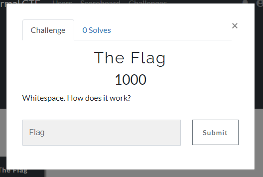

7 月 18 日から 7 月 20 日にかけて開催された [UIUCTF 2020](https://sigpwny.com/uiuctf) に、チーム zer0pts として参加しました。最終的にチームで 4480 点を獲得し、順位は 20 点以上得点した 390 チーム中 5 位でした。うち、私は 11 問を解いて 1350 点を入れました。

他のメンバーが書いた write-up はこちら。

- [UIUCTF 2020 writeup - ふるつき](https://furutsuki.hatenablog.com/entry/2020/07/20/142730)
- [UIUCTF 2020 Writeup - CTFするぞ](https://ptr-yudai.hatenablog.com/entry/2020/07/20/153619)

以下、私が解いた問題の write-up です。

## [Forensics 100] Raymonds Recovery (133 solves)
> Uh-oh! Someone corrupted all my important files and now I can’t open any of them. I really need one of them in particular, a png of something very important. Please help me recover it!
> 
> Here, take this ext4 filesystem and see what you can find. If you can figure out which file it is and how to fix it, you’ll get something in return!
> 
> 添付ファイル: raymonds_fs

与えられた `raymonds_fs` がどのようなファイルか、`file` コマンドで確認してみましょう。

```
$ file raymonds_fs
raymonds_fs: Linux rev 1.0 ext4 filesystem data, UUID=95d5e887-2606-4770-a3fe-717a6e8705f8 (extents) (large files) (huge files)
```

ext4 のファイルシステムのデータのようです。FTK Imager でこのファイルを開いてみたところ、`7e8bc0dde7339e79edf3a1627ce76b50` や `also_not_the_flag` といった謎のファイルが含まれていることが確認できました。これらを抽出しておきましょう。


それぞれどのようなファイルか `file` コマンドで確認してみましたが、`data` とどのような形式であるかわからないものがほとんどのようです。

```
$ file *
7e8bc0dde7339e79edf3a1627ce76b50:    data
I_love_my_fans:                      data
also_not_the_flag:                   data
another_nice_drawing:                data
art_at_its_finest:                   data
blathers:                            data
cool_hat:                            JPEG image data, JFIF standard 1.01, resolution (DPI), density 350x350, segment length 16, progressive, precision 8, 1600x1200, frames 3
definitely_not_the_flag:             data
even_MORE_fancy:                     JPEG image data, baseline, precision 8, 700x700, frames 3
even_more_fanart:                    data
︙
```

どのようなファイルか、試しに `I_love_my_fans` を `xxd` コマンドで見てみましょう。

```
$ xxd I_love_my_fans | head
0000000: e000 104a 4649 4600 0101 0000 0100 0100  ...JFIF.........
0000010: 00ff db00 8400 0906 0712 1312 1512 1212  ................
0000020: 1515 1515 1515 1515 1515 1515 1515 1615  ................
0000030: 1515 1717 1515 1515 181d 2820 181a 251d  ..........( ..%.
0000040: 1515 2131 2125 292b 2e2e 2e17 1f33 3833  ..!1!%)+.....383
0000050: 2d37 282d 2e2b 010a 0a0a 0e0d 0e15 1010  -7(-.+..........
0000060: 172b 1d17 1d2d 2e2d 2d2d 2d2d 2d2d 2d2b  .+...-.--------+
0000070: 2b2d 2d2d 2d2b 2d2d 2d2d 2d2b 2b2b 2d2b  +----+-----+++-+
0000080: 2d2b 2d2d 2b2b 2d2d 2d2d 2d2d 2d2d 2d2d  -+--++----------
0000090: 372d 2d2b 2d2d 2dff c000 1108 0103 00c2  7--+---.........
```

`JFIF` という特徴的なバイト列から JPEG 形式であることが推測できますが、`FF D8` というマジックナンバーから始まっていないために JPEG とは判断されなかったようです。`E0` というのは `FF E0` という APP0 マーカーの断片でしょう。先頭に `FF D8 FF` を付け加えて Web ブラウザで開いてみると、画像として開くことができました。

この調子で `file` コマンドでは形式が判断できなかったファイルを修復していきます。`my_fav_art` というファイルは `JFIF` というバイト列が含まれておらず、JPEG ではないことがわかります。が、`IHDR` や `sRGB` といったチャンク名から PNG とわかります。

```
$ xxd my_fav_art | head
0000000: 0000 000d 4948 4452 0000 0280 0000 0280  ....IHDR........
0000010: 0806 0000 000c cdc9 2300 0000 0173 5247  ........#....sRG
0000020: 4200 aece 1ce9 0000 00c4 6558 4966 4d4d  B.........eXIfMM
0000030: 002a 0000 0008 0007 010e 0002 0000 0019  .*..............
0000040: 0000 0062 0112 0003 0000 0001 0001 0000  ...b............
0000050: 011a 0005 0000 0001 0000 007c 011b 0005  ...........|....
0000060: 0000 0001 0000 0084 0128 0003 0000 0001  .........(......
0000070: 0002 0000 013b 0002 0000 000d 0000 008c  .....;..........
0000080: 8769 0004 0000 0001 0000 009a 0000 0000  .i..............
0000090: 6874 7470 3a2f 2f77 7777 2e70 6466 2d74  http://www.pdf-t
```

PNG のマジックナンバーである `89 50 4E 47 0D 0A 1A 0A` を先頭に追加すると画像として開くことができ、フラグを見ることができました。


```
uiuctf{everyb0dy_l0ves_raym0nd}
```

## [Forensics 350] Zip Heck (12 solves)
> I zipped up the flag a few times for extra security.
> 
> The intended solution runs in under 10 minutes on a typical computer.
> 
> Author: kuilin
> 
> 添付ファイル: flag.zip

与えられた `flag.zip` を展開すると、中から `flag.zip` が出てきました。出てきた `flag.zip` を展開するとさらに `flag.zip` が出てきて、それを展開すると…と、マトリョーシカのようになっているようです。

展開を自動化するスクリプトを書きましょう。

```python
import io
import zipfile

with open('flag.zip', 'rb') as f:
  s = f.read()

i = 0
try:
  while True:
    zip = zipfile.ZipFile(io.BytesIO(s))
    print(i, zip.infolist())

    with zip.open('flag.zip') as f:
      s = f.read()

    i += 1
except:
  print('exited:', i)
  with open('tmp.bin', 'wb') as f:
    f.write(s)
```

これを走らせてみましたが、1 万回以上展開してもまだ数十 MB のファイルサイズを保っています。問題文でも普通なら 10 分で終わると言われていますから、さすがにおかしいと思い出力結果を見てみると、不思議な点が見つかりました。

```
$ python extract.py
0 [<ZipInfo filename='flag.zip' compress_type=deflate file_size=61350811 compress_size=61368967>]
1 [<ZipInfo filename='flag.zip' compress_type=deflate file_size=61332413 compress_size=61350665>]
2 [<ZipInfo filename='flag.zip' compress_type=deflate file_size=61314159 compress_size=61332267>]
3 [<ZipInfo filename='flag.zip' compress_type=deflate file_size=61295791 compress_size=61314013>]
4 [<ZipInfo filename='flag.zip' compress_type=deflate file_size=61277405 compress_size=61295645>]
︙
885 [<ZipInfo filename='flag.zip' compress_type=deflate file_size=47084853 compress_size=47098853>]
886 [<ZipInfo filename='flag.zip' compress_type=deflate file_size=47075775 compress_size=47084707>]
887 [<ZipInfo filename='flag.zip' compress_type=deflate file_size=47207829 compress_size=47075629>]
888 [<ZipInfo filename='flag.zip' file_size=47207683>]
889 [<ZipInfo filename='flag.zip' file_size=47207537>]
890 [<ZipInfo filename='flag.zip' file_size=47207391>]
```

`i=888` あたりから無圧縮の状態で `flag.zip` が格納されているパターンが交じっていることがわかります。この後の出力も見ていると、Deflate で圧縮されているパターンもときどき交じっていることがわかります。

無圧縮で格納されているパターンが連続しているときに、ヘッダなどは飛ばして Deflate で圧縮されている部分だけを抽出することはできないでしょうか。スクリプトを書いてみましょう。

```python
import io
import zipfile

with open('flag.zip', 'rb') as f:
  s = f.read()

i = 0
try:
  while True:
    if s.startswith(b'PK\x03\x04\x14\0\0\0\0'):
      s = s[s.index(b'PK\x03\x04\x14\0\0\0\x08'):]
      j = s.index(b'PK\x05\x06')
      s = s[:s.index(b'PK\x05\x06', j + 1)]

    zip = zipfile.ZipFile(io.BytesIO(s))
    if 'flag.zip' not in zip.namelist():
      raise Exception('owata')
    print(i, zip.infolist())

    with zip.open('flag.zip') as f:
      s = f.read()

    i += 1
except:
  print('exited:', i)
  with open('tmp.bin', 'wb') as f:
    f.write(s)
```

実行します。

```
$ python extract.py
︙
2520 [<ZipInfo filename='flag.zip' compress_type=deflate file_size=213562 compress_size=60874>]
2521 [<ZipInfo filename='flag.zip' compress_type=deflate file_size=173912 compress_size=39822>]
2522 [<ZipInfo filename='flag.zip' compress_type=deflate file_size=159760 compress_size=22364>]
exited: 2523
$ unzip tmp.bin
Archive:  tmp.bin
made for uiuctf by kuilin : …
  inflating: flag.txt

$ cat flag.txt
uiuctf{tortoises_all_the_way_down}
```

フラグが得られました。

```
uiuctf{tortoises_all_the_way_down}
```

## [Web 100] security_question (250 solves)
> Someone just asked a very interesting question online. Can you help them solve their problem?
> 
> (URL)
> 
> author: Husincostan

与えられた URL にアクセスすると、Stack Overflow…ではなくそのコピーサイトの質問が表示されました。


これは Flask のコードの一部でしょう。`/getpoem` という、GET パラメータで与えたファイルを開くエンドポイントの処理が書かれています。質問文を見るに、このエンドポイントに存在する脆弱性を使ってルートディレクトリの `hidden_poem.txt` を読めばよいのでしょう。

`..` が GET パラメータに入っていないかチェックされており、パストラバーサルはできなさそうに見えますが、もし `/hoge` のように `/` から始まるファイル名が与えられた場合にはどうでしょうか。検証してみましょう。

```
$ python3
Python 3.6.9 (default, Apr 18 2020, 01:56:04) 
[GCC 8.4.0] on linux
Type "help", "copyright", "credits" or "license" for more information.
>>> import os
>>> import os.path
>>> poemdir = os.path.join(os.getcwd(), 'poems')
>>> poemdir
'/tmp/tmpspace.QSS30SnupE/poems'
>>>
>>> os.path.join(poemdir, 'a.txt')
'/tmp/tmpspace.QSS30SnupE/poems/a.txt'
>>> os.path.join(poemdir, '/a.txt')
'/a.txt'
```

なるほど、`os.path.join` は `/` が連続で続くとルートディレクトリにまで遡るという挙動をするようです。これで `/hidden_poem.txt` が読めないか試してみましょう。

```
$ curl "https://(省略)/getpoem?name=/hidden_poem.txt"
uiuctf{str_join_is_weird_in_python_3}
```

フラグが得られました。

```
uiuctf{str_join_is_weird_in_python_3}
```

## [Web 100] Just a Normal CTF (113 solves)
> Do NOT use sensitive passwords on this site. You can use a fake email if you want, too.
> 
> (URL)
> 
> Author: tow_nater

与えられた URL にアクセスすると、以下のように [CTFd](https://github.com/CTFd/CTFd) を使った CTF プラットフォームが表示されました。


適当なユーザ名とメールアドレスで登録して問題一覧を見てみると、`The Flag` という謎のエスパー問題だけがありました。この問題のフラグをなんとかして手に入れろということでしょうか。



CTFd で最近脆弱性が見つかっていないか探してみたところ、[CVE-2020-7245](https://nvd.nist.gov/vuln/detail/CVE-2020-7245) がありました。登録時のユーザ名の不適当なバリデーションのために、ユーザ名さえわかっていれば任意のアカウントを奪い取ることができるという脆弱性のようです。

ユーザ一覧を見てみると `admin` というめちゃくちゃ怪しいユーザの存在が確認できました。CVE-2020-7245 を使ってアカウントを奪い取ってみましょう。まずアカウントを奪い取る手順を確認します。

> To exploit the vulnerability, one must register with a username identical to the victim's username, but with white space inserted before and/or after the username. This will register the account with the same username as the victim. After initiating a password reset for the new account, CTFd will reset the victim's account password due to the username collision.
> 
> [https://nvd.nist.gov/vuln/detail/CVE-2020-7245](https://nvd.nist.gov/vuln/detail/CVE-2020-7245)

`admin          ` と `admin` の後ろに半角スペースを複数つけたユーザ名と、 `neko@example.com` というメールアドレスでユーザ登録をします。ログアウト後にパスワードのリセットフォームを開き、`neko@example.com` というメールアドレスを入力してパスワードをリセットすると、なんと今変更したパスワードを使って `admin` としてログインすることができました。

問題の管理ページから `The Flag` のフラグを得ることができました。


```
uiuctf{defeating_security_with_a_spacebar!}
```

## [Web 200] login_page (20 solves)
> I came across this login page running sqlite and was told there was a flag behind it. Can you find it?
> 
> (URL)
> 
> Author: Husnain

与えられた URL にアクセスすると、以下のようにログインフォームとユーザの検索フォームへのリンクが表示されました。


SQL インジェクションを疑ってログインフォームに `"` や `'` などを入力してみましたが、反応はありません。ログインフォームは脆弱ではないようです。

ユーザの検索フォームでは、適当な文字列を入力すると、その文字列をユーザ名に含むユーザの自己紹介が表示されました。`%` を入力すると全ユーザの情報が表示されたことから、SQL の `LIKE` 句にユーザ入力が挿入されていることが推測できます。


SQLi はどうでしょうか。`"/**/union/**/select/**/1,2;--` を入力すると以下のように出力されました。検索フォームは SQLi ができるようです。


`"/**/union/**/select/**/1,sqlite_version();--` を入力すると `3.27.2` が出力されたことから、SQLite3 が使われていると推測できます。

`"union/**/select/**/sql/**/,2/**/from/**/sqlite_master;--` を入力すると、`CREATE TABLE users ( username text primary key not null, password_hash text not null, hint text not null, bio text not null)` と出力され、`hint` や `password_hash` といったカラムがユーザ情報を格納しているテーブルに存在していることがわかりました。

`"and(0)union/**/select/**/username||':'||password_hash/**/,hint/**/from/**/users;--` を入力してパスワードのハッシュ値とヒントを抜き出してみましょう。


これらのハッシュ値をクラックすればよいのでしょうか。Web 問とは…。

まず全てのハッシュ値を [CrackStation](https://crackstation.net/) に投げてみたところ `noob` のパスワードだけがわかり、これは `SoccerMom2007` であるということでした。この認証情報を使ってログインしてみると、`You have successfully logged in! Here's part 0 of the flag: uiuctf{Dump` と表示されました。全てのアカウントのパスワードをクラックしないとダメそうです。

`alice` のパスワードを [hashcat](https://hashcat.net/hashcat/) でクラックします。`hashcat -m 0 530bd2d24bff2d77276c4117dc1fc719 -a 3 -w 3 ?d?d?d-?d?d?d-?d?d?d?d` を実行してしばらく待つと `704-186-9744` がパスワードであるとわかりました。`alice` でログインすると `You have successfully logged in! Here's part 1 of the flag: _4nd_un` と出力されました。

`bob` のパスワードをクラックします。`hashcat -m 2600 4106716ae604fba94f1c05318f87e063 -a 3 -w 3 ?d?d?d?d?d?d?d?d?d?d?d?d` を実行してしばらく待つと `5809be03c7cc31cdb12237d0bd718898` (`md5(102420484096)`) がパスワードであるとわかりました。`bob` でログインすると `You have successfully logged in! Here's part 2 of the flag: h45h_63` と出力されました。

`carl` のパスワードをクラックします。Wikipedia などを参考にして辞書を作成し、`hashcat -m 0 661ded81b6b99758643f19517a468331 -a 0 dict.txt` を実行してしばらく待つと `DionysusDelaware` がパスワードであるとわかりました。`carl` でログインすると `You have successfully logged in! Here's part 3 of the flag: 7_d4t_` と出力されました。

`dania` のパスワードをクラックします。ヒントの文章を Google 翻訳に投げると `My favorite animal (6 Arabic characters only)` という意味であるとわかりました。6 文字のアラビア文字ならブルートフォースが現実的な時間でできそうです。スクリプトを書いてみましょう。

```python
import hashlib
import itertools

arabic_chars = b"\xD8\xA7",b"\xD8\xA8",b"\xD8\xA9",b"\xD8\xAA",b"\xD8\xAB",b"\xD8\xAC",b"\xD8\xAD",b"\xD8\xAE",b"\xD8\xAF",b"\xD8\xB0",b"\xD8\xB1",b"\xD8\xB2",b"\xD8\xB3",b"\xD8\xB4",b"\xD8\xB5",b"\xD8\xB6",b"\xD8\xB7",b"\xD8\xB8",b"\xD8\xB9",b"\xD8\xBA",b"\xD9\x81",b"\xD9\x82",b"\xD9\x83",b"\xD9\x84",b"\xD9\x85",b"\xD9\x86",b"\xD9\x87",b"\xD9\x88",b"\xD9\x8A"
for a in itertools.product(arabic_chars, repeat=6):
  t = b''.join(a)
  if hashlib.md5(t).hexdigest() == '58970d579d25f7288599fcd709b3ded3':
    print(t)
    break
```

実行すると `طاووسة` (クジャク) がパスワードであるとわかりました。`dania` でログインすると `You have successfully logged in! Here's part 4 of the flag: c45h}` と出力されました。

```
uiuctf{Dump_4nd_unh45h_637_d4t_c45h}
```

## [Web 200] nookstop 2.0 (10 solves)
> Okay okay, they got back to me and they tell me that we're using some new technology. Can you give it a try now?
> 
> (URL)
> 
> author: ian5v

この問題は別の Web 問である nookstop の続きでした。nookstop がどのような問題であったかは、[ふるつきさんの write-up](https://furutsuki.hatenablog.com/entry/2020/07/20/142730#web-nookstop) を参照ください。

与えられた URL にアクセスして `secret_backend_service=true` を Cookie にセットし更新すると、`Access (Beta)` という謎のボタンが出現しました。これをクリックすると以下のような画面が表示されました。


ページのタイトルは `Emscripten-Generated Code` になっています。DevTools の Network タブを見ると `index.wasm` がダウンロードされており、このページでは WebAssembly が使われていることがわかります。

`index.wasm` の後に `flag` というファイルもダウンロードされていましたが、こちらは暗号化されているようです。

```
$ xxd flag
0000000: 6781 868a 7d7c c8ed 0fd7 ad59 2964 1a5e  g...}|.....Y)d.^
```

`Your account number has been successfully transmitted using the latest XOR encryption` と、なにかの暗号化に XOR が使われているらしいことが気になります。`flag` の暗号化にも XOR が使われているのでしょうか。だとすると、`index.wasm` に鍵がハードコードされていたりしないでしょうか。

`flag` の先頭 7 バイトとフラグフォーマットである `uiuctf{` を XOR すると `12 E8 F3 E9 09 1A B3` になります。このバイト列を `index.wasm` で探してみると、なんと見つかりました。


この 16 バイトのバイト列と `flag` を XOR してみましょう。

```
>>> from pwn import *
>>> import requests
>>> s = requests.get("https://(省略)/flag").content
>>> xor(s, '12 E8 F3 E9 09 1A B3 8F 3E BB C1 68 19 0A 69 23'.replace(' ', '').decode('hex'))
'uiuctf{b1ll10ns}'
```

フラグが得られました。

```
uiuctf{b1ll10ns}
```

## [OSINT 40] Isabelle's Bad Opsec 1 (87 solves)
> Isabelle has some really bad opsec! She left some code up on a repo that definitely shouldnt be public. Find the naughty code and claim your prize.
> 
> Finishing the warmup OSINT chal will really help with this chal
> 
> The first two characters of the internal of this flag are 'c0', it may not be plaintext Additionally, the flag format may not be standard capitalization. Please be aware
> 
> Made By: Thomas

問題文の `She left some code up on a repo that definitely shouldnt be public.` あたりから Isabelle は GitHub などのサービスを使っているであろうことが推測できます。

[GitHub で `Isabelle` というユーザを検索](https://github.com/search?o=desc&q=Isabelle&s=joined&type=Users)してみたところ、最近作成された [IsabelleOnSecurity](https://github.com/IsabelleOnSecurity) というめちゃくちゃ怪しいアカウントが見つかりました。

[`IsabelleOnSecurity/mimidogz`](https://github.com/IsabelleOnSecurity/mimidogz) というリポジトリのコミットログを眺めていると、[updated dogz.py, not as important · IsabelleOnSecurity/mimidogz@e20ff4a](https://github.com/IsabelleOnSecurity/mimidogz/commit/e20ff4a29dff94b67217fb49f8144b9b813242ad#diff-5a3ea3fddb75a0cce68f3f87f99f4281R41) という Base64 エンコードされた文字列を追加しているコミットが見つかりました。これをデコードするとフラグが得られました。

```
uiuctf{c0mM1t_to_your_dr3@m5!}
```

## [Warmup 20] Starter OSINT (95 solves)
> Our friend isabelle has recently gotten into cybersecurity, she made a point of it by rampantly tweeting about it. Maybe you can find some useful information ;).
> 
> While you may not need it, IsabelleBot has information that applies to this challenge.
> 
> Finishing the warmup OSINT chal will really help with all the other osint chals
> 
> The first two characters of the internal of this flag are 'g0', it may not be plaintext
> 
> Made By: Thomas (I like OSINT)

`Isabelle's Bad Opsec 1` で見つかった GitHub アカウントのプロフィールには、[@hackerisabelle](https://twitter.com/hackerisabelle) という Twitter アカウントへのリンクがありました。

このアカウントのツイートを片っ端から見ていくと、フラグが見つかりました。

<blockquote class="twitter-tweet"><p lang="en" dir="ltr"><a href="https://twitter.com/animalcrossing?ref_src=twsrc%5Etfw">@animalcrossing</a> u i u c t f { g00d_w@rmup_y3s_Ye5 }<br><br>remove all the spaces you know how this works</p>&mdash; epichackerisabelle (@hackerisabelle) <a href="https://twitter.com/hackerisabelle/status/1283508595741667333?ref_src=twsrc%5Etfw">July 15, 2020</a></blockquote> <script async src="https://platform.twitter.com/widgets.js" charset="utf-8"></script>

```
uiuctf{g00d_w@rmup_y3s_Ye5}
```

## [OSINT 40] Isabelle's Bad Opsec 2 (81 solves)
> Wow holy heck Isabelle's OPSEC is really bad. She was trying to make a custom youtube api but it didnt work. Can you find her channel??
> 
> Finishing Isabelle's Opsec 1 will may you with this challenge
> 
> The first two characters of the internal of this flag are 'l3', it may not be plaintext Additionally, the flag format may not be standard capitalization. Please be aware
> 
> Made By: Thomas

`Isabelle's Bad Opsec 1` で見つかった GitHub アカウントは [`IsabelleOnSecurity/api-stuff`](https://github.com/IsabelleOnSecurity/api-stuff) という YouTube の API を触るコードが含まれているリポジトリを持っていました。

このリポジトリのコミットログを眺めていると、[quickstart.stop · IsabelleOnSecurity/api-stuff@115438b](https://github.com/IsabelleOnSecurity/api-stuff/commit/115438b1b04324c931329e5a5296c54ed310db17#diff-43cf94ff007d5401ad84f837dd216cd5R112) という YouTube のチャンネル ID を追加しているコミットが見つかりました。これは [EliteHackerIsabelle1337](https://www.youtube.com/channel/UCnL8vVmpKY8ZmfSwoikavHQ) という YouTube のチャンネルの ID のようです。

[チャンネルの概要](https://www.youtube.com/channel/UCnL8vVmpKY8ZmfSwoikavHQ/about)を見ていると、設定されているリンクのうち `My website` の URL が `https://uiuc.tf/?flag=uiuctf%7Bl3g3nd_oF_zeld@_m0re_like_l3gend_0f_l1nk!%7D` になっておりフラグが含まれていることに気づきました。

```
uiuctf{l3g3nd_oF_zeld@_m0re_like_l3gend_0f_l1nk!}
```

## [OSINT 100] Isabelle's Bad Opsec 4 (21 solves)
> Isabelle hid one more secret somewhere on her youtube channel! Can you find it!?
> 
> Finishing previous OSINT Chals will assist you with this challenge
> 
> The first two characters of the internal of this flag are 'th', it may not be plaintext
> 
> Additionally, the flag format may not be standard capitalization. Please be aware
> 
> Made By: Thomas [Authors Note] I love this chal because I used it IRL to find out who someone cyberbullying a friend was. It's real OSINT -Thomas

`Isabelle's Bad Opsec 2` で見つけた YouTube アカウントについてもっと調べればよさそうです。

[YouTube Metadata](https://mattw.io/youtube-metadata/) という、YouTube のチャンネル ID を投げるとそのチャンネルの様々な情報を出力してくれる Web サイトを使うと、チャンネルのタグ、バナーやアイコンの URL など様々な情報を得ることができました。

YouTube チャンネルのページの上部に表示されるバナーは、タブレットや TV など画面サイズに合わせて複数のサイズの画像が用意されています。片っ端から見ていくと、[1920 x 1080 のバナー](https://yt3.ggpht.com/uZBHjnD_UK_VWCtV2af8BoBDIfhG2G3G-qFv_T1Tq59MumhKlc3puzFd_mP5OQJr0m2qEePMUck=w1920-fcrop64=1,00000000ffffffff-k-c0xffffffff-no-nd-rj)の下部にフラグが書かれていました。

```
uiuctf{this_flag_is_not_cake_on_the_inside}
```

## [OSINT 100] Isabelle's Bad Opsec 5 (32 solves)
> Isabelle had one more secret on her youtube account, but it was embarrassing.
> 
> Finishing previous OSINT Chals will assist you with this challenge
> 
> The first two characters of the internal of this flag are 'hi', it may not be plaintext
> 
> The flag capitalization may be different, please be aware

`Isabelle's Bad Opsec 2` で見つけた YouTube アカウントについてもっと調べればよさそうです。

Internet Archive の [Wayback Machine](https://archive.org/web/) で過去のチャンネルの概要を見てみると、設定されているリンクのうち `My website` の URL が以前は `http://uiuc.tf/?flag=UIUCTF%7Bhidd3n_buT_neVeR_g0n3%7D` であったことがわかりました。

```
UIUCTF{hidd3n_buT_neVeR_g0n3}
```