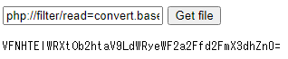

9 月 21 日に 1 時間 15 分だけ開催された [TSG LIVE! CTF](https://live-ctf.tsg.ne.jp/) に、チーム yoshikingdom の ptr-yoda として参加しました。最終的にチームで 1150 点を獲得し、順位は 1 位でした。うち、私は 2 問を解いて 350 点を入れました。

以下、私の write-up です。

## [Web 200] WAF
> WAFってやつが情報漏洩対策にいいらしいですよ。
> 
> (URL)
> 
> 添付ファイル: default.conf, docker-compose.yml, index.php

`docker-compose.yml` を確認します。

```
version: '3'
services:
  waf:
    image: cdue/nginx-subs-filter
    ports:
      - "60004:80"
    volumes:
      - ./default.conf:/etc/nginx/conf.d/default.conf:ro
    command: nginx -g "daemon off; load_module /etc/nginx/modules/ngx_http_subs_filter_module.so;"
    depends_on:
      - php
  php:
    image: php:7-fpm
    volumes:
      - ./index.php:/code/index.php:ro
      - ./flag:/tmp/flag:ro
```

`/tmp/flag` にフラグが設置されているようです。

nginx の設定ファイルである `default.conf` を確認します。

```
server {
    root /code;
    try_files $uri $uri/ /index.php$is_args$args;

    subs_filter TSGLIVE\{.+?\} "### CENSORED ###" irg;

    location ~ \.php$ {
        fastcgi_pass php:9000;
        fastcgi_index index.php;
        include fastcgi_params;
        fastcgi_param SCRIPT_FILENAME $document_root$fastcgi_script_name;
        fastcgi_param PATH_INFO $fastcgi_path_info;
    }
}
```

`subs_filter TSGLIVE\{.+?\} "### CENSORED ###" irg;` と、レスポンスにフラグを含む文字列があれば削除されてしまうようです。

`index.php` を確認します。

```php
<form method="GET">
  <input name="file" type="text" value="<?= $_GET['file'] ?: 'index.php' ?>">
  <button type="submit">Get file</button>
</form>
<?php
if (isset($_GET['file'])) {
  echo '<pre>';
  echo htmlspecialchars(file_get_contents($_GET['file']));
  echo '</pre>';
}
```

`file_get_contents($_GET['file'])` と GET パラメータを操作すれば好きなファイルの内容を表示することができそうです。が、`/tmp/flag` を入力しても先程の nginx のフィルターのためにフラグ部分は削除されてしまいます。

[`php://filter`](https://www.php.net/manual/ja/wrappers.php.php#wrappers.php.filter) というラッパーをファイルのパスの前に置いて、`/tmp/flag` をBase64 エンコードさせた上で表示させてみましょう。

`php://filter/read=convert.base64-encode/resource=/tmp/flag` を GET パラメータに入力すると、以下のように表示されました。



これを Base64 デコードするとフラグが得られました。

```
TSGLIVE{Nohmi_Kudryavka_waf_waf}
```

## [Crpto 150] HashedRotato
> Our hash function passed the famous test BigCrush, so it's a very good hash!
> 
> (問題サーバへの接続情報)
> 
> 添付ファイル: main.py

`main.py` は以下のような内容でした。

```python
def hash(in_bytes):
    x = int.from_bytes(in_bytes, byteorder='big')
    mask = (1 << 64) - 1
    while x > mask:
        x = (x >> 64) ^ (x & mask)
    x += 12909679346385862882
    x &= mask
    x ^= x >> 30
    x *= 5820690703483732803
    x &= mask
    x ^= x >> 27
    x *= 15893541517945753873
    x &= mask
    return x ^ (x >> 31)


flag = open('flag.txt', 'rb').read()
hashed_flag = hash(flag)

print('Hi!', end=' ')
for i in range(100):
    attempt = hash(input('Do you really know the flag?:\n').encode('ascii'))
    if hashed_flag == attempt:
        print(f'Great! You know the flag: {flag}')
        exit(0)
    else:
        print(f'Hash mismatch.\nflag hash is {hashed_flag:x}, but given is {attempt:x}')
print("Too many tries. You don't know the flag!")
```

`hash` は文字列を 64 ビットのハッシュ値に変えてくれる関数のようです。フラグのハッシュ値 (`6a70bd1d2f2a4165`) が与えられるので、同じハッシュ値になる ASCII 範囲内の文字列を入力すればフラグが表示されるようです。

`hash` では XOR やらなんやらめんどくさそうなことがされており、とても処理を追う気にはなれません。z3 で殴りましょう。

```python
from z3 import *

keta = 9

def hash(x):
    mask = (1 << 64) - 1
    
    for _ in range((keta - 1) // 8):
      x = (x >> 64) ^ (x & mask)
    
    x += 12909679346385862882
    x &= mask
    x ^= x >> 30
    x *= 5820690703483732803
    x &= mask
    x ^= x >> 27
    x *= 15893541517945753873
    x &= mask
    return x ^ (x >> 31)

x = BitVec('x', 64 * 3)
s = Solver()
s.add(hash(x) == 0x6a70bd1d2f2a4165)
s.add(x < (1 << 64) - 1)

for i in range(keta):
  y = (x & (0xff << (8 * i))) >> (8 * i)
  s.add(Or(And(0x20 < y, y < 0x7f)))

r = s.check()
m = s.model()

h = hex(m[x].as_long())[2:-1]
print h
```

実行します。

```
$ python2 aaaaaa.py
8000000000000000553368723e2d59643330263f34266154
```

`553368723e2d59643330263f34266154` をデコードして問題サーバに投げてみましょう。

```
$ python2 -c "print '553368723e2d59643330263f34266154'.decode('hex')" | nc (省略)
Hi! Do you really know the flag?:
Great! You know the flag: b'TSGLIVE{9oOD_PRN9_doEsNT_meaN_5Ecure_PRNG...M4ybe_You_aLreADy_kN3W}'
```

フラグが得られました。

```
TSGLIVE{9oOD_PRN9_doEsNT_meaN_5Ecure_PRNG...M4ybe_You_aLreADy_kN3W}
```