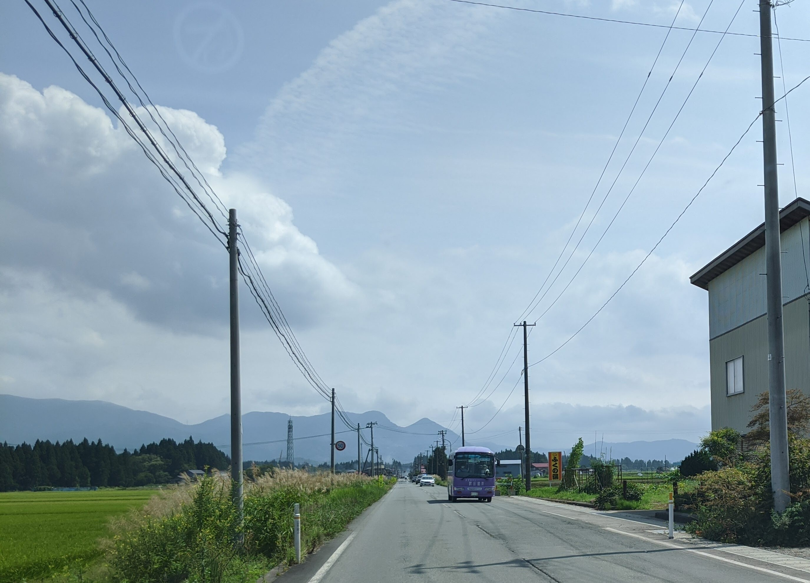

10 月 31 日に開催された [Open xINT CTF 2020](http://xintctf.wpblog.jp/) に、ひとりチーム \_(:3」∠)\_ として参加しました。最終的に 10 問を解いて 2300 点を獲得し、順位は 100 点以上得点した 116 チーム中 1 位でした。

以下、私が解いた問題の write-up (Speed Lover と Speed Lover Easy を除く) です。

## [BUS 200] Easy Bus (69 solves)
> この写真の場所近くに、バス停がある。バス停に書かれてあるバス停名は？
> 
> -----------------------------------
> 
> There's a bus stop nearby. What's the name of the bus stop? Answer the name written on it.
> 
> 添付ファイル: easybus.jpg

以下のような画像が与えられました。



写真に写り込んでいる情報を確認します。


山形県でこの写真が撮影されたようです。


「ふくの湯」という看板があります。山形県に存在する「ふくの湯」は (私が調べた限りでは) 尾花沢市の「花笠温泉 ふくの湯」のみのようです。


特徴的なバスです。書かれている文字は金文体のようですが、文字が潰れてしまっていて前半部分は読み取れません。後半部分は「温泉」でしょう。

雑に「花笠温泉 バス」でググるとこれは「[はながさバス](http://www.hanagasa-bus-taisei.co.jp/product1.html)」のバスであることがわかります。また、[時刻表](http://www.hanagasa-bus-taisei.co.jp/base.html)を見ると先程の潰れていた文字は「銀山温泉」であることがわかります。

しかしながら、この時刻表に載っているバス停のどれも、Google Map のストリートビューで見る限り写真の撮影地ではなさそうです。困って花笠温泉ふくの湯のあたりを通るバスを探していると、[銀山線](https://busmap.info/busstop/34724/)というまさに花笠温泉ふくの湯の目の前を通る路線が見つかりました。

とりあえず、近いバス停である「中の段北」と「西原」の両方を試したところ、西原が正解でした。

```
西原
```

## [DarkWeb 100] Easy Onion (27 solves)
> u6ra3igsfurmotk2.onion に関連するIPアドレスを突き止めろ
> 
> -----------------------------------
> 
> Find real server IP address of u6ra3igsfurmotk2.onion.

[FOFA](https://fofa.so/) で `u6ra3igsfurmotk2.onion` を検索すると `51.15.97.245` がヒットしました。HTTP レスポンスヘッダを確認すると `Onion-Location: http://u6ra3igsfurmotk2.onion/` とあり、この IP アドレスが `u6ra3igsfurmotk2.onion` に関連しているものとわかります。

```
51.15.97.245
```

## [DarkWeb 300] 🍳Kyoto-Cool #1 (5 solves)
> 当局は違法なAVサイトの運営者を摘発したいと考えている。
しかし、このサイトはダークウェブ上に存在し、当局では足取りがつかめていない。
そこで、貴殿にはこのサイトのサーバのIPアドレスを特定してほしい。
> 
> http://pd5esw55yrib6yvm.onion/
> 
> ※FLAGはサーバのIPアドレス
> 
> -----------------------------------
> 
> A law enforcement authority wants to expose this illegal porn site's owner. However, the site exists on the dark web, and they were not able to trace it. First of all, please identify the server's IP address.  
> http://pd5esw55yrib6yvm.onion/

与えられた URL にアクセスすると、AV (Animal Video) が紹介されている Web サイトが表示されました。会員用のログインページもありますが、`guest:guest` や `admin:admin` など色々なパターンで試してみてもログインできません。ユーザ登録ページもありません。

とりあえずこの Web ページの IP アドレスを得る手段を考えてみましょう。`Host` ヘッダを `hoge` と適当なものに変えてみます。

```
$ torify curl pd5esw55yrib6yvm.onion -H "Host: hoge"
<!DOCTYPE HTML PUBLIC "-//W3C//DTD HTML 3.2 Final//EN">
...
<address>Apache/2.4.29 (Ubuntu) Server at hoge Port 80</address>
</body></html>
```

`Apache/2.4.29 (Ubuntu) Server at hoge Port 80` と `Host` ヘッダに与えた文字列がそのまま表示されています。もし `Host` ヘッダがなければどうなるのでしょうか。

`Host` ヘッダが必須でない HTTP/1.0 を使って、`Host` ヘッダのない HTTP リクエストを送ってみましょう。

```
$ echo -en "GET / HTTP/1.0\r\nConnection: Close\r\n\r\n" | torify nc pd5esw55yrib6yvm.onion 80
HTTP/1.1 200 OK
Date: Sat, 31 Oct 2020 16:14:38 GMT
Server: Apache/2.4.29 (Ubuntu)
Vary: Accept-Encoding
Content-Length: 1022
Connection: close
Content-Type: text/html;charset=UTF-8

<!DOCTYPE HTML PUBLIC "-//W3C//DTD HTML 3.2 Final//EN">
<html>
 <head>
  <title>Index of /</title>
 </head>
 <body>
<h1>Index of /</h1>
  <table>
   <tr><th valign="top"></th><th><a href="?C=N;O=D">Name</a></th><th><a href="?C=M;O=A">Last modified</a></th><th><a href="?C=S;O=A">Size</a></th><th><a href="?C=D;O=A">Description</a></th></tr>
   <tr><th colspan="5"><hr></th></tr>
<tr><td valign="top"></td><td><a href="backup_a17d8eef8a2e225db2dddbaa39397144.zip">backup_a17d8eef8a2e225db2dddbaa39397144.zip</a></td><td align="right">2020-10-25 18:16  </td><td align="right"> 32K</td><td>&nbsp;</td></tr>
<tr><td valign="top"></td><td><a href="robots.txt">robots.txt</a></td><td align="right">2020-10-25 20:55  </td><td align="right"> 26 </td><td>&nbsp;</td></tr>
   <tr><th colspan="5"><hr></th></tr>
</table>
<address>Apache/2.4.29 (Ubuntu) Server at 157.7.52.201 Port 80</address>
</body></html>
```

IP アドレスが出てきました。

```
157.7.52.201
```

## [DarkWeb 400] 🍳Kyoto-Cool #2 (3 solves)
> サーバのIPアドレスは特定されたが、それだけでは運営者の情報を得ることはできなかった。  
> 運営者の手がかりを得るために、このサイトの会員ページに潜入調査を試みたいと考えている。  
> 当局は会員のIDを入手することができたが、パスワードの入手には至っていない。  
> そこで、凄腕ハッカーである貴殿にはパスワードを入手してほしい。  
> 
> ※FLAGはID「user@kyoto-cool.local」のパスワード
> 
> -----------------------------------
> 
> Thank you for identifying the server's IP address. Unfortunately, it was not enough to find out who the operator is. Let's dig in deep, infiltrate the site's registration page, and find details.  
> We have the member's ID: now look for the password.

`#1` で `Host` ヘッダを消して Web ページにアクセスしたときに、ディレクトリのインデックスが表示されていました。その中に `backup_a17d8eef8a2e225db2dddbaa39397144.zip` というファイルがあったので、ダウンロードします。

展開しようとしたところ、パスワードが必要だと怒られてしまいました。

```
$ unzip backup_a17d8eef8a2e225db2dddbaa39397144.zip
Archive:  backup_a17d8eef8a2e225db2dddbaa39397144.zip
   creating: kyoto_cool/
[backup_a17d8eef8a2e225db2dddbaa39397144.zip] kyoto_cool/setup-without-docker.md password:
```

暗号化された ZIP ファイルといえば既知平文攻撃です。攻撃のための平文が得られそうなファイルは含まれていないでしょうか。

ZIP ファイルに含まれる `setup-without-docker.md` でググってみると [realpython/cookiecutter-flask-skeleton](https://github.com/realpython/cookiecutter-flask-skeleton) というめっちゃそれっぽいリポジトリが見つかりました。ディレクトリ構造やファイル名などが酷似しています。

この中でファイルサイズがそこそこ大きめな [`project/client/templates/_base.html`](https://github.com/realpython/cookiecutter-flask-skeleton/blob/master/%7B%7Bcookiecutter.app_slug%7D%7D/project/client/templates/_base.html) を使って、`pkcrack` で既知平文攻撃を試みます。

```
$ zip a.zip _base.html
$ pkcrack -C backup_a17d8eef8a2e225db2dddbaa39397144.zip -c kyoto_cool/project/client/templates/_base.html -d decrypted.zip -P a.zip -p _base.html
Files read. Starting stage 1 on Sat Oct 31 15:16:29 2020
Generating 1st generation of possible key2_1047 values...done.
Found 4194304 possible key2-values.
Now we're trying to reduce these...
Done. Left with 9798 possible Values. bestOffset is 24.
Stage 1 completed. Starting stage 2 on Sat Oct 31 15:16:40 2020
Ta-daaaaa! key0=7b815405, key1=189df88d, key2=59bd5856
Probabilistic test succeeded for 1028 bytes.
...
```

攻撃が成功しました。

出力された `decrypted.zip` に含まれるファイルを見ていくと、`kyoto_cool/manage.py` に `user@kyoto-cool.local` のパスワードが含まれていました。

```python
...
@cli.command()
def create_user():
    """Creates the user."""
    db.session.add(User(email="user@kyoto-cool.local", password="Vahxoh3udixeengaita1ues8iuthut0E", admin=False))
    db.session.commit()
...
```

```
Vahxoh3udixeengaita1ues8iuthut0E
```

## [DarkWeb 400] 🍳Kyoto-Cool #3 (3 solves)
> このサイトは会員であれば運営者にコンタクトを取れるようだ。  
> どうにかして、運営者のIPアドレスを特定してほしい。
> 
> ※FLAGは運営者のIPアドレス
> 
> -----------------------------------
> 
> This site seems to allow a member of this site to contact the operator.  
> Identify the IP address of the operator.

`#2` で得られた認証情報を使ってログインすると、以下のように URL の提出フォームが利用できるようになりました。


[Webhook.site](https://webhook.site/) を使って生成した URL を提出してみましたが、アクセスしてくる IP アドレスはどれも [torbulkexitlist](https://check.torproject.org/torbulkexitlist) に載っており、Tor の Exit ノードであることがわかります。

`User-Agent` は `PycURL/7.43.0.5 libcurl/7.58.0 GnuTLS/3.5.18 zlib/1.2.11 libidn2/2.0.4 libpsl/0.19.1 (+libidn2/2.0.4) nghttp2/1.30.0 librtmp/2.3` になっています。

HTTP の通信以外では Tor を利用しているのでしょうか。例えば DNS ではどうでしょうか。[DNSBin](http://requestbin.net/dns) を試してみます。生成されたドメインを先程の提出フォームに投げてみましょう。


生 IP で DNS クエリが飛んできました。

```
54.150.95.155
```

## [BASIC 100] WHOIS (107 solves)
> pinja.xyz の ドメインの作成日時を答えよ。 回答フォーマット: xxxx-xx-xxTxx:xx:xx.xZ
> 
> -----------------------------------
> 
> Answer pinja.xyz domain creation time. format: xxxx-xx-xxTxx:xx:xxZ

`whois` コマンドで確認してみましょう。

```
$ whois pinja.xyz
...
Creation Date: 2020-10-27T03:28:00.0Z
...
```

なるほど。

```
2020-10-27T03:28:00.0Z
```

## [MAP 100] CG (40 solves)
> この写真を撮った場所座標を示せ。Nxx.xxx Exxx.xxx  
> http://www.friend.com.kp/fdata/201907/02969-6.frd
> 
> -----------------------------------
> 
> Where is this location. Nxx.xxx Exxx.xxx

明らかに北朝鮮、それも平壌っぽい写真が与えられました。Google でこの画像を検索すると、[この画像が使われている Web ページ](http://www.pyongyangtimes.com.kp/?page=Culture&no=21357)がヒットしました。「The family of a scientist are so happy after moving into a new home on Mirae Scientists Street.」というキャプションがあり、この通りは「Mirae Scientists Street (未来科学者通り)」であることがわかります。

「未来科学者通り 地図」あたりでググると[平壌地図](http://www2s.biglobe.ne.jp/~yoss/W-map/pyongyangcitymap.html#:~:text=%E5%B9%B3%E5%A3%8C%E5%B8%82%E6%9C%AA%E6%9D%A5%E7%A7%91%E5%AD%A6%E8%80%85%E9%80%9A%E3%82%8A)という Web ページがヒットしました。丁寧なことに未来科学者通りの座標が書かれています。

```
N38.995 E125.736
```

## [MAP 200] GATE (2 solves)
> この門の場所を特定せよ。  
> https://wx3.sinaimg.cn/mw690/673ffc53gy1gk32osyye4j22c03407wj.jpg  
> Nxx.xxxx Exxx.xxxx
> 
> -----------------------------------
> 
> Find this gate location. https://wx3.sinaimg.cn/mw690/673ffc53gy1gk32osyye4j22c03407wj.jpg  
> Nxx.xxxx Exxx.xxxx

門っぽい場所の写真が与えられましたが、文字情報は一切ありません。ですが、`sinaimg.cn` というドメインから撮影地は中国だろうという推測ができます。

画像で検索できる検索エンジンといえば Google、Bing、Yandex あたりがまず思いつきますが、Baidu もそのような機能を提供しています。

与えられた画像で検索してみると、まさにこの場所で撮影されたであろう写真がいくつもヒットしました。どうやら恵州市にある「上围牌坊」という建築物のようです。

さらに「上围牌坊」でググると[観光ガイド的な Web ページ](http://www.bytravel.cn/Landscape/86/shangweipaifang.html)がヒットします。この Web ページには「GPS地理坐标为北纬23°46′29.0″，东经114°09′55.8″」と丁寧にも座標が書かれていました。

```
N23.7747 E114.1654
```